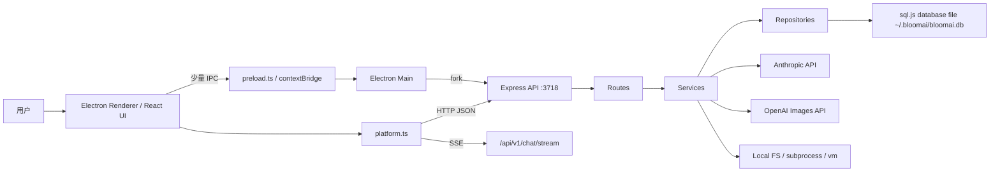
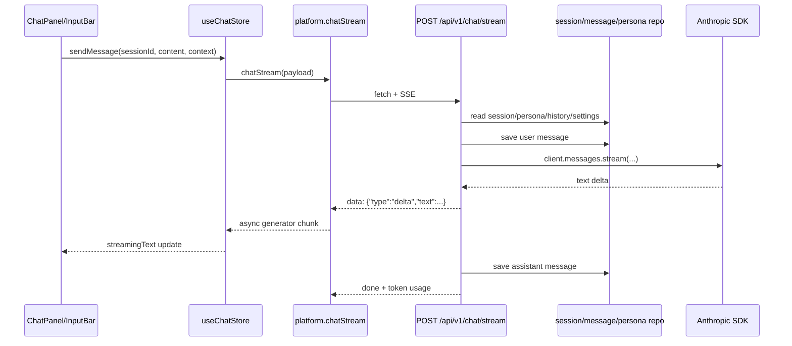
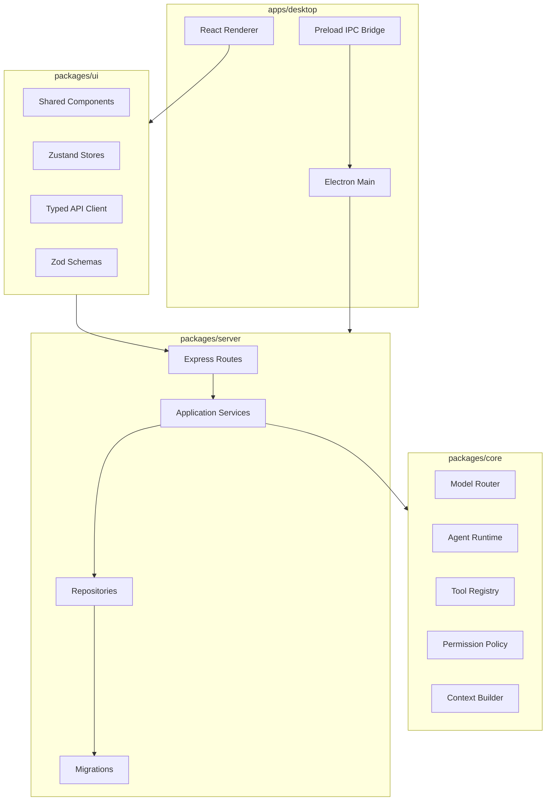

# BloomAI 架构设计分析

> 分析日期：2026-06-23  
> 依据：`docs/BloomAI-roadmap.md`、`README.md`、`apps/desktop`、`packages/server`、`packages/ui` 当前源码。

## 1. 总体判断

BloomAI 当前实现已经形成了一个“本地桌面壳 + 本地 HTTP 服务 + SQLite 文件数据库 + React 工作台”的架构雏形。路线图定义的目标是本地优先 AI 桌面助手，能力从 v0.1 聊天引擎扩展到 v0.2 工具系统和 Skills 市场，再继续演进到 Multi-Agent 与工作流自动化。现有代码基本落在 v0.2 Sprout 阶段：聊天、Persona、设置、工具管理、工具执行、Skills Market 都已具备端到端入口。

真实架构可以概括为：

这不是路线图最初想象的“UI 通过 IPC 与桌面能力深度交互”的形态，而更像一个嵌入到 Electron 内的本地 Web 应用。这个选择有好处：桌面版和未来 Web 版的前端通信模型接近，后端能力可以独立调试；代价是 Electron 主进程与 Express 服务、平台抽象、权限边界之间需要更清楚的契约。

## 2. 当前模块划分

### 2.1 apps/desktop

`apps/desktop` 是当前真正的桌面应用入口，包含 Electron 主进程、preload 桥、Vite Renderer 和完整 v0.2 UI。

关键职责：

- `electron/main.ts`：创建主窗口和悬浮窗口，注册托盘和 `Alt+Space` 全局快捷键，fork 本地 Express 服务。
- `electron/preload.ts`：通过 `contextBridge` 暴露剪贴板、窗口、版本、外链打开等少量原生能力。
- `src/App.tsx`：应用级页面分发，包含 chat、personas、tools、skills、settings、onboarding。
- `src/stores/index.ts`：集中定义 Zustand stores，覆盖会话、聊天、Persona、设置、UI 状态。
- `src/lib/platform.ts`：前端访问后端的统一入口，封装 REST 请求、SSE 聊天流和少量 Electron IPC。

当前桌面端的 UI 主要使用 `apps/desktop/src` 内部代码，而不是直接消费 `packages/ui`。这说明 `packages/ui` 更像早期共享包或 v0.1 副本，尚未成为单一 UI 来源。

### 2.2 packages/server

`packages/server` 是本地能力中心。它通过 Express 提供 `/api/v1/*` API，并在应用启动时初始化数据库和内置 seed 数据。

关键职责：

- `src/app.ts`：创建 Express app，注册 chat、sessions、personas、settings、tools、skills 路由。
- `src/db/client.ts`：初始化 sql.js，加载或保存 `~/.bloomai/bloomai.db`，并内联执行 schema migration 和 seed。
- `src/db/repositories/*`：表级数据访问层，管理 sessions、messages、personas、tools、skills。
- `src/routes/*`：REST 路由层，处理输入、调用 repo/service、返回统一 `{ data }` 或 `{ error }`。
- `src/services/tool.service.ts`：工具执行器，包含 web、fs、document、multimodal、execution 五类工具。
- `src/services/skill.service.ts`：Skill 执行器，支持 `js-function`、`http-api`、`prompt-template` 三种类型。

后端当前承担了三种角色：API 网关、业务服务、数据库迁移与内置数据发布。短期简单直接，长期需要拆分边界。

### 2.3 packages/ui

`packages/ui` 暴露 `App`、stores、platform、utils、schemas 等共享前端能力，但当前内容比 `apps/desktop/src` 少，不包含 v0.2 的 tools 和 skills 页面。它与桌面端存在重复代码，例如 `platform.ts` 和部分基础页面。

这会带来两个架构问题：

- 共享 UI 包没有被桌面端实际作为唯一来源使用，后续容易出现双份实现漂移。
- 路线图强调“Renderer 复用 packages/ui”，但实际主线代码已经偏向 app-local UI。

### 2.4 packages/core 缺位

路线图规划了 `packages/core` 承载平台无关业务逻辑，如 Agent、上下文构建、模型路由、工具注册。但当前仓库没有 `packages/core` 目录。现有业务逻辑主要散落在 `packages/server/src/services` 和 `apps/desktop/src/stores` 中。

这意味着当前架构还没有形成真正的“平台无关核心层”。如果 v0.3 Multi-Agent 和 v0.4 Workflow 继续叠加在 server service 里，服务层会迅速变成大杂烩。

## 3. 核心运行链路

### 3.1 应用启动链路

1. Electron 主进程启动。
2. `main.ts` 通过 `fork` 启动本地 Express 服务，固定端口 `3718`。
3. 主进程等待约 1.5 秒后创建 BrowserWindow。
4. Renderer 加载 React 应用。
5. React 初始化 settings、personas、sessions。
6. 前端通过 `http://127.0.0.1:3718/api/v1` 访问后端。

这个链路简单，但目前缺少健康检查式等待。主进程固定 sleep 1.5 秒，如果机器慢或服务启动失败，Renderer 可能先于 API 就绪。

### 3.2 聊天流式链路

这条链路已经打通了“用户输入到 AI 流式回复”的 v0.1 目标。设计上比较清楚：前端只理解 SSE 事件，后端负责历史、Persona、API key、模型、上下文拼接和持久化。

当前限制：

- 聊天路由直接依赖 Anthropic SDK，还没有抽象 model router。
- context 只从前端传入 `activeApp` 和 `clipboardContent`，没有独立 context-builder。
- 工具调用还没有进入聊天 Agent 链路，消息表虽然有 `tool_calls` 字段，但当前聊天流不驱动工具。

### 3.3 工具系统链路

工具系统是 v0.2 的核心增量。后端 seed 了 22 个内置工具，前端提供工具列表、详情、测试运行和权限弹窗。

执行链路：

1. UI 通过 `/api/v1/tools` 获取工具、权限和统计。
2. 用户在工具详情或测试器中提交输入。
3. `/api/v1/tools/:id/run` 调用 `executeTool`。
4. `toolRepo.startRun` 记录 running 状态。
5. `tool.service.ts` 根据 tool id dispatch 到具体执行函数。
6. 通过 `Promise.race` 加 15 秒总超时。
7. 成功或失败都写回 `tool_runs`。

设计优点：

- 工具元数据、运行记录、权限状态都持久化，便于 UI 展示和审计。
- 工具执行统一入口，增加统计和超时控制比较容易。
- Stub 工具先接入管线，保持 UI 和数据结构完整。

主要风险：

- `requires_permission` 更多是展示和部分服务内校验，并不是统一网关强制校验。
- 文件系统工具的路径解析没有 workspace 或用户目录沙箱边界。
- `shell` 使用永久授权，但执行方式仍然是完整 shell 命令，需要更严格的审计和 allowlist。
- `bash` allowlist 里包含 `rm`、`cp`、`mv`、`chmod`，和“低风险 whitelisted command”定位不完全匹配。

### 3.4 Skills 市场链路

Skills 当前是轻量插件模型，核心表是 `skills` 和 `skill_runs`。

三种执行类型：

- `js-function`：在 `node:vm` 中运行 `run(input)`，5 秒超时。
- `http-api`：用模板变量替换 URL 后发起 HTTP 请求。
- `prompt-template`：用模板变量生成 prompt，调用 Anthropic Haiku。

这套设计适合早期市场验证，因为创建成本低，运行记录完整。但它还不是完整插件系统：缺少版本依赖、权限声明、输入输出 schema 校验、资源访问策略和隔离部署模型。

## 4. 数据架构

当前数据库采用 sql.js，将 SQLite 数据导出保存到 `~/.bloomai/bloomai.db`。表大致分为四组：

- 聊天核心：`personas`、`sessions`、`messages`、`settings`
- 工具系统：`tools`、`tool_runs`、`tool_permissions`
- Skills 系统：`skills`、`skill_runs`
- 未来规划：路线图提到 `agents`、`agent_runs`、`workflows`、`workflow_runs`、`workflow_steps`，当前尚未落地。

选择 sql.js 的实际原因在 README 中写得很清楚：避免 better-sqlite3 等 native dependency 的编译问题，适合受限环境和快速分发。

这个选择的架构含义：

- 优点：安装简单、跨环境稳定、没有 node-gyp 阻力。
- 代价：每次写入都导出整个数据库文件，数据量上来后写放大会明显。
- 代价：并发写入和崩溃恢复能力弱于原生 SQLite WAL。
- 代价：迁移不是独立 migration 文件，而是 `runMigrations()` 内联 SQL，版本演进难以审计。

如果 BloomAI 继续坚持“本地优先 + 桌面分发”，短期 sql.js 可以接受；但进入 v0.3/v0.4 后，Agent run 和 workflow log 会产生大量写入，建议重新评估迁移到原生 SQLite、SQLite WASM OPFS，或引入追加式运行日志存储。

## 5. 路线图与源码的主要差异

| 主题 | 路线图设计 | 当前源码 | 影响 |
|---|---|---|---|
| UI 复用 | `apps/desktop/src` 复用 `packages/ui` | 桌面端主要使用自己的 `apps/desktop/src` | 共享边界不清，重复实现会漂移 |
| Core 层 | `packages/core` 承载 Agent、context、model router | `packages/core` 不存在 | 业务逻辑直接进 server service，后续扩展压力大 |
| 数据库 | 规划 node:sqlite/dbmate/迁移文件 | 实际使用 sql.js + 内联迁移 | 分发更轻，但迁移审计和写入能力较弱 |
| 平台抽象 | `isElectron ? IPC : fetch/SSE` | 大部分 API 均走 fetch/SSE，IPC 只处理原生能力 | 更接近本地 Web 服务架构，利于 Web 化 |
| Agent | Mastra/AI SDK Agent 工厂 | 当前直接调用 Anthropic SDK | 工具尚未接入聊天推理循环 |
| 工具权限 | 三层权限体系 | 数据表和 UI 有权限概念，执行侧校验不统一 | 高风险工具需要集中策略层 |
| 构建脚本 | Roadmap 偏 pnpm/dbmate | 当前 npm workspaces，根 `db:migrate` 指向缺失 scripts | 工程命令与文档不一致 |

## 6. 架构优点

1. 本地优先方向明确  
数据、设置、Persona、工具运行记录都落在本地数据库，符合桌面助手定位。

2. UI 和后端通过稳定 API 解耦  
即使在 Electron 中，Renderer 也主要通过 REST/SSE 通信，后续迁移 Web 版或测试 API 都更容易。

3. v0.2 能力是 additive  
工具表、Skill 表和运行记录表没有破坏 v0.1 聊天核心，演进路线比较平滑。

4. 运行记录设计有价值  
`tool_runs` 和 `skill_runs` 为审计、调试、统计、未来 Agent trace 都打下了基础。

5. 类型和 schema 意识已经存在  
前端有 Zod schemas，工具和 Skill 有 params schema 字段，这为后续契约化和 UI 自动表单生成提供了基础。

## 7. 主要风险与技术债

### 7.1 边界漂移

`packages/ui` 与 `apps/desktop/src` 重复，`packages/core` 缺位，会让系统逐渐变成“桌面 app 一份逻辑、server 一份逻辑、共享包一份旧逻辑”。这是当前最需要整理的结构性问题。

建议：

- 短期明确 `apps/desktop/src` 是主线，`packages/ui` 暂时标记为 legacy 或同步到 v0.2。
- 中期把可复用 UI、schemas、API client 收敛回 `packages/ui`。
- v0.3 前创建 `packages/core`，先承接 model router、tool registry、agent run types。

### 7.2 权限模型没有形成单一策略点

工具权限现在分散在元数据、UI 和具体 executor 中。越靠近 shell、fs_write、fs_edit、python_runner，这个问题越危险。

建议新增 `PermissionService`：

- 输入：tool id、permission requirement、input payload、session/user context。
- 输出：allow、deny、require-confirmation、require-permanent-grant。
- 所有 `/tools/:id/run` 先过统一策略，再进入 executor。

### 7.3 数据库演进不可审计

`runMigrations()` 同时负责 schema、seed、默认设置和内置工具发布。随着版本增加，无法清楚知道用户数据库从哪个版本升级到哪个版本。

建议：

- 增加 `schema_migrations` 表。
- 将 schema migration 和 seed 拆分。
- 内置工具和 skills 使用版本号或 content hash 做增量更新。

### 7.4 本地服务启动缺少就绪协议

Electron 主进程使用固定等待时间启动 Renderer，缺少 `/health` polling、错误提示和端口占用处理。

建议：

- fork 服务后轮询 `/health`，成功再显示主窗口。
- 端口占用时选择备用端口或提示用户。
- 将实际端口注入 Renderer，而不是在 `platform.ts` 写死 `3718`。

### 7.5 Model Router 与 Agent Runtime 尚未抽象

聊天当前直接调用 Anthropic。工具与 Skills 已经独立可执行，但没有被 Agent 作为工具选择和调用。

建议 v0.3 前补齐三层：

- `ModelRouter`：统一 Claude/OpenAI/Ollama 的消息、流式、token usage、错误格式。
- `ToolRegistry`：从数据库工具元数据映射到可执行工具，并提供 Agent 可消费描述。
- `AgentRuntime`：负责 context、model、tool selection、tool call trace、final response。

## 8. 推荐演进路线

### 阶段 A：修正当前 v0.2 架构边界

- 统一 `apps/desktop/src` 与 `packages/ui` 的关系。
- 修复根脚本与真实包管理方式不一致的问题。
- 将 `platform.ts` 的 API base 改为可配置。
- 给 server 增加 typed API contracts，至少复用 Zod schema 做 request validation。
- 抽出权限策略层，所有工具运行必须经过统一判断。

### 阶段 B：为 v0.3 Multi-Agent 做准备

- 新建 `packages/core`，先只放纯类型和平台无关逻辑。
- 引入 `agents`、`agent_runs` 表，但不要急着做复杂 UI。
- 将 `chat.route.ts` 改为调用 `ChatService`，再由 `ChatService` 调用 `ModelRouter`。
- 将工具执行结果以 trace/event 形式写入消息或 agent_runs。

### 阶段 C：为 v0.4 Workflow 做准备

- 将 run log 设计为追加式事件流。
- 将 workflow step、agent run、tool run 统一成可观察执行图。
- 对长任务使用 WebSocket 或 resumable polling，而不是只靠一次 HTTP 请求。
- 增加任务恢复、取消、重试、超时策略。

## 9. 建议的目标架构

这个目标架构的关键不是多加包，而是让变化方向更清楚：

- Electron 只负责桌面生命周期和原生能力。
- UI 包负责界面、状态和 typed client。
- Core 包负责平台无关的 AI/Agent/Tool/Permission 逻辑。
- Server 包负责 HTTP 边界、持久化和进程内服务编排。

## 10. 结论

BloomAI 当前架构已经证明了产品主链路：本地桌面启动、本地 API 服务、持久化聊天、流式 AI 回复、工具和 Skills 管理。它的正确方向是“桌面端承载体验，本地服务承载能力，数据库承载用户资产”。

下一阶段最重要的不是继续堆功能，而是收紧模块边界：明确 UI 共享包是否作为唯一来源，补齐 `packages/core`，建立统一权限策略，拆出模型路由和 Agent runtime。这样 v0.3 的 Multi-Agent 和 v0.4 的 Workflow 才不会把当前清爽的 v0.2 服务层压成不可维护的巨型执行器。
