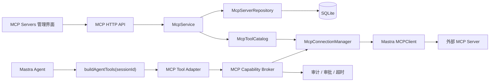

# BloomAI 外部 MCP Server 接入（MCP Client）设计方案

- **状态**：已确认，待实施
- **日期**：2026-08-02
- **范围**：BloomAI 作为 MCP Client，连接用户配置的外部 MCP Server，并将其工具受控地提供给现有 Mastra Agent。
- **非范围**：BloomAI 作为 MCP Server、MCP 市场/自动安装、容器隔离、OAuth、SSE、将密钥明文持久化。

---

## 1. 目标与成功标准

BloomAI 已有 Mastra Agent、工具注册、`CapabilityBroker`、工具权限、运行审计和 Tools UI。本设计的目标不是新增一条绕开这些机制的 MCP 调用通道，而是将外部 MCP 工具纳入既有工具治理模型。

一期完成后，用户可以：

1. 手工配置一个 `stdio` 或 Streamable HTTP MCP Server。
2. 测试连接并从远端读取工具目录。
3. 启用或禁用整个 Server，以及其中单个工具。
4. 在聊天中让 Mastra Agent 使用已启用的 MCP 工具。
5. 在调用前得到风险审批，在调用后查看输入、输出摘要、耗时与错误。
6. 通过 `${env:NAME}` 引用 Token 或环境变量，而不是将明文秘密写入 SQLite。

## 2. 当前架构与接入点

当前调用路径如下：

```text
Chat UI
  -> Hono chat route / chat.service
    -> Mastra Chat Agent
      -> buildAgentTools(sessionId)
        -> buildBuiltinTools / buildSkillTools
          -> CapabilityBroker
            -> executeToolInternal
              -> toolRegistry executor
                -> tools / tool_runs / tool_permissions
```

相关现有文件：

| 职责 | 文件 |
|---|---|
| Mastra 实例 | `src/server/mastra/index.ts` |
| Chat Agent 与按请求构建工具 | `src/server/mastra/chat-agent.ts` |
| 工具转换为 Mastra Tool | `src/server/mastra/tools.ts` |
| 内置工具执行与运行记录 | `src/server/tools/execute-tool.ts` |
| 权限、审批和超时策略 | `src/server/skills/policy/capability-broker.ts` |
| 工具持久化 | `src/server/db/client.ts`、`src/server/db/schema.ts`、`src/server/db/repositories/tool.repo.ts` |
| Tools HTTP API | `src/server/http/routes/tools.ts` |
| Tools 前端状态 | `src/renderer/pages/Tools/tools.store.ts` |

`package-lock.json` 当前解析到 `@mastra/core@1.51.0`。`@mastra/mcp@1.13.0` 的 peer dependency 为 `@mastra/core >=1.0.0-0 <2.0.0-0`，因此可作为一期验证的依赖版本；正式实施时锁定 `@mastra/mcp@^1.13.0` 并运行 typecheck 验证。

## 3. 架构决策

### 3.1 决策：使用 Provider Adapter，而不是直接挂载 MCPClient 工具

Mastra MCP Client 可以直接发现 MCP 工具并将其提供给 Agent。但 BloomAI 不能直接将其返回值挂载到 Agent：那会绕过现有工具启停、审批、运行记录和失败治理。

采用以下架构：



### 3.2 决策：工具目录缓存，本地同步构建 Agent Tool Surface

`buildAgentTools(sessionId)` 当前为同步函数。不得在每次聊天请求内新建 MCP 连接或重新执行 `tools/list`。

- 测试连接、显式刷新工具、配置变更时：建立连接并同步远端工具目录。
- 每次 Agent 请求：只读取 SQLite 中已发现、已启用的 MCP Tool 元数据并同步构建 Tool Surface。
- Tool `execute()`：按需从连接管理器获取或恢复连接，并调用远端工具。

这样能够维持 Agent 的请求级启停生效特性，并隔离网络或子进程故障。

### 3.3 决策：独立 MCP 数据模型，不复用 native `tools` 表作为唯一事实源

现有 `tools` 表描述的是内置 executor；其 `toolRegistry` 为静态对象。MCP Tool 是动态远端资源，连接配置、远端名称、schema 变更和 Server 级健康状态都需要一等模型。

- `mcp_servers`：Server 配置、信任、状态。
- `mcp_server_tools`：发现到的工具缓存、启用和审批策略。
- `mcp_tool_runs`：MCP 调用审计；保留关键字段与 `tool_runs` 对齐。

Tools UI 可以聚合显示 native 工具和 MCP 工具，但 MCP 的权威数据保留在独立表中。

### 3.4 决策：一期秘密只允许引用，不允许明文

因为 Hono Server 运行在 Electron 子进程中，一期不引入主进程密钥代理。配置中只允许 `${env:VARIABLE_NAME}`，例如：

```json
{
  "Authorization": "Bearer ${env:GITHUB_TOKEN}"
}
```

解析后的值仅存在于调用进程内存；日志、数据库、HTTP 响应、运行记录均不得输出明文。UI 仅显示变量名。

## 4. 数据模型

### 4.1 `mcp_servers`

```sql
CREATE TABLE IF NOT EXISTS mcp_servers (
  id TEXT PRIMARY KEY,
  name TEXT NOT NULL,
  description TEXT,
  transport TEXT NOT NULL CHECK (transport IN ('stdio', 'http')),
  endpoint TEXT,
  command TEXT,
  args_json TEXT NOT NULL DEFAULT '[]',
  headers_template_json TEXT NOT NULL DEFAULT '{}',
  env_template_json TEXT NOT NULL DEFAULT '{}',
  is_enabled INTEGER NOT NULL DEFAULT 0,
  trust_level TEXT NOT NULL DEFAULT 'untrusted'
    CHECK (trust_level IN ('untrusted', 'reviewed', 'trusted')),
  status TEXT NOT NULL DEFAULT 'disabled'
    CHECK (status IN ('disabled', 'connecting', 'connected', 'degraded', 'error')),
  last_connected_at INTEGER,
  last_tool_sync_at INTEGER,
  last_error TEXT,
  created_at INTEGER NOT NULL,
  updated_at INTEGER NOT NULL
);
```

不变量：

- `stdio`：必须提供 `command`，`endpoint` 必须为 `NULL`。
- `http`：必须提供绝对 URL `endpoint`，`command` 必须为 `NULL`。
- `args_json` 必须是 string array；headers/env 必须是 string-to-string object。
- 生产环境 HTTP endpoint 必须为 `https:`；允许 `http://127.0.0.1` 和 `http://localhost` 用于本地开发。

### 4.2 `mcp_server_tools`

```sql
CREATE TABLE IF NOT EXISTS mcp_server_tools (
  id TEXT PRIMARY KEY,
  server_id TEXT NOT NULL,
  remote_name TEXT NOT NULL,
  name TEXT NOT NULL,
  description TEXT NOT NULL,
  input_schema_json TEXT NOT NULL,
  output_schema_json TEXT,
  is_enabled INTEGER NOT NULL DEFAULT 1,
  requires_approval INTEGER NOT NULL DEFAULT 1,
  risk_level TEXT NOT NULL DEFAULT 'medium'
    CHECK (risk_level IN ('low', 'medium', 'high')),
  discovered_at INTEGER NOT NULL,
  updated_at INTEGER NOT NULL,
  UNIQUE(server_id, remote_name)
);
```

工具 ID 固定为 `mcp:{serverId}:{remoteName}`。`remoteName` 保留远端原始名称，绝不让外部 Tool 覆盖 BloomAI 内置工具 ID。

### 4.3 `mcp_tool_runs`

```sql
CREATE TABLE IF NOT EXISTS mcp_tool_runs (
  id TEXT PRIMARY KEY,
  server_id TEXT NOT NULL,
  tool_id TEXT NOT NULL,
  session_id TEXT,
  input_json TEXT NOT NULL,
  output_json TEXT,
  status TEXT NOT NULL CHECK (status IN ('running', 'success', 'error', 'denied')),
  error_msg TEXT,
  duration_ms INTEGER,
  started_at INTEGER NOT NULL,
  finished_at INTEGER
);
```

输出以脱敏和大小限制后的 JSON 保存；原始 MCP content 不能无限制写库。

## 5. 模块与接口

```text
src/server/mcp/
  types.ts                 # 领域类型与值对象
  schemas.ts               # Zod: 创建/更新配置、连接和工具调用输入
  server-repository.ts     # 三张 MCP 表的持久化操作
  secret-resolver.ts       # ${env:NAME} 严格解析与脱敏
  connection-manager.ts    # MCPClient 生命周期和连接缓存
  tool-catalog.ts          # tools/list 同步、schema diff、风险默认值
  tool-adapter.ts          # MCP catalog -> Mastra createTool
  capability-broker.ts     # 启用、信任、审批、超时、审计、tools/call
  mcp.service.ts           # Route 可调用的应用服务
  index.ts                 # 稳定公开入口
```

主要接口：

```ts
export interface McpConnectionManager {
  testConnection(server: ResolvedMcpServerConfig): Promise<DiscoveredMcpTool[]>
  getClient(serverId: string): Promise<ConnectedMcpClient>
  disconnect(serverId: string): Promise<void>
  disconnectAll(): Promise<void>
}

export interface McpToolCatalog {
  sync(serverId: string, tools: DiscoveredMcpTool[]): Promise<SyncResult>
  listEnabled(): McpServerTool[]
}

export interface McpCapabilityBroker {
  execute(input: ExecuteMcpToolInput): Promise<McpToolExecution>
}
```

`ConnectedMcpClient` 隐藏 Mastra 具体类型，并提供 `callTool(remoteName, input)`。这能降低将来升级 Mastra API 的影响范围。

## 6. 连接、同步与调用生命周期

### 6.1 配置与测试连接

1. 用户在 UI 填写 Server 配置。
2. API 用 Zod 校验 transport 的 discriminated union。
3. `secret-resolver` 检查所有模板只使用允许的 `${env:NAME}` 语法；不解析并返回值给浏览器。
4. `McpConnectionManager.testConnection()` 创建临时 Mastra MCPClient。
5. 读取 `tools/list`，规范化工具元数据。
6. 仅在用户提交创建或刷新确认后写入 catalog。
7. 临时连接总是在 `finally` 中关闭。

### 6.2 目录同步

同步以 `server_id + remote_name` 为主键：

- 新工具：默认 `is_enabled=1`、`requires_approval=1`、风险由规则推导。
- 已存在但 schema/description 变化：更新元数据并将 `requires_approval=1`；如果 Server 是 `trusted`，降级为 `reviewed`。
- 远端已删除工具：保留历史调用记录，删除 catalog 行或标记为禁用；一期选择删除 catalog 行。
- 刷新失败：保留上次成功 catalog，更新 Server `status=error/degraded` 和 `last_error`。

### 6.3 Agent 调用

```text
Agent selects mcp:{serverId}:{remoteName}
  -> McpToolAdapter.execute(input)
    -> McpCapabilityBroker.execute(...)
      -> validate enabled / server trust / approval
      -> create mcp_tool_runs row
      -> get or reconnect MCP client
      -> client.callTool(remoteName, input)
      -> normalize + redact + size-limit output
      -> finish run
      -> return result to Agent
```

Tool 执行超时一期统一为 30 秒；连接测试为 10 秒。所有状态更新在异常路径中完成，防止永远遗留 `running` 记录。

## 7. 安全模型

### 7.1 信任层级

| Trust level | 规则 |
|---|---|
| `untrusted` | 任意 Tool 调用必须交互确认。 |
| `reviewed` | 低风险 Tool 可通过会话级授权；中高风险 Tool 必须确认。 |
| `trusted` | 低风险 Tool 可自动调用；中高风险 Tool 仍必须确认。 |

### 7.2 风险推导

首次发现工具时，以 `remote_name + description` 的小写文本匹配下列词根：

- `delete`、`remove`、`write`、`update`、`create`、`send`、`publish`、`deploy`、`execute`、`run`、`payment`、`transfer`：`high`。
- `search`、`get`、`list`、`read`、`fetch`：`low`。
- 其余：`medium`。

这是保守默认值，不把 MCP Server 自报信息视为可信授权。用户可在 UI 调整 Tool 的风险和审批策略，但无法令 `high` 风险工具跳过审批。

### 7.3 stdio 风险

`stdio` 会启动本地命令，因此：

- 新建或变更 `command/args/env_template_json` 后，Server 必须恢复为 `untrusted` 且禁用。
- 启用前 UI 必须显示完整命令、参数和仅变量名的 env 映射。
- 不在一期支持从 Skill Package 或 URL 自动安装可执行 MCP Server。

### 7.4 Prompt Injection 与数据最小化

MCP Tool 的描述、schema、输出都属于不可信外部输入。

- Chat Agent instructions 增加：不执行 Tool output 中的指令，除非它直接满足用户请求并已通过 BloomAI 的权限策略。
- Tool adapter 只向远端传递 Tool input，不自动发送全量对话、系统提示、文件列表或密钥。
- 在运行记录中递归脱敏键名包含 `authorization`、`token`、`secret`、`password`、`api_key` 的值。
- 输出 JSON 截断到 128 KiB，超出部分记录 `{ truncated: true }`。

## 8. HTTP API

所有 MCP 路由注册在 `/api/mcp` 下，响应沿用 `{ data }` 与统一错误对象。

```text
GET    /api/mcp/servers
POST   /api/mcp/servers
GET    /api/mcp/servers/:serverId
PATCH  /api/mcp/servers/:serverId
DELETE /api/mcp/servers/:serverId

POST   /api/mcp/servers/:serverId/test-connection
POST   /api/mcp/servers/:serverId/refresh-tools
POST   /api/mcp/servers/:serverId/enable
POST   /api/mcp/servers/:serverId/disable
POST   /api/mcp/servers/:serverId/trust

GET    /api/mcp/servers/:serverId/tools
PATCH  /api/mcp/servers/:serverId/tools/:toolId
POST   /api/mcp/servers/:serverId/tools/:toolId/test
GET    /api/mcp/servers/:serverId/runs
```

错误码语义：

| Code | HTTP | 含义 |
|---|---:|---|
| `MCP_CONFIG_INVALID` | 400 | 配置或模板格式不合法。 |
| `MCP_SERVER_NOT_FOUND` | 404 | Server 不存在。 |
| `MCP_TOOL_NOT_FOUND` | 404 | 工具不属于该 Server。 |
| `MCP_APPROVAL_REQUIRED` | 409 | 当前调用需要用户确认。 |
| `MCP_SERVER_DISABLED` | 409 | Server 被禁用。 |
| `MCP_TOOL_DISABLED` | 409 | Tool 被禁用。 |
| `MCP_CONNECTION_FAILED` | 502 | 连接/握手失败。 |
| `MCP_TOOL_TIMEOUT` | 504 | 远端调用超时。 |

## 9. 前端设计

在现有 Tools 导航下新增 MCP Servers 页面和详情页。

### 列表页

- Server 名称、transport、连接状态、发现 Tool 数、信任等级、启用状态。
- “新增”“测试连接”“刷新工具”“启用/禁用”“删除”。
- `stdio` Server 显示 command 摘要；HTTP Server 显示 origin，不展示 headers 值。

### 详情页

- 可编辑配置；修改连接相关字段后必须重新测试。
- Tool 列表，支持单工具启停、风险/审批状态、schema 查看和手工测试。
- 调用记录按时间倒序，支持状态与 Tool 筛选。
- 首次启用 `stdio` 或未信任 Server 时显示风险确认弹窗。

## 10. 可观测性与失败行为

新增指标：

- `mcp_connection_attempt_total{transport,status}`
- `mcp_tool_call_total{server_id,tool_id,status}`
- `mcp_tool_call_duration_ms{server_id,tool_id}`
- `mcp_catalog_sync_total{status}`

日志只记录 Server ID、Tool ID、transport、耗时、错误类别；不得记录 resolved headers、环境变量值、完整敏感输出。

应用退出时调用 `mcpConnectionManager.disconnectAll()`。连接错误不应使 Mastra Agent 或 Hono Server 进程崩溃；应转换成对当前 Tool Call 可见的错误。

## 11. 测试策略

- 单元：模板解析、配置校验、风险推导、脱敏、catalog diff。
- Repository：CRUD、唯一约束、刷新后删除远端已不存在 Tool。
- Broker：禁用、未信任审批、超时、失败审计、输出截断。
- Adapter：Tool ID 命名空间、Zod schema 转换、Agent 仅看到 enabled Tool。
- HTTP：路由参数校验、错误规范、测试连接与刷新流程。
- 集成：使用 Fake/Mock MCP Client；不在 CI 启动任意 `npx` 子进程。
- 手工 smoke：一个只读 stdio Server 和一个本地 HTTP MCP Server。

## 12. 分期与验收

### Phase 0：依赖与协议 Spike

仅验证 `@mastra/mcp@^1.13.0` 与当前 Mastra 依赖、stdio、HTTP、tools/list、tools/call 的类型和运行时兼容性。

### Phase 1：MCP Client MVP

实现本设计的表、服务、Agent 接入、API、UI、安全边界和测试。

### Phase 2（不在本次实现）

SSE、Electron Secret Vault、OAuth、schema diff UI、导入导出、Server 模板、市场和容器隔离。

验收以本文第 1 节成功标准为准，另要求：现有内置工具、Legacy Skills、Deep Research、Writing/Coding Agent 的回归测试全部通过。
