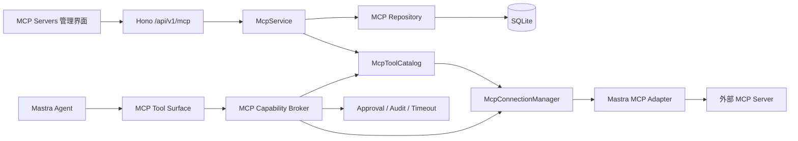

# BloomAI 外部 MCP Server 接入（MCP Client）设计方案

- **状态**：Gate 0、Task 0、Task 1、Task 2、Task 3 已通过，Task 4 尚未开始
- **日期**：2026-08-09
- **产品目标**：BloomAI 作为 MCP Client，受控连接用户配置的外部 MCP Server，并将远程 Tools 安全地纳入现有 Mastra Agent 工具治理体系。
- **当前基线**：`@mastra/mcp@1.15.1` 已以精确版本安装并锁定，Task 0 Spike、真实 stdio/HTTP Fixture、Task 1 安全边界契约和测试、Task 2 领域类型/错误协议/结果规范化/JSON Schema 边界契约和测试、Task 3 Migration 048/Schema Contract/Repository 及数据库安全边界测试已完成；Task 4 尚未开始，尚未实现生产 Adapter、Connection Manager、MCP 路由或完整 MCP 生产代码。本设计是实现目标，不代表后续功能已经完成。
- **关联文档**：
  - 实施计划：`docs/MCP/2026-08-02-bloomai-mcp-client-implementation-plan.md`
  - 后续能力路线图：`docs/MCP/mcp-roadmap.md`

---

## 1. 目标、范围与成功标准

### 1.1 一期 MVP 范围

一期只实现“连接外部 MCP Server 并安全使用其 Tools”的闭环：

1. BloomAI 作为 MCP Client。
2. 手工配置一个或多个外部 MCP Server。
3. 支持 `stdio` 和 Streamable HTTP 两种一期 Transport。
4. 测试连接并读取远端 Tool Catalog。
5. 对 Catalog 提供 Preview、Diff、Confirm 流程。
6. Server 和单个 Tool 可独立启用、禁用。
7. 新发现的 Tool 默认禁用，不直接进入 Agent Tool Surface。
8. General Chat Agent 只能使用当前用户 Role 允许、Catalog 已确认且已启用的 MCP Tool。
9. 手工测试和 Agent 调用共用同一个 Capability Broker、审批、超时、取消和审计协议。
10. 对高风险、不可信 Server 或明确要求审批的调用执行服务端审批。
11. 支持 `${env:NAME}` 秘密引用，不把解析后的值写入 SQLite、日志、HTTP 响应或前端状态。
12. 支持结果脱敏、大小截断、错误归类、连接失效和应用退出清理。

### 1.2 一期明确不包含的能力

以下能力不属于一期公共产品契约，具体拆分见 `docs/MCP/mcp-roadmap.md`：

- BloomAI 作为 MCP Server；
- Resources；
- Prompts；
- Elicitation；
- OAuth 登录、授权回调和 Token 刷新；
- MCP Registry、市场和 Server 自动安装；
- 容器或操作系统级沙箱；
- SSE 作为独立公开 Transport；
- 远程下载或自动安装可执行的 stdio Server；
- 多租户云端凭据托管。

Task 0 已确认 Mastra HTTP 运行时具备 legacy HTTP+SSE fallback 路径，但本次 Streamable HTTP Fixture 未发生 fallback。BloomAI 一期采用 fail-closed 检测：发现 deprecated fallback 日志或无 session id 的 legacy SSE 初始 GET 即拒绝；独立 legacy SSE 延后到 `mcp-roadmap.md` 的 R5。

### 1.3 能力矩阵

| 能力 | 一期状态 | 说明 | 后续文档 |
|---|---|---|---|
| 多 MCP Server | 支持 | 以 `server_id` 隔离配置、Catalog、连接和审计 | 本文、实施计划 |
| stdio | 支持 | 本地命令，`shell: false`，最小化环境变量 | 本文、实施计划 |
| Streamable HTTP | 支持 | 必须执行 URL、DNS、redirect 和 SSRF 检查 | 本文、实施计划 |
| legacy SSE | 一期拒绝隐式 fallback | Mastra 具备 fallback 能力；BloomAI MVP 检测并拒绝未明确允许的 legacy SSE，独立支持延后到 R5 | `mcp-roadmap.md` |
| Tools | 支持 | 一期唯一进入 Agent 的 MCP 能力 | 本文、实施计划 |
| Resources | 后续 | 只读资源权限、大小限制和审计另行设计 | `mcp-roadmap.md` |
| Prompts | 后续 | 参数校验、注入防护和 Agent 上下文策略另行设计 | `mcp-roadmap.md` |
| Elicitation | 后续 | 需要 UI/会话级用户输入闭环 | `mcp-roadmap.md` |
| Tool Approval | 支持 | 由 BloomAI 服务端 Approval Store 和 Broker 负责 | 本文、实施计划 |
| OAuth | 后续 | 包括授权回调、Token 存储和刷新 | `mcp-roadmap.md` |
| MCP Registry | 后续 | 需要供应链审核和安装策略 | `mcp-roadmap.md` |
| 动态工具加载 | 受控支持 | 通过显式 Refresh/Preview/Confirm 更新本地 Catalog，不在每次聊天请求中刷新 | 本文、实施计划 |

---

## 2. 当前架构与接入点

当前 BloomAI 的工具调用路径为：

```text
Chat UI
  -> Hono chat route / chat.service
    -> Mastra Chat Agent
      -> buildAgentTools(sessionId)
        -> buildBuiltinTools / buildSkillTools
          -> CapabilityBroker
            -> executeToolInternal
              -> toolRegistry executor
                -> tools / tool_runs / tool_permissions
```

MCP 一期新增的目标路径为：

```text
Chat UI
  -> Hono chat route / chat.service
    -> Mastra Chat Agent
      -> buildAgentTools(sessionId)
        -> buildMcpToolSurface(sessionId, role)
          -> MCP Tool Adapter
            -> MCP Capability Broker
              -> McpConnectionManager
                -> Mastra MCP Adapter
                  -> 外部 MCP Server
```

现有接入点：

| 职责 | 文件或模块 |
|---|---|
| Mastra 实例 | `src/server/mastra/index.ts` |
| Chat Agent 与按请求构建工具 | `src/server/mastra/chat-agent.ts` |
| 内置工具转换 | `src/server/mastra/tools.ts` |
| 内置工具执行和运行记录 | `src/server/tools/execute-tool.ts` |
| 现有权限和 Capability Broker | `src/server/skills/policy/capability-broker.ts` |
| 数据库客户端和 Schema | `src/server/db/client.ts`、`src/server/db/schema.ts` |
| 既有工具 API | `src/server/http/routes/tools.ts` |
| 前端工具状态 | `src/renderer/pages/Tools/tools.store.ts` |

MCP 一期不得把 `@mastra/mcp` 直接导入 `src/server/mastra/tools.ts`。Mastra 具体类型和生命周期必须隔离在 MCP Provider Adapter 中。

---

## 3. 架构决策

### 3.1 使用 Provider Adapter，不直接挂载 Mastra 原始工具

Mastra MCP Client 负责 MCP 协议连接和远程能力发现，但 BloomAI 不能把 Mastra 返回的原始 Tool 对象直接挂到 Agent 上，否则会绕过：

- BloomAI 的 Server/Tool 启停策略；
- Role Scope；
- Catalog Confirm；
- Capability Broker；
- Tool Approval；
- 执行审计；
- 超时、取消和结果脱敏。

采用以下边界：



### 3.2 Catalog 驱动 Agent Tool Surface

`buildAgentTools(sessionId)` 当前是请求级工具构建入口。一期不得在每次聊天请求内新建 MCP 连接或执行 `tools/list`。

规则：

- 测试连接、显式 Refresh 或连接配置变更时，创建临时或受控连接并发现工具；
- Refresh 只生成 Preview，不直接改变已确认 Catalog；
- 用户 Confirm 后才更新 Catalog；
- 每次 Agent 请求只读取本地已确认、未移除、已启用且 Role 允许的 Tool 元数据；
- Tool 执行时由 Connection Manager 获取或恢复连接；
- 连接失败只影响当前 MCP Tool 调用，不得使 Hono 或 Agent 进程崩溃。

### 3.3 MCP 使用独立数据模型

现有 `tools` 表主要描述 BloomAI 内置 executor，不能作为动态远程 MCP Tool 的唯一事实源。MCP 需要独立保存：

- Server 连接配置和健康状态；
- 远端 Tool 原始名称；
- Tool Schema、Schema Hash 和 Catalog Version；
- 启用、移除、风险和审批策略；
- MCP Tool 调用审计。

一期 Migration 使用当前仓库可用的下一个编号：

```text
scripts/migrations/048-mcp-client.sql
```

当前 `044`～`047` 已被占用，不能复用。

### 3.4 秘密只保存引用

Server 配置可以保存：

```text
${env:NAME}
```

不能保存解析后的 Token 或 Header 值。解析值只在连接创建和调用期间存在于内存，并且：

- 不写入 SQLite；
- 不进入日志；
- 不进入 HTTP 响应；
- 不进入前端 Store；
- 不进入测试快照。

通过 `MCP_ALLOWED_ENV_NAMES` 对允许引用的环境变量名称做全局 allowlist。

### 3.5 BloomAI Broker 是最终授权源

Mastra 的 Tool 能力不能替代 BloomAI 的授权策略。所有 MCP 调用必须先经过 BloomAI Capability Broker，由 Broker 决定：

- Server 是否启用；
- Tool 是否启用；
- 当前 Agent Role 是否允许；
- 是否需要审批；
- Approval Token 是否有效且只能消费一次；
- Input Hash 和 Catalog Version 是否匹配；
- 是否允许执行、取消、超时和重试。

客户端传入的 `approvalGranted`、`trustLevel`、`riskLevel` 或 `requiresApproval` 不能覆盖服务端策略。

### 3.6 Feature Flag 必须 fail closed

只有以下条件同时满足时，才允许建立外部连接或注册 MCP Tool：

```text
MCP_CLIENT_ENABLED === "true"
+ Server enabled
+ Tool confirmed and enabled
+ Role Scope allowed
```

Feature Flag 未明确开启时：

- 不建立外部连接；
- 不执行 MCP Tool；
- 不向 Agent 注册 MCP Tool；
- 允许只读查询历史 Run。

---

## 4. Mastra 集成契约

### 4.1 依赖版本策略

Task 0 已将当前基线锁定为 `@mastra/core@1.51.0`、`@mastra/mcp@1.15.1` 和 `@modelcontextprotocol/sdk@1.30.0`。`@mastra/mcp` 使用精确版本写入 `package.json` 和 `package-lock.json`；任何版本升级都必须重新执行 Spike。完整证据见 `docs/MCP/mcp-mastra-spike-result.md`。

不能在正式代码中继续依赖未经 Spike 证实的 Mastra MCP 工具发现、工具执行、连接关闭方法名，或把某个 Tool 字段直接当作远端名称。

### 4.2 BloomAI 内部稳定接口

以下是 BloomAI 自己的 Adapter 契约，不是 Mastra 公共 API 的声明。Task 0 已用真实运行时冻结其方法和执行路径；完整证据见 `docs/MCP/mcp-mastra-spike-result.md`：

```ts
interface McpProviderConnection {
  listTools(signal?: AbortSignal): Promise<DiscoveredMcpTool[]>;
  executeTool(
    remoteName: string,
    input: unknown,
    signal?: AbortSignal,
  ): Promise<unknown>;
  disconnect(): Promise<void>;
}

interface McpProviderAdapter {
  createConnection(
    config: McpServerConnectionConfig,
    signal?: AbortSignal,
  ): Promise<McpProviderConnection>;
}
```

Task 0 已固定当前锁定版本的实现路径：保存 `MCPClient.listTools()` 返回的 namespaced Mastra Tool，在 Adapter 内部通过独立 `remoteName` 映射调用其 `execute(input, { abortSignal })`，由 Mastra 继续转发到底层 MCP SDK 的 `tools/call`。`src/server/mcp` 之外的模块只能依赖 BloomAI 内部契约；正式实现仍留给 Task 4。

### 4.3 工具名称与 ID

远端名称必须原样保存：

```text
remoteName = 外部 MCP Server 返回的原始 Tool 名称
```

BloomAI 本地 Tool ID 使用命名空间：

```text
mcp:{serverId}:{remoteName}
```

当前版本实际返回 `serverName_toolName` 形式的 namespaced key，Tool `id` 也保留该本地名称。Adapter 必须在已知 Server 命名空间内维护 `localName` 到原始 `remoteName` 的独立映射，不能把 namespaced `id` 当成远端原始名称的唯一事实源。

### 4.4 Task 2 稳定边界

Task 2 已固定后续 Repository、Adapter、Broker、API 和 UI 共用的领域类型、错误协议和结果边界：

- Run 状态只能使用 `pending_approval`、`running`、`success`、`error`、`denied`、`cancelled`；
- 稳定错误码使用本文第 8 节完整列表，错误响应只返回稳定 code、通用 message 和 HTTP status，不把远端异常、Schema 或秘密原文带出边界；
- `NormalizedMcpResult` 始终分离 `content`、`structuredContent` 和显式 `isError`，safe result 只允许 JSON-safe 值，递归脱敏敏感键，并在序列化结果超过 128 KiB 时设置 `truncated=true`；
- 一期 JSON Schema 只接受 `object`、`array`、`string`、`number`、`integer`、`boolean`、`null`、`enum`、`required`、`properties`、`items`。`$ref`、循环 Schema、函数/非 JSON 值、未知关键字和超深嵌套统一返回 `MCP_SCHEMA_UNSUPPORTED`；规范化后的 Schema 使用稳定 SHA-256 hash。发现记录可以保留，但不支持的 Schema 不得进入 Agent Tool Surface。

---

## 5. 数据模型

### 5.1 `mcp_servers`

建议字段：

```sql
CREATE TABLE IF NOT EXISTS mcp_servers (
  id TEXT PRIMARY KEY,
  name TEXT NOT NULL,
  transport_kind TEXT NOT NULL
    CHECK (transport_kind IN ('stdio', 'streamable_http')),
  config_json TEXT NOT NULL,
  secret_refs_json TEXT NOT NULL,
  is_enabled INTEGER NOT NULL DEFAULT 0,
  trust_level TEXT NOT NULL DEFAULT 'untrusted'
    CHECK (trust_level IN ('untrusted', 'reviewed', 'trusted')),
  connection_status TEXT NOT NULL DEFAULT 'unknown'
    CHECK (connection_status IN ('unknown', 'healthy', 'error', 'disabled')),
  catalog_version INTEGER NOT NULL DEFAULT 0,
  last_error_code TEXT,
  last_error_at INTEGER,
  created_at INTEGER NOT NULL,
  updated_at INTEGER NOT NULL
);
```

`config_json` 只能保存经校验的非秘密连接配置；秘密只能保存引用。HTTP Header 的值不得直接持久化。

### 5.2 `mcp_server_tools`

```sql
CREATE TABLE IF NOT EXISTS mcp_server_tools (
  id TEXT PRIMARY KEY,
  server_id TEXT NOT NULL,
  remote_name TEXT NOT NULL,
  name TEXT NOT NULL,
  description TEXT NOT NULL,
  input_schema_json TEXT NOT NULL,
  output_schema_json TEXT,
  schema_hash TEXT NOT NULL,
  is_enabled INTEGER NOT NULL DEFAULT 0,
  is_removed INTEGER NOT NULL DEFAULT 0,
  requires_approval INTEGER NOT NULL DEFAULT 1,
  risk_level TEXT NOT NULL DEFAULT 'medium'
    CHECK (risk_level IN ('low', 'medium', 'high')),
  discovered_at INTEGER NOT NULL,
  updated_at INTEGER NOT NULL,
  removed_at INTEGER,
  UNIQUE(server_id, remote_name)
);
```

约束：

- 新发现 Tool 默认禁用；
- Schema 或 description 变化时进入 review/disabled；
- 远端删除使用软删除，保留历史 Run 可读性；
- `remote_name` 永远保存远端原始名称；本地 Tool ID 由 Repository 固定生成 `mcp:{serverId}:{remoteName}`，不接受远端返回的 ID 覆盖。
- Migration 实际唯一索引名为 `idx_mcp_server_tools_server_remote`。

### 5.3 `mcp_tool_runs`

```sql
CREATE TABLE IF NOT EXISTS mcp_tool_runs (
  id TEXT PRIMARY KEY,
  server_id TEXT NOT NULL,
  tool_id TEXT NOT NULL,
  remote_name TEXT NOT NULL,
  session_id TEXT,
  agent_role TEXT,
  status TEXT NOT NULL
    CHECK (status IN (
      'pending_approval', 'running', 'success', 'error',
      'denied', 'cancelled'
    )),
  input_hash TEXT NOT NULL,
  safe_input_json TEXT,
  safe_output_json TEXT,
  error_code TEXT,
  duration_ms INTEGER,
  created_at INTEGER NOT NULL,
  completed_at INTEGER
);
```

原始敏感 input/output 不写入数据库。Approval 的短生命周期状态保存在服务端 Approval Store，不接受客户端布尔值作为授权事实。

---

## 6. 连接、同步与调用生命周期

### 6.1 配置与 Preview

1. 用户提交 Server 配置。
2. API 使用 Zod 校验 transport discriminated union。
3. Secret Resolver 只接受 `${env:NAME}`，并检查 `MCP_ALLOWED_ENV_NAMES`。
4. HTTP 执行 URL、DNS、redirect 和 SSRF 检查；stdio 校验 command、args、cwd 和 env allowlist。
5. `McpConnectionManager` 创建临时连接。
6. Adapter 读取 Tool Catalog。
7. 服务端生成 `previewHash`、`configHash` 和 `catalogVersion`。
8. Preview 返回安全 DTO，不返回 resolved secret、完整 Header 或未经脱敏的远程结果。

### 6.2 Confirm 与 Catalog 同步

Confirm 必须同时提交：

```text
serverId
previewHash
configHash
catalogVersion
```

服务端重新校验当前配置和 Preview 是否仍然匹配。Stale Preview 必须返回 `MCP_PREVIEW_STALE`，不能覆盖当前 Catalog。

同步规则：

- 新 Tool：插入并默认禁用；
- 已存在且无变化：保留启用和审批策略；
- Schema、description 或远程声明变化：更新元数据，重新进入 review/disabled；
- 远程删除 Tool：设置 `is_removed=1`、`removed_at`，不删除历史 Run；
- Catalog Version 原子递增。

### 6.3 Agent Tool Surface

Agent 构建时只读取：

```text
MCP_CLIENT_ENABLED = true
Server is_enabled = 1
Tool is_enabled = 1
Tool is_removed = 0
Tool 已 Confirm
当前 Role Scope 允许
```

Agent 只看到 BloomAI 生成的本地 Tool，不直接看到 Mastra 的原始工具集合。每个本地 Tool 的 `execute()` 只负责把请求交给 MCP Capability Broker。

### 6.4 MCP Tool 执行

执行顺序：

```text
Agent / 手工 Test
  -> Tool Adapter
  -> Broker 创建 Run
  -> 检查 Server / Tool / Role / Catalog
  -> 判断是否需要审批
  -> pending_approval 或直接 running
  -> Approval Token 服务端一次性消费
  -> Connection Manager 获取连接
  -> Provider Adapter 执行远端 Tool
  -> 结果规范化、脱敏、截断
  -> 更新 Run
  -> 返回 Safe Result
```

超时必须：

- 传递 `AbortSignal`；
- 对无法可靠取消的连接执行 client invalidate；
- 非幂等 Tool 不自动重试；
- 将当前 Run 标记为错误或取消，并保留审计记录。

### 6.5 应用退出与连接失效

应用退出时调用：

```text
mcpConnectionManager.disconnectAll()
```

任何 stdio 子进程、HTTP 连接、Abort Controller 和缓存都必须清理。连接错误不得导致 Hono、Mastra 或 Electron 主进程退出。

---

## 7. 安全模型

### 7.1 Transport 安全

#### stdio

- 使用参数数组，不拼接 shell 命令；
- `shell: false`；
- 不继承完整 `process.env`；
- 只允许 allowlist 中的环境变量；
- command、args、cwd 变更后 Server 回到 `untrusted` 并禁用；
- 不支持从 URL、Registry 或 Skill Package 自动下载可执行文件；
- 应用退出和 timeout 后清理子进程。

#### Streamable HTTP

- 生产环境要求 HTTPS；
- 仅允许开发环境的 `localhost` 和 `127.0.0.1` HTTP；
- 校验 hostname、DNS 解析结果、redirect 目标；
- 拦截私网、link-local 和云 metadata 地址；
- Header 只接受安全模板引用；
- 不记录认证 Header 值。

### 7.2 信任和风险

Server 信任等级：

```text
untrusted -> reviewed -> trusted
```

风险等级由服务端根据 Tool 描述、Schema、Server 信任和策略推导，客户端不能覆盖。

建议默认策略：

| 条件 | 默认策略 |
|---|---|
| untrusted Server | 必须审批 |
| high risk Tool | 必须审批 |
| 新发现 Tool | 禁用并等待 Confirm |
| schema/description 变化 | 重新 review/审批 |
| trusted + low risk | 可按 Role Policy 自动执行 |

### 7.3 Approval

Approval Store 只保存短生命周期、服务端生成的请求状态：

- `approvalRequestId`；
- `runId`；
- `serverId`；
- `toolId`；
- `inputHash`；
- `catalogVersion`；
- `sessionId` 和 Role；
- 过期时间；
- 消费状态。

不保存原始敏感 input，不接受客户端传入 `approvalGranted: true`。

### 7.4 外部内容和 Prompt Injection

Tool description、input schema、content、structuredContent 和错误信息均视为不可信外部输入：

- 不把 Tool output 当作系统指令；
- 不自动把远端返回的指令写入 Agent instructions；
- 不向远端发送全量对话、系统提示、文件列表或秘密；
- 递归脱敏 `authorization`、`token`、`secret`、`password`、`api_key` 等字段；
- 输出限制为 128 KiB，超出部分返回截断标记；
- 只允许 JSON-safe 值进入 Safe Result。

---

## 8. HTTP API 契约

所有路由统一注册在 `/api/v1/mcp` 下，响应沿用项目现有 `{ data }` 和统一错误对象。

```text
GET    /api/v1/mcp/servers
POST   /api/v1/mcp/servers
GET    /api/v1/mcp/servers/:serverId
PATCH  /api/v1/mcp/servers/:serverId
DELETE /api/v1/mcp/servers/:serverId

POST   /api/v1/mcp/servers/:serverId/test-connection
POST   /api/v1/mcp/servers/:serverId/tools/preview
POST   /api/v1/mcp/servers/:serverId/tools/confirm
POST   /api/v1/mcp/servers/:serverId/enable
POST   /api/v1/mcp/servers/:serverId/disable
POST   /api/v1/mcp/servers/:serverId/trust

GET    /api/v1/mcp/servers/:serverId/tools
PATCH  /api/v1/mcp/servers/:serverId/tools/:toolId
POST   /api/v1/mcp/servers/:serverId/tools/:toolId/test

POST   /api/v1/mcp/servers/:serverId/approvals/:requestId/approve
POST   /api/v1/mcp/servers/:serverId/approvals/:requestId/deny
GET    /api/v1/mcp/servers/:serverId/runs
```

安全 DTO 不得返回：

- resolved environment；
- Authorization、Cookie 或 Token Header；
- 原始审批 Token；
- 未脱敏 input/output；
- 外部连接对象或 Mastra Tool 实例。

一期稳定错误码：

| 错误码 | HTTP | 语义 |
|---|---:|---|
| `MCP_DISABLED` | 409 | 全局 Feature Flag 未开启 |
| `MCP_CONFIG_INVALID` | 400 | 配置或模板不合法 |
| `MCP_SERVER_NOT_FOUND` | 404 | Server 不存在 |
| `MCP_TOOL_NOT_FOUND` | 404 | Tool 不属于该 Server |
| `MCP_SERVER_DISABLED` | 409 | Server 被禁用 |
| `MCP_TOOL_DISABLED` | 409 | Tool 被禁用或已移除 |
| `MCP_ROLE_NOT_ALLOWED` | 409 | 当前 Agent Role 不允许 |
| `MCP_APPROVAL_REQUIRED` | 409 | 当前调用需要审批 |
| `MCP_APPROVAL_INVALID` | 409 | Approval Token 无效或已消费 |
| `MCP_APPROVAL_EXPIRED` | 409 | Approval 已过期 |
| `MCP_PREVIEW_STALE` | 409 | Preview 与当前配置或 Catalog 不一致 |
| `MCP_SCHEMA_UNSUPPORTED` | 422 | Schema 超出一期支持子集 |
| `MCP_CONNECTION_FAILED` | 502 | 连接或握手失败 |
| `MCP_PROTOCOL_ERROR` | 502 | MCP 协议错误 |
| `MCP_TOOL_ERROR` | 502 | 远端 Tool 返回错误 |
| `MCP_TOOL_TIMEOUT` | 504 | 远端调用超时并使连接失效 |
| `MCP_TOOL_CANCELLED` | 499 | 调用被用户或系统取消 |

---

## 9. 前端设计

在现有 Tools 导航下增加 MCP Servers 页面和详情页。

### 9.1 列表页

展示：

- Server 名称；
- transport；
- 连接状态；
- Catalog Version；
- Tool 数量；
- 信任等级；
- 启用状态。

操作：

- 新增；
- 测试连接；
- Refresh；
- Preview/Diff；
- Confirm；
- 启用/禁用；
- 删除或软删除。

`stdio` 只展示 command 摘要；HTTP 只展示 origin；不展示 Header 值和解析后的环境变量。

### 9.2 详情页

- 编辑连接配置；
- 配置变更后清除旧 Preview 并要求重新测试；
- 展示新增、变化、移除的 Tool Diff；
- 单 Tool 启用/禁用；
- 显示风险和审批策略；
- 手工 Test；
- Approval 卡片；
- Run 审计列表和错误诊断。

客户端不能乐观地把未 Confirm 的 Tool 标记为 enabled。

---

## 10. 可观测性与失败行为

建议指标：

```text
mcp_connection_attempt_total{transport,status}
mcp_catalog_sync_total{status}
mcp_tool_call_total{server_id,tool_id,status}
mcp_tool_call_duration_ms{server_id,tool_id}
mcp_approval_total{status}
```

日志只记录：

- Server ID；
- Tool ID；
- transport；
- 耗时；
- 错误类别；
- Run ID。

不得记录：

- resolved Header；
- 环境变量值；
- 原始 Approval Token；
- 完整敏感 input/output；
- 外部连接对象。

---

## 11. 测试策略

### 11.1 Unit

- transport discriminated union；
- secret template 和 env allowlist；
- SSRF、redirect、DNS 地址检查；
- stdio 命令和环境隔离；
- 风险推导；
- Approval Token 一次性消费；
- Safe Result 脱敏和截断；
- JSON Schema 支持子集；
- Catalog Diff 和 Hash。

### 11.2 Repository 和 Migration

- Migration 顺序和 `048-mcp-client.sql`；
- Schema Contract；
- Server/Tool/Run CRUD；
- 唯一约束；
- Catalog Version；
- 软删除保留历史 Run。

### 11.3 Adapter 和 Broker

- Fake Provider Adapter；
- Task 0 的真实 stdio Fixture；
- Task 0 的真实 Streamable HTTP Fixture；
- Tool 名称映射；
- Tool `execute()` 或底层调用路径；
- timeout、AbortSignal、client invalidate；
- denied、expired、replay、role mismatch；
- 非幂等 Tool 不自动重试。

### 11.4 HTTP、Agent 和 UI

- `/api/v1/mcp` 路由契约；
- Preview/Confirm stale；
- Test/Refresh/Enable/Approve/Deny/Run；
- Agent 只看到已确认且启用的 Tool；
- Feature Flag fail closed；
- UI 不显示秘密和 Approval Token。

### 11.5 真实协议和安全回归

CI 不允许依赖任意 `npx` 下载。使用仓库内固定 Fixture，并在发布前执行真实 stdio/HTTP smoke、SSRF 攻击样例、进程清理和 secret 泄露检查。

---

## 12. 实施顺序和验收 Gate

正式实施严格按以下顺序执行：

```text
Gate 0
  -> Task 0 Mastra API / 协议 Spike
  -> Task 1 安全和秘密契约
  -> Task 2 领域类型和结果契约
  -> Task 3 Migration 048 / Repository
  -> Task 4 Mastra Adapter / Connection Manager
  -> Task 5 Catalog Preview / Diff / Confirm
  -> Task 6 Capability Broker / Approval / Audit
  -> Task 7 Agent Role Scope / Tool Surface
  -> Task 8 McpService /api/v1/mcp
  -> Task 9 MCP 管理 UI
  -> Task 10 真实协议 / 安全 / 回归 / Release Gate
```

### Gate 0：文档准入

必须完成：

- 本文与实施计划使用同一范围、Transport、状态机、错误码、API 路径和 Migration 编号；
- 本文与 `mcp-roadmap.md` 的后续能力边界一致；
- `docs/MCP/mcp-mastra-spike-result.md` 已记录 Task 0 的精确版本、执行路径和 SSE fail-closed 决策；
- Task 3 已完成 Migration 048、Drizzle Schema Contract、MCP Server/Tool/Run Repository 及数据库安全边界测试；Adapter、Connection Manager、MCP 路由和完整 MCP 生产闭环仍未实现；
- 确认一期为 Tools-first；
- 确认 Task 0 为 Mastra API 的唯一事实来源。

### Task 0～Task 3：实现准入 Gate

Task 0 已形成：

- `docs/MCP/mcp-mastra-spike-result.md`；
- 精确版本和 lockfile；
- 真实 stdio/HTTP Fixture；
- Adapter Contract Test。

Task 1 已形成安全边界、Transport/SSRF、Secret、Feature Flag、Approval Store 契约及专项测试；Task 2 已完成 `NormalizedMcpResult`、稳定错误码、Run 状态机、领域类型和 JSON Schema 子集的实现与契约测试。Task 3 已完成 Migration 048、Schema Contract、Repository 以及唯一约束、软删除、版本冲突、历史 Run 和敏感数据不落库的测试。

### Task 4～Task 6：后端核心闭环

必须实现：

- Adapter 和 Connection Manager；
- Catalog Preview/Confirm；
- Broker、Approval、Run 审计。

### Task 7～Task 9：产品接入

必须实现：

- Agent Role Scope；
- `/api/v1/mcp`；
- MCP 管理 UI；
- Test、Refresh、Confirm、Enable、Approve、Run 全链路。

### Task 10：发布 Gate

以下任一项失败都不能发布：

1. 真实协议 Fixture 未通过；
2. 存在任何 resolved secret、Header、Approval Token 或敏感 output 泄露；
3. 客户端可通过布尔值、重放或篡改 input 绕过审批；
4. Mastra Tool 与远端 Tool 映射不确定；
5. timeout 后对非幂等 Tool 自动重试；
6. Migration、typecheck、build 或既有回归测试失败；
7. Feature Flag 关闭后现有 Chat、Tools、Skills、Deep Research 不可用。

---

## 13. 开放问题和决策记录要求

Task 0 已在结果文档中关闭以下问题：

1. `@mastra/mcp` 最终精确版本；
2. `listTools()` 返回 Tool 的保存和执行方式；
3. Tool 名称空间到远端原始名称的映射；
4. Streamable HTTP fallback 的观测和一期 fail-closed 决策；
5. Tool 执行中的 AbortSignal 传递；
6. disconnect、reconnect 和 timeout 后的恢复边界；
7. `content`、`structuredContent`、`isError` 的运行时形态。

Task 2 的最终 `NormalizedMcpResult`、稳定错误码、Run 状态机和 JSON Schema 子集已经由实现与契约测试固定。这些证据写入：

```text
docs/MCP/mcp-mastra-spike-result.md
```

并已同步回本文和实施计划。Task 3 已完成并通过数据库、类型、架构、契约和安全验证。
