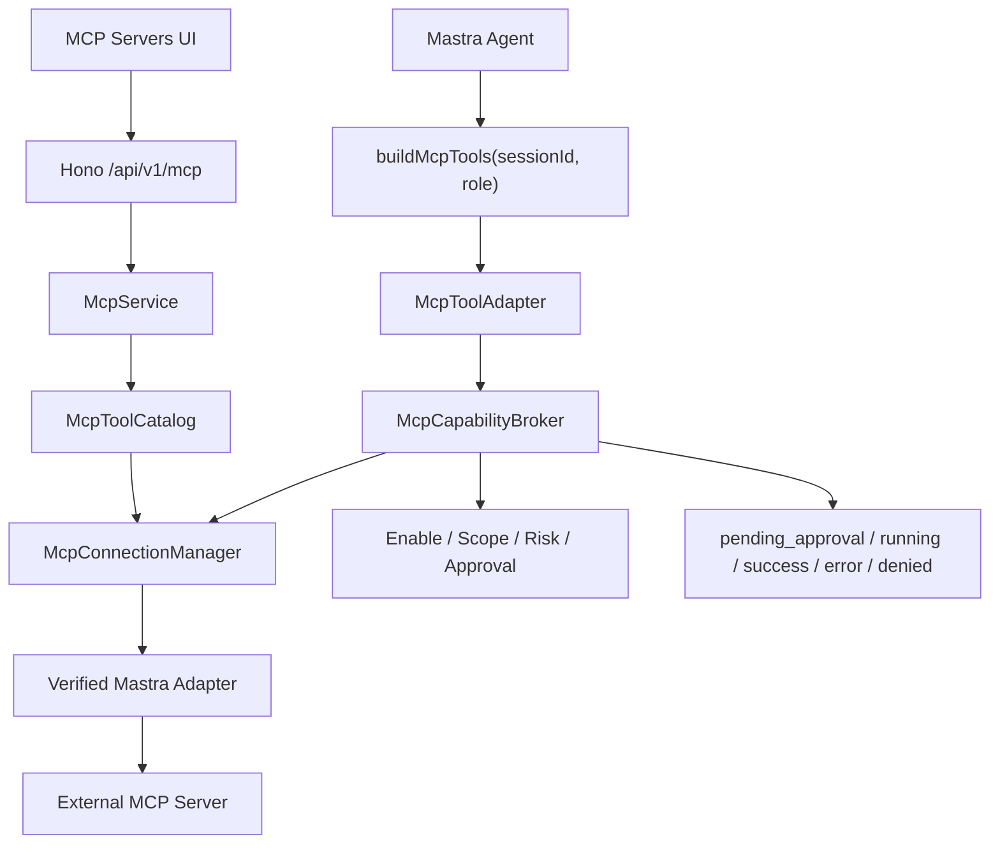
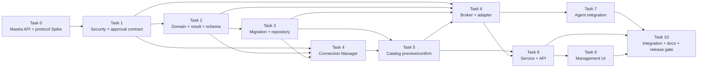
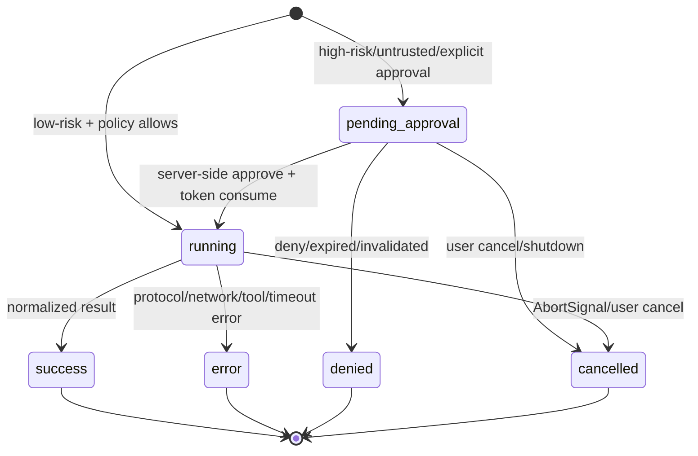

# BloomAI MCP Client Implementation Plan（审查修订版）

> **For agentic workers:** REQUIRED SUB-SKILL: Use `subagent-driven-development`（推荐）或 `executing-plans`，按 Task 顺序执行。所有步骤使用 checkbox（`- [ ]`）跟踪；未通过当前 Task 的验收，不得开始依赖它的后续 Task。

**Goal:** 让 BloomAI 以受控 MCP Client 方式连接外部 `stdio` / Streamable HTTP MCP Server，并将远端工具安全地发现、确认、启用、审批、执行和审计，再按 Agent Role 受控地提供给 Mastra Agent。

**Architecture:** BloomAI 新增独立的 `src/server/mcp` Provider 层。Mastra MCP 只负责经过 Spike 验证的连接和协议适配；BloomAI 自己负责配置校验、秘密解析、传输安全、Catalog Preview/Confirm、Tool Scope、审批 Token、输入/输出规范化、超时取消、审计和 Agent Tool Surface。MCP Tool 不直接挂载 Mastra 返回的原始工具对象，所有执行都经过 MCP Capability Broker。

**Tech Stack:** TypeScript、Hono、SQLite/Drizzle、编号 SQL Migration、Zod、Mastra Core 1.x、`@mastra/mcp` 精确版本、Vitest、React、Zustand。

**Revision status:** 2026-08-06 审查修订版。当前仅为实施计划，尚未开始编码；在 Task 0、Task 1、Task 2 的 Gate 通过前，不得进入正式实现。

---

## 0. 实施准入、范围和硬性规则

### 0.1 实施前必须满足的 Gate

以下条件全部满足后，才允许进入 Task 3 数据库实现：

- [ ] 已通过 Task 0：Mastra MCP 实际 API、版本、transport、Tool 执行、结果映射、AbortSignal 和 disconnect 行为已经有测试证据。
- [ ] 已通过 Task 1：秘密、stdio、HTTP SSRF、审批 Token、Approval Store、结果脱敏策略已经有失败测试和通过测试。
- [ ] 已通过 Task 2：领域类型、错误协议、JSON Schema 支持边界和 `NormalizedMcpResult` 已确定。
- [ ] 实施计划中的 `/api/mcp` 已统一改为项目现有的 `/api/v1/mcp`。
- [ ] 计划中不存在客户端可伪造的 `approvalGranted: boolean` 授权路径。
- [ ] 计划中不存在 `MCPClient.getTools()`、未验证的公共 `callTool()` 或 `tool.id` 即远端名称的假设。

### 0.2 一期范围

一期实现：

1. BloomAI 作为 MCP Client。
2. 手工配置外部 `stdio` 和 Streamable HTTP MCP Server。
3. 测试连接、发现 Tool、查看 Diff、用户确认后写入 Catalog。
4. Server 和 Tool 的独立启用/禁用。
5. General Chat 受控使用已启用的 MCP Tool。
6. 手工 Tool Test 和 Agent Tool Call 共用同一套 Broker、审批和审计协议。
7. 低风险自动调用、中高风险和不可信 Server 的交互式审批。
8. 脱敏、截断、错误归类、超时取消和连接恢复。
9. 本地 Fake Client、真实 stdio Fixture 和真实 Streamable HTTP Fixture 测试。

### 0.3 一期非范围

以下能力不在一期公开产品契约中：

- BloomAI 作为 MCP Server；
- MCP 市场、Server 自动安装或远程下载可执行文件；
- OAuth 登录流程；
- Electron Secret Vault；
- 容器或操作系统级沙箱；
- SSE 作为独立支持的 transport；
- MCP Server 导入/导出模板；
- 多租户云端凭据托管。

如果 Mastra 的 HTTP 实现无法关闭 SSE fallback，Task 0 必须证明能够检测并拒绝 fallback；不能在未记录决策的情况下把 SSE 静默纳入一期范围。

### 0.4 不能违反的安全规则

- 不接受客户端传入 `approvalGranted: true` 作为授权事实。
- 不接受客户端传入 `trustLevel`、`riskLevel` 或 `requiresApproval` 覆盖数据库策略。
- resolved environment、HTTP header 值、Token、未脱敏 input/output 不得进入 SQLite、日志、HTTP Response、前端 state 或测试快照。
- stdio 使用 `shell: false`，不继承完整 `process.env`，不允许任意 shell 拼接。
- HTTP 目标必须执行 URL、DNS 解析结果、redirect 目标和私网地址检查。
- Tool 超时必须传递 `AbortSignal`；若 transport 无法可靠取消，必须使对应 client 失效并禁止对非幂等 Tool 自动重试。
- 新发现 Tool 默认不进入 Agent Tool Surface，必须经过用户确认或显式启用。
- Tool description、schema、content 和 structuredContent 都是不可信外部输入，不能被当作系统指令执行。
- `MCP_CLIENT_ENABLED` 未明确设为 `true` 时必须 fail closed：不建立外部连接、不执行 MCP Tool、不向 Agent Tool Surface 注册 MCP Tool；历史 Runs 仍可只读查询。

### 0.5 当前仓库约束

- 现有 API 前缀是 `/api/v1`，由 `src/shared/constants/api.ts` 和 `src/server/http/app.ts` 统一维护。
- 数据库使用 `scripts/migrations/*.sql` 和 `schema_migrations`，MCP 必须新增编号 migration，不得只在启动 bootstrap 中建表。
- 当前审批 Token 机制禁止客户端直接传入 `approvalGranted`，MCP 必须复用同等安全级别的后端 Token/Approval Store 流程。
- 当前 Agent Tool Surface 在 `src/server/mastra/tools.ts` 中同步构建；MCP Catalog 只能提供本地已确认的同步元数据，连接操作不能放入每次 Agent Tool Surface 构建路径。
- 开始每个 Task 前执行 `git status --short`，只允许修改该 Task 的 Files 列表；不得修改、回退或暂存无关工作区文件。
- 每个 Task 必须先写失败测试，再写最小实现；Task 完成后执行列出的定向测试和 `npm run typecheck`。

---

## 1. 本次审查修订的决策矩阵

| 审查问题 | 修订后的实施决策 | 落地 Task |
|---|---|---|
| Mastra API 假设错误 | 先用真实包版本验证 `listTools`、Tool `execute`、结果和断开；Provider 不依赖未验证的 `getTools/callTool/close` | Task 0、Task 4 |
| `^1.13.0` 被错误称为锁定 | 使用精确版本；候选版本为 `@mastra/mcp@1.15.1`，最终必须以 Spike 通过版本写入 package.json 和 lockfile | Task 0 |
| `approvalGranted` 可绕过审批 | 使用 MCP 专用一次性 Approval Token；绑定 Server、Tool、Session、Input Hash、Catalog Version 和过期时间 | Task 1、Task 6、Task 8 |
| Chat 审批未闭环 | 使用 `approvalRequestId` + 后端 Approval Store；用户批准后由服务端恢复同一 Tool Call，不向客户端暴露授权布尔值 | Task 1、Task 6、Task 7、Task 9 |
| 结果模型过度简化 | 定义 `NormalizedMcpResult`，分别处理 content、structuredContent、isError、truncated 和不支持的内容类型 | Task 2、Task 6 |
| denied 审计顺序矛盾 | 增加 `pending_approval` 状态；先创建脱敏审计记录，再进入审批/执行状态机 | Task 3、Task 6 |
| test/refresh/confirm/enable 不闭环 | 使用 `previewHash + configHash`；confirm 时重新发现并校验 hash，确认后原子写入 Catalog | Task 5、Task 8、Task 9 |
| API 路径不一致 | 全部使用 `/api/v1/mcp`，前端请求基于 `API_BASE` | Task 8、Task 9 |
| stdio 边界不足 | 禁 shell、最小 env、cwd/超时/孤儿进程清理、配置变更自动禁用 | Task 1、Task 4、Task 10 |
| HTTP SSRF 风险 | URL、DNS、redirect、loopback/private/link-local/metadata 检查，明确本地 HTTP 例外 | Task 1、Task 4、Task 10 |
| env 引用可能读取任意秘密 | `MCP_ALLOWED_ENV_NAMES` allowlist；只解析允许变量；resolved value 只存在调用内存 | Task 1、Task 8 |
| DB 只做 bootstrap | 新增 `044-mcp-client.sql`，同步更新 Drizzle schema 和 schema contract | Task 3 |
| JSON Schema 静默宽松降级 | 明确一期支持子集；unsupported schema 跳过 Tool，不得退化为 passthrough | Task 2、Task 6 |
| Agent Role 未闭合 | `buildMcpTools(sessionId, role)` 显式过滤；General Chat 默认允许，Writing 默认禁止，Coding 只允许显式 allowlist | Task 7 |
| timeout 可能只停止等待 | `AbortSignal`、client invalidate/reconnect、非幂等 Tool 不自动重试 | Task 4、Task 6、Task 10 |
| SSE 范围矛盾 | 一期不公开支持 SSE；Mastra fallback 必须检测并拒绝或在 Task 0 形成明确兼容决策 | Task 0 |
| 新 Tool 默认启用 | 新 Tool 默认 `is_enabled=0`；schema 变化的 Tool 自动进入 review/disabled | Task 5 |
| 远端删除影响历史 | Catalog 使用软删除/`is_removed`，保留历史运行可读性 | Task 3、Task 5 |

---

## 2. 目标架构和文件边界

### 2.1 调用链



### 2.2 文件职责

| 文件 | 职责 |
|---|---|
| `src/server/mcp/types.ts` | MCP Server、Tool、Run、Preview、Approval、Role Scope 和结果类型 |
| `src/server/mcp/schemas.ts` | 配置、API 输入、Tool 输入和响应边界的 Zod schema |
| `src/server/mcp/errors.ts` | 稳定 MCP 错误码、HTTP 映射和可安全展示的错误消息 |
| `src/server/mcp/secret-resolver.ts` | `${env:NAME}` 解析、allowlist 和 redaction |
| `src/server/mcp/feature-flag.ts` | `MCP_CLIENT_ENABLED` 的服务端 fail-closed 判定；不承担 UI 授权 |
| `src/server/mcp/security-policy.ts` | 风险推导、默认审批策略和连接安全策略 |
| `src/server/mcp/role-scope.ts` | Agent Role 到 MCP Tool allowlist 的服务端过滤 |
| `src/server/mcp/transport-policy.ts` | stdio/HTTP transport 安全约束、SSRF 和子进程策略 |
| `src/server/mcp/approval-token.ts` | MCP 专用一次性审批 Token |
| `src/server/mcp/approval-store.ts` | 短生命周期的 pending approval 内存状态，不持久化原始敏感 input |
| `src/server/mcp/result-normalizer.ts` | `CallToolResult` 到 `NormalizedMcpResult` 的规范化、脱敏和截断 |
| `src/server/mcp/json-schema.ts` | 受限 JSON Schema 到 Zod 的安全转换 |
| `src/server/mcp/mastra-adapter.ts` | 唯一允许导入 `@mastra/mcp` 的生产模块 |
| `src/server/mcp/connection-manager.ts` | 连接缓存、并发去重、失效、重连和关闭 |
| `src/server/mcp/tool-catalog.ts` | preview、diff、confirm、schema hash、软删除和启用状态 |
| `src/server/mcp/capability-broker.ts` | MCP Tool 执行状态机、审批、审计、超时和错误治理 |
| `src/server/mcp/tool-adapter.ts` | Catalog Tool 到 Mastra `createTool` 的适配 |
| `src/server/mcp/mcp.service.ts` | Route 可调用的应用服务 |
| `src/server/mcp/index.ts` | MCP Provider 稳定入口和生命周期注册 |
| `src/server/db/repositories/mcp.repo.ts` | 三张 MCP 表的 Repository 操作 |
| `src/server/http/routes/mcp.ts` | `/api/v1/mcp` Hono 路由 |

### 2.3 不允许的依赖方向

- `src/server/mastra/tools.ts` 不得直接 import `@mastra/mcp`。
- `src/server/http/routes/mcp.ts` 不得直接操作 SQLite。
- Renderer 不得接收 resolved header、resolved env 或审批 Token secret。
- `MCP_CLIENT_ENABLED` 必须在 Connection Manager、Capability Broker、McpService 和 Agent Tool Surface 入口由服务端再次检查；Renderer 只能据此隐藏入口，不能作为授权边界。
- Connection Manager 不得决定风险等级或批准 Tool。
- Catalog 不得直接执行 Tool。
- Broker 不得读取前端传来的 trust/risk/approval boolean 作为授权依据。

---

## 3. 任务依赖图和执行规则



### 3.1 推荐实施顺序

主线按以下顺序严格执行，不在未通过前置验收时提前进入后续实现：

```text
Task 0 → Task 1 → Task 2 → Task 3 → Task 4 → Task 5 → Task 6 → Task 7 → Task 8 → Task 9 → Task 10
```

- Task 0～Task 2 是 P0 方案准入 Gate；Task 3～Task 6 先建立可执行的后端闭环；Task 7～Task 9 再接 Agent、API 和 UI；Task 10 统一做真实协议、安全、回归和发布验收。
- 只有在前置 Task 的 Files、定向测试、`npm run typecheck` 和 `git diff --check` 全部通过后，才允许开始下一个 Task；本计划默认不并行修改共享文件。

执行规则：

1. Task 0、Task 1、Task 2 是实现准入 Gate，任何一个失败都不得继续。
2. 每个 Task 先添加失败测试，再实现最小代码。
3. 每个 Task 完成后运行该 Task 的定向测试和 `npm run typecheck`。
4. 每个连接/协议行为至少有一个 Fake Client 测试和一个真实 Fixture 测试；不允许只依赖 mock。
5. 每次修改路由必须同时修改 route test 和前端 store test。
6. 每次修改数据库必须同时修改 migration test、schema contract test 和 repository test。
7. 任何涉及 secrets 的测试只能使用合成值，例如 `test-mcp-token`，不得使用真实环境变量。

---
## 4. Task 0：Mastra MCP API、版本和协议 Spike

**目标：** 证明当前 `@mastra/core` 与候选 `@mastra/mcp` 的实际 API 能够完成 MCP Client MVP，并把所有不确定性转化为固定接口和测试证据。

**Files:**

- Modify: `package.json`
- Modify: `package-lock.json`
- Create: `scripts/mcp-spike.ts`（仅用于 Spike；完成后删除）
- Create: `src/server/mcp/mastra-adapter.contract.test.ts`
- Create: `tests/fixtures/mcp/stdio-server.mjs`
- Create: `tests/fixtures/mcp/http-server.mjs`
- Create: `docs/MCP/mcp-mastra-spike-result.md`

### Step 1：固定候选依赖并验证类型声明

- [ ] 先执行：

```powershell
git status --short
npm view @mastra/mcp@1.15.1 version peerDependencies --json
```

- [ ] 将候选依赖以精确版本写入 `package.json`，禁止使用 `^`：

```json
{
  "dependencies": {
    "@mastra/mcp": "1.15.1"
  }
}
```

- [ ] 执行：

```powershell
npm install --save-exact @mastra/mcp@1.15.1
```

- [ ] 如果 `1.15.1` 与当前 `@mastra/core@1.51.0` 无法 typecheck 或运行连接，停止后将实际通过验证的精确版本写入本计划、`package.json` 和 `package-lock.json`，不得改成 caret 版本后继续。

### Step 2：记录实际公开 API

- [ ] 在 `scripts/mcp-spike.ts` 中只做最小实验，验证以下事实：

```ts
// 验证草稿：`MCPClient`、构造参数和方法名必须以安装版本的类型声明为准。
// 如果候选版本导出的名称不同，使用实际导出替换本段，不把草稿当作生产契约。
const client = new MCPClient({
  servers: {
    example: {
      command: process.execPath,
      args: ['tests/fixtures/mcp/stdio-server.mjs'],
      env: {},
    },
  },
})

const discovered = await client.listTools()
const toolsets = await client.listToolsets()
```

- [ ] 明确记录：

  - 单 Server 和多 Server 的构造形式；
  - `listTools()` 或等价 API 的返回类型；
  - Mastra Tool 的命名规则；
  - 远端原始 `tool.name` 的可获取位置；
  - Tool `execute()` 的参数和 `AbortSignal` 传递方式；
  - `structuredContent`、`content`、`isError` 的返回方式；
  - disconnect、reconnect 和连接失败后的行为；
  - HTTP Streamable transport 是否会 fallback 到 SSE。

### Step 3：建立真实 stdio 和 HTTP Fixture

- [ ] `tests/fixtures/mcp/stdio-server.mjs` 提供三个确定行为的 Tool：

  - `read_only_echo`：返回结构化 JSON；
  - `return_error`：返回 `isError=true`；
  - `slow_tool`：等待外部 AbortSignal 或超时。

- [ ] `tests/fixtures/mcp/http-server.mjs` 提供相同的 Tool，并只监听测试分配的 loopback 端口。
- [ ] Fixture 不读取真实环境变量，不执行 shell，不访问外网，不使用 `npx` 下载依赖。

### Step 4：编写协议契约测试

- [ ] 在 `src/server/mcp/mastra-adapter.contract.test.ts` 中断言：

  - 可以发现 `read_only_echo`；
  - Catalog 可以保存远端原始名称和 Mastra 名称的映射；
  - 可以执行结构化结果；
  - `isError` 不会被误判为成功；
  - AbortSignal 被传递到慢 Tool；
  - 测试连接结束后临时 client 被关闭；
  - 无法关闭或检测 SSE fallback 时测试失败，而不是静默接受。

### Step 5：形成 Spike 结果并删除临时代码

- [ ] 在 `docs/MCP/mcp-mastra-spike-result.md` 中记录：

  - 精确依赖版本；
  - 实际公开 API；
  - Provider 内部接口；
  - 结果映射；
  - 取消和重连策略；
  - SSE 决策；
  - 未解决问题和对应阻塞原因。

- [ ] 将 `scripts/mcp-spike.ts` 中已经覆盖的行为迁移到正式测试或删除该文件。

### 验证

```powershell
npm test -- src/server/mcp/mastra-adapter.contract.test.ts
npm run typecheck
```

**Task 0 验收：** 只有在真实 stdio、真实 HTTP、结构化结果、错误结果、取消、关闭和 transport 策略都有通过测试后，Task 0 才算完成。

---

## 5. Task 1：安全边界、秘密解析和审批协议

**目标：** 在任何数据库和 Agent 实现之前，固定秘密、transport、审批和临时 Approval 状态的安全契约。

**Files:**

- Create: `src/server/mcp/secret-resolver.ts`
- Create: `src/server/mcp/secret-resolver.test.ts`
- Create: `src/server/mcp/transport-policy.ts`
- Create: `src/server/mcp/transport-policy.test.ts`
- Create: `src/server/mcp/approval-token.ts`
- Create: `src/server/mcp/approval-token.test.ts`
- Create: `src/server/mcp/approval-store.ts`
- Create: `src/server/mcp/approval-store.test.ts`
- Create: `src/server/mcp/feature-flag.ts`
- Create: `src/server/mcp/feature-flag.test.ts`
- Create: `src/server/mcp/security-policy.ts`
- Create: `src/server/mcp/security-policy.test.ts`

### Step 1：写失败测试固定安全边界

- [ ] 覆盖以下场景：

  - `${env:NAME}` 格式正确时可以解析；
  - 非 allowlist 环境变量拒绝解析；
  - 缺失环境变量返回稳定错误且不包含变量值；
  - resolved value 不出现在序列化配置、错误和日志 helper 中；
  - stdio 不允许 `shell: true`、空 command、非法 args；
  - stdio 不继承完整 `process.env`；
  - 默认拒绝 HTTP loopback/private/link-local/metadata 目标；
  - 明确启用本地开发策略时只允许 loopback，并仍要求用户确认；
  - DNS 解析到私网或 redirect 到私网时拒绝；
  - Token 过期、篡改、Session 不匹配、Server 不匹配、Tool 不匹配、Catalog Version 不匹配和重复消费都拒绝；
  - Approval Store 到期后删除原始 input；
  - Approval Store 有最大条目数和最大 input 大小限制。
  - `MCP_CLIENT_ENABLED` 缺省或为非 true 时，连接、执行、审批恢复和 Agent Tool Surface 都 fail closed。

### Step 2：实现服务端 Feature Flag 和严格环境变量解析

- [ ] 在 `src/server/mcp/feature-flag.ts` 中复用 `readConfigValue`，只有配置值去空格并等于 `true`（大小写不敏感）时返回 `true`；缺省、空值、`1`、`on` 和其他值全部返回 `false`：

```ts
export function isMcpClientEnabled(value = readConfigValue('MCP_CLIENT_ENABLED', 'false').value): boolean {
  return value.trim().toLowerCase() === 'true'
}
```

- [ ] 在 `feature-flag.test.ts` 覆盖缺省、`true`、大小写变体、`1`、`on` 和空白值；Connection Manager、Capability Broker、McpService 和 Agent Tool Surface 后续都必须调用同一个判定函数。

- [ ] 使用环境变量 `MCP_ALLOWED_ENV_NAMES` 作为全局 allowlist；值使用逗号分隔。
- [ ] 只接受变量名正则：

```text
^[A-Z_][A-Z0-9_]*$
```

- [ ] 解析结果只返回给当前连接构造函数；Repository、HTTP Response、UI state 和 Logger 只能使用模板和变量名。
- [ ] stdio 的 child process env 使用最小显式环境集合，不直接复制整个 `process.env`。

### Step 3：实现 transport policy

- [ ] stdio 使用结构化参数调用 `spawn(command, args, { shell: false })`。
- [ ] 禁止在 command 或 args 中拼接 shell 字符串。
- [ ] 支持显式 `cwd` 时，对路径执行工作区边界校验；一期不允许任意外部 cwd。
- [ ] HTTP 默认只允许 `https:`；loopback `http:` 只有测试或显式本地开发策略可用。
- [ ] DNS 解析后对每个地址执行 private/link-local/metadata 检查。
- [ ] redirect 次数限制为 0 或 1；每次 redirect 重新执行 scheme、host 和 IP 检查。
- [ ] 不允许自定义代理绕过目标检查。

### Step 4：实现 MCP Approval Token

- [ ] 使用独立版本化 Token 格式，例如：

```ts
type McpApprovalTokenPayload = {
  version: 1
  approvalId: string
  serverId: string
  toolId: string
  sessionId: string
  catalogVersion: number
  inputHash: string
  issuedAt: number
  expiresAt: number
  singleUse: true
}
```

- [ ] Token 使用现有 `TOOL_APPROVAL_TOKEN_SECRET` 的密钥来源，但使用 MCP 专用 payload 前缀。
- [ ] Token 只在服务端生成和消费；客户端只能拿到 `approvalRequestId`，不能拿到签名 secret。
- [ ] 审批 TTL 固定为 60 秒；消费必须原子地标记为已使用。

### Step 5：实现 Approval Store

- [ ] Store 只在进程内保存 pending approval 的最小执行上下文：

```ts
type PendingMcpApproval = {
  requestId: string
  runId: string
  serverId: string
  toolId: string
  sessionId: string
  catalogVersion: number
  input: Record<string, unknown>
  expiresAt: number
}
```

- [ ] Store 不写入 SQLite，不写入日志，不返回原始 input。
- [ ] UI 预览使用脱敏后的 input；服务端实际执行使用 Store 内的原始 input。
- [ ] 进程重启后 pending approval 全部失效，返回 `MCP_APPROVAL_EXPIRED`，不得恢复未经确认的副作用调用。

### 验证

```powershell
npm test -- src/server/mcp/secret-resolver.test.ts src/server/mcp/transport-policy.test.ts src/server/mcp/approval-token.test.ts src/server/mcp/approval-store.test.ts src/server/mcp/security-policy.test.ts
npm run typecheck
```

**Task 1 验收：** 任何连接配置都不能通过 env 模板、HTTP URL、stdio 参数或 approval boolean 绕过后端安全策略。

---

## 6. Task 2：领域类型、错误协议、结果模型和 JSON Schema 边界

**目标：** 建立后续 Repository、Connection Manager、Broker、API 和 UI 共用的稳定类型，不再使用 `Promise<object>` 表示 MCP 结果。

**Files:**

- Create: `src/server/mcp/types.ts`
- Create: `src/server/mcp/schemas.ts`
- Create: `src/server/mcp/errors.ts`
- Create: `src/server/mcp/result-normalizer.ts`
- Create: `src/server/mcp/json-schema.ts`
- Create: `src/server/mcp/types.test.ts`
- Create: `src/server/mcp/result-normalizer.test.ts`
- Create: `src/server/mcp/json-schema.test.ts`

### Step 1：定义核心类型

- [ ] 至少定义：

```ts
type McpTransport = 'stdio' | 'http'
type McpTrustLevel = 'untrusted' | 'reviewed' | 'trusted'
type McpRiskLevel = 'low' | 'medium' | 'high'
type McpAgentRole = 'general' | 'writing' | 'coding' | 'deep-research'
type McpRunStatus = 'pending_approval' | 'running' | 'success' | 'error' | 'denied' | 'cancelled'

type SafeMcpJsonValue = null | boolean | number | string | SafeMcpJsonValue[] | { [key: string]: SafeMcpJsonValue }
type NormalizedMcpResult = {
  content: Array<{
    type: 'text' | 'json' | 'image' | 'resource' | 'resource_link' | 'unsupported'
    text?: string
    json?: SafeMcpJsonValue
    uri?: string
    mimeType?: string
    omitted?: boolean
  }>
  structuredContent?: SafeMcpJsonValue
  isError: boolean
  truncated: boolean
  byteLength: number
}

type SafeMcpInputPreview = {
  fields: Record<string, string | number | boolean | null>
  omittedKeys: string[]
  truncated: boolean
}

type McpToolExecutionOptions = {
  sessionId: string
  role: McpAgentRole
  /** Internal-only; never part of HTTP, Renderer or persisted DTOs. */
  approvalToken?: string
  signal?: AbortSignal
}
```

- [ ] `DiscoveredMcpTool` 必须同时保留：

  - 远端原始 `remoteName`；
  - Mastra Tool 名称；
  - description；
  - raw input schema；
  - raw output schema；
  - input schema hash；
  - discovery timestamp。

### Step 2：定义稳定错误码

- [ ] 至少实现：

```text
MCP_CONFIG_INVALID
MCP_SECRET_NOT_ALLOWED
MCP_SECRET_MISSING
MCP_SSRF_BLOCKED
MCP_STDIO_POLICY_BLOCKED
MCP_CLIENT_DISABLED
MCP_SERVER_NOT_FOUND
MCP_TOOL_NOT_FOUND
MCP_SERVER_DISABLED
MCP_TOOL_DISABLED
MCP_ROLE_NOT_ALLOWED
MCP_APPROVAL_REQUIRED
MCP_APPROVAL_INVALID
MCP_APPROVAL_EXPIRED
MCP_PREVIEW_STALE
MCP_SCHEMA_UNSUPPORTED
MCP_CONNECTION_FAILED
MCP_PROTOCOL_ERROR
MCP_TOOL_ERROR
MCP_TOOL_TIMEOUT
MCP_TOOL_CANCELLED
MCP_RESULT_UNSUPPORTED
```

- [ ] 错误对象必须包含机器可读 `code` 和安全消息；不得把 command、header、env value 或原始远端错误完整返回给 UI。

### Step 3：定义并实现结果规范化

- [ ] `CallToolResult` 的 `structuredContent` 单独保存，不把它强行转换成普通字符串；规范化结果只允许 JSON-safe 值，拒绝循环对象、Buffer、函数、Symbol、BigInt 和不可序列化实例。
- [ ] `isError=true` 映射为 `MCP_TOOL_ERROR`，但同时保留脱敏后的结果内容供审计和诊断。
- [ ] 文本、JSON、资源、图片分别处理；一期不支持的二进制内容以 `unsupported` 摘要记录，不把任意 Buffer 写入 SQLite。
- [ ] 单次输出上限为 128 KiB；超出后设置 `truncated=true`，并在结果中保存安全摘要。

### Step 4：定义 JSON Schema 支持子集

- [ ] 一期只支持：

  - object root；
  - properties；
  - required；
  - additionalProperties；
  - string、number、integer、boolean、array；
  - string/number/integer/boolean enum；
  - items；
  - minLength、maxLength、minimum、maximum、pattern。

- [ ] 明确拒绝 `$ref`、`oneOf`、`anyOf`、`allOf`、递归 schema 和未知 draft；返回 `MCP_SCHEMA_UNSUPPORTED`。
- [ ] 禁止将转换失败的 schema 退化为 `z.object({}).passthrough()`。
- [ ] Tool schema 不可转换时，Catalog 保留发现记录，但 Agent Tool Surface 跳过该 Tool，并展示可诊断错误。

### 验证

```powershell
npm test -- src/server/mcp/types.test.ts src/server/mcp/result-normalizer.test.ts src/server/mcp/json-schema.test.ts
npm run typecheck
```

**Task 2 验收：** 后续 Task 只能使用这些领域类型和错误码，不得重新引入 `object`、未约束 `any` 或客户端授权 boolean。

---
## 7. Task 3：正式数据库 Migration 和 Repository

**目标：** 以正式编号 Migration 创建 MCP Server、Catalog、Run 和审批状态的持久化模型，同时保留远端删除后的历史可读性。

**Files:**

- Create: `scripts/migrations/044-mcp-client.sql`
- Create: `src/server/db/repositories/mcp.repo.ts`
- Create: `src/server/db/repositories/mcp.repo.test.ts`
- Modify: `src/server/db/schema.ts`
- Modify: `src/server/db/schema-contract.ts`
- Modify: `src/server/db/migrations.test.ts`
- Modify: `src/server/db/schema-contract.test.ts`

### Step 1：编写 migration 失败测试

- [ ] 测试空数据库运行全部 migration 后存在 `mcp_servers`、`mcp_server_tools`、`mcp_tool_runs`。
- [ ] 测试旧数据库升级只新增 MCP 表，不改变现有 Chat、Tools、Skills 表。
- [ ] 测试重复 migration 不重复创建或丢失数据。
- [ ] 测试唯一约束、外键、软删除、Run status check 和 schema contract。

### Step 2：创建 `mcp_servers`

- [ ] `scripts/migrations/044-mcp-client.sql` 至少包含：

```sql
CREATE TABLE IF NOT EXISTS mcp_servers (
  id TEXT PRIMARY KEY,
  name TEXT NOT NULL,
  description TEXT,
  transport TEXT NOT NULL CHECK (transport IN ('stdio', 'http')),
  endpoint TEXT,
  command TEXT,
  args_json TEXT NOT NULL DEFAULT '[]',
  headers_template_json TEXT NOT NULL DEFAULT '{}',
  env_template_json TEXT NOT NULL DEFAULT '{}',
  is_enabled INTEGER NOT NULL DEFAULT 0,
  trust_level TEXT NOT NULL DEFAULT 'untrusted'
    CHECK (trust_level IN ('untrusted', 'reviewed', 'trusted')),
  status TEXT NOT NULL DEFAULT 'disabled'
    CHECK (status IN ('disabled', 'connecting', 'connected', 'degraded', 'error')),
  config_hash TEXT NOT NULL,
  catalog_version INTEGER NOT NULL DEFAULT 0,
  last_connected_at INTEGER,
  last_tool_sync_at INTEGER,
  last_error TEXT,
  deleted_at INTEGER,
  created_at INTEGER NOT NULL,
  updated_at INTEGER NOT NULL,
  CHECK (
    (transport = 'stdio' AND command IS NOT NULL AND endpoint IS NULL)
    OR
    (transport = 'http' AND endpoint IS NOT NULL AND command IS NULL)
  )
);
```

### Step 3：创建 `mcp_server_tools`

- [ ] 字段至少包含：

```sql
CREATE TABLE IF NOT EXISTS mcp_server_tools (
  id TEXT PRIMARY KEY,
  server_id TEXT NOT NULL,
  remote_name TEXT NOT NULL,
  mastra_name TEXT NOT NULL,
  name TEXT NOT NULL,
  description TEXT NOT NULL DEFAULT '',
  input_schema_json TEXT NOT NULL,
  output_schema_json TEXT,
  input_schema_hash TEXT NOT NULL,
  is_enabled INTEGER NOT NULL DEFAULT 0,
  is_removed INTEGER NOT NULL DEFAULT 0,
  requires_approval INTEGER NOT NULL DEFAULT 1,
  risk_level TEXT NOT NULL DEFAULT 'medium'
    CHECK (risk_level IN ('low', 'medium', 'high')),
  allowed_roles_json TEXT NOT NULL DEFAULT '["general"]',
  is_idempotent INTEGER NOT NULL DEFAULT 0,
  discovered_at INTEGER NOT NULL,
  last_seen_at INTEGER,
  removed_at INTEGER,
  updated_at INTEGER NOT NULL,
  UNIQUE(server_id, remote_name),
  FOREIGN KEY (server_id) REFERENCES mcp_servers(id)
);
```

- [ ] 新 Tool 默认 `is_enabled=0`；远端删除使用 `is_removed=1`，不物理删除历史 Catalog。

### Step 4：创建 `mcp_tool_runs`

- [ ] 字段至少包含：

```sql
CREATE TABLE IF NOT EXISTS mcp_tool_runs (
  id TEXT PRIMARY KEY,
  server_id TEXT NOT NULL,
  tool_id TEXT NOT NULL,
  session_id TEXT,
  approval_request_id TEXT,
  catalog_version INTEGER NOT NULL,
  input_json TEXT NOT NULL,
  output_json TEXT,
  status TEXT NOT NULL CHECK (
    status IN ('pending_approval', 'running', 'success', 'error', 'denied', 'cancelled')
  ),
  error_code TEXT,
  error_msg TEXT,
  duration_ms INTEGER,
  truncated INTEGER NOT NULL DEFAULT 0,
  started_at INTEGER NOT NULL,
  finished_at INTEGER
);
```

- [ ] `input_json` 和 `output_json` 只保存脱敏、截断后的内容；审批所需原始 input 只存在 Approval Store。

### Step 5：实现 Repository

- [ ] 实现以下操作：

  - `listServers`、`findServer`、`insertServer`、`updateServer`、`softDeleteServer`；
  - `listTools`、`findTool`、`upsertDiscoveredTool`、`markRemovedTools`、`setToolEnabled`；
  - `startPendingRun`、`markRunRunning`、`completeRun`、`failRun`、`denyRun`、`cancelRun`；
  - `listRuns`，默认按 `started_at DESC` 且不返回秘密。

- [ ] 所有 Repository 方法只接收领域类型，不接收未校验的 JSON 字符串。
- [ ] Server soft delete 时设置 `is_enabled=0`，保留 Tool Catalog 和历史 Runs。

### 验证

```powershell
npm test -- src/server/db/migrations.test.ts src/server/db/schema-contract.test.ts src/server/db/repositories/mcp.repo.test.ts
npm run typecheck
```

**Task 3 验收：** 新旧数据库都能完成 migration；删除 Server 不影响历史 Run；schema contract 与 SQL migration、Drizzle schema 一致。

---

## 8. Task 4：Connection Manager 和经过验证的 Mastra Adapter

**目标：** 仅在一个生产模块中导入 `@mastra/mcp`，实现连接缓存、并发去重、临时连接、AbortSignal、失效和优雅关闭。

**Files:**

- Create: `src/server/mcp/mastra-adapter.ts`
- Create: `src/server/mcp/connection-manager.ts`
- Create: `src/server/mcp/mastra-adapter.test.ts`
- Create: `src/server/mcp/connection-manager.test.ts`
- Create: `src/server/mcp/index.ts`
- Modify: `src/server/index.ts`

### Step 1：固定 Provider 内部接口

- [ ] 根据 Task 0 实测 API 定义：

```ts
interface ConnectedMcpClient {
  listTools(): Promise<DiscoveredMcpTool[]>
  execute(
    remoteToolKey: string,
    input: Record<string, unknown>,
    options: { signal?: AbortSignal },
  ): Promise<NormalizedMcpResult>
  disconnect(): Promise<void>
}

interface McpClientFactory {
  connect(config: ResolvedMcpServerConfig): Promise<ConnectedMcpClient>
}
```

- [ ] 如果 Mastra 不能直接提供 `remoteToolKey` 到远端原始 Tool 的映射，`mastra-adapter.ts` 必须显式维护映射；不得使用 `tool.id ?? tool.name` 作为未经验证的远端名称。
- [ ] `mastra-adapter.ts` 是唯一可以 import `@mastra/mcp` 的生产文件。

### Step 2：编写 Connection Manager 失败测试

- [ ] 并发 `getClient(serverId)` 只调用一次 factory connect。
- [ ] 连接失败不缓存失败 client。
- [ ] `connectTemporary` 在成功、失败和超时路径都调用 disconnect。
- [ ] Server 配置 hash 改变时旧 client 被 invalidate。
- [ ] Tool timeout 后对应 client 被标记为 stale，不会继续接收成功结果。
- [ ] `disconnectAll()` 幂等，重复调用不重复关闭。
- [ ] Server 连接失败不会抛出到 Hono 进程级别。

### Step 3：实现连接缓存和失效

- [ ] 缓存 key 为 `serverId + configHash`；旧配置不能复用旧 client。
- [ ] 连接状态更新通过 Repository 写入 `connecting/connected/error/degraded`。
- [ ] 连接只允许一次重建；非幂等 Tool 不在 timeout 后自动重试。
- [ ] 每个 client 都记录 transport 类型和最后使用时间；日志只写 serverId、transport、错误类别和耗时。

### Step 4：接入应用退出清理

- [ ] 在 `src/server/index.ts` 的 `gracefulShutdown` 中调用 `mcpConnectionManager.disconnectAll()`。
- [ ] MCP 关闭失败只能记录清理错误，不得阻止其他 runtime shutdown。
- [ ] 测试 SIGTERM/SIGINT 清理路径时使用 Fake Client，不启动真实外部程序。

### 验证

```powershell
npm test -- src/server/mcp/mastra-adapter.test.ts src/server/mcp/connection-manager.test.ts
npm run typecheck
```

**Task 4 验收：** 连接生命周期、并发去重、AbortSignal、失效和关闭都有测试；不存在未验证的 Mastra API 假设。

---

## 9. Task 5：Tool Catalog Preview、Diff 和 Confirm

**目标：** 将远端动态 Tool 目录转换为可审查、可确认、可回滚的本地 Catalog；刷新只产生 Preview，只有用户确认且 Preview 未过期时才写入正式 Catalog。

**Files:**

- Create: `src/server/mcp/tool-catalog.ts`
- Create: `src/server/mcp/tool-catalog.test.ts`
- Modify: `src/server/db/repositories/mcp.repo.ts`
- Modify: `src/server/db/repositories/mcp.repo.test.ts`
- Modify: `src/server/mcp/types.ts`
- Modify: `src/server/mcp/schemas.ts`

### Step 1：先写 Preview 和 Diff 的失败测试

- [ ] 使用 Fake `ConnectedMcpClient` 返回以下目录：一个新增 Tool、一个 schema 未变化 Tool、一个 schema 变化 Tool，以及一个已从远端删除的 Tool。
- [ ] 断言 Preview 包含 `serverId`、安全的 `configHash`、当前 `catalogVersion`、`previewHash`、过期时间、完整 Diff 和每个 Tool 的安全元数据。
- [ ] 断言 Diff 至少区分 `added`、`unchanged`、`changed`、`removed`；Preview 不会把 resolved header、resolved env 或任何秘密写入结果。
- [ ] 断言新 Tool 默认 `is_enabled=0`；schema 变化 Tool 自动设置为 disabled/review；远端删除 Tool 只进入 `is_removed=1`，不物理删除。
- [ ] 断言 Preview 过期、`configHash` 不一致、`catalogVersion` 不一致或 `previewHash` 不一致时，Confirm 在任何写入前返回 `MCP_PREVIEW_STALE`。
- [ ] 断言重复 Confirm 使用同一个已确认 Preview 是幂等的，不会重复增加 `catalogVersion`。

### Step 2：定义稳定 Hash 和本地 Tool ID

- [ ] 在 `tool-catalog.ts` 中使用排序后的稳定 JSON 序列化再计算 SHA-256；`configHash` 只包含 transport、endpoint/command、args、env 变量名模板和安全策略字段，不包含 resolved secret、时间戳和进程状态。
- [ ] 使用 `serverId + remoteName` 生成稳定的本地 `toolId`；本地 `toolId` 只能用于 BloomAI Catalog 和审计，不能替代远端原始 `remoteName`。
- [ ] `previewHash` 绑定 `serverId`、`configHash`、`catalogVersion`、Diff 和每个 Tool 的 schema hash，避免客户端仅修改一项字段后复用旧 Preview。
- [ ] `mastraName` 只作为经过 Task 0 验证的 Agent 显示/调用键；如果不同 Server 产生同名 Mastra Tool，必须加稳定 Server 命名空间，不能静默覆盖。

### Step 3：实现只读 Preview

- [ ] `preview(serverId)` 先检查 Server 未被软删除、配置有效且当前连接策略允许，然后通过 `ConnectionManager` 获取 client 并执行经过验证的 `listTools()`。
- [ ] 将远端结果规范化为 `DiscoveredMcpTool`，保留 `remoteName`、经过验证的 `mastraName`、描述、raw input/output schema、schema hash 和发现时间。
- [ ] 对不支持的 input schema 保留 Catalog Preview 记录并附带 `MCP_SCHEMA_UNSUPPORTED` 诊断；Preview 阶段不得把该 Tool 标记为可执行。
- [ ] Preview 不写入三张 MCP 表；只在短生命周期的服务端 Preview Store 中保存必要的 safe snapshot，或按 `previewHash` 重新计算，不保存 resolved secret。

### Step 4：实现原子 Confirm

- [ ] `confirm(serverId, { previewHash, expectedConfigHash, expectedCatalogVersion })` 重新获取当前配置和远端目录，重新计算 Preview Hash 后再开始数据库事务。
- [ ] 事务内按 `serverId + remoteName` upsert；对新增、schema 变化、恢复和删除分别更新 `is_enabled`、`is_removed`、`removed_at`、`last_seen_at` 和 `updated_at`。
- [ ] 只有确认成功后才递增 `mcp_servers.catalog_version`；事务失败时不得留下部分 Tool 更新或半递增版本。
- [ ] Server 的连接状态、最后同步时间和安全错误只写入安全字段；远端完整描述和输出不作为授权依据。

### Step 5：验证

```powershell
npm test -- src/server/mcp/tool-catalog.test.ts src/server/db/repositories/mcp.repo.test.ts
npm run typecheck
```

**Task 5 验收：** 用户能看到可解释的新增/变化/删除 Diff；没有确认不能改变 Catalog；schema 变化不会继续以旧授权执行；重复确认、过期确认和并发确认均有确定结果。

---

## 10. Task 6：MCP Capability Broker 和 Mastra Tool Adapter

**目标：** 将已确认 Catalog Tool 接入统一 Broker；所有手工测试、HTTP 调用和 Agent 调用共享同一套启用检查、Role Scope、风险审批、Approval Store、超时、结果规范化和审计状态机。

**Files:**

- Create: `src/server/mcp/capability-broker.ts`
- Create: `src/server/mcp/capability-broker.test.ts`
- Create: `src/server/mcp/tool-adapter.ts`
- Create: `src/server/mcp/tool-adapter.test.ts`
- Modify: `src/server/mcp/security-policy.ts`
- Create: `src/server/mcp/role-scope.ts`
- Create: `src/server/mcp/role-scope.test.ts`
- Modify: `src/server/db/repositories/mcp.repo.ts`
- Modify: `src/server/db/repositories/mcp.repo.test.ts`

### Step 1：先固定 Broker 状态机失败测试

- [ ] 定义并测试以下状态转移：

```text
request -> pending_approval -> running -> success
request -> pending_approval -> denied
request -> pending_approval -> cancelled
request -> running -> error
request -> running -> cancelled
request -> running -> error(MCP_TOOL_TIMEOUT)
```

- [ ] 缺少 Server、软删除 Server、disabled Server、missing Tool、removed Tool、disabled Tool、role 不允许或 schema 不支持时，不得建立远端调用；返回对应稳定错误并记录安全的 denied/error Run。
- [ ] 新增 Tool、untrusted Server、high-risk Tool、`requires_approval=1` 的 Tool 必须先创建 `pending_approval` Run 和 Approval Store 条目，再返回安全的 approval request；远端 Tool 不能在 pending 阶段被调用。
- [ ] 已批准请求必须使用原始 `input` 的服务端 hash；任何客户端替换 input、Server、Tool、Session、Catalog Version 或过期请求都拒绝。
- [ ] Deny 必须完成 `pending_approval -> denied` 审计；Approval Store 中的原始 input 随即删除。
- [ ] Server/Tool 在等待期间被禁用或 Catalog Version 变化时，Approve 不得执行远端 Tool，必须返回 `MCP_PREVIEW_STALE` 或 `MCP_TOOL_DISABLED`。
- [ ] 低风险、已启用、Role 允许且无需交互批准的 Tool 直接进入 `running`；Broker 仍然重新检查数据库状态，不信任 Agent Surface 的旧快照。

### Step 2：定义 Broker 的服务端接口

- [ ] 在 `capability-broker.ts` 中定义明确的输入和结果类型，禁止用 `Promise<object>`：

```ts
type McpCallRequest = {
  serverId: string
  toolId: string
  input: Record<string, unknown>
  sessionId: string
  role: McpAgentRole
  caller: 'agent' | 'http' | 'ui'
  approvalToken?: string
  signal?: AbortSignal
}

type McpCallOutcome =
  | { kind: 'completed'; runId: string; result: NormalizedMcpResult }
  | {
      kind: 'pending_approval'
      runId: string
      approvalRequestId: string
      expiresAt: number
      preview: SafeMcpInputPreview
    }
```

- [ ] `approvalToken` 只能由服务端恢复流程内部传入；HTTP/UI 请求只允许传 `approvalRequestId`，不能传 `approvalGranted`、`trustLevel`、`riskLevel` 或 `requiresApproval` 覆盖字段。
- [ ] Broker 对每次调用先读取当前 Catalog，再创建 safe input/output 审计字段；原始 input 只写 Approval Store。

### Step 3：实现风险、Role Scope 和审批闭环

- [ ] 在 `security-policy.ts` 中实现服务端风险推导：远端声明不提升权限；按 Tool 名称和描述采用保守默认值，`write`、`delete`、`send`、`payment`、`transfer` 等默认 high，`read`、`list`、`search`、`fetch` 等默认 low，其余 medium。
- [ ] `high` 风险 Tool 不允许通过 UI 降为免审批；untrusted Server 的任何 Tool 默认需要审批；只有显式确认且满足数据库策略时才可关闭 low-risk Tool 的交互审批。
- [ ] 在 `role-scope.ts` 中实现：General Chat 默认允许已启用 MCP Tool；Writing 默认拒绝全部 MCP Tool；Coding 只允许 `allowed_roles_json` 显式包含 `coding` 的 Tool；Deep Research 一期拒绝全部 MCP Tool。
- [ ] 在 `tool-adapter.ts` 中把 Catalog Tool 转换成 Mastra `createTool`，input schema 必须来自 Task 2 的受限 JSON Schema 转换；转换失败的 Tool 不进入 Agent Surface。
- [ ] Adapter 使用 Catalog 中已验证的 `mastraName` 作为 Agent key，同时闭包内只保存 local `toolId`，实际远端调用永远使用保存的 `remoteName` 映射。
- [ ] 如果 Task 0 证明 Mastra `requireApproval` 能安全恢复同一 Tool Call，则仅用它生成 UI approval card；真正执行仍由 Broker 根据服务端 Approval Store 和一次性 Token 决定。若 Mastra 不能提供该绑定能力，Agent MCP Tool 必须保持 disabled，先完成 Task 8 的显式 approval route 后再开放，不能退化为客户端 Boolean 授权。

### Step 4：实现执行、取消和审计

- [ ] 进入 `running` 后从 Connection Manager 取 client，调用 `execute(remoteName, input, { signal })`，并把 `AbortSignal` 传递到 adapter 的实际执行路径。
- [ ] 超时执行 `AbortController.abort()`，将 Run 标记为 `error` 且 `error_code=MCP_TOOL_TIMEOUT`；若 transport 不能证明已取消，立即 invalidate client。取消后禁止对未知幂等性的 MCP Tool 自动重试。
- [ ] `isError=true` 必须落为 `MCP_TOOL_ERROR`；普通网络错误、协议错误、schema 错误、超时和用户取消必须保持不同 error code。
- [ ] 结果必须通过 `result-normalizer.ts` 脱敏和截断后才写入 `mcp_tool_runs`；日志只记录 `serverId`、`toolId`、transport、耗时、错误类别和 runId。
- [ ] 远端 Tool 描述、schema、资源内容和输出均按不可信数据处理，不拼接到系统指令，不自动扩展 Agent 权限，不自动提交到后续 Tool。
- [ ] Broker 的一次性 approval consume 和 Run 状态更新必须有确定的先后顺序：先验证 token、Catalog、启用状态和 input hash，再标记 token 已消费，最后进入 `running`；执行失败也不得允许同一 token 重放。

### Step 5：实现工具适配器测试

- [ ] 断言 Agent 看到的 Tool 名称稳定且不跨 Server 冲突；远端只收到 `remoteName` 对应的 input。
- [ ] 断言 Tool schema 转换失败时 Tool 不被注册，而不是使用宽松空 schema。
- [ ] 断言 `pending_approval` 返回安全 preview，不包含 header、env、Token 或原始敏感值。
- [ ] 断言手工 UI 调用和 Agent 调用最终都经过同一个 `CapabilityBroker.execute()`。

### 验证

```powershell
npm test -- src/server/mcp/capability-broker.test.ts src/server/mcp/tool-adapter.test.ts src/server/mcp/connection-manager.test.ts
npm run typecheck
```

**Task 6 验收：** 没有绕过 Broker 的 MCP Tool；审批、执行、拒绝、超时、取消和审计状态一致；Mastra Tool 名称不会被误当成远端 Tool 名称；任何客户端字段都不能伪造授权。

---

## 11. Task 7：General Chat Agent 接入和 Role Scope

**目标：** 只把本地 Catalog 中已确认、已启用且符合服务端 Role Scope 的 MCP Tool 暴露给对应 Mastra Agent；Agent Tool Surface 构建不能建立连接、刷新目录或接受客户端 Role。

**Files:**

- Modify: `src/server/mastra/tools.ts`
- Modify: `src/server/mastra/chat-agent.ts`
- Modify: `src/server/mastra/agents/team.ts`
- Modify: `src/server/services/chat.service.ts`
- Modify: `src/server/mastra/chat-agent.test.ts`
- Create: `src/server/mastra/mcp-tools.test.ts`
- Modify: `src/server/mcp/role-scope.ts`
- Modify: `src/server/mcp/role-scope.test.ts`

### Step 1：先写 Agent Surface 失败测试

- [ ] Fake Catalog 返回 enabled、disabled、removed、schema unsupported、role mismatch 和 allowed MCP Tool；断言 General Chat 只看到 enabled 且可转换的 Tool。
- [ ] 断言 Writer Agent 看不到任何 MCP Tool；Coding Agent 只看到 `allowed_roles_json` 明确包含 `coding` 的 Tool；Deep Research 不看到 MCP Tool。
- [ ] 断言 `buildAgentTools()`、`buildChatAgentTools()` 和 specialist Agent 的工具构建路径不会调用 `listTools()`、建立连接或执行远端请求。
- [ ] 断言在 Agent Surface 构建后禁用 Tool，执行时仍由 Broker 拒绝；不能依赖一次构建时的 enabled 快照。
- [ ] 断言 MCP Tool description、schema description 和返回文本不会改变系统 instructions，也不会授权新的 Tool。

### Step 2：服务端派生 Agent Role

- [ ] 扩展 `ChatRequestContext`，增加服务端计算的 `mcpRole: McpAgentRole`；不从 body、query 或任意 `approvalGranted`/`role` 字段读取授权事实。
- [ ] 在 `chat.service.ts` 中根据已校验的 `teamAgentId` 和 route 分流结果派生 Role：普通 chat 为 `general`，writer 为 `writing`，coder 为 `coding`，进入 Deep Research workflow 时为 `deep-research`。
- [ ] 将 `mcpRole` 写入 RequestContext 后，再由 `chat-agent.ts` 和 `agents/team.ts` 传给 `buildMcpTools(sessionId, mcpRole)`。
- [ ] 如果客户端传入未知 `agentTab`，继续沿用现有默认 Agent 行为并使用 `general` Role；未知值不得扩大 Tool Scope。

### Step 3：实现同步 Catalog Tool Surface

- [ ] 在 `src/server/mastra/tools.ts` 增加 `buildMcpTools(sessionId: string, role: McpAgentRole)`，只读取 MCP Repository 中 safe metadata，再调用 `createMcpToolAdapter`。
- [ ] `MCP_CLIENT_ENABLED` 非 `true` 时 `buildMcpTools()` 返回空 MCP Tool Surface，且不建立连接、不刷新 Catalog、不注册 MCP Tool；历史 Runs 仍可通过只读 API 查询。
- [ ] General Chat 合并 `buildMcpTools()` 与现有 Built-in/Legacy Skill tools；Server disabled、Tool disabled、removed、schema unsupported 和 role mismatch 均在构建时过滤。
- [ ] Writer 保持空 MCP Tool Surface；Coder 保持原有内置工具 allowlist，同时仅追加明确允许的 MCP Tool。
- [ ] Agent Tool key 发生冲突时优先拒绝注册并记录诊断，不能覆盖内置 Tool 或其他 MCP Tool。
- [ ] MCP Tool Adapter 的 `execute` 只接收 Mastra 传入的 input 和服务端闭包中的 session/role/toolId；不要把 serverId、risk 或 approval 状态交给模型决定。

### Step 4：保持审批交互闭环

- [ ] 若 Task 0 的 Mastra approval contract 通过，则为需要交互审批的 MCP Tool 设置已验证的 `requireApproval` 配置，并将 UI approval card 的稳定标识绑定到服务端 `approvalRequestId`。
- [ ] UI 的批准动作只触发服务端恢复同一个 pending Tool Call；服务端从 Approval Store 取原始 input、重新校验 Catalog 和策略、内部生成并消费一次性 Token 后执行。
- [ ] UI 的拒绝动作调用服务端 deny 流程，完成 `pending_approval -> denied`；不能把 `{ approved: true }` 作为 MCP Broker 的授权输入。
- [ ] 若 Mastra approval contract 未通过，暂不把需要交互审批的 MCP Tool 放进 Agent Surface；仅允许 Task 8 的显式手工 Test 流程，直到存在同样安全的 server-side resume 通道。

### 验证

```powershell
npm test -- src/server/mastra/chat-agent.test.ts src/server/mastra/mcp-tools.test.ts src/server/mcp/role-scope.test.ts
npm run typecheck
```

**Task 7 验收：** General Chat 只看到受控 MCP Tool；Writing、Coding、Deep Research 的 Scope 与设计一致；Agent 不会在同步构建阶段连接外部 Server；审批恢复不依赖客户端授权布尔值。

---

## 12. Task 8：McpService 和 `/api/v1/mcp` HTTP API

**目标：** 提供配置、连接测试、目录 Preview/Confirm、启停、审批恢复、手工 Tool Test 和 Runs 查询 API，并复用同一个 Service/Broker，不让路由直接操作数据库或 Mastra Client。

**Files:**

- Create: `src/server/mcp/mcp.service.ts`
- Create: `src/server/mcp/mcp.service.test.ts`
- Create: `src/server/http/routes/mcp.ts`
- Create: `src/server/http/routes/mcp.test.ts`
- Modify: `src/server/http/app.ts`
- Modify: `src/server/http/error-mapper.ts`
- Modify: `src/server/http/error-mapper.test.ts`
- Modify: `src/shared/constants/api.ts`

### Step 1：先写 API 契约失败测试

- [ ] 所有路由挂载在 `/api/v1/mcp`；测试旧的 `/api/mcp` 不会被当作正式接口接受。
- [ ] `GET /servers`、`GET /servers/:serverId` 只返回 safe DTO：transport、origin/command 摘要、变量名、状态、Catalog Version 和错误类别；不得返回 header/env resolved value、Token 或完整 child process 环境。
- [ ] `POST /servers` 和 `PATCH /servers/:serverId` 只接受经过 Zod 校验的模板配置；连接字段变更后自动 `is_enabled=0`、`trust_level=untrusted`、invalidate client 并清空可执行 Surface。
- [ ] `POST /servers/:serverId/test-connection` 返回连接结果但不自动启用 Server；`POST /servers/:serverId/refresh-tools` 只返回 Preview/Diff，不写正式 Catalog。
- [ ] `POST /servers/:serverId/confirm-tools` 只接受 `previewHash`、`expectedConfigHash`、`expectedCatalogVersion`；过期或不一致返回 `MCP_PREVIEW_STALE`，不接受远端 Tool 列表作为客户端提交数据。
- [ ] `PATCH /servers/:serverId/tools/:toolId` 只允许修改启用、Role Scope 和受策略约束的审批选项；high-risk/untrusted Tool 不能被客户端改成免审批。
- [ ] `POST /servers/:serverId/tools/:toolId/test` 只接受 `{ input, sessionId }`；首次需要审批时返回 HTTP 409 和 safe `approvalRequestId`，不接受 `approvalGranted` 或原始 approval token。
- [ ] `POST /servers/:serverId/approvals/:requestId/approve` 和 `/deny` body 必须为空对象；服务端根据 requestId 找回原始 input 并完成审批/拒绝，客户端不提交授权事实。
- [ ] 所有分页、limit、UUID、JSON object 输入和错误响应都有边界测试；未知字段默认拒绝或被明确忽略，不能意外进入策略对象。
- [ ] `MCP_CLIENT_ENABLED` 非 `true` 时，list/get/runs 只读查询仍可用；create/update/test/refresh/confirm/enable/tool test/approve/deny 返回 `MCP_CLIENT_DISABLED`，且不建立外部连接、不改变 Catalog 或执行状态。

### Step 2：实现 McpService Facade

- [ ] `createMcpService()` 注入 Repository、Catalog、ConnectionManager、Broker、secret resolver 和 clock，路由只调用这些 service 方法。
- [ ] Service 方法至少包含：`listServers`、`getServer`、`createServer`、`updateServer`、`deleteServer`、`testConnection`、`previewTools`、`confirmTools`、`setServerEnabled`、`setServerTrust`、`listTools`、`updateToolPolicy`、`testTool`、`approveRequest`、`denyRequest`、`listRuns`。
- [ ] 创建/更新 Server 时只持久化模板和变量名；对 stdio command/args/cwd 执行 transport policy；对 HTTP endpoint 执行 URL、DNS、redirect 和地址策略。
- [ ] `testConnection` 使用临时 client，成功和失败都执行 disconnect；不能因为测试连接成功就自动修改 `is_enabled` 或 Tool enablement。
- [ ] `previewTools` 和 `confirmTools` 调用 Task 5 Catalog；Confirm 成功后只返回 safe Catalog summary，不能把 resolved configuration 返回 UI。
- [ ] `approveRequest` 不接受 input、serverId、toolId 或 token 作为客户端覆盖；只接受 route 中的 `requestId` 和服务端认证上下文，并通过 Broker resume。
- [ ] 任何 service 异常都转换为 Task 2 的 `McpError`；原始子进程 stderr、HTTP body、headers 和远端完整 error 不直接透传。

### Step 3：实现路由和统一错误映射

- [ ] 在 `src/server/http/app.ts` 注册：

```text
app.route('/api/v1/mcp', mcpRoutes)
```

- [ ] 实现以下正式路由：

```text
GET    /api/v1/mcp/servers
POST   /api/v1/mcp/servers
GET    /api/v1/mcp/servers/:serverId
PATCH  /api/v1/mcp/servers/:serverId
DELETE /api/v1/mcp/servers/:serverId

POST   /api/v1/mcp/servers/:serverId/test-connection
POST   /api/v1/mcp/servers/:serverId/refresh-tools
POST   /api/v1/mcp/servers/:serverId/confirm-tools
POST   /api/v1/mcp/servers/:serverId/enable
POST   /api/v1/mcp/servers/:serverId/disable
POST   /api/v1/mcp/servers/:serverId/trust

GET    /api/v1/mcp/servers/:serverId/tools
PATCH  /api/v1/mcp/servers/:serverId/tools/:toolId
POST   /api/v1/mcp/servers/:serverId/tools/:toolId/test
POST   /api/v1/mcp/servers/:serverId/approvals/:requestId/approve
POST   /api/v1/mcp/servers/:serverId/approvals/:requestId/deny
GET    /api/v1/mcp/servers/:serverId/runs
```

- [ ] 响应沿用项目 `{ data, meta? }` 成功格式；错误统一为 `{ error: { code, message, details? } }`，details 只能包含 safe request/run/preview 标识。
- [ ] 在 `error-mapper.ts` 增加 MCP 错误映射：配置/Schema/Secret 为 400，Not Found 为 404，Denied/Role/Disabled/Approval/Preview Stale 为 403 或 409，Connection/Protocol 为 502，Timeout 为 504，Cancelled 为 499 或项目现有取消语义。
- [ ] API 层禁止把 `MCP_APPROVAL_REQUIRED` 转换为“已授权”；409 响应必须携带继续审批所需的 safe request identifier。

### Step 4：验证

```powershell
npm test -- src/server/mcp/mcp.service.test.ts src/server/http/routes/mcp.test.ts src/server/http/error-mapper.test.ts
npm run typecheck
```

**Task 8 验收：** `/api/v1/mcp` 具备完整配置到执行闭环；Preview/Confirm、Test/Approve/Deny、safe DTO 和统一错误码均有路由测试；路由没有直接 import SQLite 或 `@mastra/mcp`。

---

## 13. Task 9：MCP Servers 管理 UI

**目标：** 在现有 Tools 导航下提供 Server 列表、配置、Preview/Confirm、Tool 策略、手工测试、审批和 Runs 页面；前端永远只处理模板和 safe DTO。

**Files:**

- Create: `src/renderer/pages/McpServers/index.tsx`
- Create: `src/renderer/pages/McpServers/McpServerDetailPage.tsx`
- Create: `src/renderer/pages/McpServers/mcp-servers.store.ts`
- Create: `src/renderer/pages/McpServers/mcp-servers.api.ts`
- Create: `src/renderer/pages/McpServers/mcp-servers.store.test.ts`
- Create: `src/renderer/pages/McpServers/McpServerDetailPage.test.tsx`
- Modify: `src/renderer/App.tsx`
- Modify: `src/renderer/components/layout/NavSidebar.tsx`
- Modify: `src/renderer/store/index.ts`
- Modify: `src/renderer/styles/global.css`

### Step 1：先写前端安全失败测试

- [ ] API client 始终使用 `API_BASE`，请求路径为 `/mcp/...`，不会拼接 `/api/mcp` 或另一个版本前缀。
- [ ] Store 只保存 safe Server/Tool/Run/Preview DTO；收到 `resolvedHeaders`、`resolvedEnv`、`approvalToken` 或 secret 字段时丢弃，不写入 Zustand persist、devtools snapshot 或 localStorage。
- [ ] 配置字段只显示 env 变量名和模板，不显示 resolved value；`stdio` 命令、args、cwd 和 HTTP origin 在提交前显示风险确认。
- [ ] Refresh 后显示 added/changed/removed Diff；没有 Confirm 前 Tool Catalog 状态不改变；stale Preview 显示重新刷新提示。
- [ ] 新 Tool 默认显示 disabled；schema 变化 Tool 显示 review/disabled；删除 Tool 显示 removed 但历史 Runs 仍可查看。
- [ ] 手工 Test 收到 409 `MCP_APPROVAL_REQUIRED` 时显示 safe input preview 和批准/拒绝按钮；按钮调用 requestId approve/deny，不发送 `approvalGranted` 或 token。

### Step 2：实现列表、详情和配置表单

- [ ] `McpServersPage` 展示名称、transport、连接状态、信任等级、启用状态、Catalog Version 和 Tool 数量；支持新增、编辑、测试、刷新、启停和软删除。
- [ ] `McpServerDetailPage` 分区展示连接模板、Tool Catalog、手工测试、审批提示和 Runs；默认折叠 schema/原始描述，避免把外部文本当成 UI 指令。
- [ ] stdio 表单只提交 command、args、cwd 模板和允许变量名；HTTP 表单只提交 endpoint 和 header templates；表单显示“解析值仅在服务端进程内存存在”。
- [ ] 提交连接配置变更后清除本地 Preview、Tools 和旧状态，等待服务端重新测试；不能乐观地保持 enabled。

### Step 3：实现 Preview/Confirm 和 Tool Policy UI

- [ ] Refresh 调用 `/servers/:serverId/refresh-tools`，将 Preview 保存在内存并显示 hash、版本、过期时间和 Diff；Confirm 只提交 hash/version 字段。
- [ ] Tool 行展示 remote name、Mastra name、schema hash、risk、requires approval、Role Scope、enabled、removed 和最后发现时间；允许的编辑项严格对应 API schema。
- [ ] 对 high-risk/untrusted Tool 禁用“免审批”控件；Coding allowlist 使用显式角色复选框，Writing/Deep Research 的拒绝由服务端保证，前端只做提示。

### Step 4：实现手工 Test、Approval 和 Runs

- [ ] 手工 Test 输入必须按 Tool input schema 校验；请求只发送业务 input 和 sessionId。
- [ ] 409 approval response 只缓存 `approvalRequestId`、runId、safe preview 和 expiresAt；Approve/Deny 完成后重新加载该 Run 和 Tool 状态。
- [ ] Runs 表按 `started_at DESC` 显示 status、tool、耗时、错误类别、脱敏 input/output 摘要和 truncated 标记；不显示 secret 或完整原始远端响应。

### Step 5：接入现有导航并验证

- [ ] 在 `store/index.ts` 增加 `mcp-servers` 页面状态，在 `NavSidebar.tsx` 的 Tools 区域增加入口，并在 `App.tsx` 挂载列表/详情页。
- [ ] 只在 feature flag `MCP_CLIENT_ENABLED` 开启且 API 可用时展示 MCP UI；flag 关闭时不创建连接、不展示旧缓存、不影响现有 Tools 页面。
- [ ] 运行前端单测，验证页面切换、列表刷新、Diff、确认、审批、错误和敏感字段剔除。

### 验证

```powershell
npm test -- src/renderer/pages/McpServers/mcp-servers.store.test.ts src/renderer/pages/McpServers/McpServerDetailPage.test.tsx
npm run typecheck
```

**Task 9 验收：** UI 能完成配置到确认、启停、手工测试、审批和审计查看；前端不持有任何 resolved secret 或长期 Approval Token；现有 Tools/Skills/Chat 页面不受影响。

---

## 14. Task 10：真实协议集成、安全攻防、文档同步和 Release Gate

**目标：** 用真实 MCP stdio/Streamable HTTP Fixture 验证端到端路径，补齐攻击面测试，并把最终精确版本、路径和审批协议同步回设计文档后再发布。

**Files:**

- Create: `src/server/mcp/mcp.integration.test.ts`
- Create: `src/server/mcp/mcp.security.test.ts`
- Create: `src/server/http/routes/mcp.e2e.test.ts`
- Create: `src/server/mcp/fixtures/mcp-fixture.integration.test.ts`
- Modify: `tests/fixtures/mcp/stdio-server.mjs`
- Modify: `tests/fixtures/mcp/http-server.mjs`
- Modify: `docs/MCP/2026-08-02-bloomai-mcp-client-design.md`
- Modify: `docs/MCP/mcp-mastra-spike-result.md`
- Modify: `package.json`
- Modify: `package-lock.json`

### Step 1：补齐真实协议端到端场景

- [ ] stdio Fixture 使用真实 MCP 初始化、tools/list 和 tools/call，覆盖结构化返回、`isError`、慢调用、进程退出和 stderr；不执行 shell、不读真实 env、不访问公网。
- [ ] Streamable HTTP Fixture 使用测试 loopback 端口，覆盖初始化、tools/list、tools/call、断连、非法响应和 redirect；测试结束关闭 server。
- [ ] 端到端断言：创建 Server -> 测试连接 -> Preview -> Confirm -> 启用 Tool -> 通过 Broker Test/Agent 调用 -> 保存 safe Run -> 查看 Runs。
- [ ] 测试 Server 配置变更、远端 Tool schema 变化、远端 Tool 删除、连接失效、重启和 `disconnectAll()` 后不会调用 stale client。
- [ ] Agent Surface 和手工 Test 使用相同的 Broker，不允许测试用例绕过 Broker 直接调用 Adapter 或外部 client 作为“成功证明”。

### Step 2：执行安全攻防测试

- [ ] stdio：command/args 注入、shell 元字符、任意 cwd、完整 env 继承、孤儿进程、超时后继续写入和 stderr 泄露。
- [ ] HTTP：非 HTTPS、loopback/private/link-local/metadata 地址、DNS rebinding、redirect 到私网、代理绕过、异常 Host 和过大响应。
- [ ] Secrets：非 allowlist env、缺失 env、header/token 泄露到日志/DB/HTTP/UI、错误消息回显 resolved value。
- [ ] Approval：伪造 `approvalGranted`、修改 requestId/input、跨 Server/Tool/Session 重放、过期、重复消费、Catalog Version 变化和 Server 禁用期间批准。
- [ ] Tool data：prompt injection description、schema description、resource URI、structuredContent 和大输出不能改变系统 instructions、扩展 Tool Scope 或绕过截断。
- [ ] 取消与并发：并发连接只建立一次；超时/取消后不产生重复非幂等调用；关闭时无孤儿 child process；Hono/Mastra 进程不会因单个 MCP Server 失败退出。

### Step 3：同步设计文档和可执行命令

- [ ] 将设计文档中的 `/api/mcp` 全部改为 `/api/v1/mcp`，并补充 `previewHash + configHash + catalogVersion` 的 Preview/Confirm 约束。
- [ ] 将设计文档中的 `@mastra/mcp` caret 版本改为 Task 0 验证通过的精确版本，并引用 `mcp-mastra-spike-result.md`；不要保留与锁定依赖相矛盾的示例。
- [ ] 补充设计文档的 `pending_approval` Run 状态、server-side Approval Store、一次性 Token、Role Scope、schema unsupported 跳过规则和 SSE 决策。
- [ ] 将 `MCP_CLIENT_ENABLED` 的默认值、关闭行为和恢复步骤写入设计文档；flag 关闭时 Agent Surface、API 执行和 UI 都拒绝新调用但不删除历史 Runs。
- [ ] `package.json` 增加可重复的 MCP 定向测试脚本，例如：

```json
{
  "scripts": {
    "test:mcp": "vitest run src/server/mcp src/server/http/routes/mcp.test.ts src/server/http/routes/mcp.e2e.test.ts"
  }
}
```

- [ ] `package-lock.json` 必须与 `package.json` 的精确依赖一致；执行 `npm install --package-lock-only` 后检查没有 caret 版本被写回。

### Step 4：执行 Release Gate

- [ ] 在隔离的测试数据库上执行：

```powershell
$env:MCP_CLIENT_ENABLED = 'true'
$env:TOOL_APPROVAL_TOKEN_SECRET = 'mcp-release-gate-test-secret'
$env:DATA_DIR = Join-Path $env:TEMP ('bloomai-mcp-release-gate-' + [guid]::NewGuid())
New-Item -ItemType Directory -Force -Path $env:DATA_DIR | Out-Null
npm run db:migrate
npm run test:mcp
npm run typecheck
npm run build
npm test
npm run test:architecture
```

- [ ] 运行现有内置 Tools、Legacy Skills、Deep Research、Writing Agent、Coding Agent 和 Chat approval 回归测试；所有既有测试必须通过。
- [ ] 手工 smoke：一个只读 stdio Server、一个本地 Streamable HTTP Server；确认连接、Diff、启用、低风险调用、审批调用、超时、断开和历史 Run 查看。
- [ ] 关闭 `MCP_CLIENT_ENABLED` 再重复关键请求，断言不会新建连接或执行 Tool，历史数据和非 MCP 功能仍可用。
- [ ] 检查产物和日志：不存在 resolved header/env、approval token secret、完整敏感 input/output、子进程 stderr 或私网探测结果泄露。
- [ ] 只有所有 Gate 通过后，才允许把一期 MCP 功能标记为可用；任何安全测试失败都阻止发布，而不是降级为 warning。

**Task 10 验收：** 真实协议、攻击面、回归、构建、文档和 feature flag 都有证据；MCP 可以随时关闭而不影响现有功能；设计文档与实现计划的路径、版本、状态和审批契约一致。

---

## 15. 公共 API、数据和状态机契约

### 15.1 Safe DTO 契约

以下 DTO 是跨 Service、HTTP 和 Renderer 的唯一公共数据边界：

```ts
type SafeMcpServerDto = {
  id: string
  name: string
  transport: 'stdio' | 'http'
  endpointOrigin?: string
  commandSummary?: string
  argCount: number
  envNames: string[]
  isEnabled: boolean
  trustLevel: 'untrusted' | 'reviewed' | 'trusted'
  status: 'disabled' | 'connecting' | 'connected' | 'degraded' | 'error'
  catalogVersion: number
  lastConnectedAt: number | null
  lastToolSyncAt: number | null
  lastErrorCode: string | null
}

type SafeMcpToolDto = {
  id: string
  serverId: string
  remoteName: string
  mastraName: string
  name: string
  description: string
  inputSchema: Record<string, unknown>
  outputSchema: Record<string, unknown> | null
  inputSchemaHash: string
  enabled: boolean
  removed: boolean
  requiresApproval: boolean
  riskLevel: 'low' | 'medium' | 'high'
  allowedRoles: Array<'general' | 'writing' | 'coding' | 'deep-research'>
  discoveredAt: number
  lastSeenAt: number | null
}

type SafeMcpRunDto = {
  id: string
  serverId: string
  toolId: string
  sessionId: string | null
  approvalRequestId: string | null
  catalogVersion: number
  status: 'pending_approval' | 'running' | 'success' | 'error' | 'denied' | 'cancelled'
  safeInput: Record<string, unknown>
  safeOutput: NormalizedMcpResult | null
  errorCode: string | null
  errorMessage: string | null
  durationMs: number | null
  truncated: boolean
  startedAt: number
  finishedAt: number | null
}
```

- [ ] `SafeMcpServerDto` 不包含 endpoint path 中的敏感 query、resolved headers、resolved env、command secret args 或完整 stderr。
- [ ] `SafeMcpToolDto` 的 description/schema 作为不可信数据显示；任何 schema unsupported Tool 不得标记为 Agent-executable。
- [ ] `SafeMcpRunDto` 的 input/output 只来自脱敏、截断后的结果；原始 pending input 只能在 Approval Store 内部使用。

### 15.2 Preview/Confirm 契约

```ts
type McpCatalogPreviewDto = {
  serverId: string
  configHash: string
  catalogVersion: number
  previewHash: string
  expiresAt: number
  diff: {
    added: SafeMcpToolDto[]
    unchanged: SafeMcpToolDto[]
    changed: Array<{ before: SafeMcpToolDto; after: SafeMcpToolDto }>
    removed: SafeMcpToolDto[]
  }
}

type ConfirmMcpCatalogInput = {
  previewHash: string
  expectedConfigHash: string
  expectedCatalogVersion: number
}
```

- [ ] Confirm 只接受 hash/version；服务端重新发现并重新计算，客户端不能提交可执行 Tool 目录。
- [ ] Confirm 成功后返回新的 Catalog Version 和 safe Tool summary；失败不产生部分写入。

### 15.3 Approval 契约

```text
首次调用 -> 409 MCP_APPROVAL_REQUIRED
             details: { requestId, runId, expiresAt, safeInputPreview }

POST /api/v1/mcp/servers/:serverId/approvals/:requestId/approve
             body: {}
             -> 服务端恢复原始 input，生成并消费一次性 Token，继续同一 Run

POST /api/v1/mcp/servers/:serverId/approvals/:requestId/deny
             body: {}
             -> pending_approval -> denied
```

- [ ] `approvalGranted` 不是 MCP API 字段；`approved` 也不能直接作为 Broker 授权事实。
- [ ] approval request 只能绑定一个 Server、Tool、Session、Catalog Version、Input Hash 和 TTL；任何不匹配都拒绝。
- [ ] approve/deny 成功后 requestId 一次性失效；进程重启后全部 pending approval 失效。

### 15.4 Run 状态机



- [ ] 不允许 `denied -> running`、`success -> running` 或重复消费 Token 造成第二次远端调用。
- [ ] `pending_approval` Run 必须在远端调用前创建，保证 denied 有审计记录。

### 15.5 稳定错误映射

| Error Code | HTTP | UI 行为 | 可重试性 |
|---|---:|---|---|
| `MCP_CONFIG_INVALID` | 400 | 修正配置 | 否 |
| `MCP_SECRET_NOT_ALLOWED` / `MCP_SECRET_MISSING` | 400 | 修正 env allowlist/环境变量 | 否 |
| `MCP_SSRF_BLOCKED` / `MCP_STDIO_POLICY_BLOCKED` | 400 | 显示安全策略拒绝 | 否 |
| `MCP_CLIENT_DISABLED` | 503 | 显示 MCP 已关闭，等待管理员重新启用 | 关闭期间否 |
| `MCP_SERVER_NOT_FOUND` / `MCP_TOOL_NOT_FOUND` | 404 | 刷新列表 | 否 |
| `MCP_SERVER_DISABLED` / `MCP_TOOL_DISABLED` / `MCP_ROLE_NOT_ALLOWED` | 409 | 修改启用/Role Scope | 否 |
| `MCP_APPROVAL_REQUIRED` | 409 | 显示审批卡片 | 用户批准后继续 |
| `MCP_APPROVAL_INVALID` / `MCP_APPROVAL_EXPIRED` | 409 | 刷新并重新发起 | 否 |
| `MCP_PREVIEW_STALE` | 409 | 重新 Refresh | 否 |
| `MCP_SCHEMA_UNSUPPORTED` | 422 | 保留记录但不执行 | 否 |
| `MCP_CONNECTION_FAILED` / `MCP_PROTOCOL_ERROR` | 502 | 显示连接诊断 | 可手工重试 |
| `MCP_TOOL_ERROR` | 502 | 显示 safe error/output | 按 Tool 策略 |
| `MCP_TOOL_TIMEOUT` | 504 | 显示超时并失效连接 | 不自动重试 |
| `MCP_TOOL_CANCELLED` | 499 | 显示已取消 | 否 |

---

## 16. 完成定义（Definition of Done）

### P0 必须全部关闭

- [ ] Task 0 已用当前锁定的 `@mastra/mcp` 精确版本验证真实 API；没有 `getTools/callTool/close` 等未验证假设。
- [ ] Task 1 已通过 stdio、HTTP SSRF、env allowlist、Approval Store 和一次性 Token 安全测试。
- [ ] Task 2 已锁定 `NormalizedMcpResult`、错误码和 JSON Schema 支持子集。
- [ ] `/api/v1/mcp`、Migration 044、Repository、Catalog Preview/Confirm、Broker 状态机、Agent Role Scope 都有实现和测试。
- [ ] 任何客户端字段都不能伪造批准、风险、信任或 Tool enablement。

### P1 必须全部关闭

- [ ] 新 Tool 默认 disabled；schema 变化触发 review/disabled；远端删除保留历史。
- [ ] Agent Surface 只读取本地 Catalog，不在每次 chat 请求建连接或刷新工具。
- [ ] Test/Refresh/Confirm/Enable/Approve/Run 全链路可用，错误和审计状态一致。
- [ ] timeout、AbortSignal、client invalidate、disconnectAll 和孤儿进程清理有真实证据。
- [ ] General/Writing/Coding/Deep Research Role Scope 与服务端策略一致。

### P2 必须全部关闭

- [ ] 管理 UI 支持 Server、Tool、Diff、手工 Test、Approval 和 Runs。
- [ ] 指标、日志、safe DTO、输出截断和 prompt injection 防护已覆盖。
- [ ] 设计文档、Spike 结果、实施计划、package lock 和测试命令一致。
- [ ] Feature flag 可关闭 MCP，且关闭后现有 Chat、Tools、Skills、Deep Research 功能继续工作。

### 发布阻断条件

以下任一项出现，停止发布而不是降级：

1. 真实协议 Fixture 未通过；
2. 发现任何 secret、resolved env/header、approval token 或完整敏感 output 泄露；
3. 发现客户端可以通过 boolean、改写 input 或 replay 获得未批准执行；
4. Mastra Tool 名称与远端名称映射不确定；
5. timeout 后存在未知是否成功的非幂等重试；
6. migration、typecheck、build 或既有回归测试失败。

---

## 17. 建议的提交边界和执行检查点

### 17.1 建议提交边界

每个边界只提交该 Task 的 Files 列表，不要把工作区现有的无关未跟踪文件带入提交：

```text
1. chore(mcp): verify Mastra MCP client contract
2. feat(mcp): add transport, secret and approval security contracts
3. feat(mcp): define MCP domain and result boundaries
4. feat(mcp): add MCP migration and repository
5. feat(mcp): add MCP connection manager and Mastra adapter
6. feat(mcp): add catalog preview and confirm flow
7. feat(mcp): add MCP capability broker and tool adapter
8. feat(mcp): expose MCP tools by agent role
9. feat(mcp): add /api/v1/mcp service and routes
10. feat(mcp): add MCP server management UI
11. test(mcp): close real protocol, security and release gates
```

### 17.2 每个 Task 的固定执行顺序

- [ ] 执行 `git status --short`，确认工作区无 MCP 任务之外的文件会被处理。
- [ ] 只修改当前 Task Files 列表；新增文件先写失败测试，随后写最小实现。
- [ ] 运行当前 Task 的定向测试和 `npm run typecheck`；失败时停留在当前 Task。
- [ ] 运行一次相关 architecture/dependency-boundary test，确保 `@mastra/mcp` 只被 `src/server/mcp/mastra-adapter.ts` 导入。
- [ ] 更新本计划 checkbox、Spike 结果和必要的设计文档，再提交该 Task。
- [ ] 下一 Task 开始前核对上一 Task 的验证输出和 `git diff --check`。

### 17.3 计划完成后的整体验证命令

```powershell
npm run test:mcp
npm run typecheck
npm run build
npm test
npm run test:architecture
```

**最终完成标准：** 只有当 P0、P1、P2、Task 0-10、文档同步和全部 Release Gate 均通过，才可以把本计划标记为完成；本文件本身的修订不等同于代码实现完成。
