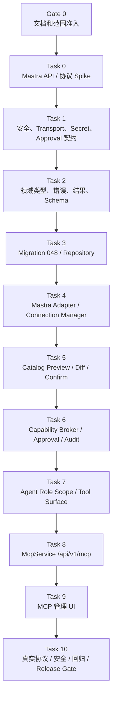
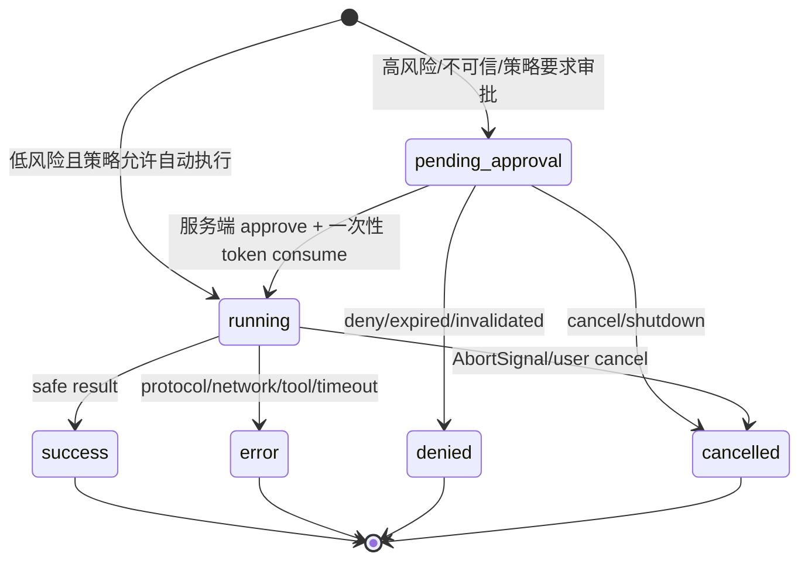

# BloomAI MCP Client 实施计划

> **执行规则**：本计划是 `docs/MCP/2026-08-02-bloomai-mcp-client-design.md` 的可执行版本。两份文档必须保持同一范围、同一 API、同一数据模型、同一状态机和同一 Mastra Adapter 契约。未通过当前 Task 的验收，不得开始其后置 Task。

- **状态**：Gate 0、Task 0～Task 10 已通过 Release Gate
- **日期**：2026-08-10
- **目标**：让 BloomAI 以受控 MCP Client 方式连接外部 `stdio` / Streamable HTTP MCP Server，发现、确认、启用、审批、执行和审计远端 Tools，并按 Agent Role 将允许的 Tool 提供给现有 Mastra Agent。
- **设计来源**：`docs/MCP/2026-08-02-bloomai-mcp-client-design.md`
- **后续能力路线图**：`docs/MCP/mcp-roadmap.md`
- **当前基线**：`@mastra/mcp@1.15.1` 已以精确版本安装并锁定；Task 0 Spike、真实 stdio/Streamable HTTP Fixture、Task 1 安全边界契约和测试、Task 2 领域类型/错误协议/结果规范化/JSON Schema 边界契约和测试、Task 3 Migration 048/Schema Contract/Repository 及数据库安全边界测试、Task 4 经过验证的 Mastra Adapter/Connection Manager 及其 Fake/真实 Fixture/并发与生命周期测试已完成。Task 5 已完成 Catalog Preview、Diff、稳定 Hash、Confirm、stale 校验和 Tool 软删除，并通过专项、Repository 集成及类型测试；Task 6 已完成服务端 Capability Broker、Approval、统一 Agent/手工 Test Tool Adapter、超时/取消和 Run Audit，并通过专项、类型和全量测试；Task 7 已完成 Agent Role Scope、MCP Tool Surface、Chat/Writer/Coder 注入、Feature Flag fail-closed、内置 Tool 优先和 Agent 构建不建连/不刷新 Catalog，并通过 Agent、Broker、架构、MCP 回归、类型和全量测试；Task 8 已完成 `McpService`、`/api/v1/mcp` HTTP API、共享错误映射、Safe DTO、Server/Catalog/Approval/Run 全链路和 route/e2e 测试；Task 9 已完成 MCP Server 管理 UI、Server/Catalog/Approval/Run 管理、前端 Secret/Approval 安全边界、Feature Flag fail-closed 及 renderer API/store/UI 测试，并通过 `npm run test:mcp-ui`、`npm run typecheck` 和 `npm run build`。Task 10 已完成真实 stdio/Streamable HTTP 协议闭环、SSRF/DNS rebinding/redirect 和 stdio 进程边界攻防、Secret/Header/Approval Token/原始 input-output 日志脱敏、Approval replay/stale/Role/Catalog 版本校验、Prompt Injection 不可信内容边界、timeout/AbortSignal/非幂等 Tool 不自动重试，并通过 `npm run test:mcp`、`npm run typecheck`、`npm run test:architecture`、`npm run build`、`git diff --check` 和 `npm test`。

---

## 0. 规范性约束

### 0.1 一期范围

一期只实现以下能力：

- BloomAI 作为 MCP Client；
- 多 Server 配置；
- `stdio`；
- Streamable HTTP；
- Tool Catalog 发现、Preview、Diff、Confirm；
- Server/Tool 启用和禁用；
- General Chat Agent 受控使用 MCP Tools；
- BloomAI Capability Broker、Approval、Audit、Timeout、Cancel；
- `${env:NAME}` 秘密引用和安全脱敏；
- 本地 Fake Adapter、真实 stdio Fixture、真实 Streamable HTTP Fixture。

Resources、Prompts、Elicitation、OAuth、MCP Registry 和独立 legacy SSE 支持写入 `mcp-roadmap.md`，不在本实施计划的 MVP Release Gate 内。

### 0.2 统一事实

以下值是本计划和设计文档的共同契约：

| 项目 | 统一值 |
|---|---|
| 全局 Feature Flag | `MCP_CLIENT_ENABLED`，未明确为 `true` 时 fail closed |
| Mastra MCP 基线 | `@mastra/mcp@1.15.1`，已由 Task 0 Spike 验证并以精确版本锁定；升级必须重新 Spike |
| 版本策略 | `package.json` 使用精确版本，不使用 `^` |
| MCP API 前缀 | `/api/v1/mcp` |
| Migration | `scripts/migrations/048-mcp-client.sql` |
| 新 Tool 默认 | `is_enabled=0`、`requires_approval=1` |
| 远端删除 | `is_removed=1`、`removed_at` 软删除 |
| 本地 Tool ID | `mcp:{serverId}:{remoteName}` |
| Agent Tool Surface | 只读取本地已 Confirm、未移除、已启用且 Role 允许的 Catalog |
| Mastra 导入边界 | 生产代码只有 `src/server/mcp/mastra-adapter.ts` 允许直接导入 `@mastra/mcp` |
| 审批权威 | BloomAI 服务端 Approval Store + Capability Broker |
| Run 状态 | `pending_approval`、`running`、`success`、`error`、`denied`、`cancelled` |
| 结果边界 | 使用 `NormalizedMcpResult`，分离 `content`、`structuredContent`、`isError` 和 `truncated` |

### 0.3 禁止的未验证假设

正式代码不得直接假设未经 Spike 证实的 Mastra MCP 工具发现、工具执行、连接关闭方法名，或把某个 Tool 字段直接当作远端名称。

BloomAI 可以定义自己的 `McpProviderConnection.executeTool()`，但底层如何实现必须由 Task 0 Spike 以当前锁定版本的真实类型和运行时结果确定。

### 0.4 安全硬规则

- 客户端传入的 `approvalGranted`、`trustLevel`、`riskLevel`、`requiresApproval` 不能覆盖服务端策略；
- resolved environment、HTTP Header、Token、未脱敏 input/output 不得进入 SQLite、日志、HTTP Response、前端 state 或测试快照；
- stdio 必须使用 `shell: false`、参数数组和最小化环境变量；
- HTTP 必须检查 URL、DNS 解析结果、redirect 目标和 SSRF 地址；
- Tool 超时必须传递 `AbortSignal`；不能可靠取消时必须 invalidate client；
- 非幂等 Tool 不自动重试；
- 新 Tool 默认不进入 Agent Tool Surface；
- Tool description、schema、content 和 structuredContent 都是不可信外部输入；
- `MCP_CLIENT_ENABLED` 未开启时不连接、不执行、不注册 MCP Tool，但允许只读历史 Run。

---

## 1. 依赖图和严格执行顺序



严格顺序：

```text
Gate 0 → Task 0 → Task 1 → Task 2 → Task 3 → Task 4 →
Task 5 → Task 6 → Task 7 → Task 8 → Task 9 → Task 10
```

不在 Task 0～Task 2 通过前进入数据库、Agent 或 UI 正式实现。

### 1.1 每个 Task 的固定执行循环

每个 Task 都必须遵循：

1. 执行 `git status --short`，确认工作区没有无关修改；
2. 先写失败测试或契约测试；
3. 只修改当前 Task 的 Files 边界；
4. 实现最小可行代码；
5. 运行当前 Task 的定向测试；
6. 运行 `npm run typecheck`；
7. 运行相关架构/依赖边界测试；
8. 运行 `git diff --check`；
9. 更新本计划 checkbox 和结果文档；
10. 当前 Task 未通过时停止，不进入后续 Task。

### 1.2 不允许的并行修改

以下内容必须顺序执行：

- Migration 和 Schema；
- Provider Adapter 和 Broker；
- Catalog 和 Agent Tool Surface；
- API Contract 和 UI Store；
- Approval 状态机和执行审计。

只有已经固定稳定契约后，才能并行编写互不重叠的测试。

---

## 2. Gate 0：文档、范围和契约准入

**目标**：在写生产代码前，消除设计文档和实施计划的不一致。

**Files**：

- Modify: `docs/MCP/2026-08-02-bloomai-mcp-client-design.md`
- Modify: `docs/MCP/2026-08-02-bloomai-mcp-client-implementation-plan.md`
- Create: `docs/MCP/mcp-roadmap.md`

### 2.1 必须确认的决策

- [x] 一期范围固定为 Tools-first；
- [x] 一期 Transport 固定为 stdio + Streamable HTTP；
- [x] legacy SSE 由 Task 0 决定是否检测、拒绝或纳入兼容路径；
- [x] Resources、Prompts、Elicitation、OAuth、Registry 已从 MVP 中移除，并写入 Roadmap；
- [x] API 统一为 `/api/v1/mcp`；
- [x] Migration 统一为 `048-mcp-client.sql`；
- [x] 新 Tool 默认 `is_enabled=0`；
- [x] 远端删除统一采用软删除；
- [x] Run 状态、错误码、Preview/Confirm、Approval Token 约束一致；
- [x] 设计文档不再把未经 Spike 证实的 Mastra MCP Tool 执行入口当作公共 API；
- [x] Task 0 Spike 结果文档是 Mastra API 的唯一实现依据。

### 2.2 Gate 0 验收

- [x] 两份设计/实施文档中不再出现废弃的旧版 API 路径；
- [x] 两份文档中不存在把 `@mastra/mcp` caret 版本当作锁定版本的描述；
- [x] 两份文档中不存在未经验证的 Mastra MCP 方法名公共 API 假设；
- [x] 两份文档引用相同的 `mcp-roadmap.md`；
- [x] 当前代码基线明确标注为“尚未实现”，不把计划写成完成状态。

**Verification**：

```powershell
$patterns = @(
  '/api' + '/mcp',
  'MCPClient.' + 'getTools()',
  'MCPClient.' + 'callTool()',
  'MCPClient.' + 'close()',
  '044' + '-mcp-client'
) | ForEach-Object { [regex]::Escape($_) }
Select-String -Path docs/MCP/*.md -Pattern $patterns
```

预期：无过期契约命中。

**Dependencies**：无。

---

## 3. Task 0：Mastra MCP API、版本和协议 Spike

**目标**：用当前候选版本验证真实 Mastra API、Tool 执行、连接生命周期、stdio、Streamable HTTP 和 SSE fallback 行为，把不确定性变为固定证据。

**Files**：

- Modify: `package.json`
- Modify: `package-lock.json`
- Create: `scripts/mcp-spike.ts`（Spike 期间使用，完成后删除或保留为明确的离线验证工具）
- Create: `src/server/mcp/mastra-adapter.contract.test.ts`
- Create: `tests/fixtures/mcp/stdio-server.mjs`
- Create: `tests/fixtures/mcp/http-server.mjs`
- Create: `docs/MCP/mcp-mastra-spike-result.md`

### 3.1 依赖和类型验证

- [x] 执行 `npm view @mastra/mcp@1.15.1 version peerDependencies --json`；
- [x] 将通过候选版本以精确版本写入 `package.json`，禁止使用 `^`；
- [x] 执行 `npm install --save-exact @mastra/mcp@<通过版本>`；
- [x] 确认 `@mastra/core` peer dependency 和当前 Node engine 兼容；
- [x] 检查 `MCPClient` 构造参数、Server Definition、Tool 类型、Transport 类型；
- [x] 记录当前版本是否提供 `listTools`、`resources`、`prompts`、`disconnect`、`reconnectServer` 等能力。

### 3.2 Tool 执行路径验证

- [x] 验证 `listTools()` 的实际返回结构；
- [x] 验证工具命名空间和远端原始 `remoteName` 的映射；
- [x] 验证通过返回 Tool 的 `execute()`、代理 API 或底层 SDK 执行远端 Tool 的实际路径；
- [x] 验证 input schema、output schema、`content`、`structuredContent`、`isError` 的运行时形态；
- [x] 验证 `AbortSignal` 是否能中断等待和远端调用；
- [x] 验证 disconnect、reconnect 和超时后的 client invalidate。

### 3.3 真实 Fixture

- [x] stdio Fixture 只使用固定本地脚本，不通过 CI 中的任意 `npx` 下载；
- [x] HTTP Fixture 支持 Streamable HTTP 的最小握手、tools/list 和 tools/call；
- [x] Fixture 提供成功 Tool、结构化结果、错误结果、延迟 Tool 和大结果 Tool；
- [x] Fixture 不需要真实 Token，不允许测试读取用户真实环境变量；
- [x] 明确 HTTP 实现是否会 fallback 到 legacy SSE；
- [x] 如果不能关闭或检测 SSE fallback，Spike 必须失败并记录阻断原因。

### 3.4 Spike 结果文档

`mcp-mastra-spike-result.md` 必须包括：

- 精确包版本和 lockfile 结果；
- Node、`@mastra/core`、`@mastra/mcp` 版本；
- 构造参数和类型证据；
- Tool 发现和执行路径；
- 名称映射；
- 结果映射；
- AbortSignal、timeout、disconnect、reconnect；
- stdio 结论；
- Streamable HTTP 结论；
- SSE fallback 决策；
- Adapter 契约最终版本；
- 已知限制和后续 Roadmap 影响。

### 3.5 Task 0 验收

- [x] 当前锁定版本能够完成一期 stdio 和 Streamable HTTP MVP；
- [x] `mastra-adapter.contract.test.ts` 通过；
- [x] 真实 Fixture 通过；
- [x] Adapter 不依赖未验证的 `getTools/callTool/close`；
- [x] SSE 行为有明确结论；
- [x] `mcp-mastra-spike-result.md` 已完成并引用于设计文档和本计划；
- [x] 若 Spike 失败，停止后续 Task，不得绕过证据硬写生产 Adapter。

**Verification**：

```powershell
npm run test:mcp-spike
npm run typecheck
npm run test:architecture
npm run build
```

**Dependencies**：Gate 0。

---

## 4. Task 1：安全边界、Transport、秘密解析和 Approval 契约

**目标**：在数据库和 Agent 接入前固定所有高风险输入和授权边界。

**Files likely touched**：

- Create: `src/server/mcp/feature-flag.ts`
- Create: `src/server/mcp/secret-resolver.ts`
- Create: `src/server/mcp/transport-policy.ts`
- Create: `src/server/mcp/approval-store.ts`
- Create: `src/server/mcp/security/*.test.ts`
- Create/Modify: `src/server/mcp/types.ts`

### 4.1 Secret 和 Feature Flag

- [x] 只允许 `${env:NAME}` 模板；
- [x] 通过 `MCP_ALLOWED_ENV_NAMES` allowlist 限制名称；
- [x] 解析值只存在于调用内存；
- [x] `MCP_CLIENT_ENABLED` 非 `true` 时 fail closed；
- [x] 错误和日志不包含 resolved 值；
- [x] 不把 Secret 引用的环境变量值写入测试快照。

### 4.2 stdio Policy

- [x] `shell: false`；
- [x] command/args/cwd 使用结构化字段；
- [x] 不继承完整 `process.env`；
- [x] command、args、cwd、env 引用变更后回到 `untrusted` 并禁用；
- [x] timeout、disconnect、应用退出清理子进程和孤儿进程；
- [x] 拒绝通过 URL、Registry 或 Package 自动安装可执行文件。

### 4.3 HTTP 和 SSRF Policy

- [x] 生产环境 HTTP endpoint 仅允许 HTTPS；
- [x] 开发环境允许的本地 HTTP 范围明确限制为 localhost/127.0.0.1；
- [x] 校验 hostname、DNS 解析结果和 redirect；
- [x] 拦截私网、link-local 和云 metadata 地址；
- [x] redirect 后重新执行完整校验；
- [x] Header 只接受允许的 Secret 引用；
- [x] 不在错误、日志、HTTP response 中返回 Header 值。

### 4.4 Approval Store 和 Token

- [x] Approval Store 位于服务端；
- [x] Token 只允许一次性消费；
- [x] Token 绑定 `runId`、`serverId`、`toolId`、`inputHash`、`catalogVersion`、session 和 Role；
- [x] 过期、重复消费、Role 变化、Catalog 变化和配置变化都会失效；
- [x] 客户端无法通过 `approvalGranted: boolean` 授权；
- [x] Approval Store 不保存原始敏感 input。

### 4.5 Task 1 验收

- [x] Secret、stdio、HTTP、SSRF、Feature Flag 和 Approval Store 的失败测试先于实现通过；
- [x] 任何一个秘密泄露测试失败都阻断后续 Task；
- [x] 安全策略输出稳定错误码，供 Task 2 固定。

**Verification**：

```powershell
npm run test:mcp-security
npm run typecheck
npm run test:architecture
```

**Dependencies**：Task 0。

---

## 5. Task 2：领域类型、错误协议、结果模型和 JSON Schema 边界

**目标**：固定后续 Repository、Adapter、Broker、API 和 UI 共用的稳定契约。

**Files likely touched**：

- Create: `src/server/mcp/types.ts`
- Create: `src/server/mcp/errors.ts`
- Create: `src/server/mcp/result-normalizer.ts`
- Create: `src/server/mcp/schema-support.ts`
- Create: `src/server/mcp/*.contract.test.ts`

### 5.1 核心类型

至少固定：

```ts
type McpTransportKind = 'stdio' | 'streamable_http';
type McpTrustLevel = 'untrusted' | 'reviewed' | 'trusted';
type McpRunStatus =
  | 'pending_approval'
  | 'running'
  | 'success'
  | 'error'
  | 'denied'
  | 'cancelled';
```

以及：

- `McpServerConnectionConfig`；
- `DiscoveredMcpTool`；
- `McpServerTool`；
- `McpPreview`；
- `McpApprovalRequest`；
- `McpToolRun`；
- `McpToolExecutionContext`；
- `NormalizedMcpResult`。

### 5.2 稳定错误码

必须至少固定：

```text
MCP_DISABLED
MCP_CONFIG_INVALID
MCP_SERVER_NOT_FOUND
MCP_TOOL_NOT_FOUND
MCP_SERVER_DISABLED
MCP_TOOL_DISABLED
MCP_ROLE_NOT_ALLOWED
MCP_APPROVAL_REQUIRED
MCP_APPROVAL_INVALID
MCP_APPROVAL_EXPIRED
MCP_PREVIEW_STALE
MCP_SCHEMA_UNSUPPORTED
MCP_CONNECTION_FAILED
MCP_PROTOCOL_ERROR
MCP_TOOL_ERROR
MCP_TOOL_TIMEOUT
MCP_TOOL_CANCELLED
```

### 5.3 `NormalizedMcpResult`

- [x] `content` 和 `structuredContent` 分开保存；
- [x] `isError` 不被普通文本判断替代；
- [x] 只允许 JSON-safe 值；
- [x] 递归脱敏敏感键；
- [x] 结果超过 128 KiB 时截断并设置 `truncated=true`；
- [x] 拒绝循环对象、Buffer、函数、Symbol、BigInt 和不可序列化实例；
- [x] safe result 可供 Agent、API 和审计复用。

### 5.4 JSON Schema 支持子集

- [x] 明确一期支持的 object、array、string、number、integer、boolean、null、enum、required、properties、items；
- [x] 对 `$ref`、循环 Schema、任意代码、未知关键字和超深嵌套给出处理策略；
- [x] 不支持的 Schema 返回 `MCP_SCHEMA_UNSUPPORTED`，保留发现记录但不进入 Agent Surface；
- [x] Schema 规范化后生成稳定 Hash。

### 5.5 Task 2 验收

- [x] 领域类型、错误码、Result Normalizer、Schema 子集有契约测试；
- [x] 设计文档、本计划和未来代码使用同一状态、错误码和结果字段；
- [x] Task 3～Task 10 不再自行发明错误码或状态。

**Verification**：

```powershell
npm run test:mcp-contracts
npm run typecheck
```

**Dependencies**：Task 1。

---

## 6. Task 3：Migration 048、Schema 和 Repository

**目标**：建立 MCP Server、Tool Catalog、Tool Run 的正式持久化模型，并保留远端删除后的历史可读性。

**Files likely touched**：

- Create: `scripts/migrations/048-mcp-client.sql`
- Modify: `src/server/db/schema.ts`
- Create: `src/server/db/repositories/mcp.repo.ts`
- Create: `src/server/db/mcp-schema-contract.test.ts`
- Create: `src/server/db/repositories/mcp.repo.test.ts`
- Create: `scripts/migrations/048-mcp-client.test.ts`（按项目 Migration 测试约定）

### 6.1 Migration

- [x] 使用 `048-mcp-client.sql`，不能覆盖当前已有 Migration；
- [x] 创建 `mcp_servers`；
- [x] 创建 `mcp_server_tools`；
- [x] 创建 `mcp_tool_runs`；
- [x] `mcp_server_tools.is_enabled INTEGER NOT NULL DEFAULT 0`；
- [x] `mcp_server_tools.is_removed INTEGER NOT NULL DEFAULT 0`；
- [x] `mcp_server_tools.requires_approval INTEGER NOT NULL DEFAULT 1`；
- [x] 使用 `is_removed` 和 `removed_at` 软删除；
- [x] `server_id + remote_name` 唯一；
- [x] Run 状态约束与 Task 2 一致；
- [x] 为 Catalog Version、Schema Hash、Run 查询建立必要索引；
- [x] Migration 可重复执行或符合当前项目的幂等约定。

### 6.2 Repository

至少提供：

- [x] Server CRUD；
- [x] Server enable/disable/trust；
- [x] Tool Catalog 查询和更新；
- [x] Preview Confirm 的原子版本校验；
- [x] Tool enable/disable；
- [x] Soft delete；
- [x] Run 创建、状态更新和 safe 查询；
- [x] 不返回 resolved secret。

### 6.3 Task 3 验收

- [x] Migration 顺序检查通过；
- [x] Schema Contract 通过；
- [x] Repository 测试覆盖唯一约束、软删除、版本冲突和历史 Run；
- [x] 数据库中没有原始 Secret、Header、Approval Token 或未经脱敏的 input/output。

**Verification**：

```powershell
npm run test:mcp-db
npm run typecheck
npm run test:architecture
```

**Dependencies**：Task 2。

---

## 7. Task 4：经过验证的 Mastra Adapter 和 Connection Manager

**目标**：把 Task 0 的真实 Mastra API 隔离在 Provider 层，建立连接测试、复用、失效、重连和退出清理能力。

**Files likely touched**：

- Create: `src/server/mcp/mastra-adapter.ts`
- Create: `src/server/mcp/connection-manager.ts`
- Create: `src/server/mcp/provider.ts`
- Create: `src/server/mcp/mastra-adapter.test.ts`
- Create: `src/server/mcp/connection-manager.test.ts`
- Modify: `src/server/architecture/dependency-boundaries.test.ts`

### 7.1 Adapter 边界

- [x] 只有 `mastra-adapter.ts` 直接导入 `@mastra/mcp`；
- [x] Adapter 实现 Task 0 确认的 `createConnection/listTools/executeTool/disconnect` 路径；
- [x] 不出现未经 Spike 证实的 Mastra Tool 执行入口；
- [x] 正确保存 `serverId`、`serverName`、远端 `remoteName` 和本地 Tool ID；
- [x] 将 Mastra 结果映射到 Task 2 的领域结果；
- [x] 将协议错误映射到稳定错误码。

### 7.2 Connection Manager

- [x] Preview/Test 使用临时连接；
- [x] Agent Tool 执行使用受控缓存或按需连接；
- [x] 不在每次聊天请求创建连接并刷新 Catalog；
- [x] timeout 或不可取消时 invalidate client；
- [x] 支持 reconnect；
- [x] `disconnectAll()` 可清理所有连接和 stdio 子进程；
- [x] 配置、Secret、transport 变更后旧连接不能继续使用；
- [x] 连接异常不会使应用进程退出。

### 7.3 Task 4 验收

- [x] Fake Adapter 测试和真实 Fixture 测试同时通过；
- [x] connection manager 具备并发、超时、失效、重连和退出清理测试；
- [x] 依赖边界测试确认 `@mastra/mcp` 只在 Adapter 中使用。

**Verification**：

```powershell
npm run test:mcp-adapter
npm run typecheck
npm run test:architecture
```

**Dependencies**：Task 3、Task 0。

---

## 8. Task 5：Tool Catalog Preview、Diff、Confirm 和 Soft Delete

**目标**：将远端动态 Tool Catalog 转换为需要用户确认的本地事实源。

**Files likely touched**：

- Create: `src/server/mcp/tool-catalog.ts`
- Create: `src/server/mcp/catalog-hash.ts`
- Create: `src/server/mcp/tool-catalog.test.ts`
- Modify: `src/server/db/repositories/mcp.repo.ts`

### 8.1 Preview 和 Diff

- [x] Preview 不修改已确认 Catalog；
- [x] Diff 分类为 `added`、`changed`、`removed`、`unchanged`；
- [x] 生成 `previewHash`、`configHash` 和 `catalogVersion`；
- [x] Schema 和 description 使用稳定规范化和 Hash；
- [x] 不返回 Secret 或未经脱敏的远程内容；
- [x] 不支持的 Schema 被标记为不可执行。

### 8.2 Confirm

- [x] Confirm 必须校验 `previewHash`、`configHash` 和 `catalogVersion`；
- [x] 过期 Preview 返回 `MCP_PREVIEW_STALE`；
- [x] Confirm 在事务中更新 Tool Catalog 和 Catalog Version；
- [x] 新 Tool 默认禁用；
- [x] Schema/description 改变的 Tool 默认重新 review/disabled；
- [x] removed Tool 软删除，不删除历史 Run；
- [x] 重复 Confirm 幂等。

### 8.3 Task 5 验收

- [x] Preview、Diff、Confirm、Stale、重复提交和软删除均有测试；
- [x] 未 Confirm 前，Agent Surface 和 enabled 查询不发生变化；
- [x] Catalog Version 变化可使旧 Approval 失效。

**Verification**：

```powershell
npm run test:mcp-catalog
npm run typecheck
```

**Dependencies**：Task 3、Task 4。

---

## 9. Task 6：MCP Capability Broker、Approval、执行和审计

**目标**：建立所有 MCP Tool 调用唯一经过的服务端执行状态机。

**Files likely touched**：

- Create: `src/server/mcp/capability-broker.ts`
- Create: `src/server/mcp/mcp-tool-adapter.ts`
- Create: `src/server/mcp/run-audit.ts`
- Create: `src/server/mcp/capability-broker.test.ts`
- Create: `src/server/mcp/mcp-tool-adapter.test.ts`
- Modify: 既有 Tool/Capability Broker 接入点（仅在契约允许范围内）

### 9.1 状态机



### 9.2 Broker 规则

- [x] 远端调用前先创建 `pending_approval` 或 `running` 审计 Run；
- [x] Server、Tool、Role、Feature Flag、Catalog Version 全部重新从服务端读取；
- [x] 客户端不能伪造审批、风险、信任或启用状态；
- [x] `MCP_APPROVAL_REQUIRED` 返回安全 Preview、Request ID、Run ID 和过期时间；
- [x] Approve/Deny 只操作服务端 Approval Store；
- [x] Approval Token 一次性消费；
- [x] input Hash 变化、Catalog 变化、Role 变化和配置变化使 Approval 失效；
- [x] Tool 执行传递 AbortSignal；
- [x] timeout 后 invalidate client，非幂等 Tool 不自动重试；
- [x] content、structuredContent、isError 使用统一 Normalizer；
- [x] safe input/output、错误码、耗时和状态写入 Run 审计；
- [x] resolved secret 和未经脱敏的内容不入库。

### 9.3 Task 6 验收

- [x] Agent 调用和手工 Test 使用同一 Broker；
- [x] denied 调用在远端调用之前生成可查询审计记录；
- [x] approval replay、stale input、expired、role mismatch、disabled、timeout、cancel 均有测试；
- [x] 结果、错误和 Run 状态一致。

**Verification**：

```powershell
npm run test:mcp-broker
npm run typecheck
```

**Dependencies**：Task 1、Task 2、Task 4、Task 5。

---

## 10. Task 7：Agent Role Scope 和 MCP Tool Surface

**目标**：将已确认的 MCP Tools 按现有 Agent Role 安全地注入 Chat Agent，同时不建立聊天请求级连接。

**Files likely touched**：

- Create: `src/server/mcp/agent-tool-surface.ts`
- Create: `src/server/mcp/agent-tool-surface.test.ts`
- Modify: `src/server/mastra/chat-agent.ts`
- Modify: `src/server/mastra/index.ts`（如需要）
- Modify: 现有 Role/Capability Policy 接入点

### 10.1 Tool Surface

- [x] Agent 只看到已 Confirm、未移除、已启用的 Catalog Tool；
- [x] Server disabled 时所有子 Tool 不可见；
- [x] Role Scope 在服务端派生，客户端不能指定；
- [x] Tool description 和 schema 经过安全限制；
- [x] Tool `execute()` 只调用 MCP Capability Broker；
- [x] 不将 Mastra 原始 Tool 对象直接挂载为最终能力；
- [x] Feature Flag 关闭时不注册 MCP Tool；
- [x] Tool 名称不会覆盖 BloomAI 内置工具。

### 10.2 Task 7 验收

- [x] General/Writing/Coding/Deep Research 等现有 Role 的 Scope 有明确测试；
- [x] Agent 构建不触发 `tools/list` 或新建外部连接；
- [x] enabled/disabled、removed、role denied 与 Broker 结果一致。

**Verification**：

```powershell
npm run test:mcp-agent
npm run typecheck
npm run test:architecture
```

**Dependencies**：Task 6。

---

## 11. Task 8：McpService 和 `/api/v1/mcp` HTTP API

**目标**：提供从 Server 配置到 Tool 执行和审计查询的安全 API Facade。

**Files likely touched**：

- Create: `src/server/mcp/mcp.service.ts`
- Create: `src/server/http/routes/mcp.ts`
- Create: `src/server/http/routes/mcp.test.ts`
- Create: `src/server/http/routes/mcp.e2e.test.ts`
- Modify: `src/server/http/app.ts`
- Modify: 项目统一 `error-mapper.ts`（如需要）

### 11.1 API 路径

```text
GET    /api/v1/mcp/servers
POST   /api/v1/mcp/servers
GET    /api/v1/mcp/servers/:serverId
PATCH  /api/v1/mcp/servers/:serverId
DELETE /api/v1/mcp/servers/:serverId

POST   /api/v1/mcp/servers/:serverId/test-connection
POST   /api/v1/mcp/servers/:serverId/tools/preview
POST   /api/v1/mcp/servers/:serverId/tools/confirm
POST   /api/v1/mcp/servers/:serverId/enable
POST   /api/v1/mcp/servers/:serverId/disable
POST   /api/v1/mcp/servers/:serverId/trust

GET    /api/v1/mcp/servers/:serverId/tools
PATCH  /api/v1/mcp/servers/:serverId/tools/:toolId
POST   /api/v1/mcp/servers/:serverId/tools/:toolId/test

POST   /api/v1/mcp/servers/:serverId/approvals/:requestId/approve
POST   /api/v1/mcp/servers/:serverId/approvals/:requestId/deny
GET    /api/v1/mcp/servers/:serverId/runs
```

### 11.2 Service 和 Route 规则

- [x] Route 只负责认证、输入校验、调用 Service 和输出 DTO；
- [x] Route 不直接访问 SQLite；
- [x] Route 不直接导入 `@mastra/mcp`；
- [x] Server 端重新计算 trust、risk、approval 和 enablement；
- [x] Safe DTO 不包含 resolved Secret、Header、原始 Approval Token 或未经脱敏结果；
- [x] 错误码映射与 Task 2 一致；
- [x] Test、Refresh、Preview、Confirm、Approve、Deny、Run 查询都有 route test；
- [x] Feature Flag 关闭时接口 fail closed，但历史 Run 可只读查询。

### 11.3 Task 8 验收

- [x] `/api/v1/mcp` 全部路由注册并覆盖测试；
- [x] Preview/Confirm、Test/Approve/Deny、Enable/Run 全链路可用；
- [x] stale Preview、disabled、role denied、connection failed、timeout 等错误映射稳定；
- [x] API 不泄露秘密和外部原始对象。

**Verification**：

```powershell
npm run test:mcp-http
npm run typecheck
npm run test:architecture
```

**Dependencies**：Task 6、Task 7。

---

## 12. Task 9：MCP Server 管理 UI

**目标**：在现有 Tools 导航下提供安全的 Server、Catalog、Approval 和 Run 管理界面。

**Files likely touched**：

- Create: `src/renderer/pages/McpServers/*`
- Create: `src/renderer/pages/McpServers/mcp-servers.store.ts`
- Create: `src/renderer/pages/McpServers/*.test.*`
- Modify: `src/renderer/store/index.ts`
- Modify: `src/renderer/components/layout/NavSidebar.tsx`
- Modify: `src/renderer/App.tsx`
- Modify: `src/renderer/styles/global.css`

### 12.1 列表和详情

- [x] 展示 Server 名称、Transport、连接状态、信任等级、Catalog Version、Tool 数量和启用状态；
- [x] 支持新增、编辑、测试连接、Refresh、Preview/Diff、Confirm、启用/禁用；
- [x] `stdio` 展示 command 摘要但不暴露无关环境值；
- [x] HTTP 展示 origin，不展示 Header 值；
- [x] Tool 列表展示远端名称、风险、审批、启用、移除和 Schema 状态；
- [x] 支持手工 Test、Approval 和 Runs 查询。

### 12.2 前端安全规则

- [x] 前端只保存 Secret 引用，不保存 resolved Secret；
- [x] 409 Approval 响应只缓存 Request ID、Run ID、Safe Preview 和 expiresAt；
- [x] Approve/Deny 后重新加载 Run 和 Tool 状态；
- [x] 配置变更后清除 Preview、Tool 和旧连接状态；
- [x] 不在未 Confirm 时乐观更新 enabled；
- [x] stale Preview 要求重新 Refresh；
- [x] API Client 使用 `API_BASE`，请求路径只使用 `/mcp/...`。

### 12.3 Task 9 验收

- [x] UI 覆盖 Server、Diff、Tool Policy、Test、Approval、Runs；
- [x] UI 测试确认没有 secret、Header、Approval Token 泄露；
- [x] 路由错误能转换为可理解的状态和提示；
- [x] Feature Flag 关闭时不显示可执行 MCP Tool 或提供安全禁用状态。

**实现摘要**：

- 在 `src/renderer/pages/McpServers/` 实现 Server 列表/详情、编辑、新增、软删除、连接测试、Catalog Preview/Diff/Confirm、Tool Policy、手工 Test、Approval 和 Runs/Audit 面板；
- renderer API 统一使用 `API_BASE` 与 `/mcp/...`，只发送 `${env:NAME}` Secret 引用，错误响应经过安全 envelope 清洗；
- Store 在配置变更、Confirm、Approve/Deny 后清理或重新加载相关状态，Tool enabled 只在服务端成功后更新，过期 Preview 禁止 Confirm；
- Feature Flag 关闭时 fail closed，UI 仅呈现禁用状态。

**Verification**：

```powershell
npm run test:mcp-ui
npm run typecheck
npm run build
```

**Dependencies**：Task 8。

---

## 13. Task 10：真实协议、安全攻防、文档同步和 Release Gate

**目标**：在发布前证明一期从真实连接到 Agent 使用的完整闭环，并关闭所有 P0/P1/P2 风险。

**Files likely touched**：

- Modify: `package.json`（加入最终 `test:mcp` 命令）
- Modify: `package-lock.json`
- Create/Modify: `tests/fixtures/mcp/*`
- Create/Modify: `tests/security/mcp-*`
- Modify: `docs/MCP/2026-08-02-bloomai-mcp-client-design.md`
- Modify: `docs/MCP/2026-08-02-bloomai-mcp-client-implementation-plan.md`
- Modify: `docs/MCP/mcp-mastra-spike-result.md`

### 13.1 真实协议闭环

- [x] stdio Server 测试连接、Refresh、Preview、Confirm、Enable、Tool Test；
- [x] Streamable HTTP Server 完成同样闭环；
- [x] Tool 成功、结构化结果、远端错误、协议错误、延迟和大结果均覆盖；
- [x] disconnect、reconnect、timeout、AbortSignal 和应用退出清理通过；
- [x] 明确 legacy SSE 处理结果与文档一致。

### 13.2 安全攻防

- [x] SSRF 私网、link-local、metadata、DNS rebinding、redirect 测试；
- [x] stdio shell 注入、cwd 越界、环境继承和孤儿进程测试；
- [x] Secret、Header、Approval Token、原始 input/output 泄露测试；
- [x] Approval replay、stale input、Role mismatch、Catalog version mismatch 测试；
- [x] Tool description/schema/content Prompt Injection 样例测试；
- [x] 非幂等 Tool timeout 后不会自动重试。

### 13.3 文档和命令同步

- [x] Design、Implementation Plan、Spike Result、Roadmap 的范围和版本一致；
- [x] 所有 API 使用 `/api/v1/mcp`；
- [x] 所有 Migration 使用 `048-mcp-client.sql`；
- [x] `package.json`、lockfile 和 Spike Result 使用相同精确包版本；
- [x] `npm run test:mcp` 覆盖 MCP 单元、集成、HTTP、UI 和安全测试；
- [x] Task checkbox 和实际提交状态一致。

### 13.4 Release Gate

以下任一项失败，停止发布：

1. 真实 stdio 或 Streamable HTTP Fixture 未通过；
2. 存在 resolved secret、Header、Approval Token 或敏感 output 泄露；
3. 客户端能够伪造 Approval、Risk、Trust 或 Enablement；
4. Mastra Tool 到远端 Tool 的映射不确定；
5. timeout 后存在非幂等自动重试；
6. Migration、typecheck、build 或既有回归失败；
7. Feature Flag 关闭后既有 Chat、Tools、Skills、Deep Research 功能异常；
8. 文档和代码契约不一致。

**Verification**：

```powershell
npm run test:mcp
npm run typecheck
npm run test:architecture
npm run build
git diff --check
npm test
```

**Dependencies**：Task 9、Task 0～Task 8 全部通过。

### 13.5 Task 10 实现摘要和证据

- `package.json` 新增聚合命令 `npm run test:mcp`，顺序执行真实 Spike、HTTP route/e2e、MCP security、contracts、Migration/Repository、Catalog、Adapter/Connection Manager、Broker、Agent 和 UI 测试；`test:mcp-security` 明确包含 `tests/security/mcp-transport.security.test.ts`；
- 生产 `MastraMcpAdapter` 在 stdio spawn 边界解析并校验真实 cwd，默认限制在 `process.cwd()` 允许根内；shell 固定为 `false`，环境变量仍使用 allowlist；HTTP 每次请求重新做 DNS 校验，强制 `redirect: manual`，校验 redirect 目标，并将 Streamable HTTP 非 2xx 转为字符串错误码以阻止 Mastra legacy SSE fallback；
- 创建真实 `MCPClient` 后安装 `noopLogger`，HTTP Server Definition 关闭 `enableServerLogs`，因此 Mastra 默认日志不会写入原始 `toolArgs`、Secret、Authorization/Bearer 或 Approval Token；
- `listToolsWithErrors()` 的真实发现错误不再被静默转换为空 Catalog，统一映射到 BloomAI 稳定错误码；
- Task 10 安全证据覆盖私网、link-local、metadata、DNS rebinding、redirect、stdio cwd/shell/环境/孤儿进程、Secret/Header/Approval Token/原始输入输出、Approval replay/stale/Role/Catalog 版本、Prompt Injection、timeout/AbortSignal 和非幂等 Tool 不重试；
- 真实协议证据固定为 `@mastra/core@1.51.0`、`@mastra/mcp@1.15.1`、`@modelcontextprotocol/sdk@1.30.0`，API 前缀为 `/api/v1/mcp`，Migration 为 `scripts/migrations/048-mcp-client.sql`；legacy SSE 目前不支持，检测到 fallback 时 fail closed；
- Release Gate 命令：

```powershell
npm run test:mcp
npm run typecheck
npm run test:architecture
npm run build
git diff --check
npm test
```


---

## 14. 稳定公共契约

### 14.1 Preview/Confirm

```text
POST /api/v1/mcp/servers/:serverId/tools/preview
  -> { previewId, previewHash, configHash, catalogVersion, diff[] }

POST /api/v1/mcp/servers/:serverId/tools/confirm
  body: { previewId, previewHash, configHash, catalogVersion }
  -> 原子更新 Catalog 和 catalogVersion
```

任何 Hash 或 Version 不匹配都返回：

```text
MCP_PREVIEW_STALE
```

### 14.2 Approval

```text
Tool execute
  -> 409 MCP_APPROVAL_REQUIRED
     { approvalRequestId, runId, safePreview, expiresAt }

POST /api/v1/mcp/servers/:serverId/approvals/:requestId/approve
POST /api/v1/mcp/servers/:serverId/approvals/:requestId/deny
```

Approve 后由服务端重新读取 Run 和 Policy，验证 Token 一次性消费，不能接受客户端传入的授权布尔值。

### 14.3 结果

```ts
interface NormalizedMcpResult {
  content: unknown[];
  structuredContent?: unknown;
  isError: boolean;
  truncated: boolean;
  safeSummary?: string;
}
```

### 14.4 Tool 执行状态

```text
pending_approval
  -> running
  -> success | error | cancelled

pending_approval
  -> denied | cancelled
```

`MCP_TOOL_TIMEOUT` 是超时错误码；超时后必须执行 client invalidate，并禁止非幂等自动重试。

---

## 15. Definition of Done

### P0 必须全部关闭

- [x] Task 0 以当前锁定的 `@mastra/mcp` 精确版本验证真实 API；
- [x] 没有 `getTools/callTool/close` 等未验证假设；
- [x] Task 1 已通过 Secret、stdio、HTTP SSRF、Approval Store 和一次性 Token 测试；
- [x] Task 2 已锁定错误码、状态机、`NormalizedMcpResult` 和 Schema 子集；
- [x] `048-mcp-client.sql`、Repository、Adapter、Connection Manager、Catalog Preview/Confirm、Broker、Agent、API 和 UI 均有实现与测试；
- [x] 客户端无法伪造批准、风险、信任、Role 或 Tool enablement。

### P1 必须全部关闭

- [x] 新 Tool 默认 disabled；
- [x] Schema/description 变化触发 review/disabled；
- [x] 远端删除保留历史 Run；
- [x] Agent Surface 不在每次聊天请求建连或刷新 Catalog；
- [x] Test/Refresh/Preview/Confirm/Enable/Approve/Deny/Run 全链路可用；
- [x] timeout、AbortSignal、client invalidate、disconnectAll 和孤儿进程清理有证据；
- [x] Agent Role Scope 和服务端策略一致。

### P2 必须全部关闭

- [x] MCP 管理 UI 完成；
- [x] 指标、日志、Safe DTO、截断和 Prompt Injection 防护覆盖；
- [x] Design、Plan、Spike Result、Roadmap、package lock 和测试命令一致；
- [x] Feature Flag 可以关闭 MCP 且不影响既有功能；
- [x] `npm run test:mcp` 已存在并通过。

---

## 16. 建议提交边界

```text
1. chore(mcp): verify Mastra MCP client contract
2. feat(mcp): add transport, secret and approval security contracts
3. feat(mcp): define MCP domain and result boundaries
4. feat(mcp): add MCP migration 048 and repository
5. feat(mcp): add MCP connection manager and Mastra adapter
6. feat(mcp): add catalog preview and confirm flow
7. feat(mcp): add MCP capability broker and tool adapter
8. feat(mcp): expose MCP tools by agent role
9. feat(mcp): add /api/v1/mcp service and routes
10. feat(mcp): add MCP server management UI
11. test(mcp): close real protocol, security and release gates
```

每个提交只包含当前 Task 的 Files 和测试证据，不要把无关工作区文件带入提交。
