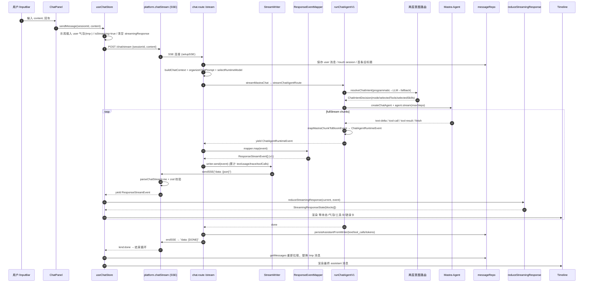
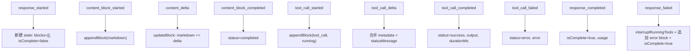
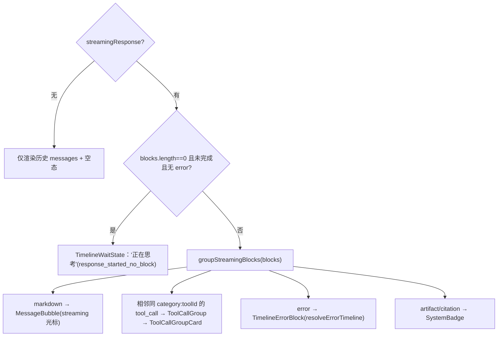
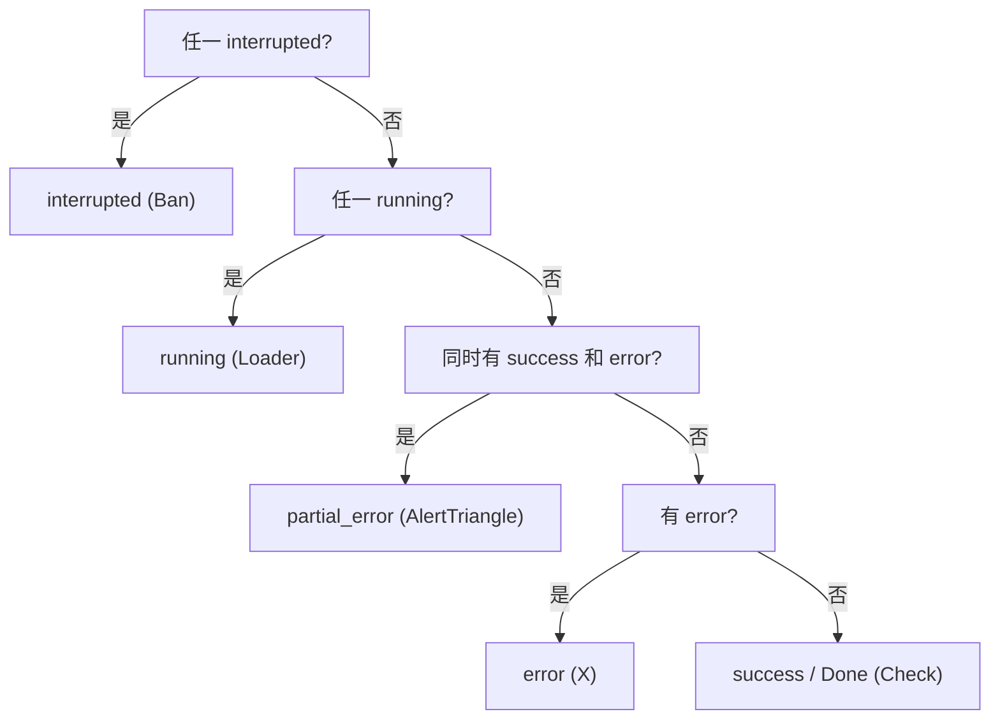
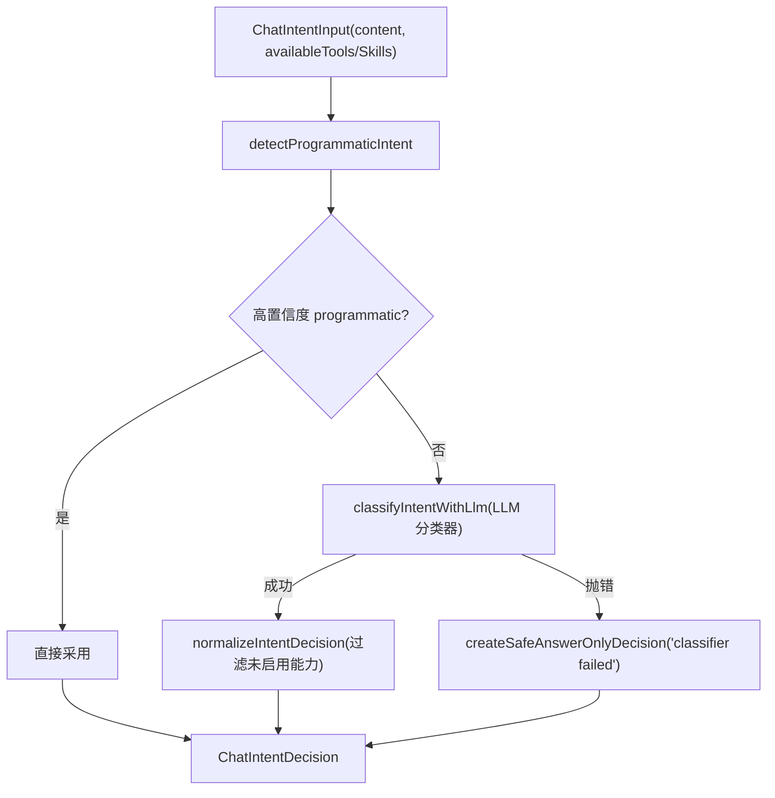
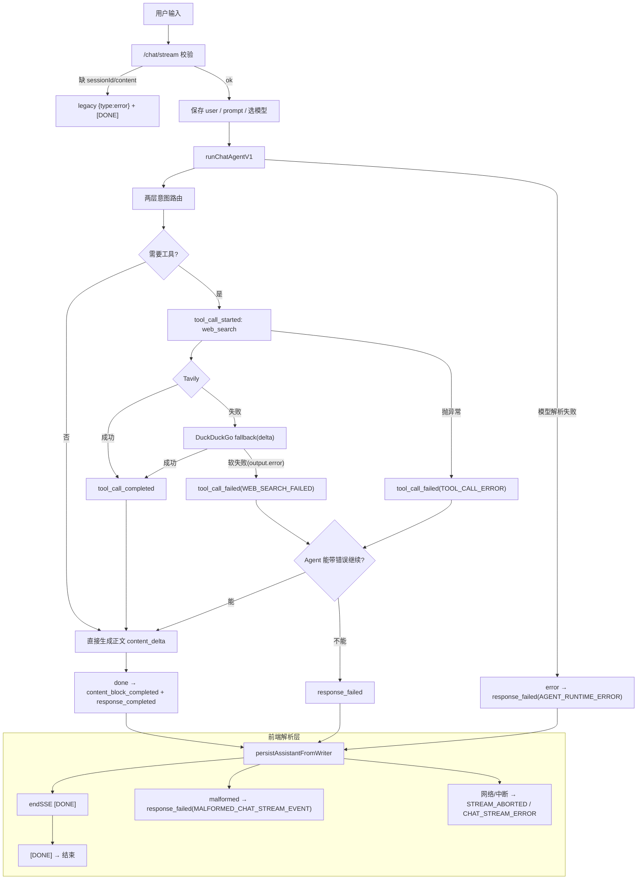

# 001 · Chat 输入 → Mastra Agent → UI Timeline 全链路分析

> 范围：从聊天页输入问题，经后端 `/chat/stream`、Mastra Chat Agent v1 运行时、统一响应事件契约（`bloom-response-v1`），到前端 reducer / Timeline / 工具卡片渲染的完整链路。
> 覆盖所有定义的**流式事件类型（event type）**、**Timeline 状态机**、**错误码**、**工具组卡片状态**，以及它们在各层之间的映射关系。
>
> 关键约定：**Chat 现在是 agent-only**（不再回退 direct LLM），后端只对外输出 `bloom-response-v1` 事件，前端只按这些事件渲染——“后端负责事实，前端负责组织与可读性”。

---

## 1. 一句话链路

```
InputBar → ChatPanel.handleSend → useChatStore.sendMessage
  → platform.chatStream (POST /chat/stream, SSE)
    → chat.route: 校验/建 prompt/选模型 → streamMastraChat(writer + mapper)
      → streamChatAgentRoute → runChatAgentV1
        → 能力解析 + 两层意图路由 → createChatAgent(Mastra Agent)
          → agent.stream(fullStream) → mapMastraChunkToBloomEvent → ChatAgentRuntimeEvent
        ← createAgentResponseEventMapper.map → ResponseStreamEvent[] (bloom-response-v1)
      ← writer.send → sendSSE("data: {...}")  + 持久化 assistant 消息
  ← parseChatStreamLine(zod 校验) → reduceStreamingResponse → StreamingResponseState
← Timeline.render：等待态 / Markdown 气泡 / 工具组卡片 / 错误卡
```

---

## 2. 分层架构总览

| 层 | 关键文件 | 职责 | 数据形态 |
|---|---|---|---|
| 入口 UI | [InputBar.tsx](../../src/renderer/pages/Chat/InputBar.tsx) · [ChatPanel.tsx](../../src/renderer/pages/Chat/ChatPanel.tsx) | 采集输入、触发发送 | `content: string` |
| 状态/编排 | [store/index.ts](../../src/renderer/store/index.ts) | 乐观插入 user 消息、消费 SSE、收尾持久化 | zustand store |
| 传输/解析 | [api/index.ts](../../src/renderer/api/index.ts) | `fetch` + SSE 行解析 + **zod 校验** | `ResponseStreamEvent` |
| 前端归约 | [chat-response-reducer.ts](../../src/renderer/store/chat-response-reducer.ts) | 事件 → `blocks[]` | `StreamingResponseState` |
| 渲染 | [Timeline.tsx](../../src/renderer/pages/Chat/Timeline.tsx) · [ToolCallGroupCard.tsx](../../src/renderer/pages/Chat/ToolCallGroupCard.tsx) · [MessageBubble.tsx](../../src/renderer/pages/Chat/MessageBubble.tsx) | 渲染气泡/工具卡/错误卡 | React |
| **共享契约** | [shared/schemas/response.ts](../../src/shared/schemas/response.ts) · [shared/llm-response-contract/*](../../src/shared/llm-response-contract/index.ts) | 事件 schema + 三张登记表 | `bloom-response-v1` |
| 路由/SSE | [routes/chat.route.ts](../../src/server/routes/chat.route.ts) · [chat-response-stream.ts](../../src/server/routes/chat-response-stream.ts) · [middleware/index.ts](../../src/server/middleware/index.ts) | 校验、prompt、写 SSE、持久化 | SSE |
| Agent 编排 | [chat-agent-router.ts](../../src/server/agent/runtime/chat-agent-router.ts) · [chat-agent-runtime-adapter.ts](../../src/server/agent/mastra/chat-agent-runtime-adapter.ts) | 路由 → 跑 Mastra Agent | `ChatAgentRuntimeEvent` |
| 意图/能力 | [runtime/intent/*](../../src/server/agent/runtime/intent/chat-intent-router.ts) · [capabilities.ts](../../src/server/agent/runtime/capabilities.ts) | 两层意图、挑工具/技能 | `ChatIntentDecision` |
| Mastra Agent | [chat-agent.ts](../../src/server/agent/mastra/chat-agent.ts) · [web-search-adapter.tool.ts](../../src/server/agent/mastra/web-search-adapter.tool.ts) | 构建 Agent、挂工具 | `@mastra/core` Agent |
| 事件映射 | [mastra-event-mapper.ts](../../src/server/agent/mastra/mastra-event-mapper.ts) · [response-event-mapper.ts](../../src/server/agent/mastra/response-event-mapper.ts) | Mastra chunk → runtime event → v1 event | 两次映射 |

链路里出现了 **3 套事件模型**，理解它们的边界是理解整条链路的关键：

1. **Mastra 原始 chunk**（`text-delta` / `tool-call` / `tool-result` / `tool-error` / `finish`）—— Mastra 内部产物。
2. **`ChatAgentRuntimeEvent`**（`delta` / `tool_call_start` / `tool_call_delta` / `tool_call_result` / `tool_call_error` / `done` / `error`）—— 运行时中立事件，便于换底层框架。
3. **`ResponseStreamEvent`（bloom-response-v1）**—— 对外契约，前后端唯一共识，共 **11 种事件**。

---

## 3. 全链路时序图



---

## 4. 三套事件模型的两次映射

### 4.1 Mastra chunk → `ChatAgentRuntimeEvent`（[mastra-event-mapper.ts](../../src/server/agent/mastra/mastra-event-mapper.ts)）

| Mastra chunk.type | → runtime event | 说明 |
|---|---|---|
| `text-delta` / `text_delta` | `{ type: 'delta', text }` | 正文增量 |
| `tool-call` / `tool_call` | `{ type: 'tool_call_start', call }` | callId/toolId/category/input |
| `tool-result` / `tool_result` | `{ type: 'tool_call_result', callId, output }` | 工具返回 |
| `tool-error` / `tool_error` | `{ type: 'tool_call_error', callId, error }` | 工具异常 |
| `finish` | `{ type: 'done', trace }` | 含 token usage（仅当传入 maxSteps） |
| 其他 | `null`（丢弃） | |

> 运行时适配器还会用 `mapMastraFinalOutputToBloomEvents` 补发那些**只出现在最终输出、未在流中出现**的 tool call / result（用 `emittedCallIds` / `emittedResultIds` 去重），保证工具事件不漏。

### 4.2 `ChatAgentRuntimeEvent` → `ResponseStreamEvent`（[response-event-mapper.ts](../../src/server/agent/mastra/response-event-mapper.ts)）

这是“**懒启动 + 配对补全**”映射器，核心规则：

| runtime event | → v1 event(s) | 关键副作用 |
|---|---|---|
| 任意首个事件 | 先补 `response_started`（懒，仅一次） | runtime=`mastra-chat-agent-v1` |
| `delta` | 首次补 `content_block_started`(markdown, role=answer) → 之后每次 `content_delta` | 记录 `answerBlockId` |
| `tool_call_start` | `tool_call_started` + (web_search 时)`tool_call_delta`("Searching … with tavily") | 写 toolTrace draft |
| `tool_call_delta` | `tool_call_delta`(patch) | 透传 |
| `tool_call_result`（正常） | (fallback 时)`tool_call_delta` + `tool_call_completed` | outputSummary 摘要 |
| `tool_call_result`（output 带 `error` 字段=软失败） | `tool_call_failed` | code=`WEB_SEARCH_FAILED` / `TOOL_CALL_ERROR` |
| `tool_call_error`（硬失败） | `tool_call_failed` | code=`TOOL_CALL_ERROR` |
| `done` | `content_block_completed`（若有正文） + `response_completed` | finishReason=`stop`, 带 trace/usage |
| `error` | `response_failed` | code=`AGENT_RUNTIME_ERROR` |

兜底分支（route 层）：
- 流里**没有任何事件** / **没有 done** → `mapper.completeWithoutDone()`（finishReason=`unknown`）。
- 运行时抛异常 → `mapper.fail(err)` → `response_failed`(`AGENT_RUNTIME_ERROR`)。
- 无正文失败时，持久化 `fallbackContent = "AI request failed: …"`，**绝不存空气泡**。

---

## 5. `bloom-response-v1` 的 11 种事件（对外契约）

定义于 [response.ts](../../src/shared/schemas/response.ts)，登记于 [event-registry.ts](../../src/shared/llm-response-contract/event-registry.ts)。前端经 `ResponseStreamEventSchema`（zod discriminatedUnion）**强校验**，非 v1 事件会被合成 `response_failed`(`MALFORMED_CHAT_STREAM_EVENT`)。

| # | event type | 必填字段 | 状态转移 / Timeline 表现 | 分组行为 |
|---|---|---|---|---|
| 1 | `response_started` | responseId, runtime, createdAt | 建响应状态；显示“正在思考”占位，**无正文不建空气泡** | none |
| 2 | `content_block_started` | responseId, block.id, block.type | 创建 assistant streaming 气泡 | none |
| 3 | `content_delta` | responseId, blockId, delta | 实时追加正文 | none |
| 4 | `content_block_completed` | responseId, blockId, completedAt | 停止该块 streaming 光标（不关闭整体） | none |
| 5 | `tool_call_started` | responseId, block.callId/toolId/category/status | 工具卡片 running | 相邻同 `category:toolId` 合并为一组 |
| 6 | `tool_call_delta` | responseId, callId, patch | 更新进度/权限/fallback/结果数等短描述 | 更新组内对应行 |
| 7 | `tool_call_completed` | responseId, callId, completedAt | 卡片显示完成、耗时、摘要 | 贡献 success 状态 |
| 8 | `tool_call_failed` | responseId, callId, error, completedAt | 卡片显示失败原因 | 贡献 failed/partial 状态 |
| 9 | `usage_updated` | responseId, usage | 默认不展示（debug/meta） | none |
| 10 | `response_completed` | responseId, finishReason, completedAt | 停止全局等待，显示最终正文+完成的工具分组 | 所有运行组应已收敛 |
| 11 | `response_failed` | responseId, error, completedAt | 显示可读错误；无正文也要显示错误，**不出空气泡** | 剩余运行组视为 interrupted |

**事件不变量**：`response_failed` 后不得再发 content/tool 事件；`tool_*` 进工具组卡片、`content_*` 进正文气泡、`response_failed` 进错误卡；group 只做聚合展示，不改变原始事件顺序。

### 内容块类型（`ResponseContentBlock`）
`markdown`（status: pending/streaming/completed/failed，role: answer/reasoning_summary/notice）、`tool_call`、`artifact`、`citation`、`error`。当前 Chat 主路径主要产出 `markdown` / `tool_call` / `error` 三类。

---

## 6. 前端归约：事件 → `StreamingResponseState`

[chat-response-reducer.ts](../../src/renderer/store/chat-response-reducer.ts) 把扁平事件流折叠为 `blocks[]`：



要点：
- `responseId` 不匹配的事件被忽略（防串话）。
- `response_failed` 会把仍在 `running` 的工具块标记 `error` 且 `metadata.interrupted=true`，并追加一个 `error` block。
- 衍生函数：`deriveStreamingText`（拼接 markdown）、`deriveToolCalls`（导出工具调用视图）。

---

## 7. Timeline 渲染规则（[Timeline.tsx](../../src/renderer/pages/Chat/Timeline.tsx)）



`groupStreamingBlocks`：连续且 `createToolCallGroupKey = category:toolId` 相同的 `tool_call` 块合并为一个 `ToolCallGroup`，让“并行/重试”活动收敛成一个可读区块。

---

## 8. 工具组卡片状态机（[ToolCallGroupCard.tsx](../../src/renderer/pages/Chat/ToolCallGroupCard.tsx)）

卡片整体状态由 `getOverallStatus(calls)` 决定，优先级（从高到低）：



| overallStatus | 标签 | 图标 | 触发条件 |
|---|---|---|---|
| `running` | Running | Loader2(spin) | 有 running |
| `success` | Done | Check | 全部成功 |
| `error` | Failed | X | 仅有失败 |
| `partial_error` | Partial failed | AlertTriangle | 成功+失败混合 |
| `interrupted` | Interrupted | Ban | `metadata.interrupted` 或 `STREAM_ABORTED` |

卡片结构：头部（category 图标 + `toolId` + overallStatus + `N calls` + 折叠箭头）；body 按 `running / success / error / interrupted` 分区，每行 `ToolCallSummaryRow` 显示：`#index`、输入（query/path/url/prompt/command 优先）、`statusMessage`（如 “Searching … with tavily” / “Tavily failed; searching with duckduckgo”）、`outputSummary`（如 “3 results from tavily”）、`error`、`durationMs`。

---

## 9. Timeline 状态登记表（[timeline-state-registry.ts](../../src/shared/llm-response-contract/timeline-state-registry.ts)）

10 个状态键，统一定义 assistant 气泡模式 / 工具组状态 / 是否显示错误：

| state key | 标签 | assistantBubble | toolGroupStatus | visibleError |
|---|---|---|---|---|
| `response_started_no_block` | 正在思考 | hidden | none | false |
| `markdown_streaming` | 正在生成回答 | streaming | none | false |
| `tool_running` | 正在执行工具 | preserve | running | false |
| `tool_soft_failed` | 工具失败，继续回答 | preserve_or_stream | partial_error | true |
| `tool_hard_failed` | 工具失败，无法完成 | error | error | true |
| `response_completed` | 回答完成 | completed | success | false |
| `response_failed_before_content` | 回答生成失败 | error | interrupted | true |
| `response_failed_after_content` | 回答中断，保留部分 | preserve | interrupted | true |
| `stream_aborted` | 回答已中断 | preserve | interrupted | true |
| `persistence_failed_after_stream` | 已生成但保存失败 | completed | success | true |

> 当前实现里：`TimelineWaitState` 直接消费 `response_started_no_block`；`TimelineErrorBlock` 经错误码登记表解析标题。其余状态键作为 UI 行为的“真相表”，约束气泡/工具组/错误的组合方式。

---

## 10. 错误码登记表（[error-timeline-registry.ts](../../src/shared/llm-response-contract/error-timeline-registry.ts)）

`resolveErrorTimeline(error)` 把错误码映射为 severity / Timeline 文案 / 能否继续 / 日志级别：

| code | severity | Timeline 文案 | canContinue | groupBehavior |
|---|---|---|---|---|
| `VALIDATION_ERROR` | warning | 输入参数错误 | false | none |
| `LLM_CONFIG_ERROR` | error | 模型配置错误 | false | interrupt_running_groups |
| `LLM_PROVIDER_ERROR` | error | 大模型调用失败 | false | interrupt_running_groups |
| `LLM_RESPONSE_PARSE_ERROR` | error | 模型响应解析失败 | false | interrupt_running_groups |
| `TOOL_CALL_ERROR` | error | 工具执行失败 | **depends** | mark_related_group_failed |
| `AGENT_RUNTIME_ERROR` | error | Agent 执行失败 | false | interrupt_running_groups |
| `STREAM_ABORTED` | warning | 回答已中断 | false | interrupt_running_groups |
| `UNKNOWN_ERROR` | error | 发生未知错误 | false | interrupt_running_groups |

链路里实际出现的扩展码（未在登记表中、会回退 `UNKNOWN_ERROR` 文案）：`WEB_SEARCH_FAILED`（web_search 软失败）、`MALFORMED_CHAT_STREAM_EVENT` / `CHAT_STREAM_ERROR`（前端解析/网络）、`PERSISTENCE_ERROR`（后端落库失败，仅日志）。

---

## 11. 两层意图路由与 Agent 构建

### 11.1 能力解析 + 两层意图（[chat-intent-router.ts](../../src/server/agent/runtime/intent/chat-intent-router.ts)）



`ChatIntentMode`：`answer_only` / `tool` / `skill` / `tool_and_skill` / `unknown`。`normalizeIntentDecision` 会：① `answer_only` 清空选择；② 过滤掉未启用的工具/技能 id；③ 需要能力但选不出任何能力时安全回退 `answer_only`。

### 11.2 Agent 构建与工具挂载（[chat-agent.ts](../../src/server/agent/mastra/chat-agent.ts)）

- Agent id=`bloomai-chat-agent-v1`，ReAct 风格指令，鼓励“需要时机调用 web_search，不要滥用工具”。
- `createSelectedTools`：默认挂 `web_search`（[web-search-adapter.tool.ts](../../src/server/agent/mastra/web-search-adapter.tool.ts)，Tavily→DuckDuckGo 降级）；按意图选中的 skill 通过 `createSkillAdapterTools` 挂载，使 Mastra 看到的能力面与路由选择一致。
- `agent.stream(messages, { maxSteps })`，`maxSteps` 上限 `DEFAULT_AGENT_MAX_STEPS=10`（route 侧也夹到 10）。

---

## 12. 持久化与收尾

- **后端**：`persistAssistantFromWriter` 在 `done` / `error` / `completeWithoutDone` / 异常各分支都会调用，存 `content`（或 `fallbackContent`）、`tool_calls`(JSON 的 `ResponseTrace`)、`tokens`；落库失败仅记日志（`PERSISTENCE_ERROR`），不影响已推送给前端的内容（对应 `persistence_failed_after_stream` 语义）。
- **前端**：流结束后，若**未失败且有正文**才追加临时 assistant 气泡；随后 `getMessages` 重新拉取，用 DB 持久化结果替换临时行；失败响应则保留在 `streamingResponsesBySession` 以持续显示错误卡。

---

## 13. 失败/降级分支总图



---

## 14. 速查：事件 → UI 对照

| v1 事件 | reducer 动作 | Timeline 表现 |
|---|---|---|
| `response_started` | 新建 state（blocks 空） | “正在思考”等待态 |
| `content_block_started` + `content_delta` | 追加/累加 markdown | assistant 气泡 + streaming 光标 |
| `content_block_completed` | markdown.status=completed | 光标停止 |
| `tool_call_started` | 追加 tool_call(running) | 工具组卡 Running |
| `tool_call_delta` | 合并 metadata/statusMessage | 行内短描述（搜索中/降级中） |
| `tool_call_completed` | status=success | 行显示 Done + 摘要 + 耗时 |
| `tool_call_failed` | status=error | 行显示 Failed + 原因 |
| `usage_updated` | 更新 usage | 默认不显示（token footer 用 usage） |
| `response_completed` | isComplete=true | 收敛工具组 + 最终正文 |
| `response_failed` | 中断运行工具 + 追加 error block | 错误卡（标题来自错误码登记表） |

---

## 15. 结论

- 整条链路的“脊柱”是 **`bloom-response-v1` 的 11 种事件** + **三张登记表**（事件语义 / Timeline 状态 / 错误码）。后端把任意底层（当前是 Mastra）通过两次映射收敛到这套契约，前端只按契约渲染。
- Chat 已是 **agent-only**：不再有 direct LLM 回退；agent 前置失败、空流、无 done、异常都被统一表达为 v1 失败/完成事件，**保证“无空气泡、错误可读、部分内容保留”**。
- 工具活动通过 `category:toolId` 分组成一个可折叠卡片，状态优先级 `interrupted > running > partial_error > error > success`，web_search 的 Tavily→DuckDuckGo 降级以 `tool_call_delta` 的 `statusMessage` 呈现在组内子行。
```
