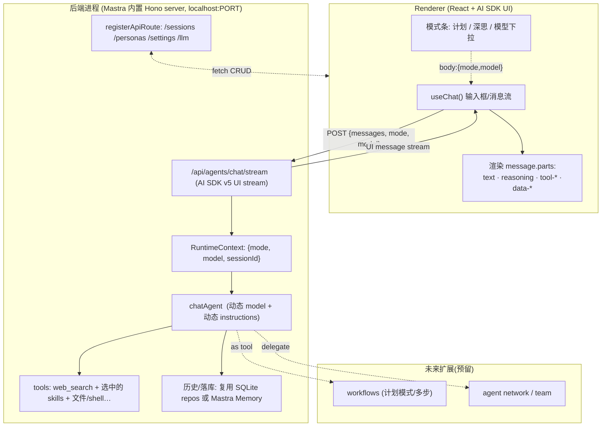

# 002 · 用 Mastra 原生 + AI SDK UI 重构 Chat 链路 —— 技术可行性、方案与程序骨架

> 背景：[001 全链路分析](001-chat-to-agent-answer-ui-timeline-link-analysis.md) 暴露出当前链路存在 **3 套事件模型 + 2 次映射 + 2 层意图路由 + 一套自研 `bloom-response-v1` 契约**。
> 诉求：前端直接用 **Mastra AI SDK UI**（`useChat` + 输入框），输入框问题**直接路由到 Mastra Agent**，由 Agent 自主 **ReAct 循环（带最大步数）** 决定是否调用 tool / skill；未来扩展 **agent team / workflows**、**计划模式 / 深度思考模式**、**模型选择**。
>
> 本文结论先行，再逐项核验技术可行性，给出目标架构、程序骨架、删除/保留清单、分阶段迁移与风险。
>
> ⚠️ 重要：本文是**设计文档**，不含任何删除/改写动作。代码删除是破坏性操作，需你确认方案后再执行（见第 11 节决策点）。

---

## 1. 结论先行

**是的，当前链路对“Chat 问答”这个目标是过度设计了。** 核心冗余在于自研了一套和 AI SDK 高度重叠的事件契约与映射层。改用 Mastra 原生流 + AI SDK UI 是**技术可行的**，且能砍掉大量胶水代码。

但有一处必须诚实：**当前那套丰富的 Timeline UX（工具分组卡、错误登记表、Tavily→DuckDuckGo 降级展示、状态机）不是免费保留的**。AI SDK UI 给的是标准 `message.parts`（text / reasoning / tool / data 自定义部件），你的精细 UX 要**重新绑定到 parts 上**——能保留，但要重写渲染层。

净账：
- **删掉**：`bloom-response-v1` 事件 schema、两个 mapper、`chat-response-stream` writer、自研 SSE 解析、`chat-response-reducer`、2 层意图路由、`/chat/stream` 路由。
- **保留并复用**：SQLite/Drizzle 仓库（会话/人设/设置）、prompts 组织、20+ 个工具实现、skills 系统、**Timeline 状态/错误登记表（降级为纯展示映射）**。
- **新增**：`@ai-sdk/react` + `ai`（v5）、一个 `Mastra` 实例（内置 Hono server）、RuntimeContext 驱动的“模式/模型”动态配置、自定义 data part 用于富 UX。

复杂度对比（概念层）：

| 维度 | 现状 | 重构后 |
|---|---|---|
| 事件模型 | 3 套（Mastra chunk → runtime event → v1） | 1 套（AI SDK UI message stream） |
| 映射层 | 2 个 mapper + 1 个 writer + 1 个 reducer | 0（框架内置） |
| 工具决策 | 2 层意图路由（programmatic + LLM 分类器） | LLM 原生 tool calling（可选保留预过滤） |
| 后端传输 | 自研 SSE + zod 校验 | Mastra `/api/agents/:id/stream`（AI SDK 协议） |
| 前端状态 | zustand + 自研 reducer | `useChat`（框架管理） |

---

## 2. 复杂度诊断：每一层换成什么

| 当前层 | 文件 | 它在做什么 | Mastra/AI SDK 对应物 |
|---|---|---|---|
| 自研事件契约 | `shared/schemas/response.ts` | 定义 11 种 v1 事件 | AI SDK v5 `UIMessage.parts`（text/reasoning/tool-*/data-*） |
| Mastra→runtime 映射 | `mastra-event-mapper.ts` | chunk 改名 | **删除**（框架直出 AI SDK chunk） |
| runtime→v1 映射 | `response-event-mapper.ts` | 懒启动/配对补全 | **删除**（`toUIMessageStream` 系列） |
| SSE writer | `chat-response-stream.ts` | 累计 text/trace 落库 | Mastra server + `onFinish`/Memory |
| 前端 SSE 解析 | `api/index.ts chatStream` | 手写行解析 + 校验 | `@ai-sdk/react` `DefaultChatTransport` |
| 前端 reducer | `chat-response-reducer.ts` | 事件→blocks | `useChat` 内部 `messages[].parts` |
| 2 层意图路由 | `runtime/intent/*` | 决定要不要调工具 | LLM 原生工具选择（Agent 自主） |
| Timeline 状态/错误表 | `llm-response-contract/*` | UX 语义登记 | **保留**为 parts→展示的纯映射 |

---

## 3. 技术可行性逐项核验

> 全部以**仓库内实际安装的 `@mastra/core@1.46.0`** 类型为依据核验（文档站 mastra.ai 在本环境被网络策略拦截，无法抓取；故以 node_modules 的 `.d.ts` 与导出子路径为准）。涉及精确方法名处已标注“需对 pin 版本二次确认”。

### 3.1 前端用 AI SDK UI（`useChat` + 输入框） — ✅ 可行
- `@mastra/core` 内部即基于 **AI SDK v5**：`dist/stream/aisdk/v5/` 下有 `convertMastraChunkToAISDKv5`、`UIMessage`（`_internal_ai-sdk-v5`）类型。`agent.stream()` 返回的 `MastraModelOutput` 暴露 `fullStream / textStream / text / toolCalls / usage / consumeStream`。
- 前端需新增依赖 `@ai-sdk/react`（`useChat`）+ `ai`（v5），当前**未安装**。
- `useChat` 自带受控输入与 `messages[].parts`，**可直接替代** `InputBar` + `Timeline` 的事件拼装；输入框（计划/深思/选模型）通过 `useChat` 的 `body`/`headers` 透传给后端。

### 3.2 输入直接路由到 Mastra Agent — ✅ 可行（Electron 下仍需本地 server）
- `@mastra/core/server` 导出 `registerApiRoute`、`MastraServerBase`，Mastra 内置 **Hono** server，`Mastra` 构造支持 `server: ServerConfig`。Agent 注册后自动暴露 `/api/agents/:agentId/stream`（AI SDK 流格式）。
- Electron 架构**几乎零改动**：当前 `src/main` 已用 `fork()` 起 `src/server/index.ts` 作为 sidecar 进程（Express，端口固定）。把该进程内的 **Express app 换成 Mastra Hono server** 即可，renderer 仍打 `http://127.0.0.1:PORT`。“直接路由”= 去掉自研 `/chat/stream`，前端 `useChat` 直接打 Mastra 的 agent 端点。

### 3.3 ReAct 循环 + 最大步数 — ✅ 可行（已具备）
- `agent.stream(messages, { maxSteps })` 原生支持（`.d.ts` 中 `maxSteps` 是默认流选项，当前代码已传 `DEFAULT_AGENT_MAX_STEPS=10`）。新版还可用 `stopWhen` 做更细停止条件。无需自己写循环。

### 3.4 由 Mastra 自主判断调用 tool / skill — ✅ 可行（最大简化点）
- 这就是 LLM 原生 function calling：把工具/技能挂到 Agent 的 `tools`，模型在 ReAct 循环里自行决定调用。**当前的 2 层意图路由可整体删除**。
- 可选：保留一个**轻量预过滤**（按会话/模式裁剪挂载的工具集，降低 token 与误调用），但不再做“答不答/调不调”的判定——交给模型。

### 3.5 Agent team / Workflows（未来） — ✅ 可行
- 子路径具备：`./workflows`、`./workflows/evented`、`./network/vNext`（多 Agent 网络/团队）、`./agent/durable`（可恢复长流）、`./tool-loop-agent`。`Mastra` 构造接受 `{ agents, workflows }`。
- 演进路径：先单 Agent → 再把 workflow 作为 tool 挂到 Agent → 再上 agent network 做团队编排。无需现在落地，但目录与注册点要预留。

### 3.6 计划模式 / 深度思考模式 — ✅ 可行
- 用 **RuntimeContext（`./request-context`）** 按请求注入模式开关，Agent 用**动态 instructions / 动态 model / providerOptions** 响应：
  - 深度思考：切到带 reasoning 的模型或开 `providerOptions`（如 Anthropic extended thinking），前端用 AI SDK 的 `reasoning` part 渲染思考过程。
  - 计划模式：换一套“先出计划再执行”的 instructions，或先跑一个 planning workflow。
- 前端 `useChat({ body: { mode, model } })` 把开关传到端点 → 注入 RuntimeContext。

### 3.7 选择大模型 — ✅ 可行
- Agent 的 `model` 支持**动态函数**（依据 RuntimeContext 返回不同模型）。请求体带 `model` → server 注入 RuntimeContext → Agent 动态解析。复用现有 `llm/model-selection`、`llm/providers`、`settings` 即可把 BloomAI 的模型注册表桥接到 Mastra 的 model 解析。

### 3.8 Electron / Express 集成 — ✅ 可行
- Mastra 官方有 Electron / Express 指南；本仓库已是“Electron 主进程 fork 后端进程”的标准形态。落地两选一：
  - **(推荐) 单 Mastra Hono server**：sidecar 进程里用 Mastra 内置 server，自定义 CRUD（会话/人设/设置）用 `registerApiRoute` 挂上去。
  - **(过渡) Express + Mastra 混跑**：保留 Express 提供 CRUD，新开一个 Mastra server 端口只跑 agent 流。短期省事，但等于两套 server，与“简化”目标相悖。

---

## 4. 目标架构



要点：
- **一套事件**：后端只产 AI SDK UI message stream，前端 `useChat` 直接消费。无 v1 契约、无 mapper、无 reducer。
- **模式与模型**经请求体 → RuntimeContext → Agent 动态解析，**不改端点**。
- 富 UX（工具卡/思考/状态）= 渲染 `parts` + 复用旧的**展示登记表**。

---

## 5. 程序骨架

> ⚠️ 下方 §5.2 草图中按当时推测写的 API（`toUIMessageStreamResponse`、`RuntimeContext`、手写端点）已被 **§12（已核验 API）** 以 `@mastra/core@1.46.0` 的实际类型与内置文档校正。**冲突时以 §12 为准**——正式实现按 §12。

### 5.1 目标目录树（仅列变化处）

```
src/
├─ server/
│  ├─ mastra/
│  │  ├─ index.ts              # new Mastra({ agents, workflows, server, storage })
│  │  ├─ agents/
│  │  │  └─ chat-agent.ts      # 动态 model + 动态 instructions(模式) + tools
│  │  ├─ tools/
│  │  │  ├─ web-search.tool.ts # 复用现有 web-search.ts 实现
│  │  │  └─ skill-tools.ts     # 把 skills/registry 桥成 Mastra tools
│  │  ├─ runtime-context.ts    # ChatRuntimeContext 类型 {mode, model, sessionId}
│  │  ├─ model-resolver.ts     # BloomAI 模型注册表 → Mastra model
│  │  └─ routes/
│  │     ├─ sessions.route.ts  # registerApiRoute 包装现有 repo
│  │     ├─ personas.route.ts
│  │     └─ settings.route.ts
│  └─ index.ts                 # 启动 Mastra server(替换 createApp/express)
├─ renderer/
│  └─ pages/Chat/
│     ├─ ChatPanel.tsx         # useChat() 接管
│     ├─ Composer.tsx          # 输入框 + 模式条(计划/深思/模型)
│     └─ parts/
│        ├─ TextPart.tsx
│        ├─ ReasoningPart.tsx  # 深度思考展示
│        ├─ ToolPart.tsx       # 复用工具卡 UI + 旧状态/错误登记表
│        └─ DataPart.tsx       # 自定义 data-* (如搜索降级提示)
└─ shared/
   └─ ui-contract/             # 由 llm-response-contract 改造: 纯展示映射(保留)
      ├─ tool-presentation.ts  # toolName/状态 → 图标/标签
      └─ error-presentation.ts # 错误码 → 文案/severity (沿用旧表)
```

### 5.2 关键文件代码草图（示意，精确 API 名以 pin 版本为准）

**Mastra 实例 + server**
```ts
// src/server/mastra/index.ts
import { Mastra } from '@mastra/core/mastra'
import { chatAgent } from './agents/chat-agent'
import { sessionsRoute, personasRoute, settingsRoute } from './routes'

export const mastra = new Mastra({
  agents: { chat: chatAgent },
  // workflows: { plan: planWorkflow },   // 未来
  server: {
    port: PORT,
    apiRoutes: [sessionsRoute, personasRoute, settingsRoute], // registerApiRoute(...)
    cors: { origin: '*' },
  },
})
```

**动态 Agent（模式 + 模型 + ReAct）**
```ts
// src/server/mastra/agents/chat-agent.ts
import { Agent } from '@mastra/core/agent'
import { resolveModel } from '../model-resolver'
import { webSearchTool } from '../tools/web-search.tool'
import { buildSkillTools } from '../tools/skill-tools'

export const chatAgent = new Agent({
  name: 'BloomAI Chat',
  instructions: ({ runtimeContext }) =>
    runtimeContext.get('mode') === 'plan'
      ? PLAN_INSTRUCTIONS
      : BASE_INSTRUCTIONS,
  model: ({ runtimeContext }) => resolveModel(runtimeContext.get('model')),
  tools: { web_search: webSearchTool, ...buildSkillTools() },
  // defaultStreamOptions: { maxSteps: 10 }  // ReAct 最大步数
})
```

**后端端点（若用内置端点则无需手写；自定义时）**
```ts
// 思路：Mastra 自动暴露 /api/agents/chat/stream；
// 仅当需要注入 RuntimeContext/落库时用 registerApiRoute 包一层
registerApiRoute('/chat/stream', {
  method: 'POST',
  handler: async (c) => {
    const { messages, mode, model, sessionId } = await c.req.json()
    const rc = new RuntimeContext()
    rc.set('mode', mode); rc.set('model', model); rc.set('sessionId', sessionId)
    const stream = await chatAgent.stream(messages, { runtimeContext: rc, maxSteps: 10 })
    return stream.toUIMessageStreamResponse() // ⚠️ 精确方法名需对 1.46 确认
  },
})
```

**前端 useChat**
```tsx
// src/renderer/pages/Chat/ChatPanel.tsx
const { messages, sendMessage, status } = useChat({
  transport: new DefaultChatTransport({ api: `${API_BASE}/chat/stream` }),
})
// 发送时带模式/模型
sendMessage({ text }, { body: { mode, model, sessionId } })

// 渲染 parts
message.parts.map(p => {
  if (p.type === 'text') return <TextPart .../>
  if (p.type === 'reasoning') return <ReasoningPart .../>   // 深度思考
  if (p.type?.startsWith('tool-')) return <ToolPart .../>   // 复用工具卡+旧登记表
  if (p.type?.startsWith('data-')) return <DataPart .../>   // 降级提示等
})
```

**工具桥接（复用现有实现）**
```ts
// src/server/mastra/tools/web-search.tool.ts
import { createTool } from '@mastra/core/tools'
import { z } from 'zod'
import { runWebSearch } from '../../tools/web-search' // 现有 Tavily→DuckDuckGo

export const webSearchTool = createTool({
  id: 'web_search',
  inputSchema: z.object({ query: z.string() }),
  execute: async ({ context }) => runWebSearch(context.query),
})
```

---

## 6. 现有代码：删除 / 保留 / 迁移清单

| 处理 | 文件 / 模块 | 说明 |
|---|---|---|
| 🗑 删除 | `shared/schemas/response.ts` 的事件部分、`shared/llm-response-contract/event-registry.ts` | v1 事件契约由 AI SDK parts 取代 |
| 🗑 删除 | `agent/mastra/mastra-event-mapper.ts`、`response-event-mapper.ts`、`chat-agent-runtime-adapter.ts` | 两次映射不再需要 |
| 🗑 删除 | `routes/chat-response-stream.ts`、`routes/chat.route.ts` 的 `/stream` | server 由 Mastra 接管 |
| 🗑 删除 | `agent/runtime/intent/*`、`chat-agent-router.ts`、`runtime/capabilities.ts` | 工具决策交给 LLM |
| 🗑 删除 | `renderer/store/chat-response-reducer.ts`、`api/index.ts` 的 `chatStream` 手写解析、`store` 的流式 reducer 部分 | `useChat` 接管 |
| 🗑 删除/重写 | `Timeline.tsx`、`ToolCallGroupCard.tsx`、`ToolCallCard.tsx`、`InputBar.tsx`、`MessageBubble.tsx` | 改为 parts 渲染（UI 资产可大量搬运） |
| ♻️ 保留+改造 | `shared/llm-response-contract/timeline-state-registry.ts`、`error-timeline-registry.ts` | 降级为 parts→展示 的纯映射，仍是有价值的 UX 资产 |
| ✅ 原样复用 | `server/tools/*`（20+ 工具实现）、`server/skills/*`、`server/prompts/*` | 仅在外面包一层 Mastra `createTool` |
| ✅ 原样复用 | `server/db/repositories/*`（session/persona/settings/message） | 经 `registerApiRoute` 暴露；历史是用 repo 还是 Mastra Memory 见决策点 |
| ✅ 复用 | `server/llm/*`（providers/model-selection/settings） | 桥接到 Mastra model 解析 |
| ➕ 新增 | `@ai-sdk/react`、`ai`（v5）依赖 | 前端 UI |

---

## 7. 分阶段迁移（每阶段可独立验收，避免大爆炸式重写）

1. **P0 立柱**：装 `@ai-sdk/react`+`ai`；建最小 `Mastra` 实例 + 一个 `chat` Agent（只挂 web_search）；sidecar 进程用 Mastra server；新建 `/chat2` 页用 `useChat` 打通端到端（不动旧 `/chat`）。
2. **P1 能力对齐**：桥接全部工具与 skills 为 Mastra tools；删除 2 层意图路由，验证模型自主调用。
3. **P2 富 UX**：把工具卡/错误展示重绑到 `tool-*` part + 旧登记表；`reasoning` part 接“深度思考”。
4. **P3 模式与模型**：RuntimeContext + 动态 model/instructions，接“计划/深思/模型下拉”。
5. **P4 落库与历史**：选定持久化方案（repo vs Memory），补会话/消息 CRUD。
6. **P5 切换与清理**：`/chat2` 替换 `/chat`，删除第 6 节所有 🗑 项与依赖。
7. **P6 扩展位**：预留 `workflows/` 与 `network/`，先用一个 plan workflow 验证。

---

## 8. 风险与取舍（诚实清单）

- **富 UX 重写成本**：工具分组卡、降级子步骤、错误卡是当前的差异化体验，AI SDK parts 能表达但要重写绑定，P2 是真实工作量大头，不要低估。
- **持久化语义变化**：现在落库时机/字段（trace、tool_calls JSON）很定制；换 `useChat` 后需用 `onFinish` 或 Mastra Memory 重做，注意“失败保留部分内容/不存空气泡”等既有不变量要再实现一遍。
- **AI SDK v5 与 Mastra 1.46 的精确 API**：`toUIMessageStreamResponse` / `DefaultChatTransport` / RuntimeContext 注入点的**精确签名**需对 pin 版本核对（文档站本环境抓不到）；建议 P0 先写一个 30 行 spike 验证流能跑通再铺开。
- **“前端直接路由到 agent”在 Electron 仍需本地 server**：不能真的从 renderer 进程内调 Agent（要 Node 运行时与密钥），仍是 renderer→localhost server。措辞上澄清，避免误解为“去掉后端”。
- **确定性下降**：删掉 programmatic 意图后，工具是否调用完全交给模型，可能更随机；如需可控，保留“按模式裁剪工具集”的轻预过滤。
- **回退能力**：当前 agent-only 已无 direct LLM 回退；迁移期建议保留旧 `/chat` 直到 `/chat2` 全绿。

---

## 9. 推荐结论

值得做，按 **P0→P6 渐进**、**新页面并行**、**旧链路最后再删**。最大收益是干掉 3 套事件模型与 2 层意图路由；最大成本是富 UX 重绑 parts。建议先做 P0 的 30 行 spike 锁定 1.46 的精确 API，再正式铺开。

---

## 10. 决策点（已锁定 2026-07-01）

| # | 决策 | 选定 | 影响 |
|---|---|---|---|
| 1 | 迁移节奏 | **直接删旧代码重写**（不并行 /chat2） | 在原 `Chat` 页与 server 上原地替换；建好新路径即删旧链路 |
| 2 | 富 UX | **重建到 AI SDK parts 上** | 工具分组卡/降级/错误卡重绑 `tool-*`/`data-*`，复用旧登记表 |
| 3 | 持久化 | **继续用现有 SQLite repos** | session/message/persona/settings 经 `registerApiRoute` 暴露；不迁 Mastra Memory |
| 4 | 后端形态 | **单 Mastra Hono server** | sidecar 进程只跑 Mastra server，Express 退场 |
| 5 | 意图路由 | 默认彻底交给模型（保留“按模式裁剪工具集”的轻预过滤位） | 删除 `runtime/intent/*` 的判定逻辑 |

> 工程顺序仍按“先立起 Mastra 流并验证通过，再删旧代码”执行——“直接重写”指最终形态不保留并行旧页面，而非先删后写。

---

## 11. 任务分解（P0–P6）

见会话内 Task 列表（TaskCreate）。P0 为“立柱 + 验证流跑通”，确认 §12 的精确 API 后再铺开 P1+，最后 P5 才删旧代码。

---

## 12. 已核验 API 事实（@mastra/core@1.46.0，依据 node_modules 类型 + 内置 docs）

> mastra.ai 文档站在本环境被网络策略拦截；以下全部来自仓库内 `node_modules/@mastra/core/dist/**/*.d.ts` 与 `node_modules/@mastra/core/dist/docs/references/*.md`（该版本随包内置了完整参考文档）。

### 12.1 需新增的依赖（当前均未安装）
- `@mastra/ai-sdk` —— 提供 `chatRoute()` / `toAISdkStream()` / `network-route` / `workflow-route`。
- `ai`（AI SDK v5）—— `createUIMessageStream` / `createUIMessageStreamResponse` / `DefaultChatTransport`。
- `@ai-sdk/react` —— `useChat`。
- 已存在（transitive）：`@hono/node-server@1.19.14`（用于把 Mastra 路由 serve 到端口）。

### 12.2 后端端点：用 `chatRoute()`（最简，**取代**自研 `/chat/stream` + 两个 mapper）
```ts
import { Mastra } from '@mastra/core'
import { chatRoute } from '@mastra/ai-sdk'

export const mastra = new Mastra({
  agents: { chat: chatAgent },
  server: {
    port: PORT, host: '127.0.0.1', cors: { origin: '*' },
    apiRoutes: [
      chatRoute({ path: '/chat', agent: 'chat', sendReasoning: true,
        defaultOptions: { maxSteps: 10 } }),       // ReAct 最大步数在此
      // 或 chatRoute({ path: '/chat/:agentId' }) 动态路由
      ...crudRoutes,                                // registerApiRoute(...)
    ],
  },
})
```
- `chatRoute` 自动转发请求的 `AbortSignal` 到 `agent.stream()`（客户端断开即中止）。若要“断开后仍继续生成并落库”，改用 `registerApiRoute` 自己包 `agent.stream()` 并调 `consumeStream()`。
- 落库（继续用 SQLite repos）走自定义路由 + `defaultOptions`/`onFinish` 路径；`chatRoute` 默认不写我们的库。

### 12.3 模式 / 模型 / 落库：`RequestContext`（注意**不是** `RuntimeContext`）
```ts
import { RequestContext } from '@mastra/core/request-context'
// server.middleware 里从 header/body 注入：
server: { middleware: [async (c, next) => {
  const rc = c.get('requestContext')
  rc.set('mode', c.req.header('x-bloom-mode'))
  rc.set('model', c.req.header('x-bloom-model'))
  await next()
}]}
```
Agent 侧读取（`instructions` / `model` / `tools` 均支持 `({ requestContext }) => ...`，可 async）：
```ts
new Agent({
  id: 'bloom-chat', name: 'BloomAI Chat',
  instructions: ({ requestContext }) =>
    requestContext.get('mode') === 'plan' ? PLAN_INSTRUCTIONS : BASE_INSTRUCTIONS,
  model: ({ requestContext }) => resolveModel(requestContext.get('model')), // 桥接现有 llm/model-selection
  tools: ({ requestContext }) => pickTools(requestContext.get('mode')),     // 轻量预过滤(可选)
})
```

### 12.4 工具：`createTool`（包一层复用现有实现）
```ts
import { createTool } from '@mastra/core/tools'
import { z } from 'zod'
export const webSearchTool = createTool({
  id: 'web_search',
  description: 'Search the web for current info',
  inputSchema: z.object({ query: z.string() }),
  outputSchema: z.object({ results: z.array(z.any()) }),
  execute: async ({ query }) => runWebSearch(query), // 现有 server/tools/web-search.ts
})
```

### 12.5 前端：`useChat` + `DefaultChatTransport`（取代自研 chatStream + reducer）
```tsx
import { useChat } from '@ai-sdk/react'
import { DefaultChatTransport } from 'ai'
const { messages, sendMessage, status, stop, error } = useChat({
  transport: new DefaultChatTransport({
    api: `${API_BASE}/chat`,
    prepareSendMessagesRequest: ({ messages }) => ({
      body: { messages },
      headers: { 'x-bloom-mode': mode, 'x-bloom-model': model },
    }),
  }),
})
// 渲染 message.parts：text / reasoning / tool-* / data-*（富 UX 重绑点）
```

### 12.6 serve 机制（单 Mastra Hono server 嵌入 Electron sidecar）
两条路，P0 spike 二选一定稿：
- **A（推荐先试）**：`mastra build` 生成 `.mastra/output` 的 Hono server，sidecar 进程直接跑它（与现有 `fork(server/index)` 形态一致，只换被 fork 的脚本）。
- **B（手动嵌入）**：用 server adapter 把 Mastra 路由挂到 Hono app，再 `@hono/node-server` 的 `serve({ fetch: app.fetch, port })`。无需 CLI/构建目录，但更手动。
- Electron 侧 `src/main` 现已 `fork()` 后端进程、renderer 打 `API_BASE`；**两条路都不需要改动主进程与 renderer 的连接方式**，只换 sidecar 入口。

### 12.7 与现有代码的桥接点
- 模型：`server/llm/model-selection.ts` 的 `toMastraModelId` / `toMastraModelConfig` 已能产出 Mastra 接受的 `provider/model` 或 `OpenAICompatibleConfig` —— 直接喂给 Agent `model`。
- 工具/技能：`server/tools/*`、`server/skills/registry.ts` 包 `createTool` 即可。
- 持久化：`server/db/repositories/*` 经 `registerApiRoute` 暴露 CRUD；聊天落库用自定义 `agent.stream()` 路由 + `onFinish`。
- 展示登记表：`shared/llm-response-contract/{timeline-state,error-timeline}-registry.ts` 保留，改为 `parts`→展示 的映射。

---

## 13. P0 验证结果（已跑通 ✅，分支 `feat/mastra-aisdk-ui-chat`）

**结论：核心论证全部成立，重写可继续。** 在 `@mastra/core@1.46.0` 实测：

- 依赖锁定（对齐 Mastra 输出协议 AI SDK **v6**）：`@mastra/ai-sdk@1.6.0`、`ai@6`、`@ai-sdk/react@3`、`@ai-sdk/anthropic@3`、`@ai-sdk/openai@3`、`@ai-sdk/openai-compatible@2`。
- 新增最小后端（均 typecheck 通过）：
  - `src/server/mastra/index.ts` — `new Mastra({ agents: { chat } })`
  - `src/server/mastra/chat-agent.ts` — 动态 `model` + 动态 `instructions(mode)` + `web_search` 工具（复用既有 `createWebSearchAdapterTool`）
  - `src/server/mastra/model-resolver.ts` — BloomAI provider 注册表 → AI SDK v6 provider（anthropic/openai/openai-compatible/ollama 各走对的 endpoint）
  - `scripts/smoke-mastra-chat.ts` — 直连 `handleChatStream(version:'v6')` 消费流
- 实测流（Agnes openai-compatible 模型 `agnes-2.0-flash`）：
  - 纯问答：`text-start → text-delta×N → text-end → finish`，得到正确答案。
  - 工具调用：模型**自主**决定调用 `web_search`（**无意图路由**），AI SDK v6 工具生命周期 `tool-input-start → tool-input-delta → tool-input-available → tool-output-available → text-*` 全部正常，返回带链接的合成答案。

**踩坑记录（对后续有用）：**
- Mastra 默认 model gateway 把裸 `provider/model` 字符串当 openai-compatible 处理，直连 Anthropic 会 404（打到 `/chat/completions` 而非 `/v1/messages`）。**修复=按 provider kind 用真正的 AI SDK provider 实例**（见 model-resolver）。
- 本机网络直连 `api.anthropic.com` / `api.openai.com` 返回 **403（地域限制）**；可用的是 openai-compatible 中转（Agnes）。故 P0 用 `agnes-2.0-flash` 验证。
- 取数前必须 `runMigrations()`：模型选择经 SQLite 读 settings。

**下一步（仍在 P0→P1 之间）：** 把 `handleChatStream` 包成 Hono `POST /api/v1/chat` 端点（`@hono/node-server` serve），写最小 `useChat` 页面做 HTTP 端到端；随后进入 P1 工具/技能桥接与删除意图路由。

---

## 14. P0b 完成：Express 全量换 Hono + useChat 页面（已验证 ✅）

**后端：Express 完全退场，单 Hono server（`@hono/node-server`）。**
- 新增 `src/server/http/`：`app.ts`（Hono 应用，cors + 7 组路由 + notFound/onError）、`routes/{chat,sessions,personas,settings,llm,tools,skills}.ts`、`util.ts`。
- 所有 CRUD 路由按 1:1 从 Express Router 移植（包裹既有 SQLite repos，零行为变化）。
- `chat.ts`：`POST /api/v1/chat` → `handleChatStream({ version:'v6', sendReasoning })` → `createUIMessageStreamResponse`；从 header `x-bloom-mode/model/session` 注入 `RequestContext`；默认模型 **Agnes `agnes-2.0-flash`**；转发 `AbortSignal`。
- `src/server/index.ts` 改为 `serve({ fetch: app.fetch })`，启动前 `loadDotEnv()` + `runMigrations()`。
- 旧 `app.ts` / Express routers / 旧 `chat.route.ts` 仍在磁盘（P5 删除），但已不再被引用。

**前端：`src/renderer/pages/Chat/ChatPanelMastra.tsx`（useChat）。**
- `useChat({ transport: DefaultChatTransport })`，`prepareSendMessagesRequest` 透传 mode/model header。
- 渲染 `message.parts`：`text`（markdown）/ `reasoning`（思考块）/ `tool-*`（工具卡）。
- 模式条（对话/计划/深思）+ Agnes 默认模型。`Chat/index.tsx` 与 `App.tsx` 已切到新面板（旧 ChatPanel/Timeline/reducer 保留待 P5 删）。

**验证：**
- `tsc --noEmit` 全绿；`vite build` 全绿（renderer 1936 模块含 ai/@ai-sdk/react 正常打包）。
- Hono 启动正常：`/health`、`GET /sessions`、`GET /llm/models` 正常返回。
- `POST /api/v1/chat`（curl，Agnes）实测流：`start → text-start → text-delta×N → text-end → finish → [DONE]`，模型按指令精确回复。
- 测试：257 passed / 1 failed，**该 failed 为 main 既有**（断言旧 `chat.route.ts` 含 `from '../llm'`，与本次无关，P5 会删该文件）。

**下一步：** P1 把全部 `server/tools/*` 与 `skills` 桥成 Mastra tools 挂到 agent、删除两层意图路由；P2 富 UX；P3 模式/模型动态化；P4 落库（useChat `onFinish` → message.repo）；P5 删旧链路。

---

## 15. P1 完成：工具/技能桥接 + 删除两层意图路由（已验证 ✅）

**桥接（LLM 自主决定调用，无意图路由）：**
- 新增 `src/server/mastra/tools.ts` `buildAgentTools(sessionId)`：把**所有启用的内置工具**（`toolRepo` 中 `is_enabled=1`，22 个）+ **所有已安装技能**（`skillRepo`）逐个包成 Mastra `createTool`，分别包装 `executeTool` / `runSkill`。每请求重建，故新启用工具/新装技能下一轮即生效。
- 新增 `src/server/mastra/json-schema.ts`：BloomAI params schema → zod。**修了一个真 bug**：内置工具的 `params_schema` 是**扁平属性表**（`{query:{type:string},...}`），不是 `{type:'object',properties}`；旧转换器据此返回 `z.object({})` 会把 `query` 等参数**剥光**，导致工具执行 `Cannot read properties of undefined`。现同时支持扁平表与包裹式，并 `.passthrough()` 兜底。
- `chat-agent.ts`：`tools: ({requestContext}) => buildAgentTools(sessionId)`，去掉 web_search 专用适配器。

**删除（旧链路一并清掉）：**
- 整个 `src/server/agent/`（两层意图路由 `runtime/intent/*`、`runtime/capabilities`、`chat-agent-router`、legacy `chat-agent-runtime-adapter`、`mastra-event-mapper`、`response-event-mapper`、旧 `chat-agent`、`web-search-adapter.tool`、`skill-adapter.tool`、`constants`、`types`、barrel `index.ts` + 全部对应 test）。
- 旧 Express 聊天：`routes/chat.route.ts` + `chat-response-stream.ts` + 两个 test。
- `app.ts`（遗留 Express，仅留给 LLM 路由集成测试）移除 chat 挂载。
- 修订 `llm-runtime.integration.test.ts`：删除已失效的 “vendor-neutral chat.route.ts” 用例（该文件已删）。

**验证：**
- `tsc --noEmit` 全绿；`vitest` **160 passed / 0 failed**（删除遗留后从 258 降到 160，无失败；含此前那条既有失败用例已随文件移除）。
- 实测：23 个工具挂载（含 `skill_web-search-skill`）；agent 自主调用 `web_search` → `tool-output-available` → 带链接答案。

**安全门控（已实现）：** 暴露所有启用工具，但 `buildBuiltinTools` 用 `tools.requires_permission` 门控：`write/shell/sandbox` 级（`fs_write/fs_edit/bash/shell/node_runner/python_runner`）需 `tool_permissions.granted=1` 才执行，否则返回**软错误**让 agent 转告用户去授权；`network/fs`（读类）直接放行。手动 `/run`（用户主动）不受影响。实测：`shell` 未授权→权限软错误；`fs_read`/`web_search`→正常执行。

---

## 16. P2 完成：富 UX 重建到 AI SDK parts（编译/打包验证 ✅）

把工具卡/降级提示/错误/思考重新绑定到 `message.parts`，复用既有 `msg-*`/`tcg-*` 设计语言：
- `parts/tool-part.ts`：归一化 AI SDK v6 工具 part（`tool-<name>` 与 `dynamic-tool`）→ `ToolCallView`；状态判定 running/success/error/**permission**；`summarizeInput/Output`（web_search 显示 provider、`fallbackFrom → provider`、结果数）、`extractResultLinks`（Top 链接）。
- `parts/ToolGroupCard.tsx`：把**相邻同名工具调用**合并为一张分组卡（tcg-* 样式），每行显示输入、运行中/结果摘要、权限软错误（黄）、错误（红）、结果链接；组头聚合状态 running>error>permission>success。
- `parts/ReasoningPart.tsx`：可折叠“思考”块（深思模式 reasoning part）。
- `parts/AssistantMarkdown.tsx`：复用旧 markdown 渲染（code-block/链接等）。
- `ChatPanelMastra.tsx` 重写为 `msg-group/msg-bubble` 结构 + `input-area/input-row/input-box` 输入区；按顺序渲染 parts（连续同名工具合并）、等待态 spinner、顶层错误卡、模式条（对话/计划/深思）。
- `global.css` 追加：mode-switch/mode-tab、reasoning-block、tcg permission/links 样式（用既有设计变量 + 安全回退）。

**验证：** `tsc` 全绿；`vite build` 全绿（1940 模块）。后端流此前已 curl 实测（text/reasoning/tool parts）。可视化点击验证需 `npm run dev` 跑 Electron。

---

## 17. P4 完成：落库与历史（SQLite repos，已实测 ✅）

服务端落库（沿用既有 `message.repo`/`session.repo`，不引入 Mastra Memory）：
- `http/routes/chat.ts`：流式前保存 **user** 消息（+ `sessionRepo.touch`，首条设标题）；`handleChatStream` 的 `params.onFinish` 里保存 **assistant** 消息（最终 `text` + `usage` tokens + 极简 trace `{runtime,model,toolCalls[]}`）。落库失败仅记日志（`PERSISTENCE_ERROR`），不影响已推送内容。
- maxSteps 也经 `params` 传入（10）。
- 前端 `ChatPanelMastra`：`useChat({ id: activeSessionId })` 让每会话独立；切换会话时 `platform.getMessages` → `setMessages` 还原历史（assistant 文本恢复；历史工具卡不重建）。

**实测（curl 全链路）：** 建会话 → POST /chat（Agnes）消费完流 → `GET /sessions/:id/messages` 返回 **user + assistant** 两行，assistant `content="persisted ok."`、`tokens=1797`、`tool_calls` trace 已写、会话标题已设。`tsc`/`vitest`(160)/`vite build` 全绿。

---

## 18. P3 完成：模式与模型（已验证 ✅）

mode/model 链路在 P0b 已通（header→RequestContext→动态 instructions/model）。本阶段补齐：
- `chat-agent.ts`：三档模式都有独立 instructions——`chat`（默认）、`plan`（先列编号计划再执行）、`deep`（深度思考：逐步推理、考虑边界与替代、必要时取证，重正确性与深度）。`sendReasoning:true` 已开，若选用 reasoning 模型则前端 ReasoningPart 自动展示思考。
- `ChatPanelMastra.tsx`：新增 `ModelMenu` 下拉（读 `useLlmStore.textModels`，复用既有 model-dropdown 样式），选择即 `setModelOverride` 并持久化到 session；切会话重置 override。模型经 `x-bloom-model` 透传。

**验证：** `tsc`/`vite build` 全绿；deep 模式实测正常出答案。

---

## 19. P5 完成：删除旧链路（Express + v1 契约 + 旧渲染层，已验证 ✅）

**P5a — Express 全量退场（commit e256562）：** 见 §18 上文同义；迁移 LLM 集成测试到 Hono，删除 app.ts/旧 routers/middleware/死的 llm response-event-mapper，移除 express/cors 依赖。

**P5b — 渲染层 + bloom-response-v1 契约：**
- 删除旧渲染：`ChatPanel`、`Timeline`、`ToolCallCard`、旧 `ToolCallGroupCard`、`MessageBubble`、`InputBar`、`ContextPills`（+各自 test）、`store/chat-response-reducer`(+test)。
- `store/index.ts`：`useChatStore` 瘦身——只留 `loadMessages/clearMessages`（侧栏预取用），删掉 streaming/sendMessage/reducer/tokenUsage。
- `api/index.ts`：删掉 `chatStream` 生成器 + 全部 SSE 解析 helper + v1 类型导入（保留 CRUD 与 applyTheme）。删除 `store/index.test`、`api/index.test`（全为已删功能）。
- shared 契约：删除 `event-registry`、`timeline-state-registry`、`registry.test`、`schemas/response`(+test)、`schemas/message-trace`(+test)；`schemas/index` 去掉相关 re-export。**保留** `error-timeline-registry`（logger 在用），将 `ResponseError` 内联其中以自包含；`logger.ts` 改从契约导入 `ResponseError`。

**验证：** `tsc` 全绿；`vitest` **75 passed / 0 failed**；`vite build` 全绿（1938 模块）；Hono 运行时 smoke：health ok + chat 流 `P5 ok.`→`[DONE]`。

至此：3 套事件模型 / 2 次映射 / 2 层意图路由 / 自研 SSE 契约 / Express **全部移除**；后端仅 Hono+Mastra，前端仅 useChat+parts。

---

## 20. P6a 完成：最小可用 deep-research workflow（已实测 ✅）

第一个真正的 Mastra workflow,挂到 chat 的 **deep 模式**:
- `mastra/workflows/deep-research.ts`:确定性两步 pipeline ——`gatherSources`(createStep,跑 `web_search`,limit 6)→ `.map()` 拼 prompt → `createStep(researchWriterAgent)`(流式写带引用的报告)。`.commit()`。
- `mastra/agents/research-writer-agent.ts`:无工具的写作 agent,model 从 RequestContext 解析(与 chat 同模型)。
- `mastra/index.ts`:`new Mastra({ agents:{chat, research-writer}, workflows:{'deep-research'} })`。
- `http/routes/chat.ts`:`mode==='deep'` 分支 → `run.stream({inputData:{query}, requestContext})` → `toAISdkStream({from:'workflow'})` → `createUIMessageStream` → 流到 useChat;execute 内累计文本并 `persistAssistantMessage` 落库。chat/plan 模式仍走 `handleChatStream`,不受影响。

**控制权**:流程写死在 workflow(代码),不是模型临场决定——这正是 workflow 相对 supervisor 的特点(可预测/可调试)。

**实测(curl,mode=deep)**:流事件含 `data-workflow`/`data-workflow-step`(步骤进度)+ **558 个 text-delta**(报告增量流式)+ `finish`;`GET /messages` 显示 user + assistant(报告)均已落库。`tsc`/`vitest`(75)/`vite build` 全绿。

> 前端 `data-workflow*` 自定义 part 暂被忽略(只渲染最终报告文本);把步骤进度做成可视化时间线属于 **P6b**。
