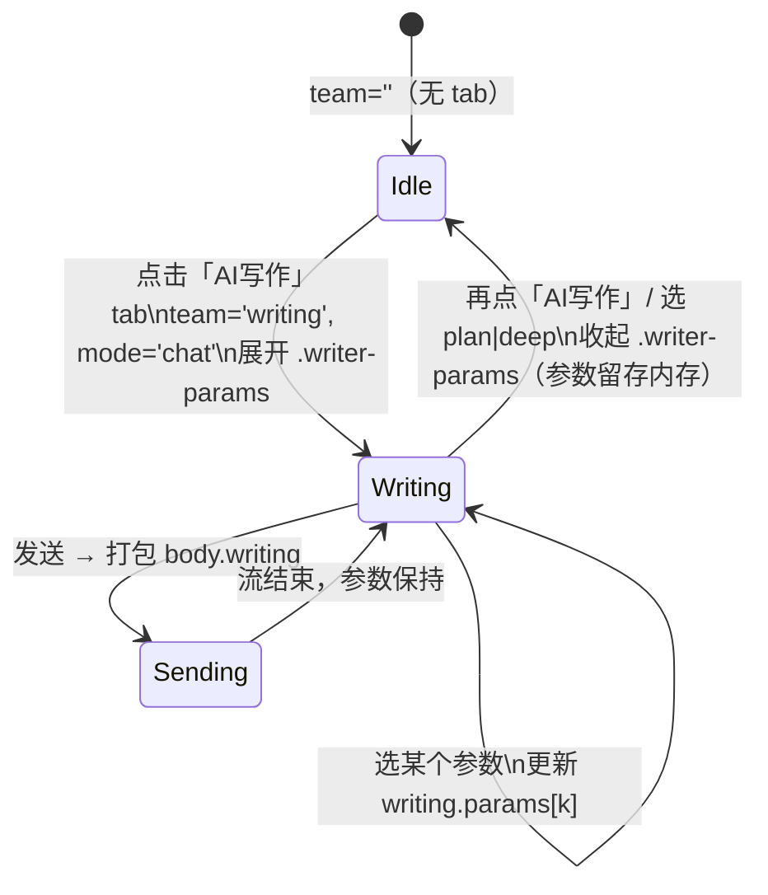
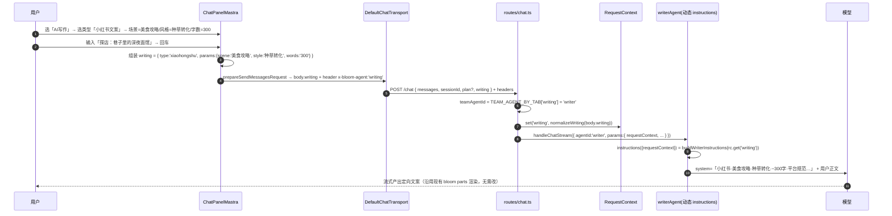

# 003 · 「写作」tab 升级为「AI 写作」Agent —— 写作类型 + 参数化下拉设计方案

> 范围：把 Chat 输入框下的 **写作** specialist tab 升级为 **AI 写作** agent。用户先选 **写作类型**（通用 / 工作总结 / 小红书文案），类型下方联动出现若干 **参数下拉框**（发布平台 / 风格 / 字数 等）。这些参数随请求传到后端，动态拼进 `writer` agent 的 system instructions，产出定向文案。
>
> 关键约定：**不新增 agent，不改路由拓扑**。沿用现有 `x-bloom-agent: writing → writer` 的 P6d 路由（见 [002 §23](002-mastra-aisdk-ui-redesign-feasibility-and-skeleton.md)）。改动集中在：① 前端输入区新增「类型 + 参数」控件；② 传输 body 新增 `writing` 配置对象；③ `writerAgent.instructions` 由静态字符串升级为 `({ requestContext }) => string`。
>
> 现状锚点：
> - 前端 tab / 输入区：[ChatPanelMastra.tsx](../../src/renderer/pages/Chat/ChatPanelMastra.tsx)（`TEAM_TABS` L29、`team` state L107、transport `prepareSendMessagesRequest` L163）
> - 后端路由：[routes/chat.ts](../../src/server/http/routes/chat.ts)（读 header + 建 `RequestContext` L26–41、`teamAgentId` L47）
> - writer agent：[mastra/agents/team.ts](../../src/server/mastra/agents/team.ts)（`writerAgent` L28、`TEAM_AGENT_BY_TAB` L54）
> - 样式：[global.css](../../src/renderer/styles/global.css)（`.input-shell` L470、`.input-toolbar` L494、`.team-tab` L1176）

---

## 1. 背景与目标

现在的 **写作** tab 只是把消息路由到 `writer` agent，agent 用一段固定 system prompt「写点好文章」，风格 / 平台 / 字数全靠用户在正文里自己描述。升级目标：

1. **写作类型化**：tab 更名为 **AI 写作**，选中后先出「类型」选择器：`通用 / 工作总结 / 小红书文案`。
2. **参数化下拉**：不同类型联动出不同下拉框（发布平台、风格、字数、场景……），值即选即用，无需用户打字描述。
3. **参数驱动 prompt**：所选参数随请求送到后端，拼进 `writer` 的动态 instructions，让模型按「平台 × 风格 × 字数」精确产出。
4. **零破坏**：不改事件契约、不改路由分发、不动 research/coding tab。只在 writer 这一支上做「静态 prompt → 参数化 prompt」的增量升级。

---

## 2. 功能描述

### 2.1 写作类型与参数矩阵

每个下拉框的 **第 0 项是占位/字段名**（如「发布平台」「字数」），语义为 *未选择*；第 1..N 项才是真实取值。占位项被选中时该参数不进入 prompt（模型自行决定）。

**类型一：通用**（3 个下拉框）

| # | 下拉框 | 占位（idx 0） | 可选值（idx 1..N） |
|---|--------|--------------|-------------------|
| 1 | 发布平台 | `发布平台` | 公众号 · 知乎 · 头条号 |
| 2 | 写作风格 | `写作风格` | 正式 · 口语 · 幽默 · 简洁 · 抒情 · 夸张 |
| 3 | 字数 | `字数` | 200 · 500 · 1000 · 2000 |

**类型二：工作总结**（3 个下拉框）

| # | 下拉框 | 占位（idx 0） | 可选值（idx 1..N） |
|---|--------|--------------|-------------------|
| 1 | 类型 | `类型` | 个人总结 · 转正述职 · 实习报告 · 工作日报 · 工作周报 · 工作月报 |
| 2 | 风格 | `风格` | 正式 · 简洁 · 客观 · 数据化 |
| 3 | 字数 | `字数` | 200 · 500 · 1000 · 2000 · 4000 |

**类型三：小红书文案**（3 个下拉框）

| # | 下拉框 | 占位（idx 0） | 可选值（idx 1..N） |
|---|--------|--------------|-------------------|
| 1 | 场景 | `场景` | 通用场景 · 物品介绍 · 旅行介绍 · 美食攻略 · 体验记录 |
| 2 | 风格 | `风格` | 正式 · 简洁 · 种草转化 · 品牌专家 |
| 3 | 字数 | `字数` | 50 · 100 · 200 · 300 · 400 · 500 |

> **✅ 已定稿（2026-07-01）**：原始需求第 3 条文字写「2 个下拉框」但列了 3 个，经确认按 **3 个下拉框**（场景 + 风格 + 字数）实现，与前两个类型一致。

### 2.2 交互规则

1. **激活**：点击输入区 **AI 写作** tab → tab 高亮 + 强制 `mode='chat'`（与现有 team tab 行为一致，见 `handleTeamToggle` L154）；tab 下方展开「类型 + 参数」控件行。
2. **类型切换**：类型选择器默认落在 `通用`。切换类型时，下方参数下拉框整组 **按新类型重建**，并各自复位到 idx 0 占位（不跨类型保留旧值，避免「工作总结的字数 4000」漏到「小红书」）。
3. **参数选择**：每个下拉框独立可选；均可停留在占位（idx 0）= 不约束该维度。
4. **发送**：点发送/回车 → 当前 `{类型, 参数...}` 打包进请求 body → 路由到 `writer` agent → 参数拼进 system prompt。
5. **停用**：再次点 **AI 写作** tab 取消选中 → 参数控件行收起；已选参数 **保留在内存**，下次重新激活同一 session 时回填（不持久化到 DB，随 session 切换清空，与现有 `team` state 生命周期一致）。
6. **互斥**：选 `计划 / 深度思考` mode 会清空 team tab（现有 `handleModeChange` L149），参数控件行随之收起。

### 2.3 与现有 tab 的关系

| 维度 | research / coding | writing（升级后 = AI 写作） |
|------|-------------------|----------------------------|
| tab 标签 | 研究 / 编码 | **AI 写作**（原「写作」） |
| 选中后附加 UI | 无 | 类型选择器 + 联动参数下拉框 |
| 传输附加数据 | 无 | `body.writing = { type, params }` |
| 后端 agent | research / coder | writer（instructions 升级为动态） |
| 工具 | web / file+shell | 无（沿用 `ROLE_TOOL_IDS.writing = []`） |

---

## 3. UI Blueprint 界面

参数控件行插在 **textarea 与 toolbar 之间**（`.input-shell` 是 `flex-direction: column`，插一行零成本），保证「先看类型/参数、后打正文」的自然顺序。

```
┌─ .chat-footer ─────────────────────────────────────────────────────────┐
│ ┌─ .input-area ───────────────────────────────────────────────────────┐ │
│ │ ┌─ .input-shell (column) ─────────────────────────────────────────┐ │ │
│ │ │                                                                  │ │ │
│ │ │  .input-box  (textarea)                                          │ │ │
│ │ │  ┌────────────────────────────────────────────────────────────┐ │ │ │
│ │ │  │ 描述你要写的内容，或直接选好参数后点发送…                    │ │ │ │
│ │ │  └────────────────────────────────────────────────────────────┘ │ │ │
│ │ │                                                                  │ │ │
│ │ │  ★ .writer-params  ← 仅当 team==='writing' 时渲染               │ │ │
│ │ │  ┌────────────────────────────────────────────────────────────┐ │ │ │
│ │ │  │  类型: [ 通用 ▾ ] [ 工作总结 ] [ 小红书文案 ]  (segmented)    │ │ │ │
│ │ │  │  参数: [ 发布平台 ▾ ] [ 写作风格 ▾ ] [ 字数 ▾ ]              │ │ │ │
│ │ │  └────────────────────────────────────────────────────────────┘ │ │ │
│ │ │                                                                  │ │ │
│ │ │  ┌─ .input-toolbar ──────────────────────────────────────────┐  │ │ │
│ │ │  │ .left: [＋] [对话▾] [模型▾]  ( 研究 )( AI写作 )( 编码 )     │  │ │ │
│ │ │  │ .right:                                        [ 发送 ➤ ] │  │ │ │
│ │ │  └───────────────────────────────────────────────────────────┘  │ │ │
│ │ └──────────────────────────────────────────────────────────────────┘ │ │
│ └──────────────────────────────────────────────────────────────────────┘ │
└──────────────────────────────────────────────────────────────────────────┘
```

三种类型下 `参数:` 行的形态：

```
通用      →  [ 发布平台 ▾ ] [ 写作风格 ▾ ] [ 字数 ▾ ]
工作总结  →  [ 类型 ▾ ]     [ 风格 ▾ ]     [ 字数 ▾ ]
小红书文案 →  [ 场景 ▾ ]     [ 风格 ▾ ]     [ 字数 ▾ ]
```

> **实现选型**：类型选择器用 segmented 小胶囊（复用 `.team-tab` 视觉语言）；参数下拉框用 **原生 `<select>`**（复用 `.field-select`，见 [Personas/index.tsx L139](../../src/renderer/pages/Personas/index.tsx)）。原生 select 无障碍/键盘/收起免维护，最省事，符合 002「最大简化」基调。若后续要更精致的 popover，可换成 `ModelMenu` 那套自定义下拉（ChatPanelMastra L438）。

---

## 4. 交互流程

### 4.1 前端状态机



### 4.2 发送时序（端到端）



关键点：**参数走 body 不走 header**。header 只能带 ASCII 且易被代理截断，而「美食攻略/种草转化」是中文——与现有 `plan` 走 body 同理（见 chat.ts L36–39 注释）。

---

## 5. 交互界面 UI

### 5.1 组件拆解

| 组件 | 形态 | 状态来源 | 复用 |
|------|------|----------|------|
| `AI 写作` tab | 胶囊按钮（改标签） | `team==='writing'` | 现有 `.team-tab` |
| 类型 segmented | 3 个小胶囊 | `writing.type` | `.team-tab` 视觉 |
| 参数下拉 ×3 | 原生 `<select>` | `writing.params[key]` | `.field-select` |
| `.writer-params` 容器 | 两行（类型 / 参数） | `team==='writing'` 条件渲染 | 新增薄样式 |

### 5.2 下拉框「占位项」语义

每个 `<select>` 的第一个 `<option value="">` 就是字段名占位（`发布平台` / `字数` / `场景`…），`value=""` 代表未选：

```
<select value={writing.params.platform ?? ''} …>
  <option value="">发布平台</option>   ← idx0 占位 = 未约束
  <option value="公众号">公众号</option>
  <option value="知乎">知乎</option>
  <option value="头条号">头条号</option>
</select>
```

好处：视觉上下拉框「默认显示的就是它管什么」，无需额外 label，横向省空间；空值天然映射到「该维度交给模型」。

### 5.3 视觉状态

| 状态 | 表现 |
|------|------|
| 未激活（team≠writing） | `.writer-params` 不渲染，输入区与今天一致 |
| 激活·未选参数 | 三个 select 显示占位字段名，灰字 |
| 激活·已选参数 | select 显示所选值，正常字色 |
| 类型切换瞬间 | 参数行整组替换，select 复位占位 |
| 流式生成中 | select 置 `disabled`（与 `.input-box:disabled` 同步，L493） |

### 5.4 新增样式（追加到 global.css）

```css
.writer-params { display:flex; flex-direction:column; gap:6px; padding:6px 2px 2px; }
.writer-params-row { display:flex; align-items:center; gap:6px; flex-wrap:wrap; }
.writer-params-row .row-label { font-size:11px; color:var(--text-secondary); }
.writer-type { /* 复用 .team-tab 外观 */ padding:3px 12px; font-size:11px; border-radius:999px;
  color:var(--text-secondary); background:var(--bg-tertiary); border:1px solid transparent; cursor:pointer; }
.writer-type.active { color:var(--text-primary); background:var(--bg-primary); border-color:var(--border-primary); }
.writer-params .field-select { height:26px; font-size:11px; padding:0 6px; }  /* 复用 .field-select 基础样式 */
```

---

## 6. 技术实现方案

### 6.1 共享类型与配置表（新增 `src/shared/writing.ts`）

把「类型 → 下拉框定义」做成 **单一数据源**，前端渲染下拉、后端拼 prompt 都读它，杜绝两边漂移。

```ts
// src/shared/writing.ts
export type WritingType = 'general' | 'work-summary' | 'xiaohongshu'

/** 一个下拉框：key=参数键，label=占位/字段名，options=可选值（不含占位） */
export interface WritingField { key: string; label: string; options: string[] }

export const WRITING_TYPES: { id: WritingType; label: string; fields: WritingField[] }[] = [
  { id: 'general', label: '通用', fields: [
    { key: 'platform', label: '发布平台', options: ['公众号', '知乎', '头条号'] },
    { key: 'style',    label: '写作风格', options: ['正式', '口语', '幽默', '简洁', '抒情', '夸张'] },
    { key: 'words',    label: '字数',     options: ['200', '500', '1000', '2000'] },
  ]},
  { id: 'work-summary', label: '工作总结', fields: [
    { key: 'kind',  label: '类型', options: ['个人总结', '转正述职', '实习报告', '工作日报', '工作周报', '工作月报'] },
    { key: 'style', label: '风格', options: ['正式', '简洁', '客观', '数据化'] },
    { key: 'words', label: '字数', options: ['200', '500', '1000', '2000', '4000'] },
  ]},
  { id: 'xiaohongshu', label: '小红书文案', fields: [
    { key: 'scene', label: '场景', options: ['通用场景', '物品介绍', '旅行介绍', '美食攻略', '体验记录'] },
    { key: 'style', label: '风格', options: ['正式', '简洁', '种草转化', '品牌专家'] },
    { key: 'words', label: '字数', options: ['50', '100', '200', '300', '400', '500'] },
  ]},
]

/** 随请求发送 / 落进 RequestContext 的形态 */
export interface WritingConfig { type: WritingType; params: Record<string, string> }

export const isWritingType = (t: unknown): t is WritingType =>
  WRITING_TYPES.some((w) => w.id === t)
```

### 6.2 前端改动（`ChatPanelMastra.tsx`）

1. **state**：新增 `const [writing, setWriting] = useState<WritingConfig>({ type: 'general', params: {} })` + 镜像 `writingRef`（供 transport 闭包读取，模式同 `teamRef` L124）。
2. **条件渲染**：当 `team === 'writing'` 时，在 textarea 与 `.input-toolbar` 之间插入 `.writer-params`：
   - 第一行：`WRITING_TYPES.map` → 类型 segmented 胶囊，点选 `setWriting({ type: id, params: {} })`（切类型即清参数）。
   - 第二行：`WRITING_TYPES.find(w=>w.id===writing.type).fields.map` → 每个 field 渲染一个 `<select>`（占位 `<option value="">{field.label}</option>` + `field.options`）。
3. **tab 标签**：`TEAM_TABS` 里 `writing` 的 `label` 改 `'AI写作'`（后端 header 值仍是 `'writing'`，不动）。
4. **transport**：在 `prepareSendMessagesRequest`（L163）的 body 里加一项——仅在写作 tab 激活时带上：
   ```ts
   body: {
     messages, sessionId: activeSessionId,
     plan: planRef.current || undefined,
     writing: teamRef.current === 'writing' ? writingRef.current : undefined,
   },
   ```
5. **停用收起**：`handleTeamToggle` 无需改（`team` 变空即隐藏）；`handleModeChange` 无需改（切 mode 已清 team）。参数 state 不主动清 → 满足「重激活回填」。

> 类型放 `src/shared/writing.ts`，前端 `import { WRITING_TYPES, WritingConfig } from '@/shared/writing'`（现有 `TeamTab` 是本地别名，这里首次引入 shared 写作类型）。

### 6.3 传输契约（body 增量）

```jsonc
// POST /chat  body（仅写作 tab 激活时含 writing）
{
  "messages": [ /* ai-sdk UIMessage[] */ ],
  "sessionId": "…",
  "plan": [ /* 已有 */ ],
  "writing": {
    "type": "xiaohongshu",
    "params": { "scene": "美食攻略", "style": "种草转化", "words": "300" }
  }
}
```
header 不变：仍靠 `x-bloom-agent: writing` 决定路由到 writer。

### 6.4 后端改动（`routes/chat.ts` + `agents/team.ts`）

**(a) 读取并归一化，写进 RequestContext**（chat.ts，紧邻 planTasks L41 之后）：

```ts
import { normalizeWriting } from '../../mastra/agents/writer-prompt'
// …
const writing = normalizeWriting(body?.writing)          // 白名单校验 type/params，非法 → undefined
if (writing) requestContext.set('writing', writing)
```
`normalizeWriting` 用 `WRITING_TYPES` 做白名单：type 必须合法；params 只保留该类型 fields 定义过的 key，且值必须在该 field 的 options 内（防注入/脏值进 prompt）。

**(b) writer agent instructions 静态 → 动态**（team.ts，L28）：

```ts
import { buildWriterInstructions } from './writer-prompt'

export const writerAgent = new Agent({
  id: 'writer',
  name: 'BloomAI Writer',
  instructions: ({ requestContext }) =>
    buildWriterInstructions(requestContext?.get('writing') as WritingConfig | undefined),
  model: dynamicModel,   // 不变
  tools: () => ({}),     // 不变，沿用 ROLE_TOOL_IDS.writing=[]
})
```
这正是 chat agent 已验证的模式（`chat-agent.ts` L75 `instructions: ({ requestContext }) => …`），Mastra 原生支持函数式 instructions 读 `requestContext`。无 `writing` 时 `buildWriterInstructions(undefined)` 回退到今天的通用写作 prompt —— **向后兼容**。

### 6.5 Prompt 拼装（新增 `agents/writer-prompt.ts`）

```ts
import { WRITING_TYPES, WritingConfig, isWritingType } from '../../../shared/writing'

const BASE = `你是专业中文写作助手。仅依据对话与用户提供的素材写作；信息不足只问一个最关键的澄清问题。`

const TYPE_GUIDE: Record<string, string> = {
  general:       '产出一篇通用文章，结构清晰、开头抓人、分段合理。',
  'work-summary':'产出一份职场工作总结：突出成果与量化数据、复盘问题、给出改进与规划，条理化分点。',
  xiaohongshu:   '产出小红书风格文案：口语化、有情绪价值、善用 emoji 与分段短句，结尾给行动号召，并附 3–6 个相关话题标签（#…）。',
}

/** RequestContext 里的 writing → 一段拼好的 system instructions */
export function buildWriterInstructions(cfg?: WritingConfig): string {
  if (!cfg || !isWritingType(cfg.type)) return BASE + '\n根据用户意图（语气/篇幅/受众）自适应写作。'
  const def = WRITING_TYPES.find((w) => w.id === cfg.type)!
  const lines: string[] = [BASE, TYPE_GUIDE[cfg.type]]
  // 按 fields 顺序把已选参数翻译成中文约束
  for (const f of def.fields) {
    const v = cfg.params?.[f.key]
    if (!v || !f.options.includes(v)) continue         // 占位/非法值跳过
    if (f.key === 'words')      lines.push(`目标字数约 ${v} 字（允许 ±15%）。`)
    else if (f.key === 'platform') lines.push(`发布平台：${v}，遵循该平台的排版与调性习惯。`)
    else lines.push(`${f.label}：${v}。`)
  }
  return lines.join('\n')
}

// 白名单归一化，供 chat.ts 调用
export function normalizeWriting(raw: any): WritingConfig | undefined {
  if (!raw || !isWritingType(raw.type)) return undefined
  const def = WRITING_TYPES.find((w) => w.id === raw.type)!
  const params: Record<string, string> = {}
  for (const f of def.fields) {
    const v = raw?.params?.[f.key]
    if (typeof v === 'string' && f.options.includes(v)) params[f.key] = v
  }
  return { type: raw.type, params }
}
```

**示例产物**（小红书 / 美食攻略 / 种草转化 / 300 字）：
```
你是专业中文写作助手。仅依据对话与用户提供的素材写作；信息不足只问一个最关键的澄清问题。
产出小红书风格文案：口语化、有情绪价值、善用 emoji 与分段短句，结尾给行动号召，并附 3–6 个相关话题标签（#…）。
场景：美食攻略。
风格：种草转化。
目标字数约 300 字（允许 ±15%）。
```

### 6.6 文件改动清单

| 文件 | 动作 | 说明 |
|------|------|------|
| `src/shared/writing.ts` | **新增** | 类型 + `WRITING_TYPES` 配置表（前后端共用单一数据源） |
| `src/server/mastra/agents/writer-prompt.ts` | **新增** | `buildWriterInstructions` + `normalizeWriting` |
| [src/renderer/pages/Chat/ChatPanelMastra.tsx](../../src/renderer/pages/Chat/ChatPanelMastra.tsx) | 改 | `writing` state/ref、`.writer-params` 渲染、tab 标签改「AI写作」、transport body 加 `writing` |
| [src/server/http/routes/chat.ts](../../src/server/http/routes/chat.ts) | 改 | 读 `body.writing` → `normalizeWriting` → `requestContext.set('writing', …)` |
| [src/server/mastra/agents/team.ts](../../src/server/mastra/agents/team.ts) | 改 | `writerAgent.instructions` 静态串 → `({requestContext}) => buildWriterInstructions(...)` |
| [src/renderer/styles/global.css](../../src/renderer/styles/global.css) | 改 | 追加 `.writer-params*` / `.writer-type` 样式 |

**不改**：路由分发、`TEAM_AGENT_BY_TAB`、`x-bloom-agent` 语义、事件契约 / parts 渲染、research/coder agent、`ROLE_TOOL_IDS`。

### 6.7 分阶段实施（每阶段可独立验收）

1. **W1 · 共享配置层**：落 `src/shared/writing.ts`。无 UI，`tsc` 通过即验收。
2. **W2 · 前端控件**：`.writer-params` 渲染 + state + tab 改名；先不接后端，`console.log` 组装出的 `writing` 对象。验收：切类型/选参数正确联动、切类型清参数、发送时打印正确 body。
3. **W3 · 后端拼 prompt**：`writer-prompt.ts` + chat.ts 读取 + team.ts 动态 instructions。验收：选定参数后产出的文案在平台/风格/字数上明显对齐；不选参数时行为同今天（回归）。
4. **W4 · 打磨**：disabled 态、样式细节、`小红书 2 框 vs 3 框` 歧义按 §8 结论收口。

---

## 7. 风险与取舍

| 项 | 取舍 |
|----|------|
| 参数落 body 而非 header | 中文安全、与 `plan` 一致；代价是 body schema 多一字段（可选，向后兼容） |
| 原生 `<select>` 而非自定义 popover | 省无障碍/收起/键盘维护，符合 002 简化基调；样式定制度低，够用 |
| 参数不持久化到 DB | 随 session 内存留存，切 session 清空——与现有 `team`/`mode` 生命周期一致；若要「记住上次配置」再加 settings store |
| 字数是软约束 | prompt 里写「约 N 字 ±15%」，模型不保证精确；如需硬控可后处理截断，本期不做 |
| 白名单归一化 | `normalizeWriting` 只放行 `WRITING_TYPES` 内的值，脏值/注入被丢弃，prompt 安全 |

---

## 8. 决策点（已锁定 2026-07-01）

1. **小红书 = 3 框**：场景 + 风格 + 字数，与其余类型一致。
2. **「AI 写作」仅改显示文案**：`x-bloom-agent` 传值仍为 `writing`，后端 `TEAM_AGENT_BY_TAB` 键不变，前后端映射零改动。
3. **类型默认 `通用`**：`writing.type` 初值 = `'general'`，激活写作 tab 即带默认类型，用户可直接发。
4. **本版不做自定义字数/风格**：只提供枚举下拉；未来如需自由输入，再给对应 field 加 `allowCustom` 标志扩展。

---

_附：本方案沿用 [002](002-mastra-aisdk-ui-redesign-feasibility-and-skeleton.md) 已锁定的 Mastra 原生 + AI SDK UI 架构与 P6d specialist team 路由，属其上的 **参数化增量**，不触碰链路骨架。_
