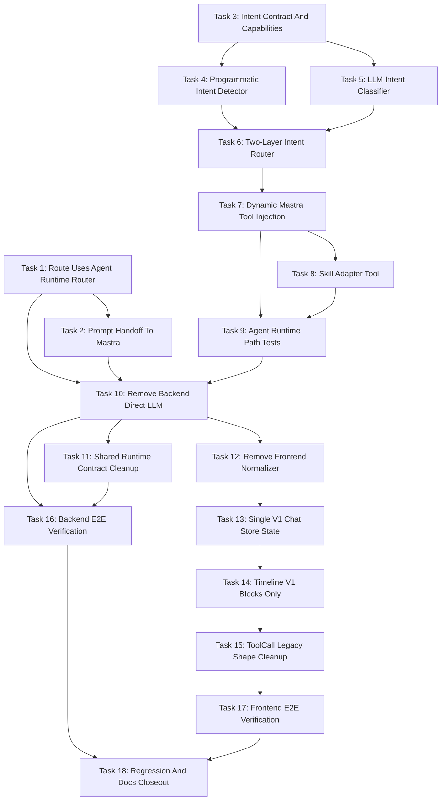

# Chat Agent Only Two-Layer Intent Routing Todo Tasks

> 面向 AI coding agent 的执行文档。请按任务顺序逐步实施，每个任务完成后都要让代码处于可测试、可回滚、可审查状态。不要把后端 agent-only、两层 intent、skills 接入和前端 legacy 清理合并成一个大改动。

## 总目标

将 chat 界面的请求统一收敛到 Mastra chat agent runtime。`chat.route.ts` 不再维护 chat direct LLM 分支和 fallback；agent runtime 内部先通过程序规则判断是否需要 tools/skills，程序规则不确定时再用 LLM classifier 做结构化 intent 判断。若最终不需要 tools/skills，Mastra agent 直接调用当前选中的 LLM model 回答。

前端继续使用现有 v1 `ResponseStreamEvent`、Timeline、group view、`ToolCallGroupCard` 和 `TimelineErrorBlock` 显示，不做视觉重设计。需要删除的是 legacy direct LLM 兼容路径，而不是 v1 timeline 渲染系统。

## 全局边界

- 不删除 provider-level `streamChat` 能力。
- 不删除 `createOllamaProvider`。
- 不删除 `LlmMessage`。
- 不重命名 Settings UI 文案。
- 不新增 agent marketplace、agent CRUD、team、workflow。
- 不让 frontend 感知 intent decision。
- 不让 LLM intent classifier 的文本进入 SSE timeline。
- 不破坏旧 persisted `direct-llm` trace 的读取兼容，除非另有显式迁移任务。

## Task 1: Connect Chat Route To Agent Runtime Router With Organized Prompt

### 功能目标

让 `chat.route.ts` 面向 Agent Runtime router，而不是直接依赖 Mastra adapter。route 必须把完整 organized prompt 传给 router，为后续删除 direct LLM branch 做准备。

### 功能列表

- 在 route 中构建 `buildChatContext` 和 `organizeChatPrompt` 的完整结果。
- 调用 `streamChatAgentRoute`，传入 `sessionId`、可选 `agentId`、`content`、`model`、`maxSteps`、`prompt`。
- route 保持 HTTP/SSE、session、message persistence、model selection 职责。
- router 负责选择 chat-capable agent，route 不直接 import `runChatAgentV1`。
- 如果当前仓库已完成 router contract，则本任务以接入和补测试为主。

### 涉及函数、接口、文件

- 修改 `src/server/routes/chat.route.ts`
  - `chatRouter.post('/stream', ...)`
  - `createAgentChatSource`
  - `streamMastraChat` 或替代后的 `streamAgentChat`
  - `getAgentRuntimeMaxSteps`
- 使用 `src/server/agent/runtime/chat-agent-router.ts`
  - `DEFAULT_CHAT_AGENT_ID`
  - `ChatAgentRouteInput`
  - `streamChatAgentRoute(input)`
  - `resolveChatAgentRoute(agentId?)`
- 修改 `src/server/routes/chat.route.test.ts`
- 使用 `src/server/prompts/types.ts`
  - `OrganizedChatPrompt`

### 不修改边界

- 不删除 `streamChatCompletion`。
- 不删除 direct fallback。
- 不修改 frontend。
- 不修改 provider 文件。
- 不修改 Settings UI 文案。

### 单元测试策略

- Mock `streamChatAgentRoute`。
- 断言 route 调用 router 时包含 `sessionId`、`content`、`model`、`maxSteps`。
- 断言 route 传入的 `prompt` 包含 system prompt、history、当前 user message。
- 断言 missing session、空 content 等原有错误路径保持不变。

### 集成测试策略

- 先不要求完整 agent-only 集成测试。
- 保留现有 route integration tests。
- 增加一个 focused route test 验证 agent path 能拿到 organized prompt。

### 用例测试策略

- 构造包含 persona、两条历史消息、active app、clipboard 的 session。
- 发送新用户消息。
- 断言 router mock 收到完整 `prompt`，而不是只收到最新 `content`。

### 验收 Checkpoint

- [ ] `chat.route.ts` 可以调用 `streamChatAgentRoute`。
- [ ] route 到 router 的参数包含 organized prompt。
- [ ] route 不再直接 import Mastra-specific adapter 作为主入口。
- [ ] focused route tests 通过。

### 关键验收证据

- `src/server/routes/chat.route.test.ts` 中有 prompt handoff assertion。
- `rg "runChatAgentV1" src/server/routes/chat.route.ts` 无主调用路径匹配。
- 测试输出显示 route context handoff 通过。

## Task 2: Pass Organized Prompt Into Mastra Agent Runtime

### 功能目标

确保 Mastra chat agent runtime 获得 direct LLM 曾经使用的同等上下文，包括 persona、history、active app、clipboard 和 current user message。

### 功能列表

- 扩展 agent runtime input，使 `prompt: OrganizedChatPrompt` 成为必填。
- 保留 `content` 作为 convenience field，但不再作为唯一 agent input。
- 增加 prompt composition helper，将 organized prompt 转成 Mastra agent 可消费的 instructions/messages/input。
- 继续使用 `resolveRuntimeModel({ consumer: 'agent', modality: 'text' })`。
- 保留 `LlmMessage` 类型。

### 涉及函数、接口、文件

- 修改 `src/server/agent/mastra/types.ts`
  - `ChatAgentRunInput`
  - `ChatAgentRuntimeEvent`
- 修改 `src/server/agent/mastra/chat-agent-runtime-adapter.ts`
  - `runChatAgentV1(input)`
  - `maybeStreamAgent(agent, input, maxSteps)`
  - 新增或补齐 `createAgentPromptInput(prompt, content)`
- 修改 `src/server/agent/mastra/chat-agent.ts`
  - `CreateChatAgentOptions`
  - `createChatAgent(model, options)`
- 修改 `src/server/agent/mastra/chat-agent-runtime-adapter.test.ts`

### 不修改边界

- 不新增第二套 prompt organization system。
- 不绕过 `buildChatContext` 或 `organizeChatPrompt`。
- 不删除 route direct LLM branch。
- 不改 tool/skill selection policy。
- 不删除 `LlmMessage`。

### 单元测试策略

- 测试 `ChatAgentRunInput.prompt` 为必填。
- Mock agent stream，断言 agent 收到 system/history/current user content。
- 测试 no-tool response 可生成 delta 和 done，且 `toolCalls: []`。
- 测试 model resolution 仍使用 agent consumer。

### 集成测试策略

- 暂不要求完整 route integration。
- Task 1 完成后可增加 route 到 adapter 的 prompt forwarding test。

### 用例测试策略

- 用户问 “What did I ask earlier?”。
- fake history 中包含早前问题。
- 断言 composed agent input 包含 history，而不是只包含当前问题。

### 验收 Checkpoint

- [ ] `ChatAgentRunInput` 包含必填 organized prompt。
- [ ] `runChatAgentV1` 消费 organized prompt。
- [ ] tests 证明 latest content 不是唯一 agent input。
- [ ] provider-level stream functions 未被删除。
- [ ] `LlmMessage` 仍可用。

### 关键验收证据

- Adapter unit tests 通过。
- Snapshot 或 assertion 显示 agent input 包含 system prompt、history 和 latest user content。
- Typecheck 显示 agent runtime calls 没有缺失 prompt。

## Task 3: Define Intent Contract And Capability Discovery

### 功能目标

建立两层 intent routing 的稳定类型和 capability 输入，让程序规则、LLM classifier、Mastra dynamic tool injection 和 tests 使用同一个 contract。

### 功能列表

- 定义 `ChatIntentMode`、`ChatIntentSource`、`ChatIntentInput`、`ChatIntentDecision`。
- 定义 `ToolCapability` 和 `SkillCapability`。
- 定义 capability 过滤规则：只暴露 installed/enabled/allowed 的 tools 和 skills。
- 提供 chat runtime 可用能力发现函数。
- 初期 tool capability 至少包含 `web_search`。
- skill capability 从 installed skills 读取，并处理 `params_schema`。

### 涉及函数、接口、文件

- 新增 `src/server/agent/runtime/intent/types.ts`
  - `ChatIntentMode`
  - `ChatIntentSource`
  - `ToolCapability`
  - `SkillCapability`
  - `ChatIntentInput`
  - `ChatIntentDecision`
- 新增 `src/server/agent/runtime/capabilities.ts`
  - `listChatToolCapabilities()`
  - `listChatSkillCapabilities()`
  - `resolveChatCapabilities()`
- 修改 `src/server/agent/index.ts` 导出必要 contract。
- 使用现有 `src/server/db/repositories/skill.repo.ts`
  - `skillRepo.listInstalled()`
  - `skillRepo.get(id)`
- 新增 tests：
  - `src/server/agent/runtime/intent/types.test.ts`
  - `src/server/agent/runtime/capabilities.test.ts`

### 不修改边界

- 不实现 intent 决策逻辑。
- 不调用 LLM。
- 不改 Mastra agent runtime。
- 不改 frontend。
- 不改变 skills 数据库结构。

### 单元测试策略

- 测试 `web_search` capability 默认可发现。
- 测试 installed skill 可转换为 enabled `SkillCapability`。
- 测试非法 `params_schema` 的 skill 不会作为 enabled capability 暴露，或会带 disabled reason。
- 测试 `answer_only` decision 必须没有 selected tools/skills 的 validation helper。

### 集成测试策略

- 使用 mocked `skillRepo.listInstalled()`，不依赖真实数据库。
- 如果已有 repository test harness，可覆盖 installed skill 到 capability 的转换。

### 用例测试策略

- 有一个 enabled `web_search`。
- 有一个 installed skill，包含 name、description、params schema。
- `resolveChatCapabilities()` 返回 tools 和 skills，后续 intent router 可直接消费。

### 验收 Checkpoint

- [ ] intent contract 文件存在。
- [ ] capability discovery 文件存在。
- [ ] `web_search` capability 可用。
- [ ] installed skills 可转换为 capability。
- [ ] contract 从 `src/server/agent/index.ts` 可导出。

### 关键验收证据

- capability unit tests 通过。
- Typecheck 证明 `ChatIntentInput.prompt` 依赖 `OrganizedChatPrompt`。
- `rg "ChatIntentDecision" src/server/agent` 能看到 contract 被测试或导出。

## Task 4: Implement Programmatic Intent Detector

### 功能目标

实现第一层确定性 intent 判断。它只处理高置信场景，避免每次 chat 都调用 LLM classifier。

### 功能列表

- 对明确 current/external/search 类需求选择 `web_search`。
- 对翻译、改写、解释、总结已提供内容等普通问答选择 `answer_only`。
- 对明确 skill id/name 的请求选择对应 skill。
- 对工具和 skill 同时明确的请求选择 `tool_and_skill`。
- 对模糊请求返回低置信 decision，交给 LLM classifier。
- 程序规则必须只选择 enabled capabilities。

### 涉及函数、接口、文件

- 新增 `src/server/agent/runtime/intent/programmatic-intent-detector.ts`
  - `PROGRAMMATIC_INTENT_CONFIDENCE_THRESHOLD`
  - `detectProgrammaticIntent(input: ChatIntentInput): ChatIntentDecision`
  - 可选 helper：`findExplicitToolSignals(content)`
  - 可选 helper：`findExplicitSkillSignals(content, availableSkills)`
- 新增 `src/server/agent/runtime/intent/programmatic-intent-detector.test.ts`
- 使用 `src/server/agent/runtime/intent/types.ts`

### 不修改边界

- 不调用 LLM。
- 不执行 tools/skills。
- 不改 route。
- 不改 Mastra agent。
- 不把 intent decision 暴露给 frontend。

### 单元测试策略

- “今天 OpenAI 有什么新闻？” 返回 `tool` + `web_search`，高置信。
- “查一下 React 19 最新文档” 返回 `tool` + `web_search`，高置信。
- “把这段话翻译成英文” 返回 `answer_only`，高置信。
- “总结我刚才问过什么” 返回 `answer_only`，高置信。
- “运行 skill xxx” 返回 `skill` + selected skill，高置信。
- “帮我处理这个任务” 返回低置信。

### 集成测试策略

- 暂不需要 route integration。
- 后续 Task 6 组合 intent router 时再做集成。

### 用例测试策略

- 构造 `availableTools` 为空时，即使命中搜索词也不能选择不存在的 tool。
- 构造 `availableSkills` 中只有 disabled skill 时，不能选择该 skill。

### 验收 Checkpoint

- [ ] 程序规则覆盖 no-tool、web search、explicit skill、low-confidence。
- [ ] 高置信阈值明确。
- [ ] 所有 selected tools/skills 都来自 enabled capability。
- [ ] tests 覆盖典型中文和英文关键词。

### 关键验收证据

- `programmatic-intent-detector.test.ts` 通过。
- 测试输出显示高置信路径不会依赖 LLM。
- 代码中有 capability filtering。

## Task 5: Implement LLM Intent Classifier

### 功能目标

实现第二层 intent 判断。仅当程序规则低置信时，使用 LLM 进行结构化 JSON 分类；它不是 chat direct LLM answer path。

### 功能列表

- 构建 intent classification prompt。
- 调用 low-level model/provider 能力获得 JSON。
- 使用 schema validation 校验输出。
- 过滤非法 tools/skills。
- 失败或非法输出时 fallback 到 safe `answer_only` decision。
- 确保 classifier 不输出用户可见正文，不持久化 assistant message。

### 涉及函数、接口、文件

- 新增 `src/server/agent/runtime/intent/llm-intent-classifier.ts`
  - `classifyIntentWithLlm(input, programmaticDecision?)`
  - `buildIntentClassificationPrompt(input, programmaticDecision?)`
  - `parseIntentClassifierOutput(raw, input)`
  - `createSafeAnswerOnlyDecision(reason)`
- 新增 `src/server/agent/runtime/intent/llm-intent-classifier.test.ts`
- 使用 `src/server/llm/types.ts`
  - `LlmMessage`
- 可复用 provider-level chat helper，但不得从 route 直接调用 classifier。

### 不修改边界

- 不恢复 route-level direct LLM answer。
- 不把 classifier 输出写入 SSE。
- 不持久化 classifier message。
- 不新增 provider 系统。
- 不改 frontend。

### 单元测试策略

- Mock low-level LLM 返回合法 JSON，断言 parsed decision 正确。
- Mock 非 JSON 输出，断言 fallback `answer_only`。
- Mock 选择未启用 tool，断言被过滤或 fallback。
- Mock 选择未知 skill，断言被过滤或 fallback。
- 测试 prompt 中明确 “JSON only” 和不回答用户问题。

### 集成测试策略

- 暂不使用真实 provider。
- 后续 Task 6 中通过 mocked classifier 验证低置信路径会调用 classifier。

### 用例测试策略

- 输入 “我需要你帮我整理这个项目资料，可能要用已有 skill”，程序规则低置信。
- LLM classifier 返回 `skill` + installed skill。
- 输出 decision 可被 dynamic runtime 使用。

### 验收 Checkpoint

- [ ] classifier 只返回 `ChatIntentDecision`。
- [ ] 输出经过 schema validation。
- [ ] 非法输出有 safe fallback。
- [ ] selected capabilities 二次过滤。
- [ ] classifier 没有 route-level 调用点。

### 关键验收证据

- classifier unit tests 通过。
- `rg "classifyIntentWithLlm" src/server/routes` 无匹配。
- 测试中非法 JSON 和非法 capability 均 fallback。

## Task 6: Implement Two-Layer Intent Router

### 功能目标

组合程序规则和 LLM classifier，形成 agent runtime 内部唯一 intent decision 入口。

### 功能列表

- 实现 `resolveChatIntent(input)`。
- 先调用 `detectProgrammaticIntent`。
- 高置信直接返回程序规则 decision。
- 低置信调用 `classifyIntentWithLlm`。
- 对最终 decision 做 normalization 和 capability filtering。
- classifier 异常时返回 safe `answer_only`。

### 涉及函数、接口、文件

- 新增 `src/server/agent/runtime/intent/chat-intent-router.ts`
  - `resolveChatIntent(input: ChatIntentInput): Promise<ChatIntentDecision>`
  - `normalizeIntentDecision(decision, input)`
  - `isHighConfidenceProgrammaticDecision(decision)`
- 新增 `src/server/agent/runtime/intent/chat-intent-router.test.ts`
- 修改 `src/server/agent/index.ts` 导出 intent router。

### 不修改边界

- 不执行 tools/skills。
- 不注入 Mastra tools。
- 不改 route。
- 不改 frontend。
- 不新增用户可见事件类型。

### 单元测试策略

- 高置信 programmatic decision 不调用 LLM classifier。
- 低置信 programmatic decision 调用 LLM classifier。
- LLM classifier 抛错时 fallback `answer_only`。
- LLM 返回 disabled/unknown capability 时被过滤。
- `answer_only` normalization 清空 selected tools/skills。

### 集成测试策略

- 使用 mocked programmatic detector 和 mocked classifier 做 router-level integration。
- 后续 Task 7 在 Mastra adapter 中集成真实 router。

### 用例测试策略

- 普通解释问题：直接 `answer_only`，不调用 classifier。
- 模糊任务请求：调用 classifier。
- 当前新闻问题：直接 `tool` + `web_search`。

### 验收 Checkpoint

- [ ] `resolveChatIntent` 存在。
- [ ] 两层判断顺序可测试。
- [ ] safe fallback 明确。
- [ ] final decision 不包含非法 selected capability。

### 关键验收证据

- `chat-intent-router.test.ts` 通过。
- Spy/assertion 证明高置信不调用 classifier。
- Spy/assertion 证明低置信调用 classifier。

## Task 7: Inject Intent Decision Into Mastra Runtime And Dynamic Tools

### 功能目标

让 Mastra agent 根据 intent decision 动态开放 tools/skills。`answer_only` 时不注入 tools/skills，agent 直接用当前 model 回答。

### 功能列表

- 在 adapter 内调用 `resolveChatCapabilities()` 和 `resolveChatIntent()`。
- 扩展 `CreateChatAgentOptions`，传入 `prompt`、`intent`、`enabledTools`、`enabledSkills`。
- `answer_only` 时 `tools: {}`。
- `tool` 时只注入 selected tools。
- `skill` 时只注入 selected skills。
- `tool_and_skill` 时同时注入 selected tools 和 selected skills。
- 保持 v1 runtime events 形状不变。

### 涉及函数、接口、文件

- 修改 `src/server/agent/mastra/chat-agent-runtime-adapter.ts`
  - `runChatAgentV1(input)`
  - `createDoneEvent(maxSteps)`
  - tool event tracking helpers
- 修改 `src/server/agent/mastra/chat-agent.ts`
  - `CreateChatAgentOptions`
  - `createChatAgent(model, options)`
- 修改 `src/server/agent/mastra/web-search-adapter.tool.ts`
  - 确认 `web_search` 可按 selected tool 注入。
- 使用 `src/server/agent/runtime/capabilities.ts`
- 使用 `src/server/agent/runtime/intent/chat-intent-router.ts`
- 修改 tests：
  - `src/server/agent/mastra/chat-agent.test.ts`
  - `src/server/agent/mastra/chat-agent-runtime-adapter.test.ts`

### 不修改边界

- 不新增 frontend intent UI。
- 不改 route SSE contract。
- 不绕过 existing web_search adapter。
- 不新增 permission 弹窗。
- 不删除 provider-level chat stream 能力。

### 单元测试策略

- `answer_only` decision 创建 agent 时 tools 为空。
- `tool` decision 只注入 `web_search`。
- selected tool 不在 capability 中时不注入。
- agent done trace 中可体现 `toolCalls: []` 或已有 tool traces。
- intent router 被调用一次，输入包含 prompt 和 capabilities。

### 集成测试策略

- 使用 fake agent factory 或 mocked Mastra `Agent`。
- 验证 no-tool、tool 两条 runtime path 都能产出 v1 events。

### 用例测试策略

- “解释 TypeScript union types”：无 tools，直接 answer。
- “今天 Node.js 有什么新闻？”：注入 `web_search`。
- tool 失败但 agent 可继续时，事件 mapper 能继续输出后续 content。

### 验收 Checkpoint

- [ ] adapter 内部有 intent decision。
- [ ] `answer_only` 时 agent tools 为空。
- [ ] `tool` 时只开放 selected tool。
- [ ] v1 event output 未改变。
- [ ] runtime tests 覆盖 no-tool 和 tool。

### 关键验收证据

- Mastra adapter tests 通过。
- 测试 assertion 显示 `createChatAgent` 收到 `intent`。
- 测试 assertion 显示 `answer_only` tools 为空。

## Task 8: Add Mastra Skill Adapter Tool

### 功能目标

把 BloomAI installed skills 包装成 Mastra tools，让 agent 可以在 intent decision 选择 skill 时调用它们，同时前端仍按普通 tool group 渲染。

### 功能列表

- 将每个 selected skill 暴露为 `skill:<skillId>` tool id。
- adapter 执行前确认 skill 仍 installed/enabled。
- adapter input 按 `paramsSchema` 做基础校验。
- adapter 内部调用 `runSkill(skill.id, input)`。
- skill output 保持 object，便于 trace 和 summary。
- skill error 抛给 Mastra，使 mapper 产生 tool failure。

### 涉及函数、接口、文件

- 新增 `src/server/agent/mastra/skill-adapter.tool.ts`
  - `createSkillAdapterTool(skill: SkillCapability)`
  - `createSkillAdapterTools(skills: SkillCapability[])`
  - `toSkillToolId(skillId: string)`
  - `fromSkillToolId(toolId: string)`
- 修改 `src/server/agent/mastra/chat-agent.ts`
  - 按 `enabledSkills` 注入 skill tools。
- 使用 `src/server/skills/run-skill.ts`
  - `runSkill(skillId, input)`
- 使用 `src/server/db/repositories/skill.repo.ts`
  - `skillRepo.get(id)`
- 新增 `src/server/agent/mastra/skill-adapter.tool.test.ts`

### 不修改边界

- 不新增 skill marketplace。
- 不修改 skills route。
- 不修改 skills 数据库 schema。
- 不新增 skill 专属 frontend UI。
- 不绕过 skill runner registry。

### 单元测试策略

- `toSkillToolId('abc')` 返回 `skill:abc`。
- valid input 调用 `runSkill(skill.id, input)`。
- skill 不存在或 disabled 时抛出明确错误。
- input schema 不匹配时不调用 `runSkill`。
- `createSkillAdapterTools` 只创建 selected enabled skills。

### 集成测试策略

- 使用 mocked `runSkill` 和 mocked `skillRepo.get`。
- 在 Task 9 中验证 skill tool events 可映射到 v1 tool blocks。

### 用例测试策略

- 用户明确要求运行某 installed skill。
- intent decision 选择该 skill。
- Mastra runtime 注入 `skill:<skillId>`。
- Timeline 显示普通 tool group，不需要新 UI。

### 验收 Checkpoint

- [ ] skill adapter 文件存在。
- [ ] selected skills 可转换为 Mastra tools。
- [ ] adapter 执行会调用 `runSkill`。
- [ ] adapter 有 input validation。
- [ ] skill tool id 使用 `skill:<skillId>`。

### 关键验收证据

- skill adapter unit tests 通过。
- `rg "skill:" src/server/agent/mastra` 显示统一 tool id 生成逻辑。
- 测试中 skill output 保持 object。

## Task 9: Verify Agent Runtime No-Tool, Tool, Skill, And Failure Paths

### 功能目标

在删除 direct LLM fallback 前，证明 agent runtime 可以覆盖 no-tool、web_search、skill 和 failure 场景。

### 功能列表

- 覆盖 `answer_only` agent 直接回答。
- 覆盖 `tool` agent 调用 `web_search` 后回答。
- 覆盖 `skill` agent 调用 `skill:<skillId>` 后回答。
- 覆盖 tool/skill failure 后事件输出。
- 覆盖 agent startup failure。
- 覆盖 prompt context preservation。

### 涉及函数、接口、文件

- 修改 `src/server/agent/mastra/chat-agent-runtime-adapter.test.ts`
- 修改 `src/server/agent/mastra/chat-agent.test.ts`
- 修改 `src/server/agent/mastra/mastra-event-mapper.test.ts`，如存在。
- 修改 `src/server/agent/runtime/intent/chat-intent-router.test.ts`
- 可新增 test helper：
  - fake organized prompt
  - fake runtime event collector
  - fake tool/skill capabilities

### 不修改边界

- 不删除 backend direct branch。
- 不改 frontend。
- 不使用真实 provider API key。
- 不做真实网络搜索。
- 不连接真实 external skill service。

### 单元测试策略

- Mock agent stream 输出 content deltas。
- Mock tool call start/result/failure chunks。
- Mock skill adapter result。
- Mock intent decisions。
- 断言 runtime events 顺序稳定。

### 集成测试策略

- 使用 adapter-level integration，不通过 HTTP route。
- 用 fake Mastra stream 模拟完整 lifecycle。

### 用例测试策略

- No-tool：`response_started -> content_delta -> response_completed`。
- Tool：`tool_call_started -> tool_call_completed -> content_delta -> response_completed`。
- Skill：`tool_call_started(toolId=skill:xxx) -> tool_call_completed -> content_delta`。
- Failure：`tool_call_failed` 或 `response_failed`，无 direct fallback answer。

### 验收 Checkpoint

- [ ] no-tool runtime path 通过。
- [ ] web_search runtime path 通过。
- [ ] skill runtime path 通过。
- [ ] failure path 通过。
- [ ] context preservation 被测试覆盖。

### 关键验收证据

- Agent runtime focused tests 通过。
- Event snapshots 显示 no-tool/tool/skill/failure 四类路径。
- Trace assertion 显示 toolCalls 正确记录。

## Task 10: Remove Backend Chat Direct LLM Branch And Fallback

### 功能目标

让 `chat.route.ts` 永远进入 Agent Runtime router。agent 失败应以 agent runtime failure 暴露，不再 fallback 到 direct LLM answer。

### 功能列表

- 删除 route-level feature flag 在 direct LLM 和 agent 之间切换的逻辑。
- 删除 `streamLegacyChat` 和 `createLegacyChatSource`。
- 删除 direct LLM fallback。
- 删除 “falling back to direct LLM” 相关日志。
- route 最终统一调用 `streamChatAgentRoute`。
- 停止从 chat route 发出新的 `runtime: 'direct-llm'`。

### 涉及函数、接口、文件

- 修改 `src/server/routes/chat.route.ts`
  - 删除 import `streamChatCompletion`
  - 删除 import `mapLlmStreamToResponseEvents`
  - 删除 `LegacyChatInput`
  - 删除 `createLegacyChatSource`
  - 删除 `streamLegacyChat`
  - 删除 `getAgentRuntimeEnabled`
  - 删除 `getAgentRuntimeProvider`
  - 删除 `shouldUseAgentRuntime`
  - 保留或重命名 `getAgentRuntimeMaxSteps`
  - 保留 `persistAssistantFromWriter`
  - 保留 `getTokenCount`
- 修改 `src/server/routes/chat.route.test.ts`
- 修改 `src/server/routes/chat-response-stream.ts`
- 修改 `src/server/routes/chat-response-stream.test.ts`

### 不修改边界

- 不删除 provider `streamChat`。
- 不删除 `createOllamaProvider`。
- 不删除 `LlmMessage`。
- 不修改 frontend。
- 不重命名 Settings UI 文案。
- 不删除 low-level provider tests。

### 单元测试策略

- 删除或重写 direct fallback expectations。
- 断言普通 chat 调用 `streamChatAgentRoute`。
- 断言 agent 输出前失败时发送 `response_failed`，不调用 direct LLM。
- 断言 route 不 import direct stream mapper。
- 断言 new trace runtime 为 `mastra-chat-agent-v1`。

### 集成测试策略

- POST chat stream，mock agent no-tool deltas 和 done。
- POST chat stream，mock agent failure。
- 解析 SSE event order。
- 检查 assistant message persistence。

### 用例测试策略

- 普通问题：“Explain TypeScript union types.” agent 直接回答。
- agent startup failure：用户只看到 failed response，不出现 fallback assistant answer。
- web_search answer：仍通过 agent runtime 发出 tool events。

### 验收 Checkpoint

- [ ] `chat.route.ts` 不再 import `streamChatCompletion`。
- [ ] `chat.route.ts` 不再 import `mapLlmStreamToResponseEvents`。
- [ ] `streamLegacyChat` 被删除。
- [ ] agent failure 不 fallback direct LLM。
- [ ] new chat traces 不发出 `direct-llm`。
- [ ] provider stream code 完整保留。

### 关键验收证据

- `rg "streamChatCompletion|mapLlmStreamToResponseEvents|streamLegacyChat|falling back to direct LLM" src/server/routes/chat.route.ts` 无匹配。
- route tests 覆盖 no-tool、tool、failure。
- persisted assistant trace 包含 `runtime: 'mastra-chat-agent-v1'`。

## Task 11: Update Shared Runtime Contract To Stop New Direct-LLM Emissions

### 功能目标

阻止新 chat response 使用 `runtime: 'direct-llm'`，同时按需保留旧 message trace parsing。

### 功能列表

- 明确 `direct-llm` 只作为 backward compatibility。
- writer 默认 runtime 改为 `mastra-chat-agent-v1` 或要求显式 runtime。
- 更新 active chat fixtures。
- 保留旧 persisted direct trace 的解析能力。
- 更新 schema tests，区分 active emission 和 old parsing。

### 涉及函数、接口、文件

- 修改 `src/shared/schemas/response.ts`
  - `ResponseRuntime`
  - `ResponseStreamEventSchema`
- 修改 `src/shared/schemas/message-trace.ts`
  - `parseMessageTrace`
- 修改 `src/server/routes/chat-response-stream.ts`
  - `createChatResponseStreamWriter`
- 修改 tests：
  - `src/shared/schemas/response.test.ts`
  - `src/shared/schemas/message-trace.test.ts`
  - `src/server/routes/chat-response-stream.test.ts`
  - `src/renderer/store/chat-response-reducer.test.ts`

### 不修改边界

- 不破坏旧 persisted message trace parsing。
- 不做数据库 migration。
- 不重命名 Settings UI。
- 不修改 provider model registry。
- 不修改 frontend rendering 逻辑。

### 单元测试策略

- 新 events 使用 `mastra-chat-agent-v1`。
- 旧 `direct-llm` saved trace 仍可解析。
- writer 不默认生成 direct runtime。
- reducer fixtures 不再使用 active direct runtime。

### 集成测试策略

- 与 Task 10 route integration 组合验证没有新的 direct runtime。
- 不需要真实 UI。

### 用例测试策略

- 老 conversation 带 direct trace，仍可加载。
- 新 conversation 从 route 到 writer 全程使用 agent runtime。

### 验收 Checkpoint

- [ ] 新 event fixtures 使用 agent runtime。
- [ ] backward compatibility 决策有测试覆盖。
- [ ] writer defaults 不生成 direct runtime。
- [ ] active production code 不发出 direct runtime。

### 关键验收证据

- Shared schema tests 通过。
- `rg "runtime: 'direct-llm'|runtime=direct-llm|direct-llm" src` 只在 backward-compat tests/docs 中出现。
- chat-response-stream tests 显示默认 runtime 非 direct。

## Task 12: Remove Frontend Legacy Chat Stream Normalizer

### 功能目标

让 renderer API 只消费后端 v1 `ResponseStreamEvent` SSE chunks，不再维护 legacy direct LLM stream normalizer。

### 功能列表

- 删除 `createChatStreamNormalizer` import 和 usage。
- 删除 legacy renderer chat stream event types。
- `platform.chatStream` 只 yield `ResponseStreamEvent`。
- malformed chunk 生成 v1 `response_failed`，不生成 legacy `error`。
- 删除 normalizer tests。

### 涉及函数、接口、文件

- 修改 `src/renderer/api/index.ts`
  - `platform.chatStream`
  - 删除 `ChatToolCallView`
  - 删除 `ChatToolCallStartEvent`
  - 删除 `ChatToolCallResultEvent`
  - 删除 `ChatToolCallErrorEvent`
  - 删除 legacy `ChatStreamEvent`
- 删除 `src/renderer/api/chat-stream-normalizer.ts`
- 删除 `src/renderer/api/chat-stream-normalizer.test.ts`
- 使用 `src/shared/schemas/response.ts`
  - `ResponseStreamEvent`
  - 可选 `ResponseStreamEventSchema`

### 不修改边界

- 除非编译需要，不修改 store state。
- 不修改 Timeline。
- 不修改 backend。
- 不新增 UI。
- 不重设计 error block。

### 单元测试策略

- API test 覆盖 v1 event pass-through。
- API test 覆盖 `[DONE]` stream end。
- malformed JSON 生成 `response_failed`。
- network abort 生成带 abort-like code 的 `response_failed`。

### 集成测试策略

- 使用 mocked fetch stream。
- 确认 `platform.chatStream` yield 与后端 v1 payload 一致。

### 用例测试策略

- 后端发送 `response_started`、`content_block_started`、`content_delta`、`response_completed`。
- renderer API 原样 yield 这些 events。

### 验收 Checkpoint

- [ ] `createChatStreamNormalizer` import 被移除。
- [ ] `chat-stream-normalizer.ts` 被删除。
- [ ] legacy chat event types 从 renderer API 移除。
- [ ] API tests 覆盖 v1-only stream parsing。

### 关键验收证据

- `rg "createChatStreamNormalizer|LegacyChatStreamEvent|ChatToolCallStartEvent|ChatToolCallResultEvent|ChatToolCallErrorEvent" src/renderer` 无 production 匹配。
- Renderer API stream tests 通过。

## Task 13: Simplify Chat Store To Single V1 Streaming Response State

### 功能目标

从 Zustand chat store 移除 direct/legacy streaming state，让 `streamingResponsesBySession` 成为 active assistant response 的唯一事实来源。

### 功能列表

- 移除 `streamingText` state。
- 如果错误完全由 v1 error block 渲染，移除 `streamError` state。
- 移除 `toolCallsBySession` state。
- 移除 `clearStreamingToolCalls`。
- 继续使用 `reduceStreamingResponse`。
- 可保留 `deriveStreamingText` 和 `deriveToolCalls` 作为 selector 或测试辅助。

### 涉及函数、接口、文件

- 修改 `src/renderer/store/index.ts`
  - `ChatState`
  - `ChatActions`
  - `sendMessage`
  - `clearMessages`
  - 删除 `clearStreamingToolCalls`
  - 可删除 `setStreamError`
- 修改 `src/renderer/store/index.test.ts`
- 保留 `src/renderer/store/chat-response-reducer.ts`
  - `reduceStreamingResponse`
  - `deriveStreamingText`
  - `deriveToolCalls`

### 不修改边界

- 不修改 backend。
- 不修改 Timeline visual layout。
- 不删除 v1 reducer。
- 不删除 group view 需要的 block 数据。
- 不改变 persisted messages 加载语义。

### 单元测试策略

- `sendMessage` 接收 v1 deltas 后更新 `streamingResponsesBySession`。
- `response_completed` 后 assistant message 正常保存，active streaming response 清理或归档行为保持原设计。
- `response_failed` 后 store 中存在 error block。
- tool call events reduce 成 tool blocks。
- 旧 `streamingText` 相关 assertions 被移除。

### 集成测试策略

- 使用 mocked `platform.chatStream` yield v1 event sequence。
- 测试 no-tool、tool、failure 三种 store flow。

### 用例测试策略

- No-tool answer：active response blocks 包含 markdown block。
- Tool answer：active response blocks 包含 tool group 和 answer block。
- Failure：active response blocks 包含 error block。

### 验收 Checkpoint

- [ ] `streamingText` 从 `ChatState` 移除。
- [ ] `toolCallsBySession` 从 `ChatState` 移除。
- [ ] `clearStreamingToolCalls` 被移除。
- [ ] Store tests 使用 v1 response blocks。
- [ ] message reload behavior 正常。

### 关键验收证据

- `rg "streamingText|toolCallsBySession|clearStreamingToolCalls" src/renderer/store src/renderer/pages/Chat` 无 production legacy state 匹配；允许保留 selector 名称时需在测试中说明。
- Store tests 通过。

## Task 14: Simplify Timeline To V1 Blocks And Preserve Group View

### 功能目标

移除 Timeline 中 direct/legacy fallback rendering，只从 v1 response blocks 渲染 active assistant output，同时保留现有 group view、wait state 和 error block 样式。

### 功能列表

- 从 `TimelineProps` 移除 `streamingText`、`streamError`、legacy `toolCalls`。
- 移除独立 streaming bubble fallback branch。
- 保留 `renderStreamingResponse`。
- 保留 `TimelineWaitState`。
- 保留 `TimelineErrorBlock`。
- 保留 grouped tool call rendering。
- `ChatPanel` 只传入 `streamingResponse` 和 `isStreaming` 等 v1 所需 props。

### 涉及函数、接口、文件

- 修改 `src/renderer/pages/Chat/Timeline.tsx`
  - `TimelineProps`
  - `shouldShowStreamingBubble`
  - `Timeline`
  - `renderStreamingResponse`
  - `groupStreamingBlocks`
  - `renderStreamingItem`
  - `TimelineErrorBlock`
- 修改 `src/renderer/pages/Chat/ChatPanel.tsx`
- 修改 tests：
  - `src/renderer/pages/Chat/Timeline.test.tsx`
  - `src/renderer/pages/Chat/ChatPanel.test.tsx`

### 不修改边界

- 不删除 `MessageBubble`。
- 不删除 `ToolCallGroupCard`。
- 不删除 group view CSS。
- 不修改 backend event shape。
- 不做视觉 redesign。

### 单元测试策略

- Timeline 渲染 empty state。
- Timeline 渲染 historical messages。
- Timeline 渲染 active markdown block。
- Timeline 渲染 grouped tool blocks。
- `response_started` 后且没有 content block 时渲染 wait state。
- `response_failed` 时渲染 error block。
- 删除 legacy fallback text 的测试。

### 集成测试策略

- 使用完整 `StreamingResponseState` 做 component-level render。
- 不要求 browser E2E。

### 用例测试策略

- No-tool agent answer：出现 assistant markdown bubble。
- Tool answer：出现 tool group 和 assistant answer。
- Agent failure：出现 `TimelineErrorBlock`。

### 验收 Checkpoint

- [ ] `TimelineProps` 不再包含 legacy stream props。
- [ ] `ChatPanel` 只传 v1 active response。
- [ ] legacy fallback branch 被移除。
- [ ] Timeline tests 覆盖 v1 states。
- [ ] group view 样式未被删除。

### 关键验收证据

- `rg "shouldShowStreamingBubble|streamingText|streamError|toolCalls=" src/renderer/pages/Chat` 不再显示 production legacy branch。
- Timeline 和 ChatPanel tests 通过。

## Task 15: Remove Legacy ToolCallCard Shape And Prune CSS Safely

### 功能目标

确保 tool UI 只接收 v1 `ToolCallBlock` 数据。根据实际使用保留或删除 `ToolCallCard`，但必须删除 legacy data compatibility。

### 功能列表

- 移除 `LegacyToolCallData`。
- 如果保留 `ToolCallCard`，将其输入改为 `ToolCallBlock`。
- 更新 `ToolCallCard` tests 使用 v1 block。
- 保留 `ToolCallGroupCard` 作为首选 grouped tool UI。
- 只删除已确认无使用的 legacy CSS。
- 保留 group view 相关 CSS。

### 涉及函数、接口、文件

- 修改或删除 `src/renderer/pages/Chat/ToolCallCard.tsx`
  - `LegacyToolCallData`
  - `ToolCallData`
  - `normalizeToolCall`
- 修改或删除 `src/renderer/pages/Chat/ToolCallCard.test.tsx`
- 保留 `src/renderer/pages/Chat/ToolCallGroupCard.tsx`
- 修改 `src/renderer/styles/global.css`
  - `.stream-error`
  - `.tool-call-card`
  - `.tcc-*`
  - group view classes

### 不修改边界

- 不移除 grouped tool call UI。
- 不从 reducer 移除 v1 tool block support。
- 不修改 backend event shape。
- 不删除仍被 mounted components 使用的 CSS。
- 不改变 timeline layout。

### 单元测试策略

- 如果保留 `ToolCallCard`：
  - running block 可渲染。
  - success block 可渲染 output summary/results。
  - error block 可渲染 `ResponseError`。
  - 不再传 legacy string error shape。
- 如果删除 `ToolCallCard`：
  - Timeline tests 断言 grouped card 覆盖 single tool call。

### 集成测试策略

- Component render tests 足够。
- 不需要 backend integration。

### 用例测试策略

- Web search tool call 带 output results 时可渲染。
- Failed tool call 带 `ResponseError` 时可渲染。
- Skill tool call `skill:<skillId>` 在 group card 中显示为普通 tool call。

### 验收 Checkpoint

- [ ] `LegacyToolCallData` 被移除。
- [ ] Tool UI tests 使用 `ToolCallBlock`。
- [ ] CSS 裁剪与实际组件使用匹配。
- [ ] production renderer code 不再有 legacy tool call shape。

### 关键验收证据

- `rg "LegacyToolCallData|ToolCallData = ToolCallBlock \\|" src/renderer` 无 legacy shape 匹配。
- ToolCallCard 或 ToolCallGroupCard tests 通过。
- `rg "\\.tcc-|\\.tool-call-card|\\.stream-error" src/renderer` 与实际保留组件一致。

## Task 16: Backend End-To-End Verification For Agent-Only Intent Routing

### 功能目标

证明后端 chat 在 agent-only、two-layer intent、no-tool/tool/skill/failure/context/persistence 场景下完整可用，且没有 direct fallback。

### 功能列表

- 覆盖 no-tool agent answer。
- 覆盖 programmatic high-confidence web_search。
- 覆盖 programmatic low-confidence 进入 LLM classifier。
- 覆盖 skill intent 和 skill adapter。
- 覆盖 classifier failure fallback 到 safe answer_only。
- 覆盖 agent startup failure。
- 覆盖 tool/skill failure。
- 覆盖 assistant message persistence 和 trace。

### 涉及函数、接口、文件

- 修改 `src/server/routes/chat.route.test.ts`
- 修改 `src/server/routes/chat-response-stream.test.ts`
- 修改 `src/server/agent/mastra/chat-agent-runtime-adapter.test.ts`
- 修改 `src/server/agent/runtime/intent/chat-intent-router.test.ts`
- 可新增 backend integration test helper：
  - SSE parser
  - fake organized prompt
  - fake tool/skill capabilities

### 不修改边界

- 不新增 live provider network calls。
- 不要求真实 Mastra provider credentials。
- 不测试 frontend。
- 不恢复 direct LLM fallback。
- 不删除 provider stream tests。

### 单元测试策略

- 使用 mocked runtime events 覆盖 route behavior。
- 使用 mocked intent router 覆盖 high-confidence 和 low-confidence。
- 使用 mocked classifier 覆盖 failure fallback。

### 集成测试策略

- POST `/api/v1/chat/stream`。
- 解析 SSE chunks 并断言 event order。
- 检查 test database 或 mocked repository 中 persisted assistant message。
- 断言 `streamChatCompletion` 不存在调用点，或 mock 未被调用。

### 用例测试策略

- 普通 prompt：返回 markdown answer，trace `toolCalls: []`。
- Search prompt：返回 tool events 和 answer events，trace 有 `web_search`。
- Skill prompt：返回 `toolId: skill:<skillId>` 的 tool events。
- Failure：返回 `response_failed`，不跟 direct answer。

### 验收 Checkpoint

- [ ] Backend route tests 覆盖 no-tool。
- [ ] Backend route tests 覆盖 web_search。
- [ ] Backend route tests 覆盖 skill。
- [ ] Backend route tests 覆盖 classifier fallback。
- [ ] Backend route tests 覆盖 failure without fallback。
- [ ] Persistence assertions 使用 agent trace。

### 关键验收证据

- 命令通过：`node node_modules/vitest/vitest.mjs run src/server/routes/chat.route.test.ts src/server/routes/chat-response-stream.test.ts src/server/agent/mastra src/server/agent/runtime/intent`
- SSE event snapshot 显示 `runtime: 'mastra-chat-agent-v1'`。
- Test DB 或 mocked repo 中 assistant trace 包含 agent runtime 和 tool call trace。

## Task 17: Frontend End-To-End Verification For V1-Only Timeline

### 功能目标

证明 frontend API、store、Timeline 能正确渲染 agent-only v1 response streams，且不依赖 legacy direct LLM UI state。

### 功能列表

- 验证 API stream yield v1 events。
- 验证 store 将 v1 events reduce 为 response blocks。
- 验证 Timeline 渲染 markdown、tool groups、wait state、errors。
- 验证 skill tool call 作为普通 grouped tool call 显示。
- 验证没有使用 legacy direct stream branch。

### 涉及函数、接口、文件

- 修改 tests：
  - `src/renderer/api/index.test.ts`，如不存在则新增 focused test。
  - `src/renderer/store/index.test.ts`
  - `src/renderer/store/chat-response-reducer.test.ts`
  - `src/renderer/pages/Chat/Timeline.test.tsx`
  - `src/renderer/pages/Chat/ChatPanel.test.tsx`
  - `src/renderer/pages/Chat/ToolCallGroupCard.test.tsx`

### 不修改边界

- 不修改 backend。
- 不做视觉 redesign。
- 不重命名 Settings UI。
- 不新增 frontend intent indicator。
- 不新增 skill 专属 UI。

### 单元测试策略

- API test：v1 SSE chunks pass through。
- Store test：v1 events 正确构建 response blocks。
- Timeline test：v1 response 渲染 markdown、tool group、error block。
- Tool group test：running/success/error/interrupted statuses 可渲染。

### 集成测试策略

- 使用 mocked store/platform 做 component-level integration。
- 只有在 dev server 已存在时可选 browser smoke test，本任务不强制。

### 用例测试策略

- No-tool agent answer 渲染一个 assistant bubble。
- Web search answer 渲染 tool group + assistant bubble。
- Skill answer 渲染 `skill:<skillId>` tool group + assistant bubble。
- Agent error 渲染 timeline error block。

### 验收 Checkpoint

- [ ] Frontend tests 不依赖 `streamingText`。
- [ ] Frontend tests 不依赖 `toolCallsBySession`。
- [ ] Timeline 从 `streamingResponse.blocks` 渲染。
- [ ] Agent error 通过 `TimelineErrorBlock` 出现。
- [ ] group view 样式和格式保持。

### 关键验收证据

- 命令通过：`node node_modules/vitest/vitest.mjs run src/renderer/api src/renderer/store src/renderer/pages/Chat`
- `rg "createChatStreamNormalizer|LegacyChatStreamEvent|streamingText|toolCallsBySession" src/renderer` 无 production legacy usage。
- Component snapshots 或 assertions 显示 tool group/error block 正常。

## Task 18: Full Regression And Documentation Closeout

### 功能目标

完成全链路回归，并把最终实现行为记录到文档中，避免未来重新引入第二套 chat runtime。

### 功能列表

- 运行 focused backend tests。
- 运行 focused frontend tests。
- 运行 shared schema tests。
- 运行 typecheck/build。
- 根据实际实现更新设计文档或 verification 文档。
- 记录旧 `direct-llm` trace compatibility 决策。
- 给出 `rg` 证据，证明 active chat direct LLM path 已移除。

### 涉及函数、接口、文件

- 可修改 docs：
  - `docs/agent/chat-agent-only-two-layer-intent-routing-design.md`
  - `docs/agent/chat-agent-only-two-layer-intent-routing-todo-tasks.md`
  - 可新增 verification doc
- 除非修复 verification failures，本任务不应修改 production files。

### 不修改边界

- 不新增功能。
- 不扩展 agent marketplace。
- 不重命名 Settings UI。
- 不删除 provider stream capabilities。
- 不删除 `LlmMessage`。

### 单元测试策略

- 运行所有 changed test files。
- 运行 shared schema tests。
- 对因 cleanup 删除的 tests 做确认，避免遗留引用。

### 集成测试策略

- 运行 route integration tests。
- 运行 renderer component/store/API tests。
- 运行 build/typecheck。

### 用例测试策略

- 普通 prompt：agent 不调用 tool，直接回答。
- Search prompt：programmatic intent 调用 web_search。
- Skill prompt：agent 调用 `skill:<skillId>`。
- Classifier failure：fallback 到 answer_only。
- Agent failure：显示 failed response，不出现 fallback answer。
- 旧 direct trace：如果保留兼容，旧消息仍能加载。

### 验收 Checkpoint

- [ ] Focused backend tests 通过。
- [ ] Focused frontend tests 通过。
- [ ] Shared schema tests 通过。
- [ ] Typecheck 通过。
- [ ] Build 通过。
- [ ] Docs 反映最终 implementation choices。
- [ ] 没有新的 chat direct LLM route 残留。

### 关键验收证据

- Test command outputs。
- Typecheck/build output。
- `rg` evidence：
  - production 中没有 `streamLegacyChat`。
  - production 中没有 `createChatStreamNormalizer`。
  - active runtime code 不发出新的 `direct-llm`。
- 可选 SSE logs 或 component assertions 显示 no-tool、tool、skill、failure 行为。

## 任务依赖和可并行任务

### 依赖关系

- Task 1 必须先于 Task 2 和 Task 10。
- Task 2 必须先于 Task 10，因为删除 direct LLM 前必须确保 agent 拿到完整 prompt context。
- Task 3 是 Task 4、Task 5、Task 6、Task 7、Task 8 的基础 contract。
- Task 4 和 Task 5 可在 Task 3 后并行。
- Task 6 依赖 Task 4 和 Task 5。
- Task 7 依赖 Task 6。
- Task 8 依赖 Task 7。
- Task 9 依赖 Task 7 和 Task 8。
- Task 10 依赖 Task 1、Task 2、Task 9。
- Task 11 依赖 Task 10。
- Task 12 依赖 Task 10，因为 frontend v1-only cleanup 假设 backend 只发 v1 events。
- Task 13 依赖 Task 12。
- Task 14 依赖 Task 13。
- Task 15 依赖 Task 14。
- Task 16 依赖 Task 10、Task 11。
- Task 17 依赖 Task 12、Task 13、Task 14、Task 15。
- Task 18 依赖 Task 16 和 Task 17。

### 可并行任务

- Task 4 和 Task 5 可并行：一个做程序规则，一个做 LLM classifier。
- Task 8 的 skill adapter 可在 Task 7 dynamic injection 开始后并行开发，但最终集成依赖 Task 7 的 options contract。
- Task 11 shared runtime cleanup 可在 Task 10 后与 Task 12 frontend API cleanup 并行。
- Task 16 backend verification 和 Task 17 frontend verification 可在各自前置完成后并行。
- 文档 closeout 的资料收集可在 Task 16、Task 17 执行时并行，但 Task 18 必须最后完成。

## Mermaid 任务依赖图

## 阶段 Checkpoint 和推荐实施顺序

### Phase 1: Backend Route And Prompt Foundation

推荐任务：

1. Task 1: Connect Chat Route To Agent Runtime Router With Organized Prompt
2. Task 2: Pass Organized Prompt Into Mastra Agent Runtime

Checkpoint：

- [ ] route 能调用 Agent Runtime router。
- [ ] agent runtime 接收 organized prompt。
- [ ] prompt 包含 persona、history、active app、clipboard、current user message。
- [ ] focused backend tests 通过。

### Phase 2: Two-Layer Intent Foundation

推荐任务：

1. Task 3: Define Intent Contract And Capability Discovery
2. Task 4: Implement Programmatic Intent Detector
3. Task 5: Implement LLM Intent Classifier
4. Task 6: Implement Two-Layer Intent Router

Checkpoint：

- [ ] intent contract 稳定。
- [ ] capabilities 可发现并过滤。
- [ ] 程序高置信路径不调用 LLM。
- [ ] 低置信路径调用 classifier。
- [ ] classifier failure fallback 到 safe answer_only。

### Phase 3: Dynamic Agent Runtime

推荐任务：

1. Task 7: Inject Intent Decision Into Mastra Runtime And Dynamic Tools
2. Task 8: Add Mastra Skill Adapter Tool
3. Task 9: Verify Agent Runtime No-Tool, Tool, Skill, And Failure Paths

Checkpoint：

- [ ] `answer_only` 时 agent tools 为空。
- [ ] `tool` 时只注入 selected tools。
- [ ] `skill` 时只注入 selected skills。
- [ ] no-tool、web_search、skill、failure runtime tests 通过。

### Phase 4: Remove Backend Direct LLM

推荐任务：

1. Task 10: Remove Backend Chat Direct LLM Branch And Fallback
2. Task 11: Update Shared Runtime Contract To Stop New Direct-LLM Emissions
3. Task 16: Backend End-To-End Verification For Agent-Only Intent Routing

Checkpoint：

- [ ] `chat.route.ts` 不再 import direct LLM stream helper。
- [ ] agent failure 不 fallback。
- [ ] new traces 使用 `mastra-chat-agent-v1`。
- [ ] backend E2E tests 覆盖 no-tool、tool、skill、failure。

### Phase 5: Frontend V1-Only Cleanup

推荐任务：

1. Task 12: Remove Frontend Legacy Chat Stream Normalizer
2. Task 13: Simplify Chat Store To Single V1 Streaming Response State
3. Task 14: Simplify Timeline To V1 Blocks And Preserve Group View
4. Task 15: Remove Legacy ToolCallCard Shape And Prune CSS Safely
5. Task 17: Frontend End-To-End Verification For V1-Only Timeline

Checkpoint：

- [ ] frontend 不再 import legacy normalizer。
- [ ] store 只使用 v1 streaming response state。
- [ ] Timeline 只渲染 v1 response blocks。
- [ ] group view 和 error block 样式保持。
- [ ] frontend E2E/component tests 通过。

### Phase 6: Regression And Closeout

推荐任务：

1. Task 18: Full Regression And Documentation Closeout

Checkpoint：

- [ ] backend focused tests 通过。
- [ ] frontend focused tests 通过。
- [ ] shared schema tests 通过。
- [ ] typecheck/build 通过。
- [ ] docs 记录最终行为和 compatibility 决策。
- [ ] `rg` 证据显示 active chat direct LLM path 已移除。
