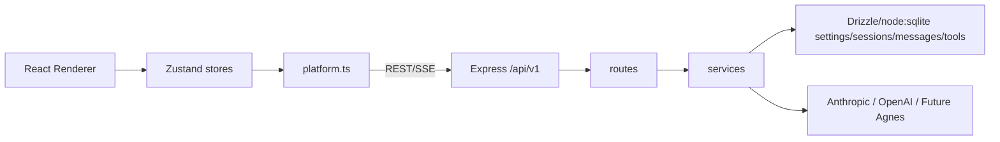

# Agnes 文本与图片模型接入实现方案

> 分析日期：2026-06-23  
> 范围：在 `Settings -> Models` 增加 Agnes 大模型，接入 Agnes 文本模型与图片生成模型，使前端 chat 可选择并使用 Agnes 文本模型，图片生成工具可使用 Agnes 图片模型。  
> 本文只记录实现方案，不修改业务代码。

## 1. 目标与边界

### 目标

1. 在 Settings 的 Models 页展示新的 Agnes 文本模型。
2. 保存 Agnes API Key 后，chat 页面模型下拉可选择 Agnes 文本模型并正常流式对话。
3. 图片生成工具支持使用 Agnes 图片生成模型。
4. UI 沿用现有 Settings、Chat、Tools 的轻量列表/卡片风格，不新增独立大页面。

### 本轮不做

1. 不接入 `Agnes-Video-V2.0`。当前用户需求只包含文本模型和图片生成模型，视频 API 是异步任务型接口，应该另起独立工具或工作流。
2. 不改数据库表结构。现有 `settings(key,value)` 已可保存 `agnes_api_key`、`image_generation_provider` 等键值。
3. 不实现多模态 chat 图片 URL 输入。Agnes 文本文档支持图片 URL，但当前 chat 输入栏只传文本；本轮只保证文本 chat 可用。
4. 不改 Skills 的 `prompt-template` 默认模型。它当前固定走 Anthropic Haiku，属于后续统一 ModelRouter 后再处理的范围。

## 2. 当前程序架构骨架

当前 BloomAI 是 Electron + React Renderer + 本地 Express API + Drizzle node:sqlite 本地数据库：



与 Agnes 接入直接相关的链路有两条：

1. 文本 chat 链路：`ChatPanel` 选择 session model -> `useChatStore.sendMessage` -> `platform.chatStream` -> `POST /api/v1/chat/stream` -> 后端调用模型并通过 SSE 返回 delta。
2. 图片生成链路：Tools 页面或 chat 工具调用 -> `/api/v1/tools/:id/run` -> `executeTool` -> `imageGen` -> 当前固定调用 OpenAI Images API。

## 3. Agnes API 依据

项目已有 Agnes API 文档：

1. `docs/agnes/agnes-Agnes-2.0-Flash-API-docs.md`
   - 文本模型：`agnes-2.0-flash`
   - Endpoint：`https://apihub.agnes-ai.com/v1/chat/completions`
   - 协议：OpenAI-compatible Chat Completions
   - 鉴权：`Authorization: Bearer <API_KEY>`
   - 支持 `stream: true`

2. `docs/agnes/agnes-Agnes-Image-2.1-Flash-API-docs.md`
   - 图片模型：`agnes-image-2.1-flash`
   - Endpoint：`https://apihub.agnes-ai.com/v1/images/generations`
   - 协议：OpenAI-compatible Images Generations，但有 Agnes 特定参数
   - URL 输出应使用 `extra_body.response_format: "url"`
   - Base64 输出可使用 `return_base64: true` 或 `extra_body.response_format: "b64_json"`

3. `docs/agnes/agnes-Agnes-Video-V2.0-API-docs.md`
   - 本轮不接入。原因：视频接口是异步创建任务 + 轮询结果，和现有同步 `image_gen` 工具模型不同。

## 4. 推荐实现方案

推荐采用“小型 Provider 分发层”，而不是继续在 route 或 tool 函数里直接写死供应商 SDK/API。

### 4.1 文本模型 Provider

新增 `src/server/services/model-provider.service.ts`，提供统一流式文本接口：

```ts
export type ChatProviderMessage = {
  role: 'user' | 'assistant'
  content: string
}

export type ChatStreamRequest = {
  model: string
  system: string
  messages: ChatProviderMessage[]
}

export type ChatStreamDelta =
  | { type: 'delta'; text: string }
  | { type: 'usage'; input: number; output: number }

export async function* streamChatCompletion(
  request: ChatStreamRequest
): AsyncGenerator<ChatStreamDelta>
```

内部按 model id 识别 provider：

```ts
const AGNES_CHAT_MODELS = new Set(['agnes-2.0-flash'])
const OPENAI_CHAT_MODELS = new Set(['gpt-4o', 'gpt-4o-mini'])

function getChatProvider(model: string): 'anthropic' | 'agnes' | 'openai' {
  if (AGNES_CHAT_MODELS.has(model)) return 'agnes'
  if (OPENAI_CHAT_MODELS.has(model)) return 'openai'
  return 'anthropic'
}
```

本轮真正必须实现的是 Anthropic 与 Agnes；OpenAI chat 目前 UI 已列出但后端其实不能用，是否顺手补上可作为可选修复。为降低范围，建议先保留 OpenAI 为后续任务，只避免 Agnes 继续扩大 `chat.route.ts`。

### 4.2 Agnes 文本流式函数

主要函数：

```ts
async function* streamAgnesChat(request: ChatStreamRequest): AsyncGenerator<ChatStreamDelta>
```

职责：

1. 从 settings 读取 `agnes_api_key`，兜底 `process.env.AGNES_API_KEY`。
2. 请求 `https://apihub.agnes-ai.com/v1/chat/completions`。
3. 请求体使用 OpenAI-compatible 格式：

```json
{
  "model": "agnes-2.0-flash",
  "messages": [
    { "role": "system", "content": "..." },
    { "role": "user", "content": "..." }
  ],
  "max_tokens": 4096,
  "stream": true
}
```

4. 解析 SSE：
   - `data: [DONE]` 结束。
   - `choices[0].delta.content` 转成 `{ type: 'delta', text }`。
   - 如果响应体最后包含 usage，则转成 `{ type: 'usage', input, output }`；若 Agnes 流式不返回 usage，则 token 计数允许为 0。

### 4.3 `chat.route.ts` 调整

现状：`chat.route.ts` 直接 import `@anthropic-ai/sdk` 并实例化 `client.messages.stream`。

调整后：

1. 保留 route 层现有职责：
   - SSE 初始化。
   - 校验 `sessionId`、`content`。
   - 读取 session/persona/history。
   - 拼接 system prompt。
   - 保存 user/assistant message。
   - 回写 session title 和 token usage。
2. 删除 route 层对 Anthropic SDK 的直接依赖。
3. 调用：

```ts
const selectedModel = persona?.model_override || session.model || 'claude-3-5-sonnet-20241022'
for await (const event of streamChatCompletion({ model: selectedModel, system, messages })) {
  if (event.type === 'delta') {
    fullText += event.text
    sendSSE(res, { type: 'delta', text: event.text })
  }
  if (event.type === 'usage') {
    inTok = event.input
    outTok = event.output
  }
}
```

这样 chat route 不再关心是 Anthropic 还是 Agnes。

### 4.4 图片生成 Provider

新增 `src/server/services/image-provider.service.ts`：

```ts
export type ImageGenerationInput = {
  provider?: 'openai' | 'agnes'
  prompt: string
  size?: string
  quality?: string
  saveTo?: string
  image?: string | string[]
  responseFormat?: 'url' | 'b64_json'
}

export type ImageGenerationResult = {
  url?: string
  b64_json?: string
  localPath?: string
  provider: 'openai' | 'agnes'
  model: string
}

export async function generateImage(input: ImageGenerationInput): Promise<ImageGenerationResult>
```

Provider 选择规则：

1. 如果工具输入显式传 `provider`，优先使用输入。
2. 否则读取 settings 中的 `image_generation_provider`。
3. 兜底使用 `openai`，保持现有行为不变。

Agnes 图片请求：

```json
{
  "model": "agnes-image-2.1-flash",
  "prompt": "...",
  "size": "1024x768",
  "extra_body": {
    "response_format": "url"
  }
}
```

如果是图生图，则把 `image` 放进 `extra_body.image`。这符合现有 Agnes 图片文档中“不要把 response_format 放在顶层”的要求。

### 4.5 `tool.service.ts` 调整

现状：`imageGen` 函数固定读取 `openai_api_key` 并调用 `https://api.openai.com/v1/images/generations`。

调整后：

1. `imageGen(input)` 只做 tool input 到 provider input 的适配。
2. 调用 `generateImage(input)`。
3. 保存文件逻辑可下沉到 `image-provider.service.ts`，或保留在 `tool.service.ts`。推荐下沉，让 Agnes/OpenAI 都能复用 `saveTo`。
4. `tools` seed 中 `image_gen` 的 schema 增加可选字段：

```json
{
  "provider": { "type": "string", "enum": ["openai", "agnes"], "default": "openai" },
  "prompt": { "type": "string" },
  "size": { "type": "string", "default": "1024x1024" },
  "quality": { "type": "string", "default": "standard" },
  "image": { "type": "array" },
  "responseFormat": { "type": "string", "enum": ["url", "b64_json"], "default": "url" },
  "saveTo": { "type": "string" }
}
```

注意：现有 seed 使用 `INSERT OR IGNORE`，已安装用户不会自动更新内置工具 schema。如果需要老用户也看到新 schema，需要增加一次 seed update 或手动 `UPDATE tools SET params_schema=... WHERE id='image_gen' AND is_builtin=1`。

## 5. 需要修改或新增的文件

### 新增文件

1. `src/server/services/model-provider.service.ts`
   - 统一文本模型路由。
   - 实现 `streamAnthropicChat`、`streamAgnesChat`。
   - 对外暴露 `streamChatCompletion`。

2. `src/server/services/image-provider.service.ts`
   - 统一图片生成 provider。
   - 实现 `generateOpenAIImage`、`generateAgnesImage`。
   - 统一处理 `saveTo`、URL/Base64 返回、错误格式。

3. 可选：`src/server/services/settings.service.ts`
   - 封装 `getSettingValue(key, envKey)`，减少散落 SQL。
   - 如果本轮追求最小改动，可不新增，直接在 provider service 内部读取 settings。

4. 可选测试文件：
   - `src/server/services/model-provider.service.test.ts`
   - `src/server/services/image-provider.service.test.ts`

### 修改文件

1. `src/shared/constants/models.ts`
   - 增加：

```ts
MODEL_LABELS['agnes-2.0-flash'] = 'agnes-2.0-flash'
AVAILABLE_MODELS.push({
  id: 'agnes-2.0-flash',
  label: 'agnes-2.0-flash',
  provider: 'Agnes',
  badge: 'Fast'
})
```

2. `src/server/routes/settings.route.ts`
   - GET 时 mask `agnes_api_key`。
   - PATCH 可继续通用保存，不需要特判。

3. `src/server/db/client.ts`
   - 默认 settings seed 增加：

```ts
['agnes_api_key', ''],
['image_generation_provider', 'openai'],
```

4. `src/renderer/pages/Settings/index.tsx`
   - API Keys 区域增加 Agnes 输入框。
   - 保存时写入 `agnes_api_key`。
   - 可增加 Image Generation Provider 设置，使用现有 `model-card` 或轻量 select 风格：
     - OpenAI / DALL-E 3
     - Agnes / Agnes Image 2.1 Flash

5. `src/server/routes/chat.route.ts`
   - 删除直接 Anthropic SDK 调用。
   - 改用 `streamChatCompletion`。
   - 保持 SSE 输出事件格式不变，避免改前端 store。

6. `src/server/services/tool.service.ts`
   - `imageGen` 改为调用 `generateImage`。
   - 更新 `image_gen` 输入类型，允许 `provider`、`image`、`responseFormat`。

7. `src/server/db/client.ts`
   - 更新内置 `image_gen` 工具描述与 schema。
   - 如果要兼容已有数据库，需要补一个 update 逻辑，而不仅是 `INSERT OR IGNORE`。

8. `src/renderer/pages/Onboarding/index.tsx`（可选）
   - 当前 onboarding 只保存 Anthropic Key。
   - 本轮 Settings 已满足需求；onboarding 可暂不改。
   - 若希望首启即可选择 Agnes，则增加 Agnes key 输入和 Agnes 模型选项。

9. `src/renderer/pages/Personas/index.tsx`
   - 不需要直接修改。它读取 `AVAILABLE_MODELS`，模型列表更新后自然包含 Agnes。

10. `src/renderer/pages/Chat/ChatPanel.tsx`
   - 不需要直接修改。它读取 `AVAILABLE_MODELS` 和 `MODEL_LABELS`，模型列表更新后自然包含 Agnes。

## 6. 不修改的功能和文件

1. 不改 `src/renderer/store/index.ts`
   - chat store 只消费 SSE `{type:'delta'|'done'|'error'}`，后端保持协议即可。

2. 不改 `src/renderer/api/index.ts`
   - `platform.chatStream` 和 settings API 已足够。

3. 不改 `src/server/routes/sessions.route.ts`
   - session 的 `model` 是 string，可保存 Agnes model id。

4. 不改 `src/server/db/repositories/session.repo.ts`
   - 默认模型仍从 `settings.model` 读取；Settings 中选择 Agnes 后，新 session 会自然使用 Agnes。

5. 不改 `src/shared/schemas/index.ts`
   - `Session.model`、`Persona.model_override` 都是 string，不需要 schema 扩展。

6. 不改 `src/renderer/styles/global.css`
   - UI 沿用 `.model-card`、`.api-key-row`、`.field-select`、`.btn-primary` 等现有样式；如出现间距问题再做局部微调。

7. 不改 Personas 内置 seed 的默认模型。
   - 内置 persona 仍指向 Claude，避免改变既有用户体验。

8. 不改 Skills 的 prompt-template 调用。
   - 它当前固定 Anthropic Haiku，属于统一 provider 后续改造范围。

## 7. 主要实现函数清单

### 文本模型

1. `streamChatCompletion(request)`
   - 输入统一 chat request。
   - 根据 model 分发 provider。
   - 对外返回统一 delta/usage 事件。

2. `streamAnthropicChat(request)`
   - 迁移现有 `chat.route.ts` 中 Anthropic SDK 逻辑。
   - 保持 Claude 行为不变。

3. `streamAgnesChat(request)`
   - 使用 `fetch` 调用 Agnes Chat Completions。
   - 解析 OpenAI-compatible SSE。

4. `parseOpenAICompatSseChunk(rawLine)`
   - 从 `data: {...}` 中提取 `choices[0].delta.content`。
   - 遇到 `[DONE]` 返回结束标记。

5. `getChatApiKey(provider)`
   - 读取 `anthropic_api_key` 或 `agnes_api_key`。
   - 支持环境变量兜底。
   - 输出清晰错误信息，例如 `No Agnes API key. Please configure your Agnes API key in Settings.`

### 图片生成

1. `generateImage(input)`
   - 选择 OpenAI 或 Agnes。
   - 统一返回 `{ url, b64_json, localPath, provider, model }`。

2. `generateOpenAIImage(input)`
   - 保留当前 DALL-E 3 行为。

3. `generateAgnesImage(input)`
   - 调用 `https://apihub.agnes-ai.com/v1/images/generations`。
   - 使用 `model: 'agnes-image-2.1-flash'`。
   - 文生图 URL 输出写入 `extra_body.response_format: 'url'`。
   - 图生图把 `image` 写入 `extra_body.image`。

4. `saveGeneratedImage(url, saveTo)`
   - 下载 URL 并写到本地文件。
   - OpenAI 与 Agnes 复用。

5. `getImageProvider(inputProvider)`
   - 输入 provider > settings `image_generation_provider` > `openai`。

## 8. 数据与配置设计

使用现有 settings 表，不新增表：

| key | value 示例 | 用途 |
|---|---|---|
| `agnes_api_key` | `sk-...` | Agnes 文本与图片 API Key |
| `image_generation_provider` | `openai` / `agnes` | `image_gen` 默认 provider |
| `model` | `agnes-2.0-flash` | 默认 chat 模型 |

GET `/api/v1/settings` 必须 mask：

```ts
if (settings.agnes_api_key) settings.agnes_api_key = '***masked***'
```

保存逻辑不需要加密，保持当前本地 settings 行为一致；安全提示沿用 “Keys are stored locally...”。

## 9. UI 方案

Settings -> Models 页面沿用当前布局：

1. `Default Model`
   - Agnes 作为一张 `model-card` 出现在 Anthropic/OpenAI 模型列表中。
   - 文案：
     - name: `agnes-2.0-flash`
     - sub: `Agnes · Fast`

2. `API Keys`
   - 在 Anthropic、OpenAI 下面增加 Agnes 行。
   - 使用同样的 `api-key-row`、`api-key-label`、`api-key-input-wrap`、`api-key-input`。
   - Save Keys 同时保存非空的 `anthropic_api_key`、`openai_api_key`、`agnes_api_key`。

3. `Image Generation`
   - 增加一个轻量 provider 选择区。
   - 推荐放在 API Keys 下方。
   - 使用现有 `model-card` 风格：
     - `DALL-E 3` / `OpenAI`
     - `Agnes Image 2.1 Flash` / `Agnes`
   - 点击后 `updateSetting('image_generation_provider', 'agnes')`。

Chat 页面无需新增 UI。`AVAILABLE_MODELS` 更新后，Chat 顶部模型下拉会自动显示 Agnes。

Personas 页面无需新增 UI。`AVAILABLE_MODELS` 更新后，新建/编辑 persona 的 model select 会自动显示 Agnes。

## 10. 错误处理策略

1. Agnes API Key 缺失：
   - chat SSE 返回 `{ type: 'error', error: 'No Agnes API key. Please configure your Agnes API key in Settings.' }`
   - 图片工具抛出 `Agnes API key required for image generation`

2. Agnes HTTP 非 2xx：
   - 读取 JSON error message。
   - 没有 JSON 时返回 `Agnes request failed with HTTP <status>`。

3. Agnes 流式解析异常：
   - 单条无法解析的 SSE 行跳过。
   - 连接中断时报错并保存已生成 partial assistant message，沿用现有 chat route 行为。

4. 图片生成超时：
   - 现有 tool timeout 是 15s。
   - Agnes 图片文档建议 60s 到 360s。若直接接入现有 `image_gen`，复杂图片可能被 15s 截断。
   - 推荐本轮将 `executeTool` 对 `image_gen` 单独提高到 60s，或至少在文档/错误中说明限制。
   - 更稳妥的长期方案是为图片/视频建立异步任务工具，但这超出本轮。

## 11. 测试策略

### 单元测试

1. `model-provider.service.test.ts`
   - `getChatProvider('agnes-2.0-flash')` 返回 `agnes`。
   - `streamAgnesChat` 请求体包含 `model`、`messages`、`stream: true`。
   - OpenAI-compatible SSE 样例 `choices[0].delta.content` 可解析成 delta。
   - `[DONE]` 正确结束。
   - Agnes key 缺失时抛出清晰错误。

2. `image-provider.service.test.ts`
   - settings 默认 provider 是 `openai` 时保持原行为。
   - input provider 为 `agnes` 时调用 Agnes endpoint。
   - Agnes URL 输出使用 `extra_body.response_format = 'url'`，不是顶层 `response_format`。
   - 图生图输入 `image` 进入 `extra_body.image`。
   - `saveTo` 时能保存下载后的图片 buffer。

### 集成测试

1. Settings API：
   - PATCH `{ agnes_api_key: 'test-key' }` 后 GET 返回 `***masked***`。
   - PATCH `{ model: 'agnes-2.0-flash' }` 后创建新 session，新 session model 为 Agnes。

2. Chat route：
   - 使用 mocked fetch 模拟 Agnes SSE。
   - session model 为 `agnes-2.0-flash` 时，`POST /api/v1/chat/stream` 输出 delta 和 done。
   - assistant message 被保存。

3. Tool route：
   - 调用 `image_gen`，输入 `{ provider: 'agnes', prompt: '...', size: '1024x768' }`。
   - mock Agnes 返回 `{ data: [{ url: 'https://...' }] }`。
   - tool run 记录为 success。

### 手动功能验证

1. 运行：

```bash
npm run typecheck
npm run build
npm run start:server
```

2. 打开前端后验证：
   - Settings -> Models 能看到 `agnes-2.0-flash`。
   - API Keys 能保存 Agnes key。
   - Image Generation provider 能选择 Agnes。
   - Chat 顶部模型下拉能选择 Agnes。
   - 发送消息后能看到流式返回。
   - Tools -> Image Generator 使用 Agnes provider 能返回图片 URL。

### 回归测试

1. Claude 默认模型仍可正常 chat。
2. 未配置 Agnes key 时，Claude chat 不受影响。
3. OpenAI 图片生成默认行为不变。
4. Personas 新建和 model override 仍可正常保存。

## 12. 功能验证证据（当前分析阶段）

本次只做方案分析和文档落地，尚未修改业务代码。当前可确认的证据：

1. `src/shared/constants/models.ts`
   - `AVAILABLE_MODELS` 是 Settings、Chat、Personas 共用模型来源。
   - 因此 Agnes 文本模型加入这里后，三处 UI 会共享显示。

2. `src/renderer/pages/Settings/index.tsx`
   - Models 页已存在 `Default Model` 和 `API Keys` 两组 UI。
   - 适合按原风格增加 Agnes API Key 与图片 provider 设置。

3. `src/renderer/pages/Chat/ChatPanel.tsx`
   - Chat 模型下拉使用 `AVAILABLE_MODELS`。
   - 切换模型时调用 `platform.updateSession(activeSessionId, { model: newModel })`。

4. `src/server/routes/chat.route.ts`
   - 当前 chat route 直接调用 Anthropic SDK。
   - 要支持 Agnes，必须新增 provider 分发层或在 route 中分支；推荐 provider 分发层。

5. `src/server/services/tool.service.ts`
   - `image_gen` 当前固定 OpenAI。
   - 要支持 Agnes 图片模型，应把图片生成抽成 provider service。

6. `src/server/db/client.ts`
   - settings 表是通用 key-value，可无 schema migration 地增加 `agnes_api_key`。
   - sessions.model 是 string，可直接保存 `agnes-2.0-flash`。

7. `docs/agnes/agnes-Agnes-2.0-Flash-API-docs.md`
   - Agnes 文本接口为 OpenAI-compatible chat completions，并支持 `stream: true`。

8. `docs/agnes/agnes-Agnes-Image-2.1-Flash-API-docs.md`
   - Agnes 图片接口为 `/v1/images/generations`。
   - `response_format` 需要放到 `extra_body`，这是实现时必须覆盖的测试点。

## 13. 建议实施顺序

1. 先加 `model-provider.service.ts`，把现有 Anthropic chat 迁移进去，并保持 Claude 测试通过。
2. 加 Agnes 文本流式 provider。
3. 更新 `AVAILABLE_MODELS`、Settings Agnes key mask/save UI。
4. 手动验证 Settings 选择 Agnes 后 chat 可流式输出。
5. 加 `image-provider.service.ts`，先迁移 OpenAI 图片生成并保持行为不变。
6. 加 Agnes 图片生成 provider。
7. 更新 `image_gen` schema 和 Settings 图片 provider 选择。
8. 补单元测试和 route/tool 集成测试。
9. 跑 `npm run typecheck`、`npm run build`。

## 14. 关键风险

1. Agnes 流式响应是否稳定返回 usage 不确定；实现应允许 usage 缺失。
2. 现有 `image_gen` 工具 15s 超时可能不适合 Agnes 图片生成。
3. 已存在用户数据库中的 `image_gen` tool schema 不会因为 `INSERT OR IGNORE` 自动更新。
4. 当前 Settings GET 会 mask key，但前端保存 key 的本地 state 不会回填 masked value，这是现有行为；Agnes 应保持一致。
5. 现有代码中 OpenAI chat 模型出现在 UI 但后端没有 OpenAI chat provider；新增 Agnes provider 时不要误以为已有通用 OpenAI provider。
