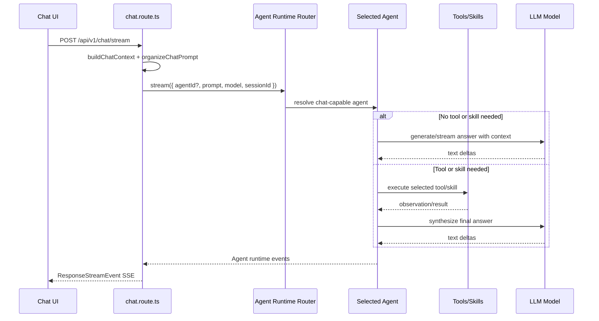

# Chat Direct LLM to Agent Runtime Migration Plan

## Status
Draft

## Date
2026-06-27

## Context

BloomAI chat currently has two compatible execution paths:

- Direct LLM chat path: `chat.route.ts` can call the LLM runtime directly, map provider stream chunks, and return a direct text stream.
- Mastra Agent path: `chat.route.ts` can call the Mastra chat agent, which may call tools and then stream the assistant answer.

The desired direction is to remove the independent chat direct LLM path from the chat feature. Chat should enter an Agent Runtime first. The selected agent can decide internally whether it needs tools or skills. If no tool or skill is needed, the agent still answers by calling the configured LLM model internally.

This means:

```text
Chat UI
  -> /api/v1/chat/stream
  -> Agent Runtime router
      -> chat agent by default
      -> other chat-capable agents in the future
          -> if no tool/skill is needed: agent calls LLM model directly
          -> if tool/skill is needed: agent calls tool/skill, then calls LLM model to answer
```

The goal is not to delete every low-level LLM/provider capability. The goal is to remove the second chat runtime and frontend compatibility layer.

## Decision

Use one chat-facing runtime: Agent Runtime.

- `chat.route.ts` should not decide between "Mastra agent" and "direct LLM".
- `chat.route.ts` may route to different agents, not only one hardcoded `streamMastraChat` function.
- Direct LLM fallback should be removed from chat.
- Provider-level `streamChat` implementations can remain as lower-level LLM runtime utilities.
- `LlmMessage` should remain because it is still useful for prompt/history representation.
- Settings UI text such as "Default Chat Model" does not need to be renamed.

## Non-Goals

- Do not delete provider files just because they contain `streamChat`.
- Do not delete `createOllamaProvider`.
- Do not remove the LLM model registry, provider registry, API key settings, image/video generation, or Ollama model discovery.
- Do not rename Settings UI copy in this migration.
- Do not force all requests through only `streamMastraChat`; create an Agent Runtime router so other agents can be selected later.

## Required Behavior

### Plain Chat Without Tools

When the agent determines no tool or skill is needed:

```text
chat.route.ts
  -> Agent Runtime router
  -> chat agent
  -> LLM model
  -> ResponseStreamEvent
```

The response trace should still show agent runtime:

```ts
{
  runtime: 'mastra-chat-agent-v1',
  toolCalls: [],
  finishReason: 'stop'
}
```

It should not show:

```ts
{ runtime: 'direct-llm' }
```

### Chat With Tools Or Skills

When the agent determines a tool or skill is needed:

```text
chat.route.ts
  -> Agent Runtime router
  -> selected agent
  -> tool/skill calls
  -> LLM model synthesizes final answer
  -> ResponseStreamEvent
```

The frontend should receive the same v1 event protocol regardless of whether tools were called.

## Critical Requirement: Preserve Chat Context

Removing direct LLM must not remove prompt context.

Today, the direct path builds a prompt through:

- `buildChatContext`
- `organizeChatPrompt`
- persona system prompt
- session history
- active app context
- clipboard context
- user content

The agent path currently must be updated so it does not only receive raw `content`.

Minimum required contract:

```ts
type AgentChatRunInput = {
  sessionId: string
  agentId?: string
  content: string
  model: string
  maxSteps?: number
  prompt: {
    system: string
    messages: LlmMessage[]
    maxTokens: number
  }
}
```

Implementation rule:

- Do not call the agent with only `input.content`.
- Pass the organized system prompt and message history into the agent.
- If the Mastra API supports structured messages, pass `prompt.messages`.
- If the current Mastra API only accepts a string input, compose a single agent input from `prompt.system`, `prompt.messages`, and the latest user content in a deterministic format.
- Preserve message roles where possible.
- Keep `LlmMessage` as the shared message representation.

## Proposed Agent Runtime Router

`chat.route.ts` should call a routing module instead of calling `streamMastraChat` directly forever.

Example shape:

```ts
type ChatAgentRouteInput = {
  sessionId: string
  content: string
  agentId?: string
  model: string
  maxSteps: number
  prompt: OrganizedChatPrompt
}

async function streamAgentChat(input: ChatAgentRouteInput): Promise<void> {
  const agent = resolveChatAgent(input.agentId ?? 'chat')
  return streamSelectedAgent(agent, input)
}
```

Current default:

```text
agentId missing -> chat agent -> Mastra chat agent v1
```

Future options:

```text
agentId=xiaohongshu -> Xiaohongshu agent
agentId=writer      -> Writing agent
agentId=research    -> Research agent
```

The route remains stable while agent selection grows behind the router.

## File-Level Modification Table

### Backend

| File | Action | Code Involved | Required Change |
|---|---|---|---|
| `src/server/routes/chat.route.ts` | Modify | Imports of `streamChatCompletion`, `mapLlmStreamToResponseEvents`, `runChatAgentV1`, `createAgentResponseEventMapper`, `buildChatContext`, `organizeChatPrompt` | Remove direct LLM imports from the route. Keep context building. Route every chat request into Agent Runtime router. |
| `src/server/routes/chat.route.ts` | Delete code | `getAgentRuntimeEnabled`, `getAgentRuntimeProvider`, `shouldUseAgentRuntime`, `getAgentRuntimeDebugConfig`, `logAgentRuntimeConfig` | Remove feature-flag switching between agent and direct LLM. Chat should no longer use `agent_runtime_enabled=false` as a direct LLM path. |
| `src/server/routes/chat.route.ts` | Delete code | `LegacyChatInput`, `createLegacyChatSource`, `streamLegacyChat` | Remove the chat direct LLM execution branch. |
| `src/server/routes/chat.route.ts` | Modify | Branch around `agentRuntimeDebugConfig.useAgentRuntime` | Replace with a single call to an Agent Runtime router. The router can select chat agent or other agents. |
| `src/server/routes/chat.route.ts` | Modify | Fallback logs such as `falling back to direct LLM` and `disabled; using direct LLM` | Remove fallback behavior. Agent startup/runtime failure should produce agent `response_failed` events. |
| `src/server/routes/chat.route.ts` | Modify | `const prompt = organizeChatPrompt(...)` | Keep this. Pass the organized prompt into the selected agent. This is required to preserve history, persona, active app, and clipboard context. |
| `src/server/routes/chat.route.ts` | Modify | `streamMastraChat` | Rename or wrap as `streamAgentChat` / `streamSelectedAgent`. It should be the current implementation behind the Agent Runtime router, not the permanent route-level abstraction. |
| `src/server/routes/chat-response-stream.ts` | Modify | Default runtime values using `'direct-llm'` | Change default runtime fallback to agent runtime or require `response_started.runtime` before trace merge. Avoid silently producing direct LLM traces. |
| `src/server/agent/mastra/types.ts` | Modify | `ChatAgentRunInput` | Add organized prompt fields. Keep `content`, but do not make it the only source passed to the agent. |
| `src/server/agent/mastra/types.ts` | Keep | `LlmMessage` usage through prompt types | Keep `LlmMessage`; do not delete it during type cleanup. |
| `src/server/agent/mastra/chat-agent-runtime-adapter.ts` | Modify | `runChatAgentV1`, `maybeStreamAgent(agent, input, maxSteps)` | Use organized prompt. The current `agent.stream(input.content, { maxSteps })` is insufficient because it loses context. |
| `src/server/agent/mastra/chat-agent-runtime-adapter.ts` | Modify | `resolveAgentModel` | Keep model resolution through `resolveRuntimeModel({ consumer: 'agent', modality: 'text' })`. |
| `src/server/agent/mastra/chat-agent.ts` | Modify | `createChatAgent(model, options)` and `CHAT_AGENT_V1_INSTRUCTIONS` | Allow the agent factory to accept runtime instructions/system prompt additions. Preserve default chat agent instructions, but include persona/context from `organizeChatPrompt`. |
| `src/server/agent/mastra/chat-agent.ts` | Modify | `tools: { web_search: ... }` | Keep web search. Extend later to include installed skills/tools when agent selection supports them. |
| `src/server/agent/index.ts` or new `src/server/agent/runtime/chat-agent-router.ts` | Add or modify | Agent runtime selection | Add a small router that maps route input to the selected chat-capable agent. Current default is Mastra chat agent v1. |
| `src/server/prompts/context.ts` | Keep | `buildChatContext` | Keep. It remains the source for session, persona, and message history. |
| `src/server/prompts/prompt.ts` | Keep/modify | `organizeChatPrompt` | Keep. If needed, add helper output suitable for agent input, but do not bypass it. |
| `src/server/prompts/types.ts` | Keep/modify | `ChatPromptContext`, `OrganizedChatPrompt`, `ChatPromptMessage` | Keep. Ensure `OrganizedChatPrompt.messages` remains compatible with `LlmMessage`. |
| `src/server/llm/response-event-mapper.ts` | Delete or deprecate | `mapLlmStreamToResponseEvents` | Remove from chat route. If no non-chat caller remains, delete the file and tests. |
| `src/server/llm/index.ts` | Modify carefully | `streamChatCompletion` export | Remove usage from `chat.route.ts`. Do not delete provider-level `streamChat`. `streamChatCompletion` can either remain as a lower-level LLM utility or be removed only after confirming no non-chat tests/tools need it. It must not be used as chat fallback. |
| `src/server/llm/types.ts` | Modify carefully | `ChatStreamRequest`, `ChatStreamEvent`, `ChatProvider`, `LlmMessage` | Keep `LlmMessage`. Keep provider stream types if provider `streamChat` remains. Remove only types that are exclusively used by the deleted frontend/backend direct chat compatibility layer. |
| `src/server/llm/providers/anthropic.ts` | Keep | `createAnthropicProvider`, `streamChat` | Do not delete provider `streamChat` in this migration. It may remain as low-level provider capability. |
| `src/server/llm/providers/openai.ts` | Keep | `createOpenAIProvider`, `streamChat` via compatible provider | Do not delete. |
| `src/server/llm/providers/openai-compatible.ts` | Keep | `createOpenAICompatibleProvider`, `streamChat` | Do not delete. |
| `src/server/llm/providers/agnes.ts` | Keep | `createAgnesTextProvider`, `streamChat` via compatible provider | Do not delete. |
| `src/server/llm/providers/deepseek.ts` | Keep | `createDeepSeekProvider`, `streamChat` via compatible provider | Do not delete. |
| `src/server/llm/providers/ollama.ts` | Keep | `createOllamaProvider`, `listOllamaRemoteModels`, `importOllamaModel` | Do not delete `createOllamaProvider`. Keep model discovery/import. |
| `src/server/llm/model-selection.ts` | Keep/modify | `ModelConsumer = 'chat' | 'agent' | 'tool' | 'workflow'`, `resolveRuntimeModel`, `toMastraModelId` | Keep because Mastra agent still needs model selection. Optional later cleanup: route chat requests can use `consumer: 'agent'`, while sessions/settings still store the selected chat model. |
| `src/server/routes/llm.route.ts` | Keep | `/llm/providers`, `/llm/models`, `/llm/videos`, `/llm/ollama/models` | Keep. This is model/provider management, not chat direct LLM runtime. |
| `src/server/db/repositories/session.repo.ts` | Keep | `model` field and settings fallback | Keep. Session model still selects the model used by the agent. |
| `src/server/db/schema.ts` | Keep | `sessions.model`, `llm_models`, `llm_providers` | No schema migration required for this cleanup. |

### Frontend

| File | Action | Code Involved | Required Change |
|---|---|---|---|
| `src/renderer/api/index.ts` | Modify | `createChatStreamNormalizer` import | Remove legacy normalizer usage if backend always emits v1 `ResponseStreamEvent`. |
| `src/renderer/api/index.ts` | Delete code | `ChatToolCallView`, `ChatToolCallStartEvent`, `ChatToolCallResultEvent`, `ChatToolCallErrorEvent`, legacy `ChatStreamEvent` | Remove legacy chat stream event types from the renderer API. Use shared `ResponseStreamEvent`. |
| `src/renderer/api/index.ts` | Modify | `platform.chatStream` | Parse SSE JSON and yield `ResponseStreamEvent` directly. Optionally validate with `ResponseStreamEventSchema`. On malformed chunks, emit a v1 `response_failed` event. |
| `src/renderer/api/chat-stream-normalizer.ts` | Delete | `LegacyChatStreamEvent`, `createChatStreamNormalizer`, direct-llm normalization | Delete once backend no longer emits legacy direct LLM chunks. |
| `src/renderer/store/index.ts` | Modify | `streamingText`, `streamError`, `toolCallsBySession`, `streamingResponsesBySession` | Use `streamingResponsesBySession` as the single source of streaming UI state. Remove direct/legacy parallel state if no longer needed. |
| `src/renderer/store/index.ts` | Delete code | `clearStreamingToolCalls` | Delete if `toolCallsBySession` is removed. Tool calls should be derived from response blocks. |
| `src/renderer/store/chat-response-reducer.ts` | Keep/modify | `reduceStreamingResponse`, `deriveStreamingText`, `deriveToolCalls` | Keep reducer. It is the correct v1 event reducer for agent output. `deriveStreamingText` may remain as a selector, not as legacy state. |
| `src/renderer/pages/Chat/ChatPanel.tsx` | Modify | Props passed to `Timeline` | Stop passing legacy `streamingText`, `streamError`, and `toolCalls` if store cleanup removes them. Pass `streamingResponse` and `isStreaming`. |
| `src/renderer/pages/Chat/Timeline.tsx` | Modify | `shouldShowStreamingBubble`, legacy branch rendering `toolCalls` and `streamingText` | Remove legacy direct stream rendering branch. Render from `streamingResponse.blocks`. |
| `src/renderer/pages/Chat/Timeline.tsx` | Keep | `renderStreamingResponse`, `groupStreamingBlocks`, `TimelineWaitState`, `TimelineErrorBlock` | Keep. These are agent/v1 response UI pieces. |
| `src/renderer/pages/Chat/ToolCallCard.tsx` | Modify, not necessarily delete | `LegacyToolCallData`, `ToolCallData = ToolCallBlock | LegacyToolCallData` | Remove `LegacyToolCallData`. Keep component if it is still used for single tool call block rendering. |
| `src/renderer/pages/Chat/ToolCallGroupCard.tsx` | Keep | Agent tool grouping UI | Keep. This is the preferred UI for repeated agent tool calls. |
| `src/renderer/pages/Chat/MessageBubble.tsx` | Keep | Assistant markdown streaming | Keep. Agent still streams markdown blocks. |
| `src/renderer/styles/global.css` | Modify | `.stream-error` | Remove only if `streamError` UI is removed. Agent errors should render through `TimelineErrorBlock`. |
| `src/renderer/styles/global.css` | Keep | `.timeline-wait-state`, `.timeline-error-block`, `.tool-call-group-card`, `.tcg-*` | Keep. These support v1/agent response timeline. |
| `src/renderer/styles/global.css` | Keep or prune carefully | `.tool-call-card`, `.tcc-*` | Keep if `ToolCallCard` remains. Delete only if all single-card rendering is removed in favor of grouped cards. |
| `src/renderer/pages/Settings/index.tsx` | Keep | "Default Chat Model" copy | Do not rename as part of this migration. |
| `src/renderer/pages/Settings/index.tsx` | Keep | `settings.model` | Keep. It still selects the default model used by the chat agent. |

### Shared Types And Contracts

| File | Action | Code Involved | Required Change |
|---|---|---|---|
| `src/shared/schemas/response.ts` | Modify | `ResponseRuntime` union and zod enum | Remove `'direct-llm'` only after persisted old traces and tests are handled. If backward compatibility with old messages is needed, keep parse support but stop emitting it. |
| `src/shared/schemas/message-trace.ts` | Keep/modify | `parseMessageTrace` | Keep backward compatibility for old saved traces if needed. New traces should be agent runtime. |
| `src/shared/llm-response-contract/*` | Modify tests/docs only if needed | Timeline/error registry | Keep agent error semantics. Remove direct-LLM examples from current tests/docs where they imply active runtime support. |

### Tests

| File | Action | Code Involved | Required Change |
|---|---|---|---|
| `src/server/routes/chat.route.test.ts` | Rewrite affected tests | Tests asserting direct LLM when flag disabled, direct fallback, `streamChatCompletion` calls | Replace with tests asserting chat route always enters Agent Runtime router and never falls back to direct LLM. |
| `src/server/routes/chat.route.test.ts` | Add tests | Agent router selection | Add cases for default chat agent and explicit future `agentId` routing behavior. |
| `src/server/routes/chat.route.test.ts` | Add tests | Context passing | Assert persona prompt, history, active app, clipboard, and latest user message are passed to agent input. |
| `src/server/routes/chat.route.test.ts` | Add tests | No-tool path | Agent emits normal answer with `toolCalls: []`; route persists assistant message and trace as agent runtime. |
| `src/server/routes/chat.route.test.ts` | Add tests | Agent failure before output | Assert `response_failed(AGENT_RUNTIME_ERROR)` instead of direct LLM fallback. |
| `src/server/agent/mastra/chat-agent-runtime-adapter.test.ts` | Modify | `runChatAgentV1` input expectations | Assert organized prompt is used, not only raw content. |
| `src/server/llm/response-event-mapper.test.ts` | Delete or move | Direct stream mapper tests | Delete if mapper is removed. If mapper remains as low-level utility, move out of chat route test scope. |
| `src/renderer/api/chat-stream-normalizer.test.ts` | Delete | Legacy normalizer tests | Delete with `chat-stream-normalizer.ts`. |
| `src/renderer/store/index.test.ts` | Rewrite affected tests | `streamingText`, `toolCallsBySession`, `streamError` expectations | Assert state is derived from `streamingResponsesBySession` and v1 blocks. |
| `src/renderer/pages/Chat/Timeline.test.tsx` | Rewrite affected tests | Legacy fallback text branch | Remove tests that assert legacy fallback branch. Keep tests for v1 markdown, tool groups, wait state, and error block. |
| `src/renderer/pages/Chat/ToolCallCard.test.tsx` | Modify or delete | Legacy data shape | If `ToolCallCard` stays, update tests to use `ToolCallBlock`. If not, delete. |
| `src/renderer/pages/Chat/ToolCallGroupCard.test.tsx` | Keep | Agent grouped tool calls | Keep and extend for no-tool and interrupted-agent cases if useful. |
| `src/server/llm/providers/*.test.ts` | Keep | Provider `streamChat` tests | Keep because provider-level stream capability is not being deleted. |
| `src/server/llm/llm-runtime.integration.test.ts` | Modify carefully | Direct `streamChatCompletion` integration | If `streamChatCompletion` remains as low-level utility, keep. If it is removed, rewrite to test provider stream helpers or model registry/media routes. Do not use this as chat route coverage. |

## Chat Route Target Flow



## Direct LLM Removal Boundary

Remove from chat:

- Route-level direct LLM branch.
- Route-level direct LLM fallback.
- Frontend legacy direct stream normalization.
- Frontend duplicate direct stream UI state.
- Emission of `runtime: 'direct-llm'` for new chat responses.

Keep outside chat:

- Provider registry.
- Model registry.
- Provider API key/base URL settings.
- Provider-level `streamChat`.
- `createOllamaProvider`.
- `LlmMessage`.
- Image/video generation.
- Ollama model discovery/import.

## Migration Steps

1. Add or introduce an Agent Runtime router abstraction.
2. Update `chat.route.ts` so it always enters the Agent Runtime router.
3. Pass `organizeChatPrompt` output into agent runtime input.
4. Update Mastra chat adapter to consume organized prompt, not only raw content.
5. Remove direct LLM fallback behavior from route.
6. Stop emitting `direct-llm` for new chat responses.
7. Remove frontend legacy stream normalizer.
8. Simplify chat store to one v1 response state.
9. Simplify Timeline to render v1 response blocks only.
10. Update tests to cover no-tool agent answers, tool-using agent answers, context preservation, and agent failure without direct fallback.

## Acceptance Criteria

- A normal non-tool chat request streams an answer through agent runtime.
- The response trace is `mastra-chat-agent-v1` with `toolCalls: []`.
- A search/tool request streams tool call events and final answer through the same response protocol.
- No chat route test expects `streamChatCompletion` to be called.
- No chat route behavior falls back to direct LLM.
- Persona/system prompt, chat history, active app, and clipboard context reach the selected agent.
- Provider-level `streamChat` tests still pass.
- Settings page copy remains unchanged.
- No new chat response emits `runtime: 'direct-llm'`.

## Open Implementation Notes

- If old persisted messages contain `runtime: 'direct-llm'`, parsing may need to remain backward compatible even after new emissions stop.
- If Mastra's current `agent.stream` API cannot accept structured messages, implement a deterministic prompt composer as an adapter layer. Do not drop history/context.
- The agent router should be intentionally small at first. Its job is selection and dispatch, not tool policy.
- Tool and skill selection should remain inside the selected agent or agent runtime, not in `chat.route.ts`.
