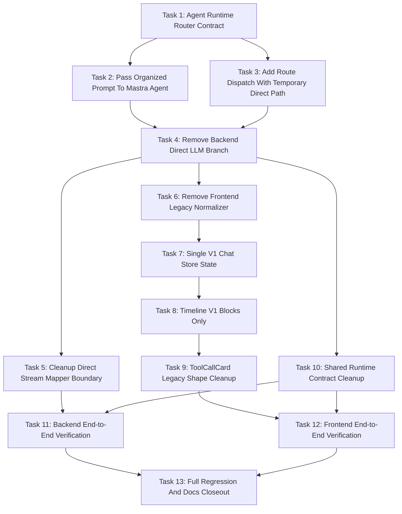

# Chat Agent Runtime Only 待办任务

> 给实现 agent 的说明：请按任务逐项执行。每个任务完成后都应该让代码库处于可验证状态，并且不要超出任务中声明的边界。

## 目标

移除 BloomAI chat 中独立的 chat direct LLM 执行路径，让 chat 先进入 Agent Runtime router。被选中的 agent 在不需要 tool/skill 时，可以直接使用配置的 LLM model 回答；需要时，则先调用 tools/skills，再综合生成最终回答。

## 架构

`chat.route.ts` 仍然是 HTTP/SSE 边界。它负责构建和持久化 chat context，并分发到 Agent Runtime router。router 选择默认 Mastra chat agent，或未来其它具备 chat 能力的 agents。前端只消费 v1 `ResponseStreamEvent` 事件，不再维护 legacy direct LLM 兼容 UI 路径。

## Task 1: 定义 Agent Runtime Router Contract 和 Prompt Input

### 功能目标

在 `chat.route.ts` 和具备 chat 能力的 agents 之间创建稳定的后端接口。这个 contract 必须携带整理后的 prompt context，让 agents 能够基于 history、persona、active app 和 clipboard context 回答。

### 功能列表

- 定义 chat agent routing input 类型，包含 `sessionId`、可选 `agentId`、原始 `content`、选中的 `model`、`maxSteps` 和 organized prompt。
- 定义 router 面向调用方的 runtime event 类型，复用现有 Mastra chat agent runtime event 形状。
- 为当前 chat agent 添加默认 agent id。
- 确保 contract 支持未来 agents，而不需要修改 `chat.route.ts`。

### 函数、接口、文件

- 创建或修改：`src/server/agent/runtime/chat-agent-router.ts`
  - `DEFAULT_CHAT_AGENT_ID`
  - `ChatAgentRouteInput`
  - `streamChatAgentRoute(input: ChatAgentRouteInput): AsyncGenerator<ChatAgentRuntimeEvent>`
  - `resolveChatAgentRoute(agentId?: string)`
- 修改：`src/server/agent/index.ts`
  - 导出 router contract。
- 使用现有类型：
  - `OrganizedChatPrompt`，来自 `src/server/prompts/types.ts`
  - `ChatAgentRuntimeEvent`，来自 `src/server/agent/mastra/types.ts`
  - `LlmMessage`，来自 `src/server/llm/types.ts`

### 不修改边界

- 不修改 provider 文件。
- 暂不修改前端 state。
- 本任务不移除 `streamChatCompletion`。
- 不修改 Settings UI 文案。
- 不引入 agent marketplace 或 custom agent CRUD。

### 单元测试策略

- 新增 `src/server/agent/runtime/chat-agent-router.test.ts`。
- 测试默认路由：
  - 未提供 `agentId` 时，router 解析到默认 chat agent。
- 测试显式当前路由：
  - 提供 `agentId: 'chat'` 时，router 解析到当前 Mastra chat agent。
- 测试不支持的 agent id：
  - 提供未知 id 时，根据选择的实现，router 返回 agent runtime error event，或抛出 typed error。

### 集成测试策略

- 本任务不要求集成测试。Route integration 后续任务处理。

### 用例测试策略

- 使用 fake organized prompt，包含：
  - system prompt
  - 一条之前的 user message
  - 一条之前的 assistant message
  - 当前 user message
- 断言 router input 在转发给当前 agent adapter 时保留完整 prompt object。

### 完成清单

- [ ] Router 文件存在。
- [ ] Router exports 可从 `src/server/agent/index.ts` 使用。
- [ ] Router 支持默认 chat agent。
- [ ] Router input 包含 organized prompt。
- [ ] 测试覆盖默认 agent selection 和 unknown agent selection。

### 关键验收证据

- Router unit test 通过输出。
- Typecheck 确认 `ChatAgentRouteInput.prompt` 为必填。
- 代码引用显示 route caller 可以使用 router，而不需要直接 import Mastra-specific adapter functions。

## Task 2: 将 Organized Prompt Context 传入 Mastra Chat Agent Runtime

### 功能目标

确保 Mastra chat agent 接收到 direct LLM 之前使用的同等上下文：persona system prompt、history、active app、clipboard context 和当前 user message。

### 功能列表

- 扩展 `ChatAgentRunInput`，使其包含 organized prompt。
- 保留 `content` 作为便利字段，但停止把它当作唯一 agent input 使用。
- 如果 Mastra streaming 只接受 string，则新增 prompt composition helper。
- 保留 `LlmMessage`。
- 继续通过 `resolveRuntimeModel({ consumer: 'agent', modality: 'text' })` 做 model resolution。

### 函数、接口、文件

- 修改：`src/server/agent/mastra/types.ts`
  - `ChatAgentRunInput`
  - 添加 `prompt: OrganizedChatPrompt` 或等价 prompt payload。
- 修改：`src/server/agent/mastra/chat-agent-runtime-adapter.ts`
  - `runChatAgentV1(input)`
  - `maybeStreamAgent(agent, input, maxSteps)`
  - 添加类似 `createAgentPromptInput(input.prompt, input.content)` 的 helper。
- 修改：`src/server/agent/mastra/chat-agent.ts`
  - `CreateChatAgentOptions`
  - `createChatAgent(model, options)`
  - 允许 runtime system prompt additions，或从 organized prompt 派生 instructions。
- 使用现有：
  - `organizeChatPrompt`，来自 `src/server/prompts/prompt.ts`
  - `LlmMessage`，来自 `src/server/llm/types.ts`

### 不修改边界

- 不新增第二套 prompt organization system。
- 不绕过 `buildChatContext` 或 `organizeChatPrompt`。
- 本任务不删除 direct LLM route branch。
- 不修改 tool selection policy。
- 不删除 `LlmMessage`。

### 单元测试策略

- 更新 `src/server/agent/mastra/chat-agent-runtime-adapter.test.ts`。
- 新增 prompt forwarding 测试：
  - Input prompt 包含 system 和 history。
  - Agent stream 接收 context，而不只是最新 `content`。
- 新增 no-tool response 测试：
  - Agent 返回 deltas 和 done，且 `toolCalls: []`。
- 新增 model resolution 测试：
  - Requested model 仍然使用 `consumer: 'agent'` 解析。

### 集成测试策略

- 暂不要求。完整 route integration 在 `chat.route.ts` 使用 router 后处理。

### 用例测试策略

- 用户问："What did I ask earlier?"
- 给定 history 中包含更早的消息，fake agent input 应包含这段 history。
- 用户有 active app 和 clipboard context；fake agent input 应通过 organized prompt 包含这些 context lines。

### 完成清单

- [ ] `ChatAgentRunInput` 包含 organized prompt。
- [ ] `runChatAgentV1` 消费 organized prompt。
- [ ] 测试证明 latest content 不是唯一 agent input。
- [ ] 没有移除 provider-level stream functions。
- [ ] `LlmMessage` 仍可用。

### 关键验收证据

- Mastra adapter unit tests 通过。
- Snapshot 或 assertion 显示 composed agent input 包含 system prompt、history 和 latest user content。
- Typecheck 显示 agent runtime calls 没有缺失 prompt fields。

## Task 3: 在保留现有 Direct Path 的情况下添加 Route-Level Agent Runtime Dispatch

### 功能目标

在 `chat.route.ts` 中引入 Agent Runtime router，并暂时保留当前 route 行为，让 route tests 能在删除 direct fallback 前验证 context passing 和 agent dispatch。

### 功能列表

- 按当前方式构建 prompt context。
- 将 `organizeChatPrompt` 输出传入 `streamChatAgentRoute`。
- 暂时保留当前 feature flag/direct fallback，仅用于对比。
- 新增测试证明 agent route path 接收到完整 prompt context。

### 函数、接口、文件

- 修改：`src/server/routes/chat.route.ts`
  - `chatRouter.post('/stream', ...)`
  - `streamMastraChat` 或新的 wrapper `streamAgentChat`
  - `createAgentChatSource`
- Import：
  - `streamChatAgentRoute`，来自 `src/server/agent/runtime/chat-agent-router.ts`
- 修改测试：
  - `src/server/routes/chat.route.test.ts`

### 不修改边界

- 暂不移除 direct LLM branch。
- 不修改前端。
- 不修改 provider tests。
- 不重命名 settings keys 或 Settings UI 文案。

### 单元测试策略

- 更新 route unit tests，mock `streamChatAgentRoute`。
- 断言 route 传入：
  - `sessionId`
  - 选中的 `model`
  - `content`
  - `prompt.system`
  - `prompt.messages`
  - `maxSteps`
- 断言 missing session 仍像之前一样返回 SSE error。

### 集成测试策略

- 添加新的 agent dispatch tests 时，保持现有 chat route integration tests 通过。
- Task 4 前不移除 direct fallback assertions。

### 用例测试策略

- 带 persona 和两条 prior messages 的 session 发送一条新消息。
- Route 调用 agent router，并传入包含 persona 和 history 的 organized prompt。

### 完成清单

- [ ] `chat.route.ts` 可以调用 Agent Runtime router。
- [ ] Agent path 接收到 organized prompt。
- [ ] 现有行为尚未删除。
- [ ] 测试覆盖从 route 到 router 的 context handoff。

### 关键验收证据

- `chat.route.test.ts` 中 context handoff 相关子集通过。
- 测试 assertion 显示 router mock 收到带 history 和 current user message 的 `prompt.messages`。

## Task 4: 从 Backend Route 移除 Chat Direct LLM Branch 和 Fallback

### 功能目标

让 chat route 只使用 Agent Runtime 作为 chat-facing runtime。Agent failure 应作为 agent runtime failure 暴露，而不是 fallback 到 direct LLM。

### 功能列表

- 移除 route-level feature flag 中 Mastra agent 和 direct LLM 的切换。
- 移除 agent 无输出或输出前报错时的 direct LLM fallback。
- 移除 direct chat source 和 direct stream persistence path。
- 保留 provider-level stream capabilities 不变。
- 停止从 chat route 发出新的 `runtime: 'direct-llm'`。

### 函数、接口、文件

- 修改：`src/server/routes/chat.route.ts`
  - 删除 imports：
    - `streamChatCompletion`
    - `mapLlmStreamToResponseEvents`
  - 删除 helpers：
    - `getAgentRuntimeEnabled`
    - `getAgentRuntimeProvider`
    - `shouldUseAgentRuntime`
    - direct fallback-specific debug helpers
    - `createLegacyChatSource`
    - `streamLegacyChat`
  - 保留 helpers：
    - `getAgentRuntimeMaxSteps`，或替换为 agent max steps config
    - `persistAssistantFromWriter`
    - `getTokenCount`
- 修改：`src/server/routes/chat-response-stream.ts`
  - 将默认 runtime fallback 从 `'direct-llm'` 改掉。
- 修改测试：
  - `src/server/routes/chat.route.test.ts`
  - `src/server/routes/chat-response-stream.test.ts`

### 不修改边界

- 不删除 provider `streamChat` functions。
- 不删除 `createOllamaProvider`。
- 不删除 `LlmMessage`。
- 本任务不修改前端。
- 不重命名 Settings UI 文案。

### 单元测试策略

- 重写 direct fallback route tests：
  - 移除 `streamChatCompletion` 被调用的 expectations。
  - 断言普通 chat 会调用 router。
  - 断言 agent 在输出前报错时，不发生 direct LLM fallback。
  - 断言发送 agent `response_failed` event。
- 更新 `chat-response-stream` tests：
  - 新的 failed/completed traces 应默认使用 agent runtime，或要求显式 runtime。

### 集成测试策略

- Route SSE test：
  - Agent 发出 no-tool deltas 和 done。
  - SSE 发出带 `runtime: 'mastra-chat-agent-v1'` 的 v1 events。
  - Assistant message 被持久化。
- Agent failure test：
  - Agent 在 content 前发出 error。
  - SSE 发出 `response_failed`。
  - `streamChatCompletion` mock 不存在或未被调用。

### 用例测试策略

- 普通问题："Explain TypeScript union types."
  - 不调用 tools。
  - Agent runtime 回答。
  - Trace 包含 `toolCalls: []`。
- Agent startup failure：
  - 用户看到一个 failed response。
  - 不出现隐藏 fallback assistant answer。

### 完成清单

- [ ] `chat.route.ts` 不再 import `streamChatCompletion`。
- [ ] `chat.route.ts` 不再 import `mapLlmStreamToResponseEvents`。
- [ ] 没有 route branch 使用 `agent_runtime_enabled=false` 选择 direct LLM。
- [ ] Agent 输出前报错不会 fallback。
- [ ] 新 chat traces 不发出 `direct-llm`。
- [ ] Provider stream code 保持完整。

### 关键验收证据

- `rg "streamChatCompletion|mapLlmStreamToResponseEvents|streamLegacyChat|falling back to direct LLM" src/server/routes/chat.route.ts` 无匹配。
- no-tool answer、tool answer 和 agent failure 的 route tests 通过。
- 测试中的 persisted assistant trace 包含 `runtime: 'mastra-chat-agent-v1'`。

## Task 5: 决定并执行 Low-Level Direct Stream Mapper 清理

### 功能目标

在 chat route 不再使用 direct LLM response mapping 后，再移除或弃用它，同时保留 provider-level `streamChat` capabilities。

### 功能列表

- 审计 `src/server/llm/response-event-mapper.ts` 的剩余使用。
- 如果只有 chat route 使用它，则删除文件和测试。
- 如果仍有非 chat utility 使用它，则标记为 low-level utility，并确保 chat route 不 import 它。
- 保留 provider 的 `streamChat` tests。
- 保留 `LlmMessage`。

### 函数、接口、文件

- 候选删除：
  - `src/server/llm/response-event-mapper.ts`
  - `src/server/llm/response-event-mapper.test.ts`
- 谨慎修改：
  - `src/server/llm/index.ts`
  - `src/server/llm/types.ts`
  - `src/server/llm/llm-runtime.integration.test.ts`
- 保留：
  - `src/server/llm/providers/*.ts`
  - `src/server/llm/providers/*.test.ts`

### 不修改边界

- 不删除 provider `streamChat`。
- 不删除 `createOllamaProvider`。
- 不删除 model/provider registry routes。
- 不移除 image/video generation。
- 不移除 `LlmMessage`。

### 单元测试策略

- 如果删除 mapper：
  - 移除 mapper tests。
  - 确保没有剩余 imports。
- 如果保留 mapper：
  - 保留 mapper tests，但将 wording 从 active chat route behavior 中移开。
- Provider tests：
  - 保持现有 provider stream tests 通过。

### 集成测试策略

- 如果 `streamChatCompletion` 保留，运行覆盖 provider-level streams 的 LLM runtime integration tests。
- 如果移除 `streamChatCompletion`，用 provider helper tests 和 model registry/media route tests 替换 integration coverage。

### 用例测试策略

- Low-level provider stream 在测试中仍可调用。
- Chat route 不能调用 direct stream mapper。

### 完成清单

- [ ] Chat route 没有 import direct mapper。
- [ ] Provider-level stream tests 仍通过。
- [ ] `LlmMessage` 仍被导出或仍可用。
- [ ] LLM model/provider management 仍正常工作。

### 关键验收证据

- `rg "mapLlmStreamToResponseEvents" src` 显示没有 chat route usage。
- Provider tests 通过。
- `/llm/models` 和 `/llm/providers` 的 LLM route tests 通过。

## Task 6: 移除 Frontend Legacy Chat Stream Normalizer

### 功能目标

让前端 API client 只消费来自 chat stream 的 v1 `ResponseStreamEvent` SSE chunks。

### 功能列表

- 移除 legacy normalizer import 和 usage。
- 删除 legacy renderer chat stream event types。
- 将 SSE JSON 解析为 `ResponseStreamEvent`。
- 对 malformed chunks，生成 v1 failure event，而不是 legacy `error`。
- 删除 normalizer tests。

### 函数、接口、文件

- 修改：`src/renderer/api/index.ts`
  - `platform.chatStream`
  - 移除 `ChatToolCallView`
  - 移除 `ChatToolCallStartEvent`
  - 移除 `ChatToolCallResultEvent`
  - 移除 `ChatToolCallErrorEvent`
  - 移除 legacy `ChatStreamEvent`
- 删除：
  - `src/renderer/api/chat-stream-normalizer.ts`
  - `src/renderer/api/chat-stream-normalizer.test.ts`
- 使用：
  - `ResponseStreamEvent`
  - 可选 `ResponseStreamEventSchema`

### 不修改边界

- 除非编译必要，本任务不修改 store state。
- 本任务不修改 Timeline。
- 不修改后端。
- 不新增 UI。

### 单元测试策略

- 新增或更新 renderer API tests，覆盖：
  - v1 event pass-through。
  - `[DONE]` 结束 stream。
  - malformed JSON 生成 `response_failed`。
  - network abort 生成带 abort-like code 的 `response_failed`。

### 集成测试策略

- 在测试中使用 mocked fetch stream。
- 确认 `platform.chatStream` yield 后端发送的相同 v1 event payloads。

### 用例测试策略

- 后端发送：
  - `response_started`
  - `content_block_started`
  - `content_delta`
  - `response_completed`
- 前端 API 原样 yield 这些 events。

### 完成清单

- [ ] `createChatStreamNormalizer` import 被移除。
- [ ] `chat-stream-normalizer.ts` 被删除。
- [ ] Legacy chat event types 从 renderer API 移除。
- [ ] API tests 覆盖 v1-only stream parsing。

### 关键验收证据

- `rg "createChatStreamNormalizer|LegacyChatStreamEvent|ChatToolCallStartEvent" src/renderer` 在 production 中无匹配。
- Renderer API stream tests 通过。

## Task 7: 简化 Chat Store 为单一 V1 Streaming Response State

### 功能目标

从 Zustand chat store 移除重复的 direct/legacy streaming state，并使用 `streamingResponsesBySession` 作为 active response UI 的唯一事实来源。

### 功能列表

- 移除 `streamingText` state。
- 如果 Timeline errors 从 response blocks 渲染，则移除 `streamError` state。
- 移除 `toolCallsBySession`。
- 移除 `clearStreamingToolCalls`。
- 继续使用 `reduceStreamingResponse`。
- 如果 components 或 tests 仍需要 derived views，可保留 `deriveStreamingText` 和 `deriveToolCalls` 等 selectors。

### 函数、接口、文件

- 修改：`src/renderer/store/index.ts`
  - `ChatState`
  - `ChatActions`
  - `sendMessage`
  - `clearMessages`
  - 移除 `clearStreamingToolCalls`
  - 如果没有 caller，移除 `setStreamError`
- 修改测试：
  - `src/renderer/store/index.test.ts`
- 保留：
  - `src/renderer/store/chat-response-reducer.ts`

### 不修改边界

- 不修改后端。
- 不修改 provider 文件。
- 不修改 Settings UI。
- 不移除 reducer 对 tool calls 的 block support。

### 单元测试策略

- 围绕 `streamingResponsesBySession` 重写 store tests。
- 测试 streaming lifecycle：
  - 从 `response_started` 开始
  - 追加 markdown delta
  - 完成并 reload messages
- 测试 failed response：
  - `response_failed` 保留在 `streamingResponsesBySession` 中。
  - Error block 存在。
- 测试 tool call：
  - Streaming response blocks 中存在 tool block。

### 集成测试策略

- Store 测试中 mock `platform.chatStream`，使其 yield v1 events。
- Store 测试中 mock 成功完成后的 `platform.getMessages`。

### 用例测试策略

- 普通 no-tool answer：
  - Store 从 markdown blocks 派生 assistant text。
  - 不存在 tool block。
- Tool answer：
  - Store 在 markdown answer 前持有 tool call block。
- Failure：
  - Store 为 Timeline 持有 error block。

### 完成清单

- [ ] `streamingText` 从 `ChatState` 移除。
- [ ] `toolCallsBySession` 从 `ChatState` 移除。
- [ ] `clearStreamingToolCalls` 被移除。
- [ ] Store tests 使用 v1 response blocks。
- [ ] 现有 message reload behavior 仍正常。

### 关键验收证据

- `rg "streamingText|toolCallsBySession|clearStreamingToolCalls" src/renderer/store src/renderer/pages/Chat` 无 production 匹配，允许保留的 derived selector names 除外。
- Store tests 通过。

## Task 8: 简化 Chat Timeline Rendering，只渲染 V1 Blocks

### 功能目标

移除 direct/legacy timeline rendering，并只从 v1 response blocks 渲染 active assistant output。

### 功能列表

- 从 `Timeline` props 移除 `streamingText`、`streamError` 和 `toolCalls`。
- 移除渲染独立 tool cards 和 streaming message 的 legacy fallback branch。
- 保留 `renderStreamingResponse`。
- 保留 `TimelineWaitState`。
- 保留 `TimelineErrorBlock`。
- 保留 grouped tool call rendering。

### 函数、接口、文件

- 修改：`src/renderer/pages/Chat/Timeline.tsx`
  - `TimelineProps`
  - 删除 `shouldShowStreamingBubble`
  - main render branch
  - scroll effect dependencies
- 修改：`src/renderer/pages/Chat/ChatPanel.tsx`
  - 传给 `Timeline` 的 props
- 修改测试：
  - `src/renderer/pages/Chat/Timeline.test.tsx`
  - 如果 props 被覆盖，修改 `src/renderer/pages/Chat/ChatPanel.test.tsx`

### 不修改边界

- 不移除 `MessageBubble`。
- 不移除 `ToolCallGroupCard`。
- 除非 Task 9 选择这样做，否则不删除 `ToolCallCard`。
- 不修改后端。

### 单元测试策略

- Timeline tests：
  - 渲染 empty state。
  - 渲染 historical messages。
  - 渲染 active markdown block。
  - 渲染 grouped tool blocks。
  - `response_started` 后且任何 block 前渲染 wait state。
  - `response_failed` 时渲染 error block。
- 移除断言 legacy fallback text 的测试。

### 集成测试策略

- 使用完整 `StreamingResponseState` 做 component-level render。
- 本任务不需要 browser E2E。

### 用例测试策略

- No-tool agent answer：
  - 出现一个 assistant markdown bubble。
- Tool answer：
  - Tool group 出现在 assistant answer 之前或周围。
- Agent failure：
  - Timeline error block 出现。

### 完成清单

- [ ] `TimelineProps` 不再包含 legacy stream props。
- [ ] `ChatPanel` 只为 active response 传入 `streamingResponse` 和 `isStreaming`。
- [ ] Legacy fallback branch 被移除。
- [ ] Timeline tests 覆盖 v1 states。

### 关键验收证据

- `rg "legacy fallback text|shouldShowStreamingBubble|streamingText|toolCalls=" src/renderer/pages/Chat` 显示没有 production legacy branch。
- Timeline 和 ChatPanel tests 通过。

## Task 9: 移除 Legacy ToolCallCard Data Shape 并安全裁剪 CSS

### 功能目标

确保 tool UI 只接受 v1 `ToolCallBlock` data。根据实际 v1 rendering 需求决定保留或删除 `ToolCallCard`，但要移除 legacy data compatibility。

### 功能列表

- 移除 `LegacyToolCallData`。
- 如果保留 `ToolCallCard`，将 `ToolCallData` 改为 `ToolCallBlock`。
- 更新 `ToolCallCard` tests，使其使用 `ToolCallBlock`。
- 保留 `ToolCallGroupCard`，作为首选 grouped agent tool UI。
- 如果 Task 8 已移除 stream error UI，则移除 `.stream-error` CSS。
- 只有在删除 `ToolCallCard` 时，才移除 `.tcc-*` CSS。

### 函数、接口、文件

- 修改或删除：`src/renderer/pages/Chat/ToolCallCard.tsx`
  - `LegacyToolCallData`
  - `ToolCallData`
  - `normalizeToolCall`
- 修改或删除：`src/renderer/pages/Chat/ToolCallCard.test.tsx`
- 保留：`src/renderer/pages/Chat/ToolCallGroupCard.tsx`
- 修改：`src/renderer/styles/global.css`
  - `.stream-error`
  - `.tool-call-card`
  - `.tcc-*`

### 不修改边界

- 不移除 grouped tool call UI。
- 不从 reducer 移除 v1 tool block support。
- 不修改后端 event shape。
- 不删除仍被已挂载组件使用的 CSS。

### 单元测试策略

- 如果保留 `ToolCallCard`：
  - running block 能渲染。
  - success block 能渲染 output summary/results。
  - error block 能渲染 `ResponseError`。
  - 不再有测试传入 legacy string error shape。
- 如果删除 `ToolCallCard`：
  - 更新 Timeline tests，断言 grouped card 也覆盖 single tool call。

### 集成测试策略

- Component render tests 足够。

### 用例测试策略

- Web search tool call 带 output results 时能正确渲染。
- Failed tool call 带 `ResponseError` 时能正确渲染。

### 完成清单

- [ ] `LegacyToolCallData` 被移除。
- [ ] Tool UI tests 使用 `ToolCallBlock`。
- [ ] CSS 裁剪与实际组件匹配。
- [ ] Production renderer code 中不再有 legacy tool call shape。

### 关键验收证据

- `rg "LegacyToolCallData|ToolCallData = ToolCallBlock \\|" src/renderer` 无匹配。
- ToolCallCard 或 ToolCallGroupCard tests 通过。

## Task 10: 更新 Shared Runtime Contract，停止发出新的 Direct-LLM

### 功能目标

阻止新的 chat responses 使用 `runtime: 'direct-llm'`，同时在需要时保留旧 message parsing。

### 功能列表

- 决定 `ResponseRuntime` 是否仅为 backward compatibility 保留 `'direct-llm'`。
- 确保新的 backend writer defaults 不创建 direct LLM runtime。
- 更新 active chat behavior 中使用 direct runtime fixtures 的测试。
- 如果 persisted data 可能包含 direct runtime，则保留旧 traces parsing。

### 函数、接口、文件

- 修改：`src/shared/schemas/response.ts`
  - `ResponseRuntime`
  - `ResponseStreamEventSchema`
- 修改：`src/shared/schemas/message-trace.ts`
  - `parseMessageTrace`
- 修改测试：
  - `src/shared/schemas/response.test.ts`
  - `src/shared/schemas/message-trace.test.ts`
  - `src/renderer/store/chat-response-reducer.test.ts`
  - `src/server/routes/chat-response-stream.test.ts`

### 不修改边界

- 没有显式 migration 时，不破坏旧 persisted message trace parsing。
- 不重命名 Settings UI。
- 不修改 provider model registry。

### 单元测试策略

- 测试使用 `mastra-chat-agent-v1` 的新 chat events。
- 如果保留 backward compatibility，测试带 `direct-llm` 的旧 saved trace 仍能解析。
- 测试 writer 不再默认使用 `direct-llm`。

### 集成测试策略

- Task 11 的 route integration 应验证没有新的 direct runtime。

### 用例测试策略

- 带 direct trace 的旧 conversation 仍可加载。
- 新 conversation 从不发出 direct trace。

### 完成清单

- [ ] 新 event fixtures 使用 agent runtime。
- [ ] Backward compatibility 决策记录在测试中。
- [ ] Writer defaults 不再生成 direct runtime。

### 关键验收证据

- Shared schema tests 通过。
- `rg "runtime: 'direct-llm'|runtime=direct-llm" src` 只显示 backward-compatibility tests/docs，而不是 active runtime code。

## Task 11: Agent-Only Chat 的 Backend 端到端验证

### 功能目标

证明后端 chat 行为在 no-tool answers、tool answers、context preservation、persistence 和 failure 场景下都能工作，且没有 direct fallback。

### 功能列表

- 添加或完成 agent-only chat 的 route integration tests。
- 覆盖 no-tool agent answer。
- 覆盖 tool-call agent answer。
- 覆盖 context 传给 agent。
- 覆盖 agent 在输出前 failure。
- 覆盖 agent 在已有 visible tool/content 后 failure。
- 覆盖带 agent trace 的 assistant message persistence。

### 函数、接口、文件

- 修改：`src/server/routes/chat.route.test.ts`
- 修改：`src/server/agent/mastra/chat-agent-runtime-adapter.test.ts`
- 修改：`src/server/routes/chat-response-stream.test.ts`
- 如有需要，只在现有测试文件中添加 test helpers。

### 不修改边界

- 不新增 live provider network calls。
- 不要求真实 Mastra provider credentials。
- 本任务不测试前端。

### 单元测试策略

- 使用 mocked agent runtime events 做 route tests：
  - `delta`
  - `tool_call_start`
  - `tool_call_result`
  - `done`
  - `error`

### 集成测试策略

- 使用 Express app test path 访问 `POST /api/v1/chat/stream`。
- 解析 SSE chunks 并断言 event order。
- 检查 in-memory/test database records 中持久化的 assistant message。

### 用例测试策略

- 普通 user prompt：
  - 返回 `response_started`、markdown block、`response_completed`。
  - Trace 包含 `toolCalls: []`。
- Search prompt：
  - 返回 tool events 和 answer events。
  - Trace 包含 web search tool call。
- Failure：
  - 返回 `response_failed`。
  - 后面不跟 direct answer。

### 完成清单

- [ ] Backend route tests 覆盖 no-tool answer。
- [ ] Backend route tests 覆盖 tool answer。
- [ ] Backend route tests 覆盖 context preservation。
- [ ] Backend route tests 覆盖 failure without fallback。
- [ ] Persistence assertions 使用 agent trace。

### 关键验收证据

- 命令通过：`node node_modules/vitest/vitest.mjs run src/server/routes/chat.route.test.ts src/server/agent/mastra/chat-agent-runtime-adapter.test.ts src/server/routes/chat-response-stream.test.ts`
- 测试中的 SSE event snapshot 显示 `runtime: 'mastra-chat-agent-v1'`。
- Test DB assistant row 包含 agent trace JSON。

## Task 12: V1-Only Chat UI 的 Frontend 端到端验证

### 功能目标

证明前端 API、store 和 Timeline 能正确渲染 agent-only v1 response streams，且不依赖 legacy direct LLM UI state。

### 功能列表

- 验证 API stream yield v1 events。
- 验证 store 将 v1 events reduce 为 response blocks。
- 验证 Timeline 渲染 markdown、tool groups、wait state 和 errors。
- 验证没有使用 legacy direct stream branch。

### 函数、接口、文件

- 修改测试：
  - `src/renderer/api/index.test.ts`，如果已有；否则添加 focused test file。
  - `src/renderer/store/index.test.ts`
  - `src/renderer/pages/Chat/Timeline.test.tsx`
  - `src/renderer/pages/Chat/ChatPanel.test.tsx`
  - `src/renderer/pages/Chat/ToolCallGroupCard.test.tsx`

### 不修改边界

- 本任务不修改后端。
- 不引入视觉 redesign。
- 不重命名 Settings UI。

### 单元测试策略

- API test：
  - v1 SSE chunks pass through。
- Store test：
  - 正确构建 response blocks。
- Timeline test：
  - 正确渲染 v1 response。
- Tool group test：
  - grouped tool calls 能渲染 statuses。

### 集成测试策略

- 使用 mocked store/platform 做 component-level integration。
- 只有在 dev server 已存在后才可选做 browser smoke test；本任务文档不要求。

### 用例测试策略

- No-tool agent answer 渲染一个 assistant bubble。
- Tool answer 渲染 tool group 加 assistant bubble。
- Agent error 渲染 timeline error block。

### 完成清单

- [ ] Frontend tests 不再依赖 `streamingText`。
- [ ] Frontend tests 不再依赖 `toolCallsBySession`。
- [ ] Timeline 从 `streamingResponse.blocks` 渲染。
- [ ] Agent error 通过 `TimelineErrorBlock` 出现。

### 关键验收证据

- 命令通过：`node node_modules/vitest/vitest.mjs run src/renderer/api src/renderer/store src/renderer/pages/Chat`
- `rg "createChatStreamNormalizer|LegacyChatStreamEvent|streamingText|toolCallsBySession" src/renderer` 显示没有 production legacy usage。

## Task 13: Full Regression 和 Documentation Closeout

### 功能目标

验证整个迁移，并记录最终行为，避免未来重新引入第二套 chat runtime。

### 功能列表

- 运行 focused backend 和 frontend tests。
- 运行 typecheck/build。
- 如果实现偏离计划，更新 docs。
- 记录围绕旧 `direct-llm` traces 的已知 compatibility decisions。

### 函数、接口、文件

- 如有需要，修改 docs：
  - `docs/chat/chat-agent-runtime-only-migration-plan.md`
  - `docs/chat/chat-agent-runtime-only-todo-tasks.md`
  - 可选 `docs/agent/` 下的 verification doc
- 除非修复 verification failures，本任务不应修改 production file。

### 不修改边界

- 不新增功能。
- 不扩展到 agent marketplace。
- 不重命名 Settings UI。
- 不移除 provider stream capabilities。

### 单元测试策略

- 运行所有 changed test files。
- 运行 shared schema tests。

### 集成测试策略

- 运行 route integration tests。
- 运行 renderer integration/component tests。

### 用例测试策略

- Manual 或 scripted smoke checks：
  - 普通 prompt，不调用 tool。
  - Search prompt，调用 tool。
  - Agent failure。
  - 如果保留兼容，带 direct trace 的旧 message 仍能加载。

### 完成清单

- [ ] Focused backend tests 通过。
- [ ] Focused frontend tests 通过。
- [ ] Typecheck 通过。
- [ ] Build 通过。
- [ ] Docs 反映最终 implementation choices。
- [ ] 没有新的 chat direct LLM route 残留。

### 关键验收证据

- Test command outputs。
- Typecheck/build output。
- `rg` evidence：
  - production 中没有 `streamLegacyChat`。
  - production 中没有 `createChatStreamNormalizer`。
  - 没有新的 active `direct-llm` runtime emission。
- 可选 screenshots 或 SSE logs，显示 no-tool 和 tool chat behavior。

## 任务依赖关系和可并行实施的任务

### 依赖列表

- Task 1 必须先于 Tasks 2、3、4。
- Task 2 必须先于 Task 4，因为在没有 context handoff 的情况下移除 direct LLM 会破坏 chat memory/persona 行为。
- 如果一次性实现 Task 4，可以跳过 Task 3，但推荐把它作为更安全的 checkpoint。
- Task 4 必须先于 Task 5，因为 cleanup 依赖 route 不再使用 direct mapper。
- Task 4 必须先于 Tasks 6-8，因为 frontend v1-only cleanup 假设 backend 只发 v1。
- Task 6 必须先于 Task 7。
- Task 7 必须先于 Task 8。
- Task 8 应先于 Task 9。
- Task 10 可以在 Task 4 后执行，并可在团队协调 fixtures 的前提下与 Tasks 6-9 并行。
- Task 11 依赖 Tasks 1-5 和 10。
- Task 12 依赖 Tasks 6-10。
- Task 13 依赖所有 implementation tasks。

### 可以并行

- Task 1 contract 合并后：
  - 如果 route 使用 mocked router，Task 2 和 Task 3 的一部分可以一起做。
- Task 4 backend behavior 合并后：
  - Task 5 backend cleanup 和 Task 6 frontend API cleanup 可以并行推进。
- Task 6 frontend API cleanup 后：
  - Task 7 store cleanup 和 Task 10 shared fixture cleanup 可以在协调下并行推进。
- Task 11 backend verification 和 Task 12 frontend verification 可以在各自前置任务完成后并行运行。

### 应顺序执行

- Task 1 -> Task 2 -> Task 4。
- Task 6 -> Task 7 -> Task 8。
- Task 13 最后执行。

## Mermaid 任务依赖图

## 阶段 Checkpoint 和推荐实施顺序

### Phase 1: Backend Contract And Context

推荐任务：

1. Task 1: Define Agent Runtime Router Contract And Prompt Input
2. Task 2: Pass Organized Prompt Context Into Mastra Chat Agent Runtime
3. Task 3: Add Route-Level Agent Runtime Dispatch While Keeping Existing Direct Path Temporarily

Checkpoint：

- [ ] Router contract 存在。
- [ ] Mastra adapter 接收 organized prompt。
- [ ] Route 可以带完整 context 调用 agent router。
- [ ] Focused backend tests 通过。

### Phase 2: Backend Agent-Only Runtime

推荐任务：

1. Task 4: Remove Chat Direct LLM Branch And Fallback From Backend Route
2. Task 5: Decide And Apply Low-Level Direct Stream Mapper Cleanup
3. Task 10: Update Shared Runtime Contract To Stop New Direct-LLM Emissions

Checkpoint：

- [ ] 后端 chat direct fallback 不再存在。
- [ ] New traces 使用 agent runtime。
- [ ] Provider stream capabilities 仍通过测试。
- [ ] Route integration tests 覆盖 no-tool、tool 和 failure cases 并通过。

### Phase 3: Frontend V1-Only Stream UI

推荐任务：

1. Task 6: Remove Frontend Legacy Chat Stream Normalizer
2. Task 7: Simplify Chat Store To A Single V1 Streaming Response State
3. Task 8: Simplify Chat Timeline Rendering To V1 Blocks Only
4. Task 9: Remove Legacy ToolCallCard Data Shape And Prune CSS Safely

Checkpoint：

- [ ] Frontend 不再 import legacy normalizer。
- [ ] Store 只有一个 streaming response state。
- [ ] Timeline 只渲染 v1 response blocks。
- [ ] Tool UI 只接受 v1 tool blocks。
- [ ] Renderer tests 通过。

### Phase 4: End-To-End Verification And Closeout

推荐任务：

1. Task 11: End-To-End Backend Verification For Agent-Only Chat
2. Task 12: End-To-End Frontend Verification For V1-Only Chat UI
3. Task 13: Full Regression And Documentation Closeout

Checkpoint：

- [ ] Backend focused tests 通过。
- [ ] Frontend focused tests 通过。
- [ ] Typecheck 通过。
- [ ] Build 通过。
- [ ] Documentation 反映实际行为。
- [ ] Production chat path 不发出新的 `direct-llm` runtime。
