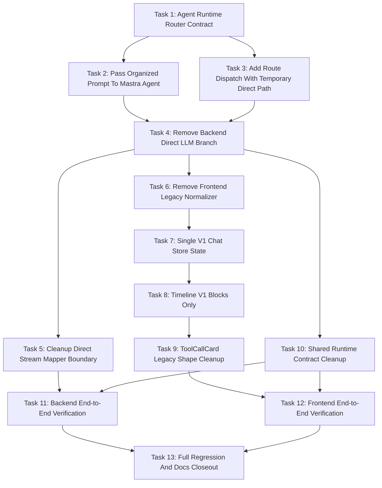

# Chat Agent Runtime Only Todo Tasks

> For implementation agents: execute task-by-task. Each task should leave the codebase in a verifiable state and should not broaden scope beyond the stated boundaries.

## Goal

Remove the independent chat direct LLM execution path from BloomAI chat and make chat enter an Agent Runtime router first. The selected agent may answer directly with the configured LLM model when no tool/skill is needed, or call tools/skills before synthesizing the final answer.

## Architecture

`chat.route.ts` remains the HTTP/SSE boundary. It builds/persists chat context and dispatches into an Agent Runtime router. The router selects the default Mastra chat agent or future chat-capable agents. The frontend consumes only v1 `ResponseStreamEvent` events and no longer maintains a legacy direct LLM compatibility UI path.

## Task 1: Define Agent Runtime Router Contract And Prompt Input

### Functional Goal

Create a stable backend interface between `chat.route.ts` and chat-capable agents. This contract must carry organized prompt context so agents can answer with history, persona, active app, and clipboard context.

### Functional List

- Define a chat agent routing input type that includes `sessionId`, optional `agentId`, raw `content`, selected `model`, `maxSteps`, and organized prompt.
- Define a router-facing runtime event type that reuses the existing Mastra chat agent runtime event shape.
- Add a default agent id for the current chat agent.
- Ensure the contract supports future agents without changing `chat.route.ts`.

### Functions, Interfaces, Files

- Create or modify: `src/server/agent/runtime/chat-agent-router.ts`
  - `DEFAULT_CHAT_AGENT_ID`
  - `ChatAgentRouteInput`
  - `streamChatAgentRoute(input: ChatAgentRouteInput): AsyncGenerator<ChatAgentRuntimeEvent>`
  - `resolveChatAgentRoute(agentId?: string)`
- Modify: `src/server/agent/index.ts`
  - Export the router contract.
- Use existing types:
  - `OrganizedChatPrompt` from `src/server/prompts/types.ts`
  - `ChatAgentRuntimeEvent` from `src/server/agent/mastra/types.ts`
  - `LlmMessage` from `src/server/llm/types.ts`

### Do Not Modify Boundary

- Do not change provider files.
- Do not change frontend state yet.
- Do not remove `streamChatCompletion` in this task.
- Do not change Settings UI text.
- Do not introduce agent marketplace or custom agent CRUD.

### Unit Test Strategy

- Add `src/server/agent/runtime/chat-agent-router.test.ts`.
- Test default route:
  - Given no `agentId`, router resolves the default chat agent.
- Test explicit current route:
  - Given `agentId: 'chat'`, router resolves the current Mastra chat agent.
- Test unsupported agent id:
  - Given an unknown id, router returns an agent runtime error event or throws a typed error, depending on chosen implementation.

### Integration Test Strategy

- None required in this task. Route integration comes later.

### Use Case Test Strategy

- Use a fake organized prompt with:
  - system prompt
  - one prior user message
  - one prior assistant message
  - current user message
- Assert router input preserves the full prompt object when forwarding to current agent adapter.

### Completion Checklist

- [ ] Router file exists.
- [ ] Router exports are available from `src/server/agent/index.ts`.
- [ ] Router supports default chat agent.
- [ ] Router input includes organized prompt.
- [ ] Tests cover default and unknown agent selection.

### Key Acceptance Evidence

- Passing router unit test output.
- Typecheck confirms `ChatAgentRouteInput.prompt` is required.
- Code reference showing route callers can use the router without importing Mastra-specific adapter functions directly.

## Task 2: Pass Organized Prompt Context Into Mastra Chat Agent Runtime

### Functional Goal

Ensure the Mastra chat agent receives the same context previously used by direct LLM: persona system prompt, history, active app, clipboard context, and current user message.

### Functional List

- Extend `ChatAgentRunInput` to include organized prompt.
- Keep `content` as a convenience field, but stop using it as the only agent input.
- Add a prompt composition helper if Mastra streaming only accepts a string.
- Preserve `LlmMessage`.
- Keep model resolution through `resolveRuntimeModel({ consumer: 'agent', modality: 'text' })`.

### Functions, Interfaces, Files

- Modify: `src/server/agent/mastra/types.ts`
  - `ChatAgentRunInput`
  - Add `prompt: OrganizedChatPrompt` or equivalent prompt payload.
- Modify: `src/server/agent/mastra/chat-agent-runtime-adapter.ts`
  - `runChatAgentV1(input)`
  - `maybeStreamAgent(agent, input, maxSteps)`
  - Add helper such as `createAgentPromptInput(input.prompt, input.content)`.
- Modify: `src/server/agent/mastra/chat-agent.ts`
  - `CreateChatAgentOptions`
  - `createChatAgent(model, options)`
  - Allow runtime system prompt additions or instructions derived from organized prompt.
- Use existing:
  - `organizeChatPrompt` from `src/server/prompts/prompt.ts`
  - `LlmMessage` from `src/server/llm/types.ts`

### Do Not Modify Boundary

- Do not add a second prompt organization system.
- Do not bypass `buildChatContext` or `organizeChatPrompt`.
- Do not delete direct LLM route branch in this task.
- Do not change tool selection policy.
- Do not delete `LlmMessage`.

### Unit Test Strategy

- Update `src/server/agent/mastra/chat-agent-runtime-adapter.test.ts`.
- Add tests for prompt forwarding:
  - Input prompt includes system and history.
  - Agent stream receives context, not only latest `content`.
- Add test for no-tool response:
  - Agent returns deltas and done with `toolCalls: []`.
- Add test for model resolution:
  - Requested model still resolves with `consumer: 'agent'`.

### Integration Test Strategy

- Not required yet. Full route integration comes after `chat.route.ts` uses the router.

### Use Case Test Strategy

- User asks: "What did I ask earlier?"
- Given history contains an earlier message, fake agent input should include that history.
- User has active app and clipboard context; fake agent input should include those context lines through organized prompt.

### Completion Checklist

- [ ] `ChatAgentRunInput` includes organized prompt.
- [ ] `runChatAgentV1` consumes organized prompt.
- [ ] Tests prove latest content is not the only agent input.
- [ ] No provider-level stream functions are removed.
- [ ] `LlmMessage` remains available.

### Key Acceptance Evidence

- Passing Mastra adapter unit tests.
- Snapshot or assertion showing composed agent input includes system prompt, history, and latest user content.
- Typecheck showing no missing prompt fields in agent runtime calls.

## Task 3: Add Route-Level Agent Runtime Dispatch While Keeping Existing Direct Path Temporarily

### Functional Goal

Introduce the Agent Runtime router into `chat.route.ts` behind the current route behavior, so route tests can validate context passing and agent dispatch before deleting direct fallback.

### Functional List

- Build prompt context as today.
- Pass `organizeChatPrompt` output into `streamChatAgentRoute`.
- Keep current feature flag/direct fallback temporarily for comparison only.
- Add tests that prove the agent route path receives full prompt context.

### Functions, Interfaces, Files

- Modify: `src/server/routes/chat.route.ts`
  - `chatRouter.post('/stream', ...)`
  - `streamMastraChat` or new wrapper `streamAgentChat`
  - `createAgentChatSource`
- Import:
  - `streamChatAgentRoute` from `src/server/agent/runtime/chat-agent-router.ts`
- Modify tests:
  - `src/server/routes/chat.route.test.ts`

### Do Not Modify Boundary

- Do not remove direct LLM branch yet.
- Do not change frontend.
- Do not change provider tests.
- Do not rename settings keys or Settings UI copy.

### Unit Test Strategy

- Update route unit tests to mock `streamChatAgentRoute`.
- Assert route passes:
  - `sessionId`
  - selected `model`
  - `content`
  - `prompt.system`
  - `prompt.messages`
  - `maxSteps`
- Assert missing session still returns SSE error as before.

### Integration Test Strategy

- Keep existing chat route integration tests passing while new agent dispatch tests are added.
- Do not remove direct fallback assertions until Task 4.

### Use Case Test Strategy

- Session with persona and two prior messages sends a new message.
- Route calls agent router with organized prompt containing persona and history.

### Completion Checklist

- [ ] `chat.route.ts` can call Agent Runtime router.
- [ ] Agent path receives organized prompt.
- [ ] Existing behavior is not removed yet.
- [ ] Tests cover context handoff from route to router.

### Key Acceptance Evidence

- Passing `chat.route.test.ts` subset for context handoff.
- Test assertion showing router mock receives `prompt.messages` with history and current user message.

## Task 4: Remove Chat Direct LLM Branch And Fallback From Backend Route

### Functional Goal

Make chat route use Agent Runtime as the only chat-facing runtime. Agent failure should surface as agent runtime failure, not fallback to direct LLM.

### Functional List

- Remove route-level feature flag switch between Mastra agent and direct LLM.
- Remove direct LLM fallback when agent produces no output or errors before output.
- Remove direct chat source and direct stream persistence path.
- Keep provider-level stream capabilities untouched.
- Stop emitting new `runtime: 'direct-llm'` from chat route.

### Functions, Interfaces, Files

- Modify: `src/server/routes/chat.route.ts`
  - Delete imports:
    - `streamChatCompletion`
    - `mapLlmStreamToResponseEvents`
  - Delete helpers:
    - `getAgentRuntimeEnabled`
    - `getAgentRuntimeProvider`
    - `shouldUseAgentRuntime`
    - direct fallback-specific debug helpers
    - `createLegacyChatSource`
    - `streamLegacyChat`
  - Keep helpers:
    - `getAgentRuntimeMaxSteps` or replace with agent max steps config
    - `persistAssistantFromWriter`
    - `getTokenCount`
- Modify: `src/server/routes/chat-response-stream.ts`
  - Replace default runtime fallback away from `'direct-llm'`.
- Modify tests:
  - `src/server/routes/chat.route.test.ts`
  - `src/server/routes/chat-response-stream.test.ts`

### Do Not Modify Boundary

- Do not delete provider `streamChat` functions.
- Do not delete `createOllamaProvider`.
- Do not delete `LlmMessage`.
- Do not change frontend in this task.
- Do not rename Settings UI copy.

### Unit Test Strategy

- Rewrite direct fallback route tests:
  - Remove expectations that `streamChatCompletion` is called.
  - Assert router is called for normal chat.
  - Assert no direct LLM fallback occurs when agent errors before output.
  - Assert agent `response_failed` event is sent.
- Update `chat-response-stream` tests:
  - New failed/completed traces should default to agent runtime or require explicit runtime.

### Integration Test Strategy

- Route SSE test:
  - Agent emits no-tool deltas and done.
  - SSE emits v1 events with `runtime: 'mastra-chat-agent-v1'`.
  - Assistant message persists.
- Agent failure test:
  - Agent emits error before content.
  - SSE emits `response_failed`.
  - `streamChatCompletion` mock is not present or not called.

### Use Case Test Strategy

- Plain question: "Explain TypeScript union types."
  - No tools.
  - Agent runtime answers.
  - Trace has `toolCalls: []`.
- Agent startup failure:
  - User sees one failed response.
  - No hidden fallback assistant answer appears.

### Completion Checklist

- [ ] `chat.route.ts` no longer imports `streamChatCompletion`.
- [ ] `chat.route.ts` no longer imports `mapLlmStreamToResponseEvents`.
- [ ] No route branch uses `agent_runtime_enabled=false` to select direct LLM.
- [ ] Agent error before output does not fallback.
- [ ] New chat traces do not emit `direct-llm`.
- [ ] Provider stream code remains intact.

### Key Acceptance Evidence

- `rg "streamChatCompletion|mapLlmStreamToResponseEvents|streamLegacyChat|falling back to direct LLM" src/server/routes/chat.route.ts` returns no matches.
- Passing route tests for no-tool answer, tool answer, and agent failure.
- Persisted assistant trace in test contains `runtime: 'mastra-chat-agent-v1'`.

## Task 5: Decide And Apply Low-Level Direct Stream Mapper Cleanup

### Functional Goal

Remove or deprecate direct LLM response mapping only after chat route no longer uses it, while preserving provider-level `streamChat` capabilities.

### Functional List

- Audit remaining usages of `src/server/llm/response-event-mapper.ts`.
- If only chat route used it, delete file and tests.
- If a non-chat utility still uses it, mark it as low-level utility and ensure chat route does not import it.
- Keep provider tests for `streamChat`.
- Keep `LlmMessage`.

### Functions, Interfaces, Files

- Candidate delete:
  - `src/server/llm/response-event-mapper.ts`
  - `src/server/llm/response-event-mapper.test.ts`
- Modify carefully:
  - `src/server/llm/index.ts`
  - `src/server/llm/types.ts`
  - `src/server/llm/llm-runtime.integration.test.ts`
- Keep:
  - `src/server/llm/providers/*.ts`
  - `src/server/llm/providers/*.test.ts`

### Do Not Modify Boundary

- Do not delete provider `streamChat`.
- Do not delete `createOllamaProvider`.
- Do not delete model/provider registry routes.
- Do not remove image/video generation.
- Do not remove `LlmMessage`.

### Unit Test Strategy

- If mapper is deleted:
  - Remove mapper tests.
  - Ensure no imports remain.
- If mapper remains:
  - Keep mapper tests but move wording away from active chat route behavior.
- Provider tests:
  - Keep existing provider stream tests passing.

### Integration Test Strategy

- Run LLM runtime integration tests that cover provider-level streams if `streamChatCompletion` remains.
- If `streamChatCompletion` is removed, replace integration coverage with provider helper tests and model registry/media route tests.

### Use Case Test Strategy

- Low-level provider stream is still callable in tests.
- Chat route cannot call direct stream mapper.

### Completion Checklist

- [ ] No chat route import of direct mapper.
- [ ] Provider-level stream tests still pass.
- [ ] `LlmMessage` remains exported or otherwise available.
- [ ] LLM model/provider management still works.

### Key Acceptance Evidence

- `rg "mapLlmStreamToResponseEvents" src` shows no chat route usage.
- Provider tests pass.
- LLM route tests for `/llm/models` and `/llm/providers` pass.

## Task 6: Remove Frontend Legacy Chat Stream Normalizer

### Functional Goal

Make the frontend API client consume only v1 `ResponseStreamEvent` SSE chunks from chat stream.

### Functional List

- Remove legacy normalizer import and usage.
- Delete legacy renderer chat stream event types.
- Parse SSE JSON as `ResponseStreamEvent`.
- On malformed chunks, produce a v1 failure event rather than legacy `error`.
- Delete normalizer tests.

### Functions, Interfaces, Files

- Modify: `src/renderer/api/index.ts`
  - `platform.chatStream`
  - Remove `ChatToolCallView`
  - Remove `ChatToolCallStartEvent`
  - Remove `ChatToolCallResultEvent`
  - Remove `ChatToolCallErrorEvent`
  - Remove legacy `ChatStreamEvent`
- Delete:
  - `src/renderer/api/chat-stream-normalizer.ts`
  - `src/renderer/api/chat-stream-normalizer.test.ts`
- Use:
  - `ResponseStreamEvent`
  - optionally `ResponseStreamEventSchema`

### Do Not Modify Boundary

- Do not change store state in this task unless necessary for compile.
- Do not change Timeline in this task.
- Do not change backend.
- Do not add new UI.

### Unit Test Strategy

- Add or update renderer API tests to cover:
  - v1 event pass-through.
  - `[DONE]` ends stream.
  - malformed JSON yields `response_failed`.
  - network abort yields `response_failed` with abort-like code.

### Integration Test Strategy

- Use mocked fetch stream in tests.
- Confirm `platform.chatStream` yields the same v1 event payloads that backend sends.

### Use Case Test Strategy

- Backend sends:
  - `response_started`
  - `content_block_started`
  - `content_delta`
  - `response_completed`
- Frontend API yields those events unchanged.

### Completion Checklist

- [ ] `createChatStreamNormalizer` import removed.
- [ ] `chat-stream-normalizer.ts` deleted.
- [ ] Legacy chat event types removed from renderer API.
- [ ] API tests cover v1-only stream parsing.

### Key Acceptance Evidence

- `rg "createChatStreamNormalizer|LegacyChatStreamEvent|ChatToolCallStartEvent" src/renderer` returns no production matches.
- Passing renderer API stream tests.

## Task 7: Simplify Chat Store To A Single V1 Streaming Response State

### Functional Goal

Remove duplicate direct/legacy streaming state from Zustand chat store and use `streamingResponsesBySession` as the single source of truth for active response UI.

### Functional List

- Remove `streamingText` state.
- Remove `streamError` state if Timeline errors render from response blocks.
- Remove `toolCallsBySession`.
- Remove `clearStreamingToolCalls`.
- Continue using `reduceStreamingResponse`.
- Keep selectors like `deriveStreamingText` and `deriveToolCalls` if components or tests still need derived views.

### Functions, Interfaces, Files

- Modify: `src/renderer/store/index.ts`
  - `ChatState`
  - `ChatActions`
  - `sendMessage`
  - `clearMessages`
  - remove `clearStreamingToolCalls`
  - remove `setStreamError` if no caller remains
- Modify tests:
  - `src/renderer/store/index.test.ts`
- Keep:
  - `src/renderer/store/chat-response-reducer.ts`

### Do Not Modify Boundary

- Do not change backend.
- Do not change provider files.
- Do not change Settings UI.
- Do not remove reducer block support for tool calls.

### Unit Test Strategy

- Rewrite store tests around `streamingResponsesBySession`.
- Test streaming lifecycle:
  - starts with `response_started`
  - appends markdown delta
  - completes and reloads messages.
- Test failed response:
  - `response_failed` remains in `streamingResponsesBySession`.
  - Error block is present.
- Test tool call:
  - tool block is present in streaming response blocks.

### Integration Test Strategy

- Store with mocked `platform.chatStream` yielding v1 events.
- Store with mocked `platform.getMessages` after successful completion.

### Use Case Test Strategy

- Plain no-tool answer:
  - Store derives assistant text from markdown blocks.
  - No tool block exists.
- Tool answer:
  - Store holds tool call block before markdown answer.
- Failure:
  - Store holds error block for Timeline.

### Completion Checklist

- [ ] `streamingText` removed from `ChatState`.
- [ ] `toolCallsBySession` removed from `ChatState`.
- [ ] `clearStreamingToolCalls` removed.
- [ ] Store tests use v1 response blocks.
- [ ] Existing message reload behavior still works.

### Key Acceptance Evidence

- `rg "streamingText|toolCallsBySession|clearStreamingToolCalls" src/renderer/store src/renderer/pages/Chat` has no production matches except permitted derived selector names.
- Passing store tests.

## Task 8: Simplify Chat Timeline Rendering To V1 Blocks Only

### Functional Goal

Remove direct/legacy timeline rendering and render active assistant output exclusively from v1 response blocks.

### Functional List

- Remove `streamingText`, `streamError`, and `toolCalls` props from `Timeline`.
- Remove legacy fallback branch that renders separate tool cards and streaming message.
- Keep `renderStreamingResponse`.
- Keep `TimelineWaitState`.
- Keep `TimelineErrorBlock`.
- Keep grouped tool call rendering.

### Functions, Interfaces, Files

- Modify: `src/renderer/pages/Chat/Timeline.tsx`
  - `TimelineProps`
  - `shouldShowStreamingBubble` deletion
  - main render branch
  - scroll effect dependencies
- Modify: `src/renderer/pages/Chat/ChatPanel.tsx`
  - Props passed to `Timeline`
- Modify tests:
  - `src/renderer/pages/Chat/Timeline.test.tsx`
  - `src/renderer/pages/Chat/ChatPanel.test.tsx` if props are covered

### Do Not Modify Boundary

- Do not remove `MessageBubble`.
- Do not remove `ToolCallGroupCard`.
- Do not delete `ToolCallCard` yet unless Task 9 chooses that.
- Do not change backend.

### Unit Test Strategy

- Timeline tests:
  - renders empty state.
  - renders historical messages.
  - renders active markdown block.
  - renders grouped tool blocks.
  - renders wait state after `response_started` before any block.
  - renders error block on `response_failed`.
- Remove tests asserting legacy fallback text.

### Integration Test Strategy

- Component-level render using a full `StreamingResponseState`.
- No need for browser E2E in this task.

### Use Case Test Strategy

- No-tool agent answer:
  - One assistant markdown bubble appears.
- Tool answer:
  - Tool group appears before/around assistant answer.
- Agent failure:
  - Timeline error block appears.

### Completion Checklist

- [ ] `TimelineProps` no longer includes legacy stream props.
- [ ] `ChatPanel` passes `streamingResponse` and `isStreaming` only for active response.
- [ ] Legacy fallback branch removed.
- [ ] Timeline tests cover v1 states.

### Key Acceptance Evidence

- `rg "legacy fallback text|shouldShowStreamingBubble|streamingText|toolCalls=" src/renderer/pages/Chat` shows no production legacy branch.
- Passing Timeline and ChatPanel tests.

## Task 9: Remove Legacy ToolCallCard Data Shape And Prune CSS Safely

### Functional Goal

Ensure tool UI accepts v1 `ToolCallBlock` data only. Keep or delete `ToolCallCard` based on actual v1 rendering needs, but remove legacy data compatibility.

### Functional List

- Remove `LegacyToolCallData`.
- Change `ToolCallData` to `ToolCallBlock` if `ToolCallCard` remains.
- Update `ToolCallCard` tests to use `ToolCallBlock`.
- Keep `ToolCallGroupCard` as the preferred grouped agent tool UI.
- Remove `.stream-error` CSS if Task 8 removed stream error UI.
- Remove `.tcc-*` CSS only if `ToolCallCard` is deleted.

### Functions, Interfaces, Files

- Modify or delete: `src/renderer/pages/Chat/ToolCallCard.tsx`
  - `LegacyToolCallData`
  - `ToolCallData`
  - `normalizeToolCall`
- Modify or delete: `src/renderer/pages/Chat/ToolCallCard.test.tsx`
- Keep: `src/renderer/pages/Chat/ToolCallGroupCard.tsx`
- Modify: `src/renderer/styles/global.css`
  - `.stream-error`
  - `.tool-call-card`
  - `.tcc-*`

### Do Not Modify Boundary

- Do not remove grouped tool call UI.
- Do not remove v1 tool block support from reducer.
- Do not change backend event shape.
- Do not delete CSS used by still-mounted components.

### Unit Test Strategy

- If keeping `ToolCallCard`:
  - running block renders.
  - success block renders output summary/results.
  - error block renders `ResponseError`.
  - no tests pass legacy string error shape.
- If deleting `ToolCallCard`:
  - update Timeline tests to assert grouped card covers single tool call as well.

### Integration Test Strategy

- Component render tests are sufficient.

### Use Case Test Strategy

- Web search tool call with output results renders correctly.
- Failed tool call with `ResponseError` renders correctly.

### Completion Checklist

- [ ] `LegacyToolCallData` removed.
- [ ] Tool UI tests use `ToolCallBlock`.
- [ ] CSS pruning matches actual components.
- [ ] No legacy tool call shape remains in production renderer code.

### Key Acceptance Evidence

- `rg "LegacyToolCallData|ToolCallData = ToolCallBlock \\|" src/renderer` returns no matches.
- Passing ToolCallCard or ToolCallGroupCard tests.

## Task 10: Update Shared Runtime Contract To Stop New Direct-LLM Emissions

### Functional Goal

Prevent new chat responses from using `runtime: 'direct-llm'` while preserving old message parsing if needed.

### Functional List

- Decide whether `ResponseRuntime` keeps `'direct-llm'` only for backward compatibility.
- Ensure new backend writer defaults do not create direct LLM runtime.
- Update tests that use direct runtime fixtures for active chat behavior.
- Keep parsing old traces if persisted data may contain direct runtime.

### Functions, Interfaces, Files

- Modify: `src/shared/schemas/response.ts`
  - `ResponseRuntime`
  - `ResponseStreamEventSchema`
- Modify: `src/shared/schemas/message-trace.ts`
  - `parseMessageTrace`
- Modify tests:
  - `src/shared/schemas/response.test.ts`
  - `src/shared/schemas/message-trace.test.ts`
  - `src/renderer/store/chat-response-reducer.test.ts`
  - `src/server/routes/chat-response-stream.test.ts`

### Do Not Modify Boundary

- Do not break old persisted message trace parsing without an explicit migration.
- Do not rename Settings UI.
- Do not change provider model registry.

### Unit Test Strategy

- Test new chat events with `mastra-chat-agent-v1`.
- Test old saved trace with `direct-llm` still parses if backward compatibility is retained.
- Test writer does not default to `direct-llm`.

### Integration Test Strategy

- Route integration in Task 11 should verify no new direct runtime.

### Use Case Test Strategy

- Old conversation with direct trace still loads.
- New conversation never emits direct trace.

### Completion Checklist

- [ ] New event fixtures use agent runtime.
- [ ] Backward compatibility decision documented in tests.
- [ ] Writer defaults no longer produce direct runtime.

### Key Acceptance Evidence

- Passing shared schema tests.
- `rg "runtime: 'direct-llm'|runtime=direct-llm" src` only shows backward-compatibility tests/docs, not active runtime code.

## Task 11: End-To-End Backend Verification For Agent-Only Chat

### Functional Goal

Prove backend chat behavior works for no-tool answers, tool answers, context preservation, persistence, and failure without direct fallback.

### Functional List

- Add/finish route integration tests for agent-only chat.
- Cover no-tool agent answer.
- Cover tool-call agent answer.
- Cover context passed to agent.
- Cover agent failure before output.
- Cover agent failure after visible tool/content.
- Cover assistant message persistence with agent trace.

### Functions, Interfaces, Files

- Modify: `src/server/routes/chat.route.test.ts`
- Modify: `src/server/agent/mastra/chat-agent-runtime-adapter.test.ts`
- Modify: `src/server/routes/chat-response-stream.test.ts`
- Possibly add test helpers in existing test file only.

### Do Not Modify Boundary

- Do not add live provider network calls.
- Do not require real Mastra provider credentials.
- Do not test frontend here.

### Unit Test Strategy

- Route tests with mocked agent runtime events:
  - `delta`
  - `tool_call_start`
  - `tool_call_result`
  - `done`
  - `error`

### Integration Test Strategy

- Use Express app test path for `POST /api/v1/chat/stream`.
- Parse SSE chunks and assert event order.
- Inspect in-memory/test database records for persisted assistant message.

### Use Case Test Strategy

- Plain user prompt:
  - Returns `response_started`, markdown block, `response_completed`.
  - Trace has `toolCalls: []`.
- Search prompt:
  - Returns tool events and answer events.
  - Trace has web search tool call.
- Failure:
  - Returns `response_failed`.
  - No direct answer follows.

### Completion Checklist

- [ ] Backend route tests cover no-tool answer.
- [ ] Backend route tests cover tool answer.
- [ ] Backend route tests cover context preservation.
- [ ] Backend route tests cover failure without fallback.
- [ ] Persistence assertions use agent trace.

### Key Acceptance Evidence

- Passing command: `node node_modules/vitest/vitest.mjs run src/server/routes/chat.route.test.ts src/server/agent/mastra/chat-agent-runtime-adapter.test.ts src/server/routes/chat-response-stream.test.ts`
- SSE event snapshot from test shows `runtime: 'mastra-chat-agent-v1'`.
- Test DB assistant row includes agent trace JSON.

## Task 12: End-To-End Frontend Verification For V1-Only Chat UI

### Functional Goal

Prove frontend API, store, and Timeline correctly render agent-only v1 response streams without legacy direct LLM UI state.

### Functional List

- Verify API stream yields v1 events.
- Verify store reduces v1 events into response blocks.
- Verify Timeline renders markdown, tool groups, wait state, and errors.
- Verify no legacy direct stream branch is used.

### Functions, Interfaces, Files

- Modify tests:
  - `src/renderer/api/index.test.ts` if existing or add focused test file.
  - `src/renderer/store/index.test.ts`
  - `src/renderer/pages/Chat/Timeline.test.tsx`
  - `src/renderer/pages/Chat/ChatPanel.test.tsx`
  - `src/renderer/pages/Chat/ToolCallGroupCard.test.tsx`

### Do Not Modify Boundary

- Do not change backend in this task.
- Do not introduce visual redesign.
- Do not rename Settings UI.

### Unit Test Strategy

- API test:
  - v1 SSE chunks pass through.
- Store test:
  - response blocks build correctly.
- Timeline test:
  - v1 response renders correctly.
- Tool group test:
  - grouped tool calls render statuses.

### Integration Test Strategy

- Component-level integration with mocked store/platform.
- Optional browser smoke test only after dev server exists; not required for this task document.

### Use Case Test Strategy

- No-tool agent answer renders one assistant bubble.
- Tool answer renders tool group plus assistant bubble.
- Agent error renders timeline error block.

### Completion Checklist

- [ ] Frontend tests no longer rely on `streamingText`.
- [ ] Frontend tests no longer rely on `toolCallsBySession`.
- [ ] Timeline renders from `streamingResponse.blocks`.
- [ ] Agent error appears through `TimelineErrorBlock`.

### Key Acceptance Evidence

- Passing command: `node node_modules/vitest/vitest.mjs run src/renderer/api src/renderer/store src/renderer/pages/Chat`
- `rg "createChatStreamNormalizer|LegacyChatStreamEvent|streamingText|toolCallsBySession" src/renderer` shows no production legacy usage.

## Task 13: Full Regression And Documentation Closeout

### Functional Goal

Verify the entire migration and record final behavior so future work does not reintroduce a second chat runtime.

### Functional List

- Run focused backend and frontend tests.
- Run typecheck/build.
- Update docs if implementation deviates from plan.
- Record known compatibility decisions around old `direct-llm` traces.

### Functions, Interfaces, Files

- Modify docs if needed:
  - `docs/chat/chat-agent-runtime-only-migration-plan.md`
  - `docs/chat/chat-agent-runtime-only-todo-tasks.md`
  - optional verification doc in `docs/agent/`
- No production file should be modified in this task unless fixing verification failures.

### Do Not Modify Boundary

- Do not add new features.
- Do not broaden to agent marketplace.
- Do not rename Settings UI.
- Do not remove provider stream capabilities.

### Unit Test Strategy

- Run all changed test files.
- Run shared schema tests.

### Integration Test Strategy

- Run route integration tests.
- Run renderer integration/component tests.

### Use Case Test Strategy

- Manual or scripted smoke checks:
  - Plain prompt no tool.
  - Search prompt with tool.
  - Agent failure.
  - Old message with direct trace still loads if compatibility is kept.

### Completion Checklist

- [ ] Focused backend tests pass.
- [ ] Focused frontend tests pass.
- [ ] Typecheck passes.
- [ ] Build passes.
- [ ] Docs reflect final implementation choices.
- [ ] No new chat direct LLM route remains.

### Key Acceptance Evidence

- Test command outputs.
- Typecheck/build output.
- `rg` evidence:
  - no `streamLegacyChat` in production.
  - no `createChatStreamNormalizer` in production.
  - no new active `direct-llm` runtime emission.
- Optional screenshots or SSE logs showing no-tool and tool chat behavior.

## Task Dependencies And Parallel Work

### Dependency List

- Task 1 must happen before Tasks 2, 3, and 4.
- Task 2 must happen before Task 4 because removing direct LLM without context handoff would break chat memory/persona behavior.
- Task 3 can be skipped if implementing Task 4 in one pass, but it is recommended as a safer checkpoint.
- Task 4 must happen before Task 5, because cleanup depends on route no longer using direct mapper.
- Task 4 must happen before Tasks 6-8, because frontend v1-only cleanup assumes backend emits v1 only.
- Task 6 must happen before Task 7.
- Task 7 must happen before Task 8.
- Task 8 should happen before Task 9.
- Task 10 can run after Task 4 and in parallel with Tasks 6-9 if the team coordinates fixtures.
- Task 11 depends on Tasks 1-5 and 10.
- Task 12 depends on Tasks 6-10.
- Task 13 depends on all implementation tasks.

### Can Be Parallelized

- After Task 1 contract is merged:
  - Task 2 and parts of Task 3 can be worked on together if the route uses a mocked router.
- After Task 4 backend behavior is merged:
  - Task 5 backend cleanup and Task 6 frontend API cleanup can proceed in parallel.
- After Task 6 frontend API cleanup:
  - Task 7 store cleanup and Task 10 shared fixture cleanup can proceed in parallel with coordination.
- Task 11 backend verification and Task 12 frontend verification can run in parallel after their prerequisites.

### Should Be Sequential

- Task 1 -> Task 2 -> Task 4.
- Task 6 -> Task 7 -> Task 8.
- Task 13 last.

## Mermaid Task Dependency Graph

## Phase Checkpoints And Recommended Order

### Phase 1: Backend Contract And Context

Recommended tasks:

1. Task 1: Define Agent Runtime Router Contract And Prompt Input
2. Task 2: Pass Organized Prompt Context Into Mastra Chat Agent Runtime
3. Task 3: Add Route-Level Agent Runtime Dispatch While Keeping Existing Direct Path Temporarily

Checkpoint:

- [ ] Router contract exists.
- [ ] Mastra adapter receives organized prompt.
- [ ] Route can call agent router with full context.
- [ ] Focused backend tests pass.

### Phase 2: Backend Agent-Only Runtime

Recommended tasks:

1. Task 4: Remove Chat Direct LLM Branch And Fallback From Backend Route
2. Task 5: Decide And Apply Low-Level Direct Stream Mapper Cleanup
3. Task 10: Update Shared Runtime Contract To Stop New Direct-LLM Emissions

Checkpoint:

- [ ] No backend chat direct fallback remains.
- [ ] New traces use agent runtime.
- [ ] Provider stream capabilities still pass tests.
- [ ] Route integration tests pass for no-tool, tool, and failure cases.

### Phase 3: Frontend V1-Only Stream UI

Recommended tasks:

1. Task 6: Remove Frontend Legacy Chat Stream Normalizer
2. Task 7: Simplify Chat Store To A Single V1 Streaming Response State
3. Task 8: Simplify Chat Timeline Rendering To V1 Blocks Only
4. Task 9: Remove Legacy ToolCallCard Data Shape And Prune CSS Safely

Checkpoint:

- [ ] Frontend no longer imports legacy normalizer.
- [ ] Store has one streaming response state.
- [ ] Timeline renders only v1 response blocks.
- [ ] Tool UI accepts v1 tool blocks only.
- [ ] Renderer tests pass.

### Phase 4: End-To-End Verification And Closeout

Recommended tasks:

1. Task 11: End-To-End Backend Verification For Agent-Only Chat
2. Task 12: End-To-End Frontend Verification For V1-Only Chat UI
3. Task 13: Full Regression And Documentation Closeout

Checkpoint:

- [ ] Backend focused tests pass.
- [ ] Frontend focused tests pass.
- [ ] Typecheck passes.
- [ ] Build passes.
- [ ] Documentation reflects actual behavior.
- [ ] No production chat path emits new `direct-llm` runtime.
