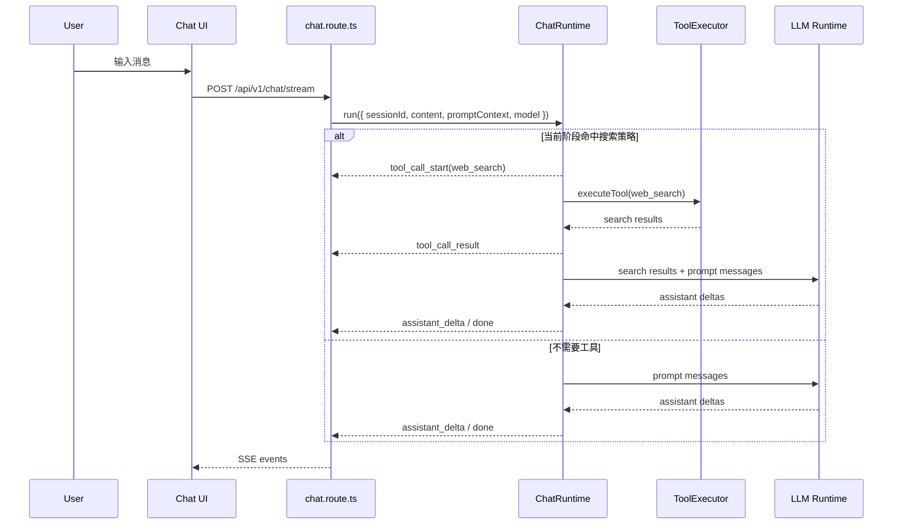

# BloomAI 聊天窗 Tool Calling 与 Agent Runtime 兼容设计

## 1. 背景

当前 BloomAI 已经具备独立的 Tools System、`web_search` 工具、`ToolCallCard` 组件，以及 `tool_permissions` / `tool_runs` 这套权限与审计基础。但聊天链路本身还没有真正接上工具执行，`chat.route.ts` 仍然是“收消息、组 prompt、调用 LLM、流式返回文本”的线性流程。

后续 chat 会继续演进为 Agent：先接入 Agent Runtime，再支持 ReAct、Plan-and-Execute、多轮工具 loop、工具结果反思和最终答案合成。因此，这次不能把工具调用写成一个临时的“chat 自动搜索”功能。正确方向是：先建设未来 Agent Runtime 必须复用的底座，再用 `web_search` 做第一个最小可用策略。

## 2. 结论

这件事仍然要做，但做法要改成 **Runtime-first**：

- 要做：Tool Call UI、SSE 工具事件、权限弹窗模型、工具 trace 持久化、`ChatRuntime` 稳定入口。
- 可以做得很薄：当前 `web_search` 的自动触发策略。
- 不要做：把 `chat.route.ts` 写成负责判断、执行、循环、反思的“小 Agent”。

推荐目标：

```text
chat.route.ts
  -> ChatRuntime.run(input)
      -> 当前阶段: RuleBasedSearchRuntime
      -> 下一阶段: ReActAgentRuntime
      -> 再下一阶段: PlanAndExecuteRuntime
```

这样现在的搜索能力不会浪费。未来替换成真正 Agent Runtime 时，前端 Tool Call 卡片、SSE 事件、权限确认、`tool_runs`、`messages.tool_calls` 都能继续使用。

## 3. 设计目标

- 聊天界面能展示工具调用过程，而不是只展示最终文本。
- `web_search` 作为第一个工具调用场景，用来验证协议、UI 和 trace。
- 工具判断不写死在 route 层，统一进入 `ChatRuntime`。
- Runtime 输出统一事件流，前端不需要知道背后是规则搜索、ReAct，还是 Plan-and-Execute。
- 权限弹窗先按三档权限建模，`web_search` 当前默认低危自动放行。
- 持久化以未来 Agent loop 可回放为标准，而不是只保存一次搜索结果。

## 4. 非目标

- 本阶段不实现完整 ReAct loop。
- 本阶段不实现 Plan-and-Execute 规划器。
- 本阶段不要求模型原生 tool calling 覆盖所有 provider。
- 本阶段不在前端直接调用工具。
- 本阶段不把复杂工具选择逻辑塞进 `chat.route.ts`。

## 5. UI 设计

### 5.1 聊天流中的 Tool Call 卡片

Tool Call 卡片是未来 Agent 运行轨迹的最小 UI 单元。它不仅服务 `web_search`，也服务后续的 `web_fetch`、`fs_read`、`image_gen`、`shell` 等工具。

卡片的三种基础状态：

- `running`：显示工具名、输入参数、运行中状态。
- `success`：显示耗时、结果摘要、输出预览。
- `error`：显示错误原因、失败状态、重试入口。

`web_search` 场景下展示：

- 工具名：`web_search`
- 查询词：Runtime 生成或模型生成的 query
- 结果数量：例如“6 条结果”
- Top 3 结果：标题、URL、snippet
- 耗时：例如“389ms”

交互建议：

- 点击卡片头部可折叠或展开。
- 默认展开正在运行的卡片，成功后可折叠。
- 展开后可复制原始结果。
- 失败时允许重试，但重试应重新进入 Runtime，而不是前端直接打工具 API。

### 5.2 Agent Step 与 Tool Call 的关系

未来 Agent 运行时，Tool Call 卡片可以作为 Agent Step 的子节点：

```text
Assistant is working...
  Step 1: 判断是否需要外部信息
    Tool: web_search [success]
  Step 2: 阅读搜索结果
  Step 3: 生成最终回答
```

当前阶段可以只渲染 Tool Call 卡片，不急着做完整 Agent Step UI。但事件协议要为 Agent Step 预留空间。

### 5.3 权限弹窗（三种）

`web_search` 当前不弹权限窗，因为它是 `network` 低危工具。但权限弹窗 UI 应该在本阶段设计清楚，避免后续高危工具接入时推翻交互。

- 低危 / `network`
  - 例：`web_search`、`web_fetch`
  - 默认自动放行
  - 只在 Tool Call 卡片中展示运行状态

- 中危 / `write`
  - 例：`fs_write`、`fs_edit`
  - 当前 session 首次调用时弹窗
  - 可选“仅本次允许”或“本 session 允许”

- 高危 / `shell`
  - 例：`shell`、非白名单命令执行
  - 必须强确认
  - 使用红色风险态
  - 可要求永久授权或二次输入确认

## 6. Runtime-first 架构

### 6.1 核心边界

`chat.route.ts` 只保留 HTTP / SSE 职责：

- 校验请求
- 建立 SSE
- 保存用户消息
- 调用 `ChatRuntime.run`
- 把 Runtime 事件转成 SSE
- 持久化最终消息和 trace

工具判断、工具执行、循环控制、最终答案合成，都不属于 route。

### 6.2 Runtime 接口草案

```ts
type ChatRuntimeInput = {
  sessionId: string
  content: string
  promptContext: ChatPromptContext
  model: string
}

type ChatRuntimeEvent =
  | { type: 'assistant_delta'; text: string }
  | { type: 'tool_call_start'; call: ToolCallViewModel }
  | { type: 'tool_call_result'; callId: string; output: unknown; durationMs: number }
  | { type: 'tool_call_error'; callId: string; error: string }
  | { type: 'usage'; input: number; output: number }
  | { type: 'done'; trace: ChatRunTrace }

interface ChatRuntime {
  run(input: ChatRuntimeInput): AsyncGenerator<ChatRuntimeEvent>
}
```

当前阶段实现：

```text
RuleBasedSearchRuntime
  -> detectSearchIntent
  -> executeTool('web_search')
  -> append tool result to prompt context
  -> stream final LLM answer
```

未来实现：

```text
ReActAgentRuntime
  -> think
  -> choose tool
  -> execute tool
  -> observe
  -> loop until final answer

PlanAndExecuteRuntime
  -> create plan
  -> execute steps
  -> revise plan if needed
  -> synthesize final answer
```

### 6.3 数据流



## 7. 当前 `web_search` 策略

`web_search` 只是 `RuleBasedSearchRuntime` 的第一种策略，用来验证 runtime 入口和 UI 事件，不代表最终 Agent 行为。

### 7.1 触发规则

先用可解释规则即可：

- 包含“搜索”“查一下”“找最新”“网上怎么说”
- 包含时效性词汇：`最新`、`今天`、`现在`、`刚刚`、`2026`
- 问题需要外部事实核验：新闻、价格、版本、官方文档、排行、产品规格
- 用户显式要求“给链接”“找资料”“检索结果”

输出结构：

```ts
type SearchIntent = {
  shouldSearch: boolean
  query: string
  confidence: number
  reason: string
}
```

### 7.2 未来迁移方式

当 ReAct Runtime 接入后，`SearchIntent` 不必删除，可以降级为：

- ReAct 前的快速 heuristic
- 工具候选排序信号
- “是否允许自动搜索”的默认 policy

也就是说，它不是最终决策者，只是未来 Agent Runtime 的辅助信号。

## 8. 事件协议设计

建议不要只发一个粗粒度 `tool_call`，而是拆成可扩展事件：

- `tool_call_start`
- `tool_call_result`
- `tool_call_error`
- `assistant_delta`
- `usage`
- `done`

前端可以把这些事件规约成 UI 状态：

```ts
type ChatTimelineItem =
  | { type: 'message'; message: Message }
  | { type: 'tool_call'; call: ToolCallData }
  | { type: 'streaming_message'; text: string }
```

这样未来 Agent loop 中出现多个工具调用时，前端无需重新设计状态模型。

## 9. 需要修改的功能和文件

### 9.1 后端

- `src/server/routes/chat.route.ts`
  - 从“直接调用 LLM”改成“调用 `ChatRuntime`”
  - 继续负责 SSE 输出
  - 不直接实现搜索判断和工具 loop

- `src/server/chat/runtime.ts`
  - 新增 `ChatRuntime` 接口
  - 定义 Runtime 输入、输出事件、trace 类型

- `src/server/chat/rule-based-search-runtime.ts`
  - 当前阶段的最小 Runtime 实现
  - 命中搜索时执行 `web_search`
  - 未命中时退化为普通 LLM chat

- `src/server/chat/search-intent.ts`
  - 规则驱动的搜索意图识别
  - query 生成
  - confidence 和 reason 输出

- `src/server/chat/chat-events.ts`
  - 定义 SSE 事件结构
  - 保证 route 和 renderer 使用同一套事件名

- `src/server/tools/execute-tool.ts`
  - 继续作为工具执行唯一入口
  - 继续写入 `tool_runs`

- `src/server/db/repositories/message.repo.ts`
  - 使用 `tool_calls` 字段保存本轮 trace 摘要

- `src/server/llm/types.ts`
  - 不急着加入模型原生 tool calling
  - 只需补齐 Runtime 使用的聊天事件类型

### 9.2 前端

- `src/renderer/api/index.ts`
  - `chatStream` 支持 `tool_call_start / tool_call_result / tool_call_error`

- `src/renderer/store/index.ts`
  - 保存工具调用状态
  - 将 Runtime 事件合并进 Timeline 状态

- `src/renderer/pages/Chat/Timeline.tsx`
  - 渲染 `tool_call` 类型节点
  - 支持同一轮回复中出现多个工具卡片

- `src/renderer/pages/Chat/ToolCallCard.tsx`
  - 作为通用工具卡片，而不是只服务 `web_search`
  - 保留 running / success / error 三态

- `src/renderer/pages/Chat/MessageBubble.tsx`
  - 保持普通消息职责
  - 不承载工具执行态

- `src/renderer/pages/Tools/PermissionDialog.tsx`
  - 抽象为可被 chat runtime 调用链复用的权限确认 UI

### 9.3 共享类型

- `src/shared/schemas/index.ts`
  - 增加 Runtime 事件、Tool Call、Search Result、Permission Level 类型

## 10. 持久化与 trace

未来 Agent loop 会产生多步轨迹，因此本阶段就要避免只保存一个扁平搜索结果。

建议 trace 摘要结构：

```ts
type ChatRunTrace = {
  runtime: 'rule-based-search' | 'react' | 'plan-and-execute'
  toolCalls: Array<{
    callId: string
    toolId: string
    status: 'success' | 'error'
    input: unknown
    outputSummary?: string
    runId?: string
    durationMs?: number
  }>
}
```

保存位置：

- `tool_runs` 保存完整工具执行记录
- `messages.tool_calls` 保存本轮 assistant 回复关联的 trace 摘要
- 最终 assistant message 保存用户可读答案

## 11. 测试策略

### 11.1 单元测试

- `search-intent`
  - 能识别显式搜索请求
  - 能识别最新信息请求
  - 不误判普通闲聊和纯推理问题

- `RuleBasedSearchRuntime`
  - 命中搜索时发出 `tool_call_start`
  - 工具成功后发出 `tool_call_result`
  - 工具失败后发出 `tool_call_error`
  - 未命中时不调用工具

- `chat event reducer`
  - 能把工具事件合并成稳定 Timeline 状态
  - 支持一轮中多个工具调用

- `ToolCallCard`
  - running / success / error 三态正确
  - `web_search` 输出能展示 Top 3 结果

- `PermissionDialog`
  - 三档权限文案和视觉状态正确
  - `network` 工具默认不弹窗

### 11.2 集成测试

完整搜索链路：

1. 输入“帮我搜索 xxx 最新资料”
2. `chat.route.ts` 调用 `ChatRuntime`
3. Runtime 识别搜索意图
4. `executeTool('web_search')` 被调用
5. SSE 依次返回 `tool_call_start`、`tool_call_result`、`assistant_delta`、`done`
6. 前端出现 Tool Call 卡片
7. 最终 assistant 回答引用搜索结果
8. `tool_runs` 和 `messages.tool_calls` 都有记录

普通聊天反例：

1. 输入普通闲聊
2. Runtime 不调用工具
3. 前端不出现 Tool Call 卡片
4. 仍能正常流式返回 assistant 文本

失败链路：

1. 模拟 `web_search` 超时
2. SSE 返回 `tool_call_error`
3. UI 展示 error 卡片
4. Runtime 可选择继续生成“搜索失败后的回答”，或直接返回友好错误

## 12. 验收证据

- 聊天窗截图：`web_search` running 卡片
- 聊天窗截图：`web_search` success 卡片，展示 Top 3 搜索结果
- 聊天窗截图：工具失败 error 卡片
- SSE 日志：包含 `tool_call_start / tool_call_result / assistant_delta / done`
- 数据库记录：`tool_runs` 有 `web_search` 记录
- 数据库记录：assistant message 的 `tool_calls` 有 trace 摘要
- 单元测试通过：search intent、runtime、UI reducer、ToolCallCard
- 集成测试通过：搜索链路、普通聊天链路、失败链路

## 13. 推荐实施顺序

1. 先定义 Runtime 事件类型和 SSE 事件协议
2. 新增 `ChatRuntime` 接口
3. 将 `chat.route.ts` 改为调用 Runtime，而不是直接调用 LLM
4. 实现 `RuleBasedSearchRuntime`
5. 接入 `web_search`
6. 前端支持 Tool Call 卡片事件
7. 保存 `tool_runs` 和 `messages.tool_calls`
8. 补权限弹窗复用策略
9. 补单元测试和集成测试

## 14. 结论

现在仍然应该做 chat 调用 tool 的能力，但它的本质不是“临时搜索功能”，而是 Agent Runtime 的第一层地基。

`web_search` 是一块试金石：它低危、结果结构简单、用户价值明显，适合用来验证 Tool Call UI、SSE 事件、权限模型和 trace 持久化。只要把边界放在 `ChatRuntime`，这次工作就不会和未来 ReAct、Plan-and-Execute 冲突，反而会成为它们接入 chat 的铺路石。

