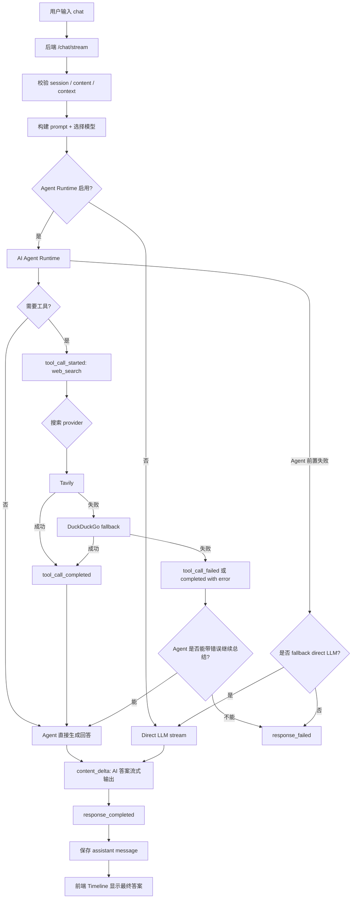

你的链路大方向是完整的，但还少了几类关键分支：**是否启用 Agent、工具调用是否失败、搜索是否降级、LLM 是否在有/无部分输出时失败、最终消息是否持久化成功**。更完整的链路可以这样看：

````

````

**你原链路里缺少的分支**

1. **Agent 未启用或不可用**
   - 当前可能直接走 Direct LLM，不一定经过 Agent。
   - Agent 如果启动前失败，合理策略是 fallback 到 Direct LLM。
2. **Agent 不调用 web search**
   - 有些问题不需要搜索，直接总结回答。
   - Timeline 这时只显示等待/生成状态，不显示工具卡片。
3. **web search provider 降级**
   - Tavily 失败后可降级 DuckDuckGo。
   - Timeline 里最好显示为同一个 `web_search` 组内的子步骤，而不是两个散卡。
4. **web search 软失败 vs 硬失败**
   - 软失败：搜索返回空结果或带 error 字段，Agent 仍可回答“未找到结果”。
   - 硬失败：工具抛异常，应该产生 `tool_call_failed`，Agent 可选择继续或中止。
5. **LLM 输出前失败 / 输出中失败**
   - 输出前失败：不能产生空气泡，应显示错误消息。
   - 输出中失败：保留已有部分答案，再追加错误状态。
6. **最终保存失败**
   - SSE 可能已经给前端显示了答案，但 DB 保存失败。
   - 这类需要日志记录，前端可提示“回答已生成但保存失败”。

**Timeline 卡片显示建议**
用一个统一的响应生命周期做展示：

```
AI response group
├─ Thinking / Preparing
├─ Tool group: web_search
│  ├─ Running 1
│  ├─ Done 3
│  └─ Failed 1
├─ Answer streaming
└─ Completed / Failed
```

对于工具组卡片：

```
┌─────────────────────────────────────────────┐
│ web_search                 Running  5 calls │
├─────────────────────────────────────────────┤
│ Running 1                                   │
│   #4 query: "..."                           │
│ Done 3                                      │
│   #1 query: "..." · 3 results               │
│   #2 query: "..." · Tavily -> DuckDuckGo    │
│ Failed 1                                    │
│   #3 query: "..." · timeout                 │
└─────────────────────────────────────────────┘
```

状态规则：

- 只要有 running，组头显示 `Running`。
- 没有 running 但有 failed，组头显示 `Failed` 或 `Partial failed`。
- 全部成功，显示 `Done`。
- 组头显示数量：`5 calls`、`3 done · 1 failed · 1 running`。

**错误时的显示策略**

- `LLM 输出前失败`
  - Timeline：显示一个 `AI response failed` 错误卡。
  - Assistant 气泡：显示 `AI request failed: xxx`。
  - 不显示空气泡。
- `LLM 输出中失败`
  - Timeline：保留已输出内容。
  - 在答案下方显示 `Generation stopped: xxx`。
  - 最终消息可保存 partial text + error trace。
- `web_search 单次失败`
  - 工具组内 `Failed` 分类显示该调用。
  - 如果 Agent 继续回答，最终答案正常显示，并可在答案旁保留工具失败提示。
  - 如果 Agent 无法继续，则 response 进入 failed。
- `web_search 全部失败`
  - 工具组头显示 `Failed`。
  - Agent 可以总结：“搜索失败，无法获取实时信息。”
  - 如果配置允许 fallback，应显示降级过程。
- `Agent Runtime 失败`
  - 发生在输出前：尝试 Direct LLM fallback。
  - 发生在已经输出或工具调用后：显示 `Agent failed`，保留已有 timeline 信息。

**较好的解决方案**
核心是把后端事件统一成可观测状态，而不是让前端猜：

```
response_started
tool_call_started
tool_call_delta
tool_call_completed
tool_call_failed
content_block_started
content_delta
content_block_completed
response_completed
response_failed
```

前端只根据这些事件渲染：

- `tool_call_*` 进入工具组卡片。
- `content_*` 进入 AI 答案气泡。
- `response_failed` 进入错误卡和错误气泡。
- group 只负责展示聚合，不改变原始事件顺序。

这样最好维护：后端负责事实，前端负责组织和可读性。当前你描述的主链路是对的，下一步要补齐的是这些失败/降级/无工具/保存失败分支的统一事件和 Timeline 表达。