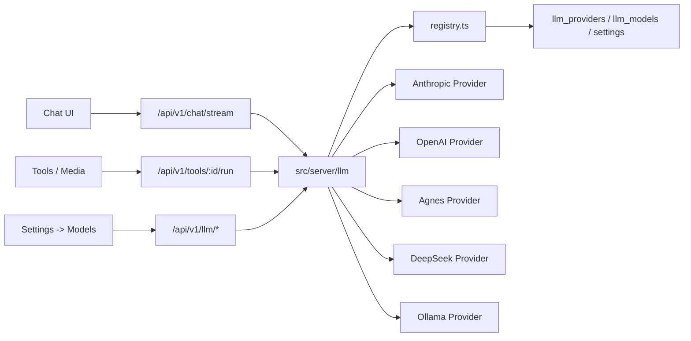

# LLM Provider Runtime 实现方案

> 日期：2026-06-24  
> 范围：把按 provider 调用不同厂商模型的后端抽象放入 `src/server/llm`，并打通数据库、Settings、前端 Chat、图片生成、视频生成入口。  
> 目标：Agnes 文本/图片/视频、OpenAI GPT、Anthropic、DeepSeek、本地 Ollama 等模型都可以在后台设置，并被前端 Chat 或媒体工具调用。  
> 约束：UI 沿用现有 `Settings -> Models` 风格，不做大规模视觉重构。

## 1. 当前问题

当前 BloomAI 的模型链路已经能保存模型字符串，但没有真正的 provider runtime：

1. `src/shared/constants/models.ts` 硬编码 `AVAILABLE_MODELS`，包含 Claude 和 GPT。
2. `src/renderer/pages/Settings/index.tsx` 在 `Settings -> Models` 中渲染模型卡片，点击后保存 `settings.model`。
3. `src/server/db/repositories/session.repo.ts` 新建 session 时读取 `settings.model` 并写入 `sessions.model`。
4. `src/renderer/pages/Chat/ChatPanel.tsx` 可以为当前 session 更新 `model`。
5. `src/server/routes/chat.route.ts` 发送 chat 时固定实例化 `Anthropic` SDK，并把 `session.model` 作为 Anthropic model 传入。

这导致 `claude-3-opus` 这类 Anthropic 模型可用，但 `gpt-4o`、`gpt-4o-mini` 目前只是 UI/设置层存在，后端没有真正走 OpenAI Chat API。

## 2. 总体架构

推荐做成 `LLM Registry + Provider Runtime`。所有模型调用由 `src/server/llm` 统一处理，route 层只负责 HTTP/SSE、消息持久化和错误输出。



核心原则：

1. 模型列表从后端 registry 来，前端常量只作为 fallback 或逐步移除。
2. Chat route 不再 import 具体厂商 SDK。
3. 每个 provider 只负责把统一请求转换成厂商请求，再把厂商响应转换成统一事件。
4. 文本、图片、视频是不同 modality，注册表统一管理，但执行接口分开。
5. OpenAI-compatible 协议抽成公共适配器，Agnes、DeepSeek 等复用。

## 3. `src/server/llm` 目录设计

新增目录：

```text
src/server/llm/
  index.ts
  types.ts
  registry.ts
  settings.ts
  errors.ts
  stream.ts
  providers/
    anthropic.ts
    openai-compatible.ts
    openai.ts
    agnes.ts
    deepseek.ts
    ollama.ts
  media/
    image.ts
    video.ts
```

### 文件职责

1. `index.ts`
   - 对外暴露统一入口：
     - `streamChatCompletion`
     - `generateImage`
     - `createVideoTask`
     - `getVideoTask`
     - `listModels`
     - `listProviders`

2. `types.ts`
   - 定义统一类型契约。
   - route、provider、media runtime 共享。

3. `registry.ts`
   - 从 `llm_providers`、`llm_models`、`settings` 读取 provider/model 配置。
   - 根据 model id 查 provider。
   - 验证 model 是否启用、能力是否匹配当前 modality。

4. `settings.ts`
   - 封装 settings 读取和 API key 解析。
   - 支持本地 settings 和环境变量兜底。

5. `errors.ts`
   - 定义统一错误：
     - `LlmConfigError`
     - `LlmProviderError`
     - `LlmUnsupportedModelError`
     - `LlmResponseParseError`

6. `stream.ts`
   - 通用 SSE / NDJSON / OpenAI-compatible stream 解析工具。

7. `providers/anthropic.ts`
   - 适配 Anthropic Messages API。
   - 迁移现有 `chat.route.ts` 中 Anthropic SDK 逻辑。

8. `providers/openai-compatible.ts`
   - 适配 `/v1/chat/completions` 的 OpenAI-compatible 协议。
   - 支持流式 `choices[0].delta.content`。
   - Agnes text、DeepSeek text 可复用。

9. `providers/openai.ts`
   - OpenAI 官方 GPT provider。
   - 默认支持 `gpt-4o`、`gpt-4o-mini`。
   - 其他 GPT 模型通过后台新增 model 记录。

10. `providers/agnes.ts`
   - Agnes 文本、图片、视频配置。
   - 文本模型：`agnes-2.0-flash`
   - 图片模型：`agnes-image-2.1-flash`
   - 视频模型：`agnes-video-v2.0`

11. `providers/deepseek.ts`
   - DeepSeek OpenAI-compatible provider。
   - 默认模型：`deepseek-chat`、`deepseek-reasoner`。

12. `providers/ollama.ts`
   - 本地 Ollama provider。
   - 默认 base URL：`http://127.0.0.1:11434`
   - 支持 `/api/chat` 流式输出。
   - 可从 `/api/tags` 拉取本地模型。

13. `media/image.ts`
   - 统一图片生成 runtime。
   - 支持 OpenAI Images API 与 Agnes Images API。

14. `media/video.ts`
   - 统一视频任务 runtime。
   - 本轮重点支持 Agnes Video 异步任务。

## 4. 统一类型契约

### 文本 Chat

```ts
export type LlmProviderId =
  | 'anthropic'
  | 'openai'
  | 'agnes'
  | 'deepseek'
  | 'ollama'
  | string

export type LlmModality = 'text' | 'image' | 'video'

export type LlmMessage = {
  role: 'system' | 'user' | 'assistant'
  content: string
}

export type ChatStreamRequest = {
  model: string
  system?: string
  messages: LlmMessage[]
  temperature?: number
  maxTokens?: number
}

export type ChatStreamEvent =
  | { type: 'delta'; text: string }
  | { type: 'usage'; input: number; output: number }
  | { type: 'done' }

export interface ChatProvider {
  streamChat(input: ChatStreamRequest): AsyncGenerator<ChatStreamEvent>
}
```

### 图片生成

```ts
export type ImageGenerationRequest = {
  model: string
  prompt: string
  size?: string
  image?: string | string[]
  responseFormat?: 'url' | 'b64_json'
  saveTo?: string
}

export type ImageGenerationResult = {
  providerId: string
  model: string
  url?: string
  b64_json?: string
  localPath?: string
}
```

### 视频生成

```ts
export type VideoGenerationRequest = {
  model: string
  prompt: string
  image?: string | string[]
  width?: number
  height?: number
  numFrames?: number
  frameRate?: number
  seed?: number
  negativePrompt?: string
}

export type VideoTaskResult = {
  taskId: string
  videoId?: string
  providerId: string
  model: string
  status: 'queued' | 'in_progress' | 'completed' | 'failed'
  progress?: number
  url?: string
  error?: string
}
```

## 5. 数据库设计

保留现有表和字段：

1. `settings.model`
2. `sessions.model`
3. `personas.model_override`

新增 provider/model registry 表：

```sql
CREATE TABLE IF NOT EXISTS llm_providers (
  id TEXT PRIMARY KEY,
  name TEXT NOT NULL,
  kind TEXT NOT NULL,
  base_url TEXT,
  api_key_setting_key TEXT,
  is_enabled INTEGER NOT NULL DEFAULT 1,
  config_json TEXT NOT NULL DEFAULT '{}',
  created_at INTEGER NOT NULL,
  updated_at INTEGER NOT NULL
);

CREATE TABLE IF NOT EXISTS llm_models (
  id TEXT PRIMARY KEY,
  provider_id TEXT NOT NULL,
  model_id TEXT NOT NULL,
  label TEXT NOT NULL,
  modality TEXT NOT NULL,
  capabilities_json TEXT NOT NULL DEFAULT '{}',
  is_enabled INTEGER NOT NULL DEFAULT 1,
  is_builtin INTEGER NOT NULL DEFAULT 1,
  sort_order INTEGER NOT NULL DEFAULT 0,
  created_at INTEGER NOT NULL,
  updated_at INTEGER NOT NULL
);
```

可选新增视频任务表。若先不新增表，可以复用 `tool_runs` 做视频任务记录；但长期建议新增：

```sql
CREATE TABLE IF NOT EXISTS llm_video_tasks (
  id TEXT PRIMARY KEY,
  provider_id TEXT NOT NULL,
  model TEXT NOT NULL,
  provider_task_id TEXT,
  provider_video_id TEXT,
  input_json TEXT NOT NULL,
  output_json TEXT,
  status TEXT NOT NULL,
  progress INTEGER,
  error_msg TEXT,
  created_at INTEGER NOT NULL,
  updated_at INTEGER NOT NULL
);
```

### Settings keys

沿用现有 `settings` 表新增键：

| key | 用途 |
|---|---|
| `anthropic_api_key` | Anthropic API Key |
| `openai_api_key` | OpenAI API Key |
| `agnes_api_key` | Agnes API Key |
| `deepseek_api_key` | DeepSeek API Key |
| `ollama_base_url` | Ollama 本地地址 |
| `model` | 默认文本 chat 模型 |
| `default_image_model` | 默认图片模型 |
| `default_video_model` | 默认视频模型 |

## 6. 内置 Provider 和模型 Seed

### Anthropic

Provider:

```json
{
  "id": "anthropic",
  "name": "Anthropic",
  "kind": "anthropic",
  "base_url": "https://api.anthropic.com",
  "api_key_setting_key": "anthropic_api_key"
}
```

Models:

- `claude-3-5-sonnet-20241022`
- `claude-3-opus-20240229`
- `claude-3-haiku-20240307`

### OpenAI

Provider:

```json
{
  "id": "openai",
  "name": "OpenAI",
  "kind": "openai",
  "base_url": "https://api.openai.com/v1",
  "api_key_setting_key": "openai_api_key"
}
```

Models:

- `gpt-4o`
- `gpt-4o-mini`
- 其他 GPT 模型由后台添加，走同一个 provider。

### Agnes

Provider:

```json
{
  "id": "agnes",
  "name": "Agnes",
  "kind": "openai-compatible",
  "base_url": "https://apihub.agnes-ai.com/v1",
  "api_key_setting_key": "agnes_api_key"
}
```

Models:

- text: `agnes-2.0-flash`
- image: `agnes-image-2.1-flash`
- video: `agnes-video-v2.0`

### DeepSeek

Provider:

```json
{
  "id": "deepseek",
  "name": "DeepSeek",
  "kind": "openai-compatible",
  "base_url": "https://api.deepseek.com/v1",
  "api_key_setting_key": "deepseek_api_key"
}
```

Models:

- `deepseek-chat`
- `deepseek-reasoner`

### Ollama

Provider:

```json
{
  "id": "ollama",
  "name": "Ollama",
  "kind": "ollama",
  "base_url": "http://127.0.0.1:11434",
  "api_key_setting_key": null
}
```

Models:

- 不强制 seed 具体模型。
- 后台可以从 `/api/tags` 拉取本地模型，也可以手动添加。

## 7. 后端 API 设计

新增 `src/server/routes/llm.route.ts`，挂载到 `/api/v1/llm`。

### Provider API

```text
GET   /api/v1/llm/providers
PATCH /api/v1/llm/providers/:id
```

`GET /providers` 返回：

```json
{
  "data": [
    {
      "id": "openai",
      "name": "OpenAI",
      "kind": "openai",
      "baseUrl": "https://api.openai.com/v1",
      "apiKeySettingKey": "openai_api_key",
      "isEnabled": true,
      "hasApiKey": true
    }
  ]
}
```

### Model API

```text
GET   /api/v1/llm/models?modality=text|image|video
POST  /api/v1/llm/models
PATCH /api/v1/llm/models/:id
```

`GET /models?modality=text` 返回：

```json
{
  "data": [
    {
      "id": "gpt-4o",
      "providerId": "openai",
      "modelId": "gpt-4o",
      "label": "gpt-4o",
      "provider": "OpenAI",
      "modality": "text",
      "capabilities": { "streaming": true },
      "isEnabled": true,
      "badge": ""
    }
  ]
}
```

### Ollama API

```text
GET /api/v1/llm/ollama/models
```

读取本地 Ollama `/api/tags`，用于后台一键导入模型。

## 8. Chat 链路改造

现有 `chat.route.ts` 保留职责：

1. 建立 SSE。
2. 校验 `sessionId`、`content`。
3. 读取 session/persona/history/settings。
4. 拼接 system prompt 和 context。
5. 保存 user message。
6. 发送 LLM stream。
7. 保存 assistant message。

移除职责：

1. 不再读取固定 `anthropic_api_key`。
2. 不再直接 import `@anthropic-ai/sdk`。
3. 不再知道具体 provider。

改造后的核心逻辑：

```ts
import { streamChatCompletion } from '../llm'

const selectedModel =
  persona?.model_override ||
  session.model ||
  settings.model ||
  'claude-3-5-sonnet-20241022'

for await (const event of streamChatCompletion({
  model: selectedModel,
  system,
  messages,
  maxTokens: 4096,
})) {
  if (event.type === 'delta') {
    fullText += event.text
    sendSSE(res, { type: 'delta', text: event.text })
  }
  if (event.type === 'usage') {
    inTok = event.input
    outTok = event.output
  }
}
```

前端 Chat store 不需要改 SSE 协议，继续消费：

- `{ type: 'delta', text }`
- `{ type: 'done', tokens }`
- `{ type: 'error', error }`

## 9. Provider 实现策略

### Anthropic

使用现有 `@anthropic-ai/sdk`。

输入转换：

1. `system` 作为 Anthropic `system` 参数。
2. `messages` 只传 user/assistant。
3. `maxTokens` 转成 `max_tokens`。

输出转换：

1. SDK `text` event -> `{ type: 'delta', text }`
2. SDK final message usage -> `{ type: 'usage', input, output }`

### OpenAI

使用 `fetch` 调用 `/chat/completions`，避免新增 SDK 依赖。

请求：

```json
{
  "model": "gpt-4o",
  "messages": [
    { "role": "system", "content": "..." },
    { "role": "user", "content": "..." }
  ],
  "stream": true,
  "max_tokens": 4096
}
```

解析：

- `choices[0].delta.content` -> delta
- `[DONE]` -> done

### OpenAI-compatible

复用 OpenAI stream 解析，但 base URL 和 API key 从 provider 配置读取。

适用：

1. Agnes text
2. DeepSeek
3. 用户以后手动添加的兼容 provider

### Ollama

调用：

```text
POST /api/chat
```

请求：

```json
{
  "model": "llama3.1",
  "messages": [...],
  "stream": true
}
```

解析 Ollama NDJSON：

```json
{ "message": { "content": "..." }, "done": false }
```

## 10. 图片与视频链路

### 图片

当前 `src/server/services/tool.service.ts` 的 `imageGen` 固定调用 OpenAI Images API。改造后调用：

```ts
import { generateImage } from '../llm'
```

默认模型读取 `settings.default_image_model`，也允许工具输入显式传 `model`。

Agnes Image 请求规则：

1. Endpoint: `https://apihub.agnes-ai.com/v1/images/generations`
2. model: `agnes-image-2.1-flash`
3. URL 输出要放在 `extra_body.response_format = 'url'`
4. 图生图输入放在 `extra_body.image`

### 视频

Agnes Video 是异步任务，不应塞进同步 chat stream。

推荐新增 media API 或工具：

```text
POST /api/v1/llm/videos
GET  /api/v1/llm/videos/:id
```

或先作为 `video_gen` tool 实现，记录在 `tool_runs`。

Agnes Video 创建任务：

```text
POST https://apihub.agnes-ai.com/v1/videos
```

查询结果：

```text
GET https://apihub.agnes-ai.com/agnesapi?video_id=<VIDEO_ID>
```

## 11. Settings UI 方案

UI 沿用当前 `Settings -> Models`：

### Default Chat Model

保持现有 `model-card` 风格，但数据来自：

```text
GET /api/v1/llm/models?modality=text
```

显示：

- Claude models
- GPT models
- Agnes text
- DeepSeek models
- Ollama imported models

点击后仍然：

```ts
updateSetting('model', model.id)
```

### Provider Keys

沿用现有 `api-key-row`：

- Anthropic
- OpenAI
- Agnes
- DeepSeek
- Ollama Base URL

保存仍使用现有 settings API，或在后续统一到 `/api/v1/llm/providers/:id`。

### Media Models

新增两组轻量选择：

1. Default Image Model
   - OpenAI image model
   - Agnes Image 2.1 Flash

2. Default Video Model
   - Agnes Video V2.0

仍使用 `model-card`，避免新视觉系统。

## 12. 前端调整文件

需要修改：

1. `src/renderer/pages/Settings/index.tsx`
   - 从 `platform.getLlmModels('text')` 加载模型。
   - 增加 Agnes/DeepSeek/Ollama 配置项。
   - 增加 image/video 默认模型设置。

2. `src/renderer/api/index.ts`
   - 增加：
     - `getLlmProviders`
     - `updateLlmProvider`
     - `getLlmModels`
     - `createLlmModel`
     - `updateLlmModel`
     - `getOllamaModels`

3. `src/renderer/pages/Chat/ChatPanel.tsx`
   - 模型下拉改为使用 store 中的 LLM text models。
   - 保留现有 UI 样式和交互。

4. `src/renderer/store/index.ts`
   - 可新增 `useLlmStore`。
   - 或先把模型加载放在 Settings/Chat 内部，后续再提取 store。

5. `src/shared/constants/models.ts`
   - 可保留为 fallback。
   - 长期应减少硬编码模型列表。

不需要修改：

1. `src/renderer/pages/Chat/InputBar.tsx`
2. `src/renderer/pages/Chat/Timeline.tsx`
3. `src/renderer/pages/Chat/MessageBubble.tsx`
4. `src/renderer/api/index.ts` 的 SSE 解析协议

## 13. 后端调整文件

需要修改：

1. `src/server/app.ts`
   - 注册 `llmRouter`。

2. `src/server/db/client.ts`
   - 新增 `llm_providers`、`llm_models` 表。
   - 新增 provider/model seed。
   - 新增 settings seed。

3. `src/server/routes/chat.route.ts`
   - 改为调用 `src/server/llm`。

4. `src/server/routes/settings.route.ts`
   - mask 新增 key：
     - `agnes_api_key`
     - `deepseek_api_key`

5. `src/server/services/tool.service.ts`
   - `image_gen` 改为调用 `generateImage`。
   - 后续新增 `video_gen` 调用 `createVideoTask`。

新增：

1. `src/server/routes/llm.route.ts`
2. `src/server/db/repositories/llm.repo.ts`
3. `src/server/llm/**`

## 14. 实施步骤

1. 新建 `src/server/llm/types.ts`、`errors.ts`、`settings.ts`。
2. 新建 `registry.ts` 和 `llm.repo.ts`。
3. 在 `db/client.ts` 新增 `llm_providers`、`llm_models` 和 seed。
4. 实现 `providers/anthropic.ts`，迁移现有 Claude 调用，保证现有 Claude chat 不变。
5. 实现 `providers/openai-compatible.ts`。
6. 实现 `providers/openai.ts`，打通 `gpt-4o`、`gpt-4o-mini`。
7. 实现 `providers/agnes.ts`，打通 Agnes text。
8. 实现 `providers/deepseek.ts`。
9. 实现 `providers/ollama.ts`。
10. 实现 `streamChatCompletion`。
11. 改造 `chat.route.ts`。
12. 新增 `llm.route.ts` 和前端 platform API。
13. 改造 Settings 模型列表和 provider key 配置。
14. 改造 Chat 模型下拉从后端加载。
15. 实现 `media/image.ts`，改造 `image_gen`。
16. 实现 `media/video.ts` 和 Agnes video 任务接口或工具。
17. 补测试和手动验证。

## 15. 测试策略

### 单元测试

1. Registry
   - model id 能查到 provider。
   - disabled model 不可调用。
   - modality 不匹配时报错。

2. Provider
   - Anthropic request shape 正确。
   - OpenAI-compatible SSE 解析正确。
   - Agnes text 使用 Agnes base URL 和 `agnes_api_key`。
   - DeepSeek 使用 DeepSeek base URL 和 `deepseek_api_key`。
   - Ollama NDJSON stream 解析正确。

3. Media
   - Agnes Image 的 `response_format` 写入 `extra_body`。
   - Agnes Video 创建任务和查询任务字段映射正确。

### 集成测试

1. `GET /api/v1/llm/models?modality=text` 返回 seed 模型。
2. Settings 保存 `model=gpt-4o` 后，新建 session 使用 `gpt-4o`。
3. `POST /api/v1/chat/stream` 对不同模型分发到不同 provider。
4. 缺少 API key 时返回清晰错误。
5. Claude 原有 chat 行为不回退。

### 手动验证

1. Settings -> Models 能看到所有启用 text 模型。
2. 保存 Anthropic/OpenAI/Agnes/DeepSeek/Ollama 配置。
3. 新建 chat，选择 Claude 后可流式回复。
4. 选择 GPT 后可流式回复。
5. 选择 Agnes text 后可流式回复。
6. 选择 DeepSeek 后可流式回复。
7. 选择 Ollama 本地模型后可流式回复。
8. Image Generator 可选择 Agnes Image 并返回图片。
9. Agnes Video 可创建任务并查询结果。

## 16. 风险与取舍

1. OpenAI-compatible 不等于完全一致  
   Agnes、DeepSeek 可能有不同 usage 字段或错误格式，需要 provider 层容错。

2. 视频是异步任务  
   不应和 chat stream 共用同步调用模型。推荐单独 task 表或 `video_gen` 工具。

3. Ollama 模型本地动态变化  
   需要允许后台刷新模型，而不是只依赖 seed。

4. 旧数据兼容  
   `sessions.model` 中已有的 Claude/GPT 字符串应继续可识别。

5. UI 不宜一次做太复杂  
   Settings 先沿用现有分组和卡片，后续再做 provider 高级配置。

## 17. 完成标准

1. `src/server/routes/chat.route.ts` 不再 import 任何厂商 SDK。
2. 所有 text chat 调用都经过 `src/server/llm`。
3. `gpt-4o`、`gpt-4o-mini` 不再只是 UI 模型，能实际调用 OpenAI。
4. Agnes text/image/video 都有后端 runtime。
5. DeepSeek 和 Ollama 能在后台配置并在 Chat 中选择。
6. Settings、session、chat、tool/media 共享同一套 model registry。
7. 现有 Claude 默认模型和现有 Chat SSE 协议保持兼容。
