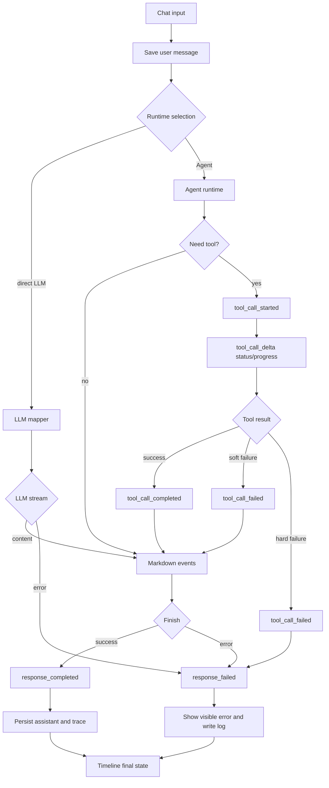
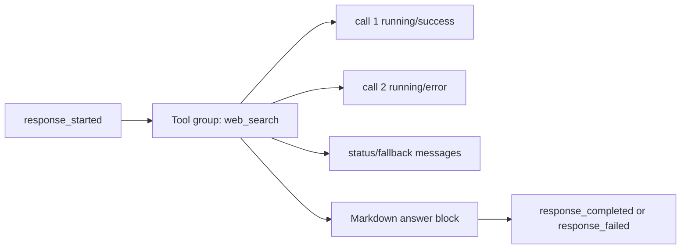

# BloomAI LLM Response Contract v1 事件与 Timeline 统一表

## 1. 文档信息

- 日期：2026-06-26
- 状态：v1 补充规范
- 依据文档：`docs/llm/llm-response-contract-v1-design.md`
- 依据实现：`src/shared/schemas/response.ts`
- 范围：Chat 输入到 LLM/Agent/Tool/Web Search 回答的事件链路、Timeline 展示语义、错误分支、测试验收

## 2. 核心结论

现有链路“chat 输入 -> AI agent -> 调用 web search -> 执行搜索 -> 前端卡片显示搜索步骤 -> 获取搜索信息 -> Agent 总结 -> 前端等待 -> AI 回复 -> 前端显示答案”是主成功路径，但还缺少这些关键分支：

1. Direct LLM：不经过 Agent 和工具，直接输出正文。
2. Agent no-tool：经过 Agent，但 Agent 判断不需要工具。
3. 多工具/多轮工具：Agent 可能调用多个工具，或同类工具连续调用多次。
4. Tool fallback：例如 `web_search` 从主 provider 降级到备用 provider。
5. Tool soft failure：工具失败，但 Agent 可以继续回答。
6. Tool hard failure：工具失败导致本轮 response 失败。
7. LLM failure before content：没有任何正文时失败，需要显示可读错误，不能出现空气泡。
8. LLM failure after partial content：已有部分正文后失败，需要保留 partial answer，并显示失败状态。
9. Agent runtime failure：Agent 初始化、规划、执行、总结任一阶段失败。
10. Stream aborted/cancelled：用户取消、连接中断或 SSE 关闭。
11. Persistence/logging failure：前端已收到答案，但后端保存 message 或 trace 失败。
12. Legacy event compatibility：旧 `delta/tool_call_*` 事件在兼容层被 normalize 到 v1 事件。

统一原则：

- 后端只输出 `ResponseStreamEvent`。
- Timeline 只消费 `ResponseContentBlock` 派生的 view model。
- Timeline 分组是前端显示层行为，不改变 v1 wire contract。
- 错误必须同时满足两个条件：前端有可见信息，后端写入错误日志。
- 新增字段必须 optional；新增事件需要先证明现有事件无法表达。

## 3. 统一事件表

| Event | Producer | 必要字段 | 状态变化 | Timeline 描述 | 分组规则 | 持久化/日志 | 失败语义 |
|---|---|---|---|---|---|---|---|
| `response_started` | LLM mapper / Agent mapper / normalizer | `responseId`, `runtime`, `createdAt` | 创建 streaming response | 显示“正在准备回答/正在思考”的占位状态；没有正文时不创建空 assistant 气泡 | 不入 tool group | 记录 response 开始时间和 runtime | 如果之后失败，由 `response_failed` 收口 |
| `content_block_started` | LLM mapper / Agent mapper | `responseId`, `block.id`, `block.type=markdown` | 新增 markdown block | 创建 assistant streaming 气泡，可显示 cursor/loading | 不入 tool group | 后续 delta 累积到 `messages.content` | 如果 block 未完成但 response 失败，保留 partial markdown |
| `content_delta` | LLM mapper / Agent mapper | `responseId`, `blockId`, `delta` | 追加 markdown | 实时追加正文 | 不入 tool group | 累积为 assistant 可读正文 | 如果后续失败，partial content 仍可展示 |
| `content_block_completed` | LLM mapper / Agent mapper | `responseId`, `blockId`, `completedAt` | markdown block -> completed | 停止该 block 的 streaming cursor | 不入 tool group | 标记正文块完成 | 不代表整轮 response 完成 |
| `tool_call_started` | Agent mapper / normalizer | `responseId`, `block.callId`, `block.toolId`, `block.category`, `block.status=running` | 新增 tool call block | 显示工具卡片 running，例如“正在搜索 Web” | 连续相邻且同 `category:toolId` 的工具调用归入同一个 group card | 写入 tool trace draft | 工具还未失败或成功 |
| `tool_call_delta` | Agent mapper / tool runner | `responseId`, `callId`, `patch` | patch tool call block | 更新进度、权限等待、fallback 说明、结果数量等短描述 | 更新所在 group 内对应 row/section | 可记录阶段摘要，不保存 raw output | 不改变最终成功/失败状态 |
| `tool_call_completed` | Agent mapper / tool runner | `responseId`, `callId`, `completedAt` | tool call -> success | 工具卡片显示完成、耗时、摘要、Top results | group 状态参与汇总；全部 success 时 group 为 done | 写入 `ResponseTrace.toolCalls[]` | 工具成功，不代表 Agent 已完成回答 |
| `tool_call_failed` | Agent mapper / tool runner | `responseId`, `callId`, `error`, `completedAt` | tool call -> error | 工具卡片显示失败原因；不要吞掉错误 | group 内显示 failed row；group 状态为 failed 或 partial failed | 写入 tool trace 和日志 | soft failure 时 Agent 可继续；hard failure 后接 `response_failed` |
| `usage_updated` | LLM mapper / Agent mapper | `responseId`, `usage` | 更新 token usage | 默认不展示；可在 debug 或 message meta 展示 | 不入 group | 持久化 token 总数 | 与成功/失败无直接关系 |
| `response_completed` | LLM mapper / Agent mapper / writer | `responseId`, `finishReason`, `completedAt` | streaming response -> completed | 停止全局等待状态；最终显示 assistant 正文和完成的 tool groups | 所有 running group 必须被完成或失败收口 | 持久化 `messages.content`, `messages.tool_calls`, `tokens` | 本轮成功结束；`finishReason` 可为 `stop/length/tool_limit` |
| `response_failed` | LLM mapper / Agent mapper / writer / normalizer | `responseId`, `error`, `completedAt` | streaming response -> failed，并追加 `ErrorBlock` | 显示可读错误；如果没有正文，也要显示错误 assistant 信息，不能出现空气泡 | 所有仍 running 的 group 在 UI 上视为 interrupted | 写入错误日志；有 partial content 时可持久化 partial assistant | 本轮失败结束；不得再发送 content/tool events |

## 4. Timeline 展示状态表

| Runtime 状态 | Timeline 显示 | Assistant 气泡 | Tool group | 用户可见错误 |
|---|---|---|---|---|
| 已发送 `response_started`，无 block | “正在思考/准备回答”轻量状态 | 不显示空气泡 | 无 | 无 |
| markdown streaming | 流式正文 | 显示 streaming 气泡 | 无或保留已有 group | 无 |
| tool running | 工具执行卡片 | 可无正文，或保留已有 partial 正文 | group header running，内部 row running | 无 |
| tool soft failed | 工具失败卡片 + Agent 继续 | 后续可以继续生成正文 | group header partial failed | 显示工具错误摘要 |
| tool hard failed | 工具失败卡片 + response failed | 有 partial 则显示；无 partial 则显示错误消息 | group header failed | 显示 response 错误 |
| response completed | 最终正文和工具摘要 | completed | done / partial failed | soft failure 可保留工具错误 |
| response failed before content | 错误消息 | 显示错误 assistant 信息或 error block | interrupted/failed | 必须显示 |
| response failed after content | partial 正文 + 错误提示 | 保留 partial | interrupted/failed | 必须显示 |
| stream aborted | 中断提示 | 保留 partial | interrupted | 显示 `STREAM_ABORTED` |
| persistence failed after stream | 答案仍保留在前端临时状态；可提示保存失败 | completed 或 warning | 原状态 | 记录日志，可提示刷新后可能丢失 |

## 5. Tool Group 规则

Timeline 分组仅用于显示层，不改变后端事件结构。

分组 key：

```ts
groupKey = `${block.category}:${block.toolId}`
```

分组条件：

1. 只合并相邻的 `tool_call` blocks。
2. 只有相同 `category` 和 `toolId` 才进入同一个 group。
3. markdown、error、artifact、citation block 会切断 group。
4. group card 是第一层折叠。
5. group 内最多再按状态或阶段做第二层折叠。
6. 单个 tool call row 不再做第三层折叠。

Group 状态计算：

| 条件 | Group 状态 | UI 文案 |
|---|---|---|
| 任一 call `running` | `running` | 正在执行 |
| 无 running，全部 success | `success` | 已完成 |
| 无 running，全部 error | `error` | 执行失败 |
| 无 running，同时有 success 和 error | `partial_error` | 部分失败 |
| response failed 且仍有 running | `interrupted` | 已中断 |

## 6. Web Search 细化事件建议

现有 v1 不需要新增 `search_started/search_completed` 事件。搜索过程可以用 `tool_call_*` 表达：

| 搜索阶段 | 推荐事件 | Timeline 文案 |
|---|---|---|
| Agent 决定搜索 | `tool_call_started` | 正在搜索 Web |
| 构造 query | `tool_call_delta` | 生成搜索关键词：`...` |
| 调用主搜索 provider | `tool_call_delta` | 正在请求 Tavily/Search provider |
| 主 provider 失败，准备 fallback | `tool_call_delta` | 主搜索失败，切换备用搜索 |
| 备用搜索成功 | `tool_call_delta` + `tool_call_completed` | 已获取 N 条结果 |
| 所有搜索失败，Agent 可继续 | `tool_call_failed`，然后后续 `content_*` | 搜索失败，基于已有上下文回答 |
| 所有搜索失败，Agent 不能继续 | `tool_call_failed` + `response_failed` | 搜索失败，无法完成回答 |

为支持更清晰的阶段描述，建议后续兼容式扩展：

```ts
type ToolCallDeltaEvent = {
  type: 'tool_call_delta'
  responseId: string
  callId: string
  patch: {
    outputSummary?: string
    durationMs?: number
    permission?: ToolPermissionView
    statusMessage?: string
    metadata?: Record<string, unknown>
  }
}
```

其中 `statusMessage` 和 `metadata` 必须是 optional。当前最小实现可以继续复用 `outputSummary`。

## 7. 端到端分支链路

### 7.1 Direct LLM success

```text
chat input
-> save user message
-> select direct LLM
-> response_started
-> content_block_started
-> content_delta...
-> usage_updated?
-> content_block_completed
-> response_completed
-> persist assistant
-> Timeline shows final answer
```

### 7.2 Direct LLM failure before content

```text
chat input
-> response_started
-> provider throws
-> response_failed
-> log error to LOG_DATA_DIR
-> persist fallback error text if product policy requires visible assistant message
-> Timeline shows readable error, no empty bubble
```

### 7.3 Direct LLM failure after partial content

```text
chat input
-> response_started
-> content_block_started
-> content_delta...
-> provider throws
-> response_failed
-> log error
-> persist partial content + error trace
-> Timeline keeps partial answer and shows failure notice
```

### 7.4 Agent no-tool success

```text
chat input
-> save user message
-> start Agent
-> response_started
-> content_block_started
-> content_delta...
-> response_completed
-> persist assistant + trace(runtime=agent)
```

### 7.5 Agent web search success

```text
chat input
-> start Agent
-> response_started
-> tool_call_started(web_search)
-> tool_call_delta(query/status)
-> tool_call_completed(results summary)
-> content_block_started
-> content_delta(summary answer)
-> response_completed(trace includes toolCalls)
-> Timeline shows search group + answer
```

### 7.6 Tool fallback success

```text
tool_call_started(web_search)
-> tool_call_delta(primary provider running)
-> tool_call_delta(primary provider failed, fallback running)
-> tool_call_completed(fallback results)
-> content_delta(answer based on fallback results)
-> response_completed
```

Timeline 中同一个 `web_search` 卡片显示 fallback 阶段，不新增独立工具卡片。

### 7.7 Tool soft failure with Agent continuing

```text
tool_call_started(web_search)
-> tool_call_failed(TOOL_CALL_ERROR)
-> content_block_started
-> content_delta(answer with limitation notice)
-> response_completed(finishReason=stop)
```

Timeline 显示 tool group 为 `failed/partial failed`，但整轮 response 是 completed。

### 7.8 Tool hard failure causing response failure

```text
tool_call_started(required_tool)
-> tool_call_failed(TOOL_CALL_ERROR)
-> response_failed(TOOL_CALL_ERROR or AGENT_RUNTIME_ERROR)
```

Timeline 显示工具失败，并显示整轮回答失败。

### 7.9 Agent failure before output with fallback direct LLM

```text
start Agent
-> Agent init/planning error before any visible event
-> log AGENT_RUNTIME_ERROR
-> fallback direct LLM
-> response_started(runtime=direct-llm)
-> content_delta...
-> response_completed
```

如果已经向前端发送了 Agent 的 `response_started`，则不能静默切换 responseId。推荐策略是：Agent 在产生第一条可见 v1 event 前失败，route 可以 fallback；一旦已发送 v1 event，就必须用 `response_failed` 收口。

### 7.10 Agent failure after partial output

```text
response_started
-> tool_call_started?
-> content_delta?
-> Agent runtime throws
-> response_failed(AGENT_RUNTIME_ERROR)
-> log error
-> persist partial content and tool trace
```

### 7.11 Stream aborted or user cancelled

```text
response_started
-> content_delta? / tool_call_started?
-> abort signal
-> response_failed(STREAM_ABORTED) or response_completed(finishReason=cancelled)
```

推荐当前统一用 `response_failed` + `STREAM_ABORTED`，因为 UI 需要明确显示“中断”。

### 7.12 Persistence failure after completed stream

```text
response_completed sent to frontend
-> persist assistant fails
-> log persistence error
-> optional frontend warning event is not available in v1
```

当前 v1 没有 response 完成后的 warning event。最小方案：后端写日志；前端保留当前临时显示，下一次 reload 如果消息缺失，由普通数据刷新表现出来。后续可考虑新增 optional `response_warning`，但不属于当前最小方案。

## 8. 错误码到 Timeline 的映射

| Error code | 常见来源 | Timeline 显示 | Group 处理 | 是否继续回答 | 日志 |
|---|---|---|---|---|---|
| `VALIDATION_ERROR` | chat request 参数错误 | 输入错误提示 | 无 | 否 | warn |
| `LLM_CONFIG_ERROR` | provider/model/env 配置缺失 | 模型配置错误 | running groups interrupted | 否 | error |
| `LLM_PROVIDER_ERROR` | LLM API 调用失败 | 大模型调用失败 | running groups interrupted | 通常否 | error |
| `LLM_RESPONSE_PARSE_ERROR` | provider 响应解析失败 | 模型响应解析失败 | running groups interrupted | 通常否 | error |
| `TOOL_CALL_ERROR` | web search/tool 执行失败 | 工具卡片错误 | 对应 group failed/partial failed | soft 可继续，hard 不继续 | error |
| `AGENT_RUNTIME_ERROR` | Agent 初始化/规划/执行失败 | Agent 执行失败 | running groups interrupted | 已发送事件后不 fallback | error |
| `STREAM_ABORTED` | 用户取消/连接断开 | 回答已中断 | running groups interrupted | 否 | info/warn |
| `UNKNOWN_ERROR` | 未分类异常 | 发生未知错误 | running groups interrupted | 否 | error |

## 9. 建议补齐的 Timeline 文案

文案应短、可扫读、避免暴露 provider raw error。

| 场景 | 建议文案 |
|---|---|
| `response_started` 后无正文 | 正在思考 |
| Agent runtime started | Agent 正在规划 |
| `tool_call_started` search/web | 正在搜索 Web |
| search query ready | 已生成搜索关键词 |
| search fallback | 主搜索失败，正在切换备用搜索 |
| search completed | 已获取搜索结果 |
| tool soft failed | 工具执行失败，继续尝试回答 |
| tool hard failed | 工具执行失败，无法完成回答 |
| content streaming | 正在生成回答 |
| response completed | 回答完成 |
| response failed before content | 回答生成失败 |
| response failed after content | 回答中断，已保留部分内容 |
| stream aborted | 回答已中断 |
| persistence failed | 回答已生成，但保存失败 |

## 10. 文件修改建议

当前文档补齐后，功能实现可按下面文件落点检查：

| 能力 | 文件 |
|---|---|
| v1 event 类型 | `src/shared/schemas/response.ts` |
| direct LLM -> v1 | `src/server/llm/response-event-mapper.ts` |
| Agent -> v1 | `src/server/agent/mastra/response-event-mapper.ts` |
| SSE 写入、正文/trace 累积 | `src/server/routes/chat-response-stream.ts` |
| Chat route 编排、fallback、持久化 | `src/server/routes/chat.route.ts` |
| 前端 legacy/v1 normalize | `src/renderer/api/chat-stream-normalizer.ts` |
| Streaming response reducer | `src/renderer/store/chat-response-reducer.ts` |
| Store sendMessage 状态接入 | `src/renderer/store/index.ts` |
| Timeline 渲染和 group | `src/renderer/pages/Chat/Timeline.tsx` |
| Tool group card | `src/renderer/pages/Chat/ToolCallGroupCard.tsx` |
| 单工具卡片 | `src/renderer/pages/Chat/ToolCallCard.tsx` |
| 错误日志 | `src/server/logger/logger.ts` |
| 配置读取 | `src/server/config/config.ts` |

## 11. 测试和验收清单

### 11.1 Contract tests

- `ResponseStreamEventSchema` 接受全部 v1 event。
- `ResponseStreamEventSchema` 拒绝未知 event。
- optional 扩展字段缺失时仍通过。

### 11.2 Mapper tests

- direct LLM success 输出完整事件序列。
- direct LLM before-content failure 输出 `response_failed`。
- direct LLM after-partial failure 保留 partial content。
- Agent no-tool success 输出 markdown events。
- Agent tool success 输出 `tool_call_started/completed`。
- Agent tool soft failure 输出 `tool_call_failed` 后继续 `content_delta`。
- Agent hard failure 输出 `tool_call_failed` + `response_failed`。

### 11.3 Timeline tests

- 相邻同类 tool calls 合并成一个 group。
- 不同 `category:toolId` 不合并。
- markdown block 切断 tool group。
- group 内最多两层折叠。
- `response_failed` before content 显示错误，不显示空气泡。
- `response_failed` after content 显示 partial answer + 错误提示。

### 11.4 Integration tests

- `/api/v1/chat/stream` direct LLM success SSE 顺序正确。
- `/api/v1/chat/stream` Agent web search success SSE 顺序正确。
- LLM provider error 返回可见错误事件并写日志。
- web search error 返回工具错误卡片，并根据 soft/hard 策略继续或失败。
- refresh 后历史 message content 和 tool trace 不回退。

### 11.5 Manual acceptance

- 普通问题：只显示流式 assistant 正文，无工具卡片。
- 需要搜索的问题：显示 web search group，完成后显示总结答案。
- 搜索 provider fallback：同一个 search group 内显示 fallback 状态。
- LLM 报错：前端显示错误文字，后端日志目录有错误日志。
- Agent 报错：Timeline 显示 Agent/工具失败状态，不出现空白气泡。

## 12. Mermaid 流程图



## 13. Mermaid Timeline 分组图



