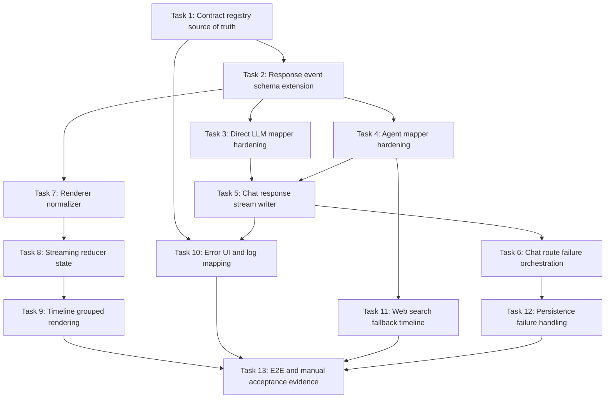

# BloomAI LLM Response Contract v1 Event Timeline TODO Tasks

## 1. 文档信息

- 日期：2026-06-26
- 状态：可落地 TODO task 拆解
- 来源文档：`docs/llm/llm-response-contract-v1-event-timeline-table.md`
- 相关设计：`docs/llm/llm-response-contract-v1-design.md`
- 目标：把统一事件表、Timeline 展示状态、错误码映射和端到端分支链路拆成可实施、可测试、可验收的任务

## 2. 总体目标

建立一套可执行、可查询、可测试的 LLM Response Timeline 事件体系：

1. 后端统一输出 `ResponseStreamEvent`。
2. 前端 Timeline 只消费 `ResponseContentBlock` 和 registry 派生的 view model。
3. 工具调用按同类相邻策略分组，最多两层折叠。
4. LLM、Agent、Tool、Web Search、Fallback、Abort、Persistence 等错误路径都有可见 UI 状态和后端日志。
5. 文档中的统一事件表、Timeline 状态表、错误码映射可以在 TS registry 中查询和测试。

## 3. 任务依赖图

## 4. 可并行策略

可并行：

- Task 3 和 Task 4：都依赖 Task 2，但 Direct LLM mapper 与 Agent mapper 互不修改同一文件。
- Task 7 和 Task 5：前端 normalizer 与后端 writer 可并行，只要 Task 2 的事件类型稳定。
- Task 9 和 Task 10 的测试设计可并行，但实现接入时都依赖 Task 8。
- Task 11 的工具 fallback 事件策略可与 Task 9 UI 分组并行设计，但最终验收需要合并。

必须顺序：

- Task 1 -> Task 2：registry/source of truth 应先稳定，再扩展 schema。
- Task 2 -> Task 3/4/7：mapper 和 normalizer 都依赖 event contract。
- Task 5 -> Task 6：route 需要 writer 负责 SSE、trace、usage、error state 累积。
- Task 8 -> Task 9：Timeline 分组必须基于 reducer 后的 `StreamingResponseState`。
- Task 13 必须最后做，因为它收集跨模块验收证据。

## 5. Task 1: 建立 Contract Registry Source of Truth

### 功能目标

把文档里的“统一事件表、Timeline 展示状态表、错误码到 Timeline 映射”落成可 import、可查询、可测试的 TS registry，作为后续 UI 和后端日志的统一语义来源。

### 功能列表

- 定义 `RESPONSE_EVENT_REGISTRY`，覆盖全部 `ResponseStreamEvent['type']`。
- 定义 `TIMELINE_STATE_REGISTRY`，覆盖关键 Timeline 状态。
- 定义 `ERROR_TIMELINE_REGISTRY`，覆盖 v1 错误码。
- 提供查询函数：
  - `getResponseEventDefinition(type)`
  - `getTimelineStateDefinition(key)`
  - `resolveErrorTimeline(error)`
- 未知错误码 fallback 到 `UNKNOWN_ERROR`。

### 实现函数、接口和文件

新增或修改：

- `src/shared/llm-response-contract/event-registry.ts`
  - `RESPONSE_EVENT_TYPES`
  - `ResponseEventType`
  - `ResponseEventDefinition`
  - `RESPONSE_EVENT_REGISTRY`
  - `getResponseEventDefinition`
- `src/shared/llm-response-contract/timeline-state-registry.ts`
  - `TimelineStateKey`
  - `TimelineStateDefinition`
  - `TIMELINE_STATE_REGISTRY`
  - `getTimelineStateDefinition`
- `src/shared/llm-response-contract/error-timeline-registry.ts`
  - `KnownResponseErrorCode`
  - `ErrorTimelineDefinition`
  - `ERROR_TIMELINE_REGISTRY`
  - `isKnownResponseErrorCode`
  - `resolveErrorTimeline`
- `src/shared/llm-response-contract/index.ts`
- `src/shared/llm-response-contract/registry.test.ts`

### 边界：不修改的功能和文件

- 不接入 `src/renderer/pages/Chat/Timeline.tsx`。
- 不修改 SSE 事件协议。
- 不修改 `src/shared/schemas/response.ts`。
- 不改变现有错误展示行为。

### 测试策略

单元测试：

- registry 覆盖全部 `ResponseStreamEvent['type']`。
- `response_failed` definition 包含可见错误语义。
- `tool_soft_failed` 能查到正确 Timeline 状态。
- `resolveErrorTimeline` 对未知 code fallback 到 `UNKNOWN_ERROR`。

集成测试：

- 暂无；该任务只提供共享纯数据。

用例测试：

- 输入 `TOOL_CALL_ERROR`，返回“工具执行失败”和 `mark_related_group_failed`。
- 输入未知 code，返回 `UNKNOWN_ERROR` definition。

### 关键功能点验收证据

- `npm test -- src/shared/llm-response-contract/registry.test.ts`
- `npm run build`
- 代码审查确认 registry 是纯 TS 数据，不依赖 React/server-only 模块。

### 依赖的任务

- 无。

### 可并行的任务

- 无。该任务是后续任务基础。

## 6. Task 2: 补齐 Response Event Schema 可扩展字段

### 功能目标

让 v1 contract 支持 Web Search fallback、工具阶段描述、UI 状态摘要等场景，同时保持向后兼容。

### 功能列表

- 在 `tool_call_delta.patch` 中新增 optional 字段：
  - `statusMessage?: string`
  - `metadata?: Record<string, unknown>`
- 可选：为 `ToolCallBlock` 增加 `metadata?: Record<string, unknown>`。
- 保持所有新增字段 optional。
- Zod schema 接受新字段，但旧 payload 仍通过。

### 实现函数、接口和文件

修改：

- `src/shared/schemas/response.ts`
  - `ToolCallDeltaEvent`
  - `ToolCallBlock`
  - `ResponseStreamEventSchema`
- `src/shared/schemas/response.test.ts`
  - 新增 `tool_call_delta` optional 字段测试。

### 边界：不修改的功能和文件

- 不新增 `search_started/search_completed` 事件。
- 不改变已有 event type 名称。
- 不把 `ResponseError.code` 从 `string` 改成强 union，避免破坏第三方/旧数据兼容。
- 不修改 Timeline 组件。

### 测试策略

单元测试：

- `tool_call_delta.patch.statusMessage` 可通过 schema。
- `tool_call_delta.patch.metadata` 可通过 schema。
- 缺少新增字段的旧 `tool_call_delta` 仍通过。
- 未知 event type 仍被拒绝。

集成测试：

- 暂无；只扩展 contract。

用例测试：

- fallback 文案 event：
  - `statusMessage: '主搜索失败，正在切换备用搜索'`
  - `metadata: { provider: 'duckduckgo', fallbackFrom: 'tavily' }`

### 关键功能点验收证据

- `npm test -- src/shared/schemas/response.test.ts`
- `npm run build`

### 依赖的任务

- Task 1。

### 可并行的任务

- Task 3、Task 4、Task 7 可在本任务完成后并行。

## 7. Task 3: Direct LLM Mapper 链路补齐

### 功能目标

确保 Direct LLM 成功、失败、partial failure、empty stream、abort 都能稳定映射为 v1 event，并让前端永远收到可收口的事件序列。

### 功能列表

- Direct LLM success 输出：
  - `response_started`
  - `content_block_started`
  - `content_delta...`
  - `usage_updated?`
  - `content_block_completed`
  - `response_completed`
- before-content failure 输出 `response_failed`。
- after-partial failure 保留 partial content 并输出 `response_failed`。
- empty stream 也输出 `response_completed`。
- abort/cancel 映射为 `response_failed` + `STREAM_ABORTED`。

### 实现函数、接口和文件

修改：

- `src/server/llm/response-event-mapper.ts`
  - `mapLlmStreamToResponseEvents`
  - `createContentBlockStartedEvent`
  - `createContentBlockCompletedEvent`
  - `createResponseCompletedEvent`
  - `getErrorMessage`
- `src/server/llm/response-event-mapper.test.ts`

可能新增：

- `createResponseFailedEvent(error, code)` helper。

### 边界：不修改的功能和文件

- 不修改 provider runtime 接口：
  - `src/server/llm/types.ts`
  - `src/server/llm/providers/*`
- 不在 provider 层引入 UI block 概念。
- 不修改 Chat route 持久化逻辑；本任务只保证 mapper 输出。

### 测试策略

单元测试：

- 多个 `delta` 使用同一个 `blockId`。
- `usage` 映射为 `TokenUsage`。
- `done` 后发送 `content_block_completed` + `response_completed`。
- source 抛错后发送 `response_failed`。
- before-content failure 不发送空 markdown block。
- after-partial failure 保留已发送 content events。
- abort error code 为 `STREAM_ABORTED`。

集成测试：

- 暂无；route 集成在 Task 6。

用例测试：

- 输入 generator：`delta('A') -> delta('B') -> done`。
- 输入 generator：第一个事件前 throw。
- 输入 generator：`delta('A')` 后 throw。

### 关键功能点验收证据

- `npm test -- src/server/llm/response-event-mapper.test.ts`
- 断言 event type sequence。
- 断言 failure event 的 `error.code`。

### 依赖的任务

- Task 2。

### 可并行的任务

- Task 4、Task 7。

## 8. Task 4: Agent Mapper 链路补齐

### 功能目标

确保 Agent no-tool、tool success、tool soft failure、tool hard failure、Agent runtime failure 都能映射为 v1 event，并保留工具 trace。

### 功能列表

- Agent no-tool success 输出 markdown events。
- `tool_call_start` -> `tool_call_started`。
- `tool_call_result` -> `tool_call_completed`。
- `tool_call_error` -> `tool_call_failed`。
- soft failure 后允许继续输出 `content_delta`。
- hard failure 后输出 `response_failed`。
- Agent 已发送可见事件后失败，不静默 fallback。
- `done.trace` 映射到 `response_completed.trace`。
- Web Search fallback 阶段通过 `tool_call_delta.statusMessage` 表达。

### 实现函数、接口和文件

修改：

- `src/server/agent/mastra/response-event-mapper.ts`
  - `createAgentResponseEventMapper`
  - `normalizeToolCategory`
  - `summarizeToolOutput`
  - 内部 `startResponse`
  - 内部 `startContentBlock`
  - 内部 `completeContentBlock`
  - 内部 `complete`
- `src/server/agent/mastra/response-event-mapper.test.ts`

可能新增：

- `mapToolStatusDelta`
- `isHardToolFailure`

### 边界：不修改的功能和文件

- 不修改 Mastra SDK raw chunk 解析。
- 不修改工具执行器真实行为。
- 不在 mapper 中做持久化。
- 不在 mapper 中写 UI 组件逻辑。

### 测试策略

单元测试：

- no-tool delta/done sequence。
- tool start/result/done sequence。
- tool error 后继续 delta 并 completed。
- tool error 后 hard failure 产生 `response_failed`。
- Agent `error` before visible event 的映射行为明确。
- Agent `error` after visible event 产生 `response_failed`。
- trace 中包含 success/error tool call。

集成测试：

- route 集成在 Task 6。

用例测试：

- `tool_call_start(web_search) -> tool_call_result -> delta -> done`。
- `tool_call_start(web_search) -> tool_call_error -> delta -> done`。
- `tool_call_start(required_tool) -> tool_call_error -> error`。

### 关键功能点验收证据

- `npm test -- src/server/agent/mastra/response-event-mapper.test.ts`
- 断言 tool trace status。
- 断言 no Mastra raw chunk 出现在 response event 中。

### 依赖的任务

- Task 2。

### 可并行的任务

- Task 3、Task 7。

## 9. Task 5: Chat Response Stream Writer 状态归约

### 功能目标

让 route 不再手动拼 SSE、正文、usage、tool trace、error，而是由 writer 统一发送和归约 v1 events。

### 功能列表

- `send(event)` 发送 SSE。
- 累积 markdown 正文。
- 累积 usage。
- 累积 tool call trace。
- `response_completed.trace` 合并到当前 trace。
- `response_failed` 记录 error state。
- running tool 在 response failed 时标记 interrupted 或 error。

### 实现函数、接口和文件

修改：

- `src/server/routes/chat-response-stream.ts`
  - `createChatResponseStreamWriter`
  - `ChatResponseStreamState`
  - 内部 `currentToolCalls`
  - 内部 `mergeTrace`
- `src/server/routes/chat-response-stream.test.ts`

可能修改：

- `src/shared/schemas/response.ts`
  - 如果需要 trace 扩展字段。

### 边界：不修改的功能和文件

- 不修改 Express route orchestration。
- 不修改 message repository。
- 不修改 frontend。
- 不直接决定 fallback 策略。

### 测试策略

单元测试：

- `content_delta` 累积为 `state.text`。
- `usage_updated` 更新 `state.usage`。
- tool started/completed 形成 success trace。
- tool started/failed 形成 error trace。
- `response_completed.trace` 合并已有 trace。
- `response_failed` 后 state 包含 error。

集成测试：

- Task 6 覆盖 route 层。

用例测试：

- 发送 tool success event 序列，读取 `state().toolCalls`。
- 发送 response_failed，读取 `state().error`。

### 关键功能点验收证据

- `npm test -- src/server/routes/chat-response-stream.test.ts`
- 断言 writer 发出的 SSE payload 是原始 v1 event。

### 依赖的任务

- Task 3、Task 4。

### 可并行的任务

- Task 7。

## 10. Task 6: Chat Route 失败编排与 Fallback 规则

### 功能目标

把 Direct LLM、Agent、Fallback、错误持久化和日志行为统一到 route 层，确保所有响应都有 `response_completed` 或 `response_failed` 收口。

### 功能列表

- Direct LLM route 使用 mapper + writer。
- Agent route 使用 agent mapper + writer。
- Agent before-visible-event failure 可以 fallback 到 Direct LLM。
- Agent after-visible-event failure 必须 `response_failed` 收口，不再静默 fallback。
- before-content LLM failure 返回可见错误信息，不产生空气泡。
- after-partial failure 保存 partial assistant。
- route 层捕获未处理异常并写日志。

### 实现函数、接口和文件

修改：

- `src/server/routes/chat.route.ts`
  - `streamLegacyChat`
  - `streamMastraChat`
  - `sendMappedEvents`
  - `persistAssistantFromWriter`
  - `getErrorMessage`
- `src/server/routes/chat.route.test.ts`

使用：

- `src/server/logger/logger.ts`
  - `logError`
- `src/server/config/config.ts`
  - `readConfigValue`

### 边界：不修改的功能和文件

- 不改数据库 schema。
- 不改 provider 实现。
- 不改前端 Timeline。
- 不引入新的 HTTP endpoint。

### 测试策略

单元测试：

- route helper 如有拆分，覆盖 `persistAssistantFromWriter` fallback content。

集成测试：

- Direct LLM success SSE 顺序。
- Direct LLM before-content failure SSE 包含 `response_failed`。
- Direct LLM after-partial failure 保存 partial text。
- Agent before-visible-event failure fallback 到 Direct LLM。
- Agent after-visible-event failure 不 fallback，输出 `response_failed`。
- LLM/Agent error 写入日志。

用例测试：

- mock provider throw before first delta。
- mock provider throw after one delta。
- mock Agent first event error。
- mock Agent emits tool call then error。

### 关键功能点验收证据

- `npm test -- src/server/routes/chat.route.test.ts`
- 日志目录中产生错误日志的测试断言。
- SSE event types snapshot。

### 依赖的任务

- Task 5。

### 可并行的任务

- Task 8 的 reducer 测试设计可并行，但实现最好等 Task 7。

## 11. Task 7: Renderer Chat Stream Normalizer 补齐

### 功能目标

让前端 API 层无论收到 legacy event 还是 v1 event，都输出统一 `ResponseStreamEvent`，并能补齐 stream 结束或异常时的收口事件。

### 功能列表

- legacy `delta` -> v1 content events。
- legacy `tool_call_start/result/error` -> v1 tool events。
- legacy `done` -> `response_completed`。
- legacy `error` -> `response_failed`。
- v1 event 原样通过。
- stream 结束但缺少 completed 时，`flush()` 补齐收口。
- abort/disconnect 映射为 `STREAM_ABORTED`。
- `tool_call_delta.statusMessage` 透传。

### 实现函数、接口和文件

修改：

- `src/renderer/api/chat-stream-normalizer.ts`
  - `createChatStreamNormalizer`
  - `LegacyChatStreamEvent`
  - `LegacyToolCallView`
  - 内部 `startResponse`
  - 内部 `startContent`
  - 内部 `completeContent`
  - 内部 `completeResponse`
  - `isResponseStreamEvent`
  - `normalizeToolCategory`
  - `summarizeToolOutput`
- `src/renderer/api/chat-stream-normalizer.test.ts`
- `src/renderer/api/index.ts`
  - `platform.chatStream`

### 边界：不修改的功能和文件

- 不修改 store。
- 不修改 Timeline。
- 不修改后端 SSE 格式。
- 不删除 legacy compatibility。

### 测试策略

单元测试：

- legacy delta sequence normalize。
- legacy tool call normalize。
- legacy error normalize。
- v1 event pass-through。
- `flush()` 补齐 missing completed event。
- abort/disconnect 产生 `response_failed` + `STREAM_ABORTED`。

集成测试：

- store integration 在 Task 8。

用例测试：

- 输入 legacy chunks：`delta -> done`。
- 输入 v1 chunks：`response_started -> response_completed`。
- 输入 malformed/unknown chunk，确认可见错误。

### 关键功能点验收证据

- `npm test -- src/renderer/api/chat-stream-normalizer.test.ts`
- `npm run build`

### 依赖的任务

- Task 2。

### 可并行的任务

- Task 3、Task 4、Task 5。

## 12. Task 8: Streaming Response Reducer 状态模型补齐

### 功能目标

让前端 store 使用 `StreamingResponseState` 管理正文、工具调用、usage、error，并为 Timeline 提供稳定输入。

### 功能列表

- `response_started` 创建 state。
- markdown block start/delta/completed 正确更新。
- tool call start/delta/completed/failed 正确更新。
- `usage_updated` 更新 usage。
- `response_completed` 标记 complete。
- `response_failed` 标记 error，并 append `ErrorBlock`。
- running tool 在 failed 时可被 UI 识别为 interrupted。
- 可从 state 派生 legacy `streamingText/toolCalls` 作为过渡兼容。

### 实现函数、接口和文件

修改：

- `src/renderer/store/chat-response-reducer.ts`
  - `StreamingResponseState`
  - `reduceStreamingResponse`
  - 内部 `appendBlock`
  - 内部 `updateBlock`
  - 内部 `updateToolCall`
- `src/renderer/store/chat-response-reducer.test.ts`
- `src/renderer/store/index.ts`
  - `sendMessage`
  - streaming state fields
- `src/renderer/store/index.test.ts`

可能使用：

- `src/shared/llm-response-contract/error-timeline-registry.ts`

### 边界：不修改的功能和文件

- 不修改 Timeline 渲染组件。
- 不修改 ToolCallCard。
- 不改变历史 messages 读取逻辑。

### 测试策略

单元测试：

- content delta append。
- tool call running -> success。
- tool call running -> error。
- tool_call_delta patch `statusMessage/metadata`。
- response_failed before content 生成 error block。
- response_failed after content 保留 partial markdown。

集成测试：

- `sendMessage` 消费 mock v1 stream 后更新 state。
- legacy normalizer + store 一起工作。

用例测试：

- mock stream：search tool failed then content completed。
- mock stream：response_failed before content。

### 关键功能点验收证据

- `npm test -- src/renderer/store/chat-response-reducer.test.ts src/renderer/store/index.test.ts`
- 断言 no empty assistant bubble 的 state 条件。

### 依赖的任务

- Task 7。

### 可并行的任务

- Task 10 的错误映射测试设计。

## 13. Task 9: Timeline Grouped Rendering 接入 Registry

### 功能目标

让 Timeline 按 v1 blocks 渲染正文、工具 group 和错误状态，并使用 registry 中的文案和状态定义；保持最多两层折叠。

### 功能列表

- Timeline 优先消费 `streamingResponse`。
- 相邻同 `category:toolId` 的 tool calls 合并为 group。
- markdown/error/artifact/citation block 切断 tool group。
- group 状态支持：
  - running
  - success
  - error
  - partial_error
  - interrupted
- group card 第一层折叠。
- group 内按状态/阶段第二层折叠。
- 单个 call row 不再折叠。
- `response_started_no_block` 显示轻量等待状态，不显示空气泡。
- `ErrorBlock` 使用错误映射文案。

### 实现函数、接口和文件

修改：

- `src/renderer/pages/Chat/Timeline.tsx`
  - `Timeline`
  - `groupStreamingBlocks`
  - `renderStreamingItem`
  - `renderStreamingBlock`
  - `shouldShowStreamingBubble`
- `src/renderer/pages/Chat/ToolCallGroupCard.tsx`
  - `ToolCallGroup`
  - `createToolCallGroupKey`
  - `ToolCallGroupCard`
  - `groupCallsByStatus`
  - `getOverallStatus`
- `src/renderer/pages/Chat/ToolCallCard.tsx`
  - `ToolCallCard`
  - `normalizeToolCall`
  - `getErrorMessage`
- `src/renderer/pages/Chat/Timeline.test.tsx`
- `src/renderer/pages/Chat/ToolCallGroupCard.test.tsx`
- `src/renderer/pages/Chat/ToolCallCard.test.tsx`
- `src/renderer/styles/global.css`

使用：

- `src/shared/llm-response-contract/timeline-state-registry.ts`
- `src/shared/llm-response-contract/error-timeline-registry.ts`

### 边界：不修改的功能和文件

- 不修改后端协议。
- 不修改 store reducer。
- 不修改 message persistence。
- 不增加第三层折叠。
- 不改变历史 message bubble 结构。

### 测试策略

单元测试：

- 相邻同类 tool calls 合并。
- 不同 group key 不合并。
- markdown block 切断 group。
- failed + success group 显示 partial failed。
- response_failed before content 显示错误，不显示空 assistant bubble。
- response_failed after content 显示 partial answer + 错误提示。

集成测试：

- ChatPanel + Timeline 渲染 mock `streamingResponse`。

用例测试：

- 连续 5 个 `web_search` calls 只显示 1 个 group card。
- `web_search` -> markdown -> `web_search` 显示 2 个 group card。

### 关键功能点验收证据

- `npm test -- src/renderer/pages/Chat/Timeline.test.tsx src/renderer/pages/Chat/ToolCallGroupCard.test.tsx src/renderer/pages/Chat/ToolCallCard.test.tsx`
- Playwright 或 Testing Library 截图/DOM 证据：折叠后不遮挡。

### 依赖的任务

- Task 8。

### 可并行的任务

- Task 10。

## 14. Task 10: 错误码到 Timeline 与日志等级的统一映射

### 功能目标

统一错误码在前端 Timeline 和后端日志中的语义，保证用户看到可读错误，后端记录可定位日志。

### 功能列表

- 使用 `ERROR_TIMELINE_REGISTRY` 映射错误码。
- 前端 ErrorBlock 展示 registry 文案 + 原始安全 message。
- unknown error code fallback 到 `UNKNOWN_ERROR`。
- 后端 log level 使用 registry 或等价映射。
- LLM/Agent/Tool errors 都写入 `LOG_DATA_DIR`。
- 防止 provider raw error 泄露敏感配置。

### 实现函数、接口和文件

修改：

- `src/shared/llm-response-contract/error-timeline-registry.ts`
  - `resolveErrorTimeline`
- `src/server/logger/logger.ts`
  - `appendLog`
  - `logError`
  - `readLogs`
- `src/server/config/config.ts`
  - `readConfigValue`
- `src/server/routes/chat.route.ts`
  - error catch/log points
- `src/renderer/pages/Chat/Timeline.tsx`
  - error block rendering
- `src/renderer/pages/Chat/ToolCallCard.tsx`
  - tool error display

### 边界：不修改的功能和文件

- 不把所有 `ResponseError.code` 改成强 union。
- 不暴露 stack trace 到前端。
- 不改变 `.env` 文件格式。
- 不改数据库 schema。

### 测试策略

单元测试：

- `resolveErrorTimeline` known/unknown code。
- `logError` 写入 LOG_DATA_DIR。
- ToolCallCard 展示 `ResponseError.message`。
- Timeline 展示 error block 文案。

集成测试：

- LLM provider error 触发 SSE `response_failed` + 日志文件。
- Tool error 触发 tool card error + 日志文件。

用例测试：

- `LLM_PROVIDER_ERROR` 显示“大模型调用失败”。
- `TOOL_CALL_ERROR` 显示“工具执行失败”。
- unknown code 显示“发生未知错误”。

### 关键功能点验收证据

- `npm test -- src/shared/llm-response-contract/registry.test.ts src/server/logger/logger.test.ts src/server/routes/chat.route.test.ts src/renderer/pages/Chat/Timeline.test.tsx`
- 检查测试临时 LOG_DATA_DIR 中存在日志文件。

### 依赖的任务

- Task 1、Task 5。

### 可并行的任务

- Task 9。

## 15. Task 11: Web Search Fallback Timeline 表达

### 功能目标

让 Web Search 的 query、主 provider、fallback provider、结果数量、失败原因都能在同一个 `web_search` tool group 中展示，不新增独立搜索事件。

### 功能列表

- query 阶段发送 `tool_call_delta.statusMessage`。
- 主搜索 provider running 发送状态。
- 主 provider failed 时发送 fallback 状态。
- fallback success 后 `tool_call_completed` 包含结果摘要。
- 所有 provider failed 时：
  - soft failure：`tool_call_failed` 后继续回答。
  - hard failure：`tool_call_failed` + `response_failed`。
- Timeline 同一 group 内显示 fallback 阶段。

### 实现函数、接口和文件

修改或新增：

- `src/server/agent/mastra/response-event-mapper.ts`
  - 处理 `tool_call_delta` 或等价 agent event 映射。
- `src/server/agent/mastra/chat-agent-runtime-adapter.ts`
  - 如需要从工具执行阶段产生 progress event。
- `src/server/tools/*`
  - Web search tool provider fallback 状态输出点，具体文件按当前工具目录定位。
- `src/renderer/pages/Chat/ToolCallGroupCard.tsx`
  - 展示 `statusMessage` 或 output summary。
- `src/renderer/pages/Chat/ToolCallGroupCard.test.tsx`

### 边界：不修改的功能和文件

- 不新增 `search_started/search_completed` event。
- 不把 fallback provider 显示成新的 tool card。
- 不把完整搜索 raw output 推给 renderer。
- 不改变搜索 provider 配置读取方式，除非 fallback 当前没有配置入口。

### 测试策略

单元测试：

- fallback statusMessage 被 reducer 保留。
- ToolCallGroupCard 显示 fallback 状态。
- fallback success group 状态为 success。
- fallback failed + partial answer group 状态为 partial_error/error。

集成测试：

- mock search primary failure + fallback success。
- mock all search providers failure + Agent continue。
- mock all search providers failure + response failed。

用例测试：

- Tavily fail -> DuckDuckGo success -> answer completed。
- Tavily fail -> DuckDuckGo fail -> answer with limitation。

### 关键功能点验收证据

- SSE 包含：
  - `tool_call_started`
  - `tool_call_delta` fallback message
  - `tool_call_completed` 或 `tool_call_failed`
- Timeline 只显示一个 `web_search` group。
- `npm test -- src/server/agent/mastra/response-event-mapper.test.ts src/renderer/pages/Chat/ToolCallGroupCard.test.tsx`

### 依赖的任务

- Task 4、Task 9。

### 可并行的任务

- Task 12。

## 16. Task 12: Persistence Failure Handling

### 功能目标

处理 `response_completed` 已发送给前端后，后端保存 assistant message、tool trace 或 tokens 失败的场景，确保有日志和可诊断证据。

### 功能列表

- `persistAssistantFromWriter` 捕获持久化异常。
- 写入 `LOG_DATA_DIR`。
- 记录：
  - `sessionId`
  - `responseId`
  - text length
  - tool call count
  - error message
- 当前 v1 不新增 `response_warning`，所以前端不强制提示。
- 可选：store 保留临时 assistant 显示直到 reload。

### 实现函数、接口和文件

修改：

- `src/server/routes/chat.route.ts`
  - `persistAssistantFromWriter`
  - route catch/finally
- `src/server/routes/chat-response-stream.ts`
  - `ChatResponseStreamState` 增加 `responseId`/error context 如缺失。
- `src/server/logger/logger.ts`
  - `logError`
- `src/server/routes/chat.route.test.ts`

### 边界：不修改的功能和文件

- 不新增数据库表。
- 不新增 `response_warning` event。
- 不改变前端消息刷新策略。
- 不吞掉已经发送给前端的 completed response。

### 测试策略

单元测试：

- persist helper 在 repository throw 时调用 `logError`。

集成测试：

- mock messageRepo save assistant throw。
- SSE 已有 `response_completed`。
- 日志文件包含 persistence error。
- route 不发送第二个 terminal event。

用例测试：

- normal completion + save throw。
- completion with tool trace + save throw。

### 关键功能点验收证据

- `npm test -- src/server/routes/chat.route.test.ts`
- 测试断言日志写入。
- 测试断言 SSE terminal event 只有一个。

### 依赖的任务

- Task 6。

### 可并行的任务

- Task 11。

## 17. Task 13: 端到端验收证据清单

### 功能目标

把所有关键链路跑通并沉淀验收证据，确保事件、Timeline、错误、日志、持久化没有遗漏分支。

### 功能列表

- 建立统一验收清单。
- 汇总自动化测试命令。
- 汇总手动验收场景。
- 记录关键 SSE event sequence。
- 记录 UI DOM/截图证据。
- 记录日志文件证据。

### 实现函数、接口和文件

新增：

- `docs/llm/llm-response-contract-v1-event-timeline-verification.md`

可修改：

- `docs/llm/llm-response-contract-v1-event-timeline-table.md`
  - 增加链接到 verification 文档。

涉及测试文件：

- `src/shared/schemas/response.test.ts`
- `src/shared/llm-response-contract/registry.test.ts`
- `src/server/llm/response-event-mapper.test.ts`
- `src/server/agent/mastra/response-event-mapper.test.ts`
- `src/server/routes/chat-response-stream.test.ts`
- `src/server/routes/chat.route.test.ts`
- `src/renderer/api/chat-stream-normalizer.test.ts`
- `src/renderer/store/chat-response-reducer.test.ts`
- `src/renderer/store/index.test.ts`
- `src/renderer/pages/Chat/Timeline.test.tsx`
- `src/renderer/pages/Chat/ToolCallGroupCard.test.tsx`
- `src/renderer/pages/Chat/ToolCallCard.test.tsx`

### 边界：不修改的功能和文件

- 不新增业务逻辑。
- 不修复验收中发现的问题；发现问题后另开 task。
- 不把临时日志或截图提交到 repo，除非团队明确要求。

### 测试策略

单元测试：

- 运行所有相关单测。

集成测试：

- 运行 route/store/UI 集成测试。

用例测试：

1. Direct LLM success。
2. Direct LLM before-content failure。
3. Direct LLM after-partial failure。
4. Agent no-tool success。
5. Agent web search success。
6. Web search fallback success。
7. Tool soft failure + Agent continue。
8. Tool hard failure + response failed。
9. Agent before-visible failure + Direct LLM fallback。
10. Agent after-visible failure + response failed。
11. Stream aborted。
12. Persistence failure after completed stream。

### 关键功能点验收证据

- 自动化测试输出：
  - `npm test -- src/shared/schemas/response.test.ts src/shared/llm-response-contract/registry.test.ts`
  - `npm test -- src/server/llm/response-event-mapper.test.ts src/server/agent/mastra/response-event-mapper.test.ts src/server/routes/chat-response-stream.test.ts src/server/routes/chat.route.test.ts`
  - `npm test -- src/renderer/api/chat-stream-normalizer.test.ts src/renderer/store/chat-response-reducer.test.ts src/renderer/store/index.test.ts`
  - `npm test -- src/renderer/pages/Chat/Timeline.test.tsx src/renderer/pages/Chat/ToolCallGroupCard.test.tsx src/renderer/pages/Chat/ToolCallCard.test.tsx`
  - `npm run build`
- 每个手动场景记录：
  - 输入 prompt
  - SSE event sequence
  - Timeline UI 状态
  - assistant message 持久化结果
  - tool trace 持久化结果
  - 错误日志路径，如适用

### 依赖的任务

- Task 9、Task 10、Task 11、Task 12。

### 可并行的任务

- 无。该任务是最终收口。

## 18. 阶段 Checkpoints

### Checkpoint A: Contract Foundation

覆盖任务：

- Task 1
- Task 2

验收：

- `npm test -- src/shared/schemas/response.test.ts src/shared/llm-response-contract/registry.test.ts`
- `npm run build`
- 新增字段保持 optional。

### Checkpoint B: Backend Event Pipeline

覆盖任务：

- Task 3
- Task 4
- Task 5
- Task 6

验收：

- Direct LLM、Agent、Tool success/failure 都有 terminal event。
- before-content failure 不出现空 assistant。
- error 写日志。

### Checkpoint C: Renderer State and Timeline

覆盖任务：

- Task 7
- Task 8
- Task 9
- Task 10

验收：

- v1/legacy stream 都能进入统一 state。
- Timeline group 不遮挡，最多两层折叠。
- 错误码映射显示正确。

### Checkpoint D: Search Fallback and Persistence Edges

覆盖任务：

- Task 11
- Task 12

验收：

- fallback 状态在同一 web search group 中展示。
- persistence failure 有日志，不产生第二个 terminal event。

### Checkpoint E: Final Acceptance

覆盖任务：

- Task 13

验收：

- 所有自动化测试通过。
- 12 个端到端用例都有验收证据。
- 文档链接和任务状态更新完成。

## 19. 风险与处理

| 风险 | 影响 | 处理 |
|---|---|---|
| registry 与 schema 漂移 | Timeline 文案和实际事件不一致 | Task 1 单测强制覆盖全部 event type |
| 新增字段破坏旧流 | 旧 SSE 或 legacy normalizer 出错 | Task 2 所有字段 optional，测试旧 payload |
| route fallback 双 terminal event | 前端状态错乱 | Task 6/12 断言每个 response 只有一个 terminal event |
| Tool fallback 被显示成多张卡片 | Timeline 遮挡和噪音 | Task 11 要求同一 `web_search` group 内展示阶段 |
| before-content failure 仍出现空气泡 | 用户看到空白 AI 回复 | Task 8/9 明确 no empty assistant bubble 测试 |
| provider raw error 泄露 | 安全风险 | Task 10 前端使用安全文案，日志写详细信息 |

## 20. 推荐实施顺序

1. Task 1
2. Task 2
3. Task 3 和 Task 4 并行
4. Task 5
5. Task 6
6. Task 7
7. Task 8
8. Task 9 和 Task 10 并行
9. Task 11 和 Task 12 并行
10. Task 13

每完成一个 Checkpoint 后再进入下一阶段，避免后端事件、前端状态和 Timeline UI 同时变化造成难以定位的问题。

