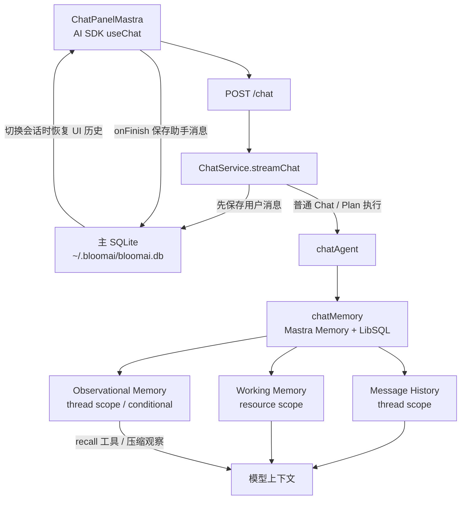
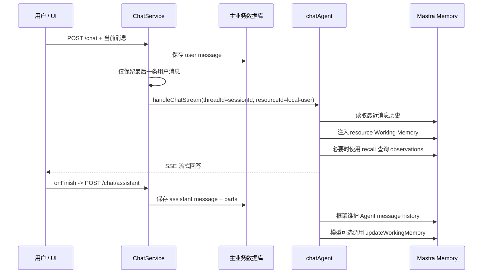
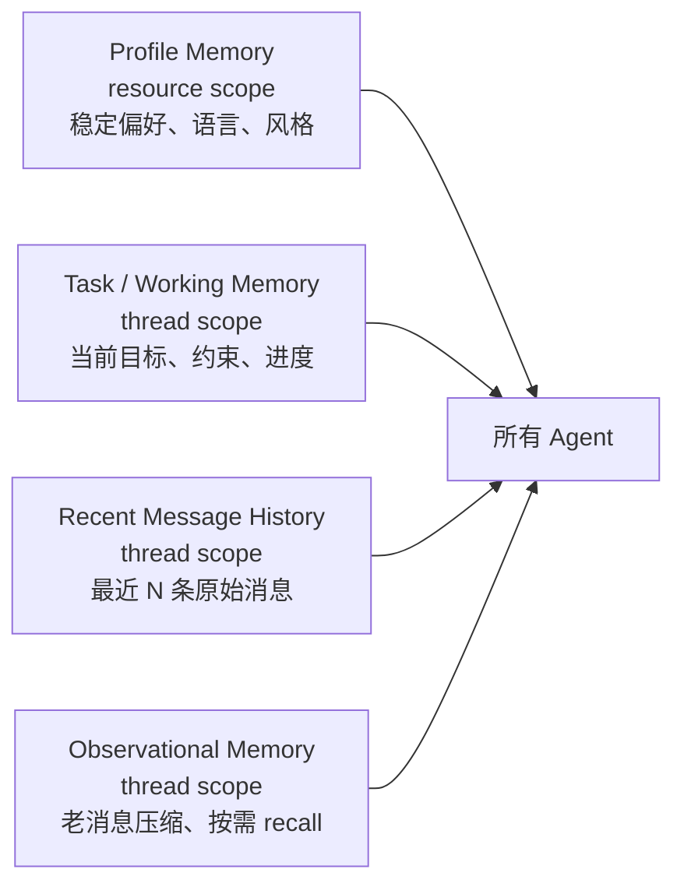

# BloomAI 记忆系统结构、链路与现状分析

> 分析日期：2026-07-17  
> 分析范围：当前 BloomAI 源码、现有本机 SQLite 存储结构与 ChatService 单元测试。  
> 本文不包含任何对话正文、用户事实内容或 API 密钥。

## 1. 结论摘要

BloomAI **并非只有 Observational Memory（观察记忆）**。当前项目已经具备三类能力：

1. **Message History（消息历史）**
   - 主业务库保存完整会话时间线，用于 UI 恢复与审计；
   - Mastra Memory 另存一份 Agent 可读取的线程消息历史，用于普通 Chat 的上下文注入。
2. **Working Memory（工作记忆）**
   - 已启用；
   - 当前按资源（本地用户）范围保存；
   - 本机运行时已有一条非空记录。
3. **Observational Memory（观察记忆）**
   - 已完成代码接线，但按环境和模型条件启用；
   - 当前本机尚未生成 observation 记录，因此尚未实际参与历史压缩或 recall。

因此，准确的描述是：

> **消息历史与 Working Memory 已在使用；Observational Memory 已配置，但当前没有已生成的观察记录。**

---

## 2. 总体架构



系统当前使用两套独立的 SQLite 数据库：

| 存储 | 默认路径 | 职责 |
|---|---|---|
| 主业务数据库 | `~/.bloomai/bloomai.db` | session、完整聊天时间线、UI parts、工具卡片、Assistant 输出持久化 |
| Mastra Memory 数据库 | `~/.bloomai/memory/memory.db` | Agent Message History、Working Memory、Observational Memory |

源码入口：

- `src/server/db/paths.ts`
- `src/server/db/schema.ts`
- `src/server/mastra/memory.ts`
- `src/server/mastra/chat-agent.ts`
- `src/server/services/chat.service.ts`

---

## 3. Message History：存在两层

### 3.1 UI / 业务层完整会话历史

主库包含 `sessions` 与 `messages` 表。`messages` 保存：

- `role`
- `content`
- `parts`
- `tool_calls`
- `tokens`
- `created_at`

相关实现：

- `src/server/db/schema.ts`
- `src/server/db/repositories/message.repo.ts`
- `src/server/services/chat.service.ts`
- `src/server/http/routes/sessions.ts`
- `src/renderer/pages/Chat/ChatPanelMastra.tsx`

持久化与恢复链路：

1. 用户发送消息；
2. `ChatService.persistUserMessage()` 在 Agent 调用前将用户消息写入主库；
3. Assistant 流式响应完成后，前端 `useChat(... onFinish)` 调用 `/chat/assistant`；
4. 服务端将 Assistant 文本、tool/reasoning/workflow UI parts 写入主库；
5. 用户切换会话时，前端请求 `/sessions/:id/messages` 并恢复到 `useChat`。

本次只读核查时，主业务数据库中有：

- 57 个 session；
- 276 条 messages。

因此，完整会话历史已稳定存在，并被 UI 用于恢复聊天时间线。

### 3.2 Agent 上下文层的 Mastra Message History

普通 Chat 还使用 Mastra `Memory` 管理一份 Agent 可用的线程消息历史。

配置文件：`src/server/mastra/memory.ts`

```ts
options: {
  lastMessages,
  // ...
}
```

默认环境变量为：

```env
MEMORY_LAST_MESSAGES=20
```

普通 Chat 在服务层不会将前端完整 `messages` 原样交给 Agent；当启用 Memory 时，它只保留最新消息：

```ts
const latestMessage = input.messages.at?.(-1)
agentMessages = latestMessage ? [latestMessage] : []
```

同时传入 Memory 作用域：

```ts
memory: {
  threadId: input.sessionId,
  resourceId: BLOOMAI_RESOURCE_ID,
}
```

`chatAgent` 本身也挂载了：

```ts
memory: chatMemory
```

所以普通 Chat 的历史上下文主要由 Mastra Memory 根据 `threadId = sessionId` 注入，而不是每轮由前端重新上传全量对话。

本次只读核查时，Mastra Memory 数据库中有：

- 7 个 memory threads；
- 38 条 `mastra_messages`；
- 每个 thread 有 2 到 10 条消息。

当前各线程都没有超过配置的最近消息窗口；此时主要仍是原始消息历史发挥作用。

---

## 4. Working Memory：已实现且已有实际内容

Working Memory 在 `src/server/mastra/memory.ts` 中明确启用：

```ts
workingMemory: {
  enabled: true,
  scope: 'resource',
  schema: workingMemorySchema,
}
```

它是结构化的用户上下文，schema 包含：

- `language`
- `communicationStyle`
- `expertiseLevel`
- `keyFacts`
- `currentGoals`
- `importantContext`

### 4.1 当前作用域

资源 ID 固定为：

```ts
export const BLOOMAI_RESOURCE_ID = 'bloomai-local-user'
```

由于 scope 为 `resource`，实际含义是：

> 同一台本地 BloomAI 的所有会话共享同一份用户记忆档案。

它可承载用户偏好、语言、沟通风格、背景事实、长期目标等跨 session 信息。

### 4.2 更新机制

Working Memory 不通过固定规则每轮强制更新，而是由模型自行调用 Mastra 内部工具：

```text
updateWorkingMemory
```

前端将此工具视为内部副作用，并不展示为普通工具卡片：

```ts
'updateWorkingMemory', // working memory schema update
```

### 4.3 运行时状态

Mastra Memory 数据库中的 `mastra_resources` 表包括：

```sql
mastra_resources (
  id,
  workingMemory,
  metadata,
  createdAt,
  updatedAt
)
```

本次只读核查结果：

- `mastra_resources` 共 1 条；
- 其中 `workingMemory` 非空的记录为 1 条。

因此，Working Memory 不只是配置存在，它已被真实创建并写入。

---

## 5. Observational Memory：已接线，当前没有生成结果

Observational Memory 同样在 `src/server/mastra/memory.ts` 中配置：

```ts
observationalMemory: {
  model: observationModel,
  scope: 'thread',
  retrieval: true,
}
```

特点：

- **thread scope**：按聊天 session 独立；
- 当历史满足 Mastra 内部 token/处理条件时，将旧消息压缩为结构化 observations；
- `retrieval: true` 启用内部 `recall` 工具，模型可以按需回忆已压缩的 observations；
- 不依赖额外向量库。

前端同样将该工具视为内部工具：

```ts
'recall', // observational memory retrieval
```

### 5.1 启用条件

Observational Memory 是条件启用：

1. `MEMORY_OBSERVATION_MODEL` 有配置；或
2. 环境中存在可识别的 Anthropic、OpenAI 或 Google API Key。

所以“源码中写有 Observational Memory”并不等于每次运行都一定启用且成功生成 observation。

### 5.2 当前运行时状态

本次只读核查时：

- `mastra_observational_memory`：0 条。

因此，当前没有已生成的观察记忆，也没有可被 `recall` 检索的压缩历史。

结合每个当前 memory thread 至多 10 条消息，可以合理判断：当前对话规模尚未形成明显的历史压缩需求。除此之外，模型条件、异步生成状态或调用失败也可能影响最终 observation 的生成；仅凭静态源码和无正文的数据库计数无法确认唯一原因。

---

## 6. 普通 Chat 的端到端链路



普通 Chat 的两个必要接入点：

1. `src/server/mastra/chat-agent.ts`：

   ```ts
   memory: chatMemory
   ```

2. `src/server/services/chat.service.ts`：

   ```ts
   memory: {
     threadId: input.sessionId,
     resourceId: BLOOMAI_RESOURCE_ID,
   }
   ```

---

## 7. 不同路径的记忆覆盖不一致

| 路径 | UI 主库消息历史 | Mastra Message History | Working Memory | Observational Memory |
|---|---:|---:|---:|---:|
| 普通 Chat | 有 | 有 | 有 | 条件启用 |
| Plan 执行 | 有 | 有（走 `chatAgent`） | 有 | 条件启用 |
| Plan 方案生成 | 非正常聊天落库 | 未完整接入 | 未完整接入 | 未完整接入 |
| 写作 Agent | 有 | 无 Managed Memory | 无 | 无 |
| 编码 Agent | 有 | 无 Managed Memory | 无 | 无 |
| Deep Research | 有 | 无 | 无 | 无 |

### 7.1 写作与编码 Agent

`writerAgent` 和 `coderAgent` 都未挂载：

```ts
memory: chatMemory
```

并且服务层在选中 team agent 时明确跳过 Memory：

```ts
const useMemory = !input.teamAgentId
```

因此写作和编码模式：

- 可接收前端请求携带的 `input.messages`；
- 但没有 Mastra 的受控最近历史窗口；
- 不读取 Working Memory；
- 不读取 Observational Memory；
- 不会共享普通 Chat 已积累的用户偏好。

### 7.2 Deep Research

Deep 模式直接启动 workflow：

```ts
run.stream({ inputData: { query }, requestContext })
```

它只传入当前 query，没有传入 `memory` 参数，也没有挂载 `chatMemory`。

结论：Deep Research 的结果可以显示与持久化到聊天时间线，但不继承普通 Chat Memory。

### 7.3 Plan Proposal 的不完整接线

`proposePlan()` 传入了 memory 标识：

```ts
memory: {
  thread: input.sessionId,
  resource: BLOOMAI_RESOURCE_ID,
}
```

但 `planAgent` 本身没有：

```ts
memory: chatMemory
```

因此它不像普通 Chat 那样形成完整的 Managed Memory 接入链路。

---

## 8. 旧 Prompt Context 方案

`messageRepo.getHistory()` 依然存在；旧的 `buildChatContext()` 会从主库读取最近 20 条消息：

```ts
const history = deps.messages.getHistory(input.sessionId, input.historyLimit || 20)
```

文件：

- `src/server/prompts/context.ts`
- `src/server/prompts/types.ts`

但当前 Mastra Chat 流程中并没有调用该 context builder；它目前只被旧 prompt 模块和测试引用。

因此项目中同时遗留了两种设计：

1. **旧方案**：主库消息 → `buildChatContext()` → prompt；
2. **现行普通 Chat 方案**：Mastra Memory → 自动注入最近历史 / Working Memory / Observational Memory。

当前普通 Chat 使用的是第 2 种方案。

---

## 9. 架构风险与改进建议

### 9.1 P0：双写数据库，没有一致性保证

同一轮对话会写入两个独立数据库：

- 主库：用户消息同步保存；Assistant 在前端 `onFinish` 后异步保存；
- Memory 库：由 Mastra 运行时维护。

潜在结果：

- Agent 已记住回答，但 UI 主库因异步保存失败而缺少该回答；
- UI 有历史，但 Mastra Memory 没有相应上下文；
- 两者没有回填、校验或修复机制。

尤其 Assistant 保存是 fire-and-forget：

```ts
.saveAssistantMessage(...)
.catch(() => {})
```

**建议：**增加持久化失败可观测性、重试/补偿任务、双库一致性检查或明确单一真源策略。

### 9.2 P1：Working Memory 的命名与实际语义不一致

Working Memory 使用 `resource` scope，真实更像跨 session 的长期用户档案，而不是短期任务工作区。

风险：

- `currentGoals` 容易陈旧；
- 不同项目/主题间可能相互污染；
- 未来多账号、多 profile 时，固定 `bloomai-local-user` 会产生隔离问题。

**建议的分层：**



### 9.3 P1：Observational Memory 缺少可观测性和用户控制

当前 UI 隐藏了内部 `updateWorkingMemory` 和 `recall` 工具，也没有管理界面/API 来查看：

- 当前 Working Memory；
- 已生成 observations；
- observation 是否失败；
- 最后生成时间、压缩量、关联 thread；
- 用户如何编辑、删除和导出记忆。

**建议：**增加 Memory Inspector，并支持查看、编辑、清空、导出和按 scope 删除。

### 9.4 P1：会话删除不等于遗忘

主库删除会话的实现是软归档：

```ts
status = 'archived'
```

当前没有看到对 Mastra Memory 中以下数据的同步清理：

- `mastra_messages`；
- `mastra_threads`；
- `mastra_observational_memory`；
- resource-level Working Memory。

**建议：**明确“归档”“删除 UI 会话”“删除 thread memory”“清除个人 profile memory”四种语义，并分别提供 API。

### 9.5 P2：不同 Agent 的记忆体验不统一

普通 Chat 具备 Managed Memory，写作、编码和 Deep Research 不具备。

如果产品语义是统一的个人助手，应统一至少读取 Profile Memory；如果各 tab 必须隔离，则需要在 UI 上明确提示用户“该模式不会使用聊天记忆”。

---

## 10. 优先级建议

1. **统一 Agent Memory 策略**：明确 Writer、Coder、Deep Research 是否读取 Profile / Task Memory。
2. **拆分 Profile 与 Task Working Memory**：稳定偏好保留 resource scope，任务状态改用 thread scope。
3. **增加 Memory Inspector**：提供可见、可编辑、可删除的记忆管理能力。
4. **统一删除与归档语义**：将主库 session 和 Mastra thread memory 的生命周期关联起来。
5. **处理双写一致性**：至少记录同步状态、失败重试和修复机制。
6. **增加 Observation telemetry**：展示启用状态、触发条件、生成失败、最后更新时间与压缩统计。

---

## 11. 本次验证

执行了以下目标测试：

```text
npm test -- src/server/services/chat.service.test.ts
```

结果：

```text
13 tests passed
```

覆盖内容包括：

- 普通 Chat 传入 `threadId + resourceId` 的 memory 参数；
- 选中 team agent 时不传 Memory；
- 用户消息先于 Agent 流执行持久化。

本次分析仅进行源码和数据库结构/计数的只读核查，未修改业务代码或数据库内容。
