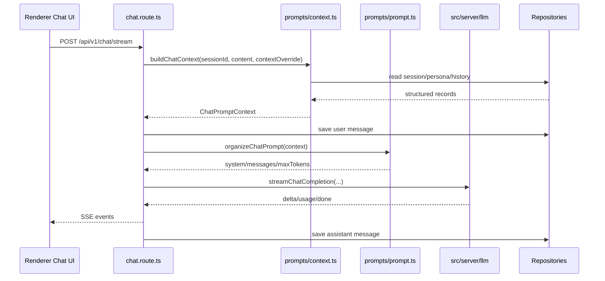

# Prompt v1 设计与实现

## 状态

已采纳并已实现。

## 日期

2026-06-24

## 背景

在 Prompt v1 之前，`src/server/routes/chat.route.ts` 在一个路由里直接承担了过多职责：

- 读取会话
- 读取人格设定
- 读取最近的消息历史
- 组装 system prompt
- 追加运行时上下文，例如当前活跃应用和剪贴板内容
- 构造最终的 `messages` payload
- 调用 LLM runtime
- 将 SSE 事件流式返回给 renderer

这让 chat 路由同时负责 HTTP/SSE 行为和 prompt 构造。随着上下文继续扩展到 memory、工具结果、选中文件、工作区状态或 RAG 片段，把 prompt 逻辑继续放在路由里，会让路由越来越难测试，也更难演进。

Prompt v1 引入了独立的 `src/server/prompts` 模块。Chat 程序现在通过 prompt 层来构建结构化上下文，并组织最终提交给 LLM 的 prompt。

## 目标

- 将 prompt 和 context 相关后端代码放到 `src/server/prompts` 下。
- 让 `chat.route.ts` 专注于请求校验、SSE 流、持久化和模型调用。
- 保持现有 chat 行为和 SSE 响应格式不变。
- 保持现有 prompt 输出格式不变：
  - persona system prompt 或默认 BloomAI system prompt
  - `---` 分隔符下的可选运行时上下文
  - 最近会话历史加当前用户消息
- 为后续 memory 和更丰富的上下文来源提供清晰扩展点。

## 非目标

- 暂不新增基于数据库的 prompt 管理系统。
- 暂不新增长期记忆存储。
- 不改变 LLM provider runtime 行为。
- 不改变前端 SSE 协议。
- 不改变模型选择语义。

## 设计

Prompt v1 分成两个阶段：

```text
chat.route.ts
  -> buildChatContext()
  -> organizeChatPrompt()
  -> streamChatCompletion()
```

### 1. Context Builder

由 `src/server/prompts/context.ts` 实现。

Context builder 负责收集 prompt 组织所需的结构化事实：

- session
- persona
- 最近聊天历史
- 当前用户输入
- 运行时 context override
- base system prompt

base system prompt 的选择顺序是：

```text
persona.system_prompt
  -> DEFAULT_CHAT_SYSTEM_PROMPT
```

默认 prompt 是：

```text
You are BloomAI, a helpful AI assistant. Be concise, accurate, and friendly.
```

当 session 不存在时，context builder 返回 `null`。这样 route 可以保持原来的 `Session not found` SSE 错误行为。

### 2. Prompt Organizer

由 `src/server/prompts/prompt.ts` 实现。

Prompt organizer 将结构化 context 转换成最终的 LLM 请求 payload：

```ts
type OrganizedChatPrompt = {
  system: string
  messages: Array<{ role: 'user' | 'assistant'; content: string }>
  maxTokens: number
}
```

system prompt 组装保持之前的行为：

```text
<base system prompt>

---
Active app: <active app>
Clipboard:
<clipboard content, truncated to 800 characters>
```

messages 的组装方式是：

```text
recent user/assistant history
current user message
```

这会保持原来的顺序，并避免重复加入当前用户消息，因为 history 是在当前用户消息持久化之前收集的。

## 已实现文件

### `src/server/prompts/types.ts`

定义 prompt 模块的类型合同：

- `ChatPromptMessage`
- `ChatPromptContextOverride`
- `ChatPromptDeps`
- `BuildChatContextInput`
- `ChatPromptContext`
- `OrganizedChatPrompt`
- `OrganizeChatPromptOptions`

`ChatPromptDeps` 的作用是让测试可以注入轻量的 repository 替身，避免触碰真实数据库。

### `src/server/prompts/context.ts`

导出：

- `DEFAULT_CHAT_SYSTEM_PROMPT`
- `buildChatContext(input)`

这个文件拥有 prompt context 相关的 repository 读取逻辑：

- `sessionRepo.get`
- `personaRepo.get`
- `messageRepo.getHistory`

### `src/server/prompts/prompt.ts`

导出：

- `organizeChatPrompt(context, options)`

这个文件拥有最终 prompt 格式化和请求形状组装逻辑。

### `src/server/prompts/index.ts`

导出 prompt 模块的公开 API：

```ts
export { DEFAULT_CHAT_SYSTEM_PROMPT, buildChatContext } from './context'
export { organizeChatPrompt } from './prompt'
export type * from './types'
```

### `src/server/prompts/prompt.test.ts`

覆盖：

- 从 session、persona、history 和 runtime override 构建 context
- 没有 persona 时回退到默认 system prompt
- 使用 history、当前用户消息、active app 和截断后的 clipboard 内容组装最终 LLM prompt

### `src/server/routes/chat.route.ts`

从路由内联 prompt 拼接改为调用 prompt 模块：

```ts
const promptContext = buildChatContext({ sessionId, userContent: content, contextOverride })
const prompt = organizeChatPrompt(promptContext, { maxTokens: 4096 })
```

route 仍然负责：

- SSE 初始化和响应事件
- 请求校验
- 用户消息持久化
- 会话标题更新
- 模型选择
- `streamChatCompletion`
- assistant 消息持久化
- 流式错误处理

## 运行流程



## 验证

实现已通过以下命令验证：

```bash
npm test -- src/server/prompts/prompt.test.ts src/server/routes/chat.route.test.ts
npm run typecheck
npm run build
```

结果：

- prompt 测试通过
- chat route 测试通过
- TypeScript typecheck 通过
- production build 通过

## 后续扩展点

### Memory

未来的 memory retrieval 应该加入 context builder，而不是加入 route：

```ts
type MemoryItem = {
  scope: 'global' | 'persona' | 'session'
  content: string
  importance?: number
}
```

Prompt organization 可以再决定如何把 memory 渲染进 system prompt。

### Tool 和 File Context

工具结果、选中文件、工作区摘要和 RAG 片段都应该作为结构化 section 进入 `ChatPromptContext`。它们不应该直接追加在 `chat.route.ts` 里。

### Prompt Templates

如果 BloomAI 后续需要用户可编辑的 prompt templates，可以在 prompt 模块背后增加 prompt template repository。route 应继续调用同一组高层 prompt API。

## 决策总结

Prompt v1 选择小而直接的代码级 prompt 模块，而不是一开始就引入数据库驱动的 prompt registry。这样第一版可以保持简单，同时建立正确的后端边界。route 将 context 和 prompt 组织委托给 `src/server/prompts`，后续新的上下文来源可以在 prompt 模块内部增长，而不会继续膨胀 chat route。
