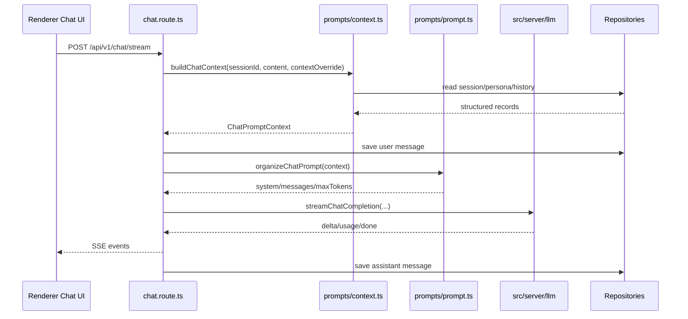

# Prompt v1 Design and Implementation

## Status

Accepted and implemented.

## Date

2026-06-24

## Context

Before Prompt v1, `src/server/routes/chat.route.ts` directly handled too many responsibilities in one route:

- read the session
- read the persona
- read recent message history
- assemble the system prompt
- append runtime context such as active app and clipboard
- build the final `messages` payload
- call the LLM runtime
- stream SSE events back to the renderer

This made the chat route responsible for both HTTP/SSE behavior and prompt construction. As context grows to include memory, tool results, selected files, workspace state, or RAG snippets, keeping prompt logic inside the route would make the route harder to test and evolve.

Prompt v1 introduces a dedicated `src/server/prompts` module. Chat code now asks the prompt layer to build structured context and organize the final LLM prompt.

## Goals

- Put prompt and context related backend code under `src/server/prompts`.
- Keep `chat.route.ts` focused on request validation, SSE streaming, persistence, and model invocation.
- Preserve existing chat behavior and SSE response shape.
- Preserve existing prompt output format:
  - persona system prompt or default BloomAI system prompt
  - optional runtime context under a `---` separator
  - recent conversation history plus the current user message
- Create a clear extension point for future memory and richer context sources.

## Non-Goals

- Do not add a database-backed prompt management system yet.
- Do not add long-term memory storage yet.
- Do not change LLM provider runtime behavior.
- Do not change the frontend SSE protocol.
- Do not change model selection semantics.

## Design

Prompt v1 is split into two stages:

```text
chat.route.ts
  -> buildChatContext()
  -> organizeChatPrompt()
  -> streamChatCompletion()
```

### 1. Context Builder

Implemented by `src/server/prompts/context.ts`.

The context builder gathers structured facts needed by prompt organization:

- session
- persona
- recent chat history
- current user content
- runtime context override
- base system prompt

The base system prompt is selected as:

```text
persona.system_prompt
  -> DEFAULT_CHAT_SYSTEM_PROMPT
```

The default prompt is:

```text
You are BloomAI, a helpful AI assistant. Be concise, accurate, and friendly.
```

The context builder returns `null` when the session does not exist. This lets the route preserve the existing `Session not found` SSE error behavior.

### 2. Prompt Organizer

Implemented by `src/server/prompts/prompt.ts`.

The prompt organizer converts structured context into the final LLM request payload shape:

```ts
type OrganizedChatPrompt = {
  system: string
  messages: Array<{ role: 'user' | 'assistant'; content: string }>
  maxTokens: number
}
```

System prompt assembly keeps the previous behavior:

```text
<base system prompt>

---
Active app: <active app>
Clipboard:
<clipboard content, truncated to 800 characters>
```

Messages are assembled as:

```text
recent user/assistant history
current user message
```

This preserves the original ordering and avoids duplicating the current user message, because history is collected before the user message is persisted.

## Implemented Files

### `src/server/prompts/types.ts`

Defines the prompt module contracts:

- `ChatPromptMessage`
- `ChatPromptContextOverride`
- `ChatPromptDeps`
- `BuildChatContextInput`
- `ChatPromptContext`
- `OrganizedChatPrompt`
- `OrganizeChatPromptOptions`

`ChatPromptDeps` exists so tests can inject lightweight repository doubles without touching the real database.

### `src/server/prompts/context.ts`

Exports:

- `DEFAULT_CHAT_SYSTEM_PROMPT`
- `buildChatContext(input)`

This file owns repository reads for prompt context:

- `sessionRepo.get`
- `personaRepo.get`
- `messageRepo.getHistory`

### `src/server/prompts/prompt.ts`

Exports:

- `organizeChatPrompt(context, options)`

This file owns final prompt formatting and request-shape assembly.

### `src/server/prompts/index.ts`

Exports the public prompt module API:

```ts
export { DEFAULT_CHAT_SYSTEM_PROMPT, buildChatContext } from './context'
export { organizeChatPrompt } from './prompt'
export type * from './types'
```

### `src/server/prompts/prompt.test.ts`

Covers:

- context building from session, persona, history, and runtime overrides
- default system prompt fallback when no persona exists
- final LLM prompt assembly with history, current user message, active app, and truncated clipboard content

### `src/server/routes/chat.route.ts`

Changed from inline prompt assembly to prompt module delegation:

```ts
const promptContext = buildChatContext({ sessionId, userContent: content, contextOverride })
const prompt = organizeChatPrompt(promptContext, { maxTokens: 4096 })
```

The route still owns:

- SSE setup and response events
- request validation
- user message persistence
- session title update
- model selection
- `streamChatCompletion`
- assistant message persistence
- stream error handling

## Runtime Flow



## Verification

The implementation was verified with:

```bash
npm test -- src/server/prompts/prompt.test.ts src/server/routes/chat.route.test.ts
npm run typecheck
npm run build
```

Results:

- prompt tests passed
- chat route tests passed
- TypeScript typecheck passed
- production build passed

## Future Extension Points

### Memory

Future memory retrieval should be added to the context builder instead of the route:

```ts
type MemoryItem = {
  scope: 'global' | 'persona' | 'session'
  content: string
  importance?: number
}
```

Prompt organization can then decide how to render memory into the system prompt.

### Tool and File Context

Tool results, selected files, workspace summaries, and RAG snippets should enter through `ChatPromptContext` as structured sections. They should not be appended directly inside `chat.route.ts`.

### Prompt Templates

If BloomAI later needs user-editable prompt templates, add a prompt template repository behind the prompt module. The route should keep calling the same high-level prompt API.

## Decision Summary

Prompt v1 chooses a small, code-level prompt module rather than a database-backed prompt registry. This keeps the first version simple while establishing the correct backend boundary. The route delegates context and prompt organization, and future context sources can grow inside `src/server/prompts` without expanding the chat route.
