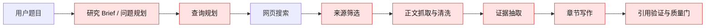
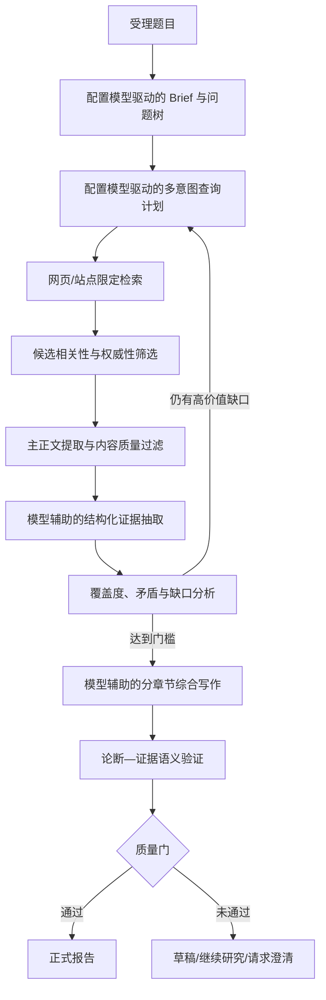

# BloomAI“深度研究”报告质量问题：根因分析与修复建议

- 文档状态：分析结论 / 修复建议
- 日期：2026-07-18
- 范围：BloomAI 当前持久化深度研究工作流（`src/server/mastra/deepresearch`）
- 关联运行：`bccf869c-7791-4568-afe8-db6ce4947a57`、`1c352fee-cc85-42bb-ab66-8464b24bfcb3`、`0a570822-ace6-4d25-a0a3-d64550d8cc3d`
- 本文性质：基于本地报告产物、SQLite 运行记录和源码的诊断；不依赖外部搜索结论。

---

## 1. 执行摘要

当前“深度研究”报告字数少、内容浅、正文混入网页导航/新闻噪声、章节无法回答用户问题，**不是单一的搜索 API 故障，也不是简单增加搜索次数即可解决的问题**。

最主要的根因是：生产默认运行时虽然注册了 Mastra Agent 并具备模型解析能力，但实际工作流默认注入的是 `createDeterministic*` 实现。问题规划、查询规划、证据抽取、缺口分析、章节写作、引用验证和报告批评均未真正调用后台配置的大语言模型。真实运行记录中 `tokens = 0`、`providerCostUsd = 0` 进一步证明了这一点。

因此，实际流程近似为：

> 固定问题分类 → 将题目机械拼到查询词 → 通用网页搜索 → 基于来源类型/到达顺序筛选 → 取网页前几个 packet 的首条长句 → 拼接摘要与原文。

它并不是“规划—检索—阅读—比较—推理—写作—审查”的深度研究闭环。

修复的核心不是把某个固定模型硬编码为“GPT-5.6 Terra”。**深度研究必须调用 BloomAI 后台“模型/供应商设置”中已启用的文本大模型**（例如用户配置的 Agnes、DeepSeek、OpenAI、Anthropic 或兼容 OpenAI API 的模型）。模型选择、密钥、Base URL 和可用性必须复用项目现有 LLM registry / settings / resolver，而非在深度研究模块内写死某个厂商或模型名。

---

## 2. 已检查的证据与量化结果

### 2.1 三次真实运行概览

| Run ID | 主题（简写） | Profile / Depth | 查询数 | 搜索结果 | 入库来源 | 成功快照 | 证据数 | 高优先级问题覆盖 | 结果 |
| --- | --- | --- | ---: | ---: | ---: | ---: | ---: | ---: | --- |
| `bccf869c-7791-4568-afe8-db6ce4947a57` | 市场/销售线索发现 AI Agent | market / standard | 14 | 112 | 14 | 10 | 40 | **0** | completed_with_limitations |
| `1c352fee-cc85-42bb-ab66-8464b24bfcb3` | 国际咨询公司 AI 战略服务 | general / deep | 19 | 116 | 50 | 21 | 31 | **0** | completed_with_limitations |
| `0a570822-ace6-4d25-a0a3-d64550d8cc3d` | LLM 推理方法和技术 | general / standard | 8 | 64 | 24 | 11 | 3 | **0** | completed_with_limitations |

结论：

1. 搜索并非完全不可用。第一个 run 的 Tavily 查询全部完成并返回 112 个候选结果。
2. 即使是 `deep` 深度、50 个来源、21 个抓取快照的运行，也没有形成高优先级问题覆盖。
3. 三个 run 都被质量系统标记为高优先级问题不足，却仍以 `completed_with_limitations` 对外完成。
4. 这说明问题主要是检索之后的规划、筛选、证据、综合写作和发布质量门，而不是“没有搜到任何结果”。

### 2.2 市场/销售线索 Agent run 的检索轨迹

该 run 使用：

- provider：`tavily`
- 搜索查询：14 次，均完成
- 搜索结果：112 条
- 来源：14 条，其中 `reputable-secondary` 为 13 条、`pricing-page` 为 1 条
- 成功抓取快照：10 条；其中 2 条正文少于 1,000 字符
- 证据：40 条，但仅来自 5 个快照；平均 passage 长度约 314 字符

实际选入的来源包括保险 Agent、商品发现、AI 手机、PCB 设计 Agent、电信 AI、泛 AI 新闻、法律风险新闻等。例如：InsuranceNewsNet、Practical Ecommerce、RCR Wireless、TechCrunch、Forbes、CNBC、Newsweek。它们大多不能直接回答“B2B 市场/销售线索发现 AI Agent 产品类别和技术”的问题。

所有 14 个来源的 curation 分数都是 **45 分**。这表明筛选未形成有效的主题相关性排序，基本退化为低区分度的来源类型评分与候选到达顺序。

### 2.3 查询质量与补充研究浪费

初始查询的实际形式类似：

```text
做市场线索、销售线索发现的ai agent产品，研究有哪些类别，使用哪些技术
做市场线索、销售线索发现的ai agent产品，研究有哪些类别，使用哪些技术: market-definition
```

这类查询重复题目、混入英文分类标签，未生成应有的产品、技术、厂商、数据来源、站点限定、语言扩展或时间限定。

第 1 次 gap-fill 计划了 6 个查询，但每个高优先级问题的“缺少所需来源类型”“缺少权威来源”“缺少近期来源”最终都退化为相同的：

```text
... market-definition required evidence category
```

或：

```text
... segmentation required evidence category
```

结果为：计划查询 6、执行 6、**新增来源 0、新增证据 0**。增加预算前必须先修复检索意图构造和去重，否则只会增加成本和噪声。

---

## 3. 根因链路



### 3.1 P0：默认运行时未调用配置的大模型

相关文件：

- [src/server/deepresearch/index.ts](D:/codeproject/JS/bloomai/src/server/deepresearch/index.ts)
- [src/server/mastra/deepresearch/mastra.ts](D:/codeproject/JS/bloomai/src/server/mastra/deepresearch/mastra.ts)

`createDeepResearchMastraRuntime()` 的默认值是：

```ts
const planner = options.planner ?? createDeterministicBriefPlanner()
const queryPlanner = options.queryPlanner ?? createDeterministicQueryPlanner()
const evidenceAnalyst = options.evidenceAnalyst ?? createDeterministicEvidenceAnalyst()
const gapAnalyst = options.gapAnalyst ?? createDeterministicGapAnalyst()
const sectionWriter = options.sectionWriter ?? createDeterministicSectionWriter()
const claimExtractor = options.claimExtractor ?? createDeterministicClaimExtractor()
const citationVerifier = options.citationVerifier ?? createDeterministicCitationVerifier()
const reportCritic = options.reportCritic ?? createDeterministicReportCritic()
```

虽然每个 agent 文件中都有 `new Agent(...)` 和 `resolveMastraModel(...)`，但这些 Agent 只是被注册到 Mastra；工作流实际调用的是上述 deterministic interface 实现。真实运行的模型 token / 成本均为 0 与这一行为一致。

**影响：**系统没有语义规划、没有模型化检索改写、没有阅读理解、没有证据综合、没有深度写作，因而不可能稳定产出高质量研究报告。

### 3.2 P0：问题树与查询策略为静态模板

相关文件：

- [src/server/mastra/deepresearch/steps/plan-questions.ts](D:/codeproject/JS/bloomai/src/server/mastra/deepresearch/steps/plan-questions.ts)
- [src/server/mastra/deepresearch/agents/query-planner.ts](D:/codeproject/JS/bloomai/src/server/mastra/deepresearch/agents/query-planner.ts)
- [src/server/deepresearch/domain/profiles.ts](D:/codeproject/JS/bloomai/src/server/deepresearch/domain/profiles.ts)

当前 `plan-questions` 将 profile 的固定 category（如 `market-definition`、`segmentation`、`market-sizing`）直接拼到用户题目。`query-planner` 再把 `run.topic + question.question` 作为搜索词。

这会让市场线索 Agent 研究缺少真正的研究问题，例如：

- 销售线索发现 Agent 与销售情报、intent data、visitor identification、data enrichment、ABM、outbound sequencing 的边界是什么？
- 产品应如何按数据源、工作流能力、目标客户、自动化程度和 CRM 集成方式分类？
- 典型产品的信号采集、实体解析、评分、检索、RAG、知识图谱、Agent 工具调用分别如何实现？
- 哪些结论来自官方产品文档、客户案例、行业报告或市场数据？

### 3.3 P1：搜索可用，但来源筛选不做相关性判断

相关文件：

- [src/server/services/deepresearch/search-service.ts](D:/codeproject/JS/bloomai/src/server/services/deepresearch/search-service.ts)
- [src/server/services/deepresearch/source-curator.ts](D:/codeproject/JS/bloomai/src/server/services/deepresearch/source-curator.ts)

搜索服务将搜索 API 的 title、URL、snippet 基本原样交给 curator。`SourceCurator.scoreSource` 的评分主要依据粗略 source type、少数关键词和旧年份，不计算：

- 题目/问题与标题、摘要的语义相关性；
- 是否确实属于所研究的行业、产品类别和技术方向；
- 是否包含可验证市场数据、产品能力、架构或案例；
- 可信度、来源一手性、发布时效与重复新闻聚合。

当前 source type 识别也过窄：基本只识别 `.gov`、`sec.gov`、arXiv、pricing、documentation，其余绝大多数网站都被归为 `reputable-secondary`。这与 market profile 要求的官方统计、行业协会、公司材料、主调查、研究机构等来源类型不匹配。

### 3.4 P1：正文抓取未提取主内容

相关文件：

- [src/server/services/deepresearch/content-service.ts](D:/codeproject/JS/bloomai/src/server/services/deepresearch/content-service.ts)

当前 `sanitizeContent` 主要处理敏感头、路径和空白字符，不做网页 boilerplate、导航、页脚、推荐栏、cookie 横幅、视频页 UI、验证码、付费墙提示的主内容清洗。因此网页导航文本、作者信息、站点菜单和广告可能进入 snapshot，并在后续成为“证据”。

### 3.5 P0：证据分析仅取前 3 篇的第一条长句

相关文件：

- [src/server/mastra/deepresearch/agents/evidence-analyst.ts](D:/codeproject/JS/bloomai/src/server/mastra/deepresearch/agents/evidence-analyst.ts)
- [src/server/services/deepresearch/evidence-service.ts](D:/codeproject/JS/bloomai/src/server/services/deepresearch/evidence-service.ts)

确定性证据分析器：

```ts
for (const packet of packets.slice(0, 3)) {
  const excerpt = firstCitableSentence(packet)
}
```

`firstCitableSentence` 只取每个 packet 中第一个长度至少 80 字符的句子。第一句常是标题、摘要、作者/导航文字或弱相关引导，不是回答问题的最相关段落。

这会造成：

- 每个问题可用证据很少；
- 没有基于 question 的相关性重排；
- 不提取数字、类别、技术、产品能力、限制条件；
- 不做正反证据和独立来源对比；
- 同一弱相关网页片段曾被广播给多个问题。此前已提交的证据路由修复解决了“跨问题广播/跨章节完全重复”，但没有解决证据质量问题。

### 3.6 P0：章节写作只是证据摘要与原文拼接

相关文件：

- [src/server/mastra/deepresearch/agents/section-writer.ts](D:/codeproject/JS/bloomai/src/server/mastra/deepresearch/agents/section-writer.ts)
- [src/server/mastra/deepresearch/steps/section-evidence.ts](D:/codeproject/JS/bloomai/src/server/mastra/deepresearch/steps/section-evidence.ts)

当前 deterministic writer 的核心逻辑：

```ts
const draft = evidence.map((item) => item.summary + ' ' + item.passage).join('

')
```

而每个章节选择的 evidence 又被限制为最多 3 条。它不组织论点、不分类、不比较来源、不解释技术路径、不做去重、不识别事实边界。因此文本即便有一千多字符，也可能只是网页文字拼贴，而不是研究结论。

### 3.7 P1：质量门验证“形式”，没有阻止低质量发布

相关文件：

- [src/server/mastra/deepresearch/steps/assess-quality.ts](D:/codeproject/JS/bloomai/src/server/mastra/deepresearch/steps/assess-quality.ts)
- [src/server/mastra/deepresearch/agents/citation-verifier.ts](D:/codeproject/JS/bloomai/src/server/mastra/deepresearch/agents/citation-verifier.ts)

质量门当前允许：

- 高优先级覆盖率为 0；
- 重要章节只有“证据不足”模板；
- 章节正文很短；
- 引用来自低相关网页；
- 用简单文本包含关系得到“supported citation”；

然后发布为 `completed_with_limitations`。这使系统的“研究成功”语义与真实质量不一致。

---

## 4. 对三个常见假设的结论

| 假设 | 结论 | 依据 |
| --- | --- | --- |
| 搜索 API 有问题 | 不是首要根因 | Tavily 在样本 run 中完成 14 次查询、返回 112 条候选；不能据此判定 API 故障。 |
| 搜索内容质量差 | 是重要因素 | 查询泛化，候选中混入大量泛 AI 新闻，curator 没有主题语义排序与质量阈值。 |
| 搜索次数不足 | 有影响，但不是第一根因 | deep run 仍有 19 查询 / 50 来源 / 21 快照，却高优先级覆盖为 0；而且补充查询重复且无新增证据。 |
| 报告写得少且浅 | 最主要来自证据与写作层 | deterministic evidence analyst 只取首句，deterministic section writer 直接拼接，且每章最多三条 evidence。 |

正确的归因顺序为：

1. **先解决生产运行时未使用配置大模型的问题；**
2. **再解决题目驱动的问题树、查询设计和来源相关性；**
3. **再解决正文提取、证据抽取和综合写作；**
4. **最后以严格质量门决定是否可以发布；**
5. **在上述能力可用后，再优化搜索次数、并发和成本。**

---

## 5. 目标架构与模型配置原则

### 5.1 不硬编码供应商或模型名

深度研究应使用“BloomAI 已配置、已启用、支持 text modality 的模型”，而不是在业务代码写死 `gpt-5.6-terra` 或其他特定模型。

项目已有可复用的模型设施：

- [src/server/mastra/model-resolver.ts](D:/codeproject/JS/bloomai/src/server/mastra/model-resolver.ts)
- [src/server/llm/model-selection.ts](D:/codeproject/JS/bloomai/src/server/llm/model-selection.ts)
- [src/server/llm/settings.ts](D:/codeproject/JS/bloomai/src/server/llm/settings.ts)
- [src/server/llm/types.ts](D:/codeproject/JS/bloomai/src/server/llm/types.ts)

它们已支持 OpenAI、Anthropic、Agnes、DeepSeek、Ollama 和 OpenAI-compatible provider。目标是新增一个“深度研究模型选择策略”，例如：

1. Run/API 显式指定的模型（若已启用且支持 text）；
2. 后台设置中的 `deep_research_model`；
3. 后台通用文本模型设置；
4. 无可用模型时返回明确的 `RESEARCH_MODEL_UNAVAILABLE`，不悄悄退化为 deterministic 研究。

模型的 provider、modelId、选择来源、prompt/schema 版本、实际 token、失败原因必须写入 run/attempt 诊断记录，以便复现和审计。

### 5.2 目标闭环



---

## 6. 修复建议

### 6.1 第一优先级：让深度研究调用后台配置的大模型

1. 建立 `DeepResearchModelResolver` 或扩展现有 `resolveRuntimeModel`，将 deep research 作为独立 consumer/setting；
2. 把 `createDeepResearchMastraRuntime` 的生产默认实现替换为 LLM-backed adapter；
3. 保留 deterministic 实现仅用于显式单元测试、离线 fixture 或开发调试，不得作为生产静默 fallback；
4. 采用结构化 JSON schema 输出，所有 Agent 输出均验证后入库；
5. 按阶段区分模型预算：规划/查询可用较低成本模型，证据综合/章节写作/批评使用后台配置的高质量文本模型；也可先采用同一配置模型，后续再增加阶段覆盖设置；
6. 若后台模型、密钥或 provider 不可用，则将 run 标记为 `awaiting_input` 或 `failed`，附上可操作错误，而不是生成伪深度报告。

### 6.2 第二优先级：重建题目驱动的问题树与检索策略

1. LLM 根据 topic/profile/用户上下文生成明确问题树、优先级、所需证据类型、地区和时间范围；
2. 每个问题生成 2–5 条不同意图的查询：定义/产品/技术/市场数据/公司资料/反证/近期变化；
3. 生成中英文同义词和必要的站点限定；
4. 对 gap 提供不同修复意图，按 query 规范化结果去重；
5. 不使用 `required evidence category` 这种面向内部状态的搜索词；
6. 为市场研究建立专门 query template：官方产品页、产品文档、客户案例、投资者资料、行业协会、调查、研究机构和高可信行业媒体。

### 6.3 第三优先级：来源与正文质量过滤

1. 以模型或 embedding 对 `question + title + snippet` 做相关性评分；
2. 在抓取后再次以正文评估相关性和信息密度；
3. 增强 source type 分类：公司官网、产品文档、定价页、客户案例、投资者材料、行业协会、研究机构、官方统计、同行评审、新闻二次报道；
4. 按问题设置独立域名、一手来源和近期来源的最低目标；
5. 使用主内容提取器或增加 boilerplate 过滤，拒绝导航、验证码、付费墙和极短页面；
6. 将来源选取理由、相关性、权威性、拒绝原因持久化，便于 UI 和调试展示。

### 6.4 第四优先级：结构化证据和真正的章节综合

1. 每个问题从多个相关来源提取多个带 offset 的 passage，而不是“前 3 篇的第一个长句”；
2. evidence schema 应包括事实类别、实体、数字、时间、产品、技术、支持/反对/背景关系、相关性和置信度；
3. Writer 只能基于绑定 evidence ID 写作，并输出 claims 与 evidence IDs；
4. 每章要有结论、依据、比较、边界和不足，禁止贴原文；
5. 章节选择按 question、意图和 evidence relevance 路由，避免重新引入此前已修复的跨章节证据广播问题；
6. 引用应展示 title + URL + 必要元数据，而不是证据 UUID。

### 6.5 第五优先级：把质量门改为发布门

下列情形不得作为正式 `completed` 报告发布：

- 高优先级问题覆盖率低于阈值（建议 0.8）；
- 关键章节只包含固定“证据不足”文本；
- 章节少于最低有效长度，或没有最低独立来源数；
- 缺少可验证的关键结论；
- citation 未通过语义蕴含验证；
- 所有来源为低相关二手新闻，或没有所需的一手/权威来源。

未达标时应区分：

- `awaiting_input`：需要用户缩小范围、指定地区/行业/时间范围；
- `researching`：仍有预算且有高价值可执行检索；
- `completed_with_limitations`：仅在清晰标为“受限研究草稿”、且用户允许发布时使用；
- `failed`：模型/工具不可用、关键结构化输出持续无效、不可恢复系统错误。

---

## 7. 验收指标

修复后须重新运行相同主题；历史 artifact 不会因代码更新自动重建。验收至少包含：

1. **模型调用可证明**：run/attempt 中有 provider、model、选择来源、tokens、cost；tokens 不再恒为 0。
2. **查询质量**：出现与题目直接相关的类别、产品、技术、数据和站点限定查询；gap 查询无重复。
3. **来源质量**：不再以泛 AI 新闻为主；至少有官方产品页、产品文档、客户案例、研究机构/行业资料中的若干类。
4. **证据质量**：每条关键 evidence 与问题相关，正文不含导航/页脚噪声，并有可追溯 offset。
5. **报告质量**：各章节不重复；明确回答类别、代表产品/能力、技术、数据来源、适用场景、局限；引用有标题与 HTTP(S) URL。
6. **质量门**：高优先级问题覆盖达到门槛，或系统明确不发布正式报告并说明缺口。

---

## 8. 与已完成修复的关系

以下已提交修复应保留：

- `06b63d2 fix: cap iteration retrieval to its reservation`：防止 `Actual fetchedSources exceeds its reservation`。
- `d3be4a0 fix: route report evidence by question and section`：防止跨问题/跨章节 evidence 广播造成章节重复，并让 references 展示可读标题和链接。

它们解决的是预算一致性和报告正确性。本文提出的工作解决的是**研究深度、相关性、证据质量、模型执行与发布质量**，两类工作互补，不应回退前述修复。
