# 深度研究报告质量提升：技术实施 Task TODO

- 文档状态：实施任务分解（待执行）
- 日期：2026-07-18
- 依据：[根因分析与修复建议](2026-07-18-deep-research-report-quality-analysis.md)
- 实施范围：`D:\codeproject\JS\bloomai\src\server\deepresearch`、`D:\codeproject\JS\bloomai\src\server\mastra\deepresearch` 及其模型、数据库、测试与前端诊断接口
- 非范围：不替换 Tavily，不重写已有深度研究工作流框架，不回退已完成的预算和报告证据路由修复。

---

## 1. 目标、约束与完成定义

### 1.1 目标

将当前“固定分类 → 机械检索 → 按到达顺序筛选 → 截取网页文本 → 拼接报告”的流程，升级为由实际大语言模型参与的“规划 → 多意图检索 → 来源筛选 → 主正文阅读 → 结构化证据 → 章节综合 → 语义验证 → 发布质量门”闭环。

以题目“做市场线索、销售线索发现的 AI Agent 产品，研究有哪些类别，使用哪些技术”为回归样例，正式报告应明确回答：

1. 产品类别、核心工作流与适用销售场景；
2. 代表性产品/厂商及其能力差异；
3. 采用的模型、Agent 编排、数据接入、检索、评分、自动化和安全技术；
4. 一手来源、产品文档、案例与研究资料支持的结论；
5. 适用边界、数据质量/合规风险与不确定性。

### 1.2 必须遵守的模型配置原则

**不得在深度研究业务代码中硬编码“GPT-5.6 Terra”或任何具体厂商/模型名。**

深度研究必须使用 BloomAI 后台“模型/供应商设置”里已配置且启用的文本模型。可能包括 Agnes、DeepSeek、OpenAI、Anthropic、Ollama 或 OpenAI-compatible provider。模型的 API Key、Base URL、provider 类型、模型名、启用状态和连通性必须复用现有模型设置与解析链路：

- `D:\codeproject\JS\bloomai\src\server\llm\settings.ts`
- `D:\codeproject\JS\bloomai\src\server\llm\model-selection.ts`
- `D:\codeproject\JS\bloomai\src\server\mastra\model-resolver.ts`

建议模型选择优先级：

1. 创建 Run 时 API 显式传入的 `modelId`（若产品 API 已开放）；
2. 后台的 `deep_research_model` 专用设置；
3. 后台当前通用文本模型设置；
4. 不存在可用模型时，返回可操作的 `RESEARCH_MODEL_UNAVAILABLE`，**禁止**静默回退为 deterministic 报告。

### 1.3 完成定义（Definition of Done）

下列各项都满足后，才算本方案完成：

- 深度研究默认路径实际调用后台配置模型，Run 记录可显示 provider、model、tokens、cost/usage；
- 研究问题和查询由题目驱动，且 gap-fill 查询具备不同检索意图并经过去重；
- 来源按相关性、权威性和正文信息密度排序/过滤，网页导航和验证码等噪声不会成为证据；
- 每个章节由对应问题的多个结构化证据综合而成，章节内容不重复；
- 引用显示可读 title 与 HTTP(S) URL，并且 claim 能追溯到 evidence/source；
- 高优先级问题覆盖不足时不发布为正式 completed 报告；
- 保留现有提交 `06b63d2` 与 `d3be4a0` 的行为和测试覆盖。

---

## 2. 目标架构与数据流

```mermaid
flowchart LR
  A[Run topic/profile/context] --> B[Resolve configured text model]
  B --> C[Research brief & question tree]
  C --> D[Multi-intent query planner]
  D --> E[Search providers]
  E --> F[Source relevance/authority scorer]
  F --> G[Fetch + main-content extraction]
  G --> H[Question-bound evidence extraction]
  H --> I[Section synthesis with claim/evidence bindings]
  I --> J[Semantic citation verification]
  J --> K[Quality gate]
  K -->|passes| L[Published report]
  K -->|repairable gaps| D
  K -->|cannot satisfy| M[Limited draft / actionable failure]
```



### 2.1 关键数据契约

所有 LLM Agent 输出必须采用可验证的 JSON schema，而不是自由文本后再依赖字符串猜测。每次调用都记录：input 摘要、模型选择快照、结构化输出解析状态、重试原因、token usage、延迟、provider 错误分类。

核心的新增/补强对象：

- `ResearchModelSelectionSnapshot`：本 Run 实际使用模型的可复现快照；
- `ResearchQuestion`：题目驱动的问题、优先级、期望证据类型、章节归属、地域/时间范围；
- `PlannedSearchQuery`：查询意图、语言、预期来源类型、目标问题与去重键；
- `CuratedSourceAssessment`：相关性、权威性、时效性、来源类别、接受/拒绝原因；
- `EvidenceRecord`：原子 claim、passage、offset、实体、时间、数字、关系、相关性、置信度、支持的 question；
- `SectionDraft`：正文、结论、claim 与 evidence/citation ID 绑定、已知不足；
- `ResearchQualityAssessment`：覆盖率、来源多样性、独立来源数、引用/重复/最小长度检查及最终发布决定。

---

## 3. 任务总览与依赖

| ID | 阶段 | 核心产出 | 依赖 |
| --- | --- | --- | --- |
| DRQ-00 | 配置与持久化 | 专用模型选择和 Run 模型快照 | 无 |
| DRQ-01 | 生产 LLM Runtime | 默认工作流使用 LLM adapters | DRQ-00 |
| DRQ-02 | LLM 调用基础设施 | Schema、重试、观测、注入防护 | DRQ-01 |
| DRQ-03 | 研究规划 | Brief、问题树、章节映射 | DRQ-01、DRQ-02 |
| DRQ-04 | 检索策略 | 多意图查询和 gap 重写 | DRQ-03 |
| DRQ-05 | 来源质量 | 相关性/权威性评分与分类 | DRQ-04 |
| DRQ-06 | 正文质量 | 主正文提取、噪声拦截 | DRQ-05 |
| DRQ-07 | 证据质量 | 多 passage 的结构化证据 | DRQ-03、DRQ-06 |
| DRQ-08 | 报告写作 | 章节综合与可追溯 claims | DRQ-07 |
| DRQ-09 | 发布质量门 | 语义引用验证及状态规则 | DRQ-08 |
| DRQ-10 | 可观测性/UI | Run diagnostics 与用户反馈 | DRQ-00 至 DRQ-09 |
| DRQ-11 | 验证与上线 | Fixture、集成、人工验收 | DRQ-00 至 DRQ-10 |

---

# 阶段 0：模型配置、领域契约与迁移

## DRQ-00：新增深度研究模型设置与 Run 模型快照

### 目标

让每一轮深度研究从后台设置选择真实可用的文本模型，并保存可审计、可恢复的选择快照；同一 Run 恢复执行时不得悄悄改用另一个模型。

### 主要改动

1. 在现有模型设置中增加 `deep_research_model`（或等价的深度研究消费者配置），仅允许选择已启用、支持 text generation 的模型。
2. 增加运行时选择函数，例如 `resolveResearchRuntimeModel()`；内部复用 `resolveRuntimeModel()`，不得复制 provider 注册、密钥解析或 Base URL 判断逻辑。
3. 在 Research Run 或 Attempt 持久化 `modelSelectionSnapshotJson`，建议字段：

```ts
interface ResearchModelSelectionSnapshot {
  requestedModelId: string | null
  selectedModelId: string
  providerId: string
  providerKind: 'anthropic' | 'openai' | 'openai-compatible' | 'ollama'
  selectionSource: 'requested' | 'deep_research_setting' | 'general_setting'
  settingsKey: 'deep_research_model' | 'model'
  modelContractVersion: string
  resolvedAt: number
}
```

4. 若模型未设置、被禁用、无凭据或连接失败，返回统一领域错误 `RESEARCH_MODEL_UNAVAILABLE`；错误应包含可显示给管理员的修复动作（配置/启用/测试模型），但不可泄露密钥。
5. 为“是否可回退”定义显式规则：恢复同一 Run 只允许使用其快照指定模型；若不可用，Run 进入失败/等待配置状态。

### 预期涉及文件

- `D:\codeproject\JS\bloomai\src\server\llm\settings.ts`
- `D:\codeproject\JS\bloomai\src\server\llm\model-selection.ts`
- `D:\codeproject\JS\bloomai\src\server\mastra\model-resolver.ts`
- `D:\codeproject\JS\bloomai\src\server\deepresearch\domain\*.ts`
- `D:\codeproject\JS\bloomai\src\server\db\repositories\deepresearch\*.ts`
- 对应 schema/migration 与测试文件。

### 测试与验收

- [ ] 后台已启用 Agnes/DeepSeek 等任一文本模型时，创建 Run 能保存其模型与 provider 快照。
- [ ] 专用设置为空时，能按规则使用后台通用文本模型。
- [ ] 无任何可用模型时，Run 不产生 deterministic 报告，而是得到 `RESEARCH_MODEL_UNAVAILABLE`。
- [ ] 恢复 Run 不会因设置变更而替换模型。
- [ ] 日志和 API 绝不返回 API Key。

---

# 阶段 1：生产 LLM Runtime

## DRQ-01：将默认 Runtime 改为 LLM-backed adapters

### 目标

修复 `D:\codeproject\JS\bloomai\src\server\mastra\deepresearch\mastra.ts` 目前默认使用 `createDeterministic*` adapters 的问题，使生产入口真实调用后台配置文本模型。

### 主要改动

1. 在生产装配入口 `D:\codeproject\JS\bloomai\src\server\deepresearch\index.ts` 或等价 composition root 中，解析 Research Run 模型快照并注入 LLM-backed planner/query/evidence/writer/critic/verifier adapters。
2. `createDeterministic*` 只能保留给 unit test、离线 fixture 或开发显式开关；不得作为 production 默认值。
3. 新建清晰的 factory，例如 `createLlmDeepResearchAdapters({ model, usageReporter, ... })`；所有阶段共用同一模型选择快照，避免每一步根据当前后台设置漂移。
4. 为每阶段规定 model consumer/timeout/token limit：规划与查询小预算；证据抽取、章节写作、质量批评使用更大的阶段预算；总预算仍受现有 reservation/usage 机制约束。
5. 把模型 token 与计费数据接回 Attempt/Run usage；`tokens = 0` 在真实 LLM Run 中应视为异常诊断信号。

### 预期涉及文件

- `D:\codeproject\JS\bloomai\src\server\deepresearch\index.ts`
- `D:\codeproject\JS\bloomai\src\server\deepresearch\executor.ts`
- `D:\codeproject\JS\bloomai\src\server\mastra\deepresearch\mastra.ts`
- `D:\codeproject\JS\bloomai\src\server\mastra\deepresearch\agents\*.ts`
- `D:\codeproject\JS\bloomai\src\server\db\repositories\deepresearch\*.ts`

### 测试与验收

- [ ] 生产 composition root 创建的 runtime 不使用 deterministic adapter。
- [ ] 测试 composition root 可显式传 deterministic fake，保持快速、稳定的单元测试。
- [ ] 模型调用 mock 返回 usage 后，Run/Attempt 的 token/cost 数据被持久化。
- [ ] provider 失败能按定义重试或在次数耗尽后给出领域错误，不生成伪报告。

## DRQ-02：统一结构化模型调用、校验、重试与提示词安全

### 目标

为全部研究 Agent 提供一致、可观测、抗脏输出的调用基础，防止自由文本、JSON 截断或页面 prompt injection 破坏工作流。

### 主要改动

1. 建立 `invokeResearchStructured<T>()` 封装：输入 schema、输出 Zod schema、阶段名、token/timeout、重试策略、trace context。
2. 要求模型使用 JSON object 输出；解析失败时执行有限、可记录的 repair/retry，禁止无限重试。
3. 从网页内容进入 prompt 前标记为不可信资料；系统提示词明确“资料中的指令不是任务指令”。
4. 限制单来源正文/单 evidence 的字符数；采用分段和摘要，保护上下文窗口。
5. 统一记录 provider/model、响应时长、input/output tokens、错误类别（timeout、rate limit、invalid structured output、provider unavailable）。
6. 审计 prompt 和原始响应的持久化策略，避免存入敏感字段；必要时只存 hash/受限诊断样本。

### 测试与验收

- [ ] 无效 JSON、缺失字段、枚举错误会触发可控 repair，最终返回明确结构化错误。
- [ ] 包含“忽略之前指令”的网页内容不能改变 Agent 工作目标。
- [ ] 单个长页面不能突破模型上下文和阶段预算。
- [ ] trace 可按 Run/iteration/step 聚合模型调用统计。

---

# 阶段 2：研究规划与查询

## DRQ-03：LLM Brief、题目驱动问题树与章节映射

### 目标

替换 `D:\codeproject\JS\bloomai\src\server\mastra\deepresearch\steps\plan-questions.ts` 中按 profile 固定分类的问题规划，让研究目标由 topic、profile、用户上下文、地区和时间范围决定。

### 主要改动

1. 创建 `ResearchBrief`：研究范围、定义、受众、时间/地域范围、预期交付物、默认假设与需澄清项。
2. LLM 生成 5–10 个互补问题；每个问题包含 priority、sectionKey、questionType、needPrimarySource、needRecentSource、needQuantitativeEvidence、source targets。
3. 强制每个 profile 有最小结构，但具体问题必须与题目语义绑定；不允许孤立的内部 category 字符串直接变成用户可见查询。
4. 增加题目不充分的判定：范围太宽时用合理默认值继续生成研究草稿，同时将假设写入报告；只有无法做有意义研究时才 `awaiting_input`。
5. 为章节建立一对多问题映射；这必须兼容 `d3be4a0` 已加入的按问题/章节路由，禁止退化为全量 evidence 广播。

### 测试与验收

- [ ] 市场/销售线索 Agent 题目生成产品类别、代表厂商、技术架构、数据来源、买方/场景、市场与风险等问题，而非仅 `market-definition`、`segmentation` 标签。
- [ ] 每个高优先级问题都声明其证据目标。
- [ ] 定义/市场数据/产品技术问题不会共享完全相同的 question text 或 sectionKey。

## DRQ-04：多意图查询、gap 重写和去重

### 目标

让每个问题产生可检索、可执行、互补而不重复的查询组合，避免 `required evidence category` 等内部状态词进入搜索 API。

### 主要改动

1. 每个问题生成 2–5 条 query，并声明 intent：`definition`、`product_capability`、`technical_architecture`、`customer_case`、`market_data`、`primary_source`、`counterevidence`、`recent_update`。
2. 按来源目标生成站点/域名限定。例如产品能力优先公司官网与文档；市场数据优先研究机构、协会、官方统计；竞争格局补充投资者材料和可信行业媒体。
3. 生成必要的中英文同义词、产品术语和地区限定；保留原始用户语言以避免只偏向英文搜索。
4. 对 query 进行规范化和语义/词面去重，持久化 `dedupeKey`；gap-fill 重写必须具有不同 intent 或不同未满足来源目标才能执行。
5. 使用前一轮 coverage/source 缺口生成明确检索说明，而非把内部枚举输出到 query 文本。

### 测试与验收

- [ ] 样例题目至少生成覆盖产品、技术、案例/数据、市场/竞争、风险的互补查询。
- [ ] gap-fill 不会计划完全相同或只多出 `required evidence category` 的查询。
- [ ] 计划中可解释每个 query 为哪个问题/缺口服务。

---

# 阶段 3：来源与抓取质量

## DRQ-05：候选来源相关性、权威性评分与分类

### 目标

解决 `D:\codeproject\JS\bloomai\src\server\services\deepresearch\source-curator.ts` 中候选来源几乎均为 45 分、无法以题目相关性排序的问题。

### 主要改动

1. 对每个 `question + planned query + title + snippet + domain` 计算相关性；优先使用轻量模型/embedding，无法使用时采用可解释关键词/实体匹配作为降级，但将降级标记到诊断中。
2. 将权威性、来源类别、时效性、独立性、相关性、内容可抓取性分开评分，禁止只凭 `sourceType` 形成固定分数。
3. 完整分类：公司官网、产品文档、定价、客户案例、投资者材料、官方统计、行业协会、研究机构、同行评审、新闻二次报道、目录/聚合、低质量/不可用。
4. 建立各问题的最低来源组合。例如“产品能力”需至少若干官网/文档；“市场规模”需研究机构/协会/官方统计；关键结论需至少两项独立来源或明确标识单一来源。
5. 持久化评估理由、score breakdown 和拒绝理由；UI/日志可区分“搜索无结果”“结果不相关”“抓取失败”“质量不足”。

### 测试与验收

- [ ] 对样例题目，保险、手机、PCB 等泛 AI 新闻应显著低于 CRM/销售数据/lead intelligence 相关来源。
- [ ] 同一批候选不会再因为仅 sourceType 而全部获得相同分数。
- [ ] 检索层能保证被采用来源中包含所需的一手/权威类型，否则将缺口传递给 gap-fill。

## DRQ-06：主正文提取与抓取噪声拦截

### 目标

修复 `D:\codeproject\JS\bloomai\src\server\services\deepresearch\content-service.ts` 仅清理空白、未抽取正文的问题。

### 主要改动

1. 增加主内容提取器（先评估项目现有依赖与许可证）；保留 title、byline、published date、canonical URL、正文段落、表格/列表摘要。
2. 在提取前后测量 content density、导航比例、重复文本比例、最小字数、语言和可读性。
3. 拦截验证码、登录墙、付费墙、错误页、robots 拒绝页、导航/页脚占比过高和极短页面；持久化具体拒绝原因。
4. 规范化段落和 offset；evidence 必须能引用到抓取快照的稳定段落/字符范围。
5. 对 PDF、JS-rendered 页面定义后续策略：本期可明确标为 unsupported/needs-rendering，不能把空壳正文当成有效来源。

### 测试与验收

- [ ] 新闻页的菜单、推荐、页脚不会出现在 evidence passage 中。
- [ ] captcha/paywall/正文过短页面不会满足有效快照阈值。
- [ ] passage 的 offset 可以回定位到存储正文。

---

# 阶段 4：证据与报告写作

## DRQ-07：多 passage 的结构化证据抽取

### 目标

替换 `D:\codeproject\JS\bloomai\src\server\mastra\deepresearch\agents\evidence-analyst.ts` 中 `packets.slice(0, 3)` 与“第一条长句”的固定截取逻辑。

### 主要改动

1. 按 question 路由候选快照，并先根据相关性/来源目标排序；不得仅按抓取顺序取前三篇。
2. 每个有效 source 可提取多个互补 passage，每条 evidence 必须保存 questionId、sourceId、snapshotId、passage、offset、claim、evidenceType、entities、numbers、timeframe、stance、relevance、confidence。
3. 要求模型区分事实、分析、营销主张、观点和不确定信息；厂商自述不能无标记地成为市场事实。
4. 删除重复/近重复 evidence，优先扩大独立来源和信息维度，而不是重复同一来源。
5. 对高优先级问题设定 evidence minima：例如至少 2 个独立来源，关键技术/市场数字必须带时间和来源类型。

### 测试与验收

- [ ] 输入五个相关快照时，能从不同来源/段落提取多个原子证据。
- [ ] 不相关正文不会进入目标问题 evidence。
- [ ] 抽取结果包含可追溯 offset、事实类型和置信度。

## DRQ-08：章节综合写作、claim/evidence/citation 绑定

### 目标

替换 `D:\codeproject\JS\bloomai\src\server\mastra\deepresearch\agents\section-writer.ts` 的 summary/passage 拼接，让报告成为有论证结构的综合产物。

### 主要改动

1. 每章输入仅包括当前章节问题、经路由的高质量 evidence、报告 brief 和章节目标；保持 `d3be4a0` 的按问题/章节证据隔离。
2. Writer 输出结构化 `SectionDraft`：`summary`、`bodyMarkdown`、`claims[]`、`evidenceIds[]`、`limitations[]`、`missingEvidence[]`。
3. 章节正文的最低结构：结论/直接回答、比较或分类、证据依据、适用条件与限制；不允许顺序拼贴网页原文。
4. 建立事实标记规则：数字、日期、厂商功能、市场断言等可证实 claim 必须带 evidence IDs；模型推断要标识为“推断/综合判断”。
5. 防止重复：章节间计算语义相似度；高于阈值时重写相似章节或回到 evidence 路由检查。
6. references 展示 `title + URL + publisher + publishedAt`（可用时），不允许显示裸 evidence UUID。

### 测试与验收

- [ ] “执行摘要”“市场定义”“市场规模”“增长与驱动因素”“客户细分”不会输出相同段落。
- [ ] 每个章节至少含一个直接回答用户题目的实质性结论，或明确说明证据不足。
- [ ] 引用为可读标题与 HTTP(S) 链接，且能回查对应 evidence/source。

---

# 阶段 5：验证、发布质量门与可观测性

## DRQ-09：语义引用验证与正式发布质量门

### 目标

修复 `D:\codeproject\JS\bloomai\src\server\mastra\deepresearch\agents\citation-verifier.ts` 的字符串包含式验证，以及 `D:\codeproject\JS\bloomai\src\server\mastra\deepresearch\steps\assess-quality.ts` 在高优先级覆盖为零时仍完成发布的问题。

### 主要改动

1. 用 LLM/embedding 辅助的 claim-to-evidence 蕴含检查替代纯字符串包含；至少验证实体、数值/时间、关系和立场是否被 evidence 支持。
2. 在模型不可用时保留保守的结构规则，但将报告降级为不可正式发布，而不是假定验证通过。
3. 定义正式发布最低门槛（阈值需通过配置管理）：
   - high-priority coverage ≥ 0.8；
   - 每个关键章节达到最低有效长度与独立来源数；
   - 关键 claim 的 citation validity 达到阈值；
   - 章节重复度低于阈值；
   - 必需来源类型/时效性要求满足，或在报告显式披露。
4. 状态规则：
   - `researching`：仍有预算与可执行高价值 gap query；
   - `awaiting_input`：主题范围过宽或用户需补充关键约束；
   - `completed`：通过正式发布质量门；
   - `completed_with_limitations`：仅作为明确标识的受限草稿且产品允许发布；
   - `failed`：模型或关键工具不可用、结构化输出持续无效、不可恢复系统故障。
5. 记录每条失败规则的实际数值和 remedial action，避免只给“质量不足”的笼统结果。

### 测试与验收

- [ ] 高优先级覆盖为 0 的 Run 绝不能进入正式 `completed`。
- [ ] 无模型验证能力时，关键 claims 不会被自动判定为有效。
- [ ] 失败/受限结果可列出缺少的证据、来源类型和建议下一步。

## DRQ-10：Telemetry、Run diagnostics 与 UI 状态展示

### 目标

让研发和用户能够定位质量短板：到底是模型、搜索、筛选、抓取、证据、写作还是质量门失败，而不再只从最终短报告猜测原因。

### 主要改动

1. 建立按 Run/iteration/step 的指标：query 数、搜索结果、候选拒绝理由、source type 分布、抓取成功率、正文质量、evidence 覆盖、重复章节率、citation pass rate、模型 usage/cost/latency。
2. 添加 `ResearchRunDiagnostics` API 或 artifacts：展示模型选择、每个问题的 coverage、缺口、每条 query 的结果、来源评分和拒绝原因。
3. 前端报告页展示“研究质量/局限”区块；`completed_with_limitations` 必须醒目标明不是完整深度研究结果。
4. 管理界面支持查看当前将被用于深度研究的后台模型及连通性；不能把 provider Key 展示给普通用户。
5. 增加告警/日志规则：真实 production Run 若 `tokens=0`、所有 source score 相同、gap-fill 0 新来源、high priority coverage=0，则生成诊断事件。

### 测试与验收

- [ ] 给定 Run ID，管理员能在一次查询中看见模型、查询、来源、快照、evidence、质量门的关键统计。
- [ ] 用户可区分“搜索失败”和“搜索成功但来源质量不够”。
- [ ] `tokens=0` 的生产 Run 会被显示为异常而不是正常成功。

---

# 阶段 6：测试、上线与回归验收

## DRQ-11：Golden fixtures、受控集成测试与真实模型人工验收

### 目标

避免依赖不稳定外部搜索/模型造成测试脆弱，同时确保真实后台模型配置的端到端路径已被验证。

### 主要改动

1. 准备固定 fixture：高质量官网/文档/研究资料、低相关泛新闻、导航噪声页、验证码/短页、重复内容和有冲突说法的来源。
2. 单元测试使用 deterministic fake model，验证 schema、规划、路由、评分、去重、质量门，不直接断言自然语言完整文本。
3. 受控集成测试使用 mock 搜索和 fixture fetch，验证全链路产物：questions、queries、curated sources、snapshots、evidence、section claims、references、quality assessment。
4. 配置受保护的真实模型 E2E 测试（需管理员提供后台已启用模型），仅在手工/夜间环境运行；记录费用上限和 Run ID。
5. 用三个历史主题回归，尤其是 `bccf869c-7791-4568-afe8-db6ce4947a57` 的市场/销售线索 Agent 题目。历史 artifact 不会自动重建，必须创建新 Run 验收。

### 验收清单

- [ ] Unit：模型选择优先级、不可用错误、JSON 解析/重试、query 去重、来源评分、正文拦截、evidence 路由、质量门。
- [ ] Workflow：完成路径与多次 gap-fill 路径均不超出 reservation；保留 `06b63d2` 的预算边界测试。
- [ ] Report：保留 `d3be4a0` 的按问题/章节路由和 title + URL references 测试。
- [ ] E2E：选用后台配置的 Agnes、DeepSeek 或其他已启用文本模型之一；Run 中 token usage 非零且模型快照可见。
- [ ] 人工：相同市场/销售线索题目生成的报告各章节不重复，并有产品类别、技术栈、代表产品/能力、限制与可点击引用。

---

## 4. 建议实施顺序与 Git Commit 拆分

为降低风险并便于回滚，建议按以下小批次实施。每一批必须先通过其自身测试，再继续下一批。

1. **Commit A — `feat: select configured model for deep research`**
   - DRQ-00：模型设置、选择、Run 快照、不可用错误、迁移和测试。
2. **Commit B — `feat: run deep research with configured llm adapters`**
   - DRQ-01、DRQ-02：production composition root、LLM adapters、结构化调用、usage persistence。
3. **Commit C — `feat: plan research questions and queries from topic`**
   - DRQ-03、DRQ-04：Brief、问题树、多意图查询、gap 去重。
4. **Commit D — `feat: rank sources and extract article content for research`**
   - DRQ-05、DRQ-06：来源评分/分类、正文提取、拒绝原因。
5. **Commit E — `feat: synthesize question-bound research evidence and sections`**
   - DRQ-07、DRQ-08：结构化 evidence、章节 claim/citation、反重复检查。
6. **Commit F — `feat: enforce deep research publication quality gates`**
   - DRQ-09、DRQ-10：语义验证、状态机、诊断 API/UI。
7. **Commit G — `test: add deep research quality fixtures and e2e acceptance`**
   - DRQ-11：fixtures、集成测试、手工验收记录。

每次变更前先执行 `git status --short`，不得把用户现有的 `.claude`、`docs\superpowers` 或已有 `docs\research` 修改混入 commit。

---

## 5. 风险控制与设计约束

### 5.1 成本、超时与重试

- 对模型调用、网页抓取、搜索结果数分别设置阶段预算和全 Run 预算；
- 任何新增 gap-fill 应在 budget reservation 内执行，持续满足提交 `06b63d2` 的 fetchedSources 约束；
- 结构化输出修复最多有限次数，provider timeout/rate limit 应采用指数退避；
- 价格/usage 缺失时按“未知”记录，不能误报为零成本。

### 5.2 可信度和内容安全

- 网页资料一律视为不可信内容，防止 prompt injection；
- 引用链接必须过滤非 HTTP(S)、不安全协议和无效 URL；
- 对营销文案、付费研究摘要、二手新闻标记证据等级，避免将其写成确定事实；
- 明确区分模型综合判断与来源直接事实。

### 5.3 兼容性

- 保持现有 API/artifact schema 的向后兼容：新增字段应 nullable 或有迁移/版本标志；
- 已完成的预算结算修复不可回退；
- 已完成的 `section-evidence.ts` 问题/章节路由不可被新的 Writer 重新绕过；
- 旧 Run 无模型快照时应显示“legacy/deterministic”诊断，不伪造模型调用记录。

---

## 6. 开发前检查清单

- [ ] 阅读现有模型 provider 注册和后台设置保存格式，确认新增设置命名与 UI 一致。
- [ ] 记录现有数据库 schema 和 migration 约定，设计可回滚/可升级 migration。
- [ ] 确认 Mastra 模型对象对各 provider（Agnes、DeepSeek 等）的结构化输出能力、usage 字段和 timeout 行为。
- [ ] 确认当前 Tavily 配额和搜索 provider 回传字段；不将一次真实搜索结果误判为全局搜索能力。
- [ ] 选定 fixture 的版权/存储策略，不在仓库提交不必要的大规模网页正文。
- [ ] 制定真实模型 E2E 的费用上限、允许环境、凭据管理和清理策略。

---

## 7. 不应采取的表面修复

以下方案不能单独解决问题，且会掩盖根因：

1. **只把搜索次数从 14 提高到几十次。** 现有流程缺乏题目规划和相关性排序，增加结果只会扩大泛新闻噪声。
2. **只更换搜索 API。** Tavily 在已分析 Run 中确实返回结果；检索后筛选、正文、证据与写作仍然失效。
3. **仅要求 Writer 输出更多字。** 没有高质量、按问题绑定的 evidence，会形成更长的重复/幻觉文本。
4. **把 GPT-5.6 Terra 写死为默认模型。** 这会绕过 BloomAI 后台的供应商、凭据、模型治理与部署灵活性；应选择已配置、已启用的后台模型。
5. **将 deterministic fallback 伪装为成功。** 这会再次产生 tokens/cost 为零但标记完成的“深度研究”报告。
6. **仅用字符串包含判断引用正确。** 该方法无法验证数字、否定、因果、主体或时间是否真的被来源支持。

---

## 8. 与既有两次修复的兼容要求

本实施清单建立在以下已提交修复之上：

- `06b63d2 fix: cap iteration retrieval to its reservation`
  - 任何新增检索、gap-fill、重试都必须遵守 reservation；不得在结算时使实际 `fetchedSources` 超过预约数量。
- `d3be4a0 fix: route report evidence by question and section`
  - 新的 evidence analyst 和 section writer 必须继续按 question 和 sectionKey 选择 evidence；references 必须继续输出可读 title 与 URL，而非 evidence UUID。

---

## 9. 最终验收指标

对相同题目创建一个新 Run，满足以下客观信号：

| 指标 | 最低目标 |
| --- | --- |
| 模型调用 | 有后台模型快照；模型 provider/model 可追溯；token usage 大于 0 |
| 查询 | 每个高优先级问题至少 2 条互补、去重查询；gap 查询不含内部枚举文本 |
| 来源 | 关键问题有相关一手来源/文档/研究资料；不以泛 AI 新闻为主体 |
| 正文 | 有效快照为主正文，导航/验证码/超短文本不作为 evidence |
| 证据 | 高优先级问题覆盖率不低于发布阈值；关键结论可追溯至 source passage |
| 报告 | 章节不重复；内容直接回答产品类别、技术、代表能力、场景与限制 |
| 引用 | 每条引用显示 title + HTTP(S) URL，点击后可定位原来源 |
| 状态 | 未达门槛时不发布为正式 `completed`，并给出缺口和下一步 |

完成上述任务后，深度研究的价值来自可审计的研究过程和可追溯的综合判断，而不是单纯的“检索次数更多”或“报告字数更长”。
