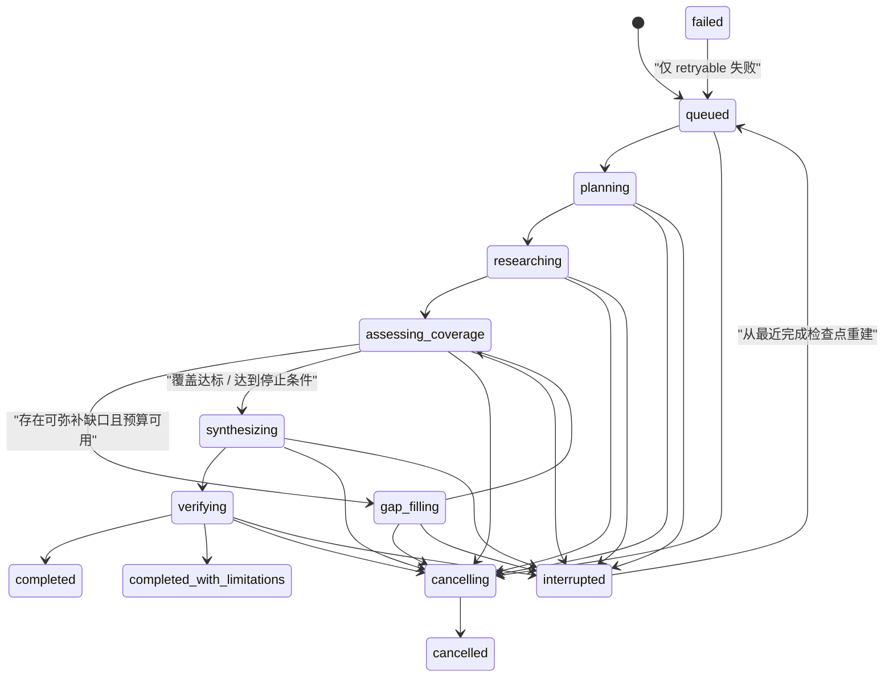
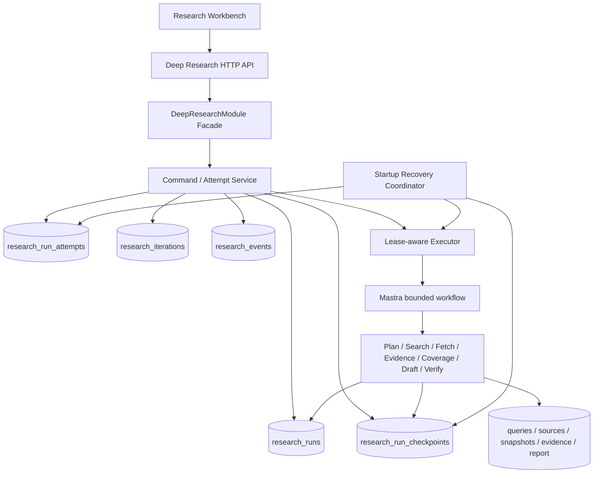
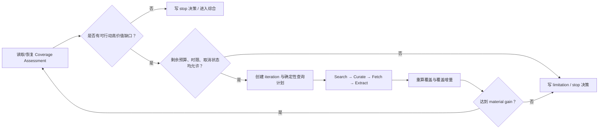

# BloomAI DeepResearch 第二阶段技术分析与实施规划

> **文档状态**：技术规划（待实施）  
> **编写日期**：2026 年 7 月 17 日  
> **范围**：覆盖分析、补充研究循环、断点恢复、取消机制。  
> **不在本阶段范围内**：重新设计第一阶段的 Research Tab 路由、重建 `ResearchRun`/来源/证据基础表、替换检索 Provider、将 DeepResearch 改造成无限制的多 Agent 网络。

---

## 1. 目标与原则

第二阶段的目标不是单纯增加一次“再搜一下”的调用，而是把第一阶段的线性、可观察研究流升级为一个**有界、可解释、可中断、可恢复且副作用可去重**的闭环：



实施必须遵守下列原则：

1. **BloomAI 数据库是业务真相源**：Mastra 负责执行步骤，不作为唯一的恢复依据。恢复后即使无法读取原 Mastra Run，也能从 BloomAI 的检查点重建下一步。
2. **Run 与执行尝试分离**：一个 `ResearchRun` 是用户意图和研究档案；一次启动或恢复是一个 execution attempt。不能让新的 workflow run ID 覆盖掉历史且不可追溯。
3. **先落库、后产生外部副作用**：查询计划、抓取意图、检查点和取消请求必须在网络/模型调用之前持久化；恢复时根据持久化状态决定重用、重试或跳过。
4. **停止是可解释的决策**：循环是否继续不能只取决于“新增证据条数”，必须同时考虑覆盖增量、关键问题、预算、可查询性和限制原因。
5. **取消是协作式且最终一致的**：用户请求取消后立刻可见为 `cancelling`；正在运行的异步操作接收到 abort 信号或在下一个安全边界停止，最终只由一个受控路径写成 `cancelled`。
6. **每一项结果可审计**：用户和测试都能回答“为何继续/为何停止、恢复从哪里开始、哪次尝试写入了该来源或证据”。

---

## 2. 当前代码基线与差距

### 2.1 已具备的基础

第一阶段及现有工作区已经建立了较完整的骨架：

- 公共契约已有 `ResearchRunStatus`、`ResearchCoverageDto`、`ResearchSearchQueryDto` 和 `resumePhase`：`src/shared/deepresearch/contracts.ts`。
- 核心持久化表已包含 `research_runs`、问题、查询、来源、快照、证据、报告、事件及恢复命令：`scripts/migrations/008-deep-research-core.sql`、`src/server/db/schema.ts`。
- 主工作流已有 `assessCoverage → dountil(gapFillIteration) → buildOutline` 的形状：`src/server/mastra/deepresearch/workflow.ts`。
- `EvidenceService.assessCoverage` 已按证据、域名、来源类型、时效性和正反证据计算基础分数：`src/server/services/deepresearch/evidence-service.ts`。
- `GapAnalyst` 已可为未覆盖的高/关键优先级问题生成后续查询：`src/server/mastra/deepresearch/agents/gap-analyst.ts`。
- 已有 Run lease、启动恢复协调器、自动恢复命令去重和服务层 `cancelRun` / `resumeRun`：`src/server/db/repositories/deepresearch/research-run.repo.ts`、`src/server/deepresearch/executor.ts`、`src/server/deepresearch/recovery.ts`、`src/server/deepresearch/deep-research.service.ts`。
- 前端已有问题、来源、证据、活动和取消/恢复动作入口：`src/renderer/pages/Chat/deepresearch/DeepResearchRunView.tsx`。

因此第二阶段应以**加固和闭环**为中心，不应另起一套 parallel workflow 或替换第一阶段的数据模型。

### 2.2 必须解决的关键缺口

| 领域 | 当前行为 | 风险 | 第二阶段目标 |
| --- | --- | --- | --- |
| 覆盖分析 | 分数与 `gaps: string[]` 混在 `ResearchQuestion.coverage` 中，缺少计算版本、输入快照、决策及增量。 | 无法比较“这一轮是否真的改善了研究”；规则变更后无法解释历史结果。 | 形成版本化 Coverage Assessment 和可持久化 Loop Decision。 |
| 补充研究 | `shouldStopGapFill` 仅依赖覆盖完成、`createdCount <= 0`、取消、轮次上限。 | 新增一条低质量证据会错误继续；没有新增证据却可能仍有未执行的高价值查询；不能明确说明为何停。 | 用“缺口优先级 + 预期价值 + 实际覆盖增量 + 硬预算”的有界策略驱动循环。 |
| 迭代副作用 | 每次循环会创建查询、来源、快照和证据，但没有可恢复的 iteration/step checkpoint。 | 崩溃发生在网络调用与落库之间时，恢复只能从 `queued → planning` 重走，可能重复问题、查询和模型调用。 | 所有昂贵步骤有稳定 idempotency key、完成标记和输入指纹；恢复从最近安全边界继续。 |
| Run/attempt 历史 | `research_runs.workflow_run_id` 只保存一个 ID。 | 恢复或重试会丢失旧 workflow run、失败诊断和 lease 归属历史。 | 引入 execution attempt，保留所有启动、恢复、失败、取消尝试。 |
| 取消 | 服务层将 Run 置为 `cancelling`，但多处步骤只检测 `cancelled`；执行器捕获异常可能把非终态运行标为 `failed`。 | 取消请求可能继续做昂贵工作，或被竞争路径误写为失败。 | 请求、传播、边界确认和终态写入四段式取消协议。 |
| 恢复 | recovery 已能检查过期 lease 并标记 `interrupted`，但 `resumeRun` 会重新排队，工作流入口从 planning 开始。 | 没有保障“复用问题、来源、快照、证据、成功章节”的规格要求。 | 把 `resumePhase` 升级为明确 checkpoint；重启后按 checkpoint 重建而非全量重跑。 |
| 前后端一致性 | UI 将 `cancelled` 显示为可恢复，但当前服务只允许 `interrupted` 或 retryable `failed` 恢复。 | 用户点击“恢复”会得到不可运行错误；语义不统一。 | 取消后为终态；恢复仅针对可恢复中断/失败。若产品需要重新开始，另设“基于此运行新建”。 |

---

## 3. 目标架构

### 3.1 双层编排

保留现有 `DeepResearchModule` facade（`src/server/deepresearch/index.ts`）作为唯一业务入口，并将第二阶段拆为三层：



- **Facade / command service**：验证命令幂等性、创建 attempt、改变业务状态、请求取消和调度 executor。
- **Executor**：只负责 lease、heartbeat、AbortController 生命周期、运行 Mastra workflow 与分类异常；不得自行猜测下一恢复步骤。
- **Workflow**：读取一个已持久化的执行计划，从安全 checkpoint 执行到下一 checkpoint；每个 step 仅做受限、可重放的工作。
- **Repository / services**：负责幂等写入和业务计算；不依赖前端状态或工作流内存。

### 3.2 Run、Attempt、Checkpoint 三个概念

| 概念 | 生命周期 | 责任 | 例子 |
| --- | --- | --- | --- |
| `ResearchRun` | 从用户创建到最终完成/取消/失败 | 用户意图、预算、当前展示状态、最终研究档案 | “研究 2026 年 AI 芯片市场” |
| `ResearchRunAttempt` | 一次 start/resume/retry 的执行周期 | workflowRunId、lease/执行器、开始结束、触发方式和错误 | “第 2 次：应用启动后自动恢复” |
| `ResearchRunCheckpoint` | 一个 attempt 中每个安全边界的不可变记录 | 已完成阶段、输入/输出指纹、重放规则、相关实体游标 | “iteration 2 的 evidence extraction 已完成” |

`research_runs.phase` 继续承担 UI 的当前阶段展示；恢复依据改为最近一个成功且与当前 input/version 兼容的 checkpoint，而不是自由文本 `resume_phase`。

---

## 4. 数据模型与迁移设计

新迁移建议命名为 `scripts/migrations/009-deep-research-resilience.sql`，并同步更新 `src/server/db/schema.ts`、DTO、Repository 和测试 fixture。迁移必须只追加表/列，不能重写或丢弃第一阶段历史数据。

### 4.1 新表：`research_run_attempts`

用途：记录一次执行尝试，解决 workflow run ID 被覆盖、恢复历史不可审计的问题。

| 字段 | 说明 |
| --- | --- |
| `id` | UUID 主键 |
| `run_id` | 所属 `ResearchRun` |
| `ordinal` | 从 1 开始的尝试序号，`UNIQUE(run_id, ordinal)` |
| `trigger` | `initial` / `manual_resume` / `auto_resume` / `retry` |
| `status` | `queued` / `running` / `cancelling` / `cancelled` / `succeeded` / `failed` / `interrupted` |
| `workflow_run_id` | 本次 Mastra run ID，可为空（调度前） |
| `executor_id`、`lease_expires_at`、`heartbeat_at` | attempt 级执行所有权；Run 上的旧字段迁移期保留兼容 |
| `start_checkpoint_key`、`end_checkpoint_key` | 本次从哪里开始、到哪里结束 |
| `error_*` | 可恢复性及诊断 |
| `started_at`、`ended_at`、`created_at` | 审计与指标 |

### 4.2 新表：`research_run_checkpoints`

用途：作为恢复真相源；每次安全边界以 append-only 方式记录。

| 字段 | 说明 |
| --- | --- |
| `id`、`run_id`、`attempt_id` | 标识与归属 |
| `sequence` | Run 内单调递增序号；`UNIQUE(run_id, sequence)` |
| `checkpoint_key` | 例如 `questions_planned`、`initial_evidence_extracted`、`iteration:2:coverage_assessed`、`sections_drafted` |
| `phase`、`status` | `started` / `completed` / `invalidated` / `skipped` |
| `resume_cursor_json` | 下一步、当前 iteration、待处理 query/source/section IDs 等 JSON-safe 游标 |
| `input_fingerprint` | 由 Run 输入、profile/depth、模型 contract、parser/coverage/workflow version 计算 |
| `output_fingerprint` | 已产出的实体 ID/内容 hash 摘要 |
| `replay_policy` | `reuse` / `retry_incomplete` / `invalidate_if_version_changed` |
| `created_at` | 记录时间 |

为 `(run_id, checkpoint_key, input_fingerprint)` 建唯一索引，确保重复恢复不会创建相同“已完成检查点”。

### 4.3 新表：`research_iterations`

用途：让覆盖分析与补充研究的决策可复盘、可在恢复时继续。

| 字段 | 说明 |
| --- | --- |
| `id`、`run_id`、`ordinal` | 唯一迭代；`UNIQUE(run_id, ordinal)` |
| `status` | `planned` / `executing` / `assessed` / `completed` / `stopped` |
| `decision` | `continue` / `stop_covered` / `stop_budget` / `stop_no_material_gain` / `stop_no_actionable_gaps` / `stop_cancelled` |
| `target_question_ids_json` | 本轮要补齐的问题 |
| `coverage_before_json`、`coverage_after_json` | 聚合评分与逐问题摘要 |
| `planned_query_count`、`executed_query_count`、`new_source_count`、`new_evidence_count` | 可观察增量 |
| `budget_before_json`、`budget_after_json` | 决策时的硬预算快照 |
| `stop_reason_json` | 面向 UI 的可解释原因 |
| `created_at`、`completed_at` | 审计 |

### 4.4 对 `research_runs` 的兼容扩展

建议保留 `resume_phase` 作为兼容展示字段，但增加：

- `current_attempt_id`：当前或最后一次 attempt；
- `cancel_requested_at`、`cancel_reason`：取消请求不可丢失；
- `workflow_version`、`coverage_policy_version`、`parser_version`、`model_contract_version`：决定 checkpoint 是否可复用；
- `last_checkpoint_sequence`：快速读取恢复入口；
- `state_version`：乐观并发控制（每次状态转换 +1）。

**迁移策略**：现存 Run 以 `attempt 1 / legacy` 回填；若没有可推断的检查点，则为其写入 `legacy:resume_from_planning`，以可预测方式从 planning 重建，而不伪造已经完成的步骤。

---

## 5. 覆盖分析 V2

### 5.1 覆盖对象与输出

覆盖分析的最小单位仍是 `ResearchQuestion`，但要把当前的 `coverage_json` 从单一展示值升级为版本化评估。每次评估输出：

```ts
interface ResearchCoverageAssessment {
  policyVersion: 'v2'
  questionId: string
  score: number                 // 0..1，仅用于排序和阈值
  verdict: 'covered' | 'limited' | 'uncovered' | 'blocked'
  dimensions: {
    evidenceSufficiency: number
    independentCorroboration: number
    authority: number
    recency: number
    requiredEvidenceTypes: number
    contradictionHandling: number
  }
  sourceCounts: {
    evidence: number
    distinctSources: number
    independentDomains: number
    primaryOrAuthoritative: number
    recent: number
  }
  support: { supporting: number; contradicting: number; contextual: number }
  gaps: CoverageGap[]
  limitation: string | null
  assessedAt: number
}

interface CoverageGap {
  code: 'NO_EVIDENCE' | 'SINGLE_DOMAIN' | 'MISSING_REQUIRED_TYPE' |
        'NO_AUTHORITATIVE_SOURCE' | 'STALE_EVIDENCE' |
        'UNRESOLVED_CONTRADICTION' | 'INSUFFICIENT_CONFIDENCE'
  severity: 'critical' | 'high' | 'medium' | 'low'
  remediation: 'search_primary' | 'search_independent' | 'search_recent' |
               'search_counterevidence' | 'disclose_limitation'
}
```

仍可将面向列表渲染的摘要投影到既有 `ResearchCoverageDto`，但循环决策必须使用完整 assessment，不能用字符串 `gaps[0]`。

### 5.2 评分和阈值

默认权重（所有权重与阈值集中在 `deepresearch/domain/coverage-policy.ts`，不得散落在步骤内）：

| 维度 | 含义 | 默认权重 |
| --- | --- | ---: |
| evidence sufficiency | 可引用证据数量、证据置信度、是否直接回答问题 | 0.25 |
| independent corroboration | 去重后的独立域名/发布主体，避免单一来源依赖 | 0.20 |
| authority | 原始、监管、同行评审、官方统计等来源优先 | 0.20 |
| required evidence types | 问题声明的必需证据类型是否全部满足 | 0.15 |
| recency | 是否符合 topic/profile 的时效要求 | 0.10 |
| contradiction handling | 发现冲突后是否有足够对立证据或在报告中声明限制 | 0.10 |

建议默认阈值：`critical >= 0.85`、`high >= 0.80`、`medium >= 0.70`、`low >= 0.60`。高和关键优先级问题必须同时满足独立来源门槛；若研究范围客观上只能有一个权威来源，必须标为 `limited` 并写入 limitation，而不能把单源结果伪装成覆盖完成。

不同 profile 通过 policy 覆盖权重/必需类型，而不是复制整个服务：

- `market`：增加监管、官方统计、公司财报、地域与日期一致性要求；
- `competitor`：增加比较日期、第一方声明标记和同维度对齐；
- `academic`：增加同行评审/预印本区分、原始论文或数据集；
- `general`：保留权威、独立性、时效性与反证据基本规则。

### 5.3 评估时机和持久化

在以下边界执行并写入 checkpoint + event：

1. 初始证据提取结束；
2. 每轮补充研究的证据提取结束；
3. 从 interruption 恢复、但决定是否需要再检索之前；
4. 报告初稿的 Claim extraction 后（将“问题覆盖”与“Claim 可引用性”关联）；
5. 最终质量门禁前。

事件建议新增：`research.coverage.assessment_completed`、`research.coverage.gap_detected`、`research.coverage.limitation_recorded`。事件 payload 仅存结构化摘要和 ID，不存抓取正文或模型原始 prompt。

---

## 6. 补充研究循环设计

### 6.1 将 `dountil` 从“循环容器”升级为“持久化状态机”

可保留 Mastra 的 `dountil` 作为单次 attempt 内的控制流，但每轮开始和结束都必须由 `research_iterations` 与 checkpoint 驱动。工作流输入增加 `resumeCursor`，由 orchestration service 从最近 checkpoint 构造：



### 6.2 一轮的确定性协议

1. **选择目标问题**：仅选择 `critical/high` 且 verdict 非 `covered` 的问题；按 `gap severity × priority × 可补救性 × 预期价值 / 预计成本` 排序。
2. **生成查询计划**：Gap analyst 为每个目标生成有类型目标的查询（例如 `search_primary`、`search_counterevidence`），并输出 `questionId`、`gapCode`、`query`、`rationale`、`expectedEvidenceType`。
3. **查询去重**：以 `normalizedQuery + questionId + gapCode + coveragePolicyVersion` 形成 query fingerprint。已成功的同指纹查询不重跑；上次失败且 retryable 的查询遵从退避/尝试上限。
4. **预算预留**：在派发前检查剩余查询、来源、抓取、时间和 token/cost 预算，并为本轮保留可执行上限。禁止先调用后发现超限。
5. **逐批执行**：查询、抓取和证据提取各自持久化开始/完成/失败状态；在每个 batch 后检查取消和 deadline。
6. **重新评估**：计算逐问题和总体覆盖变化；产生 `ResearchIteration.decision`。
7. **写清结果**：无论继续还是停止，都写事件、checkpoint、预算快照和用户可展示的理由。

### 6.3 停止条件

下面条件按优先级判定，命中后不再开始新外部调用：

1. `cancel_requested_at` 已设置：`stop_cancelled`；
2. 超过 deadline 或任一硬预算：`stop_budget`；
3. 所有 critical/high 问题覆盖达标：`stop_covered`；
4. 没有可行动缺口或所有候选查询已执行/永久失败：`stop_no_actionable_gaps`；
5. 连续两轮没有达到最小有效增益：`stop_no_material_gain`；
6. 达到 `maxIterations`：`stop_iteration_limit`。

**最小有效增益（默认）**：至少一个 critical/high 问题从 `uncovered → limited/covered`，或其 coverage score 增加 `>= 0.10`，或新增一个此前缺失的必需证据类型/独立权威域名。仅仅新增重复段落、相同域名或低置信度证据不算有效增益。

停止但存在未覆盖问题时，不应直接失败：如果仍能生成没有高重要性 unsupported claim 的报告，则进入 `completed_with_limitations`，并将每个未解决问题、预算耗尽或不可访问来源写入 Limitations；否则由质量门禁写为 `failed`。

---

## 7. 断点恢复与幂等性

### 7.1 安全恢复边界

以下边界必须同时完成实体写入和 checkpoint 写入（建议同一 SQLite transaction；文件 artifact 采用临时文件 + 原子 rename 后再写完成 checkpoint）：

| 检查点 | 可复用结果 | 恢复后下一步 |
| --- | --- | --- |
| `brief_built` | brief | 计划问题 |
| `questions_planned` | 问题树与初始 query plan | 执行尚未完成的查询 |
| `initial_search_completed` | query 状态、候选来源 | curate/fetch 未完成项 |
| `sources_curated` | selected/rejected source | fetch 未快照来源 |
| `initial_evidence_extracted` | evidence + coverage | 创建/继续 iteration |
| `iteration:n:planned` | 目标问题、查询 fingerprint、预算预留 | 继续该 iteration |
| `iteration:n:coverage_assessed` | assessment + stop/continue 决策 | 下一轮或综合 |
| `outline_built` | report sections | 起草未完成章节 |
| `sections_drafted` | draft sections | Claim extraction |
| `claims_verified` | claims/citations/repair history | 质量评估 |
| `artifacts_finalized` | artifact 与终态 | 终止 |

### 7.2 版本和失效规则

一个 checkpoint 仅在以下输入不变时复用：

- 用户输入（topic、范围、地域、偏好/排除域名、profile、depth）；
- parser version；
- coverage policy version；
- workflow version；
- 对会影响输出正确性的 model contract version。

处理规则：

- **仅 UI/展示字段变化**：全部复用；
- **coverage policy 变化**：复用问题、来源、快照、证据；从 coverage assessment 重算；
- **parser version 变化**：复用 Query/Source，失效受影响 snapshot 及之后 evidence/coverage；
- **模型 contract 变化**：不盲目复用模型生成的 brief、问题、query plan、草稿；保留历史并从最近安全的确定性输入重建；
- **用户编辑研究范围**：创建新 `ResearchRun`（推荐），而不是在原 Run 上篡改输入与历史。

### 7.3 恢复算法

1. 启动时 recovery coordinator 查找 lease 过期的 active attempt；先确认不存在仍活跃的 workflow/executor，随后将 attempt 与 Run 标为 `interrupted`，记录旧 `resume_phase` 仅供展示。
2. 读取最近 `completed` 且 fingerprint 兼容的 checkpoint；若找不到，选择 `legacy:resume_from_planning`。
3. 以 `trigger=auto_resume` 或 `manual_resume` 创建新 attempt；旧 attempt 保持 `interrupted`，不被覆盖。
4. 新 executor 获得 attempt lease 后，将 workflow 输入设置为 `{ runId, attemptId, resumeCursor }`，只执行 cursor 之后的步骤。
5. 对 `started` 未完成的操作执行“查询已有结果 → 重试或重用”的 reconciliation：
   - 查询存在 completed 记录：复用；
   - fetch snapshot 已存在且 parser/version 相同：复用；
   - evidence idempotency key 已存在：复用；
   - artifact 路径存在但 DB 未登记：校验 content hash 后补登记，否则重新生成。
6. 恢复完成/失败/取消均关闭 attempt lease，写 attempt 完成 checkpoint 和结构化 event。

### 7.4 幂等键规范

已有 Query、Snapshot、Evidence、Artifact 的 idempotency 思路应统一版本和输入：

- query：`query:v2:{runId}:{questionId}:{gapCode}:{normalizedQuery}:{policyVersion}`；
- snapshot：`snapshot:v2:{runId}:{sourceId}:{finalUrl}:{parserVersion}:{contentHash?}`；
- evidence：保留基于 question/snapshot/offset/passage hash 的策略，并在 key 中显式 `evidence:v2`；
- section / claim / citation / artifact：加入 `workflowVersion` 和关联内容 hash；
- command：`command:v1:{runId}:{type}:{clientRequestId}`；
- checkpoint：`checkpoint:v1:{runId}:{key}:{inputFingerprint}`。

不要使用 iteration ordinal 或数组 index 作为唯一业务幂等依据：恢复、插入新 gap 或重排时会使同一工作重复写入。

---

## 8. 取消机制

### 8.1 语义定义

- `POST cancel` 是**幂等命令**：若已经 `cancelling/cancelled`，返回当前 Run，不报状态转换错误；终态 completed/failed 则返回明确的不可取消领域错误。
- 收到请求后在一个事务中写 `cancel_requested_at`、`cancel_reason`、Run/Attempt `cancelling` 状态和 `research.run.cancellation_requested` event。
- `cancelling` 不是终态；页面立即停止提供新的“恢复/重试”操作，显示“正在在安全边界停止”。
- 由 executor/step 的统一 `throwIfCancellationRequested` 确认取消；只有该单一路径将状态置为 `cancelled` 并写 `research.run.cancelled` event。
- `cancelled` 是终态，不允许 `resumeRun`。如果未来产品需要“从已取消运行重新开始”，应新增 `forkResearchRun` / “基于此运行新建”，显式创建新的 Run，而非改变取消含义。

### 8.2 传播与安全边界

`DeepResearchExecutor` 为每个 attempt 创建 `AbortController`，并提供：

```ts
interface ResearchExecutionControl {
  signal: AbortSignal
  throwIfCancellationRequested(): void
  checkpoint(): Promise<void> // renew lease + check deadline + check cancellation
}
```

所有 Search、Fetch、模型调用适配器应接收 `signal`；若底层 Provider 不支持 abort，则：

1. 不再派发新的请求；
2. 忽略已返回但在取消确认后到达的结果，或仅以 orphan/diagnostic 记录保存；
3. 不允许取消后的结果触发报告、质量或终态 completed；
4. 在每个 batch、每个 Mastra step、每轮 loop 和 artifact 写入前后调用 `checkpoint()`。

现有代码中“只检查 `status === 'cancelled'`”的逻辑必须改为共享谓词 `isCancellationRequested(run)`，它同时识别 `cancelling`、`cancelled` 和 request timestamp。`executor.ts` 的 catch 分支也必须优先识别 cancellation/domain abort，不能把取消导致的中断写成 `failed`。

### 8.3 竞争条件处理

| 竞争场景 | 规定行为 |
| --- | --- |
| cancel 与 workflow 正在 finalize 同时发生 | finale 前重新读取 `state_version`；若已取消请求，放弃 completed 转换，写 cancelled。 |
| cancel 与自动恢复同时发生 | command 表/幂等键只允许一个 dispatch；取消优先，恢复入口发现请求后不获取执行 lease。 |
| cancel 与 retryable failure 同时发生 | cancel 胜出；attempt 记录底层错误为诊断，Run 终态为 cancelled。 |
| cancel 重复提交 | 返回同一 cancelling/cancelled 状态；只保留第一条取消理由。 |
| lease 失效后旧 executor 继续写 | 所有状态/检查点写入带 `attempt_id + executor_id + state_version` 条件，失败则中止旧 executor。 |

---

## 9. API、事件、UI 与可观测性

### 9.1 契约/API 调整

保持既有 route 前缀和 facade，不泄漏数据库 Row。

- `GET /runs/:runId`：在 `ResearchRunDetailDto` 增加 `execution`（当前 attempt 摘要）、`latestCheckpoint`、`iterations`、`cancellation`、完整 coverage assessment 摘要；旧字段继续保留。
- `POST /runs/:runId/cancel`：请求体 `{ clientRequestId, reason? }`，返回 `202` + 当前 Run；同 key 重放安全。
- `POST /runs/:runId/resume`：请求体 `{ clientRequestId }`，仅接受 `interrupted` 和 retryable `failed`；返回新 attempt 摘要与 queued Run。
- 新增可选 `GET /runs/:runId/attempts`：供 Activity/诊断查看；首版可只进入 Detail，避免过早扩张 API。
- 事件流（SSE 或轮询）必须将 `sequence` 作为游标，客户端以 event id 去重，刷新 Detail 作为最终纠偏。

### 9.2 建议新增事件

```text
research.attempt.created
research.attempt.started
research.checkpoint.completed
research.coverage.assessment_completed
research.coverage.gap_detected
research.iteration.planned
research.iteration.completed
research.iteration.stopped
research.run.cancellation_requested
research.run.cancelled
research.run.interrupted
research.run.resumed
research.recovery.reconciled
```

事件 payload 固定为 JSON-safe 的 ID、计数、策略版本、stop reason、预算摘要；不要记录网页正文、附件内容、API secret、原始模型 prompt。

### 9.3 UI 行为

`DeepResearchRunView`、`ResearchProgress`、`ResearchQuestionTree` 和 store 的改造目标：

- **概览**：显示当前 phase、attempt 序号、恢复来源 checkpoint、取消状态、剩余预算和最终 stop reason；
- **问题**：每题显示 covered/limited/uncovered/blocked、各维度摘要、缺口及建议补救类型；
- **活动**：显示每轮“为什么继续/为什么停止”、新增证据与分数增量；
- **中断**：显示“应用/执行器在何阶段中断，可从哪个检查点恢复”，提供“恢复研究”；
- **取消中**：取消按钮禁用并显示 cancelling；取消完成后不显示 resume，提供未来可选的“基于此运行新建”；
- **前后端动作一致性**：移除现有 cancelled 状态的 resume action，或在服务端明确实现新的 fork/restart API 后再展示该动作。

### 9.4 指标与告警

在已有 telemetry 基础上增加：

- coverage score / verdict 按 profile、priority、iteration 的分布；
- 每轮查询、来源、证据和 coverage delta；
- `stop_reason`、budget exhaustion、no-material-gain 比例；
- cancellation requested → cancelled 的耗时、取消后仍发出外部调用数（目标 0）；
- interruption → resume 成功率、checkpoint reuse rate、重复副作用冲突次数；
- lease 抢占失败、过期 lease、旧 executor 写入被拒绝次数；
- attempt 数与端到端耗时。

---

## 10. 推荐实施顺序

### 10.1 里程碑 2A：契约、迁移和状态统一

**目标**：先让状态能表达真实语义，避免在旧模型上堆逻辑。

1. 在 contracts 中新增 attempt/checkpoint/iteration/coverage V2 DTO；保持旧 DTO 的向后兼容投影。
2. 新建迁移 `009-deep-research-resilience.sql`，实现表、列、索引和 legacy 回填。
3. 编写 `research-attempt.repo.ts`、`research-checkpoint.repo.ts`、`research-iteration.repo.ts`；为 Run transition 增加 `state_version` 条件更新。
4. 抽取 `isCancellationRequested`、`assertAttemptLeaseOwned`、`transitionAttemptAndRun` 等领域函数。
5. 收敛状态机：明确 `cancelling → cancelled`、`interrupted/failed(retryable) → queued`，并删除 UI 与服务层的 cancelled-resume 冲突。

**完成标准**：不执行真实网络调用也能用 repository tests 验证状态迁移、并发写入拒绝、legacy 兼容及 command 幂等。

### 10.2 里程碑 2B：Coverage Policy V2

**目标**：让“是否有缺口”成为可解释、可测试的领域决策。

1. 新建 `src/server/deepresearch/domain/coverage-policy.ts` 与 profile policy 配置。
2. 让 `EvidenceService` 产生 V2 assessment，并在保持 `ResearchCoverageDto` 的同时持久化评估快照。
3. 让问题状态由 verdict 投影而来，处理单一权威来源和不可补救缺口。
4. 增加 assessment 事件、checkpoint 和 UI 摘要。

**完成标准**：冻结 fixture 下，可精确断言域名独立性、类型缺失、时效、反证据、不同 priority/profile 的 verdict 与 gap code。

### 10.3 里程碑 2C：持久化补充研究循环

**目标**：每轮都是可解释、可停止、可恢复的最小事务。

1. 将 `gap-fill-iteration.ts` 拆成 `plan-iteration`、`execute-iteration-retrieval`、`assess-iteration` 三类 step/service；不要在一个长 step 中混合计划、search、fetch、extract 和最终写 usage。
2. 用 `research_iterations` 记录计划、预算预留、执行结果、前后覆盖及 stop decision。
3. 用 query/source/evidence fingerprint 去重；replace index-based idempotency key。
4. 实现 material gain 与所有 stop condition，产出 limitations。

**完成标准**：可在 fixture 测试中证明：覆盖提前停止、预算停止、两轮无有效增益停止、反证据检索、重复查询不重复派发。

### 10.4 里程碑 2D：Checkpoint 恢复与 attempt 执行器

**目标**：桌面应用关闭、进程崩溃或 lease 失效后，不重做已完成昂贵步骤。

1. executor 以 attempt 为 lease 主体，创建并传播 `AbortSignal`、heartbeat 与 ownership token。
2. workflow 入口读取 `resumeCursor`，将 `loadRun` 从“永远 queued → planning”改为“创建/读取 attempt → 从 checkpoint 后执行”。
3. recovery coordinator 同时检查 attempt lease、workflow 外部状态和 checkpoint 完整性；记录 reconciliation。
4. 实现版本 fingerprint、失效规则和 artifact orphan reconciliation。

**完成标准**：在每一个安全边界注入崩溃后重新启动，最终实体计数、报告内容、事件序列不重复；已成功 Query/Fetch/Evidence/Section 不重新调用 fake provider。

### 10.5 里程碑 2E：取消闭环与界面交付

**目标**：取消快速、无误终态且与 UI/API 一致。

1. cancel command、cancellation request、executor abort、每步 checkpoint 检测和终态确认一次打通。
2. Search/Fetch/LLM adapter 增加 signal 或等效停止检查；实现取消竞争仲裁。
3. 更新 HTTP、renderer store 和 `DeepResearchRunView` 的 action policy、文案和活动展示。
4. 增加 telemetry、操作文档和故障排查说明。

**完成标准**：在 planning/search/fetch/extract/draft/finalize 六个注入点取消，均不产生 completed/failed 误终态；重复取消安全；取消后 UI 不显示不可用 resume。

---

## 11. 测试与验收矩阵

### 11.1 单元测试

- `coverage-policy.test.ts`：权重、阈值、profile 覆盖、single-domain exception、gap code、material gain；
- `state-machine.test.ts`：合法/非法转换、cancel 优先级；
- `checkpoint.repo.test.ts`：唯一性、顺序、fingerprint、事务原子性；
- `iteration-decision.test.ts`：所有 stop reason 与预算预留；
- `executor.test.ts`：abort、heartbeat、lease ownership、异常分类；
- `recovery.test.ts`：每个 checkpoint 的 cursor、版本失效、auto/manual resume 去重。

### 11.2 集成测试（Fake Search / Fetch / Model）

| 场景 | 断言 |
| --- | --- |
| 初始覆盖达标 | 不创建 iteration，直接进入综合。 |
| 高优先级缺少独立权威来源 | 创建有 `search_primary` / `search_independent` 意图的 iteration。 |
| 新证据仅来自同一域名 | score 无实质增益，最终按 no-material-gain 停止。 |
| 预算耗尽 | 不发出超额调用，生成 limitation 和 `completed_with_limitations`（若质量条件允许）。 |
| 崩溃在 search 后、query 更新前 | resume reconciliation 不重复创建/派发已完成查询。 |
| 崩溃在 snapshot 写入后、checkpoint 前 | content hash 校验后复用 snapshot。 |
| 崩溃在报告文件生成后、DB 登记前 | 发现并补登记或安全重建，不产生重复 artifact。 |
| 并发 auto-resume | 仅一个 attempt 获得 dispatch/lease。 |
| 取消中 fetch 返回 | 不写后续 evidence/报告，不转 completed。 |
| cancel 与 finalization 竞争 | 最终只能 cancelled，且 event 序列可解释。 |

### 11.3 UI / API 测试

- Research detail 刷新后能重建当前 attempt、coverage 与 iteration 历史；
- SSE 重放或轮询重复不会重复显示 event；
- `cancelling`、`cancelled`、`interrupted`、retryable failed 的按钮与后端能力一致；
- “恢复研究”显示 checkpoint/阶段，而不是笼统地从头开始；
- 问题面板能展示 limitations 与 unresolved contradiction。

### 11.4 回归与非功能验收

- 保留四类 profile fixture：general、market、competitor、academic；
- CI 使用冻结网页、确定性模型和 fake clock；live web 仅作为独立的手工/夜间验证；
- 迁移能在存在第一阶段数据的 SQLite 文件上无损运行；
- 既有 `start/get/list/cancel/resume` 客户端在不使用新字段时保持可用；
- 无 logs/events 泄露抓取正文、附件路径或 secret；
- 深度为 standard/deep/exhaustive 时，任意测试都不会超过相应硬预算。

---

## 12. 风险、取舍与明确决策

| 决策 | 选择 | 原因 |
| --- | --- | --- |
| 恢复依据 | BloomAI checkpoint 为主，Mastra state 为辅助 | 外部 workflow state 可能缺失、版本不兼容或无法精确表达业务副作用。 |
| 循环形态 | 有界持久化 iteration，而非递归 Agent 自由探索 | 保持成本、停止性、测试确定性和审计能力。 |
| cancelled 后 resume | 不支持 | “取消”应是可信终态；如需复用研究资产，用新 Run/fork 更清晰。 |
| 评分实现 | 规则/权重确定性计算，模型只提出候选 gap/query | 将质量门禁留在可测试、可版本化的领域层。 |
| Checkpoint 粒度 | 步骤和 iteration 边界，而非每个 token/模型流式 chunk | 覆盖昂贵副作用且复杂度可控。 |
| 迁移策略 | 追加新表和兼容字段，legacy 运行保守从 planning 重启 | 不伪造旧运行的完成状态，避免错误复用。 |

主要风险是把第二阶段一次性改造成全量 durable workflow，导致改动面过大。应严格按 2A → 2E 交付：先统一领域状态和数据结构，再接入 coverage/loop，随后才启用恢复与取消的生产语义。每个里程碑均要有独立 migration、fixture 和回归测试，不应以“真实网页跑通一次”作为验收依据。

---

## 13. 预期交付物清单

1. 本规划中定义的 `009-deep-research-resilience.sql` 及 schema/repository 同步改造；
2. Coverage Policy V2、assessment/iteration/attempt/checkpoint 的共享契约；
3. 从检查点执行的工作流与 attempt-aware executor；
4. 有界补充研究循环、stop reason 和 limitations；
5. 协作式取消和可靠启动恢复；
6. HTTP、事件、Research Workbench 的状态与动作一致性改造；
7. 单元、集成、故障注入、UI/API 与 migration 回归测试；
8. 面向维护者的恢复/取消故障排查文档与 telemetry dashboard 字段说明。

完成上述交付后，DeepResearch 将满足第二阶段所需的关键性质：**能解释覆盖缺口、能在预算内补充研究、能从中断处继续、也能可靠停止。**
