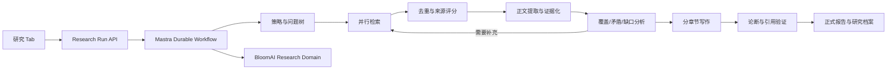

**分析结论**

截至 **2026 年 7 月 16 日**，GPT Researcher 已经不是简单的“搜索工具 + 长提示词 + 写作模型”，而是一套受控的研究流水线。其核心思想是：先规划研究问题，再让执行单元并行检索多个方向，压缩与筛选上下文，必要时递归补充研究，最后生成带引用的正式报告。官方介绍强调 Planner、Execution Agents、并行研究和 20 个以上来源；早期构建文章则明确采用 breadth-first research，而不是让单个 Agent 无限制浏览。

当前源码又进一步拆成了 `ResearchConductor`、`DeepResearchSkill`、`SourceCurator`、`ContextManager`、`ReportGenerator` 等职责，并加入查询并发、递归研究、来源跟踪、上下文压缩、进度事件和报告生成。

**BloomAI 当前为什么浅**

1. **“研究”Tab 实际没有进入深度研究工作流。** 前端发送 `x-bloom-agent: research`，服务端又规定 specialist Agent 优先于 `mode === 'deep'`，所以研究 Tab 进入的是单个 ReAct Agent，而不是 `deep-research` workflow。参见 [ChatPanelMastra.tsx (line 210)](D:/codeproject/JS/bloomai/src/renderer/pages/Chat/ChatPanelMastra.tsx:210) 和 [chat.ts (line 62)](D:/codeproject/JS/bloomai/src/server/http/routes/chat.ts:62)。
2. **检索预算过低。** 当前只拆解 2-3 个子问题，每题搜索 4 条，全局最多保留 8 条，仅抓取前三个网页，每篇正文截断到 800 字符。参见 [deep-research.ts (line 21)](D:/codeproject/JS/bloomai/src/server/mastra/workflows/deep-research.ts:21)。
3. **证据结构被破坏。** 所有搜索结果和摘录最终拼成一个 `sources: string`，Writer 无法知道“哪个论断由哪个具体段落支持”，因此只能生成 URL 级引用，而不是证据级引用。
4. **没有研究闭环。** 当前流程是 `规划 → 搜索 → 抓取 → 写作`，缺少覆盖度检查、矛盾发现、证据缺口分析、二次检索、引用校验和质量修复。
5. **运行不可持久恢复。** Mastra 主存储仍是 `new InMemoryStore()`；桌面应用关闭、崩溃或升级后，长时间研究无法可靠续跑。参见 [index.ts (line 34)](D:/codeproject/JS/bloomai/src/server/mastra/index.ts:34)。
6. **研究结果只是聊天消息。** 当前 UI 只有四个粗粒度步骤，缺少研究计划、实时来源、证据覆盖、预算、冲突提示、报告版本和可导出研究档案。参见 [WorkflowSteps.tsx (line 20)](D:/codeproject/JS/bloomai/src/renderer/pages/Chat/parts/WorkflowSteps.tsx:20)。

**三种升级路线**

| 路线                 | 做法                                                         | 评价                                         |
| -------------------- | ------------------------------------------------------------ | -------------------------------------------- |
| A. 强化现有 Agent    | 扩大工具调用次数、改提示词、增加报告模板                     | 上线快，但仍然不可验证、不可恢复             |
| B. 持久化研究工作流  | Mastra Workflow 编排，专业 Agent 执行有限认知任务，BloomAI 保存研究实体 | **推荐，控制性、质量和扩展性最好**           |
| C. 动态多 Agent 网络 | Supervisor 自由创建和调度研究 Agent                          | 灵活，但成本、死循环、可预测性和测试难度最高 |

推荐 **B**。Mastra 已提供 typed workflow、`parallel`、`foreach`、`branch`、`dountil`、暂停恢复等控制流；持久化存储可支持工作流状态恢复，后台任务适合长时间研究。BloomAI 当前安装的 `@mastra/core` 实际版本为 `1.49.0`，这些 API 已存在。

````

````

**完整研究协议**

1. **研究受理**：解析主题、目标读者、地区、时间范围、期望深度、语言和交付格式。
2. **研究类型识别**：选择通用深研、市场研究、竞品研究或学术综述；允许用户手动覆盖。
3. **生成 Research Brief**：明确研究目标、关键定义、范围边界、排除项、时效要求和预算。
4. **构建问题树**：不是固定 2-3 个问题，而是形成主题、一级问题、二级问题、假设和所需证据类型。
5. **生成检索策略**：为每个问题生成多种查询，包括同义词、反向查询、时间限定、站点限定和领域数据库查询。
6. **并行检索**：广度优先执行，记录查询与结果之间的完整关系，而不是立即把结果拼接成文本。
7. **来源归一化与评分**：URL 去重、canonical 处理，并按权威性、相关度、时效性、独立性、原始性和可访问性评分。
8. **正文抓取与结构化提取**：保留标题、作者、发布日期、机构、章节、段落位置、原文摘录和抓取时间。
9. **建立 Evidence Ledger**：每条证据必须关联来源、原文段落、支持或反驳的研究问题、置信度和适用范围。
10. **覆盖与矛盾分析**：计算每个问题的证据覆盖率，发现来源冲突、孤立结论、过时数据和单一来源依赖。
11. **有预算的反思循环**：通过 Mastra `dountil` 执行“缺口分析 → 生成补充查询 → 再检索”，受最大轮次、来源数、Token、时间和成本约束。
12. **先大纲后写作**：先冻结正式报告结构，再让 Section Writer 基于该章节允许使用的 Evidence IDs 独立起草。
13. **论断级引用验证**：将草稿拆为 Claims，检查每个事实性论断是否有证据、引用是否蕴含该论断、是否遗漏限定条件。
14. **质量修复**：Citation Verifier 不通过时，只重写有问题的句子或章节，而不是重新生成整篇报告。
15. **交付研究档案**：保存最终报告、参考文献、证据附录、研究方法、限制说明、冲突来源和完整运行轨迹。

**研究类型模板**

- **市场研究**：市场定义、规模与增长、价值链、细分市场、需求驱动、监管、风险、机会；优先统计机构、监管文件、公司财报和行业协会。
- **竞品研究**：产品能力、定价、客户、定位、渠道、技术、增长信号和优劣势；同一比较维度必须使用一致时间窗。
- **学术研究**：研究问题、检索方法、理论脉络、代表论文、方法比较、共识、争议、研究空白；需要 DOI、作者、年份和出版物元数据。
- **通用深研**：自动建立问题树和报告大纲，但仍执行相同的证据、覆盖和引用门禁。

**核心数据模型**

不要继续保存一个巨大的 `sources` 字符串，应新增 BloomAI 自有实体：

`ResearchRun`、`ResearchBrief`、`ResearchQuestion`、`SearchQuery`、`Source`、`SourceSnapshot`、`Evidence`、`Claim`、`Citation`、`ReportSection`、`QualityAssessment`、`ResearchArtifact`。

其中最关键的关系是：

```
ResearchQuestion -> Evidence -> SourceSnapshot
ReportSection -> Claim -> Citation -> Evidence
```

Mastra 负责执行状态；BloomAI 数据库负责产品领域事实。这样将来即使更换 Mastra、搜索供应商、Crawler、Embedding 模型或 LLM，也不会丢失研究资产。

**研究 Tab 应如何升级**

研究 Tab 不应再直接进入普通聊天 Agent，而应创建 `ResearchRun`。首屏提供研究类型、深度、地区、时间范围、来源偏好和高级预算；运行过程中显示问题树、已检索来源、正在补足的缺口、来源质量与估算成本；完成后显示独立报告视图、引用侧栏、证据原文、方法与限制，并支持 Markdown、PDF、DOCX 导出。

建议对外只暴露稳定接口：

```
startResearch(input)
resumeResearch(runId)
cancelResearch(runId)
getResearchRun(runId)
streamResearchEvents(runId)
getResearchReport(runId)
```

**质量门禁**

最终报告至少评估：问题覆盖率、事实论断引用率、引用蕴含率、来源权威性、来源多样性、时效性、冲突披露率、客观性和报告结构完整性。Mastra 的 observability、evals 和 datasets 可以用于保存运行轨迹、构建固定研究题集并进行回归评估。

**实施顺序**

第一阶段先修复研究 Tab 路由，建立 `ResearchRun`、来源和证据表，完成非递归的结构化工作流。

第二阶段加入覆盖分析、补充研究循环、断点恢复和取消机制。

第三阶段加入四类研究模板、论断级引用验证、质量评分和报告导出。

第四阶段再考虑动态 Agent Network、付费数据源、学术数据库和本地知识库检索。

我的建议是采用 **路线 B**，并让首版显式提供“通用、市场、竞品、学术”四类研究模板，共用一套工作流内核。当前尚未修改代码；确认这个设计方向后，下一步应先生成正式设计规格到 `docs/superpowers/specs/2026-07-16-bloomai-deep-research-design.md`，完成自审后再拆解实施计划。