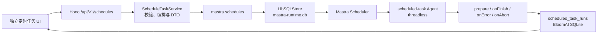

# BloomAI 独立定时任务（Task Sessions）设计文档

- **状态**：提案，待实施
- **日期**：2026-08-02
- **范围**：独立定时任务会话（不接入聊天会话）
- **关联框架**：Mastra Schedules（beta）

## 1. 背景与目标

BloomAI 当前已经通过 Mastra 承载聊天 Agent 和深度研究工作流，但没有持久化、可管理的定时执行能力。用户需要创建周期性任务，例如每日晨报、工作日摘要、每周计划或周期性主题检查，并能够在应用内查看每次执行结果。

本设计引入“**任务会话（Task Session）**”：每个定时任务都是一个独立、无状态、可追溯的执行单元。它拥有自己的调度配置和运行历史，但不属于聊天，不创建或复用聊天会话，也不会向聊天消息表写入任何记录。

### 1.1 目标

1. 用户可创建、编辑、暂停、恢复、删除和手动执行定时任务。
2. 调度定义在服务重启后仍可保留，并能展示下一次和最近一次执行时间。
3. 每次执行形成独立任务运行记录，保存输出、状态、错误、运行标识和用量信息。
4. 任务管理界面完全独立于 Chat 页面、Chat session 和 Chat message。
5. 复用 Mastra 的 cron 调度、持久化、并发 claim 和 lifecycle hooks，不重复实现调度器。
6. 第一阶段默认执行低风险、无状态的文本任务，不自动执行高风险工具操作。

### 1.2 非目标

第一阶段不实现：

- 向现有聊天会话注入消息或读取聊天 thread 上下文。
- 将任务显示在 Chat 会话列表中，或复用 `sessions` / `messages` 表。
- 应用关闭后由操作系统保证准点执行。
- 定时运行 Deep Research workflow、Skill runtime、代码执行或外部写操作。
- 多用户、远程身份认证、团队共享任务或跨设备同步。
- 固定某个具体模型执行任务；任务跟随当前可用默认模型。

## 2. 现状与约束

### 2.1 当前架构

- Chat Mastra 实例位于 `src/server/mastra/index.ts`，当前使用 `InMemoryStore`。
- Hono 应用由 `src/server/http/app.ts` 汇总路由，服务进程由 `src/server/index.ts` 启动。
- Chat 的 UI 数据来自 BloomAI 自有的 SQLite/Drizzle `sessions` 与 `messages`，而不是 Mastra Storage。
- 深度研究已有独立的 Mastra `LibSQLStore` 与 `deep-research-runtime.db`，其生命周期不应与定时任务混用。

### 2.2 Mastra 约束

Mastra Schedules：

- 从 `@mastra/core@1.50.0` 引入，仍处于 beta。
- 需要支持 schedules domain 的持久化 storage adapter。
- 支持 cron、timezone、创建/更新/删除、暂停/恢复、手动执行和 trigger history。
- 可通过 `prepare`、`onFinish`、`onError`、`onAbort` hooks 接收任务执行生命周期事件。
- threadless schedule 在每次触发时独立执行 Agent；这是本设计使用的模式。

当前项目实际解析的 `@mastra/core` 为 1.49.x，`@mastra/libsql` 为 1.15.x，无法满足 schedules 所需的 storage domain。最低升级组合采用精确版本：

```json
{
  "@mastra/core": "1.51.0",
  "@mastra/libsql": "1.16.0"
}
```

> Schedules 是 beta API。所有 Mastra schedules 调用必须封装在单独的应用 service 中，避免未来框架 API 调整扩散到路由、UI 和数据库层。

## 3. 领域模型

### 3.1 术语

| 术语 | 定义 |
|---|---|
| Task Session | 一个用户可管理的独立定时任务；其主标识为 Mastra schedule ID。 |
| Schedule | Mastra 持久化的调度定义，负责 cron、状态、下次触发时间和框架级 trigger。 |
| Task Run | 一次用户可见的任务执行结果，保存应用需要展示的文本输出和错误。 |
| Trigger | Mastra 调度器对一次 cron 或手动执行的内部审计记录。 |
| Scheduled Task Agent | 专为无状态定时任务配置的 Agent，和 Chat Agent 分离。 |

### 3.2 单一真相来源

| 数据 | 真相来源 | 说明 |
|---|---|---|
| 名称、Prompt、cron、timezone、状态、下一次执行时间 | Mastra Schedule | 通过 `mastra.schedules` 读写。 |
| 任务运行输出、错误和 UI 投递状态 | BloomAI `scheduled_task_runs` | Mastra trigger 不保证保存完整用户输出，因此应用单独保存。 |
| 任务执行 Agent | Mastra 注册表 | 第一阶段仅允许受控的 `scheduled-task`。 |

不建立与 Mastra Schedule 内容重复的 `scheduled_tasks` 应用表。页面所称的“任务会话”是原生 Schedule 与应用 Task Run 历史的聚合视图；这样不会产生两份 cron 或 paused 状态。

### 3.3 独立性不变量

以下规则必须通过类型、服务边界和测试保证：

1. 定时任务表不含 `session_id`、`message_id` 或 Chat thread 关联字段。
2. `ScheduleTaskService` 不依赖 `ChatService`、`messageRepo`、`sessionRepo` 或 Chat HTTP routes。
3. 任务路由不接受 `threadId`、`resourceId`、任意 `agentId`、任意 Mastra metadata 或任意 provider options。
4. `scheduled-task` Agent 不启用聊天计划模式和聊天会话 memory。

## 4. 总体架构



### 4.1 Mastra runtime storage

新增任务调度专用文件：

```text
<DATA_DIR>/mastra-runtime.db
```

该文件由 `LibSQLStore` 管理，保存 Mastra 自身的表和 schedule/trigger 数据。它不得与：

- 主应用 Drizzle 数据库；
- `deep-research-runtime.db`；
- Chat session/message 数据库职责混合。

这样可以隔离框架表迁移、便于升级或损坏恢复，也避免深度研究运行状态与短周期任务争抢同一 runtime 数据库。

### 4.2 Scheduled Task Agent

新增受控 Agent ID：`scheduled-task`。

职责：

- 对 schedule prompt 执行一次无状态文本生成；
- 输出面向任务结果的完整文本，而不是多轮对话回复；
- 仅使用已明确授权的只读能力；
- 使用 BloomAI 当前可用的默认模型解析逻辑；
- 不读取 Chat memory，不接收 Chat transport header，不发起 Chat persistence。

第一期不允许客户端选择任意已注册 Agent。若未来要支持 Writer、Coder 或技能任务，应为每类任务增加单独的执行策略和授权评估，而不是放开 `agentId` 输入。

### 4.3 Schedule 创建配置

创建时由服务端构造原生 Schedule：

```ts
await mastra.schedules.create({
  agentId: 'scheduled-task',
  name: input.name,
  cron: input.cron,
  timezone: input.timezone,
  prompt: input.prompt,
  metadata: {
    surface: 'bloomai-scheduled-task',
    schemaVersion: 1,
  },
})
```

必须保持 threadless：

- 不设置 `threadId`；
- 不设置 `resourceId`；
- 不设置 Chat 的 `ifActive` / `ifIdle` 策略；
- 不依赖已存在的 Mastra thread。

## 5. 数据设计

### 5.1 `scheduled_task_runs`

新增 Drizzle 表：

| 列 | 类型 | 约束/含义 |
|---|---|---|
| `id` | text | 主键，UUID。 |
| `schedule_id` | text | Mastra Schedule ID，必填。 |
| `trigger_fired_at` | integer | 触发时刻（epoch ms），必填。 |
| `mastra_run_id` | text | Mastra run ID，可为空。 |
| `trigger_kind` | text | `cron` 或 `manual`。 |
| `status` | text | `succeeded`、`failed`、`skipped`、`aborted`、`discarded`。 |
| `output_text` | text | 成功任务输出，可为空。 |
| `error_message` | text | 已脱敏的错误信息，可为空。 |
| `usage_json` | text | 模型 usage 的 JSON 快照，可为空。 |
| `started_at` | integer | 本次任务开始时间。 |
| `finished_at` | integer | 任务结束时间，可为空。 |
| `created_at` | integer | 记录创建时间。 |

索引和约束：

```text
UNIQUE(schedule_id, trigger_fired_at)
INDEX(schedule_id, trigger_fired_at DESC)
INDEX(status, created_at DESC)
```

唯一约束用于保证 lifecycle hook 重试、服务重启或重复回调时不会写入重复 Task Run。写入使用 upsert 或“先插入、冲突后读取”策略。

### 5.2 状态映射

| Mastra lifecycle 结果 | 应用 Task Run 状态 | 说明 |
|---|---|---|
| `onFinish` + `succeeded` | `succeeded` | 保存 `result.text`、usage、runId。 |
| `onFinish` + `skipped` | `skipped` | 保存跳过原因；可能来自 `prepare` 返回 `null`。 |
| `onFinish` + `discarded` | `discarded` | 保留框架语义，虽然 V1 threadless 通常不会出现。 |
| `onError` | `failed` | 保存脱敏错误、runId（如可获得）。 |
| `onAbort` | `aborted` | 保存中止状态、runId。 |

### 5.3 删除语义

删除任务时：

1. 调用 `mastra.schedules.delete(scheduleId)` 删除原生 schedule 与其框架 trigger history；
2. 删除或级联删除 `scheduled_task_runs`；
3. API 对重复删除返回明确的 `NOT_FOUND`；
4. 不影响任何 Chat session、Chat message、Deep Research run 或 Skill run。

第一期采用硬删除。若未来需要审计与恢复，可扩展为应用层 archive，但 archive 不能和 Mastra `paused` 混为一谈。

## 6. 生命周期与执行语义

### 6.1 创建、运行、暂停与恢复

- 创建成功后，Mastra 会管理下一次 cron fire。
- `pause` 阻止未来定时触发，但保留历史和配置。
- `resume` 根据 cron 重新计算下一次触发。
- `run(id)` 用于“立即执行一次”，执行结果必须经过相同 hooks 并写入相同 Task Run 表。
- 手动执行不改变既有 cron 配置。

### 6.2 `prepare`

`prepare` 在每次实际执行前完成应用层预检：

1. 确认 schedule metadata 表明它属于 `bloomai-scheduled-task`；
2. 确认目标 Agent `scheduled-task` 已注册；
3. 确认当前至少存在一个启用的默认模型；
4. 如任务已被删除、配置版本不支持或模型不可用，则返回 `null` 跳过本次执行；
5. 跳过原因应被写入 Task Run 或可在运行历史中诊断。

不得在 `prepare` 中进行长时间网络工作、写入外部系统或修改 cron 配置。

### 6.3 成功、失败与中止

- `onFinish`：将结果进行幂等写入。`result.text` 为空也要存储成功状态和可解释的空输出标识。
- `onError`：经 `sanitizeErrorMessage` 处理后写入错误；不得存储 API key、完整堆栈、原始 provider 响应或用户本地路径。
- `onAbort`：标记中止，不自动重试。
- Hook 自身异常只能记录服务端日志；hook 异常不应阻断 Mastra scheduler 的后续任务。

### 6.4 重启与离线

Schedule 定义和运行历史在服务重启后保留，但调度器只能在 BloomAI Server 进程运行时触发。

产品文案必须明确：

> “定时任务在 BloomAI 运行期间执行。”

不承诺应用退出后仍准点执行。若需要后台保证，未来必须引入托盘常驻、开机启动或系统级计划任务；这不是 Mastra Schedule 的内建能力。

### 6.5 过期触发与并发

- 不自行实现多实例锁；使用 Mastra storage 的 due-schedule claim/CAS 能力。
- 对应用关闭期间错过的 cron fire，不在 V1 对用户承诺“补跑全部”。实现时须针对 framework 当前版本编写重启集成测试，记录实际行为。
- 单个 schedule 的相邻触发若在上一轮未结束时发生，V1 以 Mastra 的 scheduler 行为为准，并在运行历史展示结果；不在应用层额外重复启动。

## 7. HTTP API 合约

所有 API 位于 `/api/v1/schedules`，和 Chat routes 分离。

### 7.1 列表

```text
GET /api/v1/schedules
```

返回 Task Session 聚合列表：原生 schedule 字段加上最近一次应用 Task Run 摘要。

```json
{
  "items": [
    {
      "id": "agent_ai-morning-brief",
      "name": "AI 行业晨报",
      "agentId": "scheduled-task",
      "cron": "0 9 * * 1-5",
      "timezone": "Asia/Shanghai",
      "status": "active",
      "nextFireAt": 1786054800000,
      "lastFireAt": 1785968400000,
      "lastRun": {
        "status": "succeeded",
        "finishedAt": 1785968404321,
        "outputPreview": "今日 AI 行业重点..."
      }
    }
  ]
}
```

### 7.2 创建

```text
POST /api/v1/schedules
```

请求：

```json
{
  "name": "AI 行业晨报",
  "cron": "0 9 * * 1-5",
  "timezone": "Asia/Shanghai",
  "prompt": "生成今日 AI 行业晨报。"
}
```

服务端负责：

- 校验字符串长度、cron、IANA timezone；
- 固定 `agentId = scheduled-task`；
- 构造受控 metadata；
- 返回创建后的 Task Session DTO。

### 7.3 更新

```text
PATCH /api/v1/schedules/:id
```

可修改：`name`、`cron`、`timezone`、`prompt`、`status`。

不能修改：`id`、`agentId`、应用 metadata namespace、任务运行历史。

### 7.4 命令与历史

```text
POST /api/v1/schedules/:id/pause
POST /api/v1/schedules/:id/resume
POST /api/v1/schedules/:id/run
GET  /api/v1/schedules/:id/runs?limit=50&cursor=<optional>
DELETE /api/v1/schedules/:id
```

`/runs` 返回应用层 Task Run；后续可选择补充框架 trigger history，但 UI 不依赖私有 Mastra storage 表。

### 7.5 错误码

| 代码 | HTTP | 含义 |
|---|---:|---|
| `SCHEDULE_NOT_FOUND` | 404 | 任务不存在。 |
| `SCHEDULE_INVALID_CRON` | 400 | cron 不合法。 |
| `SCHEDULE_INVALID_TIMEZONE` | 400 | 时区不合法。 |
| `SCHEDULE_INVALID_INPUT` | 400 | 名称、Prompt 或分页参数不合法。 |
| `SCHEDULE_EXECUTION_UNAVAILABLE` | 409 | 默认模型或 task agent 不可用。 |
| `SCHEDULE_OPERATION_FAILED` | 500 | 调度框架或持久化层异常。 |

## 8. 前端设计

### 8.1 信息架构

新增与 Chat、Skills、Image Studio 平级的“定时任务”页面：

```text
定时任务
├─ 任务列表
├─ 新建任务
└─ 任务详情（一个 Task Session）
   ├─ 配置
   ├─ 当前调度状态
   └─ 运行历史
```

### 8.2 列表页

每个卡片或表格行显示：

- 名称；
- 当前状态（active / paused）；
- cron 的自然语言描述和时区；
- 下次执行时间；
- 最近一次运行状态、完成时间和输出摘要；
- 操作：立即执行、暂停/恢复、编辑、删除。

### 8.3 创建/编辑表单

字段：

1. 任务名称；
2. Prompt；
3. 调度模板（每天、工作日、每周、每月）或高级 cron；
4. 时区，默认客户端检测到的 IANA timezone；
5. 可选的“立即执行以验证”操作。

表单不暴露 Agent ID、thread、resource ID、metadata 或 provider options。

### 8.4 详情页和运行历史

运行记录按最新优先展示：

- 运行时间、触发方式（cron/manual）、状态、时长；
- 成功时展示完整 Markdown 文本；
- 失败时展示脱敏错误；
- 显示 runId 作为诊断信息；
- 可提供“复制输出”和“再次立即执行”。

## 9. 安全、隐私与可观测性

### 9.1 安全策略

- 仅允许固定 `scheduled-task` Agent。
- 任务 Agent 的工具集默认只读；任何写文件、Shell、代码执行、发送网络请求或外部发布能力必须逐项评审后启用。
- 服务端构造 metadata，不接受前端透传。
- 错误信息在落库和返回客户端前脱敏。
- Prompt 按长度限制存储；不在 access log 中记录全文 Prompt 或结果文本。

### 9.2 可观测性

沿用全局 OTel/日志体系，新增或统一以下属性：

```text
schedule.id
schedule.agent_id
schedule.trigger_kind
schedule.outcome
schedule.run_id
schedule.duration_ms
```

日志只包含 ID、状态、耗时和脱敏错误摘要。任务结果正文不写入普通服务日志。

### 9.3 成本控制

V1 仅运行当前默认模型，用户应能在任务详情看到 usage 快照（如果 provider 返回）。后续可加：

- 每日/每月任务运行额度；
- Prompt 最大长度；
- 最短执行间隔；
- 失败退避；
- 高成本模型二次确认。

## 10. 验收标准

1. 创建一条 `0 9 * * 1-5`、`Asia/Shanghai` 任务后，重建 Mastra runtime 仍能列出该任务。
2. 创建、编辑、暂停、恢复、删除、手动运行全部通过 HTTP API 和 UI 完成。
3. 手动运行成功后，`scheduled_task_runs` 恰好有一条对应记录，并保存文本输出与 runId。
4. 重复 hook 回调不会为同一 `schedule_id + trigger_fired_at` 创建重复记录。
5. 失败和中止会显示在该任务自己的运行历史中，不影响 Chat 数据。
6. 任务创建、执行、删除全过程不会创建或写入 Chat `sessions/messages`。
7. 应用重启后能恢复任务定义；应用退出期间不承诺后台执行，UI 有明确提示。
8. `npm run typecheck`、`npm test`、`npm run build` 均通过。

## 11. 风险与缓解

| 风险 | 缓解措施 |
|---|---|
| Mastra schedules 仍为 beta，API 可能变更 | 将所有框架调用集中在 `ScheduleTaskService` 与 runtime adapter；使用精确依赖版本。 |
| framework trigger history 不保存完整输出 | 通过 `scheduled_task_runs` 保存应用展示所需的 output/error。 |
| 用户误以为关闭应用后任务仍会执行 | UI 与文档明确“BloomAI 运行期间执行”。 |
| 定时任务拥有高风险工具能力 | V1 固定低风险 task agent，后续能力单独审批。 |
| 双重持久化产生重复结果 | 用 `(schedule_id, trigger_fired_at)` 唯一约束和幂等 repository。 |
| 默认模型被禁用 | `prepare` 预检，跳过并显示可诊断状态，不隐式回退。 |

## 12. 后续演进

在本设计稳定后可逐步增加：

1. 固定模型与任务成本预算；
2. Deep Research workflow schedule；
3. 任务模板、复制任务和导入导出；
4. 托盘常驻/开机启动或系统级后台调度；
5. 通知中心与桌面通知；
6. 任务分组、标签、权限和多用户同步；
7. 经专门审批后启用 Skills 或写操作型 Agent。
