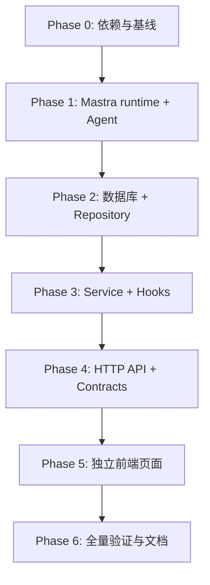

# BloomAI 独立定时任务（Task Sessions）逐文件实施计划

- **状态**：待实施
- **日期**：2026-08-02
- **前置设计**：`docs/schedule/001-scheduled-task-design.md`
- **实施原则**：先升级与封装运行时，再落库和提供 API，最后接入 UI；每一步都有可验证产物。

## 1. 实施总览

本计划实现“每个定时任务是独立任务会话，与 Chat 无关”的第一期能力。



### 1.1 强制边界

实施过程中必须保持：

- 不修改 Chat persistence 的语义；
- 不让 schedules route 调用 Chat route；
- 不让 schedule service 调用 `ChatService`、`messageRepo`、`sessionRepo`；
- 不传递 `threadId` 或 `resourceId` 给 Mastra schedules；
- 不开放任意 Agent、任意 tool、任意 metadata 给前端输入。

## 2. Phase 0：依赖、基线与升级验证

### 2.1 修改 `package.json`

**文件**：`D:\codeproject\JS\bloomai\package.json`

**修改**：

- 将 `@mastra/core` 改为精确版本 `1.51.0`；
- 将 `@mastra/libsql` 改为精确版本 `1.16.0`；
- 不在本阶段顺便升级无关依赖；
- 保留现有 `zod` 依赖（实际解析版本已满足 `^3.25.0`）。

**原因**：Schedules 在 Core 1.50+ 提供，LibSQL 1.16+ 才具备对应 schedules storage domain 且要求 Core 1.51+。

### 2.2 更新 `package-lock.json`

**文件**：`D:\codeproject\JS\bloomai\package-lock.json`

**修改**：由 npm 安装命令生成锁文件更新。

**验证**：

```powershell
npm install --save-exact @mastra/core@1.51.0 @mastra/libsql@1.16.0
npm run typecheck
npm test
npm run build
```

**验收**：升级本身不改变 Chat、Deep Research 或 Electron 构建结果。

### 2.3 新增升级兼容性测试（可选但推荐）

**文件**：`D:\codeproject\JS\bloomai\src\server\mastra\schedules\mastra-schedules.compatibility.test.ts`

**职责**：

- 用临时 LibSQLStore 实例化 Mastra；
- 断言 `mastra.schedules.create/list/pause/resume/run` API 可调用；
- 防止未来 lockfile 漂移到不兼容的 beta API。

## 3. Phase 1：Mastra runtime 与独立 Task Agent

### 3.1 新增 schedule runtime URL 解析

**新文件**：`D:\codeproject\JS\bloomai\src\server\mastra\schedules\storage.ts`

**职责**：

- 基于 `getDataDir()` 构建专用 runtime 文件 URL；
- 导出 `resolveScheduleRuntimeUrl(dataDir?: string)`；
- 确保 data directory 存在；
- 返回：

```text
file:<DATA_DIR>/mastra-runtime.db
```

**注意**：不得复用 `deep-research-runtime.db`，也不得写入主 Drizzle 业务库。

### 3.2 新增受控 Scheduled Task Agent

**新文件**：`D:\codeproject\JS\bloomai\src\server\mastra\schedules\scheduled-task-agent.ts`

**职责**：

- 创建并导出 ID 固定为 `scheduled-task` 的 Mastra Agent；
- instructions 明确：任务无状态、输出可独立阅读、不要假设对话历史；
- 使用当前默认模型解析机制；
- 初始工具集为空或仅包含经审计的只读工具；
- 禁止引用 Chat request context、Chat plan mode 和 Chat memory。

**建议测试文件**：

`D:\codeproject\JS\bloomai\src\server\mastra\schedules\scheduled-task-agent.test.ts`

**测试**：

- Agent ID 固定；
- instructions 含无状态要求；
- 不注册危险工具。

### 3.3 新增 schedule lifecycle hooks 工厂

**新文件**：`D:\codeproject\JS\bloomai\src\server\mastra\schedules\hooks.ts`

**导出建议**：

```ts
export function createScheduleHooks(dependencies: ScheduleHookDependencies): SchedulesConfig
```

**职责**：

- `prepare`：验证 schedule metadata namespace、task agent 和默认模型可用性；
- `onFinish`：调用 Task Run repository 写入成功/跳过/丢弃状态；
- `onError`：写入脱敏失败记录；
- `onAbort`：写入中止记录；
- 所有写入根据 `(scheduleId, trigger.firedAt)` 幂等；
- 捕获并记录 hook 内部错误，不把 repository 异常扩散给框架。

**建议测试文件**：

`D:\codeproject\JS\bloomai\src\server\mastra\schedules\hooks.test.ts`

**测试场景**：

1. 成功结果写入 `output_text`；
2. `prepare` 返回 null 时写入 skipped；
3. `onError` 对敏感错误执行脱敏；
4. 同一 schedule + firedAt 写入两次仍只有一条 run；
5. 非 BloomAI metadata 的 schedule 不被当作应用任务写入。

### 3.4 修改主 Mastra 组合根

**文件**：`D:\codeproject\JS\bloomai\src\server\mastra\index.ts`

**修改**：

- 删除 `InMemoryStore` 使用；
- 改用 `LibSQLStore({ id: 'bloomai-schedule-runtime', url: resolveScheduleRuntimeUrl() })`；
- 注册 `scheduled-task` Agent；
- 向 `new Mastra()` 传入 `schedules: createScheduleHooks(...)`；
- 继续保留现有 observability、logger、chat/team agents。

**注意**：

- 现有 Chat Agent 改用持久化 storage 后，必须回归验证普通 Chat；
- 本次不把深度研究 runtime 合并进该 Mastra 实例；
- 引入 hooks 时避免与模块循环依赖。推荐由 hooks 接收 repository/service 依赖，而不是反向导入整个 mastra singleton。

**回归测试**：

- `src/server/services/chat.service.test.ts`；
- 与 mastra 初始化相关的现有测试；
- 新增 schedule create/list smoke test。

## 4. Phase 2：数据库、迁移与 Task Run Repository

### 4.1 修改 Drizzle schema

**文件**：`D:\codeproject\JS\bloomai\src\server\db\schema.ts`

**新增表**：`scheduled_task_runs`。

**建议字段**：

```ts
id: text('id').primaryKey()
schedule_id: text('schedule_id').notNull()
trigger_fired_at: integer('trigger_fired_at').notNull()
mastra_run_id: text('mastra_run_id')
trigger_kind: text('trigger_kind').notNull()
status: text('status').notNull()
output_text: text('output_text')
error_message: text('error_message')
usage_json: text('usage_json')
started_at: integer('started_at').notNull()
finished_at: integer('finished_at')
created_at: integer('created_at').notNull()
```

**索引/约束**：

- unique index：`schedule_id + trigger_fired_at`；
- index：`schedule_id + trigger_fired_at DESC`；
- 可选 index：`status + created_at DESC`。

**禁止字段**：

- `session_id`；
- `message_id`；
- `thread_id`；
- 任意 Chat conversation 外键。

### 4.2 修改迁移定义

**文件**：`D:\codeproject\JS\bloomai\src\server\db\migrations.ts`

**修改**：

- 新增单调递增的 migration；
- 创建 `scheduled_task_runs`、索引和唯一约束；
- 对已有安装执行安全的 `CREATE TABLE IF NOT EXISTS` 或项目既有迁移风格；
- 不变更现有 Chat、Skill 或 Research 表。

### 4.3 更新迁移测试

**文件**：`D:\codeproject\JS\bloomai\src\server\db\migrations.test.ts`

**测试**：

- 全新数据库创建表与索引；
- 从当前 schema 迁移时成功；
- 唯一约束有效；
- 旧聊天表未被意外修改。

### 4.4 新增 Task Run Repository

**新文件**：`D:\codeproject\JS\bloomai\src\server\db\repositories\scheduled-task-run.repo.ts`

**建议 API**：

```ts
createOrGet(input): ScheduledTaskRun
listByScheduleId(scheduleId, options): Page<ScheduledTaskRun>
getLatestByScheduleIds(scheduleIds): Map<string, ScheduledTaskRun>
deleteByScheduleId(scheduleId): number
```

**职责**：

- 创建幂等记录；
- 成功/失败/中止状态更新；
- 游标或限制分页；
- 批量查询每个任务的最近一次运行，避免列表 N+1；
- 删除 schedule 时删除对应运行记录。

**新测试文件**：

`D:\codeproject\JS\bloomai\src\server\db\repositories\scheduled-task-run.repo.test.ts`

**覆盖**：创建、幂等冲突、排序、分页、批量 latest、删除级联。

## 5. Phase 3：ScheduleTaskService 与应用 DTO

### 5.1 新增共享 contracts

**新文件**：`D:\codeproject\JS\bloomai\src\shared\schedules\contracts.ts`

**包含**：

- `ScheduleTaskStatus`；
- `ScheduleTaskDto`；
- `ScheduleTaskRunDto`；
- `CreateScheduleTaskInput`；
- `UpdateScheduleTaskInput`；
- 列表/分页响应类型；
- 可供前后端共享的状态枚举。

### 5.2 新增共享 Zod schemas

**新文件**：`D:\codeproject\JS\bloomai\src\shared\schedules\schemas.ts`

**校验项**：

- `name`：trim 后 1–120 字符；
- `prompt`：trim 后 1–12,000 字符；
- `cron`：字符串长度上限；最终 cron 语法仍交由 Mastra 验证并映射错误；
- `timezone`：IANA 时区格式，并在服务端用 `Intl.DateTimeFormat` 验证；
- `limit`：1–100；
- cursor：安全字符串；
- 禁止未声明字段。

### 5.3 新增 ScheduleTaskService

**新文件**：`D:\codeproject\JS\bloomai\src\server\schedules\schedule-task.service.ts`

**依赖**：

- `mastra` 或一个窄接口 `ScheduleGateway`；
- `scheduledTaskRunRepo`；
- logger / error sanitizer；
- shared schemas/contracts。

**建议方法**：

```ts
listTasks(): Promise<ScheduleTaskDto[]>
getTask(id: string): Promise<ScheduleTaskDto | null>
createTask(input: CreateScheduleTaskInput): Promise<ScheduleTaskDto>
updateTask(id: string, input: UpdateScheduleTaskInput): Promise<ScheduleTaskDto>
pauseTask(id: string): Promise<ScheduleTaskDto>
resumeTask(id: string): Promise<ScheduleTaskDto>
runTaskNow(id: string): Promise<ScheduleTaskDto>
deleteTask(id: string): Promise<void>
listTaskRuns(id: string, options): Promise<Page<ScheduleTaskRunDto>>
```

**实现要点**：

- `createTask` 固定构造 `agentId: 'scheduled-task'` 与受控 metadata；
- `listTasks` 只返回 metadata namespace 为 BloomAI 的 schedules；
- service 对 Mastra beta API 做一次性适配与错误翻译；
- `deleteTask` 先删除原生 schedule，再删除应用 runs；若第二步失败记录高优先级日志并返回可诊断错误；
- `runTaskNow` 仅请求框架立即执行，结果仍通过 hooks 异步持久化；API 返回任务当前 DTO，不伪造同步结果；
- 不引用任何 Chat 相关模块。

### 5.4 新增 Service 测试

**新文件**：`D:\codeproject\JS\bloomai\src\server\schedules\schedule-task.service.test.ts`

**测试**：

- 固定 Agent ID 和 metadata；
- 只列出 BloomAI task schedules；
- 输入校验与 Mastra cron 错误映射；
- 暂停、恢复、手动运行委托正确；
- delete 顺序与 repository 清理；
- 列表中最近 run 聚合正确；
- 禁止传入 thread/resource/agent override。

## 6. Phase 4：Hono HTTP Routes

### 6.1 新增 schedule routes

**新文件**：`D:\codeproject\JS\bloomai\src\server\http\routes\schedules.ts`

**路由**：

```text
GET    /
POST   /
GET    /:id
PATCH  /:id
DELETE /:id
POST   /:id/pause
POST   /:id/resume
POST   /:id/run
GET    /:id/runs
```

**规则**：

- route 只处理 HTTP 适配、`readJson`、参数读取、调用 service 和返回 JSON；
- 不在 route 内直接使用 Drizzle repository 或 `mastra.schedules`；
- 使用项目现有 error mapper 风格；
- 操作成功返回统一 DTO；
- `run` 返回 `202 Accepted` 或项目既有命令式 API 的成功码，并说明结果需要轮询 runs 获取。

### 6.2 修改 Hono 应用注册

**文件**：`D:\codeproject\JS\bloomai\src\server\http\app.ts`

**修改**：

- import `schedulesRoutes`；
- 注册：

```ts
app.route('/api/v1/schedules', schedulesRoutes)
```

- 不影响现有 Chat 路由位置和行为。

### 6.3 新增 HTTP 路由测试

**新文件**：`D:\codeproject\JS\bloomai\src\server\http\routes\schedules.test.ts`

**覆盖**：

1. `POST` 合法创建；
2. 非法 cron / timezone / prompt 返回 400；
3. `GET` 返回任务和 latest run 摘要；
4. pause/resume/run endpoint 的 service 调用；
5. `/runs` 分页；
6. 不存在 ID 返回 404；
7. 断言不存在 Chat session/message side effect。

## 7. Phase 5：独立前端页面

> 实际文件名须以当前 renderer 的根路由和 store 组织方式为准；实施前先确认现有页面注册入口，避免创建孤立页面。

### 7.1 新增前端 API 客户端

**新文件（建议）**：`D:\codeproject\JS\bloomai\src\renderer\api\schedules.ts`

**职责**：

- 封装 `/api/v1/schedules` 全部请求；
- 使用 shared contracts；
- 将 HTTP error 转换为页面可展示错误；
- 不经过 Chat transport。

### 7.2 新增 Zustand store

**新文件（建议）**：`D:\codeproject\JS\bloomai\src\renderer\pages\Schedules\schedule-task.store.ts`

**状态**：

```text
tasks
selectedTaskId
runsByTaskId
loading
saving
runningNow
error
```

**动作**：加载列表、创建、更新、暂停、恢复、立即执行、删除、加载运行历史。

### 7.3 新增定时任务页面与组件

**新目录**：`D:\codeproject\JS\bloomai\src\renderer\pages\Schedules\`

建议文件：

| 文件 | 职责 |
|---|---|
| `index.tsx` | 页面入口和数据加载。 |
| `SchedulesPage.tsx` | 列表与详情双栏布局。 |
| `ScheduleTaskList.tsx` | 任务列表、状态与主要操作。 |
| `ScheduleTaskDetail.tsx` | 选中任务的配置和历史容器。 |
| `ScheduleTaskForm.tsx` | 创建/编辑表单。 |
| `ScheduleRunHistory.tsx` | Run 列表、错误和输出展示。 |
| `schedule-task.store.ts` | 页面状态管理。 |
| `schedule-task.types.ts` | 仅 UI 衍生类型。 |
| `schedules.css` 或对应现有样式文件 | 页面样式。 |

### 7.4 修改 renderer 页面注册/导航入口

**待确认具体文件**：实施时从现有 app shell 中定位导航与页面注册源文件，例如 `src/renderer/App.tsx` 或对应 root/layout 组件。

**修改**：

- 添加“定时任务”导航入口；
- 新页面与 Chat 页面平级；
- 不插入 Chat session list；
- 不重用 `ChatPanelMastra`、Chat store 或 Chat 请求逻辑。

### 7.5 前端交互细节

1. 初始加载任务列表；
2. 新建任务打开表单，提供常用调度模板和高级 cron 输入；
3. 保存后刷新列表并选中任务；
4. “立即执行”显示提交中状态，成功后轮询或刷新 run history；
5. run history 展示成功文本、失败错误和复制按钮；
6. 删除必须二次确认；
7. 页面顶部固定提示：“任务仅在 BloomAI 运行期间执行”。

### 7.6 前端测试

**建议新文件**：

```text
src/renderer/pages/Schedules/SchedulesPage.test.tsx
src/renderer/pages/Schedules/ScheduleTaskForm.test.tsx
src/renderer/pages/Schedules/ScheduleRunHistory.test.tsx
```

**覆盖**：

- 任务列表与状态渲染；
- 表单合法/非法输入；
- 暂停恢复、立即执行、删除确认；
- 无任务空状态；
- 成功输出 Markdown 与失败错误展示；
- 页面不渲染 Chat session/message 组件。

## 8. Phase 6：端到端验证、运维与文档

### 8.1 新增集成测试

**新文件（建议）**：`D:\codeproject\JS\bloomai\src\server\schedules\schedule-task.integration.test.ts`

**测试流程**：

1. 创建临时 data directory 和 LibSQLStore；
2. 创建 task schedule；
3. 销毁并重新创建 Mastra runtime；
4. 断言 schedule 仍存在；
5. 手动执行；
6. 使用测试 Agent 或 deterministic model 产生输出；
7. 断言 `scheduled_task_runs` 只有一条成功记录；
8. pause/resume/delete；
9. 断言不产生 Chat persistence 数据。

### 8.2 修改 README（实施完成后）

**文件**：`D:\codeproject\JS\bloomai\README.md`

**新增说明**：

- 定时任务入口；
- cron 与时区基础；
- “BloomAI 运行期间执行”的限制；
- 数据存储位置与备份建议；
- 不支持的高风险任务能力。

### 8.3 更新本设计和计划文档

**文件**：

```text
D:\codeproject\JS\bloomai\docs\schedule\2026-08-02-scheduled-task-design.md
D:\codeproject\JS\bloomai\docs\schedule\2026-08-02-scheduled-task-implementation-plan.md
```

**修改时机**：实现中如发现 Mastra 1.51 的实际 API 与设计存在差异，应先在这两个文档记录决策和替代方案，再调整代码。

## 9. 实施顺序与提交建议

推荐以小型、可回归的提交推进：

1. `chore(mastra): upgrade core and libsql for schedules`
2. `feat(schedules): add persistent runtime and scheduled task agent`
3. `feat(schedules): persist task run history`
4. `feat(schedules): add schedule task service and http api`
5. `feat(schedules): add standalone schedule management page`
6. `test(schedules): cover persistence, lifecycle, and task isolation`
7. `docs(schedules): document scheduling limits and usage`

每个提交至少运行与其修改范围匹配的测试；最终统一运行：

```powershell
npm run typecheck
npm test
npm run build
```

## 10. 完成定义（Definition of Done）

功能可声明完成的前提：

- [ ] 精确 Mastra 依赖升级后通过 typecheck、test 和 build。
- [ ] `InMemoryStore` 已替换为持久化的 schedule-capable LibSQLStore。
- [ ] `scheduled-task` Agent 为无状态、低风险任务执行器。
- [ ] `scheduled_task_runs` 已迁移并具有幂等唯一约束。
- [ ] Service、hooks、repository、routes 具备单元和集成测试。
- [ ] 创建、编辑、暂停、恢复、删除、立即执行和历史查看均可在 UI 完成。
- [ ] 任务不会创建或写入任何 Chat session/message。
- [ ] UI 明确提示应用关闭后不会保证任务后台执行。
- [ ] README 和设计文档反映最终实现行为。

