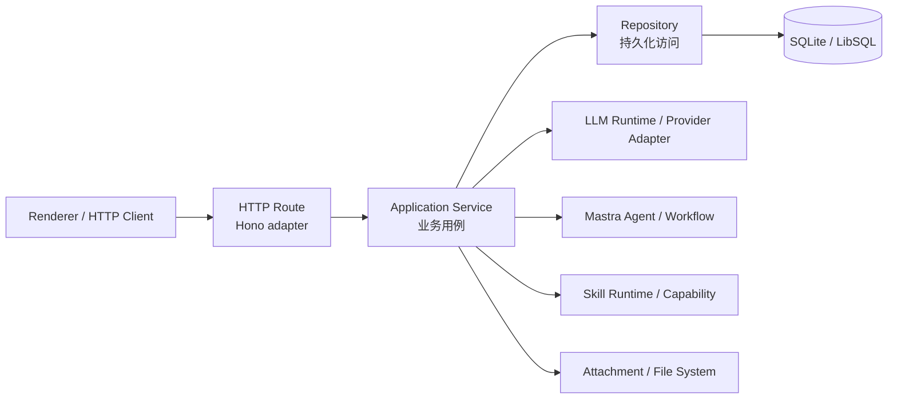

# BloomAI Services 层架构分析

> 日期：2026-07-16  
> 状态：已实施（2026-07-16；Renderer 人工 smoke 另行在可交互桌面会话执行）
> 范围：`src/server` 的 HTTP API 请求路径、应用服务边界及相关测试策略。

## 1. 背景与目标

BloomAI 的后端目前同时存在多种 API 调用路径：

```text
HTTP Route → Repository
HTTP Route → LLM Provider / LLM Runtime
HTTP Route → Mastra Runtime
HTTP Route → Skill Runtime
HTTP Route → 已有 Service → Repository / Runtime
```

这种不一致会让 HTTP 层逐渐成为业务规则、持久化、外部依赖和响应格式的混合层。为了保证 API 调用路径一致、业务逻辑可复用、测试可分层，后端应收敛到以下目标架构：



目标不是机械地增加一个 `services` 目录，而是建立稳定的依赖方向：

```text
http/routes → services → repositories → database
                     └→ llm / mastra / skills / attachments / tools / telemetry
```

> 重要：Repository 不应成为调用 LLM、文件系统、Mastra 或 Skill Runtime 的中转层。Repository 只负责持久化；多个资源和外部运行时的协调由 Service 承担。

## 2. 分层职责与依赖规则

### 2.1 HTTP Route：协议适配层

位置：`src/server/http/routes/**`

Route 允许负责：

- 读取 path/query/header/body；
- 使用 Zod 或 HTTP schema 校验请求形状；
- 将请求转换为 service 输入；
- 调用 service；
- 将 service 结果映射为 JSON、SSE 或二进制 HTTP Response；
- 将统一领域错误映射为 HTTP status code 和错误结构；
- HTTP 特有的缓存头、content-type、abort signal 等处理。

Route 不应负责：

- 直接导入 `db/repositories/**`；
- 直接调用 LLM Provider、`src/server/llm/**` 内部实现或 Mastra runtime；
- 直接调用 Skill Runtime、Package Installer、Artifact Store 等应用用例；
- 多个 Repo 的业务编排；
- 密钥脱敏、状态机转换、权限规则、幂等规则；
- 复杂 DTO 组装或 `*_json` 字段解析；
- 业务级文件路径校验和附件上下文构建。

### 2.2 Application Service：业务用例层

建议位置：`src/server/services/**`

Service 是 HTTP、Electron IPC、CLI、后台 job 或 Mastra Tool 可共同调用的用例入口。它应：

- 用领域语言定义操作，例如 `createVideoTask`、`installPackage`、`streamChat`；
- 编排一个或多个 Repo、LLM/Mastra/Skill runtime、文件系统和 telemetry；
- 执行业务规则、权限、状态转换、事务和幂等处理；
- 将数据库记录和基础设施结果映射为稳定的应用 DTO；
- 抛出稳定的领域错误，不暴露 Hono `Context` 或 HTTP status code；
- 接受显式输入和 `AbortSignal` 等协议无关参数。

Service 不应：

- 接收或返回 Hono `Context` / `Response`；
- 直接拼装 HTTP JSON 或 status code；
- 泄漏数据库行结构作为公共 API；
- 成为无规则的“万能工具箱”。

### 2.3 Repository：持久化层

位置：`src/server/db/repositories/**`

Repository 只负责：

- 单表或清晰聚合边界内的读写、查询、分页；
- 数据库查询参数和数据库记录映射；
- 由上层 service 决定的事务内底层持久化操作。

Repository 不负责：

- HTTP 错误；
- LLM 或外部 HTTP 调用；
- Mastra / Skill 调度；
- 文件读写；
- 用户可见业务状态机和跨资源编排。

### 2.4 Runtime / Gateway：基础设施适配层

现有 `src/server/llm/**`、`src/server/mastra/**`、`src/server/skills/**`、`src/server/attachments/**` 等模块保留为领域 runtime 或基础设施实现。Service 调用它们，不要求为了分层而一次性移动所有文件。

## 3. 当前代码盘点

### 3.1 已有 Service 雏形，但目录和对外边界不统一

| 文件 | 当前定位 | 结论 |
|---|---|---|
| `src/server/services/image-studio.service.ts` | 图片生成业务用例，已编排 Repo、LLM、文件系统、telemetry | 作为服务层样板扩展；其余图片 API 不应再直连 Repo |
| `src/server/attachments/attachment-service.ts` | 附件保存/解析业务能力 | 可保留内部位置，但应提供由 Route 调用的清晰 application API |
| `src/server/skills/article-illustrations/article-illustration.service.ts` | 文章配图完整业务服务 | 可保留领域实现；Route 应只依赖服务 API，HTTP 错误映射需统一 |

因此，问题不是从零开始创建 Service，而是使所有 HTTP 路由都只面向一致的 service 边界。

### 3.2 Route 直连 Repository 的主要区域

| Route | 当前直接依赖 | 应迁移到的 Service |
|---|---|---|
| `http/routes/personas.ts` | `personaRepo` | `persona.service.ts` |
| `http/routes/settings.ts` | `settingsRepo` | `settings.service.ts` |
| `http/routes/sessions.ts` | `sessionRepo`、`messageRepo` | `session.service.ts` |
| `http/routes/images.ts` | `imageSessionRepo`、`imageGenerationRepo` | 扩展 `image-studio.service.ts` |
| `http/routes/llm.ts` | `llmRepo`、LLM settings/runtime | `llm.service.ts` |
| `http/routes/tools.ts` | `toolRepo`、capability broker | `tool.service.ts` |
| `http/routes/skills.ts` | `skillRepo`、`skillPackageRepo`、legacy runner | `skill.service.ts` |
| `http/routes/skill-package-runtime.ts` | `skillPackageRepo`、installer、artifact、run coordinator | `skill-package-runtime.service.ts` |

### 3.3 高复杂度 HTTP 编排区域

#### Chat：`src/server/http/routes/chat.ts`

该 Route 目前同时处理请求解析、model/mode/agent 选择、计划生成与执行、用户消息持久化、附件文本构建、Mastra workflow/chat 调用、AI SDK stream 组装和流错误处理。它是本次迁移的最高风险和最高价值区域。

目标：

```text
chat.ts → chat.service.ts →
  message/session repositories
  attachment service
  Mastra agent/workflow runtime
  stream contract adapter
```

Route 最终只承担 HTTP 输入输出和 SSE/AI SDK response 建立。

#### LLM：`src/server/http/routes/llm.ts`

该 Route 当前混合了 provider/model CRUD、JSON 配置解析、API key 可用性判断、环境变量回退、modality 校验、Ollama remote model discovery 和视频任务用例。

目标：

```text
llm.ts → llm.service.ts →
  llmRepo + settingsRepo + LLM runtime / provider adapter
```

`providerSummary`、`modelSummary`、`hasApiKey`、配置解析和业务校验均应迁入 service 或由 service 私有 mapper 管理。

#### Skill Package Runtime：`src/server/http/routes/skill-package-runtime.ts`

包检查、安装、安装状态、capability grant、运行、命令、取消、artifact 获取及导出已经构成完整应用服务，目前只是实现位置在 Route。

目标：

```text
skill-package-runtime.ts → skill-package-runtime.service.ts →
  skillPackageRepo + PackageInstaller + SkillRunCoordinator + ArtifactStore
```

注意：截至 2026-07-16，该 Route 及其相关 runtime 文件存在未提交功能修改。服务层迁移应等待该功能改动稳定并单独提交后再开始，避免混合两类风险。

## 4. 服务目录与命名建议

建议逐步形成以下结构，不要求第一阶段移动所有 domain/runtime 文件：

```text
src/server/
  http/
    routes/
    error-mapper.ts
    util.ts
  services/
    errors.ts
    chat.service.ts
    llm.service.ts
    image-studio.service.ts
    session.service.ts
    persona.service.ts
    settings.service.ts
    tool.service.ts
    skill.service.ts
    skill-package-runtime.service.ts
    article-illustration.service.ts        # 可为 skills 内实现提供对外 façade
  db/
    repositories/
  llm/
  mastra/
  attachments/
  skills/
```

命名规则：

- 文件名以业务域命名，使用单数：`llm.service.ts`、`session.service.ts`；
- 使用函数式 service object 或具名函数，不强制为了形式引入 class；
- service 导出输入/输出类型，避免 Route 依赖 Repo record 类型；
- Route 引入 `@server/services/...` 或相对 service 路径，不再引入 Repo；
- service 可以依赖 Repo 和 runtime；Repo 不可以反向依赖 service 或 Route。

## 5. 统一错误与契约

应补充两项基础设施：

```text
src/server/services/errors.ts
src/server/http/error-mapper.ts
```

建议错误码最小集合：

| 领域错误码 | 建议 HTTP 状态 | 示例 |
|---|---:|---|
| `VALIDATION_ERROR` | 400 | 输入字段不合法 |
| `NOT_FOUND` | 404 | 资源不存在 |
| `CONFLICT` | 409 | Provider ID 已存在 |
| `FORBIDDEN` | 403 | 禁止删除内置 Persona |
| `UNSUPPORTED_MODEL` | 400 | 模型不支持指定能力 |
| `EXTERNAL_SERVICE_ERROR` | 502 | Provider 调用失败 |
| `INTERNAL_ERROR` | 500 | 非预期错误 |

Service 抛领域错误，Route 或全局 HTTP error mapper 统一把它转换为现有 `{ error: { code, message } }` 契约。迁移期间不得擅自改变前端依赖的 endpoint、状态码、字段名或 streaming event 格式。

## 6. 测试边界

迁移完成后测试应明确分层：

| 测试层 | 核心验证 |
|---|---|
| Repository tests | SQL、迁移、查询、分页和持久化细节 |
| Service tests | 业务规则、多资源协作、错误、状态机、幂等、runtime mock |
| Route tests | 请求校验、HTTP status、response schema、SSE/二进制响应映射 |
| E2E tests | Renderer/API/数据库/本地文件/可选 provider mock 的完整链路 |

完整迁移中的每一阶段都必须至少保留或新增该阶段涉及 service 的单元测试和受影响 route 的集成测试；阶段结束前还必须执行完整测试、类型检查和生产构建。详细命令与验收见 `02-service-layer-migration-plan.md`。

## 7. 非目标与约束

本次工作不应：

- 一次性替换 Hono、Mastra、AI SDK 或 Drizzle；
- 为纯粹“目录好看”而移动所有 `llm`、`skills`、`attachments` 文件；
- 在 Chat 迁移时同时重写前端流协议；
- 在未建立回归测试的前提下改变 API 结构；
- 和正在进行的 skill package runtime 功能修改混入同一个变更集。

最小成功标准是：所有 HTTP API 都只能通过 service 触达业务能力；Route 不再直连 Repository 或主要 runtime；前端请求与流式消费行为保持兼容；完整测试、类型检查和构建全部通过。


## 8. ?????2026-07-16?

Services ????????????????? `src/server/architecture/dependency-boundaries.ts` ?????????

| ?? | ???? | ???? |
|---|---|---|
| `src/server/http/routes/**` | HTTP/SSE/????????????????? | `db/repositories/**`?`llm/**`?`mastra/**`?`skills/**`?`attachments/**` ??? |
| `src/server/services/**` | ?????DTO/??????? Repo ? runtime | `http/routes/**` ? `hono` / Hono `Context` |
| `src/server/db/repositories/**` | ????????????????? | `services/**`?`http/**`?`llm/**`?`mastra/**`?`skills/**`?`attachments/**` |
| `src/shared/**` | ???????????????????????? | HTTP?Repository ? runtime ?? |

????????????????? TypeScript ?????? `*.test.*`?`*.e2e.*`?`*.spec.*` ???????????????????? `import()`?????? re-export ??????????

??????????? `DEPENDENCY_BOUNDARY_ALLOWLIST` ????? `layer`?`file`?`source`?`reason`?`owner` ? `removeByPhase`????????????????? allowlist ???????? [ADR-0001](./03-http-route-application-service-adr.md)?

??????????????

```powershell
npm run test:architecture
```

?????????? Route contract?Service unit?Repository persistence ? Renderer smoke ???


## 8. 实施收口（2026-07-16）

Services 迁移的生产代码已按本分析收口，并以 `src/server/architecture/dependency-boundaries.ts` 持续验证以下规则：

| 目录 | 允许职责 | 禁止依赖 |
|---|---|---|
| `src/server/http/routes/**` | HTTP/SSE/二进制协议适配、输入校验、响应映射 | `db/repositories/**`、`llm/**`、`mastra/**`、`skills/**`、`attachments/**` 的实现 |
| `src/server/services/**` | 用例编排、DTO/领域错误、协调 Repo 与 runtime | `http/routes/**` 与 `hono` / Hono `Context` |
| `src/server/db/repositories/**` | 查询、事务内持久化、数据库记录映射 | `services/**`、`http/**`、`llm/**`、`mastra/**`、`skills/**`、`attachments/**` |
| `src/shared/**` | 与运行时无关的稳定类型、引用格式和前后端共享契约 | HTTP、Repository 或 runtime 实现 |

架构检查会递归扫描上述目录中的生产 TypeScript 文件，并忽略 `*.test.*`、`*.e2e.*`、`*.spec.*` 与声明文件。检查同时覆盖静态和字面量动态 `import()`；因此不能以 re-export 或动态导入绕过边界。

若确有短期例外，必须在 `DEPENDENCY_BOUNDARY_ALLOWLIST` 中逐项登记 `layer`、`file`、`source`、`reason`、`owner` 和 `removeByPhase`。空白元数据会使架构检查失败；当前 allowlist 为空。详细决策见 [ADR-0001](./03-http-route-application-service-adr.md)。

开发时使用以下命令验证边界：

```powershell
npm run test:architecture
```

这项检查补充而不替代 Route contract、Service unit、Repository persistence 与 Renderer smoke 测试。
