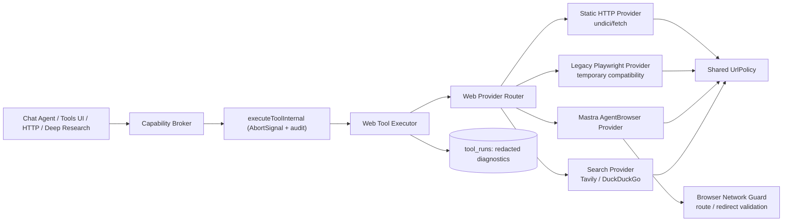

# Mastra AgentBrowser 接入 Web Tools 需求与方案分析

> 文档编号：001  
> 文档版本：v1.1  
> 状态：建议评审  
> 日期：2026-08-03  
> 范围：`web_search`、`web_fetch`、`web_extract`、`web_screenshot`  
> 关联文档：[003-tools-audit-v1.1.md](003-tools-audit-v1.1.md)、[004-tools-platform-implementation-plan-v1.1.md](004-tools-platform-implementation-plan-v1.1.md)<br>
> 外部参考：[Mastra AgentBrowser 文档](https://mastra.ai/docs/browser/agent-browser)

## 1. 结论

**不应完全替换现有 Web Tools，也不应把 AgentBrowser 的原始 `browser_*` 工具直接暴露给 BloomAI Chat Agent。**

推荐实现为：

1. 保持对外 Tool ID 不变：`web_search`、`web_fetch`、`web_extract`、`web_screenshot`。
2. 在 Web Tools 内部新增可配置的 **AgentBrowser 执行后端**，作为现有静态 HTTP / Tavily / DuckDuckGo 的补充能力。
3. `web_fetch` 和 `web_extract` 使用“静态请求优先，浏览器按策略回退”的路由。
4. `web_screenshot` 以 AgentBrowser 为首个真实实现，替代当前占位返回。
5. `web_search` 保持 Tavily 为首选、DuckDuckGo 为基础回退；浏览器搜索只作为低并发、显式开启的末级回退，不作为默认搜索引擎。
6. AgentBrowser 的实例生命周期、URL 安全、超时取消、并发和审计仍必须经过现有 `Capability Broker -> executeToolInternal -> tool_runs` 链路。

这是一套“第二执行后端”，不是“第二套对模型公开的工具”。对调用者而言，工具名称、权限、输入与主输出语义稳定；对运行时而言，页面内容获取可从静态 HTTP 升级为受控浏览器自动化。

## 2. 需求背景

### 2.1 当前问题

当前 Web Tool 实现主要依赖：

| 工具 | 当前主路径 | 已知不足 |
|---|---|---|
| `web_search` | Tavily API，失败后 DuckDuckGo Instant Answer API | 免费额度、API 可用性与结果覆盖有限；DuckDuckGo Instant Answer 不是完整网页搜索 SERP |
| `web_fetch` | `fetch` 静态请求，内容过少时用 `playwright-core` 渲染 | 静态页面常能获取，但 SPA、延迟水合、交互后加载和反爬跳转页面容易得到空内容或失败 |
| `web_extract` | 与 `web_fetch` 共用加载逻辑，再用 HTML 规则提取正文、标题、链接 | 依赖加载结果质量；复杂 DOM 的正文质量不稳定 |
| `web_screenshot` | 占位返回 | 数据库目录宣称可截图，但实际没有截图能力 |

当前关键实现位于：

- `src/server/tools/web-search.ts`
- `src/server/tools/web-fetch.ts`
- `src/server/tools/web-extract.ts`
- `src/server/tools/web-screenshot.ts`
- `src/server/tools/utils/html.ts`
- `src/server/tools/utils/render.ts`

### 2.2 业务目标

本次接入要解决的是“网页可达但静态抓取拿不到可读内容”的问题，尤其是：

- JavaScript 渲染的页面、SPA 和内容延迟加载页面；
- 页面需要等待特定 DOM 稳定后才能读取；
- 需要视觉证据或真实页面截图；
- 深度研究工作流在静态获取失败后，需要有限、可预算的浏览器重试路径。

这次不以“让模型随意浏览、点击、登录网站”为目标。登录、支付、发布内容、绕过验证码、无限翻页、站内深度爬取都不属于本期范围。

## 3. AgentBrowser 能力与适配边界

Mastra 的 `@mastra/agent-browser` 基于 Playwright，核心特点是通过页面无障碍树中的元素引用定位元素，适用于稳定的浏览器导航和交互。文档说明其可提供浏览器快照、元素引用交互以及截图能力；本地启动时需要可用 Chromium，或可通过 CDP 连接远程浏览器。

### 3.1 能力映射

| AgentBrowser 能力 | BloomAI 可用场景 | 本期是否使用 |
|---|---|---|
| 浏览器导航与页面加载 | 获取 JS 渲染后的 DOM | 是 |
| 页面 snapshot / 无障碍树 | 调试、可选的文本回退或交互定位 | POC 验证，非 `web_fetch` 默认输出 |
| DOM 交互 | Cookie 弹窗关闭、有限的“加载更多”或同意按钮 | 仅白名单化策略，默认关闭 |
| 浏览器截图 | 实现 `web_screenshot` | 是 |
| 录制 | 浏览器动作调试 | 否，录制能力仍为 alpha，不进入生产默认配置 |
| 直接挂载到 Mastra Agent | 让模型拥有细粒度浏览器工具 | 否，不直接挂载 |

### 3.2 不能把 AgentBrowser 当作通用 HTTP 替代品的原因

浏览器自动化比静态请求更昂贵、更慢、资源占用更高，也更容易受到站点策略、验证码、会话状态和页面变化影响。它适合“静态请求不足时取得页面渲染结果”，不适合作为所有搜索和抓取的默认基础设施。

此外，浏览器会请求 HTML、脚本、样式、图片、XHR、WebSocket 等多类资源。若没有网络路由拦截，原有静态抓取中的 SSRF 问题会在浏览器层扩大。因此 AgentBrowser 接入必须先统一 URL Policy 和浏览器网络守卫。

## 4. 方案比较

### 4.1 方案 A：完全替换为 AgentBrowser

做法：所有 `web_search`、`web_fetch`、`web_extract`、`web_screenshot` 均通过 AgentBrowser 执行。

优点：

- 统一了浏览器能力；
- 能处理更多前端渲染页面；
- 截图可快速落地。

主要问题：

- 普通静态网页也要启动和导航浏览器，延迟、内存、CPU 与失败面显著增加；
- 搜索结果页会遭遇站点条款、验证码、地区化结果与 DOM 变化；
- 需要 Chromium 二进制或远程 CDP，Electron 打包和升级复杂度增加；
- 无法复用 Tavily 的结构化搜索摘要和来源排序优势；
- 在 Deep Research 当前最高 `fetchConcurrency = 6` 的预算下，直接浏览器化会造成资源争抢。

结论：**不采用。**

### 4.2 方案 B：新增 AgentBrowser 原始工具并让模型自行使用

做法：把 `browser_navigate`、`browser_snapshot`、`browser_click`、`browser_type`、`browser_screenshot` 等原始工具直接注册到 Chat Agent。

优点：

- 模型可以自由处理复杂页面；
- 接入演示很快。

主要问题：

- 绕开现有 `web_*` 工具的启用状态、权限、超时、审计和结果约束；
- 模型动作数不可预测，成本和资源不可控；
- 更容易触发登录、表单填写、站内副作用及敏感数据泄露；
- `tool_runs` 很难以当前粒度表达一次页面任务中的多步浏览器行为；
- 对现有 Web Tool API 是破坏性扩张，而不是可靠性改进。

结论：**不采用。**

### 4.3 方案 C：保留四个 Tool ID，增加可配置 AgentBrowser 后端

做法：在 `web_*` executor 内部引入 Provider Router。静态 HTTP、Tavily、DuckDuckGo 和 AgentBrowser 均实现受控 Provider Adapter，由策略选择、回退并输出统一诊断。

优点：

- 现有 Agent、HTTP API、Tools UI、Capability Broker 调用方式稳定；
- 普通页面继续走低成本路径，JS 页面有浏览器回退；
- 截图能真实实现；
- 可灰度、可禁用、可回滚到当前 Playwright 或纯静态实现；
- 能把 URL 校验、取消、并发、审计和浏览器网络拦截统一到一个边界。

代价：

- 多一层 Provider Contract 和测试矩阵；
- 需要完成浏览器二进制、Electron asar 解包和运行时诊断；
- 需要避免同一时间创建过多浏览器上下文。

结论：**采用。**

## 5. 目标架构



### 5.1 调用稳定性

以下外部契约在首个发布版本保持稳定：

- Tool ID 不改变；
- 现有 `url`、`render`、`maxChars`、`timeoutMs` 等输入继续可用；
- `web_fetch` 的 `content`，`web_extract` 的 `text`，`web_screenshot` 的 `imagePath` 仍是主结果字段；
- 工具仍从 `Capability Broker` 进行 enablement、permission、approval、timeout 和运行审计。

允许新增但不强制依赖的输出字段：

```ts
type WebExecutionDiagnostics = {
  provider: 'static_http' | 'playwright_legacy' | 'agent_browser' | 'tavily' | 'duckduckgo' | 'agent_browser_serp'
  attempts: Array<{
    provider: string
    outcome: 'success' | 'failed' | 'skipped'
    reasonCode?: string
    elapsedMs: number
  }>
  fallbackUsed: boolean
  browser?: {
    waitStrategy: 'domcontentloaded' | 'networkidle' | 'selector'
    blockedRequestCount: number
  }
}
```

诊断只能保存代码、耗时、Provider 名称和截断状态，不能默认记录 Cookie、Authorization、完整搜索关键词或网页完整正文。

### 5.2 Provider Contract

建议新增内部接口，而不是让四个工具各自判断浏览器逻辑：

```ts
interface WebPageProvider {
  readonly id: 'static_http' | 'playwright_legacy' | 'agent_browser'
  isAvailable(): Promise<WebProviderAvailability>
  load(request: WebPageLoadRequest, context: ToolExecutionContext): Promise<WebLoadedPage>
  close?(): Promise<void>
}

interface WebSearchProvider {
  readonly id: 'tavily' | 'duckduckgo' | 'agent_browser_serp'
  search(request: WebSearchRequest, context: ToolExecutionContext): Promise<WebSearchResult>
}
```

适配器只返回中性的 `WebLoadedPage` / `WebSearchResult`。正文提取继续在 BloomAI 的 `web_fetch` / `web_extract` 逻辑中进行，避免不同 Provider 返回不同形状的数据。

## 6. 各工具实施策略

### 6.1 `web_fetch`

推荐默认策略：`static-first`。

1. 先经统一 URL Policy 校验 URL。
2. 静态 HTTP Provider 获取 HTML，并在流式读取时执行字节上限。
3. 当调用者 `render: false` 时，静态结果成功即返回。
4. 当调用者 `render: true` 时，直接尝试配置的浏览器 Provider；浏览器不可用时返回明确 Provider 错误，不悄悄伪造成功。
5. 当 `render` 未提供时，在以下可判定场景执行一次浏览器回退：
   - 静态正文低于可配置阈值；
   - 静态响应为可重试的 403、429、503、超时或内容为空；
   - 静态响应声明 HTML 但只有脚本壳；
   - Deep Research 显式传入允许浏览器回退的内部策略。
6. 浏览器成功后，仅在正文长度或质量分数更优时替换静态结果。

边界：

- 不执行任意页面动作；
- 不携带用户浏览器 Cookie；
- 不下载 PDF、压缩包、音视频或二进制内容；
- 不因静态抓取失败就无限重试浏览器。

### 6.2 `web_extract`

推荐默认策略：与 `web_fetch` 使用同一 `loadPage` / `WebPageProviderRouter`，保证 `rendered`、`finalUrl`、URL 校验和降级规则一致。

浏览器职责是得到“最终 DOM HTML”；标题、正文、标题层级、链接、canonical URL、作者和发布时间仍由 BloomAI 的结构化抽取器处理。后续可以把当前正则抽取器替换为 DOM parser / Readability，但这与 AgentBrowser 接入分开交付，避免一次性扩大变更。

### 6.3 `web_screenshot`

推荐策略：由 AgentBrowser Provider 实现真实截图。

需要明确的输入扩展：

```ts
type WebScreenshotInput = {
  url: string
  fullPage?: boolean             // default true
  viewport?: { width: number; height: number }
  format?: 'png' | 'jpeg'        // default png
  quality?: number               // only jpeg
  timeoutMs?: number
}
```

输出应保持本地文件语义，并补充元数据：

```ts
type WebScreenshotOutput = {
  imagePath: string
  finalUrl: string
  width: number
  height: number
  format: 'png' | 'jpeg'
  bytes: number
  provider: 'agent_browser'
}
```

截图内容必须保存到受控应用数据目录，例如 `appData/tool-artifacts/web-screenshot/<toolRunId>/`，而不是允许网页或模型控制输出路径。必须限制 viewport、全页高度、总像素、文件字节数和保留期。

### 6.4 `web_search`

浏览器搜索不能替代结构化搜索 API。Tavily 仍是首选，DuckDuckGo 仍提供低成本基础回退。

可选末级浏览器回退只适用于以下条件：

- `WEB_SEARCH_BROWSER_FALLBACK=enabled`；
- Tavily 和 DuckDuckGo 都未返回可用结果，或返回 Provider 级错误；
- 单次调用的结果数小于等于 5；
- 全局浏览器搜索并发为 1；
- 使用用户明确允许的 SERP 站点、地区、语言和 User-Agent 策略。

浏览器 SERP 具有不稳定 DOM、验证码、个性化与服务条款风险。其失败应输出可辨识错误并返回已有结果，不应自动迁移为通用爬虫或绕过反自动化机制。

## 7. 配置与灰度设计

配置应放在服务端配置层，不应让模型在每次 Tool input 中任意选择 Provider。建议设置：

```ts
type WebBrowserConfig = {
  enabled: boolean
  provider: 'agent_browser' | 'playwright_legacy' | 'disabled'
  endpoint: 'local' | 'cdp'
  cdpUrl?: string
  headless: boolean
  maxContexts: number
  maxPagesPerContext: number
  acquireTimeoutMs: number
  navigationTimeoutMs: number
  idleCloseMs: number
  allowSearchFallback: boolean
  allowedSearchHosts: string[]
  fetchStrategy: 'static-first' | 'browser-first'
}
```

默认建议：

| 配置项 | 默认值 | 原因 |
|---|---:|---|
| `enabled` | `false` | 新依赖、打包和 SSRF 网络拦截验证完成后再启用 |
| `provider` | `agent_browser` | 启用时优先使用目标 Provider |
| `endpoint` | `local` | 本地桌面应用默认不依赖远端浏览器 |
| `headless` | `true` | 普通工具运行不弹出窗口 |
| `maxContexts` | `2` | 限制内存和 CPU 占用 |
| `maxPagesPerContext` | `1` | 每个上下文单页面，避免会话串扰 |
| `fetchStrategy` | `static-first` | 静态页面继续走低成本路径 |
| `allowSearchFallback` | `false` | 浏览器 SERP 需要单独验证和明确启用 |

灰度过程：

1. 开发环境仅启用 `web_screenshot` POC。
2. 内部测试环境开启 `web_fetch` / `web_extract` 自动回退，并记录 Provider 诊断。
3. 收集静态成功率、浏览器成功率、P95 耗时、内存峰值和失败分类。
4. 仅当指标满足第 10 节的门槛后，向用户配置开放。
5. 任一严重安全、打包或资源问题出现时，可把 `provider=disabled` 立即回退到静态 HTTP；Tool ID 不受影响。

## 8. 安全、资源和 Electron 约束

### 8.1 URL 与 SSRF

[003-tools-audit-v1.1.md](003-tools-audit-v1.1.md) 已把 URL SSRF 列为 P1。AgentBrowser 接入不得复制一份不一致的校验逻辑。

必须实现并复用一个 `UrlPolicy`：

- 仅允许无用户名、无密码的 `http:` / `https:` URL；
- 拒绝 `localhost`、`.localhost`、loopback、私网、CGNAT、link-local、multicast、unspecified 和 IPv4-mapped IPv6；
- 在初始 URL、每个 HTTP redirect、浏览器主框架导航和子资源请求前校验；
- DNS 解析到任一不安全地址即拒绝；
- 默认拦截 `file:`、`data:`、`blob:`、`javascript:`、`ws:`、`wss:` 等协议；
- 对图片、字体、样式、脚本和 XHR 同样执行网络路由规则，或者按资源类型限制至经校验的公共 HTTP(S)；
- 记录拒绝计数与错误码，不记录敏感 URL query。

Deep Research 现有的 `assertSafeResearchUrl` / `validatePublicResearchUrl` 只能作为迁移参考，不能继续让常规聊天 Web Tools 与研究工作流维护两套规则。

### 8.2 真实取消

当前 `executeToolInternal()` 用 `Promise.race()` 实现超时，超时后不会取消底层网络或浏览器操作。接入浏览器前必须把 `AbortSignal` 放进 `ToolExecutionContext`：

- `executeToolInternal` 创建 `AbortController`；
- timeout、上游 Deep Research signal 和服务停止都能 abort；
- 静态 fetch 使用 signal；
- AgentBrowser 导航、等待、截图和排队获取 context 检查 signal；
- abort 后关闭对应 page / context，并把运行记录区分为 `timeout`、`cancelled`、`failed`。

### 8.3 并发与预算

浏览器运行必须有独立于静态抓取的并发池：

- 默认浏览器上下文并发最多 2；
- 浏览器搜索并发最多 1；
- Deep Research 即使 `fetchConcurrency` 为 6，也只能有最多 2 个任务升级到浏览器；
- context 获取等待时间必须计入 Tool timeout；
- 每个 run 限制最多一次浏览器回退，避免静态失败和浏览器失败循环重试；
- shutdown 时停止接受新任务，等待有限时间后取消所有 context。

### 8.4 Chromium、依赖与打包

项目当前依赖 `playwright-core` 和锁定的 `@mastra/agent-browser@0.4.1`，Electron `asarUnpack` 已覆盖 AgentBrowser 运行时。AgentBrowser 文档说明本地启动需要 Playwright 可用的 Chromium；因此必须通过真实打包验证确认：

- npm install 是否下载 / 声明浏览器二进制；
- 生产包内 Chromium 与 AgentBrowser 运行文件是否未被 asar 阻断；
- Windows 安装目录、权限、长路径和首次运行策略是否可用；
- 是否改为连接受控 `cdpUrl` 以避免在客户端携带 Chromium；
- 浏览器版本升级与安全更新如何跟随包版本。

这不是单纯修改 `package.json` 即可宣布完成的事项。

### 8.5 隐私与审计

- 默认使用独立、无持久化 Cookie 的 Browser Context；
- 不导入用户系统浏览器 profile；
- 不保存网页请求头、Cookie、localStorage、完整页面 HTML 或全量截图到 `tool_runs`；
- 截图文件使用 run ID 存储，设置数量/时间保留策略；
- 对 query 参数、搜索关键词和错误信息执行脱敏；
- 用户通过代理访问网页时，仅使用已配置的本地代理；不把代理地址回传给模型。

## 9. API 与兼容性决策

### 9.1 不新增面向模型的 `browser_*` Tool ID

模型仍调用：

```text
web_search
web_fetch
web_extract
web_screenshot
```

内部选择 Provider 的信息只作为工具输出诊断或受控后台配置出现，不成为模型可无限操控的动作 API。

### 9.2 `render` 字段的兼容语义

| 输入 | 新语义 |
|---|---|
| `render: false` | 只允许静态 HTTP；不启动浏览器 |
| `render: true` | 要求浏览器 Provider；Provider 不可用时返回明确错误 |
| 未传 `render` | 按策略先静态后浏览器回退 |

若需要将来增加显式 Provider 选择，只能加入受限枚举，例如 `preference?: 'auto' | 'static' | 'browser'`，并保留旧 `render` 的优先级和弃用迁移说明。首期不建议向 Agent 暴露它。

### 9.3 错误分类

建议新增稳定错误码：

```text
WEB_URL_UNSAFE
WEB_BROWSER_DISABLED
WEB_BROWSER_UNAVAILABLE
WEB_BROWSER_LAUNCH_FAILED
WEB_BROWSER_QUEUE_TIMEOUT
WEB_BROWSER_NAVIGATION_TIMEOUT
WEB_BROWSER_BLOCKED_REQUEST
WEB_BROWSER_CONTENT_THIN
WEB_SCREENSHOT_LIMIT_EXCEEDED
WEB_SEARCH_BROWSER_DISABLED
WEB_SEARCH_SERP_BLOCKED
```

调用者可根据错误码决定“返回静态结果”“减少并发”“告知用户网页不可访问”，不能根据易变的英文错误字符串做分支。

## 10. POC 与发布验收矩阵

在合并完整接入前，应有一个隔离 POC 证明依赖和运行模式。建议固定以下测试 URL / 本地 fixture：

| 场景 | 工具 | 预期证据 |
|---|---|---|
| 普通静态文章 | `web_fetch` / `web_extract` | 未启动浏览器，正文稳定返回 |
| JS 渲染 fixture | `web_fetch` / `web_extract` | 静态正文过少，AgentBrowser 回退成功，`rendered=true` |
| 静态与渲染结果均为空 | `web_fetch` | 返回稳定错误/诊断，不无限重试 |
| 重定向至私网地址 | 任一 URL 工具 | `WEB_URL_UNSAFE`，浏览器未导航 |
| 页面引用私网子资源 | 浏览器 Provider | 网络 route 拦截计数增加，私网资源未请求 |
| 上游 abort | fetch / screenshot | context/page 被关闭，run 记录为 cancelled |
| 超大页面 / 超长全页截图 | screenshot | 因像素或文件上限拒绝，无超大 artifact |
| 无 Chromium 或打包缺失文件 | screenshot | `WEB_BROWSER_UNAVAILABLE` 且 UI 表示 dependency/configuration unavailable |
| Tavily 可用 | `web_search` | Tavily 返回，未打开浏览器 |
| Tavily 和 DuckDuckGo 失败且未启用开关 | `web_search` | 不打开浏览器，返回既有可解释失败 |
| 浏览器 SERP 开关启用 | `web_search` | 最多一次、并发 1、只解析允许的域名 |

最低发布门槛：

- 全部安全拒绝场景自动化通过；
- `web_screenshot` 在开发和打包安装包中均能产出受控路径 artifact；
- 静态页面 P95 不因接入浏览器明显回归；
- 浏览器失败不会导致 `web_fetch` / `web_extract` 抛弃已获得的有效静态内容；
- Deep Research 浏览器并发不超过配置上限；
- 关闭配置后能在无需代码回滚的情况下恢复当前静态路径。

## 11. 分阶段建议

| 阶段 | 交付 | 是否默认开启 |
|---|---|---|
| P0 | 依赖 / Chromium / Electron 打包 POC，统一 URL Policy，真实取消基础 | 否 |
| P1 | AgentBrowser Adapter、会话池和诊断，真实 `web_screenshot` | `web_screenshot` 由用户启用 |
| P2 | `web_fetch` / `web_extract` 的静态优先浏览器回退 | 内测灰度 |
| P3 | Deep Research 的受预算浏览器重试 | 内测灰度 |
| P4 | 浏览器搜索末级回退 | 否，显式配置 |

## 12. 非目标与待确认项

### 12.1 非目标

- 不实现网站登录、账户复用、支付、发布、删除或表单提交；
- 不规避验证码、反自动化或访问控制；
- 不把网页浏览记录永久保存；
- 不在本期重写 HTML 正文提取器；
- 不在本期实现通用网页爬虫或无限链接递归；
- 不让模型直接拿到 AgentBrowser 原始点击、输入、执行脚本能力。

### 12.2 实施前需通过 POC 确认

1. 当前锁定版本的 `@mastra/agent-browser` 是否提供适合“程序化加载 HTML / 截图”的稳定调用边界，还是必须经其工具包装层调用。
2. 本地 Chromium 是否由依赖安装自动获得，并能在 Windows Electron 生产包中启动。
3. 当前 `@mastra/core` 版本与 AgentBrowser 的 peer dependency 能否无重复 Mastra runtime 安装。
4. AgentBrowser 是否允许注入或访问底层 Playwright 网络 route，以落实统一 URL Policy；若不能，需在不降低安全边界的前提下选择 CDP / Playwright 受控适配方式。
5. 是否有用户可接受的截图 artifact 保留天数与总容量上限。

POC、目录包、portable 包和 NSIS 安装器及安装后 fixture smoke 均已通过。Browser Provider 仍保持默认关闭，生产开放继续由配置开关控制；portable 包与 NSIS 安装器均未被混淆为另一种发布形态。

## 13. 最终决策记录

**决策：实现第二套可选的内部执行后端，而非完全替代当前 Web Tools。**

具体而言：

- AgentBrowser 是 `web_fetch`、`web_extract` 和 `web_screenshot` 的浏览器 Provider；
- Tavily / DuckDuckGo 保持 `web_search` 的主路径；
- 浏览器 SERP 是末级、受开关和低并发约束的回退；
- 所有路径继续通过 BloomAI 的 Tool 平台治理；
- URL Policy、取消语义、目录/portable/NSIS Electron 打包验证已完成；AgentBrowser 仍不默认开启，待单独配置批准后再开放。

对应的逐文件实施任务见 [002-mastra-agent-browser-web-tools-implementation-plan-v1.1.md](002-mastra-agent-browser-web-tools-implementation-plan-v1.1.md)。
