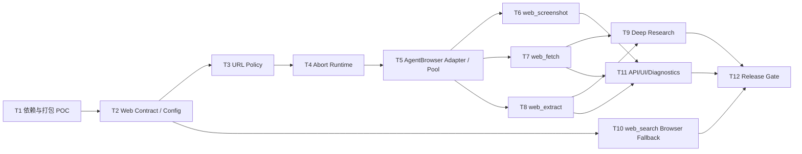

# Mastra AgentBrowser Web Tools 逐文件实施计划

> 文档编号：002  
> 文档版本：v1.1  
> 状态：可实施计划  
> 日期：2026-08-03  
> 前置方案：[001-mastra-agent-browser-web-tools-analysis-v1.1.md](001-mastra-agent-browser-web-tools-analysis-v1.1.md)  
> 关联治理计划：[004-tools-platform-implementation-plan-v1.1.md](004-tools-platform-implementation-plan-v1.1.md)

## 1. 交付原则

本计划只为现有四个 Web Tool 增加受控的 AgentBrowser 后端。不会新增面向模型的 `browser_*` 原始工具，也不会破坏现有四个 Tool ID。

实现顺序必须遵守以下依赖：



约束：

- 每个任务单独提交、单独验证；不要把依赖探针、安全治理和所有工具改动混在一个 PR。
- 现有用户未提交变更不可被回退。
- Web Provider 的新增字段必须向后兼容；既有主输出字段保持稳定。
- 所有新测试优先使用本地 HTTP fixture 或 mock，不把公网网页作为单元测试依赖。
- URL Policy、取消和审计设计应与 [004-tools-platform-implementation-plan-v1.1.md](004-tools-platform-implementation-plan-v1.1.md) 的平台治理任务合并实施，避免重复实现。

## 2. 任务总览

| ID | 任务 | 主要交付 | 依赖 |
|---|---|---|---|
| T1 | 依赖、浏览器二进制和 Electron 打包 POC | 可验证的 AgentBrowser 运行方式 | 无 |
| T2 | Web Contract、配置和 Provider Router 骨架 | 稳定内部接口与 feature flag | T1 |
| T3 | 统一 URL Policy 与浏览器网络守卫 | Web Tools 的 SSRF 防护 | T2 |
| T4 | Tool Runtime 的 AbortSignal 传播 | 超时真正停止网络和浏览器任务 | T2 |
| T5 | AgentBrowser Adapter 与资源池 | 受控加载、导航、截图能力 | T1-T4 |
| T6 | 实现 `web_screenshot` | 真实、可控的截图 artifact | T5 |
| T7 | `web_fetch` 浏览器回退 | 静态优先的 JS 页面获取 | T3-T5 |
| T8 | `web_extract` 浏览器回退 | 与 fetch 一致的渲染与抽取 | T3-T5 |
| T9 | Deep Research 浏览器重试策略 | 有预算的内容获取增强 | T7-T8 |
| T10 | `web_search` 受开关浏览器回退 | 非默认的 SERP 最后回退 | T3-T5 |
| T11 | Tool API、目录、UI 与审计诊断 | 可见的可用性与可解释结果 | T6-T10 |
| T12 | 全量验证、性能基线和发布门禁 | 可上线/可回滚的证据包 | T6-T11 |

## T1. 依赖、浏览器二进制和 Electron 打包 POC

### 实现目标和功能

锁定 `@mastra/agent-browser` 的可用版本，验证它能在本项目当前的 `@mastra/core`、Node 22 和 Windows Electron 环境中：

- 本地启动 Chromium，或连接到受控 CDP 浏览器；
- 打开本地 fixture 页面；
- 取得渲染后的页面状态；
- 产生截图；
- 在打包后的安装包中运行。

本任务只解决“依赖是否可运行、采用何种调用方式”，不修改现有四个 Tool executor 的业务路由。

### 改动涉及文件、函数和 API

| 动作 | 文件 | 函数 / API / 改动 |
|---|---|---|
| 修改 | `package.json` | 增加锁定版本的 `@mastra/agent-browser`；不升级无关 Mastra 包 |
| 修改 | `package-lock.json` 或现用 lockfile | 由包管理器生成的确定性依赖树 |
| 修改 | `package.json` 的 `build.asarUnpack` | 根据真实打包 POC，加入 AgentBrowser、Playwright runtime 和必要浏览器文件的解包规则 |
| 新增 | `scripts/verify-agent-browser-poc.ts` | CLI 探针：本地 fixture 导航、读取结果、截图、错误分类；退出码可供 CI 使用 |
| 新增 | `src/server/tools/web/__fixtures__/agent-browser-page.html` | 无外网依赖的 JS 水合 fixture |
| 新增 | `src/server/tools/web/agent-browser-poc.test.ts` | 仅在显式环境变量下运行的集成测试，默认跳过本地浏览器启动 |
| 新增或修改 | `docs/tools/agent-browser-poc-results.md` | 记录锁定版本、安装方式、Windows 和打包结果；此文件是实施证据，不写密钥或本机路径 |

POC 必须实际调用 AgentBrowser 当前版本支持的公开 API。若 SDK 只提供 Agent 工具包装层，POC 要验证可否在不向 Chat Agent 暴露原始工具的前提下由适配器调用；不得用未文档化私有字段作为生产依赖。

### 边界和约束

- 不接受“TypeScript 可编译”作为浏览器可用证据。
- 不下载、提交或分发用户机器上的 Chromium cache。
- 不把 `headless: false` 作为生产默认；它仅用于调试探针。
- 若本地 Chromium 无法可靠打包，记录 CDP 模式作为备选，但不自动连接任意远程 URL。
- POC 的本地 fixture 服务器只能监听 loopback；它只用于测试，生产 URL Policy 仍须拒绝 loopback。

### 测试和验证

1. `npm install` 后运行 `tsx scripts/verify-agent-browser-poc.ts`。
2. 在开发模式下验证 fixture 的 JS 内容与 PNG 截图。
3. 构建 Electron 包，在安装包内执行同样探针或由测试窗口触发。
4. 验证缺少 Chromium 时返回可识别错误，不把错误吞掉。
5. 运行 `npm run typecheck`。

### 验收的证据

- `agent-browser-poc-results.md` 记录开发与打包环境的版本、命令、通过结果和已知限制。
- 一张来自 fixture 的截图 artifact，及其尺寸、字节数。
- CI 或本地命令的成功输出摘要。
- `git diff --check` 通过。

### Done when

- [ ] `@mastra/agent-browser` 已锁定并与现有 Mastra runtime 无 peer dependency 冲突。
- [ ] 已确认并记录生产调用方式（本地 Chromium 或受控 CDP）。
- [ ] 开发与 Electron 打包环境都能打开 fixture 并生成截图。
- [ ] 依赖缺失时能映射为稳定错误，而不是 silent fallback。
- [ ] 不需要修改任何现有 `web_*` Tool ID。

### 依赖与回滚

依赖：无。  
回滚：移除依赖和 POC 文件；因为本任务尚未切换 Tool 路由，不影响当前用户功能。

## T2. Web Contract、配置和 Provider Router 骨架

### 实现目标和功能

建立 Web Provider 的唯一内部契约、配置读取与路由决策位置，使之后的静态 HTTP、遗留 Playwright 和 AgentBrowser 实现可以互换。工具对外输入/输出维持兼容，Provider 选择不由模型自由控制。

### 改动涉及文件、函数和 API

| 动作 | 文件 | 函数 / API / 改动 |
|---|---|---|
| 新增 | `src/server/tools/web/contracts.ts` | `WebPageLoadRequest`、`WebLoadedPage`、`WebProviderAvailability`、`WebExecutionDiagnostics`、`WebPageProvider`、`WebSearchProvider` |
| 新增 | `src/server/tools/web/config.ts` | `webBrowserConfigSchema`、`getWebBrowserConfig()`、`getWebRoutingPolicy()`；集中读取环境 / 应用配置 |
| 新增 | `src/server/tools/web/provider-router.ts` | `createWebPageProviderRouter()`、`loadPageWithProviders()`、回退资格和 attempt 诊断 |
| 新增 | `src/server/tools/web/provider-router.test.ts` | Provider 优先级、回退、禁止浏览器、已有静态结果保留测试 |
| 修改 | `src/server/tools/utils/render.ts` | 仅保留为 `playwright_legacy` 适配层或迁入 `src/server/tools/web/playwright-legacy-provider.ts`；禁止继续承载总路由决策 |
| 修改 | `src/server/tools/types.ts` | 给 `ToolExecutionContext` 预留 `signal`、`requestId`、可选 `webPolicy` 的类型入口；实际 signal 传播在 T4 完成 |
| 修改 | `src/server/config/config.ts` 或当前配置读取文件 | 若 `readConfigValue()` 所在配置层只支持单键读取，增加类型化配置加载所需的最小 API |
| 新增 | `.env.example` 或现有配置示例文件 | 增加不含凭证的 Browser 配置说明和默认安全值 |

建议的内部 API：

```ts
export type WebProviderId = 'static_http' | 'playwright_legacy' | 'agent_browser'

export type WebRoutingPreference = 'auto' | 'static' | 'browser'

export interface WebLoadedPage {
  html: string
  finalUrl: string
  status: number
  charset: string
  rendered: boolean
  provider: WebProviderId
  diagnostics: WebExecutionDiagnostics
}
```

### 边界和约束

- 不删除 `loadPage()` 的所有兼容入口；先让其委托 Router，避免一次修改所有调用方。
- 首期不在公开 Tool input 加 `provider` 或 `browser` 任意配置字段。
- 默认 `enabled=false`、`fetchStrategy=static-first`、`allowSearchFallback=false`。
- Router 只能执行一次浏览器回退；不允许 Provider 之间循环调用。
- 配置解析失败必须降级为安全默认值并记录配置错误，不得隐式开启浏览器。

### 测试和验证

1. 对 `webBrowserConfigSchema` 覆盖默认值、非法枚举、无效 CDP URL、并发上限。
2. Router mock 三个 Provider，覆盖静态成功、静态内容过薄、浏览器不可用、浏览器失败、强制静态、强制浏览器。
3. 验证已有有效静态内容不会因浏览器失败变成空结果。
4. `npm run typecheck` 与相关 Vitest 测试。

### 验收的证据

- Contract 文件被 `web_fetch` / `web_extract` 的兼容加载入口引用。
- Router 测试输出显示每条分支只执行预期 Provider 次数。
- 关闭开关时所有 Web Page 路径仍只走静态 / 遗留行为。

### Done when

- [ ] Provider 接口、结果对象和诊断对象只有一个定义来源。
- [ ] 配置具有严格 schema 和安全默认值。
- [ ] Router 能解释“为何尝试、为何跳过、为何回退”。
- [ ] 现有工具调用不因新增配置字段而改变请求格式。

### 依赖与回滚

依赖：T1。  
回滚：将 Router 默认 Provider 固定为 `static_http`；保留契约不影响对外 API。

## T3. 统一 URL Policy 与浏览器网络守卫

### 实现目标和功能

消除常规 Web Tool 与 Deep Research 的 SSRF 防护差异。所有 URL 进入静态请求、重定向、AgentBrowser 主导航和子资源请求前都必须经过同一策略。

### 改动涉及文件、函数和 API

| 动作 | 文件 | 函数 / API / 改动 |
|---|---|---|
| 新增 | `src/server/tools/web/url-policy.ts` | `UrlPolicy`、`validateInitialUrl()`、`validateRedirectUrl()`、`assertPublicHost()`、`isPublicAddress()`、`createBrowserRequestGuard()` |
| 新增 | `src/server/tools/web/url-policy.test.ts` | IPv4、IPv6、DNS rebinding、credential URL、redirect、资源请求的测试 |
| 修改 | `src/server/tools/utils/html.ts` | `fetchPage()` / `requestOnce()` 接受 `signal` 和 `urlPolicy`；将 redirect 处理改为手动逐跳校验；流式读取执行 maxBytes |
| 修改 | `src/server/tools/utils/render.ts` 或 `src/server/tools/web/playwright-legacy-provider.ts` | `renderPage()` / `navigate()` 添加 request route 守卫和每次导航后的 final URL 校验 |
| 修改 | `src/server/services/deepresearch/content-service.ts` | 用共享 `UrlPolicy` 替换或委托 `assertSafeResearchUrl()`、`assertPublicResearchHost()`、`validatePublicResearchUrl()`；保留研究域错误码映射 |
| 修改 | `src/server/tools/web-search.ts` | 对搜索 API endpoint 固定配置进行安全断言；对返回结果 URL 只做显示前规范化，不主动抓取 |
| 修改 | `src/server/tools/web-fetch.ts`、`src/server/tools/web-extract.ts`、`src/server/tools/web-screenshot.ts` | 进入 Router 前校验用户 URL，统一映射 `WEB_URL_UNSAFE` |

推荐对静态请求使用 `redirect: 'manual'`，每跳解析 `Location`、校验后再发起下一次请求；最大 redirect 数必须有限，例如 5。

### 边界和约束

- 只允许 credential-free `http:` / `https:`。
- 拒绝 localhost、.localhost、loopback、private、CGNAT、link-local、multicast、unspecified、IPv4-mapped IPv6。
- 域名若 DNS 解析为空、失败或任何地址不安全，默认拒绝。
- URL Policy 不把 URL query、Cookie 或 DNS 结果完整写入审计日志。
- 浏览器 request guard 不得以“加载成功率”为理由放开私网资源。
- fixture server 的 loopback 例外仅存在于注入的测试 policy，不存在于生产 policy。

### 测试和验证

1. 对 `127.0.0.1`、`::1`、`10.0.0.0/8`、`172.16.0.0/12`、`192.168.0.0/16`、`169.254.0.0/16`、`100.64.0.0/10`、`fc00::/7`、`fe80::/10`、IPv4-mapped IPv6 写单元测试。
2. Mock DNS：混合公共 / 私有 A 记录必须拒绝。
3. 本地 HTTP fixture 模拟 HTTP 302 跳转到私网；确认不发起第二次请求。
4. AgentBrowser 集成测试中让页面请求一个私网子资源；确认 route 阻断且工具不暴露私网响应。
5. 运行现有 Deep Research 内容服务测试，确认研究的 `RESEARCH_UNSAFE_URL` 语义保持。

### 验收的证据

- URL Policy 单测覆盖矩阵与通过结果。
- 浏览器 request guard 的阻断计数记录。
- 静态 redirect 测试证明私网第二跳未发生。
- Deep Research 和普通 chat Web Tool 使用同一个 policy 模块。

### Done when

- [ ] 四个 Web Tool 都不能访问不安全初始 URL。
- [ ] 静态与浏览器重定向都无法绕过策略。
- [ ] 浏览器子资源同样受网络守卫约束。
- [ ] `content-service.ts` 不再维护一套独立的 IP 分类实现。
- [ ] 超大响应改为流式中断而不是 `arrayBuffer()` 后截断。

### 依赖与回滚

依赖：T2。  
回滚：安全策略不可整体回滚；若误伤某公开站点，只能通过经过评审的 public-host 兼容规则修复，不能允许私网范围。

## T4. Tool Runtime 的 AbortSignal 传播与取消语义

### 实现目标和功能

把当前 `Promise.race()` 的“表面超时”改为“底层任务真实取消”。这对 AgentBrowser 的 page/context 生命周期是前置条件。

### 改动涉及文件、函数和 API

| 动作 | 文件 | 函数 / API / 改动 |
|---|---|---|
| 修改 | `src/server/tools/types.ts` | `ToolExecutionContext` 增加 `signal: AbortSignal`、`requestId?: string`；统一 executor 的取消入口 |
| 修改 | `src/server/tools/execute-tool.ts` | `executeToolInternal()` 接收可选上游 signal；创建 `AbortController`；超时、上游 abort、完成后清理 listener；状态和错误码映射 |
| 修改 | `src/server/skills/policy/capability-broker.ts` | `CapabilityRequest` 和 `executeLegacyToolCapability()` 接收 / 传递 `signal`；把 signal 传给 `executeToolInternal()` |
| 修改 | `src/server/services/tool.service.ts` | HTTP request disconnect 时取得 request signal 并传递；不再接受伪造取消状态 |
| 修改 | `src/server/http/routes/tools.ts` | 将 Hono request abort 信号绑定到服务调用，按现有框架实际 API 实现 |
| 修改 | `src/server/tools/utils/html.ts` | `fetchPage()` / `requestOnce()` 合并 timeout 与上游 signal |
| 修改 | `src/server/tools/web-search.ts` | Tavily / DuckDuckGo 请求使用 context signal |
| 修改 | `src/server/tools/utils/render.ts` 或新 Provider | navigation、wait、screenshot、队列获取时响应 abort |
| 新增 | `src/server/tools/execute-tool.test.ts` | timeout、上游 abort、一次完成、运行记录状态测试 |
| 修改 | `src/server/skills/policy/capability-broker.test.ts` | 验证 signal 能到 executor，timeout 后 executor 观察到 aborted |

需要定义统一运行错误：

```ts
type ToolRunFailureKind = 'timeout' | 'cancelled' | 'failed'
```

若当前数据库 `tool_runs` 只有 success / failed，先将 timeout / cancelled 编码为结构化错误 metadata；数据库状态扩展应与平台治理迁移一起进行，避免在此任务中临时改写历史数据。

### 边界和约束

- 任何 executor 都不得忽略 `context.signal` 后继续写 artifact。
- 不要在 abort 后把同一 run 标记为 success。
- timeout 时不要依赖 `setTimeout` 未引用来“自然结束”。
- 上游 signal 已 abort 时，不允许开始排队或启动浏览器。
- 不能通过 catch 所有错误后返回 `{ note: ... }` 伪造成功。

### 测试和验证

1. 编写阻塞 executor；在 timeout 后确认收到 `signal.aborted === true`。
2. 使用可控 fetch mock；确认 signal 传入请求。
3. 使用可控 Browser Provider mock；确认取消调用 `close()` / `release()`。
4. HTTP 客户端中止请求时，服务端 run 记录为 cancelled。
5. 检查成功和失败路径不会残留 timer / event listener。

### 验收的证据

- `execute-tool.test.ts` 显示超时和取消的独立结果。
- Browser Provider mock 的 close / release 调用断言。
- 一次真实长导航被取消后的浏览器进程 / context 数量不增长。

### Done when

- [ ] `ToolExecutionContext` 始终携带 `AbortSignal`。
- [ ] tool timeout 会 abort executor，而不仅仅拒绝外层 Promise。
- [ ] HTTP、Chat、Deep Research 可将上游取消传入 Tool Runtime。
- [ ] timeout、cancelled、failed 在审计和调用方语义上可区分。

### 依赖与回滚

依赖：T2。  
回滚：保留新增 signal 字段；若某非 Web executor 尚未适配，先让其安全忽略 signal，但 Web 和子进程类 executor 不可豁免。

## T5. AgentBrowser Adapter、会话池与运行时诊断

### 实现目标和功能

在不改变外部 Tool ID 的前提下，提供一个可被 Provider Router 调用的 AgentBrowser Adapter。Adapter 负责启动 / 连接浏览器、创建隔离上下文、受控导航、读取渲染后的 HTML、截图、清理资源，并输出不含敏感正文的诊断。

### 改动涉及文件、函数和 API

| 动作 | 文件 | 函数 / API / 改动 |
|---|---|---|
| 新增 | `src/server/tools/web/agent-browser-provider.ts` | `AgentBrowserPageProvider implements WebPageProvider`；`load()`、`captureScreenshot()`、`isAvailable()`、错误映射 |
| 新增 | `src/server/tools/web/browser-session-pool.ts` | `BrowserSessionPool`、`acquire(signal)`、`release()`、`close()`、队列超时、idle close |
| 新增 | `src/server/tools/web/browser-errors.ts` | `WebBrowserError`、稳定错误码和用户安全错误消息 |
| 新增 | `src/server/tools/web/browser-diagnostics.ts` | `createAttempt()`、`redactBrowserError()`、blocked request 计数 |
| 新增 | `src/server/tools/web/agent-browser-provider.test.ts` | SDK boundary mock、HTML、截图、abort、错误映射测试 |
| 新增 | `src/server/tools/web/browser-session-pool.test.ts` | 最大并发、排队、abort、idle close、shutdown 测试 |
| 修改 | `src/server/tools/web/provider-router.ts` | 注册 AgentBrowser Provider，仅在 config enabled 且 availability 为 available 时使用 |
| 修改 | `src/server/tools/utils/render.ts` | 标记为遗留 Provider；不再直接被 `web_fetch` / `web_extract` 调用 |
| 修改 | `src/server/index.ts` 或服务端生命周期入口 | 应用退出时调用 `closeWebBrowserRuntime()`，停止接收新任务并关闭池 |

Adapter 的内部操作应包含：

```ts
load(request, context) => {
  // acquire pool slot -> create isolated context/page -> install UrlPolicy guard
  // navigate -> optional bounded wait -> read final DOM HTML -> release / close
}

captureScreenshot(request, context) => {
  // same guard and lifecycle -> bounded screenshot -> return bytes + dimensions
}
```

### 边界和约束

- 每次 Tool 调用使用独立无持久化 Browser Context；禁止复用用户浏览器 profile、Cookie 或 localStorage。
- 默认 `maxContexts=2`，每个 context 只有一个 page。
- context 获取等待必须响应 `AbortSignal`，并计入总 timeout。
- `load()` 不执行任意 click / type / evaluate；Cookie banner 等交互留在将来的显式、受白名单策略中。
- 只允许受控的 wait strategy：`domcontentloaded`、有限 `networkidle`、可配置选择器；不允许无限等待。
- 不把 AgentBrowser 私有 API 或未文档化对象泄漏到其他模块。

### 测试和验证

1. 使用 SDK mock 验证配置、导航、HTML 返回、截图调用和资源释放。
2. 池测试：并发 3 次但配置为 2 时，第三次排队；取消第三次后不启动 page。
3. 导航失败、浏览器缺失、队列超时均映射稳定错误码。
4. 每次调用结束后 Context / Page 关闭，浏览器可按 idle timeout 复用或关闭。
5. POC fixture 集成测试确认 HTML 是 JS 执行后的 DOM。

### 验收的证据

- 池测试证明任何时间的 active context 不超过配置。
- fixture 的返回 HTML 包含仅由 JS 注入的文本。
- 取消测试证明 page/context release 被调用。
- 诊断对象只含 Provider、耗时、策略和计数，不含 Cookie / HTML。

### Done when

- [ ] AgentBrowser 只存在于 Adapter 层，未直接注册给 Chat Agent。
- [ ] Adapter 有稳定 availability 与错误码。
- [ ] 浏览器生命周期可以复用且可在 shutdown 时完全关闭。
- [ ] URL guard 与 AbortSignal 在导航和截图路径均生效。
- [ ] 并发、排队、idle 和取消全部有自动化测试。

### 依赖与回滚

依赖：T1、T2、T3、T4。  
回滚：配置 `WEB_BROWSER_ENABLED=false` 或 `provider=disabled`；Router 不会选择 Adapter。

## T6. 实现 `web_screenshot`

### 实现目标和功能

将当前占位的 `web_screenshot` 替换为真实截图能力。输出受控本地 artifact，并保留 Tool 平台权限、取消、审计和 URL 安全。

### 改动涉及文件、函数和 API

| 动作 | 文件 | 函数 / API / 改动 |
|---|---|---|
| 修改 | `src/server/tools/web-screenshot.ts` | 导出严格 input / output 类型；调用 `AgentBrowserPageProvider.captureScreenshot()`；写入受控 artifact |
| 新增 | `src/server/tools/web/screenshot-artifacts.ts` | `createScreenshotArtifactPath()`、`writeScreenshotArtifact()`、`enforceScreenshotLimits()`、`pruneScreenshotArtifacts()` |
| 新增 | `src/server/tools/web-screenshot.test.ts` | 成功、文件路径、格式、像素/字节上限、abort、Provider 不可用 |
| 修改 | `src/server/tools/registry.ts` | 保持 `web_screenshot` 注册 ID 不变；必要时增加 availability 读取 |
| 修改 | `src/server/db/client.ts` | 更新内置 Tool input / output schema 和说明；截图未可用前仍默认禁用，真实可用后不自动替用户开启 |
| 修改 | `src/server/tools/availability.ts`（若平台治理任务已创建） | `web_screenshot` 依据 config、浏览器二进制和写入目录返回 available / dependency_missing / configuration_missing |
| 修改 | `src/server/skills/policy/capability-broker.ts` | 保持现有 `web_screenshot` timeout 覆盖；接入新的 availability 守卫 |
| 新增 | `src/server/tools/web/__fixtures__/tall-page.html` | 用于 fullPage、最大高度和截断策略测试 |

建议的输入 / 输出：

```ts
type WebScreenshotInput = {
  url: string
  fullPage?: boolean
  viewport?: { width: number; height: number }
  format?: 'png' | 'jpeg'
  quality?: number
  timeoutMs?: number
}

type WebScreenshotOutput = {
  imagePath: string
  finalUrl: string
  width: number
  height: number
  format: 'png' | 'jpeg'
  bytes: number
  provider: 'agent_browser'
}
```

### 边界和约束

- 不接受调用者指定任意 `outputPath`。
- artifact 路径只允许位于应用数据目录下的 `tool-artifacts/web-screenshot/<toolRunId>/`。
- 默认 PNG，JPEG 质量仅在 JPEG 时生效。
- 限制 viewport、最大页面高度、总像素、单个文件字节数和运行历史保留量。
- 超出限制时返回 `WEB_SCREENSHOT_LIMIT_EXCEEDED`，不写半成品。
- Tool Run 审计只保存 artifact 元数据和相对安全路径，不将图片 base64 写入 SQLite。

### 测试和验证

1. fixture 截图返回 PNG，文件存在，读取到的宽高与 output 一致。
2. fullPage=false 使用固定 viewport，fullPage=true 受最大高度约束。
3. 超过像素 / 文件大小的 fixture 返回稳定限制错误。
4. abort 期间不留下临时文件。
5. 无浏览器二进制 / config disabled 时 Tool availability 与 executor 错误一致。

### 验收的证据

- 成功 fixture 截图文件及元数据。
- 测试证明 artifact 绝对路径位于受控目录。
- 失败 / abort 后目录没有孤立临时文件。
- Tools UI 能显示 unavailable 原因或成功 artifact 路径。

### Done when

- [ ] `web_screenshot` 不再返回占位 `note`。
- [ ] 截图使用 AgentBrowser Provider 并经过 URL guard。
- [ ] artifact、像素和容量边界可验证。
- [ ] 在开发和打包 Electron 环境均完成真实截图。
- [ ] 未配置依赖时工具不会伪装为可用。

### 依赖与回滚

依赖：T5，以及平台可用性治理任务。  
回滚：将 `web_screenshot` 设为 disabled / dependency_missing；不要恢复“成功 note”占位实现。

## T7. `web_fetch` 静态优先的 AgentBrowser 回退

### 实现目标和功能

增强 `web_fetch`：普通页面维持静态 HTTP 的低开销路径，内容过薄或可重试失败时可用 AgentBrowser 获取 JS 渲染后的 DOM。

### 改动涉及文件、函数和 API

| 动作 | 文件 | 函数 / API / 改动 |
|---|---|---|
| 修改 | `src/server/tools/web-fetch.ts` | `webFetchTool(input, context)` 改为通过 `loadPageWithProviders()`；输出增加 provider / diagnostics（可选） |
| 修改 | `src/server/tools/web/provider-router.ts` | 实现 `shouldAttemptBrowserFallback()`：薄内容、SPA 壳、特定可重试错误、render 语义 |
| 修改 | `src/server/tools/utils/html.ts` | `fetchPage()` 输出 contentType、流式 size / truncation 诊断；接受 signal 与 policy |
| 修改 | `src/server/tools/utils/render.ts` | 调整为兼容 Provider，不再被 `web-fetch.ts` 直接 import |
| 修改 | `src/server/db/client.ts` | 更新 `web_fetch` 描述和 schema 中的渲染语义，兼容原字段 |
| 修改 | `src/server/tools/web-fetch.test.ts` | 迁移现有测试，并增加 Router / Provider 回退断言 |
| 新增 | `src/server/tools/web/__fixtures__/spa-page.html` | 静态壳加 JS 注入正文的 fixture |

接口兼容要求：

- 保留 `mode`、`maxChars`、`render`、`timeoutMs`。
- `render: false` 必须只调用静态 Provider。
- `render: true` 必须请求 Browser Provider；不可用时返回 `WEB_BROWSER_UNAVAILABLE` / `WEB_BROWSER_DISABLED`。
- `render` 未传时采用自动策略。
- `title`、`content`、`url`、`finalUrl`、`status`、`charset`、`truncated`、`rendered` 字段保持。

### 边界和约束

- 浏览器回退最多一次。
- Browser 返回内容较静态正文更短、质量更差时，保留静态结果并在 diagnostics 标记 browser attempt。
- 不将浏览器用于 `mode: 'html'` 的任意二进制 / 非 HTML 响应。
- `maxChars` 是结果字符上限；页面下载字节上限由 HTTP / Browser 独立策略控制。
- 不把“403”自动解释为允许绕过站点防护的信号。

### 测试和验证

1. 普通静态 fixture：只调用 static Provider，`rendered=false`。
2. SPA fixture：静态正文小于阈值，调用 AgentBrowser，返回 JS 注入内容，`rendered=true`。
3. `render:false` 的 SPA：不调用浏览器。
4. `render:true` 无浏览器：返回稳定错误。
5. Browser 失败但静态正文有效：返回静态正文且 diagnostics 有 failed browser attempt。
6. 结果截断、charset、finalUrl 和既有 title / description 测试不回归。

### 验收的证据

- Provider mock 调用次数断言。
- SPA fixture 的静态 / 渲染对照结果。
- 现有 `web-fetch` 单元测试和新增回退测试均通过。
- 指标日志可区分 `static_http` 与 `agent_browser`。

### Done when

- [ ] `web_fetch` 不再直接调用旧 `loadPage()` 中的隐式渲染逻辑。
- [ ] 旧输入保持可用，`render` 三种语义可测试。
- [ ] 自动模式只在明确条件下启动浏览器。
- [ ] 静态成功内容不会因浏览器失败丢失。
- [ ] 取消、URL Policy、并发池和诊断贯通。

### 依赖与回滚

依赖：T3、T4、T5。  
回滚：配置 `WEB_BROWSER_ENABLED=false`，Router 自动退回 static Provider；不回退输入 / 输出字段。

## T8. `web_extract` 与 `web_fetch` 一致的浏览器回退

### 实现目标和功能

让 `web_extract` 与 `web_fetch` 共用加载路由和最终 DOM 语义，以提升 JS 页面上的标题、正文、链接和 metadata 抽取结果，同时避免两套渲染策略漂移。

### 改动涉及文件、函数和 API

| 动作 | 文件 | 函数 / API / 改动 |
|---|---|---|
| 修改 | `src/server/tools/web-extract.ts` | `webExtractTool(input, context)` 调用 `loadPageWithProviders()`；输出补充 provider / diagnostics（可选） |
| 修改 | `src/server/tools/web-fetch.ts` | 抽出公用 `buildReadableContent()`，仅当确有重复时复用；否则保持当前文件内逻辑 |
| 修改 | `src/server/tools/utils/html.ts` | 保留 `extractMainHtml()`、`htmlToText()` 等纯抽取 API；不要将 Provider 逻辑混入提取器 |
| 新增 | `src/server/tools/web/extraction-quality.ts` | 可选：`scoreReadableContent()`，为“浏览器结果是否优于静态结果”提供可测试评分 |
| 修改 | `src/server/tools/web-extract.test.ts` | 标题、heading、links、canonical、byline、publishedAt 以及浏览器回退测试 |
| 修改 | `src/server/db/client.ts` | 更新 `web_extract` 文案但保留已有 input / output 主字段 |

### 边界和约束

- 不在本任务重写 HTML 解析算法；当前正则抽取器的替换应另立任务。
- `maxLinks`、`maxChars`、`render`、`timeoutMs` 的兼容性必须保持。
- Link 解析仍需过滤 `javascript:`、`mailto:`、fragment；未来 link follow 必须再次经过 URL Policy。
- 不把完整原始 HTML、Cookie 或页面脚本放到 `tool_runs`。
- Browser DOM 与 static HTML 的输出字段必须一致，区别仅由 `rendered` / provider diagnostics 表示。

### 测试和验证

1. SPA fixture：静态结果空或过薄，浏览器 DOM 中的 title、heading、link、text 被提取。
2. 静态文章：不启动浏览器。
3. Browser DOM 中的相对链接会以 final URL 正确解析。
4. `render:false` 不启动浏览器；`render:true` 按 T7 语义处理。
5. `maxChars`、`maxLinks`、canonical URL 和 metadata 既有测试不回归。

### 验收的证据

- 相同 fixture 上的 static 与 rendered 抽取结果对照。
- 抽取测试显示文本、标题、链接和 metadata 的稳定结果。
- 代码中 `web_fetch` 与 `web_extract` 只通过 Router 获取页面，不存在两套独立浏览器启动逻辑。

### Done when

- [ ] `web_extract` 使用与 `web_fetch` 相同的 Provider Router。
- [ ] JS 页面可抽取出渲染后的结构化内容。
- [ ] 现有 metadata 和链接行为无回归。
- [ ] 质量判断和结果选择有可测试理由。

### 依赖与回滚

依赖：T3、T4、T5。  
回滚：关闭浏览器配置，提取器继续处理 static HTTP 返回的 HTML。

## T9. Deep Research 的受预算浏览器重试策略

### 实现目标和功能

在 Deep Research 工作流中针对“静态抓取没有可读内容”的来源启用有限浏览器重试，提升研究来源的内容可得性，同时遵守研究时限和浏览器池预算。

### 改动涉及文件、函数和 API

| 动作 | 文件 | 函数 / API / 改动 |
|---|---|---|
| 修改 | `src/server/services/deepresearch/content-service.ts` | `fetchOne()` 的 `web_fetch` / `web_extract` 调用携带内部浏览器回退策略；根据结果诊断决定是否二次调用，不靠错误字符串猜测 |
| 新增 | `src/server/services/deepresearch/browser-retry-policy.ts` | `shouldRetryWithBrowser()`、`consumeBrowserRetryBudget()`、研究来源级最多一次的策略 |
| 修改 | `src/server/deepresearch/domain/budgets.ts` | `ResearchBudgetDto` 增加 `maxBrowserFetches` 或 `browserFetchConcurrency`；为 standard/deep/exhaustive 给出较低额度 |
| 修改 | `src/shared/deepresearch/contracts.ts` 或预算 DTO 定义文件 | 若 `ResearchBudgetDto` 在 shared contracts 定义，增加新字段并保持序列化兼容 |
| 修改 | `src/server/services/deepresearch/content-service.test.ts` 或相应测试文件 | 静态成功、薄内容浏览器重试、预算耗尽、取消、URL 拒绝测试 |
| 修改 | `src/server/services/deepresearch/retrieval.test.ts` | 工作流工具调用参数与事件记录断言 |
| 修改 | `src/server/deepresearch/domain/source-content.ts` | 如已有可判定的“内容过薄 / 解析拒绝”诊断，导出稳定类型给 retry policy 使用 |

推荐预算起点：

| 深度 | `fetchConcurrency` | 建议 `browserFetchConcurrency` | 建议 `maxBrowserFetches` |
|---|---:|---:|---:|
| standard | 3 | 1 | 3 |
| deep | 5 | 2 | 8 |
| exhaustive | 6 | 2 | 16 |

### 边界和约束

- 不因任意 fetch 错误自动启动浏览器；只针对薄内容、JS 壳或可重试网页加载失败。
- 每个 source 最多一次 Browser retry。
- 浏览器重试不得绕过 `deadlineAt`、研究取消或共享 URL Policy。
- Browser retry 失败不能覆盖原始静态错误和原始有效内容。
- 研究事件只记录 provider、retry 原因代码、耗时和结果，不保存完整网页。

### 测试和验证

1. 静态正文正常：只调用一次 `web_fetch` / `web_extract`，无 browser retry。
2. 薄内容：按策略发起一次 browser retry，生成 source snapshot。
3. 预算耗尽：不发起 browser retry，返回可解释的原始失败。
4. 取消和 deadline：不再入队浏览器。
5. 不安全 URL：在任何 retry 前被拒绝。

### 验收的证据

- Deep Research 事件包含 `provider`、`retryReason`、`browserRetryUsed`。
- 并发测试证明无法超过 Browser pool / 研究预算。
- 各研究深度的新增预算有单元测试快照或断言。

### Done when

- [ ] Deep Research 仅对符合条件的来源尝试浏览器。
- [ ] 每个来源最多一次，整次研究受独立额度限制。
- [ ] 取消、deadline、URL Policy 与 Tool Runtime signal 完整传递。
- [ ] 浏览器结果改善内容时能被 snapshot 使用，失败时保留原始诊断。

### 依赖与回滚

依赖：T7、T8。  
回滚：将 `maxBrowserFetches=0` 或 feature flag 关闭；研究恢复原静态路径。

## T10. `web_search` 的受开关 AgentBrowser SERP 回退

### 实现目标和功能

在 Tavily 和 DuckDuckGo 都无可用结果或 Provider 级失败时，提供一个极受限的浏览器 SERP 回退。该任务优先级低于页面获取和截图，不应阻塞 T6-T9。

### 改动涉及文件、函数和 API

| 动作 | 文件 | 函数 / API / 改动 |
|---|---|---|
| 新增 | `src/server/tools/web/agent-browser-search-provider.ts` | `AgentBrowserSearchProvider implements WebSearchProvider`；固定允许 SERP host、导航、结果抽取、错误映射 |
| 修改 | `src/server/tools/web-search.ts` | `webSearchTool(input, context)` 委托 Search Router；保留 Tavily -> DuckDuckGo 顺序 |
| 新增 | `src/server/tools/web/search-provider-router.ts` | `searchWithProviders()`、Feature flag、每次调用最多一个 SERP attempt |
| 修改 | `src/server/tools/web/config.ts` | `allowSearchFallback`、`allowedSearchHosts`、地区 / 语言配置、全局并发 1 |
| 新增 | `src/server/tools/web-search.browser.test.ts` | 通过 fixture / adapter mock 验证启用、关闭、验证码、DOM 改变、URL 过滤 |
| 修改 | `src/server/tools/web-search.test.ts` | 保护现有 Tavily / DuckDuckGo 结果与回退测试 |
| 修改 | `src/server/db/client.ts` | 更新描述，说明返回 Provider 来源而非承诺每次都访问 SERP |

建议 Search Provider 输出扩展：

```ts
type WebSearchOutput = {
  query: string
  total: number
  results: Array<{ title: string; url: string; snippet: string }>
  provider: 'tavily' | 'duckduckgo' | 'agent_browser_serp'
  fallbackFrom?: 'tavily' | 'duckduckgo'
  fallbackReason?: string
  diagnostics?: WebExecutionDiagnostics
}
```

### 边界和约束

- 默认关闭。
- 浏览器搜索并发必须为 1，且单请求返回上限建议为 5。
- 仅允许配置中列出的公开 SERP host；不根据模型输入拼接任意搜索站点。
- 遇到 CAPTCHA、登录墙、robots / 反自动化页面时停止并返回 `WEB_SEARCH_SERP_BLOCKED`；不尝试规避。
- 搜索结果 URL 仅作为候选显示；后续 fetch 仍从 URL Policy 开始。
- 不把用户完整 query、搜索会话 Cookie 或 SERP HTML 写入审计。

### 测试和验证

1. Tavily 成功：AgentBrowser Provider 从不构造 / 调用。
2. Tavily 失败、DuckDuckGo 成功：仍不打开浏览器。
3. 两者失败、开关关闭：稳定返回当前失败形态，无浏览器调用。
4. 两者失败、开关开启：调用一次 Browser SERP，过滤非 HTTP(S) URL，按 limit 截断。
5. CAPTCHA / DOM 无结果：返回稳定 `WEB_SEARCH_SERP_BLOCKED` / 空结果诊断，无重试循环。
6. 并发 2 个 browser search：第二个排队或受限，永不同时执行。

### 验收的证据

- 现有 Tavily / DuckDuckGo 回归测试通过。
- Feature flag 测试证明默认情况下没有浏览器搜索。
- SERP fixture 抽取结果、URL 过滤和限额断言。

### Done when

- [ ] Browser SERP 不会替代 Tavily / DuckDuckGo 的首选位置。
- [ ] 默认关闭，且配置、域名、并发、数量均可证明受限。
- [ ] CAPTCHA / 访问受限页面不会触发规避行为。
- [ ] 搜索输出兼容现有 `results` / `provider` 字段。

### 依赖与回滚

依赖：T3、T4、T5。  
回滚：`WEB_SEARCH_BROWSER_FALLBACK=false`；该功能不会影响主搜索链路。

## T11. Tool API、目录、UI 与审计诊断

### 实现目标和功能

让用户、Agent 和运维可以看见 Web Tool 的真实可用性与执行方式，同时不泄漏页面敏感内容。确保数据库目录、HTTP 手动运行、Tools UI 和 Chat Tool 展示能理解截图 artifact 与 Provider 诊断。

### 改动涉及文件、函数和 API

| 动作 | 文件 | 函数 / API / 改动 |
|---|---|---|
| 修改 | `src/server/db/client.ts` | 更新四个 Web Tool 默认描述、input / output JSON schema、`web_screenshot` 可用性迁移策略 |
| 修改 | `src/server/db/repositories/tool.repo.ts` | `startRun()` / `completeRun()` / `failRun()` 支持受限 diagnostics 摘要、输出大小限制和 redaction；与平台审计整改合并 |
| 修改 | `src/server/services/tool.service.ts` | 输入 schema 校验、返回 availability / diagnostics 摘要；HTTP 不接受任意 Provider 强制字段 |
| 修改 | `src/server/http/routes/tools.ts` | 暴露稳定错误码、artifact 元数据；不直接返回任意本地文件 |
| 修改 | `src/server/mastra/tools.ts` | 从统一 Tool Contract 派生 schema；只暴露 enabled 且 available 的工具 |
| 修改 | `src/server/mastra/json-schema.ts` | 若仍从数据库 schema 生成，增加 string / number 上限与 strict object 支持；优先迁向 Zod contract |
| 修改 | `src/renderer/pages/Tools/tools.store.ts` | 读取 availability、provider、attempt 摘要、artifact metadata |
| 修改 | `src/renderer/pages/Tools/ToolTestRunner.tsx` | 为 screenshot 显示 artifact 预览 / 打开动作；为 fetch/extract 展示 provider 和 fallback 摘要 |
| 修改 | `src/renderer/pages/Tools/ToolDetailPage.tsx` | 展示 dependency_missing / configuration_missing / disabled 原因，禁止不可用工具运行 |
| 修改 | `src/renderer/pages/Chat/parts/tool-part.ts` | 以一行摘要显示 `web_*` Provider、渲染状态和 screenshot artifact，不显示敏感诊断 |
| 新增或修改 | `src/server/tools/availability.ts` | 将 Browser config、依赖探针、可写 artifact 目录合成 Tool availability |
| 新增测试 | `src/server/services/tool.service.web-tools.test.ts` | HTTP input、availability、错误码、审计脱敏测试 |
| 新增测试 | `src/renderer/pages/Tools/ToolTestRunner.test.tsx`（若现有测试基础支持） | 可用性和 screenshot UI 状态 |

### 边界和约束

- 工具目录不得在 AgentBrowser 不可用时显示为“已可用”。
- `tool_runs` 不保存图片 base64、完整 HTML、Cookie、Authorization 或本地绝对敏感路径。
- HTTP API 不提供任意读取 `imagePath` 的文件服务；artifact 浏览必须由受控 Electron / HTTP artifact handler 实现。
- 不允许 renderer 或外部 HTTP body 直接指定 Browser Provider、CDP URL、代理地址或输出路径。
- UI 只显示用户可理解的失败原因和最少诊断，不显示底层堆栈。

### 测试和验证

1. Browser disabled：`GET /tools` / UI 显示不可用原因，Run 按钮不可用。
2. Browser enabled：`web_screenshot` 可运行，返回 artifact 元数据。
3. Tool run 存储：检查 JSON 不含敏感 keys 和过大内容。
4. Chat 一行摘要对 `web_fetch`、`web_extract`、`web_screenshot` 都能正确显示。
5. HTTP 输入越界、非法 viewport、非法 format、非法 URL 均在 executor 前被拒绝。

### 验收的证据

- API contract 测试和 UI 状态截图。
- 一条实际 `tool_runs` 记录的脱敏结构示例。
- screenshot artifact 仅可通过受控路径被 UI 预览。

### Done when

- [ ] Tool 目录、Agent 暴露和真实依赖状态一致。
- [ ] 四个 Web Tool 共享严格输入契约与稳定错误码。
- [ ] Provider 诊断可被用户理解但不泄漏敏感数据。
- [ ] 截图 artifact 在 UI 中可消费且不存在任意本地文件读取通道。

### 依赖与回滚

依赖：T6-T10，且应与现有 Tools 平台可用性 / 审计整改协调。  
回滚：隐藏 Browser diagnostics 并禁用 Browser Provider；保留已有静态工具目录。

## T12. 全量验证、性能基线与发布门禁

### 实现目标和功能

对安全、功能、资源、Electron 打包和可回滚性建立发布证据。完成后才允许把 AgentBrowser 从内部测试配置开放给用户。

### 改动涉及文件、函数和 API

| 动作 | 文件 | 函数 / API / 改动 |
|---|---|---|
| 新增 | `scripts/verify-web-tools-agent-browser.ts` | 串行执行本地 fixture 的 fetch、extract、screenshot、abort、availability 检查 |
| 新增 | `scripts/measure-web-tools-baseline.ts` | 记录 static / browser 两条路径的耗时、成功率、artifact 尺寸和 pool 峰值 |
| 新增 | `docs/tools/agent-browser-release-evidence-v1.1.md` | 填写版本、平台、测试命令、结果、性能与回滚演练证据 |
| 修改 | `.github/workflows/...` 或现有 CI 配置 | 若项目已有 CI，新增 unit / typecheck / package smoke；不在无现有 CI 时凭空引入大型流水线 |
| 修改 | `package.json` | 增加 `test:web-tools-browser`、`verify:web-tools-browser` 等命令，仅在依赖可用时执行 |
| 修改 | `docs/tools/001-mastra-agent-browser-web-tools-analysis-v1.1.md` | POC 结论落地后更新“待确认项”状态，不改写原始决策 |
| 修改 | `docs/tools/002-mastra-agent-browser-web-tools-implementation-plan-v1.1.md` | 标注任务完成状态和真实偏差，不删除未完成风险 |

### 边界和约束

- 性能基线基于本地 fixture 和可控网络，不以不稳定公网网站作唯一判断。
- 正式发布前至少在 Windows 开发环境和 Windows Electron 打包安装包验证；若支持 macOS / Linux，分别补充证据。
- 任何 SSRF、取消残留、任意 artifact 路径写入、打包浏览器不可启动问题均为阻塞发布问题。
- 性能不要求浏览器快于静态 HTTP，但必须证明浏览器只在回退时启动，且资源峰值在配置范围。
- 回滚必须是配置级回滚，不要求卸载依赖或回退数据库。

### 测试和验证

1. 执行 `npm run typecheck`。
2. 执行 Web Tools 全部单元测试、URL Policy、Router、Pool、screenshot、Deep Research 回归测试。
3. 执行 `npm run build`，生成 Electron 安装包并运行 smoke。
4. 执行 `tsx scripts/verify-web-tools-agent-browser.ts`。
5. 用 `scripts/measure-web-tools-baseline.ts` 记录 static 和 browser 的 P50 / P95、成功数、错误分类、最大活跃 context。
6. 演练回滚：将 Browser Provider 关闭，确认 `web_fetch` / `web_extract` 继续静态工作、`web_screenshot` 正确显示 unavailable。
7. 执行 `git diff --check` 和 `git status --short`。

### 验收的证据

- `agent-browser-release-evidence-v1.1.md` 包含命令、版本、平台和结果。
- CI / 本地测试清单通过。
- Electron 安装包截图 artifact 和 JS fixture 抓取结果。
- 性能报告证明浏览器上下文不超过配置上限。
- 配置回滚演练记录。

### Done when

- [ ] 安全、取消、功能、打包、资源与回滚测试均有书面证据。
- [ ] `web_screenshot` 已真实可用，其他工具静态优先且浏览器可控回退。
- [ ] Browser search 仍默认关闭，除非单独批准开启。
- [ ] 发布开关、默认值、已知限制和运维处理方式已写入文档。
- [ ] 没有 P0/P1 Web Tool 安全缺陷被标记为“后续处理”后仍发布。

### 依赖与回滚

依赖：T6-T11。  
回滚：`WEB_BROWSER_ENABLED=false`、`WEB_SEARCH_BROWSER_FALLBACK=false`；保留静态 HTTP、Tavily、DuckDuckGo 路径。

## 3. 建议的提交切分

| 提交 | 包含任务 | 说明 |
|---|---|---|
| PR-1 | T1 | 依赖和打包 POC，先解决可行性 |
| PR-2 | T2、T3、T4 | 共享契约、安全与取消基础；不切流 |
| PR-3 | T5、T6 | 浏览器 Adapter 和真实截图 |
| PR-4 | T7、T8 | fetch / extract 的可控浏览器回退 |
| PR-5 | T9 | Deep Research 预算化接入 |
| PR-6 | T10 | 可选浏览器搜索，默认关闭 |
| PR-7 | T11、T12 | UI、审计、发布证据和门禁 |

每个 PR 都必须包含：

- 任务对应的 `Done when` 勾选情况；
- 测试命令和结果；
- 实际变更与本文档的差异；
- 可执行的回滚步骤；
- 新增环境变量的默认值与安全影响。

## 4. 统一验收清单

- [ ] 对外只有四个稳定 Web Tool ID，AgentBrowser 原始工具未直接进入 Chat Agent。
- [ ] `web_fetch` / `web_extract` 在普通静态页面不启动浏览器，在 JS fixture 上可取得渲染内容。
- [ ] `web_screenshot` 可在受控目录真实生成图片，并执行尺寸、像素、字节与保留限制。
- [ ] Tavily / DuckDuckGo 保持 `web_search` 主路径；Browser SERP 默认关闭、低并发且可解释。
- [ ] 初始 URL、redirect、浏览器导航和子资源均经过统一 SSRF Policy。
- [ ] timeout / cancel 会关闭网络和浏览器工作，而不是只提前返回错误。
- [ ] Deep Research 的浏览器尝试受来源次数、全局并发和 deadline 约束。
- [ ] Tool 目录、HTTP、Chat 与 UI 不把 dependency_missing / disabled 的功能显示为成功。
- [ ] 运行记录不保存 Cookie、完整页面、图片 base64 或未脱敏敏感 URL。
- [ ] 通过配置关闭 Browser Provider 后，现有静态 Web Tools 仍可工作。
