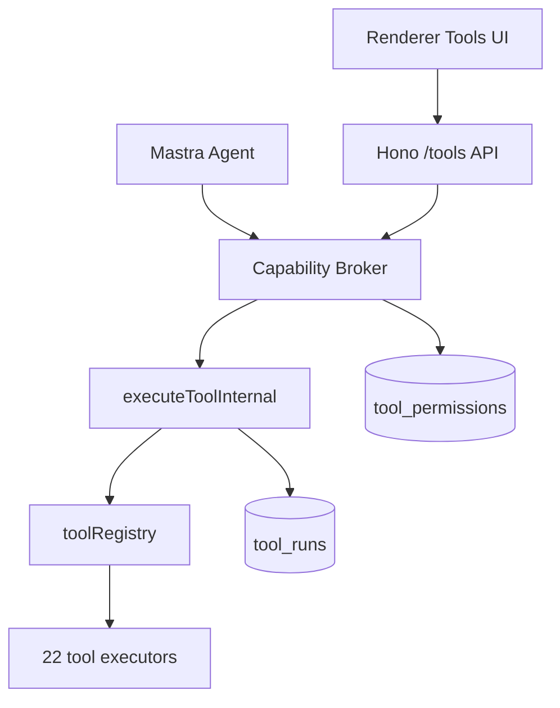
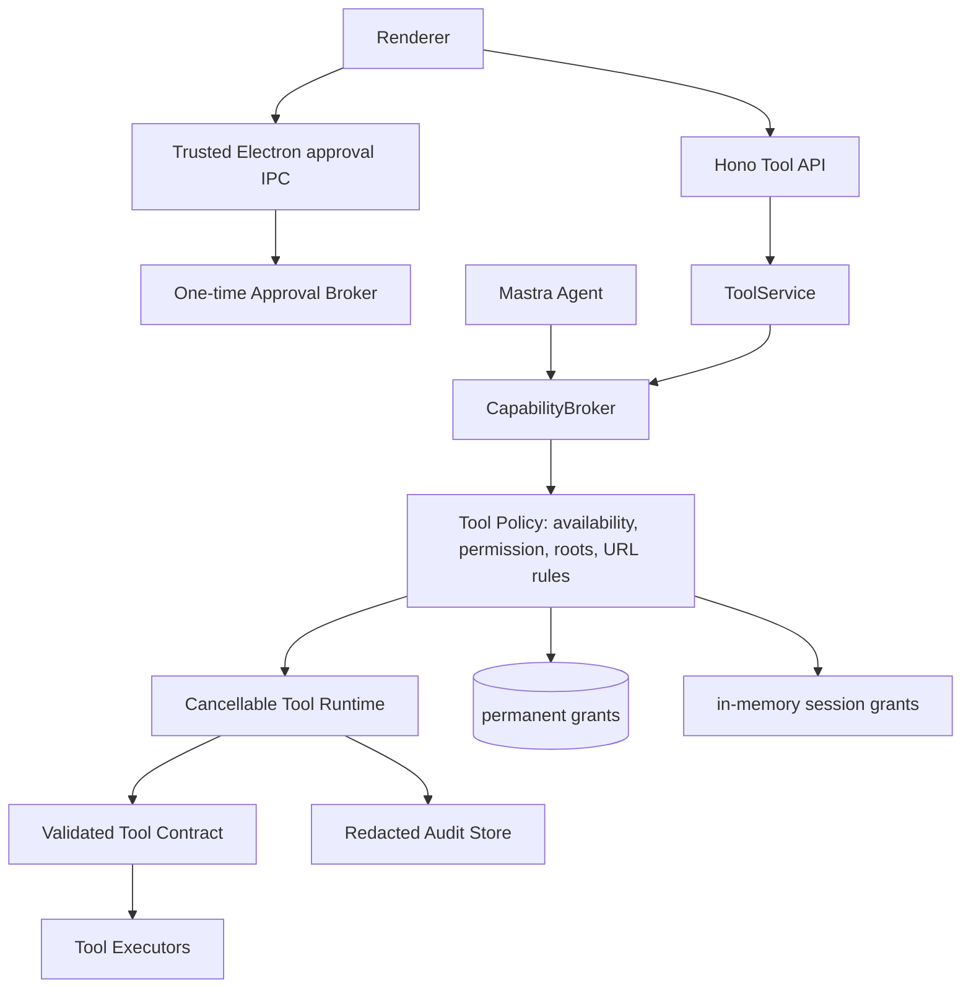

# BloomAI Tools 平台整改与扩展实施计划

> 文档版本：1.0<br>
> 计划日期：2026-08-02<br>
> 关联审计：`D:/codeproject/JS/bloomai/docs/tools/TOOL_AUDIT.md`<br>
> 目标版本：Tools Platform v2（分阶段交付，不以单个大 PR 一次完成）

---

## 1. 目标

本计划的目标不是单纯“多加几个工具”，而是把当前 22 个内置工具从“可调用的函数集合”升级为具备以下属性的平台能力：

1. **授权可信**：一次性、会话、永久授权具有真实且可验证的语义；外部请求不能伪造批准状态。
2. **资源受限**：文件只能在用户批准的根目录内访问；网络只能访问安全的外部地址；单次执行具备大小、时间、并发与结果上限。
3. **契约统一**：每个工具仅维护一份强类型输入/输出契约，Agent、HTTP、UI 手动测试、数据库目录和测试共用该契约。
4. **可取消、可审计**：超时会真实取消底层执行；运行记录不默认持久化敏感正文；状态、错误、耗时和截断信息可追踪。
5. **能力诚实**：未安装、未配置或未实现的工具不会作为“可用工具”暴露给 Agent 或用户。
6. **可渐进扩展**：优先新增低风险的 `fs_stat`、`workspace_search`、`fs_apply_patch` 等工具；高风险的执行、安装、登录自动化必须在隔离成熟后再开放。

### 1.1 成功定义

完成 Release A 后，应满足：

- 没有请求体字段可以绕过工具批准。
- “仅本次”授权在应用重启后不存在，且不会授权其他会话。
- 所有 filesystem/document/image-local 工具都无法访问批准根目录之外的真实路径，也不能经符号链接绕过。
- 所有 URL 工具不能访问本机、私网、链路本地地址，也不能通过重定向绕过。
- 任何工具的输入都经过同一份 schema 校验；缺少必填参数或越界值返回稳定错误码。
- 超时工具被真正 abort，运行记录稳定为 `timeout` 或 `cancelled`，不继续在后台写入。
- 3 个 placeholder 工具不再被默认启用或暴露为可用。
- 新增/重构工具具备成功、拒绝、越界、超时和资源截断测试。

---

## 2. 上下文与现状

### 2.1 当前架构



当前核心文件：

| 层级 | 文件 |
|---|---|
| 工具注册 | `D:/codeproject/JS/bloomai/src/server/tools/registry.ts` |
| 工具执行内核 | `D:/codeproject/JS/bloomai/src/server/tools/execute-tool.ts` |
| 工具类型 | `D:/codeproject/JS/bloomai/src/server/tools/types.ts` |
| Capability Broker | `D:/codeproject/JS/bloomai/src/server/skills/policy/capability-broker.ts` |
| Agent 工具暴露 | `D:/codeproject/JS/bloomai/src/server/mastra/tools.ts` |
| JSON schema 转换 | `D:/codeproject/JS/bloomai/src/server/mastra/json-schema.ts` |
| 数据库建表/种子 | `D:/codeproject/JS/bloomai/src/server/db/client.ts` |
| ORM schema | `D:/codeproject/JS/bloomai/src/server/db/schema.ts` |
| 工具仓库 | `D:/codeproject/JS/bloomai/src/server/db/repositories/tool.repo.ts` |
| HTTP service/routes | `D:/codeproject/JS/bloomai/src/server/services/tool.service.ts`、`D:/codeproject/JS/bloomai/src/server/http/routes/tools.ts` |
| Renderer Store/UI | `D:/codeproject/JS/bloomai/src/renderer/pages/Tools/tools.store.ts`、`D:/codeproject/JS/bloomai/src/renderer/pages/Tools/ToolTestRunner.tsx`、`D:/codeproject/JS/bloomai/src/renderer/pages/Tools/PermissionDialog.tsx` |

### 2.2 非目标

以下内容不属于 Release A 的目标，防止范围失控：

- 不在本阶段实现任意依赖安装、Git push、部署、邮件/消息发送、数据库写入、本地网络扫描。
- 不把 Node `vm` 误宣传为安全的 OS 级沙箱。
- 不在没有明确离线 OCR/图像编辑依赖和许可证决策前，强行实现 OCR 与 image edit。
- 不一次性重写整个工具系统；必须保持 Agent、HTTP 工具页和已有 skills package 调用路径的兼容性。
- 不在本计划中修改用户现有未提交业务功能；所有整改应以独立分支和小批次 PR 交付。

---

## 3. 目标架构



### 3.1 必要的抽象

| 抽象 | 职责 |
|---|---|
| `ToolContract` | 每个工具的 id、inputSchema、outputSchema、result policy、availability 定义 |
| `ToolExecutionContext` | sessionId、caller、approved roots、AbortSignal、request id、redaction context |
| `ToolAvailability` | `available`、`disabled`、`dependency_missing`、`configuration_missing`、`unsupported_platform` |
| `ToolPermissionStore` | permanent SQLite grant 与进程内 session grant 的统一读取接口 |
| `ApprovalBroker` | 只接受可信主进程发出的单次批准，验证工具、输入 hash、会话、过期和一次性消费 |
| `PathPolicy` | realpath 之后的 allowed roots 验证、写入目录创建、符号链接防护 |
| `UrlPolicy` | scheme、DNS/IP、redirect、host allow/deny、private range 防护 |
| `ToolRuntime` | 输入校验、AbortController、timeout、并发限制、输出校验、审计持久化 |

---

## 4. Release 分层与里程碑

| Release | 范围 | 交付门槛 |
|---|---|---|
| **A0：冻结与基线** | 工具盘点、placeholder 禁用、测试基线 | 不再把未实现工具暴露为可用 |
| **A1：可信授权** | session/permanent 分离、一次性批准 token、scope 校验 | 无法从 HTTP body 伪造批准 |
| **A2：边界与执行治理** | 路径沙箱、SSRF 防护、流式上限、可取消 timeout | 任意路径/内网 URL/后台残留执行被阻止 |
| **A3：统一契约与审计** | Zod contract、HTTP/Agent/UI 共用、脱敏运行记录 | 输入输出一致，记录可控且可测试 |
| **B1：文件工作流升级** | `fs_stat`、`workspace_search`、`fs_apply_patch` | 常见编码任务不依赖危险 Bash |
| **B2：完成已承诺工具** | screenshot、OCR、image edit 的可用性治理与实现 | 目录状态和实际功能一致 |
| **C：受控执行能力** | Node/Python/Shell 平台适配和强隔离方案 | 未达到隔离标准前保持默认禁用 |

每个 Release 应单独提交和验收；不得以“后续再修复”为理由混合合并 P0 权限与高风险工具新增。

---

## 5. Release A0：基线、占位能力治理与数据迁移

### 5.1 目标

防止当前不可用工具误导 Agent 或用户，同时建立可重复的工具健康检查。

### 5.2 功能设计

1. 引入工具可用性状态：

```ts
type ToolAvailability =
  | { status: 'available' }
  | { status: 'disabled'; reason: string }
  | { status: 'dependency_missing'; dependency: string }
  | { status: 'configuration_missing'; setting: string }
  | { status: 'unsupported_platform'; platform: NodeJS.Platform }
```

2. `web_screenshot`、`ocr`、`image_edit` 在真实实现前返回 `dependency_missing`，而非成功 `{ note: ... }`。
3. Agent 工具构建函数只暴露 `available && enabled` 的工具。
4. Tools UI 展示状态、原因、安装/配置说明；不可用工具不可手动运行。
5. 对现有数据库显式执行迁移：将 3 个 placeholder 工具设置为 `is_enabled = 0`。

### 5.3 涉及文件

| 动作 | 文件 |
|---|---|
| 新增 | `D:/codeproject/JS/bloomai/src/server/tools/availability.ts` |
| 修改 | `D:/codeproject/JS/bloomai/src/server/tools/registry.ts` |
| 修改 | `D:/codeproject/JS/bloomai/src/server/mastra/tools.ts` |
| 修改 | `D:/codeproject/JS/bloomai/src/server/skills/policy/capability-broker.ts` |
| 修改 | `D:/codeproject/JS/bloomai/src/server/db/client.ts` |
| 修改 | `D:/codeproject/JS/bloomai/src/server/services/tool.service.ts` |
| 修改 | `D:/codeproject/JS/bloomai/src/renderer/pages/Tools/tools.store.ts` |
| 修改 | `D:/codeproject/JS/bloomai/src/renderer/pages/Tools/ToolDetailPage.tsx` |
| 修改 | `D:/codeproject/JS/bloomai/src/renderer/pages/Tools/ToolTestRunner.tsx` |
| 新增测试 | `D:/codeproject/JS/bloomai/src/server/tools/availability.test.ts` |

### 5.4 数据迁移

在 `runMigrations()` 中增加可重复执行的更新：

```sql
UPDATE tools
SET is_enabled = 0
WHERE id IN ('web_screenshot', 'ocr', 'image_edit');
```

迁移必须：

- 只针对 builtin tool id。
- 写入可观测日志，包含实际更新数量。
- 不删除用户的 tool run 历史。
- 未来真实实现发布时不自动重启用，必须由用户重新确认启用。

### 5.5 测试与验收

- 新安装数据库中，3 个工具默认禁用。
- 旧数据库升级后，3 个工具被禁用。
- `buildAgentTools()` 不返回 unavailable 工具。
- HTTP `GET /tools` 返回 availability 和可读 reason。
- UI 不允许对 unavailable 工具点击 Run。

---

## 6. Release A1：可信授权模型

### 6.1 目标

修复“session 授权持久化”和“HTTP body 伪造批准”两个 P0 问题，建立可审计的授权生命周期。

### 6.2 权限模型

#### Permanent grant

- 用户主动在可信桌面 UI 中确认。
- 写入 SQLite。
- 仅代表“该工具类型被永久允许”，不代表无限制访问；仍受 path/url scope 与单次 input 校验约束。
- scope 限定为 `permanent`。

#### Session grant

- 仅保存在服务进程内存。
- key：`toolId + sessionId`。
- 值：`grantedAt`、`expiresAt`、可选 `allowedRoots`、可选 `allowedDomains`。
- 应用重启、session 结束或超时后自动失效。

#### One-time interactive approval

- 不写数据库。
- 由可信 Electron 主进程或其受控 approval service 创建一次性 token。
- token payload：`approvalId`、`toolId`、`sessionId`、`inputHash`、`issuedAt`、`expiresAt`、`singleUse`。
- 服务器在运行工具前验证并消费 token。
- token 不可用于不同工具、不同输入、不同会话或第二次调用。

### 6.3 API 变更

#### 删除不可信字段

从 `POST /tools/:id/run` body 中移除：

```ts
approvalGranted?: boolean
```

#### 新的运行请求

```ts
type RunToolRequest = {
  input: Record<string, unknown>
  sessionId?: string
  approvalToken?: string
}
```

#### 建议的可信批准 IPC

Renderer 不直接构造批准，而应通过 preload 暴露受限方法：

```ts
type ToolApprovalApi = {
  requestApproval(intent: {
    toolId: string
    sessionId?: string
    input: Record<string, unknown>
  }): Promise<{ approved: boolean; approvalToken?: string }>
}
```

该 IPC 的主进程处理器负责显示确认 UI 或调用已有批准 UI；服务端仅验证 token，不信任 renderer 的布尔字段。

### 6.4 数据模型与 repository 变更

1. `tool_permissions` 只保留 permanent grants。
2. 增加唯一索引以匹配 repository 的“一工具一永久授权”假设：

```sql
CREATE UNIQUE INDEX IF NOT EXISTS idx_tool_permissions_unique_tool_id
ON tool_permissions(tool_id);
```

在建立索引前，迁移需要清理历史重复数据，仅保留最近一条授权记录。

3. 新建内存 `SessionToolPermissionStore`，不增加持久化表。
4. `grantPermission()` 的参数用 Zod enum 限制：

```ts
z.enum(['permanent'])
```

session grant 应使用专门方法，要求 sessionId。

### 6.5 涉及文件

| 动作 | 文件 |
|---|---|
| 新增 | `D:/codeproject/JS/bloomai/src/server/tools/approval-broker.ts` |
| 新增 | `D:/codeproject/JS/bloomai/src/server/tools/session-permission-store.ts` |
| 新增 | `D:/codeproject/JS/bloomai/src/server/tools/approval-token.ts` |
| 修改 | `D:/codeproject/JS/bloomai/src/server/skills/policy/capability-broker.ts` |
| 修改 | `D:/codeproject/JS/bloomai/src/server/services/tool.service.ts` |
| 修改 | `D:/codeproject/JS/bloomai/src/server/http/routes/tools.ts` |
| 修改 | `D:/codeproject/JS/bloomai/src/server/db/repositories/tool.repo.ts` |
| 修改 | `D:/codeproject/JS/bloomai/src/server/db/client.ts` |
| 修改 | Electron preload/main 中实际定义工具批准 IPC 的文件（实现前先定位现有 IPC 边界） |
| 修改 | `D:/codeproject/JS/bloomai/src/renderer/pages/Tools/tools.store.ts` |
| 修改 | `D:/codeproject/JS/bloomai/src/renderer/pages/Tools/PermissionDialog.tsx` |
| 新增测试 | `D:/codeproject/JS/bloomai/src/server/tools/approval-broker.test.ts` |
| 修改测试 | `D:/codeproject/JS/bloomai/src/server/skills/policy/capability-broker.test.ts` |
| 修改测试 | `D:/codeproject/JS/bloomai/src/server/http/routes/tools.test.ts` |

### 6.6 验收场景

| 场景 | 预期 |
|---|---|
| 用户授予 session `fs_write`，重启应用 | 授权不存在，执行返回 `CAPABILITY_APPROVAL_REQUIRED` |
| session A 授予后，session B 调用同一工具 | 被拒绝 |
| HTTP body 传 `approvalGranted: true` | 忽略/返回参数校验错误，不能执行 |
| 有效 one-time token 首次运行 | 允许执行 |
| 同 token 第二次运行 | `CAPABILITY_APPROVAL_REQUIRED` 或 `APPROVAL_TOKEN_CONSUMED` |
| token 对输入变更一个字符 | 被拒绝 |
| token 过期 | 被拒绝 |
| permanent grant | 重启后仍可生效，但仍必须通过 path/url policy |

---

## 7. Release A2：路径、网络和资源边界

### 7.1 PathPolicy

#### 设计目标

将当前 `resolveSafePath()` 替换为明确且可证明的根目录策略。

```ts
type PathAccess = 'read' | 'write'

type PathPolicyContext = {
  allowedRoots: readonly string[]
  access: PathAccess
  createParents?: boolean
}

async function resolvePathWithinAllowedRoots(
  rawPath: string,
  context: PathPolicyContext,
): Promise<string>
```

#### 处理流程

1. 拒绝空路径、NUL 字符、设备路径和不允许的 scheme。
2. 展开 `~` 后转为绝对路径。
3. 对读取目标调用 `realpath()`；对写入目标，对已有父路径调用 `realpath()`，再拼接最后路径段。
4. 规范化大小写和分隔符，适配 Windows。
5. 验证 resolved target 在任一 `allowedRoot` 之内，边界比较必须按路径 segment，而不是 `startsWith` 字符串。
6. 对 write：禁止从未批准根外创建父目录；可选拒绝覆盖，要求显式 `overwrite: true`。
7. 返回 canonical path，供审计与 executor 使用。

#### 默认 allowed roots

- 当前工作区根目录。
- 用户在桌面 UI 明确选择并批准的目录。
- 上传文件所属的受控临时目录。
- 不应默认使用整个 home directory。

#### 应用范围

`fs_read`、`fs_write`、`fs_edit`、`fs_grep`、`fs_glob`、所有 document 工具、`vision.imagePath`、`image_edit`、截图与图片生成的 `saveTo` 必须使用同一策略。

### 7.2 UrlPolicy / SSRF 防护

#### API 草案

```ts
type UrlPolicyOptions = {
  allowedProtocols?: readonly ['http:', 'https:']
  allowPrivateNetworks?: false
  maxRedirects?: number
}

async function validateExternalUrl(rawUrl: string, options?: UrlPolicyOptions): Promise<URL>
async function validateResolvedHost(url: URL): Promise<void>
```

#### 规则

- 仅允许 HTTP(S)。
- 拒绝 URL 认证信息、空 host、超长 URL。
- DNS 解析 A/AAAA 记录；拒绝 loopback、private、link-local、multicast、unspecified、IPv4-mapped private IPv6。
- 发生任何 redirect 后重新校验目标 URL 和解析结果。
- `localhost`、`*.localhost`、`127.0.0.0/8`、`::1` 必须拒绝。
- Playwright 必须通过 `page.route('**/*')` 在每个子请求处执行策略；不能只在 `page.goto()` 前检查。
- 图片 URL 读取使用相同策略，并限制 MIME 类型与流式大小。

### 7.3 Stream 与结果上限

引入统一上限配置：

```ts
type ToolResourceLimits = {
  timeoutMs: number
  maxInputBytes: number
  maxOutputBytes: number
  maxFiles: number
  maxFileBytes: number
  maxDepth: number
}
```

最小默认建议：

| 类别 | timeout | 单响应/单文件 | 最大结果 |
|---|---:|---:|---:|
| web fetch/extract | 20 秒，渲染最多 60 秒 | 5 MB 下载、50k 字符返回 | 200 links |
| file read/document | 10 秒 | 5 MB 读取、50k 字符返回 | 支持 cursor |
| grep/search | 15 秒 | 单文件 2 MB | 100 matches / 2k files |
| image URL / vision | 20 秒 | 10 MB 图片 | 限制 MIME 和分辨率 |
| screenshot | 60 秒 | 像素总数与输出文件 10 MB | 1 image |

所有工具输出应包含：

```ts
{
  truncated: boolean,
  truncationReason?: 'max_bytes' | 'max_chars' | 'max_files' | 'max_matches' | 'timeout'
}
```

### 7.4 涉及文件

| 动作 | 文件 |
|---|---|
| 新增 | `D:/codeproject/JS/bloomai/src/server/tools/utils/path-policy.ts` |
| 新增 | `D:/codeproject/JS/bloomai/src/server/tools/utils/url-policy.ts` |
| 新增 | `D:/codeproject/JS/bloomai/src/server/tools/utils/stream-limit.ts` |
| 新增 | `D:/codeproject/JS/bloomai/src/server/tools/resource-limits.ts` |
| 修改 | `D:/codeproject/JS/bloomai/src/server/tools/types.ts` |
| 修改 | `D:/codeproject/JS/bloomai/src/server/tools/utils/path.ts`（迁移后删除或保留 deprecated wrapper） |
| 修改 | `D:/codeproject/JS/bloomai/src/server/tools/utils/html.ts` |
| 修改 | `D:/codeproject/JS/bloomai/src/server/tools/utils/render.ts` |
| 修改 | 所有 fs/doc/vision/image 工具 executor |
| 新增测试 | `D:/codeproject/JS/bloomai/src/server/tools/utils/path-policy.test.ts` |
| 新增测试 | `D:/codeproject/JS/bloomai/src/server/tools/utils/url-policy.test.ts` |
| 新增测试 | `D:/codeproject/JS/bloomai/src/server/tools/utils/stream-limit.test.ts` |

### 7.5 验收场景

- `../`、绝对路径、Windows 驱动器路径、符号链接跳转到根目录外均被拒绝。
- 批准 `D:/workspace/project` 后，`D:/workspace/project-copy` 不会因字符串前缀误通过。
- 访问 `http://127.0.0.1`、`http://localhost`、私有 IP 与重定向到私网均被拒绝。
- 10 GB 响应不会完整进入内存，读取到限制后流被取消。
- 超过最大文件/匹配/字符数时有稳定 `truncated` 输出。

---

## 8. Release A3：统一 Tool Contract、可取消执行和审计

### 8.1 Tool Contract

新增 `D:/codeproject/JS/bloomai/src/server/tools/contracts.ts`，每个工具用同一模式导出定义：

```ts
import { z } from 'zod'

export type ToolDefinition<I extends z.ZodTypeAny, O extends z.ZodTypeAny> = {
  id: string
  category: string
  displayName: string
  description: string
  requiresPermission?: 'fs' | 'network' | 'write' | 'shell' | 'sandbox'
  inputSchema: I
  outputSchema: O
  getAvailability: () => ToolAvailability
  execute: (input: z.infer<I>, context: ToolExecutionContext) => Promise<z.infer<O>>
}
```

关键原则：

- executor 不再接受 `any` 或未验证 object。
- 数据库中的 `params_schema` / `result_schema` 从 contract 生成或校验，不能由实现和数据库各自维护。
- Agent 和 HTTP 都调用 `definition.inputSchema.parse()`。
- UI 按 schema 生成输入表单；不能用 `parseFloat(val) || 0` 隐式修改用户输入。
- 输出在持久化前执行 `outputSchema.parse()`。

### 8.2 运行时取消模型

扩展 `ToolExecutionContext`：

```ts
export interface ToolExecutionContext {
  toolId: string
  sessionId?: string
  caller: 'chat' | 'workflow' | 'http' | 'package-runtime'
  allowedRoots: readonly string[]
  signal: AbortSignal
  requestId: string
}
```

`executeToolInternal` 负责：

1. 创建 `AbortController`。
2. 在 timeout 到期时 `controller.abort(new ToolTimeoutError(...))`。
3. 把 signal 传入 fetch、Playwright、文件遍历和子进程。
4. 将运行状态区分为 `success`、`error`、`timeout`、`cancelled`、`denied`。
5. 仅在 executor 真正结束/确认 abort 后关闭记录，避免后台任务继续产生未审计副作用。

### 8.3 子进程策略

- `shell`、`python_runner`、`bash` 不应共享一个简单 `execFileAsync` 包装。
- 新建受控 process runner，明确 `command`、`args`、`cwd`、最小环境变量、超时、AbortSignal、stdout/stderr 上限和 kill 逻辑。
- Windows 与 POSIX 使用不同的进程终止策略。
- 未建立足够隔离前，`shell`、`python_runner`、`node_runner` 默认禁用；不应仅以数据库 permission 取代进程级隔离。
- Node `vm` 只能称为“受限执行环境”，不能称为安全 sandbox；如果产品要求运行不可信代码，需要单独设计子进程/容器隔离 ADR。

### 8.4 审计与隐私

#### 运行记录原则

- 默认保存结构化摘要，非完整正文。
- `input_json` / `output_json` 通过 redactor 处理后再写入。
- 大输出只保存前 N 字符、hash、原始大小与 `truncated` 标记。
- URL query、Authorization、Cookie、token、API key、绝对私密路径应脱敏。
- 对运行记录实行总容量和保留期策略。

#### 建议 API

```ts
type SanitizedRunPayload = {
  summary: Record<string, unknown>
  redactedFields: string[]
  originalBytes?: number
  storedBytes: number
  truncated: boolean
  sha256?: string
}
```

### 8.5 涉及文件

| 动作 | 文件 |
|---|---|
| 新增 | `D:/codeproject/JS/bloomai/src/server/tools/contracts.ts` |
| 新增 | `D:/codeproject/JS/bloomai/src/server/tools/tool-runtime.ts` |
| 新增 | `D:/codeproject/JS/bloomai/src/server/tools/utils/process-runner.ts` |
| 新增 | `D:/codeproject/JS/bloomai/src/server/tools/audit-redactor.ts` |
| 修改 | `D:/codeproject/JS/bloomai/src/server/tools/types.ts` |
| 修改 | `D:/codeproject/JS/bloomai/src/server/tools/execute-tool.ts` |
| 修改 | `D:/codeproject/JS/bloomai/src/server/tools/registry.ts` |
| 修改 | `D:/codeproject/JS/bloomai/src/server/mastra/tools.ts` |
| 修改 | `D:/codeproject/JS/bloomai/src/server/mastra/json-schema.ts`（最终应由 contract schema 替代转换逻辑） |
| 修改 | `D:/codeproject/JS/bloomai/src/server/db/repositories/tool.repo.ts` |
| 修改 | `D:/codeproject/JS/bloomai/src/server/db/client.ts`、`D:/codeproject/JS/bloomai/src/server/db/schema.ts` |
| 修改 | `D:/codeproject/JS/bloomai/src/server/services/tool.service.ts` |
| 修改 | `D:/codeproject/JS/bloomai/src/server/http/routes/tools.ts` |
| 修改 | `D:/codeproject/JS/bloomai/src/renderer/pages/Tools/ToolTestRunner.tsx` |
| 新增测试 | `D:/codeproject/JS/bloomai/src/server/tools/tool-runtime.test.ts` |
| 新增测试 | `D:/codeproject/JS/bloomai/src/server/tools/audit-redactor.test.ts` |

### 8.6 契约示例：安全文件读取

```ts
const fsReadInputSchema = z.object({
  path: z.string().min(1).max(4096),
  offset: z.number().int().min(0).default(0),
  limit: z.number().int().min(1).max(2_000).default(500),
})

const fsReadOutputSchema = z.object({
  path: z.string(),
  content: z.string(),
  totalLines: z.number().int().nonnegative(),
  truncated: z.boolean(),
})
```

### 8.7 验收场景

- Agent、HTTP、UI 对非法 `limit` 返回一致、可读的 schema 错误。
- 缺失 `url`、`path`、`query` 等必填字段不再进入 executor。
- 超时网络任务接收到 abort；测试能观测到 fetch signal aborted。
- shell/python 子进程在 abort 后不存在残留进程。
- 审计表中不保存 Authorization/Token 原文；超大网页正文不会全部写入 SQLite。

---

## 9. Release B1：文件工作流工具升级

### 9.1 `fs_stat`

**目标**：提供目录/文件元信息，减少 Agent 依赖全盘 glob。

#### 输入

```ts
z.object({ path: z.string().min(1) })
```

#### 输出

```ts
z.object({
  path: z.string(),
  type: z.enum(['file', 'directory', 'symlink']),
  size: z.number().nonnegative(),
  modifiedAt: z.string(),
  extension: z.string().optional(),
  isBinary: z.boolean().optional(),
})
```

#### 文件

- 新增：`D:/codeproject/JS/bloomai/src/server/tools/fs-stat.ts`
- 修改：`D:/codeproject/JS/bloomai/src/server/tools/registry.ts`
- 修改：`D:/codeproject/JS/bloomai/src/server/db/client.ts`
- 新增测试：`D:/codeproject/JS/bloomai/src/server/tools/fs-stat.test.ts`

### 9.2 `workspace_search`

**目标**：替代当前弱 glob + 不受控 grep。

#### 功能

- 支持 `query`、`include`、`exclude`、`root`、`caseSensitive`、`maxResults`、`cursor`。
- 真实 glob 语义；ignore `.git`、`node_modules`、构建目录与用户配置路径。
- 文本搜索返回 file、line、column、preview、match ranges。
- 限制最大扫描文件数、深度、文件大小和总读取量。
- 默认不跟随符号链接，不读取二进制文件。

#### 注意

实现前必须做 dependency ADR：优先评估现有运行时能力；如需要新增 glob/search 依赖，应评估许可证、体积、维护状态和跨平台兼容性。不得在 executor 内调用未受控 `grep`/`find`。

### 9.3 `fs_apply_patch`

**目标**：提供更安全、更可审计的代码修改能力。

#### 输入

```ts
z.object({
  patch: z.string().min(1).max(1_000_000),
  root: z.string().optional(),
  dryRun: z.boolean().default(true),
  createBackup: z.boolean().default(true),
})
```

#### 行为

- 默认 `dryRun: true`，只返回预览和可能冲突。
- 解析 patch 中的相对文件名，拒绝绝对路径与 `..` 越界。
- 通过 PathPolicy 验证所有目标文件。
- 使用原子写入；若文件自读取后已变化，报告 conflict。
- 对真正写入要求 write permission + one-time approval 或 permanent write grant。
- 返回已修改文件、每文件 hunk 数、备份路径（不可泄露根外路径）、rollback token。

### 9.4 调整已有工具

- `fs_glob` 标记为 deprecated，内部转调 `workspace_search` 的枚举模式，直到后续大版本移除。
- `fs_grep` 标记为 deprecated，内部转调 `workspace_search` 的文本模式。
- `fs_edit` 保留用于小型精确编辑，但增加 `expectedHash` 和 atomic write；复杂代码改动推荐 `fs_apply_patch`。
- `bash` 收缩为只读、结构化命令；删除破坏性命令，避免与 write 工具权限混淆。

---

## 10. Release B2：完成多模态和网页承诺能力

### 10.1 `web_screenshot`

#### MVP 功能

- 输入：`url`、`fullPage`、`viewport`、`format`、`quality`。
- 使用 `UrlPolicy` 和 Playwright request routing。
- 复用 `D:/codeproject/JS/bloomai/src/server/tools/utils/render.ts` 的 browser 生命周期，不重复启动浏览器。
- 输出仅写入受控临时目录或用户批准输出目录。
- 限制最大 viewport、总像素、文件大小与超时。
- 输出：`imagePath`、`mimeType`、`width`、`height`、`bytes`、`finalUrl`。

#### 文件

- 修改：`D:/codeproject/JS/bloomai/src/server/tools/web-screenshot.ts`
- 修改：`D:/codeproject/JS/bloomai/src/server/tools/utils/render.ts`
- 新增测试：`D:/codeproject/JS/bloomai/src/server/tools/web-screenshot.test.ts`

### 10.2 OCR

#### 发布前决策

- 后端是本地二进制、WASM、云服务还是系统能力？
- 支持语言、模型文件体积、离线可用性、许可证、隐私说明是什么？
- 输出是否包含 pages、blocks、bounding boxes、confidence？

在这些决策未完成前，保持 unavailable；不能以 note 形式注册为成功 executor。

### 10.3 Image Edit

#### 发布前决策

- 是否引入图像处理依赖，及其桌面打包兼容性？
- 支持操作集合：resize、crop、rotate、format、quality、strip metadata。
- 所有 outputPath 必须应用 PathPolicy，默认生成新文件。
- 图片解码前检查 MIME、像素和文件大小，防止解压炸弹。

---

## 11. Release C：受控执行工具策略

### 11.1 风险判断

`node_runner`、`python_runner`、`shell` 能够执行动态代码或系统命令。它们不应仅依赖一条“用户曾允许”的数据库记录，也不应在没有操作系统级隔离设计时默认对 Agent 开放。

### 11.2 分阶段策略

1. **Release A**：默认禁用；保留工具目录和 UI 说明。
2. **Release C1**：实现跨平台 command runner、AbortSignal、stdout/stderr 限制、工作目录 policy、最小 env 白名单、完整审计。
3. **Release C2**：完成隔离 ADR；选择子进程受限账户、容器、沙箱 VM 或明确标记为“仅可信本地开发者模式”。
4. **Release C3**：仅当 C2 威胁模型和验收完成后，允许 Agent 在一次性批准下使用。

### 11.3 特别要求

- `node:vm` 不作为隔离边界宣传。
- Python `packages` 参数不得被解释为自动安装包。
- Shell 不接收不受控的环境变量；使用固定最小环境。
- 需要 Windows 和 POSIX 的独立集成测试矩阵。

---

## 12. 详细测试计划

### 12.1 测试层级

| 层级 | 内容 | 目标 |
|---|---|---|
| Unit | schema、path、URL、stream、redaction、token、permission store | 覆盖全部安全分支和边界值 |
| Executor integration | 临时文件系统、假 fetch、假 DNS、可控子进程 | 证明每类工具真正遵守 runtime context |
| HTTP contract | routes + tool service + broker | 防止 API 绕过校验和批准 |
| Agent integration | `buildAgentTools` | 不向模型暴露 unavailable/disabled 工具；输入 schema 一致 |
| Renderer integration | Tools UI、审批弹窗、手动测试表单 | 默认值、错误显示、不可用状态和 token 流程正确 |
| Regression | 原有 web search/extract、capability broker、tools routes | 保证既有功能未退化 |

### 12.2 必测安全场景

#### 权限

- session grant 进程重启失效。
- session grant 不能跨 sessionId 使用。
- permanent grant 可重启保留。
- body `approvalGranted` 无效。
- one-time token 二次使用、过期、会话错配、输入 hash 错配全部拒绝。

#### 路径

- 根内正常读取/写入成功。
- `..` 越界拒绝。
- Windows 大小写与驱动器格式变体正确处理。
- 符号链接指向根外拒绝。
- 根前缀相似路径拒绝，例如批准 `D:/work/app` 时不能访问 `D:/work/app-copy`。

#### 网络

- 阻止 localhost、IPv4 loopback、IPv6 loopback、私网、链路本地地址。
- 初始外网 URL 302 到私网时拒绝。
- Playwright 页面中 iframe / image / XHR 尝试访问私网时被拦截。
- 超大响应取消下载，不保留完整 body。

#### 运行时

- executor 见到 abort signal 后停止。
- 子进程超时后不存在残留。
- 同步大文件处理不能绕过 timeout；必要时通过异步 API 验证。
- 输出超过上限被标记为 truncated。

#### 业务正确性

- CSV 含引号、逗号、换行、TSV 时正确解析。
- workspace search 忽略 node_modules/.git，支持分页。
- apply patch dry-run 不写文件；冲突时不产生部分修改；成功写入可恢复。
- screenshot 生成文件位于安全目录且通过 URL policy。

### 12.3 建议测试文件清单

```text
src/server/tools/approval-broker.test.ts
src/server/tools/session-permission-store.test.ts
src/server/tools/contracts.test.ts
src/server/tools/tool-runtime.test.ts
src/server/tools/audit-redactor.test.ts
src/server/tools/utils/path-policy.test.ts
src/server/tools/utils/url-policy.test.ts
src/server/tools/utils/stream-limit.test.ts
src/server/tools/fs-read.test.ts
src/server/tools/fs-write.test.ts
src/server/tools/fs-edit.test.ts
src/server/tools/workspace-search.test.ts
src/server/tools/fs-apply-patch.test.ts
src/server/tools/fs-stat.test.ts
src/server/tools/web-fetch.test.ts
src/server/tools/web-extract.test.ts
src/server/tools/web-screenshot.test.ts
src/server/tools/vision.test.ts
src/server/tools/doc-csv.test.ts
src/server/tools/availability.test.ts
```

---

## 13. 验收证据清单

每个 Release 合并前必须附带以下证据，而不是只声明“测试通过”。

### A0

- 数据库升级测试日志：placeholder 工具被禁用。
- Agent tool surface snapshot：不包含 unavailable 工具。
- UI 截图或组件测试：不可用状态不可执行。

### A1

- session grant 重启前后对比测试。
- 一次性 token 的首次/二次/过期/错配测试输出。
- HTTP body 伪造批准的回归测试。
- 数据库 unique index 迁移验证。

### A2

- 临时目录与符号链接逃逸测试报告。
- 本地/私网/redirect SSRF 拒绝测试。
- 大响应内存/取消的测试或指标证据。
- timeout 后子进程/浏览器任务清理证据。

### A3

- Agent、HTTP、UI 使用同一 contract 的测试。
- input/output schema 失败快照。
- 日志脱敏和运行记录大小限制测试。
- 全量 `npm test`、`npm run typecheck`、`npm run build` 成功输出。

### B1/B2/C

- 每个新工具都至少有：可用性、权限、非法输入、边界、成功、超时/资源上限、审计记录测试。
- UI 人工验收步骤和截图。
- 与旧工具的迁移兼容测试。

---

## 14. 交付顺序与 PR 切分

建议保持每个 PR 可独立部署、可回滚：

1. **PR-1：A0 Availability**：引入 availability，禁用三种 placeholder，测试与 UI 状态。
2. **PR-2：A1 Session grants**：session store 与 permanent 数据迁移，不改变 UI 交互细节。
3. **PR-3：A1 Trusted approval**：approval token/IPC，移除 HTTP boolean bypass。
4. **PR-4：A2 PathPolicy**：先迁移 read-only filesystem/document 工具，再迁移 write 工具。
5. **PR-5：A2 UrlPolicy + stream**：web fetch/extract/vision，随后 browser rendering。
6. **PR-6：A3 Tool contracts**：从低风险 web/file read 工具开始迁移；保留 compatibility adapter。
7. **PR-7：A3 Runtime and audit**：AbortSignal、status、redaction、retention。
8. **PR-8：B1 Workspace tools**：`fs_stat`、`workspace_search`、deprecated wrappers。
9. **PR-9：B1 Patch tool**：`fs_apply_patch` + preview + one-time write approval。
10. **PR-10：B2 Screenshot**：真实截图实现、状态切换与测试。
11. **PR-11+：OCR/image edit/controlled execution**：分别独立 ADR、实现和验收。

每个 PR 都应限制在一个主题内；不将数据库迁移、权限策略、截图实现和执行隔离混在同一变更中。

---

## 15. 风险与回滚策略

| 风险 | 缓解措施 | 回滚方式 |
|---|---|---|
| 新路径策略误拦截正常文件 | 先在 audit-only 模式记录决策，再逐步 enforce；允许用户明确授权目录 | feature flag 切回 legacy read-only policy，保留审计日志 |
| URL 策略误伤企业内网使用 | 默认安全拒绝；若未来需支持，使用显式 enterprise allowlist，而非全局放开私网 | 关闭企业 allowlist 配置即可恢复默认安全策略 |
| approval token IPC 集成复杂 | 首先定义 service interface 与全量测试，再接入 Electron 主进程 | 保持工具需 permanent grant 的安全降级，不恢复 body boolean |
| schema 迁移影响已有 Agent prompt | 先做 compatibility contract adapter 与 tool snapshot tests | 逐个工具回退 adapter，不回退安全校验 |
| 新工具依赖导致 Electron 打包问题 | 依赖 ADR、CI 安装/打包 smoke test、可用性状态 | 标记 dependency_missing 并默认禁用，不让 app 启动失败 |
| tool_runs 脱敏影响调试 | 保存 hash、摘要、可控 debug mode 和本地短期加密原文 | 关闭 debug mode 即恢复最小存储，不扩大默认持久化 |

---

## 16. 最终验收门槛

Tools Platform v2 的 Release A 完成条件：

- [ ] P0 授权绕过和 session 持久化问题有回归测试且已修复。
- [ ] 所有工具输入/输出的关键路径使用统一强类型 schema。
- [ ] 所有文件相关工具均启用 allowed roots 与符号链接防护。
- [ ] 所有 URL 工具均启用 SSRF/redirect 防护和流式大小限制。
- [ ] timeout 能真正取消底层工作，运行记录状态准确。
- [ ] placeholder 工具默认不可用且不会暴露给 Agent。
- [ ] 审计记录完成脱敏、大小限制与清理策略。
- [ ] 定向工具测试、全量测试、typecheck、build 均通过。
- [ ] Windows 作为首要桌面目标完成手动 smoke test。
- [ ] 工具目录 UI 能明确区分 enabled、disabled、available、dependency missing、configuration missing 和 approval required。

只有在上述条件达成后，才进入高风险执行工具默认开放或自动化外部操作的讨论。
