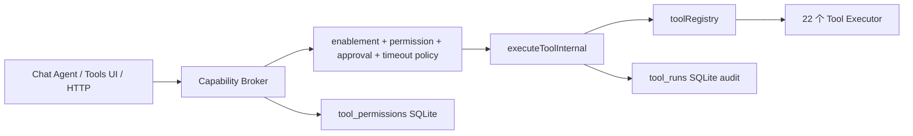

# BloomAI 内置 Tools 审计报告

> 审计日期：2026-08-02 
> 审计范围：`D:/codeproject/JS/bloomai/src/server/tools` 中由注册表暴露的 22 个内置工具；并覆盖 Agent/Mastra、Capability Broker、HTTP 接口、数据库记录及 Tools 测试界面。 
> 审计方式：静态代码审查 + 定向测试；未修改业务源码。

## 1. 执行摘要

BloomAI 已经具备合理的工具平台雏形：工具实现集中在 `src/server/tools`，运行时经由 `Capability Broker` 统一进入执行内核，工具调用会写入 `tool_runs`，并在 UI 提供启用、授权、运行历史与手动测试入口。该分层可以继续演进为一个可靠的本地 Agent 工具平台。

但当前版本不应继续优先扩展高风险能力。必须先解决四类基础问题：

1. **授权语义不可信**：所谓“仅本次”授权会持久化；HTTP 请求还能自行声明“已获批准”。
2. **资源边界缺失**：文件路径没有被约束在工作区或用户批准的根目录内；网页与图片 URL 没有 SSRF 防护。
3. **工具契约与执行治理不足**：输入 schema 不严格、超时不会取消底层任务、同步 I/O/递归扫描缺少大小与深度上限。
4. **目录与实际能力不一致**：截图、OCR、图片编辑被默认启用，却只是占位返回；若不修复会误导 Agent、UI 与用户。

结论：**需要优化，且 P0/P1 的修复优先级高于新增工具。** 新增工具应先限定在完善现有承诺和提高可审计性的低风险能力。

---

## 2. 审计范围与系统调用链

### 2.1 已审计工具数量

| 分类 | 工具 | 数量 |
|---|---|---:|
| Web | `web_search`、`web_fetch`、`web_screenshot`、`web_extract` | 4 |
| 文件系统 | `fs_read`、`fs_write`、`fs_edit`、`fs_grep`、`fs_glob`、`bash` | 6 |
| 文档 | `doc_markdown`、`doc_pdf`、`doc_txt`、`doc_csv`、`doc_docx` | 5 |
| 多模态 | `vision`、`ocr`、`image_gen`、`image_edit` | 4 |
| 执行 | `node_runner`、`python_runner`、`shell` | 3 |
| **合计** | 由工具注册表暴露的内置工具 | **22** |

工具注册表：`D:/codeproject/JS/bloomai/src/server/tools/registry.ts` 
默认工具目录与 schema：`D:/codeproject/JS/bloomai/src/server/db/client.ts` 
Agent/Mastra 工具面：`D:/codeproject/JS/bloomai/src/server/mastra/tools.ts`

### 2.2 调用链

目前 `Capability Broker` 作为外部调用入口的设计是正确的；问题在于其授权输入和授权存储语义尚未达到可信边界的要求。

---

## 3. 工具功能与健康度

### 3.1 Web 工具

| 工具 | 当前实现 | 健康度 | 主要问题 |
|---|---|---|---|
| `web_search` | Tavily 优先、DuckDuckGo 回退 | 可用 | `limit`/查询输入没有严格上限；日志记录完整查询；错误策略为软失败，调用方需显式理解空结果与真无结果的区别 |
| `web_fetch` | 静态抓取、字符集识别、必要时 Playwright 渲染 | 基础可用 | 无 URL/重定向 SSRF 防护；所谓 5 MB 限制在整包下载后才截断；不限制 HTML/文本以外内容 |
| `web_extract` | 标题、正文、链接、头部信息提取 | 基础可用 | 与 `web_fetch` 共享 SSRF/资源上限问题；HTML 正则解析对复杂页面有脆弱性 |
| `web_screenshot` | 仅返回“需要 Playwright”说明 | 不可用 | 数据库默认启用且描述为 PNG 截图，但没有任何截图实现 |

相关文件：

- `D:/codeproject/JS/bloomai/src/server/tools/web-search.ts`
- `D:/codeproject/JS/bloomai/src/server/tools/web-fetch.ts`
- `D:/codeproject/JS/bloomai/src/server/tools/web-extract.ts`
- `D:/codeproject/JS/bloomai/src/server/tools/web-screenshot.ts`
- `D:/codeproject/JS/bloomai/src/server/tools/utils/html.ts`
- `D:/codeproject/JS/bloomai/src/server/tools/utils/render.ts`

### 3.2 文件系统与 Bash 工具

| 工具 | 当前实现 | 健康度 | 主要问题 |
|---|---|---|---|
| `fs_read` | 指定行区间读文件 | 有实现 | 任意绝对路径可读；同步读取；无字节上限；offset/limit 无严格校验 |
| `fs_write` | 覆盖或追加写入并自动建目录 | 有实现 | 任意绝对路径可写；无原子写入、备份、预条件或 diff；无写入上限 |
| `fs_edit` | 精确唯一文本替换 | 有实现 | 无路径边界；只支持一次文本替换；无版本检查或回滚 |
| `fs_grep` | 正则搜索文件/目录 | 风险较高 | 用户正则可能 ReDoS；递归无深度、ignore、二进制/大文件/符号链接防护 |
| `fs_glob` | 递归扫描并做字符串包含匹配 | 功能不准确 | 不是真正 glob；最大深度硬编码 5；大树扫描仍昂贵；符号链接语义不明确 |
| `bash` | 允许命令白名单 | 语义不一致 | 白名单实际包含 `rm`、`chmod`、`mv`、`cp` 等变更命令；简单空格拆分不支持带空格参数 |

所有文件工具依赖：`D:/codeproject/JS/bloomai/src/server/tools/utils/path.ts`。该函数只做路径解析，不做根目录校验，因此名称 `resolveSafePath` 与实际行为不符。

### 3.3 文档工具

| 工具 | 当前实现 | 健康度 | 主要问题 |
|---|---|---|---|
| `doc_markdown` | 提取标题、代码块、链接与全文 | 基础可用 | 返回全文，不适合大文件；无字符/字节上限 |
| `doc_pdf` | 复用附件 PDF parser | 待补验证 | 缺少直接工具级测试、输入大小限制与标准截断返回 |
| `doc_txt` | UTF-8 读取与分块 | 描述不一致 | 文案称“自动编码检测”，实现固定 UTF-8 |
| `doc_csv` | 逗号 split 后统计 | 不可用于通用 CSV | 无法处理引号、转义、嵌入逗号、嵌入换行；没有 TSV 支持 |
| `doc_docx` | 复用附件 DOCX parser | 待补验证 | 缺少工具级测试、输出大小/复杂文档资源限制 |

### 3.4 多模态工具

| 工具 | 当前实现 | 健康度 | 主要问题 |
|---|---|---|---|
| `vision` | 读本地/远程图片并请求 Anthropic | 有实现 | 本地路径无边界；远程 URL 无 SSRF 防护；无 MIME/体积限制；模型硬编码 |
| `ocr` | 占位 note | 不可用 | 默认启用却不做识别 |
| `image_gen` | 委托 LLM image generation | 有实现 | 依赖上层 provider 校验；需核实输出保存目录及失败幂等性 |
| `image_edit` | 占位 note | 不可用 | 默认启用却不做图片编辑 |

### 3.5 执行工具

| 工具 | 当前实现 | 健康度 | 主要问题 |
|---|---|---|---|
| `node_runner` | `vm.runInNewContext` | 有实现但不应称为强隔离 | VM 不是 OS sandbox；资源限制、异步任务、序列化输出及 module/escape 策略均未统一 |
| `python_runner` | `python3 -c` 子进程 | 平台不稳定 | Windows 上 `python3` 常不可用；没有真实容器/沙箱；schema 中的 `packages` 与实现不一致 |
| `shell` | `sh -c` 子进程 | 高风险 | Windows 上依赖 `sh`；永久授权判定与其他工具 scope 语义不一致；无取消/审计策略细分 |

---

## 4. 发现的问题与优先级

### P0-1：session scope 会跨重启持续生效

**证据**：

- `tool_permissions` 只存 `tool_id`、`granted`、`scope`，不存会话 ID 和过期时间。
- `grantPermission` 无论 scope 是 `session` 还是 `permanent` 都写 SQLite。
- `requireLegacyToolPermission` 只检查 `granted === 1`。

文件：

- `D:/codeproject/JS/bloomai/src/server/db/repositories/tool.repo.ts:112-120`
- `D:/codeproject/JS/bloomai/src/server/skills/policy/capability-broker.ts:153-159`
- `D:/codeproject/JS/bloomai/src/renderer/pages/Tools/PermissionDialog.tsx`

**影响**：用户在 UI 选择“仅本次”后，写入、shell、sandbox 等授权可能在下次启动仍然有效。

**修复方向**：session 授权仅存进程内存，并绑定 `sessionId` 与过期时间；只有 permanent 授权可持久化。

### P0-2：HTTP body 可绕过交互批准

**证据**：`POST /tools/:id/run` 的 body 可包含 `approvalGranted: true`，服务层把它直接转为可信的 `grantContext.interactiveApprovalGranted`。

文件：

- `D:/codeproject/JS/bloomai/src/server/http/routes/tools.ts:46-50`
- `D:/codeproject/JS/bloomai/src/server/services/tool.service.ts:58-66`
- `D:/codeproject/JS/bloomai/src/server/skills/policy/capability-broker.ts:153-159`

**影响**：能调用本地 HTTP API 的主体可直接宣称已获批准，破坏权限弹窗的安全语义。

**修复方向**：禁止 body 传入 `approvalGranted`；改为主进程/可信 UI 签发的单次 approval token，token 绑定工具、输入摘要、会话、过期时间与使用次数。

### P0-3：文件“安全路径”未限制任何根目录

**证据**：`resolveSafePath` 只调用 `path.resolve`。

文件：`D:/codeproject/JS/bloomai/src/server/tools/utils/path.ts:4-6`

**影响**：任何拥有 fs 读取/写入能力的工具都可访问当前用户权限范围内的任意路径；文档与 Vision 工具也继承此问题。

**修复方向**：使用 `allowedRoots`；路径和符号链接 resolve 后必须落在已批准根目录内；工作区和用户明确选择的目录是默认候选根。

### P0-4：默认启用的截图、OCR、图片编辑是占位实现

文件：

- `D:/codeproject/JS/bloomai/src/server/tools/web-screenshot.ts`
- `D:/codeproject/JS/bloomai/src/server/tools/ocr.ts`
- `D:/codeproject/JS/bloomai/src/server/tools/image-edit.ts`
- `D:/codeproject/JS/bloomai/src/server/db/client.ts:292、306、308`

**影响**：Agent 会把 note 当作成功结果，UI 则显示工具可用，造成错误的自动化流程和用户预期。

**修复方向**：立即迁移默认 `is_enabled = 0`，同时增加工具状态（available / dependency-missing / configuration-missing / disabled）；在实现真实功能后再启用。

### P1-1：URL 工具没有 SSRF 防护

**涉及工具**：`web_fetch`、`web_extract`、`web_screenshot`（完成后）、`vision.imageUrl`。 
**涉及文件**：`D:/codeproject/JS/bloomai/src/server/tools/utils/html.ts`、`D:/codeproject/JS/bloomai/src/server/tools/utils/render.ts`、`D:/codeproject/JS/bloomai/src/server/tools/vision.ts`。

**修复方向**：仅允许 HTTP(S)；DNS 解析并拒绝 loopback、private、link-local、multicast 和 unspecified 地址；每一次 redirect 后重新校验；Playwright 通过 request route 拦截所有不允许请求。

### P1-2：下载上限未在流读取时执行

`readBodyLimited` 在 `res.arrayBuffer()` 后才裁剪数据，超大响应仍会完整占用内存。

文件：`D:/codeproject/JS/bloomai/src/server/tools/utils/html.ts:109-112`

**修复方向**：通过流逐块读取，在达到上限时 cancel；辅以 Content-Length 预检和允许的 content-type 白名单。

### P1-3：超时不会取消底层执行

`Promise.race` 只让调用方提前失败；浏览器、网络请求、生成请求或子进程可能继续运行。

文件：`D:/codeproject/JS/bloomai/src/server/tools/execute-tool.ts:33-43`

**修复方向**：在 `ToolExecutionContext` 中传递 `AbortSignal`，网络/浏览器/子进程真正中止；对同步 I/O 改为异步实现；运行记录区分 timeout、cancelled、failed。

### P1-4：输入/输出契约不严格

扁平 schema 被转换为全部 optional 并 `.passthrough()`；HTTP 手动调用不执行工具 schema 校验。

文件：

- `D:/codeproject/JS/bloomai/src/server/mastra/json-schema.ts:24-41`
- `D:/codeproject/JS/bloomai/src/server/services/tool.service.ts:58-66`

**修复方向**：每个工具导出统一 Zod input/output schema；Agent、HTTP、手动测试 UI、数据库目录都从同一契约派生；为所有字符串、数字、数组和 URL 定义 min/max/default。

### P1-5：文件扫描与 glob 不正确且不可控

文件：

- `D:/codeproject/JS/bloomai/src/server/tools/fs-glob.ts`
- `D:/codeproject/JS/bloomai/src/server/tools/fs-grep.ts`

**修复方向**：实现 `workspace_search`，支持真实 glob、ignore 规则、分页、最大文件数、最大文件大小、最大深度、跳过二进制与符号链接循环；限制或替换任意正则模式。

### P1-6：工具调用数据永久保留且可能包含敏感内容

`tool_runs` 记录完整 input/output JSON，无脱敏、保留期、加密或大小策略。

文件：`D:/codeproject/JS/bloomai/src/server/db/repositories/tool.repo.ts:37-74`

**修复方向**：默认保存摘要与 hash；敏感字段脱敏；限制每条记录大小；按时间/容量清理；必要时对本地数据库敏感字段加密。

### P2：跨平台与目录描述不一致

- `shell` 使用 `sh -c`，`python_runner` 使用 `python3`；当前项目以 Windows 为主时可用性不稳定。
- `doc_txt` 声称自动编码检测，实际固定 UTF-8。
- `doc_csv` 声称 CSV/TSV，实际仅 `split(',')`。
- `bash` 描述强调只读命令，实际允许删除、移动、权限修改。
- `shell` schema 声称支持 `env`，实际忽略；`python_runner` schema 声称支持 `packages`，实际忽略。

---

## 5. 推荐新增或补齐的工具

### 5.1 先完成已有工具

1. **`web_screenshot`**：复用 `render.ts` 浏览器生命周期，提供 fullPage、viewport、格式、受控输出目录、最大像素和 URL 安全校验。
2. **`ocr`**：作为可选能力适配器；未配置后端时禁用，而不是返回成功 note。
3. **`image_edit`**：实现 resize/crop/format/compress/metadata strip；默认不覆盖源文件，输出只能位于批准目录。

### 5.2 低风险且必要的文件工作流工具

1. **`fs_stat` / `fs_list`**：返回文件类型、大小、修改时间、可读写状态、是否二进制；避免 Agent 用 glob 扫描目录。
2. **`fs_apply_patch`**：支持 unified diff 或结构化 patch，输出 diff 预览、变更行数、备份标识、冲突信息；替代脆弱的单次文本替换。
3. **`workspace_search`**：统一真实 glob、文本搜索、ignore、分页与资源上限，逐步替代 `fs_glob` + `fs_grep`。
4. **`structured_data`**：统一 JSON/YAML/CSV/TSV 读取、校验、分页和列统计，减少多个文档工具的契约漂移。

### 5.3 暂不建议添加

在 P0/P1 修复前，不建议扩展任意命令执行、依赖安装、数据库写入、浏览器登录自动化、邮件/消息发送、Git push、部署、本地网络扫描等能力。这些能力会显著放大现有授权、路径和 SSRF 问题。

---

## 6. 测试与验证结果

### 已执行

| 命令 | 结果 |
|---|---|
| `npm run typecheck` | 通过 |
| 定向 Vitest：Capability Broker、Tool Service、Tools Routes、`web_search`、`web_extract` | 5 个测试文件、21 个测试通过 |
| `npm test` | 未在 183 秒内完成；超时终止后 Vitest reporter 出现 `EPIPE`，不能视为全量通过 |

### 覆盖缺口

工具级测试目前主要覆盖 Web Search/Extract 与权限/HTTP 服务层。文件系统、文档、Vision、图片生成、Node/Python/Shell 等工具缺少完整的成功、非法输入、拒绝授权、超时、路径/URL 越界、资源截断与持久化行为测试。

---

## 7. 最终建议

1. 先实施授权与边界治理，不增加高风险新工具。
2. 将工具能力状态改为显式可用性模型，禁用所有 placeholder。
3. 以“统一 Tool Contract + Capability Scope + Cancellable Execution”为核心重构平台基础层。
4. 随后以 `workspace_search`、`fs_stat`、`fs_apply_patch` 为优先新增能力，形成更可靠的本地开发与文件处理工作流。
5. 完整回归通过后再逐步开放 OCR、截图、图片编辑与更高风险执行能力。
