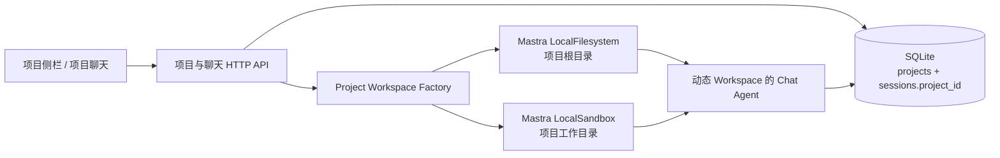

# 项目聊天与 Mastra Workspace 设计

**文档编号：** 001
**版本：** v1.0
**日期：** 2026-08-03
**状态：** 已获用户确认，待转实现计划
**范围：** 聊天页面的项目管理、项目会话归属、项目目录选择与默认工作区、Mastra Workspace 运行时挂载。

## 1. 背景与目标

BloomAI 当前以平铺的聊天会话列表展示全部 `sessions`。本设计引入“项目”，让用户可以把多条独立聊天组织到同一个本地工作目录中，并在这些聊天执行任务时获得该目录的文件读写和命令执行能力。

目标：

1. 在“聊天”页面的会话侧栏显示“项目”和“最近”两个区域。
2. 用户可新建项目，并选择一个已有文件夹作为项目根目录；不选择时，系统自动在 `<DATA_DIR>/workspaces/` 下创建 `NewProject1`、`NewProject2` 等目录。
3. 每个项目下的聊天独立保存会话和记忆，但共享项目根目录。
4. 项目聊天通过 Mastra Workspace 的 `LocalFilesystem` 与 `LocalSandbox` 获得根目录内的文件操作和以该目录为工作目录的命令执行能力。
5. “最近”仅显示不属于项目的普通聊天。
6. 支持项目、项目聊天和普通聊天的渐进展开，避免过长侧栏。

非目标（V1）：

- 项目重命名、删除、转移聊天、重新选择项目目录。
- OS 级沙箱隔离、容器运行时、Git 管理、项目级设置页面。
- 通过项目功能修改现有消息存储、Persona、模型或任务时间线的核心行为。

## 2. 现有架构与约束

- 现有会话侧栏在 `src/renderer/pages/Chat/SessionList.tsx` 中渲染，应用在 `src/renderer/App.tsx` 中挂载。
- 现有 SQLite `sessions` 表保存会话元数据，`messages` 表以 `session_id` 保存消息。
- `DATA_DIR` 由 `src/server/db/paths.ts` 的 `getDataDir()` 解析；默认值是用户主目录下的 `.bloomai`。
- Electron 当前已有安全的 `contextBridge` 和 IPC 常量模式，但没有目录选择通道。
- `chatAgent` 是单例 Agent，已有基于 `requestContext` 的动态模型、指令和工具配置。
- 项目锁定 `@mastra/core@1.51.0`，其 Workspace 支持动态挂载，并提供 `Workspace`、`LocalFilesystem` 和 `LocalSandbox`。

## 3. 已选架构

采用“BloomAI 管项目元数据，Mastra Workspace 管项目运行环境”的方案。



职责划分：

| 层 | 职责 |
|---|---|
| SQLite `projects` | 保存项目名、目录路径、目录来源和时间戳。 |
| SQLite `sessions.project_id` | 保存聊天是否归属项目。`NULL` 代表普通聊天。 |
| 项目目录 | 保存用户文件、代码、任务产物。 |
| Workspace Factory | 根据已验证的项目记录构造/复用 Workspace。 |
| Chat Agent | 在本次请求属于项目会话时，动态接收该项目的 Workspace。 |

不使用 Mastra Workspace storage 作为项目元数据的主存储，以避免与既有 Drizzle/SQLite 会话存储形成双重数据源。

## 4. 数据模型与迁移

### 4.1 `projects` 表

新增表：

```ts
projects {
  id: string                         // UUID 主键
  name: string                       // 用户输入、去除首尾空格后的项目名称
  root_path: string                  // 规范化绝对目录路径
  directory_kind: 'auto' | 'selected'
  created_at: number
  updated_at: number
}
```

约束：

- `name` 为 1–80 字符的非空值。
- `root_path` 必须为已验证的绝对目录路径。
- 同一规范化路径只允许绑定一个项目；Windows 路径按大小写不敏感规则去重。
- `directory_kind = auto` 代表系统默认创建；`selected` 代表用户在原生目录选择器中选择。

### 4.2 `sessions` 表扩展

新增可空字段：

```ts
project_id: string | null
```

新增索引：

```text
idx_sessions_project_updated(project_id, updated_at DESC)
```

迁移规则：

- 所有历史会话的 `project_id` 初始化为 `NULL`。
- 历史会话因此自动归入“最近”，不丢失数据，也不创建虚假项目。
- 不调整 `messages` 表；消息继续由 `session_id` 关联。

### 4.3 最近活动

项目内会话创建、用户消息持久化或助手消息持久化时，触碰（touch）对应项目的 `updated_at`。项目侧栏据此按最近活动倒序排列。

## 5. 目录规则与创建事务

### 5.1 目录来源

**选择已有目录**：

1. 渲染进程通过受限 Electron IPC 打开 `openDirectory` 对话框。
2. 用户取消选择时，不修改弹窗状态以外的数据。
3. 服务端接收所选绝对路径后再次验证：路径绝对、存在、为目录、未被另一项目使用。

**未选择目录**：

1. 新增 `getWorkspacesDir()`，返回 `<DATA_DIR>/workspaces`。
2. 确保该目录存在。
3. 在其中创建 `NewProjectN`。N 使用“当前最大编号 + 1”策略，且 `mkdir` 遇到竞争时继续尝试下一个编号；不复用已用编号。
4. 用户填写的项目名和默认磁盘目录名可以不同。

### 5.2 创建项目的原子体验

项目创建的成功语义是：项目目录可用、项目记录创建成功、第一条项目聊天创建成功。

返回：

```ts
{
  project: ProjectSummary,
  initialSession: Session
}
```

失败补偿：

- 自动创建目录后数据库创建失败：仅当该目录由本次操作创建且仍为空时删除该目录。
- 用户选择的已有目录：永不因失败而删除或更改。
- 第一条会话创建失败：回滚数据库项目记录；自动创建且为空的目录按上条规则清理。

## 6. IPC 与 HTTP 契约

### 6.1 目录选择 IPC

新增常量：

```ts
IPC_CHANNELS.dialogSelectDirectory = 'dialog:select-directory'
```

调用链：

```text
CreateProjectDialog
  → window.bloomai.selectDirectory()
  → preload contextBridge
  → Electron main
  → dialog.showOpenDialog({ properties: ['openDirectory'] })
```

返回值：

```ts
{ canceled: boolean; path?: string }
```

该通道不暴露通用文件系统 API。

### 6.2 项目 API

```text
GET    /api/projects
POST   /api/projects
GET    /api/projects/:id/sessions?limit=10&offset=0
POST   /api/projects/:id/sessions
```

项目摘要：

```ts
type ProjectSummary = {
  id: string
  name: string
  rootPath: string
  directoryKind: 'auto' | 'selected'
  createdAt: number
  updatedAt: number
  sessionCount: number
}
```

创建请求：

```ts
{ name: string; sourceDirectory?: string }
```

### 6.3 会话 API

保留现有会话 CRUD，并支持：

```text
GET /api/sessions?scope=recent&limit=15&offset=0
```

- `scope=recent` 等价于查询 `project_id IS NULL`。
- 新版项目侧栏不一次性加载全部会话。
- 项目中新建聊天优先使用 `POST /api/projects/:id/sessions`，由服务端写入项目归属，避免由前端任意传递 `project_id`。

## 7. Mastra Workspace 运行时

新增模块：

```text
src/server/mastra/workspace/
  project-workspace.factory.ts
  project-workspace.policy.ts
```

Factory 接口：

```ts
getForProject(project: Project): Workspace
dispose(projectId: string): Promise<void>
shutdown(): Promise<void>
```

每个项目 Workspace：

```ts
new Workspace({
  filesystem: new LocalFilesystem({ basePath: project.root_path }),
  sandbox: new LocalSandbox({ workingDirectory: project.root_path }),
})
```

Chat 请求流：

```text
客户端提交 sessionId
  → 服务端读取 sessions.project_id
  → 服务端读取 projects.root_path
  → 在 requestContext 写入可信 projectId
  → chatAgent 动态解析 Workspace
```

Agent 使用动态回调：

```ts
workspace: ({ requestContext }) => {
  const projectId = requestContext?.get('projectId')
  return projectId ? projectWorkspaceFactory.getForProjectId(projectId) : undefined
}
```

规则：

- 不修改全局单例 Agent 的 Workspace 属性，避免并发会话串目录。
- 客户端不得直接指定 Workspace 或项目目录；服务器只相信 session 的持久化归属。
- 普通聊天返回 `undefined`，因此不加载项目 Workspace。
- 已有 `buildAgentTools(sessionId)` 继续存在；需在实现时验证没有与 Mastra Workspace 工具 ID 冲突。
- 应用关闭时清理缓存的 Workspace 和 LocalSandbox 资源。

### 7.1 安全边界

本地 Workspace 的文件工具以项目根目录为边界，命令以该根目录为工作目录。但 `LocalSandbox` 的工作目录不保证等于 OS 级隔离，尤其 Windows 上没有可用系统隔离后端时，命令可能仍通过绝对路径访问主机其他位置。

V1 措施：

1. 文件工具限定项目根目录。
2. 命令默认从项目目录启动。
3. Workspace 指令明确要求 Agent 只操作当前项目目录。
4. 高风险操作继续通过既有工具确认机制处理。
5. UI 显示当前授权目录。

V1 不承诺容器或 VM 级隔离；如需强隔离，后续另行引入容器、受限 VM 或远程 Sandbox。

## 8. 侧栏与 UI 设计

### 8.1 结构

点击最左侧“聊天”导航后，侧栏显示：

```text
项目 ⌄                                  …  +
├─ 项目文件夹（最多 6 个）
└─ 更多文件夹

最近 ⌄                                  …  ✎
└─ 不属于任何项目的普通聊天
```

主聊天区继续复用现有消息、流式任务执行和会话操作 UI。

### 8.2 项目区

- 标题的 `+` 打开创建项目弹窗。
- 标题的 `…` 在 V1 提供“展开全部文件夹 / 收起全部文件夹”。
- 项目按最近活动倒序。
- 关闭使用 `Folder` 图标，展开使用 `FolderOpen` 图标。
- 采用手风琴模式：一次仅展开一个项目。
- 单击项目行可展开/收起。
- 项目行悬浮时显示 `+`，用于在该项目中新建聊天。
- 默认显示前 6 个项目；超过 6 个时显示“更多文件夹”。点击显示所有，并切换为“收起文件夹”。

### 8.3 项目内会话

- 首次展开显示该项目最近更新的前 10 条会话。
- 会话总数超过 10 条时显示“展开显示”。
- 点击后显示该项目全部会话，并将文字切换为“收起显示”。
- 当前会话继续使用现有激活背景、重命名与删除交互。

### 8.4 最近会话

- 仅包含 `project_id IS NULL` 的会话。
- 初次加载 15 条。
- “更多”的累计显示规则为：15 → 30 → 60 → 120……；每次新增数量依次为 15、30、60、120……，直到所有记录显示。
- 标题右侧的 `✎` 创建普通聊天，即 `project_id = NULL`。

### 8.5 创建项目弹窗

字段与交互：

| 项目 | 规范 |
|---|---|
| 标题 | “创建项目”，右上角关闭按钮。 |
| 项目名称 | 必填、自动聚焦、1–80 字符。 |
| 源文件夹 | 可选；以大面积选择区域触发原生目录选择。 |
| 已选目录 | 显示目录名和可截断绝对路径；可再次选择替换。 |
| 未选目录 | 说明自动创建 `<DATA_DIR>/workspaces/NewProjectN`。 |
| 按钮 | 无效项目名时禁用创建；提交期间禁用重复提交。 |
| 快捷键 | `Esc` 取消，字段有效时 `Enter` 创建。 |

创建成功后：

1. 刷新项目列表；
2. 自动展开新项目；
3. 自动创建并选中第一条项目聊天；
4. 主聊天区立即可在该项目目录执行任务。

### 8.6 主聊天区项目上下文

项目会话显示：

```text
项目：{projectName} · 工作目录：{rootPath}
```

输入区显示轻量提示：

```text
当前任务可读取、编辑并在“{projectName}”项目文件夹中执行命令。
```

普通聊天不显示这些信息，也不挂载 Workspace。

### 8.7 空、加载和错误状态

| 场景 | UI |
|---|---|
| 无项目 | “还没有项目”及“创建项目”按钮。 |
| 无普通聊天 | “暂无普通聊天”及“新建聊天”按钮。 |
| 展开项目加载中 | 2–3 条骨架行。 |
| 创建失败 | 弹窗内联显示错误，保留名称与目录选择。 |
| 路径重复 | 显示已绑定该路径的项目名称。 |
| 目录不可访问 | 显示目录存在性/权限错误。 |
| 项目目录后来被删除 | 项目保留并标记“目录不可用”；禁止 Workspace 工具执行。 |

## 9. 前端模块边界

建议组件：

```text
src/renderer/pages/Chat/
  ProjectSessionSidebar.tsx
  ProjectTree.tsx
  ProjectSessions.tsx
  RecentSessions.tsx
  CreateProjectDialog.tsx
  project-sidebar.utils.ts
```

UI 状态：

```ts
type ProjectSidebarUiState = {
  expandedProjectId: string | null
  projectListExpanded: boolean
  expandedProjectSessions: Set<string>
  recentVisibleCount: number
}
```

该 UI 状态可保存在本地存储以恢复展开偏好；项目路径、权限和 Workspace 状态只能以服务端记录为准。

## 10. 验收标准

1. 旧会话升级后全部显示在“最近”，消息仍可正常加载。
2. 用户能选择已有目录创建项目；项目聊天能在该目录获得 Workspace 工具。
3. 未选目录时依次创建 `<DATA_DIR>/workspaces/NewProject1`、`NewProject2` 等目录。
4. 新建项目后自动创建并进入首条项目聊天。
5. 项目展开默认显示 10 条，更多时可一次展开全部。
6. 项目超过 6 个时显示“更多文件夹”，并可折叠回 6 个。
7. “最近”初始 15 条，随后显示数量按 30、60、120……增长，直到全部展示。
8. 项目会话永不出现在“最近”；普通会话永不出现在项目内。
9. 并发项目会话不会互相使用对方的 Workspace 根目录。
10. 普通聊天不加载项目 Workspace。
