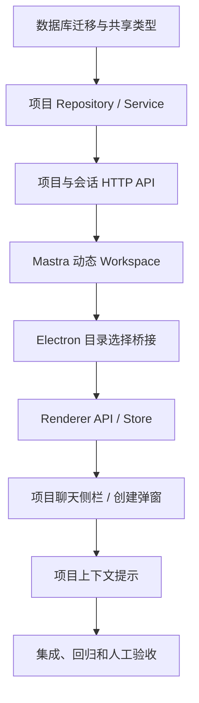

# 项目聊天与 Mastra Workspace 实施计划

**文档编号：** 002
**版本：** v1.0
**日期：** 2026-08-03
**状态：** 已完成，待实施
**关联设计：** `docs/workspaces/001-project-chat-workspace-design-v1.0.md`

## 1. 实施目标

将已确认的项目聊天设计落地到 BloomAI：

1. 项目和普通聊天在聊天侧栏中分别展示为“项目”和“最近”。
2. 项目保存本地根目录；项目聊天在该目录下通过 Mastra Workspace 读写文件和执行命令。
3. 未选目录的项目在 `<DATA_DIR>/workspaces/NewProjectN` 创建目录。
4. 创建项目时自动创建并打开第一条项目聊天。
5. 项目列表、项目内聊天和“最近”聊天均按已确认的展开/分页规则工作。
6. 旧会话保持可用，并自动归入“最近”。

本计划只覆盖 V1。项目删除/重命名/迁移、强 OS 级隔离、Git 和项目设置不在本次实施范围内。

## 2. 交付策略与依赖顺序

按以下顺序实现并在每一阶段运行相应测试，避免 UI 先于数据契约完成：



实施时先写失败测试，再实现最小代码使测试通过。测试以已有 Vitest 单进程命令为准：

```powershell
npm test -- --runInBand
npm run typecheck
npm run build
```

项目当前的 `test` 脚本已限制单 worker；实际执行时使用 `npm test` 即可，不额外引入 Jest 参数。

## 3. 数据库与共享契约

### 3.1 新增迁移

**新增：** `scripts/migrations/025-project-chat-workspaces.sql`

按当前 `scripts/migrations/001…024` 的递增编号规则新增迁移，且只编写可前向执行的 SQL：

1. 创建 `projects` 表：
   - `id TEXT PRIMARY KEY`
   - `name TEXT NOT NULL`
   - `root_path TEXT NOT NULL`
   - `directory_kind TEXT NOT NULL CHECK (directory_kind IN ('auto', 'selected'))`
   - `created_at INTEGER NOT NULL`
   - `updated_at INTEGER NOT NULL`
2. 创建路径去重索引：
   - `root_path COLLATE NOCASE` 唯一索引，用于 Windows 下大小写不敏感的项目目录去重。
3. 创建项目排序索引：
   - `idx_projects_updated(updated_at DESC)`。
4. 为 `sessions` 添加可空 `project_id TEXT` 列。
5. 创建 `idx_sessions_project_updated(project_id, updated_at DESC)`。
6. 不添加强制外键：现有会话表和迁移未使用外键约束，V1 由应用服务保证项目存在性，避免对归档历史数据产生迁移风险。

**验证：**

- 旧数据库升级时迁移成功，历史 `sessions.project_id` 为 `NULL`。
- 空数据库执行所有迁移后，表、列和三个索引均存在。
- 再次运行迁移不会重复执行 `025`。

### 3.2 ORM Schema

**修改：** `src/server/db/schema.ts`

1. 新增 Drizzle `projects` 表声明，字段与迁移完全一致。
2. 在 `sessions` 表声明新增 `project_id` 可空字段。
3. 在 ORM schema 中声明项目更新时间和项目会话查询所需索引，保持 fresh-db schema 与 SQL migration 一致。
4. 导出 `ProjectRow` / `$inferSelect` 的可用类型，避免 service 内部使用重复匿名对象。

**新增或修改测试：** `src/server/db/migrations.test.ts`

- 增加针对 `025-project-chat-workspaces.sql` 的断言：列、表、索引、历史会话兼容性和幂等性。

### 3.3 跨端共享类型

**修改：** `src/shared/schemas/index.ts`

1. 为 `Session` 增加 `project_id: string | null`。
2. 新增 `Project`、`ProjectSummary`、`CreateProjectInput`、`ProjectDirectoryKind` 等共享 DTO/Schema。
3. 新增统一分页 DTO：
   - `SessionPage { data: Session[]; meta: { total; limit; offset } }`
4. 为创建项目输入约束项目名：`trim()` 后非空、最大 80 字符。

**新增测试：** `src/shared/schemas/index.test.ts`（若当前文件没有对应测试，则新建）

- 空白名称、超过 80 字符、错误 `directory_kind`、分页元数据等边界。

## 4. 服务端领域层、目录规则与原子创建

### 4.1 DATA_DIR 工作区路径

**修改：** `src/server/db/paths.ts`

新增：

```ts
getWorkspacesDir(): string
```

返回 `path.join(getDataDir(), 'workspaces')`；由调用方在创建默认项目时使用 `mkdirSync(..., { recursive: true })` 创建。

**新增测试：** `src/server/db/paths.test.ts`（若不存在则新建）

- `DATA_DIR` 已配置和未配置时均生成正确的 `workspaces` 路径。
- 此函数只解析路径，不产生目录副作用。

### 4.2 项目 Repository

**新增：** `src/server/db/repositories/project.repo.ts`

职责仅限 SQLite CRUD 和可组合的查询，不负责文件系统副作用：

```ts
get(id): Project | undefined
getByRootPath(rootPath): Project | undefined
listSummaries(): ProjectSummary[]
create(input): Project
updateTimestamp(id): void
countProjectSessions(projectId): number
listProjectSessions(projectId, { limit, offset }): Session[]
createProjectSession(projectId, sessionInput): Session
```

实现要求：

- 项目列表按 `projects.updated_at DESC`。
- `sessionCount` 用聚合查询取得，避免侧栏对每个项目单独查询。
- 项目内会话只查询 `status = 'active' AND project_id = ?`，按 `updated_at DESC`。
- `createProjectSession` 必须写入对应的 `project_id`。
- 项目会话被创建、更新标题、touch、归档时的项目 `updated_at` 由 service 层统一触碰，避免 repository 相互耦合。

**新增测试：** `src/server/db/repositories/project.repo.test.ts`

覆盖：创建、按路径去重、项目排序、会话计数、项目会话分页、归档会话不计入项目列表。

### 4.3 Session Repository 与服务调整

**修改：** `src/server/db/repositories/session.repo.ts`

1. `Session` repository 类型增加 `project_id`。
2. `create` 接受可选 `project_id`，但普通聊天调用的默认值为 `null`。
3. 新增 `listPage({ scope, limit, offset })`：
   - `scope = recent`：仅 `project_id IS NULL`；
   - 保留 `list()`，作为旧调用的兼容入口，直到 Renderer 全量迁移完成。
4. `touch`、`delete` 的调用结果要让上层能判断所属项目，以便更新项目排序时间。

**修改：** `src/server/services/session.service.ts`

1. 公开普通会话分页查询，并验证 `limit`、`offset`。
2. 创建普通会话时固定 `project_id = null`。
3. 更新/删除项目会话时，在成功后触碰其项目的 `updated_at`。
4. 不允许普通会话 API 把任意会话偷偷挂到项目中；项目会话仅从项目 service 创建。

**修改：** `src/server/services/session.service.test.ts`

增加普通/项目会话归属、recent 过滤、删除项目会话后项目更新时间变化的测试。

### 4.4 项目 Service

**新增：** `src/server/services/project.service.ts`

该 service 是项目的唯一业务入口，负责输入校验、路径规范化、目录创建、数据库协调和失败补偿。

核心流程 `createProject(input)`：

1. 校验并清理项目名。
2. 如果提供 `sourceDirectory`：
   - 调用 `path.resolve`；
   - 确认存在、是目录；
   - 调用 `fs.realpathSync` 作为持久化路径，降低 `..` 和符号链接别名风险；
   - 标记 `directoryKind = 'selected'`。
3. 如果未提供目录：
   - 确保 `getWorkspacesDir()` 存在；
   - 扫描 `NewProject(\d+)` 的已存在目录及已登记的 auto 项目；
   - 从最大编号 + 1 开始原子创建目录；遇 `EEXIST` 继续递增；
   - 标记 `directoryKind = 'auto'`。
4. 检查规范化目录是否已注册；重复时抛出可映射到 HTTP 409 的领域错误，并携带已占用项目名。
5. 在一个数据库事务中创建项目记录和第一条 `New Chat` 项目会话。
6. 若事务失败：
   - 对本次自动创建、仍为空的目录执行受保护清理；
   - 对用户选择的目录不做任何删除或修改。
7. 返回 `{ project, initialSession }`。

其他方法：

```ts
listProjects(): ProjectSummary[]
listProjectSessions(projectId, page): SessionPage
createProjectSession(projectId, sessionInput): Session
resolveProjectForSession(sessionId): Project | null
```

`resolveProjectForSession` 必须从数据库查询，不接受客户端传入的目录或项目 ID 作为可信权限依据。

**新增测试：** `src/server/services/project.service.test.ts`

至少覆盖：

- 选择已有目录创建项目；
- 自动目录依序创建 `NewProject1`、`NewProject2`；
- 已存在 `NewProject1`、`NewProject3` 时下一个为 `NewProject4`；
- 选定目录重复注册返回冲突；
- 无效名称、文件路径而非目录、不存在目录；
- 初始项目会话创建；
- DB 失败时 auto 目录的安全补偿；
- selected 目录失败时不删除用户目录。

## 5. HTTP API

### 5.1 项目路由

**新增：** `src/server/http/routes/projects.ts`

实现以下路由：

```text
GET    /projects
POST   /projects
GET    /projects/:id/sessions?limit=10&offset=0
POST   /projects/:id/sessions
```

HTTP 行为：

| 路由 | 成功 | 失败 |
|---|---|---|
| `GET /projects` | `200 { data: ProjectSummary[] }` | `500` |
| `POST /projects` | `201 { data: { project, initialSession } }` | `400` 输入/目录无效；`409` 目录重复 |
| `GET /projects/:id/sessions` | `200 { data, meta }` | `404` 项目不存在；`400` 分页无效 |
| `POST /projects/:id/sessions` | `201 { data: Session }` | `404` 项目不存在；`400` 输入无效 |

复用 `readJson` 和现有 `ServiceError` → HTTP error mapper，不在路由中实现目录或数据库业务规则。

**修改：** `src/server/http/app.ts`

1. 导入 `projectsRoutes`。
2. 将其挂载到 `/projects`。
3. 保持 `/sessions`、`/chat` 等既有路由顺序和行为不变。

**新增测试：** `src/server/http/routes/projects.test.ts`

使用与 `sessions.test.ts` 相同的临时 `DATA_DIR` + 真实迁移测试夹具，验证完整请求/响应、冲突映射、分页和初始会话。

### 5.2 普通聊天分页

**修改：** `src/server/http/routes/sessions.ts`

1. `GET /sessions` 兼容原无参数调用。
2. `scope=recent` 时读取 `limit`、`offset`，返回 page DTO。
3. 未指定 `scope` 时返回原有 `Session[]` 形状，以免现有调用同步破坏；Renderer 完成迁移后可在后续版本收敛协议。
4. 拒绝未知 `scope`、负数、非整数和超上限的分页参数。

**修改：** `src/server/http/routes/sessions.test.ts`

增加：`scope=recent` 不返回项目会话、分页 `meta.total` 正确、旧的无参数 GET 返回兼容形状。

## 6. Mastra 动态 Workspace

### 6.1 Workspace 策略与工厂

**新增：** `src/server/mastra/workspace/project-workspace.policy.ts`

导出仅描述当前目录边界的稳定指令文本。例如：

```text
当前任务拥有项目工作目录。只读取、编辑、创建和执行当前项目根目录内的文件；
不要使用绝对路径访问项目目录以外的位置。执行命令前确认它们的副作用。
```

不得把此文本当作 OS 级安全措施；它只帮助模型遵循产品边界。

**新增：** `src/server/mastra/workspace/project-workspace.factory.ts`

1. 维护按项目 ID 缓存的 `Workspace`。
2. 每个实例使用：

```ts
new Workspace({
  filesystem: new LocalFilesystem({ basePath: project.root_path }),
  sandbox: new LocalSandbox({ workingDirectory: project.root_path }),
})
```

3. 缓存命中前核对根目录路径；路径变化时销毁旧 Workspace 后重建。
4. 路径缺失或非目录时抛出明确 `PROJECT_WORKSPACE_UNAVAILABLE` 错误，避免降级到主机默认工作目录。
5. 暴露 `dispose(projectId)`、`shutdown()` 清理 `LocalSandbox` 等资源。
6. 不在工厂内执行用户命令，也不接受前端路径。

**新增测试：** `src/server/mastra/workspace/project-workspace.factory.test.ts`

通过 mock `Workspace`、`LocalFilesystem`、`LocalSandbox` 或临时目录，验证根目录映射、按项目隔离、缓存复用、路径变更重建、目录缺失错误和 shutdown 清理。

### 6.2 Chat Agent 与请求上下文

**修改：** `src/server/mastra/chat-agent.ts`

1. 为当前单例 `chatAgent` 新增动态 `workspace` 回调。
2. 回调仅从 `requestContext.get('projectId')` 获取项目 ID。
3. 无项目 ID 时返回 `undefined`，普通聊天不获得 Workspace 工具。
4. 保留现有动态 `tools`；实现时验证并解决 Workspace 工具与 `buildAgentTools` 工具 ID 重名问题。

**修改：** `src/server/services/chat.service.ts`

1. 在 `streamChat` 调用 `chatAgent.stream` 前，根据可信 `sessionId` 调用 `projectService.resolveProjectForSession`。
2. 若存在项目，写入 `requestContext.projectId`，并追加项目 Workspace 策略指令或由 Workspace 提供指令。
3. 不从 request body/header 接收可直接生效的 `projectId`、`rootPath`。
4. 若项目记录存在但目录不可用，向 UI 流返回可理解错误，且不启动模型/命令工具。
5. `proposePlan` 和其他需要同一 Agent 的路径也使用相同的可信上下文解析，避免“计划模式”和“执行模式”权限不同。

**修改：** `src/server/services/chat.service.test.ts`

增加：

- 项目 session 写入正确 `projectId`；
- 普通 session 没有 Workspace；
- 伪造 body/header 的 project ID 不生效；
- 项目目录缺失时返回 workspace 不可用错误；
- 两个并发项目会话观察到不同的项目 ID/根目录。

### 6.3 运行时关闭

**修改：** `src/server/mastra/index.ts`

把 `projectWorkspaceFactory.shutdown()` 纳入已有 `shutdownMastraRuntime()` 链路。`src/server/index.ts` 已调用该统一关闭函数，因此不在 server entry 额外注册重复信号处理器。

**新增或修改测试：** `src/server/mastra/index.test.ts`（若当前无对应文件则新建）

验证关闭运行时会调用 Workspace Factory 的 shutdown，且原有 scheduler/telemetry 生命周期不回归。

## 7. Electron 目录选择与 Renderer API

### 7.1 IPC 常量、主进程与 Preload

**修改：** `src/shared/constants/ipc.ts`

新增：

```ts
dialogSelectDirectory: 'dialog:select-directory'
```

**修改：** `src/main/index.ts`

在 `setupIPC()` 内新增 handler：

```ts
dialog.showOpenDialog(focusedWindow, {
  properties: ['openDirectory'],
})
```

只返回 `{ canceled, path }`。不要返回原始 Electron `OpenDialogReturnValue`，也不要允许 Renderer 指定任意 Dialog options。

**修改：** `src/preload/index.ts`

通过 `contextBridge` 暴露：

```ts
selectDirectory(): Promise<{ canceled: boolean; path?: string }>
```

**新增：** `src/renderer/types/bloomai.d.ts`

声明 `window.bloomai` 的精确类型，覆盖已有 clipboard、window、shell、saveImage 和新 `selectDirectory` 方法；逐步替代 Renderer 内部的 `window as any` 使用。

**新增测试：**

- `src/main/index` 的 handler 难以在 Electron 真实进程单测时，提取一个小的 dialog result mapper 纯函数到 `src/main/ipc/dialogs.ts` 并为其创建 `src/main/ipc/dialogs.test.ts`。
- 测试取消时不含 `path`，选择时只返回首个目录。

### 7.2 Renderer HTTP / 平台封装

**修改：** `src/renderer/api/index.ts`

新增类型化方法：

```ts
getProjects(): Promise<ProjectSummary[]>
createProject(input): Promise<{ project: ProjectSummary; initialSession: Session }>
getProjectSessions(projectId, page): Promise<SessionPage>
createProjectSession(projectId, input?): Promise<Session>
getRecentSessions(page): Promise<SessionPage>
selectDirectory(): Promise<{ canceled: boolean; path?: string }>
```

要求：

- 所有 path parameter 使用 `encodeURIComponent`。
- 将非成功 HTTP 映射为现有一致的 Error 信息，供弹窗内联显示。
- `selectDirectory` 在非 Electron 运行时返回受控错误或 `{ canceled: true }`，不能降级为可任意输入绝对路径。

**新增测试：** `src/renderer/api/projects.test.ts`

mock `fetch` 和 `window.bloomai`，验证每条 API 的 URL、HTTP method/body、错误映射、目录选择取消与成功。

## 8. Renderer Store 与页面集成

### 8.1 Store

**修改：** `src/renderer/store/index.ts`

保留 `useSessionStore` 作为会话实体和当前激活会话的唯一来源，但进行增量扩展：

1. `sessions` 作为已加载会话的去重 cache，新增 `upsertSessions`，避免最近列表和项目列表覆盖对方。
2. 新增 recent page 状态：`recentSessionIds`、`recentTotal`、`recentVisibleCount`、`recentLoading`。
3. 新增 `loadRecentSessions({ replace, limit })`；按已确认的 15 → 30 → 60… 累计规则请求并合并数据。
4. 新增 `createProjectSession(projectId)`，成功后 cache 会话并激活。
5. 删除会话后同步从 recent ID 列表和各项目已加载会话 cache 中剔除；由项目 store 刷新该项目的 `sessionCount`。
6. 新增 `useProjectStore`：`projects`、`loadProjects`、`createProject`、`refreshProject`、项目加载/错误状态。
7. `createProject` 成功后：更新项目列表、缓存 `initialSession`、激活首会话、返回 `{ project, initialSession }`。

**新增测试：** `src/renderer/store/project-session.store.test.ts`

覆盖：recent 合并与去重、15→30→60 增长、项目创建自动激活、项目 session 创建、删除后 cache 一致性和 API 失败回滚。

### 8.2 应用启动与快捷键

**修改：** `src/renderer/App.tsx`

1. 将 `SessionList` 替换为 `ProjectSessionSidebar`。
2. 初次加载设置、Persona 后并行加载项目摘要与 recent 首页；不再通过 `loadSessions()` 一次性读取全部会话。
3. `Ctrl/Cmd + N` 继续创建普通聊天，确保语义是 `project_id = NULL`。
4. 保持当前工具、设置、图像、定时任务页面的挂载行为不变。

**修改或移除：**

- `src/renderer/pages/Chat/SessionList.tsx`
- `src/renderer/pages/Chat/SessionList.test.tsx`

将原有标题编辑/删除逻辑迁入共享会话行组件或新的项目/最近列表；在新侧栏已覆盖等价测试后删除旧组件，避免保留两套会话侧栏。

## 9. 项目聊天侧栏与弹窗

### 9.1 组件

**新增：** `src/renderer/pages/Chat/ProjectSessionSidebar.tsx`

职责：编排“项目”和“最近”两个区域；持有纯 UI 状态：

```ts
expandedProjectId: string | null
projectListExpanded: boolean
expandedProjectSessions: Set<string>
recentVisibleCount: number
isCreateProjectDialogOpen: boolean
```

使用手风琴模式，一次只展开一个项目。可用 localStorage 持久化上述展开偏好，但不得持久化目录权限或 Workspace 状态。

**新增：** `src/renderer/pages/Chat/ProjectTree.tsx`

- 显示前 6 个项目。
- `> 6` 时显示“更多文件夹”；完全展开后显示“收起文件夹”。
- 使用 Lucide `Folder` / `FolderOpen`，项目行悬浮时显示“在此项目中新建聊天”的 `Plus`。
- 可访问性：项目行使用 button，具备 `aria-expanded`、项目名和会话数量描述。

**新增：** `src/renderer/pages/Chat/ProjectSessions.tsx`

- 展开项目时请求前 10 条；显示加载骨架。
- 总数超过 10 时显示“展开显示”；点击后请求全部并切换到“收起显示”。
- 复用会话行的选中、重命名、删除操作。

**新增：** `src/renderer/pages/Chat/RecentSessions.tsx`

- 显示 recent cache。
- “更多”按累计 15、30、60、120…请求；全量显示后隐藏按钮。
- 支持空态、加载态、错误重试和普通聊天新建按钮。

**新增：** `src/renderer/pages/Chat/CreateProjectDialog.tsx`

- 项目名自动聚焦，提交前 trim、校验 1–80 字符。
- 点击目录选择区域调用 `platform.selectDirectory()`。
- 已选择时展示 basename 和可截断绝对路径；取消选择不清空现有值。
- `Esc`、关闭按钮、取消按钮关闭；`Enter` 在合法且不提交时创建。
- 提交中禁用重复点击；错误在弹窗内显示并保留输入。

**新增：** `src/renderer/pages/Chat/project-sidebar.utils.ts`

纯函数：

```ts
nextRecentVisibleCount(current, total): number
visibleProjectCount(total, expanded): number
shouldShowProjectSessionsMore(total, expanded): boolean
```

其中 recent 的规则必须准确实现为：初始 15；第一次更多后 30；然后 60、120……，且不超过 total。

### 9.2 会话行复用

**新增：** `src/renderer/pages/Chat/SessionRow.tsx`

从旧 `SessionList` 提取会话选择、键盘操作、重命名弹窗和删除确认逻辑。接收 `session`、`isActive`、`onSelect`、`onDeleted`，不关心会话属于项目还是最近。

这样项目内和最近区不会复制同一套编辑/删除代码。

### 9.3 项目上下文提示

**新增：** `src/renderer/pages/Chat/ProjectWorkspaceContext.tsx`

当 active session 有项目归属时显示：

```text
项目：{projectName} · 工作目录：{rootPath}
当前任务可读取、编辑并在“{projectName}”项目文件夹中执行命令。
```

普通聊天不渲染此组件。目录不可用时显示 warning，并禁用/阻止发送前端可识别的 workspace 任务请求，最终仍由服务端作权威校验。

**修改：** `src/renderer/pages/Chat/ChatPanelMastra.tsx`

在当前会话标题或输入区附近挂载 `ProjectWorkspaceContext`；不改变消息流协议、计划卡、深度研究或附件行为。

### 9.4 样式

**修改：** `src/renderer/styles/global.css`

在现有 `.session-*` 样式之后增加模块化前缀样式：

```text
.project-sidebar-*
.project-tree-*
.project-session-*
.recent-session-*
.create-project-*
.workspace-context-*
```

视觉要求：

- 和参考图一致的轻量级目录层次与浅灰激活背景；
- 文件夹开/关使用轮廓 icon；
- “更多文件夹”“展开显示”“更多”使用低对比文字按钮；
- 弹窗为单栏布局，大型目录选择区，主按钮为深色；
- 不影响现有图像工作台的 `.session-list-*` 样式。

### 9.5 前端测试

**新增：**

```text
src/renderer/pages/Chat/ProjectSessionSidebar.test.tsx
src/renderer/pages/Chat/ProjectTree.test.tsx
src/renderer/pages/Chat/ProjectSessions.test.tsx
src/renderer/pages/Chat/RecentSessions.test.tsx
src/renderer/pages/Chat/CreateProjectDialog.test.tsx
src/renderer/pages/Chat/project-sidebar.utils.test.ts
src/renderer/pages/Chat/ProjectWorkspaceContext.test.tsx
```

覆盖：

- 6 个与 7 个项目的“更多文件夹”；
- 手风琴切换；
- 项目 10 条和 11 条会话的展开/收起；
- recent 的 15、30、60 阶段和最终隐藏更多；
- 创建项目目录选择、取消、输入校验、API 错误和成功后打开首会话；
- 项目/普通新建聊天归属；
- 上下文提示只出现在项目会话。

## 10. 实施步骤清单

### 阶段 A：可迁移数据基础

1. 新增 SQL migration `025-project-chat-workspaces.sql`。
2. 更新 Drizzle schema 与 shared DTO。
3. 先补 migration/schema 测试，运行：

```powershell
npm test -- src/server/db/migrations.test.ts
npm test -- src/shared/schemas/index.test.ts
```

完成标准：旧库和新库都能应用迁移，历史聊天均为 recent。

### 阶段 B：项目领域与 API

1. 新增 project repository、project service 和测试。
2. 增强 session repository/service 的 recent 分页和项目更新时间行为。
3. 新增 projects HTTP route，并在 Hono app 注册。
4. 补齐 API route 测试。

完成标准：仅通过 HTTP API 即可创建 selected/auto 项目、首项目会话、项目聊天和 recent 分页。

### 阶段 C：Workspace 权限链路

1. 新增 workspace policy 和 factory。
2. 为 chatAgent 添加动态 Workspace。
3. 在 chat service 从 `sessionId` 推导可信 `projectId`。
4. 纳入 Mastra shutdown 生命周期。
5. 添加并发隔离、路径缺失、普通聊天无 Workspace 测试。

完成标准：服务端永不信任客户端路径；不同项目会话不会共享目录。

### 阶段 D：桌面桥接和 Renderer 数据层

1. 新增目录选择 IPC、preload API 和 Window 类型。
2. 扩展 renderer platform API。
3. 实现 project store 与 recent page state。
4. 更新 App 初始化和普通聊天快捷键。

完成标准：Renderer 能选择目录、调用项目 API、保留普通聊天创建语义。

### 阶段 E：侧栏与弹窗

1. 实现项目树、项目会话列表、recent 列表、复用会话行。
2. 实现创建项目弹窗和项目上下文提示。
3. 替换 App 中旧 `SessionList`；移除已完全迁移的旧组件/测试。
4. 完成样式和可访问性。

完成标准：所有设计中的折叠、更多、分页、首会话自动打开和错误状态均可交互。

### 阶段 F：回归与验收

1. 全量单元/路由/renderer 测试。
2. 类型检查与构建。
3. 使用临时 `DATA_DIR` 做服务端集成验证。
4. 在 Electron 开发模式做目录选择与项目任务人工冒烟测试。

## 11. 验证矩阵

| 层级 | 命令或场景 | 关键断言 |
|---|---|---|
| DB | `npm test -- src/server/db/migrations.test.ts` | 025 迁移、索引、历史兼容。 |
| Domain | project/session repository & service tests | 目录规则、冲突、首会话、recent。 |
| HTTP | projects/sessions route tests | 状态码、DTO、分页、错误映射。 |
| Mastra | workspace/chat service tests | 动态隔离、可信 projectId、缺失目录失败。 |
| Renderer | component/store/API tests | 项目折叠、15→30→60、弹窗、上下文提示。 |
| Type | `npm run typecheck` | IPC/DTO/Workspace 类型正确。 |
| Build | `npm run build` | Electron、Renderer、Server 一体构建。 |
| Manual | Electron `npm run dev` | 原生选目录、自动目录、任务在项目目录执行。 |

人工冒烟步骤：

1. 设置临时 `DATA_DIR` 后启动应用。
2. 新建不选目录的项目，确认创建 `<DATA_DIR>/workspaces/NewProject1` 并自动进入首聊天。
3. 再新建不选目录的项目，确认创建 `NewProject2`。
4. 选择一个现有目录新建项目，确认不会复制/移动该目录。
5. 在两个项目各发起一次需要文件或命令的任务，确认各自工作目录正确。
6. 新建普通聊天，确认它只出现在“最近”。
7. 为一个项目创建 11 条聊天，确认默认 10 条和“展开显示”。
8. 创建 7 个项目，确认“更多文件夹”。
9. 创建至少 61 条普通聊天，确认 recent 显示 15、30、60，并在全部加载后隐藏“更多”。
10. 删除一个项目目录后打开其会话，确认显示目录不可用错误且不在主机其他目录执行。

## 12. 风险、回滚与提交边界

### 风险控制

- **迁移风险：** 新迁移只添加表/列/索引，不重写或删除历史消息。
- **路径风险：** selected 目录在 service 端 revalidate/realpath；auto 目录仅在 DATA_DIR 下创建。
- **并发风险：** 目录编号使用原子 mkdir；Workspace 以 project ID 缓存，不能写入全局可变当前目录。
- **安全风险：** LocalSandbox 工作目录不是 OS 级隔离；所有产品文案和代码注释必须避免作出强隔离承诺。
- **兼容风险：** 先保留未带 scope 的 `GET /sessions` 原响应，待 Renderer 完整切换后再考虑废弃。

### 回滚策略

- 代码回滚不会删除 `projects` 表或 `sessions.project_id`；旧代码仍会读取 session 的既有字段。
- 如果发布后关闭项目 UI，所有项目会话仍保留在数据库中；恢复 UI 后可重新显示。
- 不自动删除用户选择目录。对自动目录也只在同一次创建失败且目录为空时清理。

### 建议提交拆分

1. `feat(workspaces): persist projects and session ownership`
2. `feat(workspaces): expose project and recent session APIs`
3. `feat(workspaces): mount dynamic mastra project workspaces`
4. `feat(workspaces): add directory selection bridge`
5. `feat(chat): add project and recent session sidebar`
6. `test(workspaces): cover project workspace regression cases`

每个提交都只包含其对应层的源文件和测试；不把工作区中当前无关的未提交修改纳入本功能提交。
